<!-- @import "[TOC]" {cmd="toc" depthFrom=1 depthTo=6 orderedList=false} -->

<!-- code_chunk_output -->

- [1. qemu-kvm 相关程序图](#1-qemu-kvm-相关程序图)
- [2. qemu-kvm 创建的三种文件描述符: kvm_fd, vm_fd, vcpu_fd](#2-qemu-kvm-创建的三种文件描述符-kvm_fd-vm_fd-vcpu_fd)
- [3. qemu-kvm 虚拟设备创建流程](#3-qemu-kvm-虚拟设备创建流程)
- [4. qemu-kvm 网络虚拟化](#4-qemu-kvm-网络虚拟化)
- [5. qemu-kvm 网络虚拟化流程](#5-qemu-kvm-网络虚拟化流程)
- [6. qemu-kvm 网络数据流走向](#6-qemu-kvm-网络数据流走向)
- [7. qemu_kvm_guest 之间切换流程](#7-qemu_kvm_guest-之间切换流程)
- [8. vE1000 流程](#8-ve1000-流程)
- [9. virtio-net 依赖关系](#9-virtio-net-依赖关系)
- [10. virtio-net 前端驱动实现流程](#10-virtio-net-前端驱动实现流程)
- [11. qemu-kvm 虚拟机热迁移](#11-qemu-kvm-虚拟机热迁移)
- [12. ksm 合并内存页实现流程](#12-ksm-合并内存页实现流程)
- [13. 参考](#13-参考)

<!-- /code_chunk_output -->

阅读 qemu-kvm 代码过程中, 作了一点总结, 画成流程图, 如下(后续还会画 qemu-kvm 中断虚拟化, 内存虚拟化等一些流程图):

# 1. qemu-kvm 相关程序图

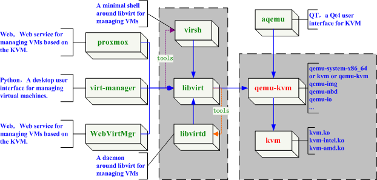

# 2. qemu-kvm 创建的三种文件描述符: kvm_fd, vm_fd, vcpu_fd

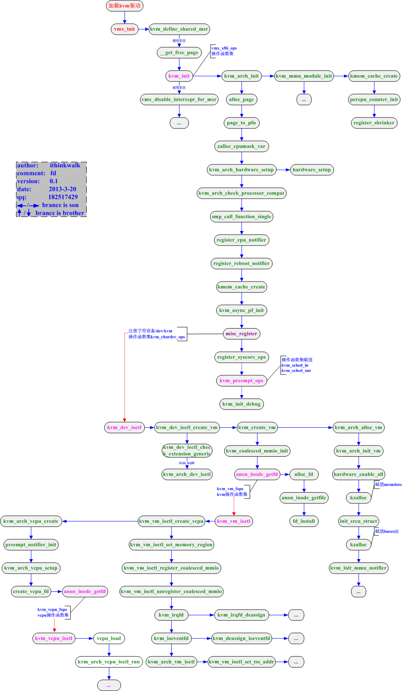

# 3. qemu-kvm 虚拟设备创建流程

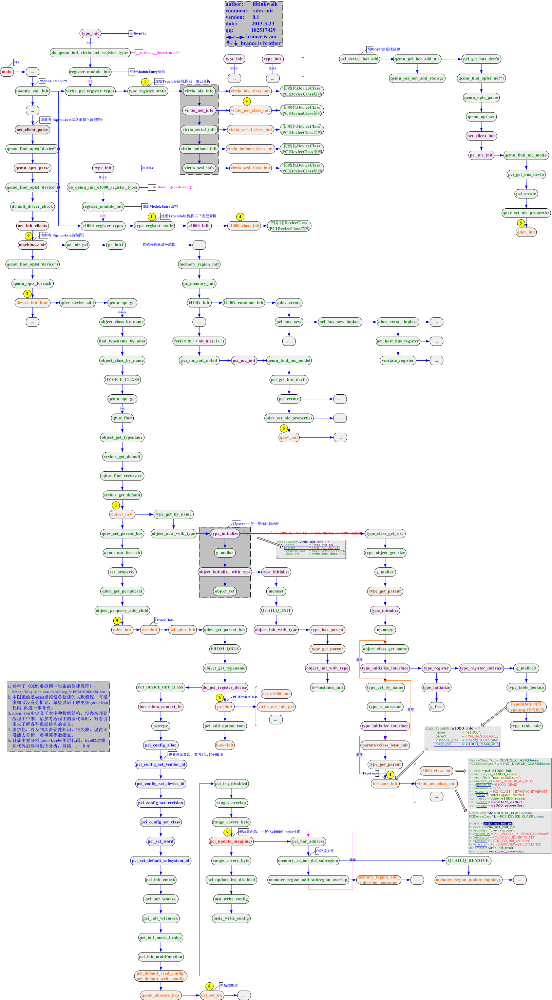

# 4. qemu-kvm 网络虚拟化

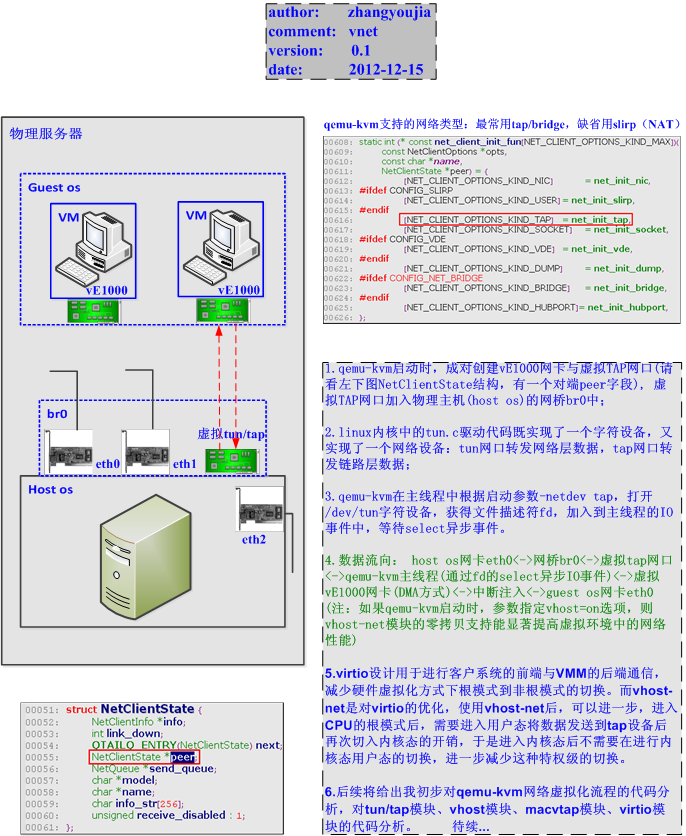

# 5. qemu-kvm 网络虚拟化流程

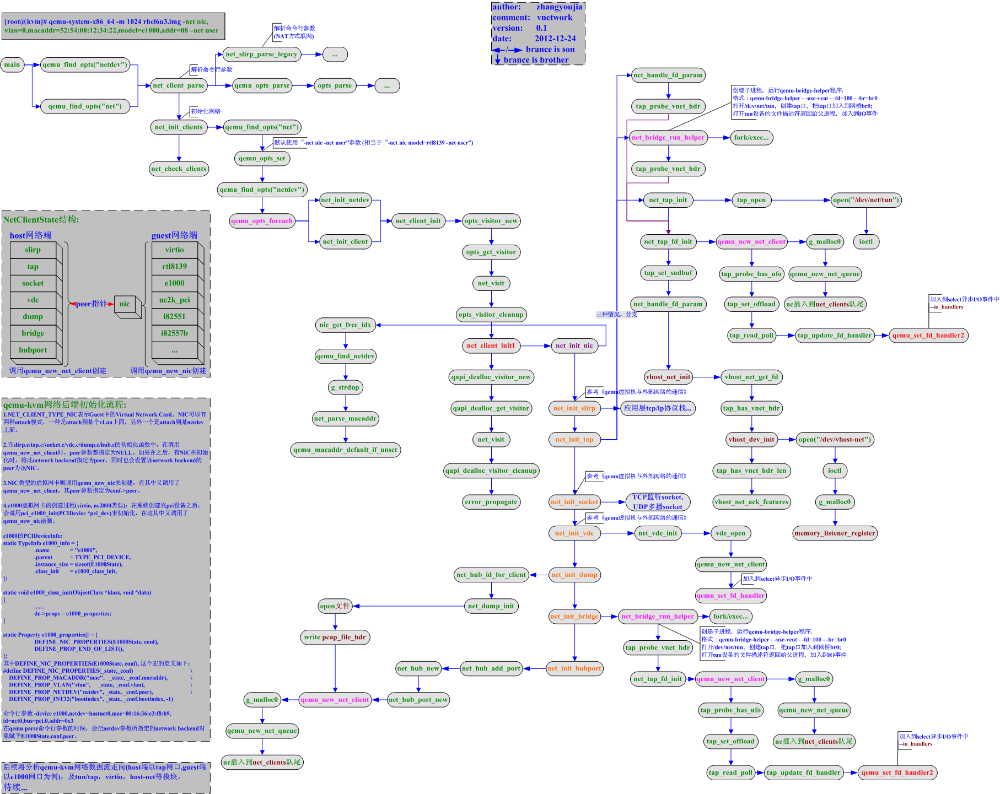

# 6. qemu-kvm 网络数据流走向

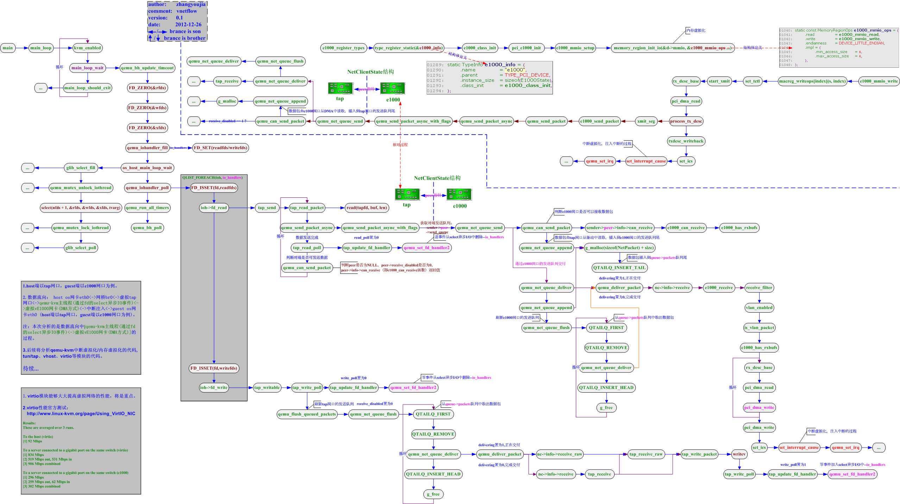

# 7. qemu_kvm_guest 之间切换流程

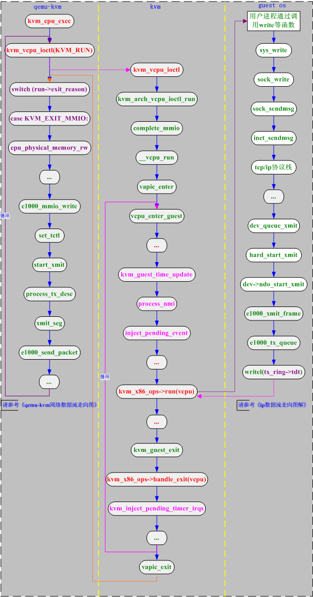

# 8. vE1000 流程

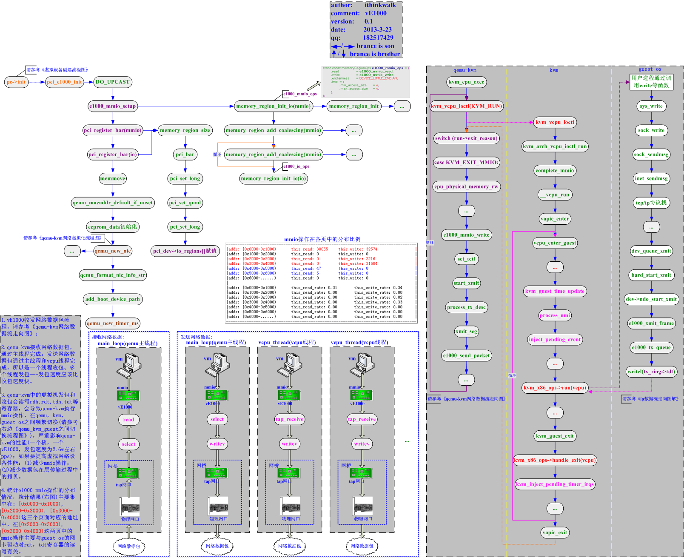

# 9. virtio-net 依赖关系

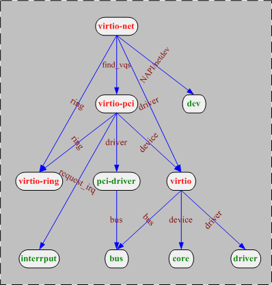

# 10. virtio-net 前端驱动实现流程

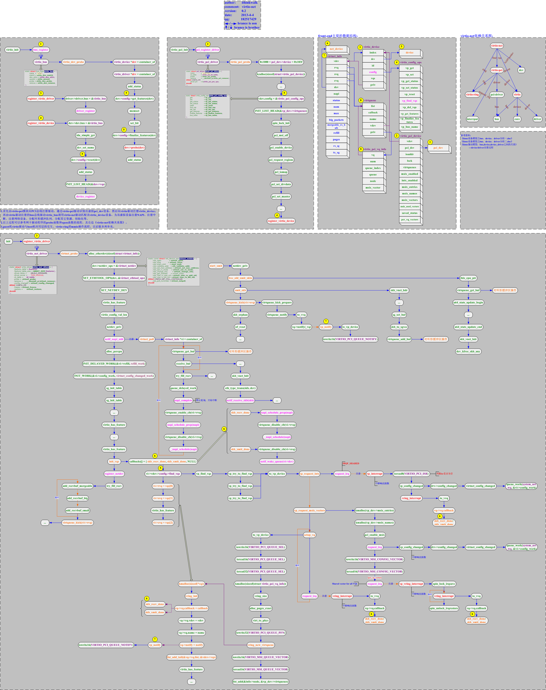

# 11. qemu-kvm 虚拟机热迁移

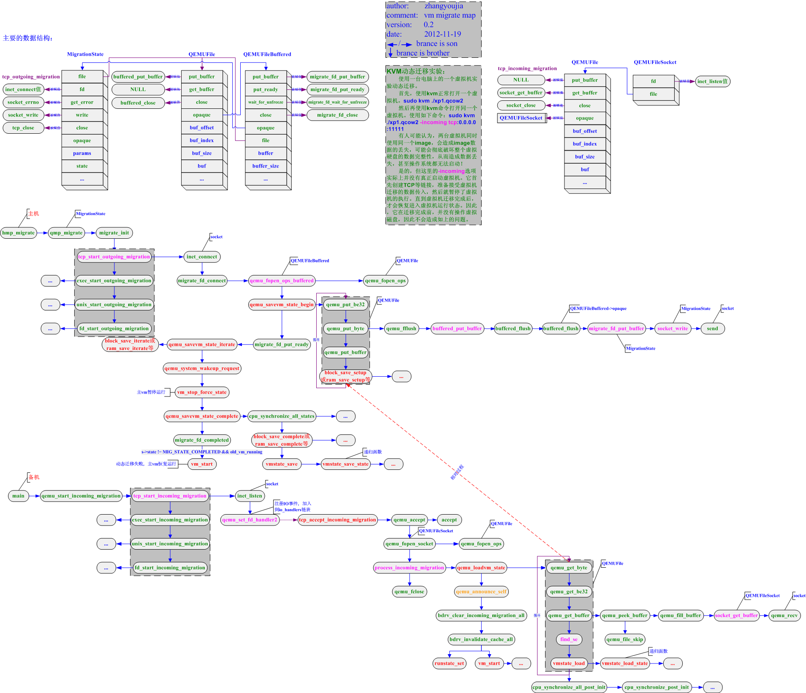

# 12. ksm 合并内存页实现流程

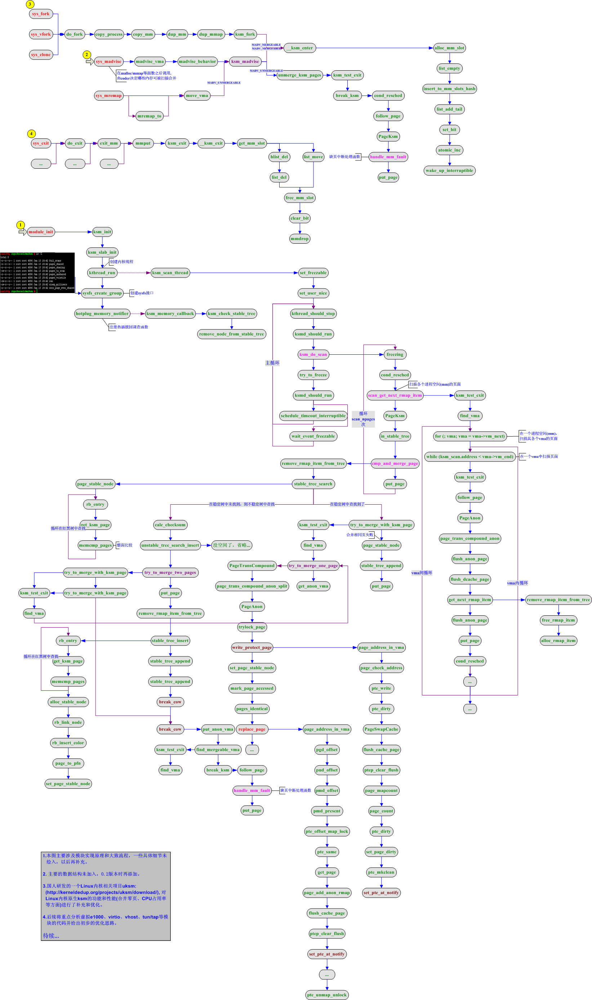

# 13. 参考

https://blog.csdn.net/u010375747/article/details/8870054