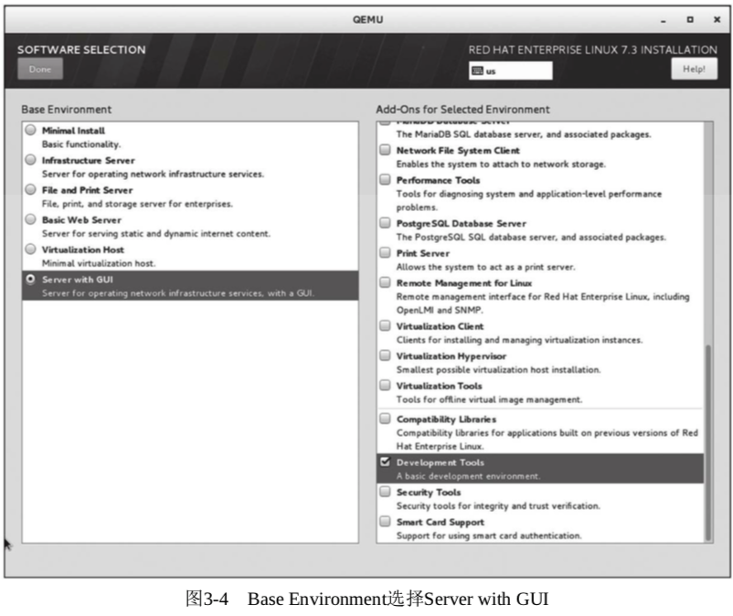

KVM 是**基于内核**的虚拟化技术的, 要运行 KVM 虚拟化环境, 安装一个 Linux 操作系统的宿主机(Host)是必需的.

选用 RHEL 来讲解 Linux 系统的安装步骤和过程, 并且本章**后面的编译和运行**都是在这个系统上进行的.

当然, KVM 作为流行的开源虚拟机之一, 可以在绝大多数流行的 Linux 系统上编译和运行, 所以依然可以选择 RHEL 之外的**其他 Linux 发行版**, 如 CentOS、Fedora、Ubuntu、Debian、OpenSuse 等系统都是不错的选择.

这里主要说明安装过程中一些值得注意的地方.

在选择哪些安装包(**SOFTWARE SELECTION**)时, 点进去选择"**Server with GUI**", 而不是默认的"Minimal Install", 如图 3-4 所示.

在选择了"Server with GUI"之后, 右侧还有可以额外增加的组件供选择(见图 3-4), 我们需要选上"**Development Tools**", 因为在本书的 KVM 编译过程中以及其他实验中可能会用到, 其中包括一些比较重要的软件包, 比如: gcc、git、make 等(一般被默认选中).

可以看到还有"**Virtualization Hypervisor**""**Virtualization Tools**", 这里可以**暂时不选它们(选上也没有关系**), 因为在本章中会自己编译 KVM 和 QEMU, 而在附录 A 介绍发行版中的 KVM 时, 我们会安装 Virtualization Host 环境, 并使用发行版中自带的 KVM Virtualization 功能.

