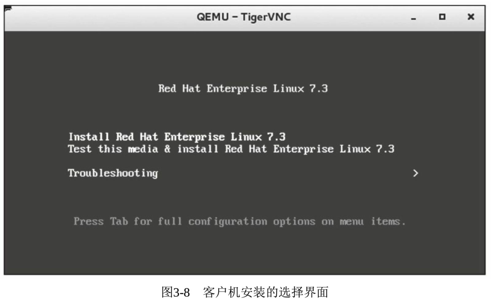

<!-- @import "[TOC]" {cmd="toc" depthFrom=1 depthTo=6 orderedList=false} -->

<!-- code_chunk_output -->

- [1. 创建镜像文件](#1-创建镜像文件)
- [2. 准备 ISO 文件](#2-准备-iso-文件)
- [3. 启动虚拟机](#3-启动虚拟机)
- [4. 安装虚拟机](#4-安装虚拟机)

<!-- /code_chunk_output -->

安装客户机(Guest)之前, 我们需要创建一个**镜像文件**或者**磁盘分区**等, 来存储客户机中的系统和文件. 关于客户机镜像有很多种制作和存储方式(将在第 4 章中进行详细的介绍).

# 1. 创建镜像文件

首先, 需要创建一个**镜像文件**. 我们使用上节中生成好的**qemu\-img**工具来完成这个任务. 它不仅用于**创建 guest**, 还可以在后续**管理 guest image**. 详见"qemu\-img \-\-help"及"man qemu\-img".

```
[root@kvm-host ~]# qemu-img create -f raw rhel7.img 40G
Formatting 'rhel7.img', fmt=raw size=42949672960
```

上述就是用 qemu\-img create 命令创建了一个空白的 guest image, 以 raw 格式, image 文件的名字是"rhel7.img", 大小是 40G. 虽然我们看到它的大小是 40G, 但是它并**不占用任何磁盘空间**.

```
[root@kvm-host ~]# ls -lh rhel7.img
-rw-r--r-- 1 root root 40G Oct 15 10:44 rhel7.img

[root@kvm-host ~]# du -h rhel7.img
0   rhel7.img
```

这是因为 qemu\-img 聪明地为你按实际需求分配文件的实际大小, 它将随着 image 实际的使用而增大.

qemu\-img 也支持设置参数让你可以一开始就实际占有 40G(当然建立的过程也就比较耗时, 还会占用你更大空间. 所以 qemu\-img 默认的方式是按需分配的), 如下:

```
[root@kvm-host ~]# qemu-img create -f raw -o preallocation=full rhel7.img 40G
Formatting 'rhel7.img', fmt=raw size=42949672960 preallocation=full

[root@kvm-host ~]# ls -lh rhel7.img
-rw-r--r-- 1 root root 40G Oct 15 10:58 rhel7.img

[root@kvm-host ~]# du -h rhel7.img
40G rhel7.img
```

除 raw 格式以外, qemu\-img 还支持创建**其他格式**的 image 文件, 比如**qcow2**, 甚至是其他虚拟机用到的文件格式, 比如**VMware**的**vmdk**、**vdi**、**vhd**等. 不同的文件格式会有**不同的"\-o"选项**.

# 2. 准备 ISO 文件

创建完空白 guest image 之后, 我们将 RHEL 7 安装所需的 ISO 文件准备好.

```
[root@kvm-host ~]# ls -l  RHEL-7.2-20151030.0-Server-x86_64-dvd1.iso
-rw-r--r-- 1 root root 4043309056 Oct 30  2015 RHEL-7.2-20151030.0-Server-x86_64-dvd1.iso
```

# 3. 启动虚拟机

启动客户机, 并在其中用准备好的 ISO 安装系统, 命令行如下:

```
qemu-system-x86_64 -enable-kvm -m 8G -smp 4 -boot once=d -cdrom RHEL-7.2-20151030.0-Server-x86_64-dvd1.iso rhel7.img -device piix3-usb-uhci -device usb-tablet
```

其中, `-m 8G`是给客户机分配 8G 内存, `-smp 4`是指定客户机为对称多处理器结构并分配 4 个 CPU, `-boot once=d`是指定系统的启动顺序为首次光驱, 以后再使用默认启动项(硬盘), `-cdrom **`是分配**客户机的光驱**, `-device piix3-usb-uhci -device usb-tablet`减少鼠标偏移.

# 4. 安装虚拟机

**默认情况**下, QEMU 会**启动一个 VNC server 端口(5900**), 可以用**vncviwer 工具**来连接到**QEMU 的 VNC 端口**查看客户机.

通过启动时的提示, 这里可以使用"vncviewer: 5900"命令**连接到 QEMU 启动的窗口**. 根据命令行指定的启动顺序, 当有 CDROM 时, 客户机默认会从光驱引导, 启动后即可进入客户机系统安装界面, 如图 3\-8 所示.



可以选择 Install 安装客户机操作系统, 和安装普通 Linux 系统类似, 根据需要做磁盘分区、选择需要的软件包等.
