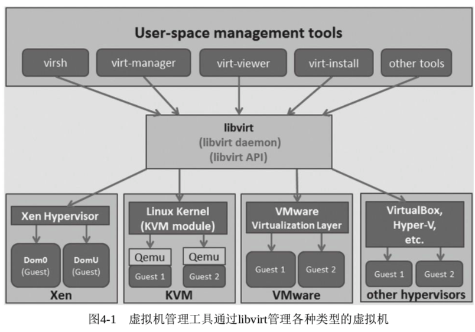
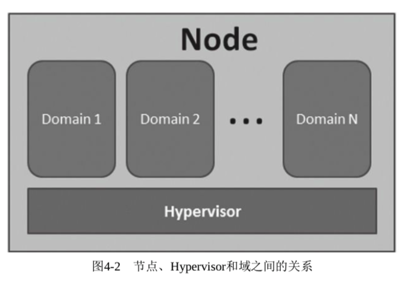

<!-- @import "[TOC]" {cmd="toc" depthFrom=1 depthTo=6 orderedList=false} -->

<!-- code_chunk_output -->

- [1. libvirt 简介](#1-libvirt-简介)
  - [1.1. 多种虚拟化方案支持](#11-多种虚拟化方案支持)
  - [1.2. LGPL 许可证](#12-lgpl-许可证)
  - [1.3. 开发者社区](#13-开发者社区)
  - [1.4. 编程语言支持](#14-编程语言支持)
  - [1.5. AMQP 协议](#15-amqp-协议)
  - [1.6. 加密认证](#16-加密认证)
  - [1.7. 基本架构](#17-基本架构)
  - [1.8. 重要概念](#18-重要概念)
  - [1.9. 管理功能](#19-管理功能)
    - [1.9.1. 域的管理](#191-域的管理)
    - [1.9.2. 远程节点的管理](#192-远程节点的管理)
    - [1.9.3. 存储的管理](#193-存储的管理)
    - [1.9.4. 网络的管理](#194-网络的管理)
    - [1.9.5. 应用程序接口](#195-应用程序接口)
  - [1.10. libvirt 组成](#110-libvirt-组成)
- [2. 基于 libvirt 所开发的开源应用](#2-基于-libvirt-所开发的开源应用)
- [3. libvirt 的安装与配置](#3-libvirt-的安装与配置)
  - [3.1. libvirt 安装](#31-libvirt-安装)
  - [3.2. libvirt 的配置文件](#32-libvirt-的配置文件)
    - [3.2.1. /etc/libvirt/libvirt.conf](#321-etclibvirtlibvirtconf)
    - [3.2.2. /etc/libvirt/libvirtd.conf](#322-etclibvirtlibvirtdconf)
    - [3.2.3. /etc/libvirt/qemu.conf](#323-etclibvirtqemuconf)
    - [3.2.4. /etc/libvirt/qemu/ 目录](#324-etclibvirtqemu-目录)
- [4. libvirtd 的使用](#4-libvirtd-的使用)
- [5. libvirt 域的 XML 配置文件](#5-libvirt-域的-xml-配置文件)
  - [5.1. 客户机的 XML 配置文件格式的示例](#51-客户机的-xml-配置文件格式的示例)
  - [5.2. CPU、内存、启动顺序等基本配置](#52-cpu-内存-启动顺序等基本配置)
    - [5.2.1. CPU 的配置](#521-cpu-的配置)
    - [5.2.2. 内存的配置](#522-内存的配置)
    - [5.2.3. 客户机系统类型和启动顺序: os 标签](#523-客户机系统类型和启动顺序-os-标签)
  - [5.3. 网络的配置](#53-网络的配置)
    - [5.3.1. 桥接方式的网络配置](#531-桥接方式的网络配置)
    - [5.3.2. NAT 方式的虚拟网络配置](#532-nat-方式的虚拟网络配置)
      - [5.3.2.1. 默认配置](#5321-默认配置)
    - [5.3.3. 用户模式网络的配置](#533-用户模式网络的配置)
    - [5.3.4. 网卡设备直接分配 (VT\-d)](#534-网卡设备直接分配-vt-d)
      - [5.3.4.1. interface 方式: 仅支持 SRIOV 的 VF 透传](#5341-interface-方式-仅支持-sriov-的-vf-透传)
      - [5.3.4.2. hostdev 方式: VF 透传和直接透传](#5342-hostdev-方式-vf-透传和直接透传)
  - [5.4. 存储的配置](#54-存储的配置)
  - [5.5. 其他配置简介](#55-其他配置简介)
    - [5.5.1. 域的配置](#551-域的配置)
    - [5.5.2. 域的元数据配置](#552-域的元数据配置)
    - [5.5.3. QEMU 模拟器的配置](#553-qemu-模拟器的配置)
    - [5.5.4. 图形显示方式](#554-图形显示方式)
    - [5.5.5. 客户机声卡和显卡的配置](#555-客户机声卡和显卡的配置)
    - [5.5.6. 串口和控制台](#556-串口和控制台)
    - [5.5.7. 输入设备](#557-输入设备)
    - [5.5.8. PCI 控制器](#558-pci-控制器)
- [6. libvirt API 简介](#6-libvirt-api-简介)
  - [6.1. 连接 Hypervisor 相关的 API](#61-连接-hypervisor-相关的-api)
  - [6.2. 域管理的 API](#62-域管理的-api)
  - [6.3. 节点管理的 API](#63-节点管理的-api)
  - [6.4. 网络管理的 API](#64-网络管理的-api)
  - [6.5. 存储卷管理的 API](#65-存储卷管理的-api)
  - [6.6. 存储池管理的 API](#66-存储池管理的-api)
  - [6.7. 事件管理的 API](#67-事件管理的-api)
  - [6.8. 数据流管理的 API](#68-数据流管理的-api)
- [7. 建立到 Hypervisor 的连接](#7-建立到-hypervisor-的连接)
  - [7.1. 本地 URI](#71-本地-uri)
  - [7.2. 远程 URI](#72-远程-uri)
  - [7.3. 使用 URI 建立到 Hypervisor 的连接](#73-使用-uri-建立到-hypervisor-的连接)
- [8. libvirt API 使用示例](#8-libvirt-api-使用示例)
  - [8.1. libvirt 的 C API 的使用](#81-libvirt-的-c-api-的使用)
    - [8.1.1. 启动 libvirtd 守护进程](#811-启动-libvirtd-守护进程)
    - [8.1.2. libvirt\-devel 软件包](#812-libvirt-devel-软件包)
    - [8.1.3. C 程序查询](#813-c-程序查询)
    - [8.1.4. virsh 命令查询](#814-virsh-命令查询)
  - [8.2. libvirt 的 Python API 的使用](#82-libvirt-的-python-api-的使用)

<!-- /code_chunk_output -->

# 1. libvirt 简介

libvirt 的主要目标是为包括 Xen 在内的各种虚拟化工具提供一套方便、可靠的**编程接口**, 用一种单一的方式管理多种不同的虚拟化提供方式和 Hypervisor, 避免学习、使用不同 Hypervisor 的特定工具.

libvirt 本身**不是一种工具**, 它为虚拟化管理工具提供**API**(Application Programming Interface, 应用程序编程接口); 当前主流 Linux 平台上默认的虚拟化管理工具 **virsh**、**virt-manager** (**图形化**)、**virt-install**(**命令行模式**)和云计算框架平台(如 OpenStack、ZStack、OpenNebula、Eucalyptus 等)等都是**基于 libvirt 开发**而成的.

libvirt 是为了更方便地管理平台虚拟化技术而设计的开放源代码的应用程序接口、守护进程和管理工具, 它不仅提供了对**虚拟化客户机的管理**, 也提供了对**虚拟化网络和存储的管理！！！**.

关于 libvirt 的官方描述如下.

- libvirt 是一种为最新的 Linux(及其他操作系统)提供虚拟化功能的工具包.
- libvirt 是遵循 GUN 公共许可的免费软件.
- libvirt 是一种长期稳定的 C 语言 API.
- libvirt 提供一组通用语言的绑定.
- libvirt 是一个 DMTF(Distributed Management Task Force, 分布式管理任务组)虚拟化模式的 CIM(Computer Integrated Manufacturing, 计算机集成制造)提供者.
- libvirt 是一个实现 AMQP(Advanced Message Queuing Protocol, 消息队列协议)/Qpid(AMQP 的一个实现)消息系统的 QMF(Query Management Facility, 查询管理应用程序)代理.

## 1.1. 多种虚拟化方案支持

libvirt 支持**多种虚拟化方案**, 既支持包括**KVM**、**QEMU**、**Xen**、**VMware**、**VirtualBox**、**Hyper\-V**等在内的**平台虚拟化方案**, 也支持**OpenVZ**、**LXC**等**Linux 容器虚拟化系统！！！**, 还支持**用户态 Linux(UML！！！**)的**虚拟化**.

## 1.2. LGPL 许可证

libvirt 是一个免费的开源的软件, 使用的许可证是 LGPL(**GNU 宽松的通用公共许可证**), 使用 libvirt 库进行链接的软件程序**不一定要选择开源和遵守 GPL 许可证**.

## 1.3. 开发者社区

和 KVM、Xen 等开源项目类似, libvirt 也有自己的**开发者社区**, 而且随着虚拟化、云计算等成为近年来的技术热点, libvirt 项目的社区也比较活跃.

目前, libvirt 的开发主要由 Redhat 公司作为强大的支持, 由于 Redhat 公司在虚拟化方面逐渐偏向于支持 KVM(而不是 Xen), 故 libvirt 对 QEMU/KVM 的支持是非常成熟和稳定的.

当然, IBM、Novell 等公司以及众多的个人开发者对 libvirt 项目的代码贡献量也是非常大的.

## 1.4. 编程语言支持

libvirt 本身提供了一套较为稳定的**C 语言应用程序接口**, 目前, 在其他一些流行的**编程语言**中也提供了对 libvirt 的绑定, 在 Python、Perl、Java、Ruby、PHP、OCaml 等高级编程语言中已经有**libvirt 的程序库**可以直接使用.

## 1.5. AMQP 协议

libvirt 还提供了为基于**AMQP(高级消息队列协议**)的**消息系统**(如 Apache Qpid)提供**QMF 代理**, 这可以让云计算管理系统中**宿主机与客户机**、**客户机与客户机**之间的消息通信变得更易于实现.

## 1.6. 加密认证

libvirt 还为安全地**远程管理虚拟客户机**提供了**加密和认证**等安全措施.

正是由于 libvirt 拥有这些强大的功能和较为稳定的应用程序接口, 而且它的许可证(license)也比较宽松, 所以 libvirt 的应用程序接口已被广泛地用在基于虚拟化和云计算的解决方案中, 主要作为**连接底层 Hypervisor**和**上层应用程序**的一个**中间适配层**.

## 1.7. 基本架构

libvirt 对多种不同的 Hypervisor 的支持是通过一种**基于驱动程序的架构**来实现的. libvirt 对**不同的 Hypervisor**提供了**不同的驱动**: 对 Xen 有 Xen 的驱动, 对 QEMU/KVM 有 QEMU 驱动, 对 VMware 有 VMware 驱动. 在 libvirt 源代码中, 可以很容易找到**qemu\_driver.c**、**xen\_driver.c**、**xenapi\_driver.c**、**VMware\_driver.c**、**vbox\_driver.c**这样的驱动程序源代码文件.

libvirt 作为中间适配层, 可以让底层 Hypervisor 对上层用户空间的管理工具是完全透明的, 因为 libvirt 屏蔽了底层各种 Hypervisor 的细节, 为上层管理工具提供了一个统一的、较稳定的接口(API). 通过 libvirt, 一些用户空间管理工具可以管理各种不同的 Hypervisor 和上面运行的客户机, 它们之间基本的交互框架如图 4-1 所示.



注: **virsh**、**virsh\-manager**、**virt\-viewer**、**virt\-install**等都是 libvirt 工具

## 1.8. 重要概念

在 libvirt 中涉及几个重要的概念, 解释如下:

- **节点(Node**)是一个**物理机器**, 上面可能运行着多个虚拟客户机. Hypervisor 和 Domain 都运行在节点上.
- **Hypervisor**也称**虚拟机监控器(VMM**), 如 KVM、Xen、VMware、Hyper\-V 等, 是**虚拟化中的一个底层软件层**, 它可以虚拟化一个节点让其运行多个虚拟客户机(不同客户机可能有不同的配置和操作系统).
- **域(Domain**)是在 Hypervisor 上运行的一个**客户机操作系统实例**. 域也被称为实例(instance, 如在亚马逊的 AWS 云计算服务中客户机就被称为实例)、客户机操作系统(guest OS)、虚拟机(virtual machine), 它们都是指同一个概念.

节点、Hypervisor 和域的关系可以简单地用图 4\-2 来表示.



## 1.9. 管理功能

在了解了节点、Hypervisor 和域的概念之后, 用一句话概括 libvirt 的目标, 那就是: 为了**安全高效地管理节点上的各个域**, 而提供一个**公共的稳定的软件层**. 当然, 这里的管理, 既包括**本地的管理**, 也包含**远程的管理**.

具体地讲, libvirt 的**管理功能**主要包含如下 5 个部分.

### 1.9.1. 域的管理

1)**域的管理**.

包括对节点上的域的各个**生命周期的管理**, 如启动、停止、暂停、保存、恢复和**动态迁移**. 还包括对**多种设备类型**的**热插拔操作**, 包括磁盘、网卡、内存和 CPU. 当然不同的 Hypervisor 上对这些热插拔的支持程度有所不同.

### 1.9.2. 远程节点的管理

2)**远程节点的管理**.

只要**物理节点**上运行了**libvirtd 这个守护进程**, 远程的管理程序就可以连接到该节点进程管理操作, 经过认证和授权之后, **所有的 libvirt 功能**都可以被访问和使用. libvirt 支持**多种网络远程传输类型**, 如**SSH**、**TCP 套接字**、**Unix domain socket**、**TLS 的加密传输**等. 假设使用了最简单的 SSH, 不需要额外的配置工作, 比如, 在 example.com 节点上运行了 libvirtd, 而且允许 SSH 访问, 在远程的某台管理机器上就可以用如下的命令行来连接到 example.com 上, 从而管理其上的域.

```
virsh -c qemu+ssh://root@example.com/system
```

### 1.9.3. 存储的管理

3)**存储的管理**.

任何运行了**libvirtd 守护进程的主机！！！**, 都可以通过**libvirt**来管理**不同类型的存储！！！**, 如创建不同格式的**客户机镜像**(qcow2、raw、qde、vmdk 等)、**挂载 NFS 共享存储系统**、查看**现有的 LVM 卷组**、创建**新的 LVM 卷组和逻辑卷**、**对磁盘设备分区**、**挂载 iSCSI 共享存储**、**使用 Ceph 系统支持的 RBD 远程存储**, 等等.

当然在 libvirt 中, 对存储的管理也是支持远程的.

### 1.9.4. 网络的管理

4)**网络的管理**.

任何运行了**libvirtd 守护进程的主机**, 都可以通过 libvirt 来管理**物理的和逻辑的网络接口**. 包括列出现有的网络接口卡, 配置网络接口, 创建虚拟网络接口, 网络接口的桥接, VLAN 管理, NAT 网络设置, 为客户机分配虚拟网络接口, 等等.

### 1.9.5. 应用程序接口

5)提供一个稳定、可靠、高效的**应用程序接口**, 以便可以完成前面的 4 个管理功能.

## 1.10. libvirt 组成

libvirt 主要由 3 个部分组成, 分别是: **应用程序编程接口库**、**一个守护进程(libvirtd**)和**一个默认命令行管理工具(virsh**).

- **应用程序接口**是为其他虚拟机管理工具(如**virsh、virt-manager、virt\-viewer、virt\-install**等)提供虚拟机管理的**程序库支持**.
- **libvirtd 守护进程**负责执行对节点上的**域的管理**工作, 在用各种工具对虚拟机进行管理时, 这个守护进程一定要处于**运行状态**中. 而且这个守护进程可以分为两种:
    - 一种是**root 权限**的**libvirtd**, 其权限较大, 可以完成所有支持的管理工作;
    - 一种是**普通用户权限**的**libvirtd**, 只能完成比较受限的管理工作.
- virsh 是 libvirt 项目中默认的对虚拟机管理的一个命令行工具, 将在 4.2 节中详细介绍.

# 2. 基于 libvirt 所开发的开源应用

libvirt 的功能强大, 目前有大量的应用程序正成功构建于 libvirt 之上.

其中一个有趣的应用程序就是 **virsh**, 它是一种虚拟 shell. 还有一种名为**virt\-install** 的应用程序, 它可用于从多个操作系统发行版供应新域.

**virt\-clone**可用于从另一个 VM 复制 VM(既包括操作系统复制, 也包括磁盘复制).

一些高级应用程序包括多用途桌面管理工具 **virt\-manager** 和安全连接到 VM 图形控制台的轻量级工具 **virt\-viewer**.

构建于 libvirt 之上的一种最重要的工具名为**oVirt**. oVirt VM 管理应用程序旨在管理单个结点上的单个 VM 或多个主机上的大量 VM. 除了可以简化大量的主机和 VM 的管理外, 它还可用于跨平台和架构自动化集群, 负载平衡和工作.

# 3. libvirt 的安装与配置

## 3.1. libvirt 安装

RHEL 系列中可以使用 yum 或 rpm 工具来安装对应的 RPM 包.

查看某系统中已经安装的 libvirt 相关的 RPM 包, 命令行如下:

```
# rpm -qa | grep libvirt
# yum install libvirt
```

当然, RHEL 7.3**默认采用 QEMU/KVM 的虚拟化方案**, 所以应该安装 QEMU 相关的软件包. 查看这些软件包的命令行操作如下:

```
[root@localhost qemu]# rpm -qa | grep '^qemu'
qemu-kvm-1.5.3-160.el7_6.1.x86_64
qemu-kvm-common-1.5.3-160.el7_6.1.x86_64
qemu-guest-agent-2.12.0-2.el7.x86_64
qemu-img-1.5.3-160.el7_6.1.x86_64

# 安装时, 运行 yum install qemu-kvm 即可
```

由于 libvirt 是**跨平台**的, 而且还支持微软公司的**Hyper\-V 虚拟化**, 所以在 Windows 上也可以安装 libvirt, 甚至可以编译 libvirt.

可以到 libvirt 官方的网页( https://libvirt.org/windows.html )中查看更多关于 libvirt 对 Windows 的支持.

## 3.2. libvirt 的配置文件

以 RHEL 7.3 为例, libvirt 相关的配置文件都在/etc/libvirt/目录之中, 如下:

```
[root@localhost qemu]# ll /etc/libvirt/
总用量 80
-rw-r--r--  1 root root   450 4 月  24 22:07 libvirt-admin.conf
-rw-r--r--  1 root root   547 4 月  24 22:07 libvirt.conf
-rw-r--r--  1 root root 16529 4 月  24 22:07 libvirtd.conf
-rw-r--r--  1 root root  1175 4 月  24 22:07 lxc.conf
drwx------. 2 root root  4096 5 月  15 19:51 nwfilter
drwx------. 3 root root    22 4 月  24 22:07 qemu
-rw-r--r--  1 root root 30306 4 月  24 22:07 qemu.conf
-rw-r--r--  1 root root  2169 4 月  24 22:07 qemu-lockd.conf
drwx------. 2 root root     6 3 月   1 09:39 secrets
-rw-r--r--  1 root root  3202 4 月  24 22:07 virtlockd.conf
-rw-r--r--  1 root root  3247 4 月  24 22:07 virtlogd.conf
[root@localhost qemu]# ll /etc/libvirt/qemu
总用量 0
drwx------. 3 root root 42 4 月  24 22:07 networks
```

下面简单介绍其中几个重要的配置文件和目录.

### 3.2.1. /etc/libvirt/libvirt.conf

libvirt.conf 文件用于配置一些**常用 libvirt 连接(通常是远程连接)的别名**. 和 Linux 中的普通配置文件一样, 在该配置文件中以井号(#)开头的行是注释, 如下:

```
[root@localhost libvirt]# cat /etc/libvirt/libvirt.conf
#
# This can be used to setup URI aliases for frequently
# used connection URIs. Aliases may contain only the
# characters  a-Z, 0-9, _, -.
#
# Following the '=' may be any valid libvirt connection
# URI, including arbitrary parameters

#uri_aliases = [
#  "hail=qemu+ssh://root@hail.cloud.example.com/system",
#  "sleet=qemu+ssh://root@sleet.cloud.example.com/system",
#]

#
# These can be used in cases when no URI is supplied by the application
# (@uri_default also prevents probing of the hypervisor driver).
#
#uri_default = "qemu:///system"
#为了演示目录, 配置了如下这个别名
uri_aliases = [
    "remote1=qemu+ssh://root@192.168.93.201/system",
]
```

其中, 配置了 remote1 这个别名, 用于指代

```
qemu+ssh//root@192.168.93.201/system
```

这个远程的 libvirt 连接. 有这个别名后, 就可以在用**virsh 等工具**或自己写**代码调用 libvirt API**时使用这个**别名**, 而不需要写完整的、冗长的 URI 连接标识了.

用 virsh 使用这个别名, 连接到远程的 libvirt 上查询当前已经启动的客户机状态, 然后退出连接. 命令行操作如下:

```
[root@kvm-host kvm_demo]# systemctl reload libvirtd
[root@kvm-host kvm_demo]# virsh -c remote1
root@192.168.93.201's password:
Welcome to virsh, the virtualization interactive terminal.

Type:  'help' for help with commands
       'quit' to quit

virsh # list
 Id    Name                           State
 ----------------------------------------------------
 1     rhel7u2-remote                 running

virsh # quit

[root@kvm-host kvm_demo]#
```

在代码中调用 libvirt API 时也可以使用这个别名来建立连接, 如下的 python 代码行就实现了使用这个别名来建立连接.

```
conn = libvirt.openReadOnly('remote1')
```

### 3.2.2. /etc/libvirt/libvirtd.conf

libvirtd.conf 是 libvirt 的**守护进程 libvirtd 的配置文件**, 被修改后需要让**libvirtd 重新加载配置文件**(或**重启 libvirtd**)才会生效.

在 libvirtd.conf 文件中, 用井号(#)开头的行是注释内容, 真正有用的配置在文件的每一行中使用"**配置项=值**"(如 tcp\_port="16509")这样配对的格式来设置.

在 libvirtd.conf 中配置了 libvirtd 启动时的许多设置, 包括是否建立 TCP、UNIX domain socket 等连接方式及其最大连接数, 以及这些连接的认证机制, 设置 libvirtd 的日志级别等.

例如, 下面的几个配置项表示

- **关闭 TLS 安全认证的连接**(默认值是打开的),
- **打开 TCP 连接**(默认是关闭 TCP 连接的),
- 设置 TCP 监听的端口,
- 设置 UNIX domain socket 的保存目录
- TCP 连接不使用认证授权方式

```conf
# 关闭 TLS 安全认证的连接
listen_tls = 0
# 打开 TCP 连接
listen_tcp = 1
# TCP 监听的端口
tcp_port = "16666"
# UNIX domain socket 的保存目录
unix_sock_dir = "/var/run/libvirt"
# TCP 连接不使用认证授权方式
auth_tcp = "none"
```
>
>注意:
>
>1. 要让**TCP、TLS 等连接生效**, 需要在**启动 libvirtd**时加上\-\-**listen 参数**(简写为\-l).
>2. 而**默认的 systemctl start libvirtd**命令在启动 libvirtd 服务时并**没带\-\-listen**参数.
>3. 所以如果要使用 TCP 等连接方式, 可以使用 libvirtd \-\-listen \-d 命令来启动 libvirtd.

以上配置选项实现将**UNIX socket**放到/**var/run/libvirt 目录**下, 启动 libvirtd 并检验配置是否生效. 命令行操作如下:

```
[root@kvm-host ~]# libvirtd --listen -d

[root@kvm-host ~]# virsh -c qemu+tcp://localhost:16666/system
Welcome to virsh, the virtualization interactive terminal.

Type:  'help' for help with commands
       'quit' to quit

virsh # quit

[root@kvm-host ~]# ls /var/run/libvirt/libvirt-sock*
/var/run/libvirt/libvirt-sock  /var/run/libvirt/libvirt-sock-ro
```

### 3.2.3. /etc/libvirt/qemu.conf

qemu.conf 是 libvirt 对**QEMU 的驱动的配置文件**, 包括 VNC、SPICE 等, 以及连接它们时采用的权限认证方式的配置, 也包括内存大页、SELinux、Cgroups 等相关配置.

### 3.2.4. /etc/libvirt/qemu/ 目录

在 qemu 目录下存放的是**使用 QEMU 驱动的域的配置文件**. 查看 qemu 目录如下:

```
[root@kvm-host ~]# ls /etc/libvirt/qemu/
networks centos7u2-1.xml centos7u2-2.xml
```

其中包括了**两个域的 XML 配置文件**(centos7u2\-1.xml 和 centos7u2\-2.xml), 这就是笔者用 virt\-manager 工具创建的两个域, 默认会将其配置文件保存到/etc/libvirt/qemu/目录下. 而其中的**networks 目录**保存了**创建一个域时默认使用的网络配置**.

# 4. libvirtd 的使用

libvirtd 是一个作为 libvirt 虚拟化管理系统中的**服务器端的守护程序**, 要让某个节点能够利用 libvirt 进行管理(无论是**本地还是远程管理！！！**), 都需要在这个节点上**运行 libvirtd 这个守护进程**, 以便让其他**上层管理工具可以连接到该节点**, **libvirtd**负责**执行**其他管理工具发送给它的**虚拟化管理操作指令**.

而 libvirt 的**客户端工具**(包括**virsh**、**virt\-manager**等)可以**连接**到**本地或远程的 libvirtd 进程**, 以便**管理节点上的客户机**(启动、关闭、重启、迁移等)、收集节点上的**宿主机！！！和客户机的配置和资源使用**状态.

在 RHEL 7.3 中, **libvirtd**是作为一个**服务(service**)配置在系统中的, 所以可以通过**systemctl 命令**来对其进行操作(RHEL 6.x 等系统中使用 service 命令). 常用的操作方式有:

- "systemctl start libvirtd"命令表示启动 libvirtd,
- "systemctl restart libvirtd"表示重启 libvirtd,
- "systemctl reload libvirtd"表示**不重启服务但重新加载配置文件**(即/etc/libvirt/**libvirtd.conf**配置文件),
- "systemctl status libvirtd"表示查询 libvirtd 服务的运行状态.

在**默认情况**下, libvirtd 在监听一个**本地！！！的 Unix domain socket！！！**, 而**没有监听基于网络**的**TCP/IP socket**, 需要使用"\-l 或\-\-listen"的命令行参数来开启对**libvirtd.conf 配置文件**中**TCP/IP socket 的配置！！！**.

另外, libvirtd 守护进程的**启动或停止**, 并**不会直接影响正在运行中的客户机！！！**.

libvirtd 在**启动或重启完成时**, 只要**客户机的 XML 配置文件！！！** 是存在的, libvirtd 会**自动加载这些客户的配置！！！**, 获取它们的**信息**.

当然, 如果客户机**没有**基于 libvirt 格式的**XML 文件**来运行(例如直接使用**qemu 命令行**来启动的客户机), libvirtd 则**不能自动发现**它.

libvirtd 是一个可执行程序, 不仅可以使用"systemctl"命令调用它作为服务来运行, 而且可以**单独地运行 libvirtd 命令**来使用它. 下面介绍几种 libvirtd 命令行的参数.

(1)\-d 或\-\-daemon

表示让 libvirtd 作为**守护进程**(daemon)在**后台运行**.

(2)\-f 或\-\-config FILE

指定**libvirtd 的配置文件为 FILE**, 而不是使用默认值(通常是/**etc/libvirt/libvirtd.conf**).

(3)\-l 或\-\-listen

开启配置文件中配置的 TCP/IP 连接.

(4)\-p 或\-\-pid\-file FILE

将 l**ibvirtd 进程的 PID 写入 FILE 文件**中, 而**不是使用默认值**(通常是/**var/run/libvirtd.pid**).

(5)\-t 或\-\-timeout SECONDS

设置**对 libvirtd 连接的超时时间**为 SECONDS 秒.

(6)\-v 或\-\-verbose

执行命令**输出详细的输出信息**. 特别是在运行出错时, 详细的输出信息便于用户查找原因.

(7)\-\-version

显示**libvirtd 程序的版本信息**.

关于 libvirtd 命令的使用, 几个简单的命令行操作演示如下:

```
#使用 libvirtd 命令前, 先停止已运行的服务
[root@kvm-host ~]# systemctl stop libvirtd
[root@kvm-host ~]# libvirtd --version
libvirtd (libvirt) 2.0.0

[root@kvm-host ~]# libvirtd
^C  #没有以 daemon 的形式启动, 标准输出被 libvirtd 占用; 这里用 Ctrl+C 组合键结束 libvirtd 进程, 以便继续进行后续操作

[root@kvm-host ~]# libvirtd -l -d -p /root/libvirtd.pid
[root@kvm-host ~]# cat /root/libvirtd.pid
8136
```

# 5. libvirt 域的 XML 配置文件

在**使用 libvirt！！！对虚拟化系统进行管理**时, 很多地方都是以**XML 文件作为配置文件！！！** 的, 包括**客户机(域)的配置**、**宿主机网络接口配置**、**网络过滤**、各个**客户机的磁盘存储配置**、**磁盘加密**、**宿主机和客户机的 CPU 特性**, 等等.

本节**只针对客户机的 XML**进行较详细介绍, 因为客户机的配置是最基本的和最重要的, 了解了它之后就可以使用 libvirt 管理客户机了.

## 5.1. 客户机的 XML 配置文件格式的示例

在 libvirt 中, 客户机(即域)的配置是采用 XML 格式来描述的. 下面展示了笔者使用 virt\-manager 创建的一个客户机的配置文件(即在 4.1.2 节中看到的 centos7u2\-1.xml 文件), 后面几节将会分析其中的主要配置项目.

```xml
<!--
WARNING: THIS IS AN AUTO-GENERATED FILE. CHANGES TO IT ARE LIKELY TO BE OVERWRITTEN AND LOST. Changes to this xml configuration should be made using:
    virsh edit centos7u2-1
or other application using the libvirt API.
-->

<domain type='kvm'>
    <name>centos7u2-1</name>
    <uuid>2f6260bf-1283-4933-aaef-fa82148537ba</uuid>
    <memory unit='KiB'>2097152</memory>
    <currentMemory unit='KiB'>2097152</currentMemory>
    <vcpu placement='static'>2</vcpu>
    <os>
        <type arch='x86_64' machine='pc-i440fx-rhel7.0.0'>hvm</type>
        <boot dev='hd'/>
        <boot dev='cdrom'/>
    </os>
    <features>
        <acpi/>
        <apic/>
    </features>
    <cpu mode='custom' match='exact'>
        <model fallback='allow'>Haswell-noTSX</model>
    </cpu>
    <clock offset='utc'>
        <timer name='rtc' tickpolicy='catchup'/>
        <timer name='pit' tickpolicy='delay'/>
        <timer name='hpet' present='no'/>
    </clock>
    <on_poweroff>destroy</on_poweroff>
    <on_reboot>restart</on_reboot>
    <on_crash>restart</on_crash>
    <pm>
        <suspend-to-mem enabled='no'/>
        <suspend-to-disk enabled='no'/>
    </pm>
    <devices>
        <emulator>/usr/libexec/qemu-kvm</emulator>
        <disk type='file' device='disk'>
            <driver name='qemu' type='qcow2' cache='none'/>
            <source file='/var/lib/libvirt/images/centos7u2.qcow2'/>
            <target dev='vda' bus='virtio'/>
            <address type='pci' domain='0x0000' bus='0x00' slot='0x07' function='0x0'/>
        </disk>
        <controller type='usb' index='0' model='ich9-ehci1'>
            <address type='pci' domain='0x0000' bus='0x00' slot='0x06' function= '0x7'/>
        </controller>
        <controller type='usb' index='0' model='ich9-uhci1'>
            <master startport='0'/>
            <address type='pci' domain='0x0000' bus='0x00' slot='0x06' function= '0x0' multifunction='on'/>
        </controller>
        <controller type='usb' index='0' model='ich9-uhci2'>
            <master startport='2'/>
            <address type='pci' domain='0x0000' bus='0x00' slot='0x06' function= '0x1'/>
        </controller>
        <controller type='usb' index='0' model='ich9-uhci3'>
            <master startport='4'/>
        <address type='pci' domain='0x0000' bus='0x00' slot='0x06' function='0x2'/>
            </controller>
        <controller type='pci' index='0' model='pci-root'/>
        <controller type='virtio-serial' index='0'>
            <address type='pci' domain='0x0000' bus='0x00' slot='0x05' function= '0x0'/>
        </controller>
        <interface type='network'>
            <mac address='52:54:00:36:32:aa'/>
            <source network='default'/>
            <model type='virtio'/>
            <address type='pci' domain='0x0000' bus='0x00' slot='0x03' function= '0x0'/>
        </interface>
        <serial type='pty'>
            <target port='0'/>
        </serial>
        <console type='pty'>
            <target type='serial' port='0'/>
        </console>
        <channel type='unix'>
            <source mode='bind' path='/var/lib/libvirt/qemu/channel/target/domain- centos7u2/org.qemu.guest_agent.0'/>
            <target type='virtio' name='org.qemu.guest_agent.0'/>
            <address type='virtio-serial' controller='0' bus='0' port='1'/>
        </channel>
        <channel type='spicevmc'>
            <target type='virtio' name='com.redhat.spice.0'/>
            <address type='virtio-serial' controller='0' bus='0' port='2'/>
        </channel>
        <input type='tablet' bus='usb'/>
        <input type='mouse' bus='ps2'/>
        <input type='keyboard' bus='ps2'/>
        <graphics type='vnc' port='-1' autoport='yes'/>
        <sound model='ich6'>
            <address type='pci' domain='0x0000' bus='0x00' slot='0x04' function= '0x0'/>
        </sound>
        <video>
            <model type='qxl' ram='65536' vram='65536' vgamem='16384' heads='1'/>
            <address type='pci' domain='0x0000' bus='0x00' slot='0x02' function= '0x0'/>
        </video>
        <redirdev bus='usb' type='spicevmc'>
        </redirdev>
        <redirdev bus='usb' type='spicevmc'>
        </redirdev>
        <memballoon model='virtio'>
            <address type='pci' domain='0x0000' bus='0x00' slot='0x08' function= '0x0'/>
        </memballoon>
    </devices>
</domain>
```

由上面的配置文件示例可以看到, 在该域的 XML 文件中, **所有有效配置**都在\<**domain**\>和\<\/**domain**\>标签之间, 这表明该配置文件是**一个域的配置**.

通过**libvirt 启动客户机**, 经过**文件解析**和**命令参数的转换**, 最终也会调用**qemu 命令行工具**来**实际完成客户机的创建**.

用这个 XML 配置文件启动的客户机, 它的 qemu 命令行参数是非常详细、非常冗长的一行. 查询 qemu 命令行参数的操作如下:

```
[root@kvm-host ~]# ps -ef | grep qemu | grep centos7u2-1
qemu      5865     1 60 21:21 ?        00:00:13 /usr/libexec/qemu-kvm -name centos7u2-1 -S -machine pc-i440fx-rhel7.0.0,accel=kvm,usb=off -cpu Haswell,-rtm,-hle -m 2048 -realtime mlock=off -smp 2,sockets=2,cores=1,threads=1 -uuid 68ec2ee0-2f50-4189-bbfc-ac5d990fc93a -no-user-config -nodefaults -chardev socket,id=charmonitor,path=/var/lib/libvirt/qemu/domain-centos7u2-1/monitor.sock,server,nowait -mon chardev=charmonitor,id=monitor,mode=control -rtc base=utc,driftfix=slew -global kvm-pit.lost_tick_policy=discard -no-hpet -no-shutdown  #... 省略了更多的命令行参数
```

这里 RHEL 7.3 系统中**默认的 QEMU 工具！！！**为/**usr/libexec/qemu\-kvm！！！**, 与第 3 章中从源代码编译和安装的**qemu\-system\-x86\_64 工具是类似**的, 它们的参数也基本一致(当然如果二者版本差异较大, 参数和功能可能有一些不同).

## 5.2. CPU、内存、启动顺序等基本配置

### 5.2.1. CPU 的配置

在前面介绍的 centos7u2\-1.xml 配置文件中, 关于 CPU 的配置如下:

```xml
<vcpu placement='static'>2</vcpu>
<features>
    <acpi/>
    <apic/>
</features>
<cpu mode='custom' match='exact'>
    <model fallback='allow'>Haswell-noTSX</model>
</cpu>
```
**vcpu 标签**, 表示客户机中**vCPU 的个数**, 这里为 2.

**features 标签**, 表示 Hypervisor 为客户机**打开或关闭 CPU**或**其他硬件的特性！！！**, 这里打开了**ACPI、APIC**等特性.

当然, **CPU 的基础特性！！！** 是在**cpu 标签！！！中定义**的, 这里是之前**创建客户机时**, libvirt**自动检测了 CPU 硬件平台**, **默认**使用了**Haswell**的 CPU 给客户机. 对于这里看到的 CPU 模型: **Haswell\-noTSX**, 可以在文件/**usr/share/libvirt/cpu\_map.xml**中查看**详细描述**.

该 CPU 模型中的特性(如 SSE2、LM、NX、TSC、AVX2、SMEP 等)也是该**客户机可以看到和使用的特性**.

对于 CPU 模型的配置, 有以下 3 种模式.

1)**custom 模式**: 就是**这里**示例中表示的, **基于某个基础的 CPU 模型**, 再做**个性化的设置**.

2)**host\-model**模式: **根据物理 CPU 的特性**, 选择一个与之最接近的标准 CPU 型号, 如果没有指定 CPU 模式, **默认也是使用这种模式！！！**.

xml 配置文件为:

```xml
<cpu mode='host-model'/>
```

3)**host\-passthrough**模式: **直接将物理 CPU 特性暴露给虚拟机**使用, 在虚拟机上看到的**完全就是物理 CPU 的型号**.

xml 配置文件为:

```xml
<cpu mode='host-passthrough'/>
```

对 vCPU 的分配, 可以有更细粒度的配置, 如下:

```xml
<domain>
    ...
    <vcpu placement='static' cpuset="1-4,^3,6" current="1">2</vcpu>
    ...
</domain
```

**cpuset**表示允许到**哪些物理 CPU 上执行**, 这里表示客户机的**两个 vCPU**被允许调度到**1、2、4、6 号物理 CPU**上执行(\^3 表示**排除 3 号**); 而 current 表示**启动客户机**时**只给 1 个 vCPU**, 最多可以增加到使用 2 个 vCPU.

当然, libvirt 还提供**cputune 标签**来对 CPU 的分配进行**更多调节**, 如下:

```xml
<domain>
    ...
    <cputune>
        <vcpupin vcpu="0" cpuset="1"/>
        <vcpupin vcpu="1" cpuset="2,3"/>
        <vcpupin vcpu="2" cpuset="4"/>
        <vcpupin vcpu="3" cpuset="5"/>
        <emulatorpin cpuset="1-3"/>
        <shares>2048</shares>
        <period>1000000</period>
        <quota>-1</quota>
        <emulator_period>1000000</emulator_period>
        <emulator_quota>-1</emulator_quota>
    </cputune>
    ...
</domain>
```

这里只简单解释其中几个配置:

**vcpupin 标签**表示将**虚拟 CPU 绑定到某一个或多个物理 CPU**上, 如

```xml
<vcpupin vcpu="2" cpuset="4"/>
```

表示客户机**2 号虚拟 CPU**被绑定到**4 号物理 CPU**上;


```xml
<emulatorpin cpuset="1-3"/>
```

表示将**QEMU emulator 绑定到 1\~3 号物理 CPU**上.

在不设置任何 vcpupin 和 cpuset 的情况下, 客户机的虚拟 CPU 可能会被调度到任何一个物理 CPU 上去运行.

```xml
<shares>2048</shares>
```

表示客户机**占用 CPU 时间的加权配置**, 一个配置为 2048 的域获得的 CPU 执行时间是配置为 1024 的域的两倍. 如果**不设置 shares**值, 就会使用**宿主机系统**提供的**默认值**.

另外, 还可以配置客户机的 NUMA 拓扑, 以及让客户机针对宿主机 NUMA 的策略设置等, 读者可参考\<numa\>标签和\<numatune\>标签.

### 5.2.2. 内存的配置

在该域的 XML 配置文件中, 内存大小的配置如下:

```xml
<memory unit='KiB'>2097152</memory>
<currentMemory unit='KiB'>2097152</currentMemory>
```

可知, 内存大小为 2097152KB(即 2GB),

- **memory 标签**中的内存表示客户机**最大可使用的内存**,
- **currentMemory 标签**中的内存表示**启动时**即**分配**给客户机使用的内存.

在使用 QEMU/KVM 时, 一般将二者设置为相同的值.

另外, 内存的**ballooning**相关的配置包含在**devices 这个标签！！！的 memballoon 子标签**中, 该标签配置了该客户机的**内存气球设备**, 如下:

```xml
<memballoon model='virtio'>
    <address type='pci' domain='0x0000' bus='0x00' slot='0x08' function='0x0'/>
</memballoon>
```

该配置将**为客户机**分配一个**使用 virtio\-balloon 驱动的设备**, 以便实现客户机内存的 ballooning 调节. 该设备在客户机中的**PCI 设备编号**为**0000:00:08.0**.

### 5.2.3. 客户机系统类型和启动顺序: os 标签

客户机**系统类型及其启动顺序**在**os 标签**中配置, 如下:

```xml
<os>
    <type arch='x86_64' machine='pc-i440fx-rhel7.0.0'>hvm</type>
    <boot dev='hd'/>
    <boot dev='cdrom'/>
</os>
```

这样的配置表示**客户机类型**是**hvm 类型**, HVM(hardware virtual machine, 硬件虚拟机)原本是 Xen 虚拟化中的概念, 它**表示**在**硬件辅助虚拟化技术**(Intel VT 或 AMD\-V 等)的支持下**不需要修改客户机操作系统**就可以启动客户机.

因为 KVM 一定要依赖于硬件虚拟化技术的支持, 所以在**KVM**中, **客户机类型应该总是 hvm**, **操作系统的架构**是**x86\_64**, **机器类型**是**pc\-i440fx\-rhel7.0.0**(这是**libvirt**中针对**RHEL 7 系统**的**默认类型！！！**, 也可以根据需要修改为其他类型).

**boot 选项**用于设置客户机**启动时的设备**, 这里有**hd(即硬盘**)和**cdrom(光驱**)两种, 而且是按照**硬盘、光驱的顺序启动**的, 它们在 XML 配置文件中的**先后顺序**即启动时的先后顺序.

## 5.3. 网络的配置

### 5.3.1. 桥接方式的网络配置

在域的 XML 配置中, 使用桥接方式的网络的相关配置如下:

```xml
<devices>
    ...
    <interface type='bridge'>
        <mac address='52:54:00:e9:e0:3b'/>
        <source bridge='br0'/>
        <model type='virtio'/>
        <address type='pci' domain='0x0000' bus='0x00' slot='0x03' function='0x0'/>
    </interface>
    ...
</devices>
```

**type='bridge**'表示使用**桥接方式**使客户机获得网络,

**address**用于配置客户机中**网卡的 MAC 地址**,

\<source bridge='br0'\/\>表示使用宿主机中的**br0 网络接口**来**建立网桥**,

\<model type='virtio'\/\>表示在**客户机**中使用**virtio\-net 驱动**的网卡设备, 也配置了该网卡在客户机中的 PCI 设备编号为 0000: 00: 03.0.

### 5.3.2. NAT 方式的虚拟网络配置

在域的 XML 配置中, NAT 方式的虚拟网络的配置示例如下:

```xml
<devices>
    ...
    <interface type='network'>
        <mac address='52:54:00:32:7d:f6'/>
        <source network='default'/>
        <address type='pci' domain='0x0000' bus='0x00' slot='0x03' function='0x0'/>
    </interface>
    ...
</devices>
```

这里 type='network'和\<source network='default'\/\>表示使用 NAT 的方式, 并使用**默认的网络配置**, 客户机将会分配到**192.168.122.0/24 网段**中的一个 IP 地址.

当然, 使用 NAT**必须**保证**宿主机**中运行着**DHCP！！！** 和**DNS 服务器！！！**, 一般默认使用**dnsmasq 软件查询**.

查询 DHCP 和 DNS 服务的运行的命令行如下:

```
[root@kvm-host ~]# ps -ef | grep dnsmasq
nobody    1863     1  0 Dec08 ?        00:00:03 /usr/sbin/dnsmasq --strict-order --bind-interfaces --pid-file=/var/run/libvirt/network/default.pid --conf-file= --except-interface lo --listen-address 192.168.122.1 --dhcp-range 192.168.122.2,192.168.122.254 --dhcp-leasefile=/var/lib/libvirt/dnsmasq/default.leases --dhcp-lease-max=253 --dhcp-no-override
```

#### 5.3.2.1. 默认配置

由于配置使用了**默认的 NAT 网络配置**, 可以在 libvirt 相关的网络配置中看到一个 default.xml 文件(/**etc/libvirt/qemu/networks/default.xml**), 它具体配置了**默认的连接方式**, 如下:

```xml
<network>
    <name>default</name>
    <bridge name="virbr0" />
    <forward/>
    <ip address="192.168.122.1" netmask="255.255.255.0">
        <dhcp>
            <range start="192.168.122.2" end="192.168.122.254" />
        </dhcp>
    </ip>
</network>
```

在使用 NAT 时, 查看宿主机中网桥的使用情况如下:

```
[root@kvm-host ~]# brctl show
bridge name     bridge id               STP enabled     interfaces
virbr0          8000.525400b45ba5       yes             virbr0-nic
                                                             vnet0
```

其中**vnet0**这个**网络接口**就是**客户机**和**宿主机**网络连接的**纽带**.

### 5.3.3. 用户模式网络的配置

在域的 XML 文件中, 如下的配置即实现了使用用户模式的网络.

```xml
<devices>
    ...
    <interface type='user'>
        <mac address="00:11:22:33:44:55"/>
    </interface>
    ...
</devices>
```

其中, type='user'表示该**客户机的网络接口**是**用户模式网络**, 是**完全由 QEMU 软件！！！模拟**的一个网络协议栈.

在**宿主机**中, **没有一个虚拟的网络接口**连接到**virbr0 这样的网桥**.

### 5.3.4. 网卡设备直接分配 (VT\-d)

在客户机的网络配置中, 还可以采用**PCI/PCI\-e 网卡**将设备**直接分配**给客户机使用. 关于设备直接分配的细节, 可以参考 6.2 节中的介绍, 本节只介绍其在 libvirt 中的配置方式.

对于**设备直接分配**的配置在域的 XML 配置文件中有两种方式:

- 一种是较新的方式, 使用\<interface type='hostdev'\/\>标签;
- 另一种是较旧但支持设备很广泛的方式, 直接使用\<hostdev\>标签.

#### 5.3.4.1. interface 方式: 仅支持 SRIOV 的 VF 透传

\<interface type='hostdev'\/\>标签是较新的配置方式, 目前仅支持 libvirt 0.9.11 以上的版本, 而且**仅支持 SR\-IOV 特性**中的**VF 的直接配置**.

在\<interface type='hostdev'\/\>标签中,

用\<**driver** name='vfio'\/\>指定使用**哪一种分配方式**(默认是**VFIO**, 如果使用较旧的传统的 device assignment 方式, 这个值可配为'**kvm**'),

用\<**source**\>标签来指示将宿主机中的**哪个 VF**分配给宿主机使用,

还可使用\<mac address='52: 54: 00: 6d: 90: 02'\>来指定在客户机中看到的该网卡设备的 MAC 地址.

一个示例配置如下所示, 它表示将宿主机的 0000: 08: 10.0 这个 VF 网卡直接分配给客户机使用, 并规定该网卡在客户机中的 MAC 地址为"52: 54: 00: 6d: 90: 02".

```xml
<devices>
    ...
    <interface type='hostdev'>
        <driver name='vfio'/>
        <source>
            <address type='pci' domain='0x0000' bus='0x08' slot='0x10' function= '0x0'/>
        </source>
        <mac address='52:54:00:6d:90:02'>
    </interface>
    ...
</devices>
```

#### 5.3.4.2. hostdev 方式: VF 透传和直接透传

在\<devices\>标签中使用\<hostdev\>标签来指定将网卡设备直接分配给客户机使用, 这是**较旧的配置方式**, 是 libvirt 0.9.11 版本之前对设备直接分配的唯一使用方式, 而且对设备的支持较为广泛, 既支持有**SR\-IOV 功能**的高级网卡的**VF 的直接分配**, 也支持**无 SR\-IOV 功能的普通 PCI 或 PCI\-e 网卡的直接分配**.

这种方式并**不支持**对直接分配的网卡在客户机中的**MAC 地址的设置**, 在**客户机中网卡的 MAC 地址！！！**与宿主机中看到的**完全相同**.

在域的 XML 配置文件中, 使用\<hostdev\>标签配置网卡设备直接分配的示例如下所示, 它表示将宿主机中的 PCI 0000: 08: 00.0 设备直接分配给客户机使用.

```xml
<devices>
    ...
    <hostdev mode='subsystem' type='pci' managed='yes'>
        <source>
            <address domain='0x0000' bus='0x08' slot='0x00' function='0x0'/>
        </source>
    </hostdev>
    ...
</devices>
```

## 5.4. 存储的配置

在示例的域的 XML 配置文件中, 关于客户机磁盘的配置如下:

```xml
<devices>
    ...
    <disk type='file' device='disk'>
        <driver name='qemu' type='qcow2' cache='none'/>
        <source file='/var/lib/libvirt/images/centos7u2.qcow2'/>
        <target dev='vda' bus='virtio'/>
        <address type='pci' domain='0x0000' bus='0x00' slot='0x07' function='0x0'/>
    </disk>
    ...
</devices>
```

上面的配置表示, 使用**qcow2 格式**的 centos7u2.qcow 镜像文件作为客户机的磁盘, 其在**客户机**中使用**virtio 总线**(使用**virtio\-blk 驱动**), 设备名称为/**dev/vda**, 其 PCI 地址为**0000:00:07.0**.

\<disk\>标签是客户机**磁盘配置的主标签**, 其中包含它的属性和一些子标签.

- 它的**type 属性**表示磁盘使用**哪种类型**作为**磁盘的来源**, 其取值为**file**、**block**、**dir**或**network**中的一个, 分别表示使用**文件**、**块设备**、**目录**或**网络**作为客户机磁盘的来源.

- 它的**device 属性**表示让客户机**如何来使用该磁盘设备**, 其取值为**floppy**、**disk**、**cdrom**或**lun**中的一个, 分别表示**软盘**、**硬盘**、**光盘**和**LUN(逻辑单元号**), 默认值为**disk(硬盘**).

在\<disk\>标签中可以配置许多**子标签**, 这里仅简单介绍一下上面示例中出现的几个重要的子标签.

- \<driver\>子标签用于定义 Hypervisor**如何为该磁盘提供驱动**,

    - 它的**name 属性**用于指定**宿主机**中使用的**后端驱动名称**, QEMU/KVM**仅支持 name='qemu**', 但是它支持的类型**type 可以是多种**, 包括**raw**、**qcow2**、**qed**、**bochs**等.
    - 而这里的**cache 属性**表示在**宿主机中打开该磁盘**时使用的**缓存方式**, 可以配置为**default**、**none**、**writethrough**、**writeback**、**directsync**和**unsafe**等多种模式. 在 5.4.1 节中已经详细地介绍过磁盘缓存的各种配置方式的区别.

- \<source\>子标签表示**磁盘的来源**
    - 当\<disk\>标签的**type 属性**为**file**时, 应该配置为\<source file='/var/lib/libvirt/images/centos7u2\-1.img'\/\>这样的模式,
    - 而当**type 属性**为**block**时, 应该配置为\<source dev='/dev/sda'\/\>这样的模式.

- \<target\>子标签表示将磁盘暴露给**客户机时的总线类型和设备名称**.

    - 其**dev 属性**表示在**客户机**中该磁盘设备的**逻辑设备名称**,
    - 而**bus 属性**表示该磁盘设备**被模拟挂载的总线类型**, bus 属性的值可以为 ide、scsi、virtio、xen、usb、sata 等. 如果省略了 bus 属性, libvirt 则会根据**dev 属性中的名称**来"**推测**"bus 属性的值, 例如, **sda**会被推测是**scsi**, 而**vda**被推测是**virtio**.

- \<address\>子标签表示该**磁盘设备**在**客户机中的 PCI 总线地址**, 这个标签在前面网络配置中也是多次出现的, 如果该标签不存在, libvirt 会**自动分配**一个地址.

## 5.5. 其他配置简介

### 5.5.1. 域的配置

在域的整个 XML 配置文件中, \<domain\>标签是范围最大、最基本的标签, 是其他所有标签的根标签. 在示例的域的 XML 配置文件中, \<domain\>标签的配置如下:

```xml
<domain type='kvm'>
    ...
</domain>
```

在\<domain\>标签中可以配置**两个属性**:

- 一个是**type**, 用于表示**Hypervisor 的类型**, 可选的值为**xen**、**kvm**、**qemu**、**lxc**、kqemu、VMware 中的一个;

- 另一个是**id**, 其值是一个**数字**, 用于在该宿主机的 libvirt 中**唯一标识一个运行着的客户机**, 如果不设置 id 属性, libvirt 会按**顺序分配一个最小**的可用 ID.

### 5.5.2. 域的元数据配置

在域的 XML 文件中, 有一部分是用于配置**域的元数据**(meta data). 元数据用于表示域的属性(用于区别其他的域).

在示例的域的 XML 文件中, 元数据的配置如下:

```xml
<name>centos7u2-1</name>
<uuid>2f6260bf-1283-4933-aaef-fa82148537ba</uuid>
```

其中, name 用于表示该**客户机的名称**, **uuid**是**唯一标识该客户机的 UUID**. 在**同一个宿主机**上, 各个客户机的**名称！！！** 和**UUID！！！** 都必须是唯一的.

当然, 域的元数据还有其他很多配置, 例如 Xen 上的一个域的元数据配置如下:

```xml
<domain type='xen' id='3'>
    <name>fv0</name>
    <uuid>4dea22b31d52d8f32516782e98ab3fa0</uuid>
    <title>A short description - title - of the domain</title>
    <description>Some human readable description</description>
    <metadata>
        <app1:foo xmlns:app1="http://app1.org/app1/">..</app1:foo>
        <app2:bar xmlns:app2="http://app1.org/app2/">..</app2:bar>
    </metadata>
    ...
</domain>
```

### 5.5.3. QEMU 模拟器的配置

在域的配置文件中, 需要制定**使用的设备模型的模拟器**, 在 emulator 标签中配置**模拟器的绝对路径**. 在示例的域的 XML 文件中, 模拟器的配置如下:

```xml
<devices>
    <emulator>/usr/libexec/qemu-kvm</emulator>
    ...
</devices>
```

假设自己编译了一个最新的 QEMU, 要使用自己编译的 QEMU 作为模拟器, 只需要将这里修改为/**usr/local/bin/qemu\-system\-x86\_64**即可. 不过, 创建客户机时可能会遇到如下的错误信息:

```
[root@kvm-host ~]# virsh create rhel7u2-1.xml
error: Failed to create domain from rhel7u2-1.xml
error: internal error Process exited while reading console log output: Supported machines are:
pc                   Standard PC (alias of pc-1.1)
pc-1.1               Standard PC (default)
pc-1.0               Standard PC
pc-0.15              Standard PC
pc-0.14              Standard PC
pc-0.13              Standard PC
```

这是因为自己编译的**qemu\-system\-x86\_64**并**不支持**配置文件中的**pc\-i440fx\-rhel7.0.0 机器类型**. 做如下修改即可解决这个问题:

```xml
<type arch='x86_64' machine='pc'>hvm</type>
```

### 5.5.4. 图形显示方式

在示例的域的 XML 文件中, 对连接到客户机的图形显示方式的配置如下:

```xml
<devices>
    ...
    <graphics type='vnc' port='-1' autoport='yes'/>
    ...
</devices>
```

这表示通过**VNC**的方式连接到客户机, 其**VNC 端口**为 libvirt 自动分配.

也可以支持**其他多种类型**的**图形显示方式**, 以下就配置了**SDL**、**VNC**、**RDP**、**SPICE**等多种客户机显示方式.

```xml
<devices>
    ...
    <graphics type='sdl' display=':0.0'/>
    <graphics type='vnc' port='5904'>
        <listen type='address' address='1.2.3.4'/>
    </graphics>
    <graphics type='rdp' autoport='yes' multiUser='yes' />
    <graphics type='desktop' fullscreen='yes'/>
    <graphics type='spice'>
        <listen type='network' network='rednet'/>
    </graphics>
    ...
</devices>
```

### 5.5.5. 客户机声卡和显卡的配置

在示例的域的 XML 文件中, 该客户机的声卡和显卡的配置如下:

```xml
<devices>
    ...
    <sound model='ich6'>
        <address type='pci' domain='0x0000' bus='0x00' slot='0x04' function='0x0'/>
    </sound>
        <video>
        <model type='qxl' ram='65536' vram='65536' vgamem='16384' heads='1'/>
        <address type='pci' domain='0x0000' bus='0x00' slot='0x02' function='0x0'/>
    </video>
...
</devices>
```

\<**sound**\>标签表示的是**声卡配置**, 其中**model 属性**表示为客户机模拟出来的**声卡的类型**, 其取值为**es1370**、**sb16**、**ac97**和**ich6**中的一个.

\<**video**\>标签表示的是**显卡配置**, 其中\<**model**\>子标签表示为客户机模拟的**显卡的类型**, 它的类型(type)属性可以为**vga**、**cirrus**、**vmvga**、xen、vbox、**qxl**中的一个, **vram 属性**表示虚拟显卡的**显存容量(单位为 KB**), **heads 属性**表示显示**屏幕的序号**.

本示例中, KVM 客户机的显卡的配置为 qxl 类型、显存为 65536(即 64 MB)、使用在第 1 号屏幕上.

### 5.5.6. 串口和控制台

**串口**和**控制台**是非常有用的设备, 特别是在调试客户机的内核或遇到客户机宕机的情况下, 一般都可以在串口或控制台中查看到一些利于系统管理员分析问题的日志信息. 在示例的域的 XML 文件中, 客户机串口和控制台的配置如下:

```xml
<devices>
    ...
    <serial type='pty'>
        <target port='0'/>
    </serial>
    <console type='pty'>
        <target type='serial' port='0'/>
    </console>
    ...
</devices>
```

设置了客户机的编号为 0 的串口(即/**dev/ttyS0**), 使用**宿主机**中的**伪终端(pty**), 由于这里没有指定使用宿主机中的**哪个虚拟终端**, 因此 libvirt 会自己选择一个**空闲的虚拟终端**(可能为/**dev/pts**/下的任意一个). 当然也可以加上\<source path='/dev/pts/1'\/\>配置来明确指定使用宿主机中的哪一个虚拟终端.

在通常情况下, **控制台(console**)配置在客户机中的类型为'**serial**', 此时, 如果**没有配置串口(serial**), 则会将**控制台的配置**复制到**串口配置**中, 如果已经配置了串口(本例即是如此), 则 libvirt 会忽略控制台的配置项.

当然为了让**控制台有输出信息**并且能够与客户机交互, 也需在客户机中配置将信息输出到串口, 如在 Linux 客户机内核的启动行中添加"**console=ttyS0**"这样的配置. 在 9.5.2 节对-serial 参数的介绍中有更多和串口配置相关的内容.

### 5.5.7. 输入设备

在示例的 XML 文件中, 在客户机图形界面下进行交互的输入设备的配置如下:

```xml
<devices>
    ...
    <input type='tablet' bus='usb'/>
    <input type='mouse' bus='ps2'/>
    <input type='keyboard' bus='ps2'/>
    ...
</devices>
```

这里的配置会让 QEMU 模拟**PS2 接口的鼠标和键盘**, 还提供了**tablet**这种类型的设备, 让**光标**可以在客户机获取**绝对位置定位**.

在 5.6.3 节中将介绍 tablet 设备的使用及其带来的好处.

### 5.5.8. PCI 控制器

根据**客户机架构**的不同, libvirt**默认**会为客户机模拟一些必要的**PCI 控制器**(而**不需要在 XML 配置文件中指定！！！**), 而一些 PCI 控制器需要显式地在 XML 配置文件中配置.

在示例的域的 XML 文件中, 一些 PCI 控制器的配置如下:

```xml
<controller type='usb' index='0' model='ich9-ehci1'>
    <address type='pci' domain='0x0000' bus='0x00' slot='0x06' function='0x7'/>
</controller>
<controller type='usb' index='0' model='ich9-uhci1'>
    <master startport='0'/>
    <address type='pci' domain='0x0000' bus='0x00' slot='0x06' function='0x0' multifunction='on'/>
</controller>
<controller type='usb' index='0' model='ich9-uhci2'>
    <master startport='2'/>
    <address type='pci' domain='0x0000' bus='0x00' slot='0x06' function='0x1'/>
</controller>
<controller type='usb' index='0' model='ich9-uhci3'>
    <master startport='4'/>
    <address type='pci' domain='0x0000' bus='0x00' slot='0x06' function='0x2'/>
</controller>
<controller type='pci' index='0' model='pci-root'/>
<controller type='virtio-serial' index='0'>
    <address type='pci' domain='0x0000' bus='0x00' slot='0x05' function='0x0'/>
</controller>
```

这里显式指定了**4 个 USB 控制器**、**1 个 pci\-root**和**1 个 virtio\-serial 控制器**.

libvirt**默认**还会为客户机分配一些**必要的 PCI 设备**, 如**PCI 主桥(Host bridge**)、**ISA 桥**等.

使用示例的域的 XML 配置文件启动客户机, 在客户机中查看到的 PCI 信息如下:

```
[root@rhel7u2-1 ~]# lspci
00:00.0 Host bridge: Intel Corporation 440FX - 82441FX PMC [Natoma] (rev 02)
00:01.0 ISA bridge: Intel Corporation 82371SB PIIX3 ISA [Natoma/Triton II]
00:01.1 IDE interface: Intel Corporation 82371SB PIIX3 IDE [Natoma/Triton II]
00:01.3 Bridge: Intel Corporation 82371AB/EB/MB PIIX4 ACPI (rev 03)
00:02.0 VGA compatible controller: Redhat, Inc. QXL paravirtual graphic card (rev 04)
00:03.0 Ethernet controller: Redhat, Inc Virtio network device
00:04.0 Audio device: Intel Corporation 82801FB/FBM/FR/FW/FRW (ICH6 Family) High Definition Audio Controller (rev 01)
00:05.0 Communication controller: Redhat, Inc Virtio console
00:06.0 USB controller: Intel Corporation 82801I (ICH9 Family) USB UHCI Controller #1 (rev 03)
00:06.1 USB controller: Intel Corporation 82801I (ICH9 Family) USB UHCI Controller #2 (rev 03)
00:06.2 USB controller: Intel Corporation 82801I (ICH9 Family) USB UHCI Controller #3 (rev 03)
00:06.7 USB controller: Intel Corporation 82801I (ICH9 Family) USB2 EHCI Controller #1 (rev 03)
00:07.0 SCSI storage controller: Redhat, Inc Virtio block device
00:08.0 Unclassified device [00ff]: Redhat, Inc Virtio memory balloon
```

# 6. libvirt API 简介

libvirt 的核心价值和主要目标就是提供一套管理虚拟机的、稳定的、高效的应用程序接口(API). libvirt API 本身是用 C 语言实现的, 本节以其提供的最核心的 C 语言接口的 API 为例进行简单的介绍.

libvirt API 大致可划分为如下 8 个部分.

## 6.1. 连接 Hypervisor 相关的 API

**连接 Hypervisor**相关的 API: 以**virConnect**开头的一系列函数.

只有在与 Hypervisor 建立连接之后, 才能进行**虚拟机管理**操作, 所以连接 Hypervisor 的 API 是其他所有 API 使用的前提条件. 与 Hypervisor 建立的连接为其他 API 的执行提供了路径, 是其他**虚拟化管理功能**的基础.

通过调用**virConnectOpen**函数可以**建立一个连接**, 其返回值是一个**virConnectPtr 对象**, 该对象就代表到**Hypervisor 的一个连接**; 如果连接出错, 则返回空值(NULL).

而**virConnectOpenReadOnly**函数会建立一个**只读的连接**, 在该连接上可以使用一些**查询的功能**, 而不使用创建、修改等功能.

virConnectOpenAuth 函数提供了根据认证建立的连接.

virConnectGetCapabilities 函数返回对 Hypervisor 和驱动的功能描述的 XML 格式的字符串.

virConnectListDomains 函数返回一列域标识符, 它们代表该 Hypervisor 上的活动域.

## 6.2. 域管理的 API

**域管理**的 API: 以**virDomain 开头**的一系列函数.

虚拟机最基本的管理职能就是对各个节点上的域的管理, 故在 libvirt API 中实现了很多针对域管理的函数. 要管理域, 首先要获取 virDomainPtr 这个域对象, 然后才能对域进行操作. 有很多种方式来获取域对象, 如 virDomainPtr virDomainLookupByID(virConnectPtr conn, int id)函数是根据域的 id 值到 conn 这个连接上去查找相应的域.

类似的, virDomainLookupByName、virDomainLookupByUUID 等函数分别是根据域的名称和 UUID 去查找相应的域.

在得到某个域的对象后, 就可以进行很多操作, 可以查询域的信息(如 virDomainGetHostname、virDomainGetInfo、virDomainGetVcpus、virDomainGetVcpusFlags、virDomainGetCPUStats 等), 也可以控制域的生命周期(如 virDomainCreate、virDomainSuspend、virDomainResume、virDomainDestroy、virDomainMigrate 等).

## 6.3. 节点管理的 API

**节点管理**的 API: 以 virNode 开头的一系列函数.

域运行在物理节点之上, libvirt 也提供了对**节点**进行**信息查询和控制**的功能.

节点管理的多数函数都需要使用一个连接 Hypervisor 的对象作为其中的一个传入参数, 以便可以查询或修改该连接上的节点信息.

virNodeGetInfo 函数是获取节点的物理硬件信息, virNodeGetCPUStats 函数可以获取节点上各个 CPU 的使用统计信息, virNodeGetMemoryStats 函数可以获取节点上的内存的使用统计信息, virNodeGetFreeMemory 函数可以获取节点上可用的空闲内存大小.

还有一些设置或者控制节点的函数, 如 virNodeSetMemoryParameters 函数可以设置节点上的内存调度的参数, virNodeSuspendForDuration 函数可以让节点(宿主机)暂停运行一段时间.

## 6.4. 网络管理的 API

**网络管理**的 API: 以 virNetwork 开头的一系列函数和部分以 virInterface 开头的函数.

libvirt 也对虚拟化环境中的网络管理提供了丰富的 API.

libvirt 首先需要创建**virNetworkPtr 对象**, 然后才能**查询或控制虚拟网络**.

**查询网络相关信息**的函数有, virNetworkGetName 函数可以获取**网络的名称**, virNetworkGetBridgeName 函数可以获取该网络中**网桥的名称**, virNetworkGetUUID 函数可以获取**网络的 UUID 标识**, virNetworkGetXMLDesc 函数可以获取**网络的以 XML 格式的描述信息**, virNetworkIsActive 函数可以查询网络是否正在使用中.

**控制或更改网络设置**的函数有, virNetworkCreateXML 函数可以根据提供的 XML 格式的字符串创建一个网络(返回 virNetworkPtr 对象), virNetworkDestroy 函数可以销毁一个网络(同时也会关闭使用该网络的域), virNetworkFree 函数可以回收一个网络(但不会关闭正在运行的域), virNetworkUpdate 函数可根据提供 XML 格式的网络配置来更新一个已存在的网络. 另外, virInterfaceCreate、virInterfaceFree、virInterfaceDestroy、virInterfaceGetName、virInterfaceIsActive 等函数可以用于创建、释放和销毁网络接口, 以及查询网络接口的名称和激活状态.

## 6.5. 存储卷管理的 API

**存储卷管理**的 API: 以 virStorageVol 开头的一系列函数.

libvirt 对**存储卷(volume**)的管理主要是对**域的镜像文件的管理**, 这些镜像文件的格式可能是 raw、qcow2、vmdk、qed 等.

libvirt 对存储卷的管理, 首先需要创建 virStorageVolPtr 这个存储卷对象, 然后才能对其进行查询或控制操作.

libvirt 提供了 3 个函数来分别通过不同的方式来获取存储卷对象, 如 virStorageVolLookupByKey 函数可以根据全局唯一的键值来获得一个存储卷对象, virStorageVolLookupByName 函数可以根据名称在一个存储资源池(storage pool)中获取一个存储卷对象, virStorageVolLookupByPath 函数可以根据它在节点上的路径来获取一个存储卷对象.

有一些函数用于查询存储卷的信息, 如 virStorageVolGetInfo 函数可以查询某个存储卷的使用情况, virStorageVolGetName 函数可以获取存储卷的名称, virStorageVolGetPath 函数可以获取存储卷的路径, virStorageVolGetConnect 函数可以查询存储卷的连接. 一些函数用于创建和修改存储卷, 如 virStorageVolCreateXML 函数可以根据提供的 XML 描述来创建一个存储卷, virStorageVolFree 函数可以释放存储卷的句柄(但是存储卷依然存在), virStorageVolDelete 函数可以删除一个存储卷, virStorageVolResize 函数可以调整存储卷的大小.

## 6.6. 存储池管理的 API

**存储池管理**的 API: 以 virStoragePool 开头的一系列函数.

libvirt 对存储池(pool)的管理包括对**本地的基本文件系统**、**普通网络共享文件系统**、**iSCSI 共享文件系统**、**LVM 分区**等的管理.

libvirt 需要基于 virStoragePoolPtr 这个存储池对象才能进行查询和控制操作.

一些函数可以通过查询获取一个存储池对象, 如 virStoragePoolLookupByName 函数可以根据存储池的名称来获取一个存储池对象, virStoragePoolLookupByVolume 可以根据一个存储卷返回其对应的存储池对象.

virStoragePoolCreateXML 函数可以根据 XML 描述来创建一个存储池(默认已激活), virStoragePoolDefineXML 函数可以根据 XML 描述信息静态地定义一个存储池(尚未激活), virStorage PoolCreate 函数可以激活一个存储池.

virStoragePoolGetInfo、virStoragePoolGetName、virStoragePoolGetUUID 函数可以分别获取存储池的信息、名称和 UUID 标识.

virStoragePool IsActive 函数可以查询存储池状态是否处于使用中, virStoragePoolFree 函数可以释放存储池相关的内存(但是不改变其在宿主机中的状态), virStoragePoolDestroy 函数可以用于销毁一个存储池(但并没有释放 virStoragePoolPtr 对象, 之后还可以用 virStoragePoolCreate 函数重新激活它), virStoragePoolDelete 函数可以物理删除一个存储池资源(该操作不可恢复).

## 6.7. 事件管理的 API

**事件管理**的 API: 以 virEvent 开头的一系列函数.

libvirt 支持事件机制, 在使用该机制注册之后, 可以在发生**特定的事件**(如域的启动、暂停、恢复、停止等)时得到自己定义的一些**通知**.

## 6.8. 数据流管理的 API

**数据流管理**的 API: 以 virStream 开头的一系列函数.

libvirt 还提供了一系列函数用于数据流的传输.
对于 libvirt API 一些细节的使用方法和实现原理, 可以参考其源代码.

# 7. 建立到 Hypervisor 的连接

要使用 libvirt API 进行虚拟化管理, 就必须**先建立到 Hypervisor 的连接**, 因为有了连接才能管理节点、Hypervisor、域、网络等虚拟化中的要素. 本节就介绍一下建立到 Hypervisor 连接的一些方式.

对于**一个 libvirt 连接**, 可以使用简单的客户端-服务器端(C/S)的架构模式来解释, **一个服务器端**运行着**Hypervisor**, **一个客户端**去连接服务器端的 Hypervisor, 然后进行相应的虚拟化管理.

当然, 如果通过 libvirt API 实现本地的管理, 则客户端和服务器端都在同一个节点上, 并不依赖于网络连接.

一般来说(如基于 QEMU/KVM 的虚拟化方案), 不管是基于 libvirt API 的**本地管理**还是**远程管理**, 在**服务器端的节点！！！** 上, 除了需要运行相应的 Hypervisor 以外, 还需要让**libvirtd！！！这个守护进程处于运行中的状态！！！**, 以便让客户端连接到 libvirtd, 从而进行管理操作.

不过, 也**并非所有的 Hypervisor！！！**都需要运行**libvirtd 守护进程！！！**, 比如**VMware** ESX/ESXi 就不需要在服务器端运行 libvirtd, 依然可以通过 libvirt 客户端以另外的方式连接到 VMware.

由于支持**多种 Hypervisor！！！**, libvirt 需要通过**唯一的标识**来指定如何才能准确地连接到**本地或远程的 Hypervisor**.

为了达到这个目的, libvirt 使用了在互联网应用中广泛使用的**URI(Uniform Resource Identifier, 统一资源标识符！！！**)来标识到**某个 Hypervisor 的连接！！！**.

libvirt 中连接的标识符 URI, 其本地 URI 和远程 URI 有一些区别, 下面分别介绍一下它们的使用方式.

## 7.1. 本地 URI

在 libvirt 的客户端使用本地的 URI 连接本系统范围内的 Hypervisor, 本地 URI 的一般格式如下:

```
driver[+transport]:///[path][?extral-param]
```

其中,

- **driver**是**连接 Hypervisor 的驱动名称**(如**qemu**、**xen**、**xbox**、**lxc**等),

- **transport**是选择该连接所使用的**传输方式**(可以为**空**, 也可以是"**unix**"这样的值),

- **path**是连接到**服务器端上的某个路径**,

- **?extral\-param**是可以**额外添加的一些参数**(如 Unix domain sockect 的路径).

在 libvirt 中**KVM 使用 QEMU 驱动！！！**.

**QEMU 驱动**是一个**多实例的驱动**, 它提供了

- 一个**系统范围内**的**特权驱动**(即"**system**"实例)
- 一个**用户相关**的**非特权驱动**(即"**session**"实例).

通过"**qemu: ///session**"这样的 URI 可以连接到一个**libvirtd 非特权实例**, 但是这个实例必须是与**本地客户端**的**当前用户和用户组相同的实例**, 也就说, 根据**客户端**的**当前用户**和**用户组**去**服务器端**寻找**对应用户下的实例**. 在建立**session**连接后, 可以查询和控制的域或其他资源都仅仅是在**当前用户权限范围内**的, 而**不是整个节点**上的**全部域或其他资源**.

而使用"**qemu: ///system**"这样的 URI 连接到 libvirtd 实例, 是需要**系统特权账号"root"权限**的. 在建立 system 连接后, 由于它是具有最大权限的, 因此可以查询和控制**整个节点范围**内的域, 还可以管理该节点上**特权用户**才能管理的**块设备**、**PCI 设备**、**USB 设备**、**网络设备**等系统资源. 一般来说, 为了方便管理, 在公司内网范围内建立到 system 实例的连接进行管理的情况比较常见, 当然为了安全考虑, 赋予不同用户不同的权限就可以使用建立到 session 实例的连接.

在 libvirt 中, **本地连接 QEMU/KVM**的几个 URI 示例如下:

- qemu:///session

连接到**本地的 session 实例**, 该连接**仅能**管理**当前用户的虚拟化资源**.

- qemu\+unix:///session

以**Unix domain sockect**的方式连接到**本地的 session 实例**, 该连接仅能管理**当前用户的虚拟化资源**.

- qemu:///system

连接到**本地的 system 实例**, 该连接可以管理当前节点的所有特权用户可以管理的虚拟化资源.

- qemu\+unix:///system

以 Unix domain sockect 的方式连接到本地的 system 实例, 该连接可以管理当前节点的所有特权用户可以管理的虚拟化资源.

## 7.2. 远程 URI

除了本地管理, libvirt 还提供了非常方便的远程的虚拟化管理功能. libvirt 可以使用远程 URI 来建立到网络上的 Hypervisor 的连接. 远程 URI 和本地 URI 是类似的, 只是会增加用户名、主机名(或 IP 地址)和连接端口来连接到远程的节点. 远程 URI 的一般格式如下:

```
driver[+transport]://[user@][host][:port]/[path][?extral-param]
```

其中,
- **transport**表示**传输方式**, 其取值可以是**ssh**、**tcp**、**libssh2**等;
- **user**表示连接**远程主机**使用的**用户名**,
- **host**表示远程主机的**主机名或 IP 地址**,
- **port**表示连接远程主机的**端口**.

其余参数的意义与本地 URI 中介绍的完全一样.

在远程 URI 连接中, 也存在使用**system 实例**和**session 实例**两种方式, 这二者的区别和用途, 与本地 URI 中介绍的内容是完全一样的.

在 libvirt 中, **远程连接 QEMU/KVM**的 URI 示例如下:

- qemu+ssh://root@example.com/system

通过 ssh 通道连接到远程节点的**system 实例**, 具有最大的权限来管理远程节点上的虚拟化资源. 建立该远程连接时, 需要经过**ssh 的用户名和密码验证**或者**基于密钥的验证**.

- qemu+ssh://user@example.com/session

通过 ssh 通道连接到远程节点的使用**user 用户**的**session 实例**, 该连接仅能对 user 用户的虚拟化资源进行管理, 建立连接时同样需要经过 ssh 的验证.

- qemu://example.com/system

通过建立**加密的 TLS 连接**与远程节点的 system 实例相连接, 具有对该节点的特权管理权限. 在建立该远程连接时, 一般需要经过 TLS x509 安全协议的证书验证.

- qemu+tcp://example.com/system

通过建立非加密的**普通 TCP 连接**与远程节点的 system 实例相连接, 具有对该节点的特权管理权限. 在建立该远程连接时, 一般需要经过 SASL/Kerberos 认证授权.

## 7.3. 使用 URI 建立到 Hypervisor 的连接

在**某个节点启动 libvirtd**后, 一般在**客户端**都可以通过**ssh 方式**连接到该节点. 而**TLS 和 TCP 等连接方式**却不一定都处于**开启可用状态**, 如 RHEL 7.3 系统中的**libvirtd 服务**在启动时就**默认没有打开 TLS 和 TCP 这两种连接方式**. 关于 libvirtd 的配置可以参考 4.1.2 节中的介绍. 而在服务器端的 libvirtd 打开了 TLS 和 TCP 连接方式, 也需要一些认证方面的配置, 当然也可直接关闭认证功能(这样不安全), 可以参考 libvirtd.conf 配置文件.

我们看到, URI 这个标识还是比较复杂的, 特别是在管理很多远程节点时, 需要使用很多的 URI 连接. 为了简化系统管理的复杂程度, 可以在客户端的 libvirt 配置文件中为 URI 命名别名, 以方便记忆, 这在 4.1.2 节中已经介绍过了.

在 4.1.4 节中已经介绍过, **libvirt**使用 virConnectOpen 函数来建立到 Hypervisor 的连接, 所以**virConnectOpen 函数**就需要一个**URI 作为参数**.

而当传递给 virConnectOpen 的**URI 为空值(NULL**)时, libvirt 会依次根据如下**3 条规则**去决定使用**哪一个 URI**.

1)试图使用**LIBVIRT\_DEFAULT\_URI**这个**环境变量**.

2)试用使用**客户端的 libvirt 配置文件**中的**uri\_default 参数**的值.

3)依次尝试用**每个 Hypervisor 的驱动**去建立连接, 直到能正常建立连接后即停止尝试.

当然, 如果这 3 条规则都不能够让客户端 libvirt 建立到 Hypervisor 的连接, 就会报出建立连接失败的错误信息("failed to connect to the hypervisor").

在使用**virsh**这个**libvirt 客户端工具**时, 可以用"\-c"或"\-\-**connect**"选项来指定建立到**某个 URI 的连接**. 只有连接建立之后, 才能够操作. 使用 virsh 连接到本地和远程的 Hypervisor 的示例如下:

```
[root@kvm-host ~]# virsh -c qemu:///system
Welcome to virsh, the virtualization interactive terminal.
virsh # list
 Id    Name                           State
----------------------------------------------------
 1     rhel7u1-1                      running
 2     rhel7u2-2                      running

virsh # quit

[root@kvm-host ~]# virsh -c qemu+tcp://localhost:16666/system
Welcome to virsh, the virtualization interactive terminal.
virsh # list
 Id    Name                           State
----------------------------------------------------
 1     rhel7u1-1                      running
 2     rhel7u2-2                      running

virsh # quit

[root@localhost ~]# virsh -c qemu+tcp://localhost/system
错误: 连接到管理程序失败
错误: 无法在 'localhost :16509' 连接到服务器: 拒绝连接

[root@kvm-host ~]# virsh -c qemu+ssh://root@192.168.158.31/system
root@192.168.158.31's password:
Welcome to virsh, the virtualization interactive terminal.

Type:  'help' for help with commands
       'quit' to quit

virsh # list
 Id    Name                           State
----------------------------------------------------
 1     rhel7u2-remote                 running

virsh # quit
```

其实, 除了针对**QEMU、Xen、LXC**等**真实 Hypervisor 的驱动**之外, libvirt 自身还提供了一个名叫"**test**"的**傀儡 Hypervisor 及其驱动程序**.

test Hypervisor 是在 libvirt 中仅仅用于**测试和命令学习的目的**, 因为在本地的和远程的 Hypervisor 都连接不上(或无权限连接)时, test 这个 Hypervisor 却一直都会处于可用状态. 使用 virsh 连接到 test Hypervisor 的示例操作如下:

```
[root@kvm-host ~]# virsh -c test:///default list
 Id    Name                           State
----------------------------------------------------
 1     test                           running

[root@kvm-host ~]# virsh -c test:///default
Welcome to virsh, the virtualization interactive terminal.

Type:  'help' for help with commands
       'quit' to quit

virsh # list
 Id    Name                           State
----------------------------------------------------
 1     test                           running

virsh # quit
```

# 8. libvirt API 使用示例

经过前面几节对 libvirt 的配置、编译、API、建立连接等内容的介绍, 相信大家对 libvirt 已经有了大致的了解. 学习 API 的最好方法就是通过代码来调用 API 实现几个小功能, 所以本节主要通过两个示例来分别演示如何调用 libvirt 的由 C 语言和 Python 语言绑定的 API.

## 8.1. libvirt 的 C API 的使用

### 8.1.1. 启动 libvirtd 守护进程

在使用 libvirt API 之前, **必须**要在**远程或本地的节点**上**启动 libvirtd 守护进程！！！**.

### 8.1.2. libvirt\-devel 软件包

在使用**libvirt 的客户端**前, 先安装**libvirt\-devel 软件包**. 本次示例中安装的是 RHEL 7.3 自带的 libvirt\-devel 软件包, 如下:

```
[root@kvm-host ~]# rpm -q libvirt-devel
libvirt-devel-2.0.0-4.el7.x86_64
```

### 8.1.3. C 程序查询

如下一个简单的 C 程序(文件名为 dominfo.c)就是通过调用 libvirt 的 API 来查询一些关于某个域的信息. 该示例程序比较简单易懂, 它仅仅是使用 libvirt API 的一个演示程序, 这里不做过多的介绍. 不过, 这里有三点需要注意:

1)需要在示例代码的开头**引入\<libvirt/libvirt.h**\>这个头文件;

2)由于只是实现查询信息的功能, 所以可以使用 virConnectOpenReadOnly 来建立只读连接;

3)这里使用了空值(NULL)作为 URI, 是让 libvirt 自动根据 4.1.5 节中介绍的**默认规则**去建立到 Hypervisor 的连接. 这里由于本地已经运行了 libvirtd 守护进程, 并启动了两个 QEMU/KVM 客户机, 所以它默认会建立到 QEMU/KVM 的连接.

```c
/**
 * Get domain information via libvirt C API.
 * Tested with libvirt-devel-2.0.0 on a RHEL 7.3 host system.
 */

#include <stdio.h>
#include <libvirt/libvirt.h>

int getDomainInfo(int id) {
    virConnectPtr conn = NULL; /* the hypervisor connection */
    virDomainPtr dom = NULL;   /* the domain being checked */
    virDomainInfo info;        /* the information being fetched */

    /* NULL means connect to local QEMU/KVM hypervisor */
    conn = virConnectOpenReadOnly(NULL);
    if (conn == NULL) {
        fprintf(stderr, "Failed to connect to hypervisor\n");
        return 1;
    }

    /* Find the domain by its ID */
    dom = virDomainLookupByID(conn, id);
    if (dom == NULL) {
        fprintf(stderr, "Failed to find Domain %d\n", id);
        virConnectClose(conn);
        return 1;
    }

    /* Get virDomainInfo structure of the domain */
    if (virDomainGetInfo(dom, &info) < 0) {
        fprintf(stderr, "Failed to get information for Domain %d\n", id);
        virDomainFree(dom);
        virConnectClose(conn);
        return 1;
    }

    /* Print some info of the domain */
    printf("Domain ID: %d\n", id);
    printf("    vCPUs: %d\n", info.nrVirtCpu);
    printf("   maxMem: %d KB\n", info.maxMem);
    printf("   memory: %d KB\n", info.memory);

    if (dom != NULL)
            virDomainFree(dom);
    if (conn != NULL)
        virConnectClose(conn);

    return 0;
}

int main(int argc, char **argv)
{
    int dom_id = 3;
    printf("-----Get domain info by ID via libvirt C API -----\n");
    getDomainInfo(dom_id);
    return 0;
}
```

在获得 dominfo.c 这个示例程序之后, 用**virsh 命令**查看当前节点中的情况, 再编译和运行这个示例程序去查询一些域的信息. 将**二者得到的一些信息进行对比**, 可以发现得到的**信息是匹配**的.

### 8.1.4. virsh 命令查询

命令行操作如下:

```
[root@kvm-host kvm_demo]# virsh list
 Id    Name                           State
----------------------------------------------------
 3     kvm-guest                      running

[root@kvm-host kvm_demo]# virsh dommemstat 3
actual 1048576
rss 680228

[root@kvm-host kvm_demo]# virsh vcpucount 3
maximum      config         2
maximum      live           2
current      config         2
current      live           2

[root@kvm-host kvm_demo]# gcc dominfo.c -o dominfo -lvirt

[root@kvm-host kvm_demo]# ./dominfo
-----Get domain info by ID via libvirt C API -----
Domain ID: 3
    vCPUs: 2
    maxMem: 1048576 KB
    memory: 1048576 KB
```

这里需要注意的是, 在使用**GCC 编译 dominfo.c**这个示例程序时, 加上了"\-**lvirt**"这个参数来指定程序**链接时依赖的库文件**, 如果不指定 libvirt 相关的共享库, 则会发生链接时错误. 在本次示例的 RHEL 7.3 系统中, 需要依赖的**libvirt 共享库**文件是/**usr/lib64/libvirt.so**, 如下:

```
[root@kvm-host ~]# ls /usr/lib64/libvirt.so
/usr/lib64/libvirt.so
```

## 8.2. libvirt 的 Python API 的使用

在 4.1.1 节中已经介绍过, 许**多种编程语言**都提供了**libvirt 的绑定**. Python 作为一种在 Linux 上比较流行的编程语言, 也提供了 libvirt API 的绑定.

在使用 Python 调用 libvirt 之前, 需要安装**libvirt\-python 软件包**, 或者自行编译和安装**libvirt**及其**Python API**.

本次示例是基于 RHEL 7.3 系统自带的 libvirt 和 libvirt-python 软件包来进行的, 对 libvirt-python 及 Python 中的 libvirt API 文件的查询, 命令行如下:

```
[root@kvm-host ~]# rpm -q libvirt-python
libvirt-python-2.0.0-2.el7.x86_64
[root@kvm-host ~]# ls /usr/lib64/python2.7/site-packages/libvirt*
/usr/lib64/python2.7/site-packages/libvirt_lxc.py      /usr/lib64/python2.7/site-packages/libvirt.py
/usr/lib64/python2.7/site-packages/libvirt_lxc.pyc     /usr/lib64/python2.7/site-packages/libvirt.pyc
/usr/lib64/python2.7/site-packages/libvirt_lxc.pyo     /usr/lib64/python2.7/site-packages/libvirt.pyo
/usr/lib64/python2.7/site-packages/libvirtmod_lxc.so   /usr/lib64/python2.7/site-packages/libvirt_qemu.py
/usr/lib64/python2.7/site-packages/libvirtmod_qemu.so  /usr/lib64/python2.7/site-packages/libvirt_qemu.pyc
/usr/lib64/python2.7/site-packages/libvirtmod.so       /usr/lib64/python2.7/site-packages/libvirt_qemu.pyo
```

如下是本次示例使用的一个 Python 小程序(libvirt\-test.py), 用于通过调用 libvirt 的 Python API 来查询域的一些信息. 该 Python 程序示例的源代码如下:

```python
#!/usr/bin/python
# Get domain info via libvirt python API.
# Tested with python2.7 and libvirt-python-2.0.0 on a KVM host.

import libvirt
import sys

def createConnection():
    conn = libvirt.openReadOnly(None)
    if conn == None:
        print 'Failed to open connection to QEMU/KVM'
        sys.exit(1)
    else:
        print '-----Connection is created successfully-----'
        return conn

def closeConnnection(conn):
    print ''
    try:
        conn.close()
    except:
        print 'Failed to close the connection'
        return 1

    print 'Connection is closed'

def getDomInfoByName(conn, name):
    print ''
    print '----------- get domain info by name ----------"'
    try:
        myDom = conn.lookupByName(name)
    except:
        print 'Failed to find the domain with name "%s"' % name
        return 1

    print "Dom id: %d   name: %s" % (myDom.ID(), myDom.name())
    print "Dom state: %s" % myDom.state(0)
    print "Dom info: %s" % myDom.info()
    print "memory: %d MB" % (myDom.maxMemory()/1024)
    print "memory status: %s" % myDom.memoryStats()
    print "vCPUs: %d" % myDom.maxVcpus()

def getDomInfoByID(conn, id):
    print ''
    print '----------- get domain info by ID ----------"'
    try:
        myDom = conn.lookupByID(id)
    except:
        print 'Failed to find the domain with ID "%d"' % id
        return 1

    print "Domain id is %d ; Name is %s" % (myDom.ID(), myDom.name())

if __name__ == '__main__':
    name1 = "kvm-guest"
    name2 = "notExist"
    id1 = 3
    id2 = 9999
    print "---Get domain info via libvirt python API---"
    conn = createConnection()
    getDomInfoByName(conn, name1)
    getDomInfoByName(conn, name2)
    getDomInfoByID(conn, id1)
    getDomInfoByID(conn, id2)
    closeConnnection(conn)
```

该示例程序比较简单, 只是简单地调用 libvirt Python API 获取一些信息. 这里唯一需要注意的是"**import libvirt**"语句引入了**libvirt.py**这个 API 文件, 然后才能够使用 libvirt.openReadOnly、conn.lookupByName 等 libvirt 中的方法.

在本次示例中, 必须被引入的 libvirt.py 这个 API 文件的绝对路径是/**usr/lib64/python2.7/site-packages/libvirt.py**, 它**实际调用**的是/**usr/lib64/python2.7/site-packages/libvirtmod.so**这个**共享库文件**.

在获得该示例 Python 程序后, 运行该程序(libvirt\-test.py), 查看其运行结果, 命令行操作如下:

```
[root@kvm-host kvm_demo]# python libvirt-test.py 2>/dev/null
---Get domain info via libvirt python API---
-----Connection is created successfully-----

----------- get domain info by name ----------"
Dom id: 3   name: kvm-guest
Dom state: [1, 1]
Dom info: [1, 1048576L, 1048576L, 2, 257070000000L]
memory: 1024 MB
memory status: {'actual': 1048576L, 'rss': 680228L}
vCPUs: 2

----------- get domain info by name ----------"
Failed to find the domain with name "notExist"

----------- get domain info by ID ----------"
Domain id is 3 ; Name is kvm-guest

----------- get domain info by ID ----------"
Failed to find the domain with ID "9999"

Connection is closed
```
