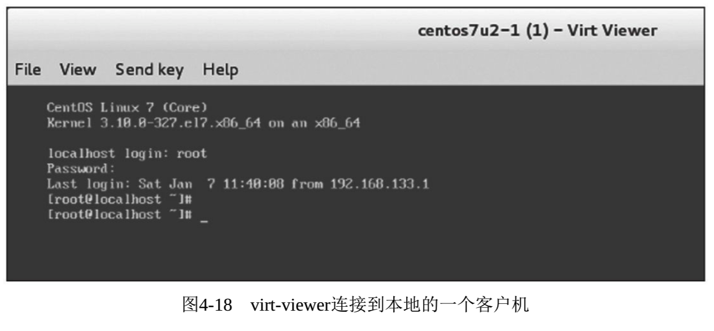
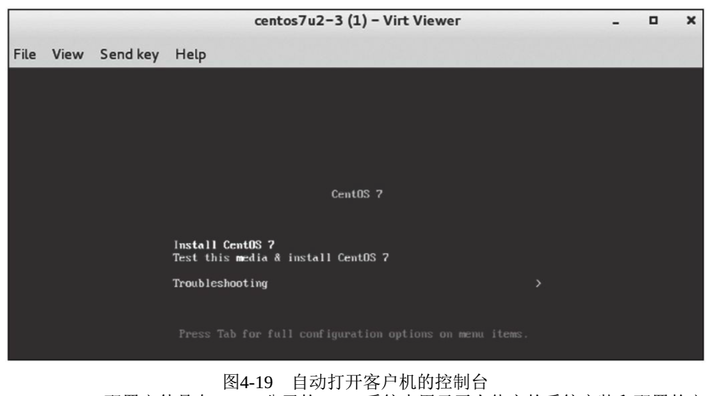
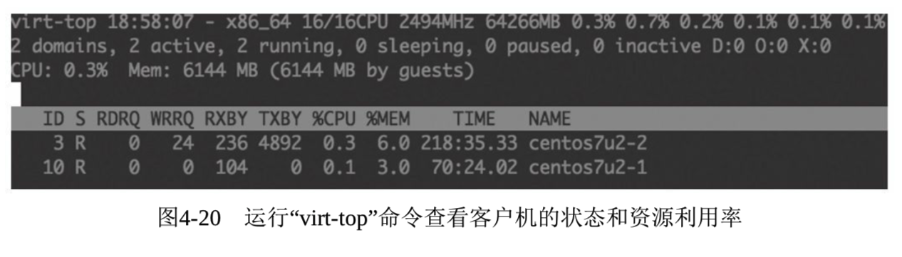

<!-- @import "[TOC]" {cmd="toc" depthFrom=1 depthTo=6 orderedList=false} -->

<!-- code_chunk_output -->

- [1. virt-viewer](#1-virt-viewer)
- [2. virt-install](#2-virt-install)
- [3. virt-top](#3-virt-top)
- [4. libguestfs](#4-libguestfs)

<!-- /code_chunk_output -->

# 1. virt-viewer

virt\-viewer 是"Virtual Machine Viewer"(虚拟机查看器)工具的软件包和命令行工具名称, 它是一个显示**虚拟化客户机的图形界面的工具**.

virt\-viewer 使用**GTK\-VNC**或**SPICE\-GTK**作为它的显示能力, 使用**libvirt API**去查询客户机的**VNC**或**SPICE 服务器端**的信息.

virt\-viewer 经常用于**替换传统的 VNC 客户端**查看器, 因为后者通常**不支持 x509 认证授权**的**SSL/TLS 加密**, 而 virt\-viewer 是支持的.

在 RHEL 7.3 系统中查看 virt\-viewer 的 RPM 包信息, 命令行如下:

```
[root@kvm-host ~]# rpm -q virt-viewer
virt-viewer-2.0-11.el7.x86_64
```

virt-viewer 的使用语法如下:

```
virt-viewer [OPTION...] -- DOMAIN-NAME|ID|UUID
```

virt\-viewer 连接到的客户机可以通过客户机的名称、域 ID、UUID 等表示来唯一指定. virt\-viewer 还支持"\-c URI"或"\-\-connection URI"参数来指定连接到远程宿主机上的一个客户机, 当然远程连接时一些必要的认证还是必需的.

关于 virt\-viewer 工具更多详细的参数和解释, 可以通过"man virt\-viewer"命令查看使用手册.

在图形界面的一个终端中, 用"**virt\-viewer centos7u2\-1**"连接到**本地宿主机**上名为"centos7u2\-1"的客户机, 其显示效果如图 4-18 所示.



在 virt\-viewer 打开的客户机窗口中(见图 4\-18), 其工具栏的"File"菜单下有保存屏幕快照的功能, "View"菜单下有使用全屏和放大(或缩小)屏幕的功能, "Send key"菜单下可以向客户机发送一些特殊的按键(如 Ctrl\+Alt\+Del、Ctrl\+Alt\+F2 等).

# 2. virt-install

virt\-install 是"Virt Install"工具的命令名称和软件包名称(在 RHEL 6.x 系统中, 包名是 python\-virtinst).

virt\-install 命令行工具为**虚拟客户机的安装**提供了一个便捷易用的方式, 它也是用 libvirt API 来创建 KVM、Xen、LXC 等各种类型的客户机, 同时, 它也为 virt\-manager 的图形界面创建客户机提供了安装系统的 API. virt-install 工具使用文本模式的串口控制台和 VNC(或 SPICE)图形接口, 可以支持基于文本模式和图形界面的客户机安装. virt\-install 中使用到的安装介质(如光盘、ISO 文件)可以存放在本地系统上, 也可以存放在远程的 NFS、HTTP、FTP 服务器上. virt-install 支持本地的客户机系统, 也可以通过"\-\-connect URI"(或"\-c URI")参数来支持在远程宿主机中安装客户机. 使用 virt\-install 中的一些选项(\-\-initrd-inject、\-\-extra-args 等)和 Kickstart 文件, 可以实现无人值守的自动化安装客户机系统.

在 RHEL 中, virt\-install 工具存在于"virt\-install"RPM 包中, 查询的命令行如下:

```
[root@kvm-host ~]# rpm -q virt-install
virt-install-1.4.0-2.el7.noarch
```

使用 virt-install 命令启动一个客户机的安装过程, 其命令行操作如下:

```
[root@kvm-host ~]# virt-install --connect qemu:///system --name centos7u2-3 --memory 1024 --disk path=/var/lib/libvirt/images/centos7u2-3.img,size=10 --network network:default --cdrom /var/lib/libvirt/images/CentOS7.2.iso --os-variant rhel7 --graphics vnc

Starting install...
Creating domain...                       |    0 B  00:00:00
```

上面 virt\-install 的命令行参数中, "\-\-connect"用于连接到本地或远程的 Hypervisor(无该参数时, 默认连接本地 Hypervisor); "\-\-memory"用于配置客户机的内存大小(单位是 MB); "\-\-disk"用于配置客户机的磁盘镜像文件, 其中 path 属性表示路径, size 属性表示磁盘大小(默认单位为 GB); "\-\-cdrom"用于指定用于安装的 ISO 光盘镜像文件; "\-\-os\-variant rhel7"表示客户机是 RHEL 7 类型的系统(virt\-install 会根据这个值自动优化一些安装配置); "\-\-graphics vnc"表示使用 VNC 图形接口连接到客户机的控制台. 关于 virt\-install 工具的更多更详细参数配置, 可以通过"man virt\-install"命令查看相应的帮助文档.

在示例中使用 VNC 接口连接到客户机, 会默认 virt-viewer 自动打开客户机的控制台, 如图 4\-19 所示.



# 3. virt-top

virt\-top 是一个用于**展示虚拟化客户机运行状态和资源使用率**的工具, 它与 Linux 系统上常用的"top"工具类似, 而且它的许多快捷键和命令行参数的设置都与"top"工具相同.

virt\-top 也是使用**libvirt API**来获取客户机的运行状态和资源使用情况的, 所以只要是 libvirt 支持的 Hypervisor, 就可以用 virt\-top 监控该 Hypervisor 上的客户机状态.

在 RHEL 7.3 系统上, virt\-top 命令就是在名为 virt\-top 的 RPM 包中用命令行查看:

```
[root@kvm-host ~]# rpm -q virt-top
virt-top-1.0.8-8.el7.x86_64
```

直接运行"virt-top"命令后, 将会显示出当前宿主机上各个客户机的运行情况, 其中包括宿主机的 CPU、内存的总数, 也包括各个客户机的运行状态、CPU、内存的使用率, 如图 4-20 所示. 关于 virt-top 工具的更多更详细参数配置, 可以通过"man virt\-top"命令查看相应的帮助文档.



# 4. libguestfs

**libguestfs**是用于**访问和修改虚拟机**的**磁盘镜像**的一组工具集合. libguestfs 提供了访问和编辑客户机中的文件、脚本化修改客户机中的信息、监控磁盘使用和空闲的统计信息、P2V、V2V、创建客户机、克隆客户机、备份磁盘内容、格式化磁盘、调整磁盘大小等非常丰富的功能.

libguestfs 支持大部分的**主流客户机操作系统**, 如: CentOS、Fedora、Ubuntu、Windows 等操作系统;

libguestfs 除了支持**KVM 虚拟机**, 它甚至支持**VMware**、**Hyper\-V**等非开源的虚拟机.

同时, libguestfs 还提供了一套 C 库以方便被链接到自己用 C/C\+\+开发的管理程序之中. 它还有对其他很多流程编程语言(如: Python)的绑定, 让开发者可以方便地使用 libgeustfs 提供的功能构建自己的虚拟机磁盘镜像管理程序.

在 RHEL 7.3 系统上, 查看 libguestfs 的常用工具在一个名为 libguestfs\-tools 的 RPM 包中, 可以使用如下命令查看:

```
[root@kvm-host ~]# rpm -q libguestfs-tools libguestfs-tools-c
libguestfs-tools-1.32.7-3.el7.noarch
libguestfs-tools-c-1.32.7-3.el7. x86_64
```

libguestfs\-tools 提供了很多工具, 可以分别对应不同的功能和使用场景, 如:

- `virt-ls`, 用于列出虚拟机中的文件,
- `virt-copy-in`, 用于往虚拟机中复制文件或目录,
- `virt-copy-out`, 用于从虚拟机往外复制文件或目录,
- `virt-resize`, 用于调整磁盘大小,
- `virt-cat`, 用于显示虚拟机中的一个文件的内容,
- `virt-edit`, 用于编辑虚拟机中的文件,
- `virt-df`, 用于查看虚拟机中文件系统空间使用情况,

等等.

下面演示 `virt-df`、`virt-copy-out` 命令来操作一个 Linux 客户机:

```
[root@kvm-host ~]# virt-df -d centos7u2-1
Filesystem                   1K-blocks     Used    Available  Use%
centos7u2-1:/dev/sda1        508588        105328     403260   21%
centos7u2-1:/dev/centos/root 18307072      9764840   8542232   54%

[root@kvm-host ~]# virt-copy-out -d centos7u2-1 /tmp/test-linux.txt /tmp

[root@kvm-host ~]# cat /tmp/test-linux.txt
Hi. This is a text file in a Linux guest.
```

```
virt-copy-in -a disk.img file|dir [file|dir ...] /destination

virt-copy-in -d domain file|dir [file|dir ...] /destination
```

参考: http://libguestfs.org/virt-copy-in.1.html

libguestfs 的一些工具用于**Windows 客户机镜像**的操作时, 需要先安装 libguestfs\-winsupport 这个软件包;

当使用 guestmount 来挂载 Windows 镜像时, 还需要安装 ntfs\-3g 软件包(可以到 EPEL 中找 RPM, 也可以自行编译安装). 下面是使用 virt\-ls、virt\-cat 命令对 Windows 客户机操作的演示:

```
[root@kvm-host ~]# virt-ls -d win2012 /  #查看 Windows 中系统盘 C 盘目录
Documents and Settings
PerfLogs
Program Files
Program Files (x86)
ProgramData
my-test.txt

[root@kvm-host ~]# virt-cat -d win2012 /my-test.txt
Hi. This is a text file inside a Windows guest.
```

本节演示的命令中, 使用的是"\-**d centos7u2\-1**"来指定对**哪一个客户机**进行操作, 这里的**客户机都是在运行状态**的;

也可以使用"\-**a /images/centos7u2.qcow2**"这样的选项来指定**一个镜像文件**进行操作.

