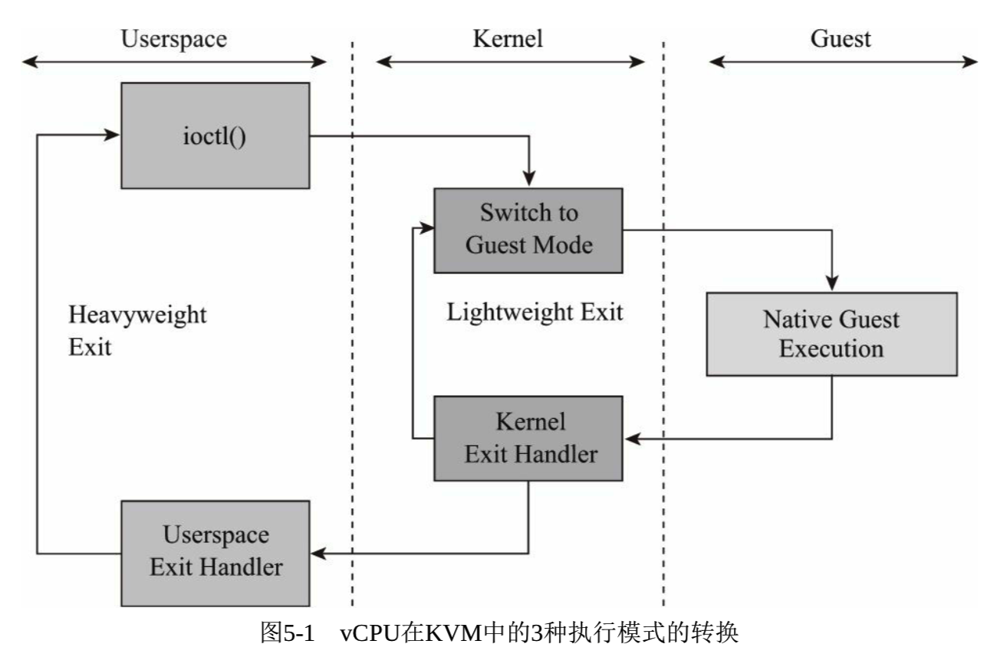
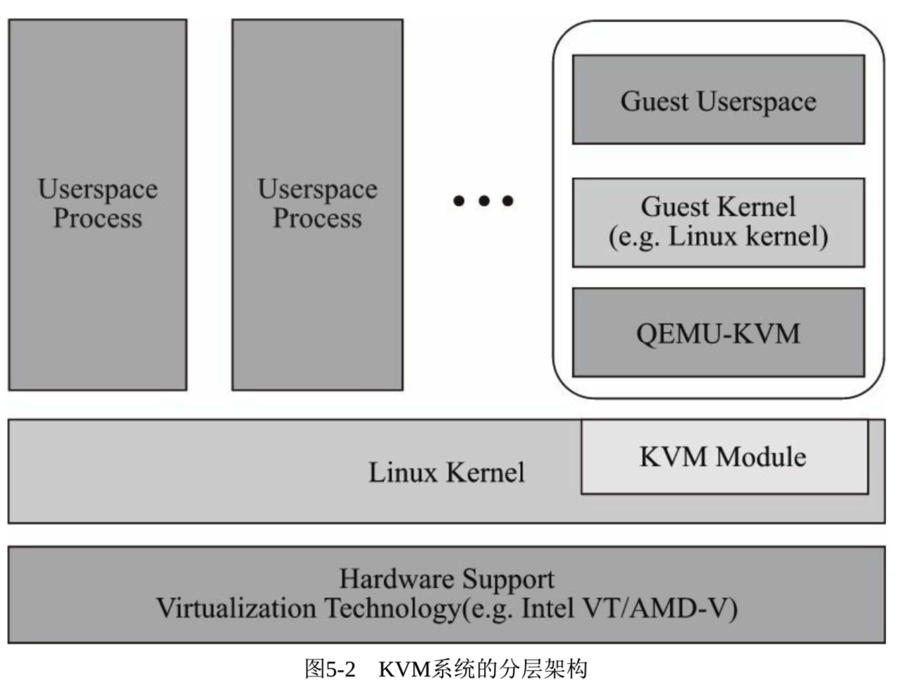

<!-- @import "[TOC]" {cmd="toc" depthFrom=1 depthTo=6 orderedList=false} -->

<!-- code_chunk_output -->

- [1. vCPU 的概念](#1-vcpu-的概念)
  - [1.1. vCPU 的三种模式](#11-vcpu-的三种模式)
  - [1.2. KVM 下系统架构](#12-kvm-下系统架构)
- [2. SMP 的支持](#2-smp-的支持)
  - [2.1. 硬件支持](#21-硬件支持)
  - [2.2. 操作系统支持](#22-操作系统支持)
  - [2.3. QEMU 的支持](#23-qemu-的支持)
    - [2.3.1. -smp 参数](#231--smp-参数)
    - [2.3.2. 默认不加-smp](#232-默认不加-smp)
    - [2.3.3. -smp 8](#233--smp-8)
    - [2.3.4. -smp 8,sockets=2,cores=2,threads=2](#234--smp-8sockets2cores2threads2)
    - [2.3.5. -smp 4,maxcpus=8](#235--smp-4maxcpus8)
- [3. CPU 过载使用](#3-cpu-过载使用)
- [4. CPU 模型](#4-cpu-模型)
  - [4.1. -cpu ?查看所有模型](#41--cpu-查看所有模型)
  - [4.2. 不加-cpu 默认 CPU 模型](#42-不加-cpu-默认-cpu-模型)
  - [4.3. -cpu model 指定模型](#43--cpu-model-指定模型)
- [5. 进程的处理器亲和性和 vCPU 的绑定](#5-进程的处理器亲和性和-vcpu-的绑定)
  - [5.1. 启动隔离](#51-启动隔离)
    - [5.1.1. kernel 启动参数](#511-kernel-启动参数)
    - [5.1.2. 通过 cpu 上进程判断是否隔离](#512-通过-cpu-上进程判断是否隔离)
  - [5.2. 启动虚拟机并绑定 vCPU](#52-启动虚拟机并绑定-vcpu)

<!-- /code_chunk_output -->

# 1. vCPU 的概念

**QEMU/KVM**为客户机提供一套完整的**硬件系统环境**, 在**客户机**看来, 其所拥有的 CPU 即是**vCPU(virtual CPU**).

在 KVM 环境中, **每个客户机**都是一个**标准的 Linux 进程(QEMU 进程**), 而**每一个 vCPU** 在宿主机中是**QEMU 进程派生**的一个**普通线程**.

## 1.1. vCPU 的三种模式

在**普通的 Linux 系统**中, 进程一般有**两种执行模式**: **内核模式**和**用户模式**.

而在**KVM 环境**中, 增加了第 3 种模式: **客户模式**.

vCPU 在 3 种执行模式下的不同分工如下.

(1)用户模式(User Mode)

主要处理**I/O 的模拟和管理**, 由**QEMU**的代码实现.

(2)内核模式(Kernel Mode)

主要处理特别需要高性能和安全相关的指令, 如处理客户模式到内核模式的转换, 处理客户模式下的 I/O 指令或其他特权指令引起的退出(VM\-Exit), 处理影子内存管理(shadow MMU).

(3)客户模式(Guest Mode)

主要执行 Guest 中的大部分指令, I/O 和一些特权指令除外(它们会引起 VM\-Exit, 被 Hypervisor 截获并模拟).

vCPU 在 KVM 中的这 3 种执行模式下的转换如图 5\-1 所示.



## 1.2. KVM 下系统架构

在 KVM 环境中, 整个系统的基本分层架构如图 5\-2 所示.



在系统的底层 CPU 硬件中需要有硬件辅助虚拟化技术的支持(Intel VT 或 AMD\-V 等), 宿主机就运行在硬件之上, **KVM 的内核部分**是作为**可动态加载内核模块**运行在宿主机中的, 其中

- 一个模块是与**硬件平台无关**的实现虚拟化核心基础架构的**kvm 模块**,
- 另一个是**硬件平台相关**的 kvm\_intel(或 kvm\_amd)模块.

而 KVM 中的**一个客户机**是作为一个**用户空间进程(qemu**)运行的, 它和其他普通的用户空间进程(如 gnome、kde、firefox、chrome 等)一样由内核来调度, 使其运行在物理 CPU 上, 不过它由 kvm 模块的控制, 可以在前面介绍的**3 种执行模式**下运行.

**多个客户机**就是宿主机中的**多个 QEMU 进程**, 而**一个客户机**的**多个 vCPU**就是**一个 QEMU 进程**中的**多个线程**.

和普通操作系统一样, 在**客户机系统**中, 同样分别运行着客户机的内核和客户机的用户空间应用程序.

# 2. SMP 的支持

在**SMP 系统**中, **多个程序(进程**)可以真正做到**并行执行**, 而且单个进程的多个线程也可以得到并行执行, 这极大地提高了计算机系统并行处理能力和整体性能.

## 2.1. 硬件支持

在**硬件**方面, **早期**的计算机系统更多的是在**一个主板**上拥有**多个物理的 CPU 插槽**, 来实现 SMP 系统. 后来, 随着**多核技术**、**超线程(Hyper\-Threading**)技术的出现, SMP 系统使用**多处理器**、**多核**、**超线程**等技术中的**一个或多个**.

## 2.2. 操作系统支持

在**操作系统软件**方面, 多数的现代操作系统都提供了**对 SMP 系统的支持**.

例如, 在 Linux 中, 下面的 Bash 脚本(cpu\-info.sh)可以根据/proc/cpuinfo 文件来检查当前系统中的 CPU 数量、多核及超线程的使用情况.

```sh
#!/bin/bash
#filename: cpu-info.sh
#this script only works in a Linux system which has one or more identical physical CPU(s).

echo -n "logical CPU number in total: "
#逻辑 CPU 个数
cat /proc/cpuinfo | grep "processor" | wc -l

#有些系统没有多核也没有打开超线程, 就直接退出脚本
cat /proc/cpuinfo | grep -qi "core id"
if [ $? -ne 0 ]; then
    echo "Warning. No multi-core or hyper-threading is enabled."
    exit 0;
fi

echo -n "physical CPU number in total: "
#物理 CPU 个数
cat /proc/cpuinfo | grep "physical id" | sort | uniq | wc -l

echo -n "core number in a physical CPU: "
#每个物理 CPU 上 core 的个数(未计入超线程)
core_per_phy_cpu=$(cat /proc/cpuinfo | grep "core id" | sort | uniq | wc -l)
echo $core_per_phy_cpu

echo -n "logical CPU number in a physical CPU: "
#每个物理 CPU 中逻辑 CPU(可能是 core、threads 或 both)的个数
logical_cpu_per_phy_cpu=$(cat /proc/cpuinfo | grep "siblings" | sort | uniq | awk- F: '{print $2}')
echo $logical_cpu_per_phy_cpu

#是否打开超线程, 以及每个 core 上的超线程数目
#如果在同一个物理 CPU 上的两个逻辑 CPU 具有相同的"core id", 那么超线程是打开的
#此处根据前面计算的 core_per_phy_cpu 和 logical_core_per_phy_cpu 的比较来查看超线程
if [ $logical_cpu_per_phy_cpu -gt $core_per_phy_cpu ]; then
    echo "Hyper threading is enabled. Each core has $(expr $logical_cpu_per_phy_cpu / $core_per_phy_cpu ) threads."
elif [ $logical_cpu_per_phy_cpu -eq $core_per_phy_cpu ]; then
    echo "Hyper threading is NOT enabled."
else
    echo "Error. There's something wrong."
fi
```

## 2.3. QEMU 的支持

SMP 是如此的普及和被广泛使用, 而**QEMU**在给**客户机模拟 CPU**时, 也可以提供**对 SMP 架构的模拟**, 让客户机运行在 SMP 系统中, 充分利用物理硬件的 SMP 并行处理优势.

由于**每个 vCPU**在**宿主机**中都是**一个线程**, 并且**宿主机 Linux 系统**是支持**多任务处理**的, 因此可以通过**两种操作来实现客户机的 SMP**,

- 一是将**不同的 vCPU 的进程交换执行**(分时调度, 即使物理硬件非 SMP, 也可以为客户机模拟出 SMP 系统环境),
- 二是将在**物理 SMP 硬件系统**上**同时执行多个 vCPU 的进程**.

### 2.3.1. -smp 参数

在 qemu 命令行中, "\-**smp**"参数即是配置客户机的 SMP 系统, 其具体参数如下:

```
-smp [cpus=]n[,maxcpus=cpus][,cores=cores][,threads=threads][,sockets=sockets]
```

其中:

- n 用于设置客户机中使用的**逻辑 CPU 数量**(**默认值是 1**).
- maxcpus 用于设置客户机中**最大可能被使用的 CPU 数量**, 包括启动时处于下线(**offline**)状态的**CPU 数量**(可用于**热插拔 hot\-plug**加入 CPU, 但**不能超过 maxcpus**这个上限).
- cores 用于设置**每个 CPU 的 core**数量(默认值是 1).
- threads 用于设置**每个 core 上的线程数**(默认值是 1).
- sockets 用于设置**客户机中看到的总的 CPU socket 数量**.

下面通过 KVM 中的几个 qemu 命令行示例, 来看一下如何将 SMP 应用于客户机中.

### 2.3.2. 默认不加-smp

示例 1:

```
qemu-system-x86_64 -m 1G rhel7.img
```

**不加 smp 参数**, 使用其**默认值 1！！！**, 在**客户机**中查看 CPU 情况, 如下:

```
[root@kvm-guest ~]# cat /proc/cpuinfo
processor       : 0
vendor_id       : AuthenticAMD
cpu family      : 6
model           : 6
model name      : QEMU Virtual CPU version 2.5+
stepping        : 3
cpu MHz         : 3591.617
cache size      : 512 KB
physical id     : 0
siblings        : 1
core id        : 0
cpu cores        : 1
apciid        : 0
initial apicid  : 0
fpu             : yes
fpu_exception   : yes
cpuid level     : 13
wp              : yes
flags           : fpu de pse tsc msr pae mce cx8 apic sep mtrr pge mca cmov pat pse36
                  clflush mmx fxsr sse sse2 syscall nx lm nopl pni cx16 hypervisor
                  lahf_lm svm
bogomips        : 7183.23
TLB size        : 1024 4K pages
clflush size     : 64
cache_alignment : 64
address sizes   : 40 bits physical, 48 bits virtual
power management:
[root@kvm-guest ~]# ls /sys/devices/system/cpu/
cpu0 isolated modalias offline possible present
cpuidle kernel_max nohz_full online power uevent
```

由上面的输出信息可知, 客户机系统识别到**1 个 QEMU 模拟的 CPU(cpu0**), 并且在**QEMU monitor**(**默认**按**Alt+Ctrl+2**组合键切换到 monitor)中用"info cpus"命令可以看到客户机中的 CPU 数量及其对应 QEMU 线程的 ID, 如下所示:

```
(qemu) info cpus
* CPU #0: pc=0xffffffff81058e96 (halted) thread_id=10747
```

在**宿主机**中看到相应的**QEMU 进程和线程**如下:

```
[root@kvm-host ~]# ps -eLf | grep qemu
root   10744  9335 10744  0  4 15:30 pts/0  00:00:11 qemu-system-x86_64 rhel7.img -m 1G
root   10744  9335 10745  0  4 15:30 pts/0  00:00:00 qemu-system-x86_64 rhel7.img -m 1G
root   10744  9335 10747 32  4 15:30 pts/0  00:07:51 qemu-system-x86_64 rhel7.img -m 1G
root   10744  9335 10748  0  4 15:30 pts/0  00:00:01 qemu-system-x86_64 rhel7.img -m 1G
root   11394  9766 11394  0  1 15:54 pts/2  00:00:00 grep --color=auto qemu
```

由以上信息可以看出, PID(Process ID)为 10744 的进程是客户机的进程, 它产生了 1 个线程(线程 ID 为 10747)作为客户机的 vCPU 运行在宿主机中. 其中, **ps 命令**的\-**L 参数**指定打印出**线程的 ID 和线程的个数**, \-**e 参数**指定选择**所有的进程**, \-**f 参数**指定选择**打印出完全的各列**.

### 2.3.3. -smp 8

示例 2:

```
qemu-system-x86_64 -smp 8 -m 8G rhel7.img
```

"\-smp 8"表示分配了**8 个虚拟的 CPU 给客户机**, 在客户机中用前面提到的"cpu\-info.sh"脚本查看 CPU 情况, 如下:

```
[root@kvm-guest ~]# cat /proc/cpuinfo
<! --  此处省略/proc/cpuinfo 的输出细节 -->
[root@kvm-guest ~]# ./cpu-info.sh        #这个是前面提到的 Bash 脚本
logical CPU number in total: 8
physical CPU number in total: 8
core number in a physical CPU: 1
logical CPU number in a physical CPU: 1
Hyper threading is NOT enabled.
[root@kvm-guest ~]# ls /sys/devices/system/cpu/
cpu0 cpu1 cpu2 cpu3 cpu4 cpu5 cpu6 cpu7 cpuidle isolated kernel_max modalias nohz_full offline online possible power present uevent
```

由上面的输出信息可知, 客户机使用了 8 个 CPU(cpu0\~cpu7), 系统识别的 CPU 数量也总共是 8 个, 是**8 个物理 CPU**, 而**没有多核、超线程之类的架构！！！**.

在 QEMU monitor 中查询 CPU 状态, 如下:

```
QEMU 2.7.0 monitor - type 'help' for more information
(qemu) VNC server running on ::1:5900
(qemu) info cpus
* CPU #0: pc=0xffffffff81060eb6 (halted) thread_id=186374
  CPU #1: pc=0xffffffff81060eb6 (halted) thread_id=186375
  CPU #2: pc=0xffffffff81060eb6 (halted) thread_id=186376
  CPU #3: pc=0xffffffff81060eb6 (halted) thread_id=186377
  CPU #4: pc=0xffffffff81060eb6 (halted) thread_id=186378
  CPU #5: pc=0xffffffff81060eb6 (halted) thread_id=186379
  CPU #6: pc=0xffffffff81060eb6 (halted) thread_id=186380
  CPU #7: pc=0xffffffff81060eb6 (halted) thread_id=186381
```

在宿主机中看到相应的 QEMU 进程和线程如下:

```
[root@kvm-host ~]# ps -eLf | grep qemu
root     186360  96470 186360  0   12 21:43 pts/4    00:00:01 qemu-system-x86_64 ia32e_rhel7u3_kvm.img -smp 8 -m 8G
root     186360  96470 186361  0   12 21:43 pts/4    00:00:00 qemu-system-x86_64 ia32e_rhel7u3_kvm.img -smp 8 -m 8G
root     186360  96470 186374  7   12 21:43 pts/4    00:00:15 qemu-system-x86_64 ia32e_rhel7u3_kvm.img -smp 8 -m 8G
root     186360  96470 186375  1   12 21:43 pts/4    00:00:03 qemu-system-x86_64 ia32e_rhel7u3_kvm.img -smp 8 -m 8G
root     186360  96470 186376  1   12 21:43 pts/4    00:00:03 qemu-system-x86_64 ia32e_rhel7u3_kvm.img -smp 8 -m 8G
root     186360  96470 186377  1   12 21:43 pts/4    00:00:03 qemu-system-x86_64 ia32e_rhel7u3_kvm.img -smp 8 -m 8G
root     186360  96470 186378  1   12 21:43 pts/4    00:00:03 qemu-system-x86_64 ia32e_rhel7u3_kvm.img -smp 8 -m 8G
root     186360  96470 186379  1   12 21:43 pts/4    00:00:03 qemu-system-x86_64 ia32e_rhel7u3_kvm.img -smp 8 -m 8G
root     186360  96470 186380  1   12 21:43 pts/4    00:00:04 qemu-system-x86_64 ia32e_rhel7u3_kvm.img -smp 8 -m 8G
root     186360  96470 186381  1   12 21:43 pts/4    00:00:03 qemu-system-x86_64 ia32e_rhel7u3_kvm.img -smp 8 -m 8G
root     186360  96470 186383  0   12 21:43 pts/4    00:00:01 qemu-system-x86_64 ia32e_rhel7u3_kvm.img -smp 8 -m 8G
root     186360  96470 186492  0   12 21:46 pts/4    00:00:00 qemu-system-x86_64 ia32e_rhel7u3_kvm.img -smp 8 -m 8G
root     186519 178215 186519  0    1 21:47 pts/6    00:00:00 grep --color=auto qemu
```

由以上信息可知, PID 为 186360 的进程是 QEMU 启动客户机的进程, 它产生了**8 个线程**作为**客户机的 8 个 vCPU**在运行.

### 2.3.4. -smp 8,sockets=2,cores=2,threads=2

示例 3:

```
qemu-system-x86_64 -m 8G -smp 8,sockets=2,cores=2,threads=2 rhel7.img
```

通过\-smp 参数详细定义了客户机中 SMP 的架构, 在客户中得到的 CPU 信息如下:

```
[root@kvm-guest ~]# cat /proc/cpuinfo
<! --  此处省略/proc/cpuinfo 的输出细节 -->
[root@kvm-guest ~]# sh cpu-info.sh
logical CPU number in total: 8
physical CPU number in total: 2
core number in a physical CPU: 2
logical CPU number in a physical CPU: 4
Hyper threading is enabled. Each core has 2 threads.
[root@kvm-guest ~]# ls /sys/devices/system/cpu/
cpu0  cpu1  cpu2  cpu3  cpu4  cpu5  cpu6  cpu7  cpuidle  isolated  kernel_max  microcode  modalias  nohz_full  offline  online  possible  power  present  uevent
```

从上面的输出信息可知, 客户机中共有 8 个逻辑 CPU(cpu0\~cpu7), 2 个 CPU socket, 每个 socket 有 2 个核, 每个核有 2 个线程(超线程处于打开状态).

### 2.3.5. -smp 4,maxcpus=8

示例 4:

```
qemu-system-x86_64 -m 8G -smp 4,maxcpus=8 rhel7.img -enable-kvm
```

通过\-smp 参数详细定义了客户机中**最多有 8 个 CPU**可用, 在系统启动之时有**4 个处于开启状态**, 在客户中得到的 CPU 信息如下:

```
[root@kvm-guest ~]# sh cpu-info.sh
logical CPU number in total: 4
physical CPU number in total: 4
core number in a physical CPU: 1
logical CPU number in a physical CPU: 1
Hyper threading is NOT enabled.

[root@kvm-guest ~]# lscpu
Architecture:          x86_64
CPU op-mode(s):        32-bit, 64-bit
Byte Order:            Little Endian
CPU(s):                4
On-line CPU(s) list:   0-3
Thread(s) per core:    1
Core(s) per socket:    1
Socket(s):             4
NUMA node(s):          1
Vendor ID:             GenuineIntel
CPU family:            6
Model:                 6
Model name:            QEMU Virtual CPU version 2.5+
Stepping:              3
CPU MHz:               2194.980
BogoMIPS:              4389.69
Hypervisor vendor:     KVM
Virtualization type:   full
L1d cache:             32K
L1i cache:             32K
L2 cache:              4096K
NUMA node0 CPU(s):     0-3
```

可以看到, **客户机**启动之后有**4 个 CPU**, 分别位于**4 个 socket**的**单一 core**上.

下面我们来做**热插拔操作**, 切换到 QEMU monitor 执行"cpu\-add\<id\>"的指令.

```
(qemu) info cpus
* CPU #0: pc=0xffffffff81060eb6 (halted) thread_id=190609
  CPU #1: pc=0xffffffff81060eb6 (halted) thread_id=190610
  CPU #2: pc=0xffffffff81060eb6 (halted) thread_id=190611
  CPU #3: pc=0xffffffff81060eb6 (halted) thread_id=190612
(qemu) cpu-add 7
(qemu) info cpus
* CPU #0: pc=0xffffffff81060eb6 (halted) thread_id=190609
  CPU #1: pc=0xffffffff81060eb6 (halted) thread_id=190610
  CPU #2: pc=0xffffffff81060eb6 (halted) thread_id=190611
  CPU #3: pc=0xffffffff81060eb6 (halted) thread_id=190612
  CPU #7: pc=0xffffffff81060eb6 (halted) thread_id=190690
```

我们**热插入 7 号 CPU**(0\~7 中最后一个), 可以在**QEMU monitor**中看到\#**7 号 CPU 上线！！！**了.

再在**客户机里面检查**:

```
[root@kvm-guest ~]# lscpu
Architecture:          x86_64
CPU op-mode(s):        32-bit, 64-bit
Byte Order:            Little Endian
CPU(s):                5
On-line CPU(s) list:   0-4
Thread(s) per core:    1
Core(s) per socket:    1
Socket(s):             5
NUMA node(s):          1
Vendor ID:             GenuineIntel
CPU family:            6
Model:                 6
Model name:            QEMU Virtual CPU version 2.5+
Stepping:              3
CPU MHz:               2194.980
BogoMIPS:              4389.69
Hypervisor vendor:     KVM
Virtualization type:   full
L1d cache:             32K
L1i cache:             32K
L2 cache:              4096K
NUMA node0 CPU(s):     0-4
[root@kvm-guest ~]# sh cpu-info.sh
logical CPU number in total: 5
physical CPU number in total: 5
core number in a physical CPU: 1
logical CPU number in a physical CPU: 1
Hyper threading is NOT enabled.
[root@kvm-guest ~]# ls /sys/devices/system/cpu/
cpu0  cpu1  cpu2  cpu3  cpu4  cpuidle  isolated  kernel_max  microcode  modalias  nohz_full  offline  online  possible  power  present  uevent
```

可以看到客户机变成有**5 个 CPU**了. 但是可以看到, **新增的 CPU 编号**却是**连续的(cpu4！！！**), 尽管我们**热插入的是\#7 号 CPU**.

# 3. CPU 过载使用

KVM 允许客户机过载使用(over\-commit)物理资源, 即允许为**客户机分配的 CPU**和**内存数量**多于物理上**实际存在的资源**.

**物理资源的过载使用**能带来资源充分利用方面的好处. 试想在一台强大的硬件服务器中运行 Web 服务器、图片存储服务器、后台数据统计服务器等作为虚拟客户机, 但是它们不会在同一时刻都负载很高, 如 Web 服务器和图片服务器在**白天工作时间负载较重**, 而**后台数据统计服务器**主要在**晚上工作**, 所以对物理资源进行合理的过载使用, 给这几个客户机分配的系统资源总数多余实际拥有的物理资源, 就可能在白天和夜晚都充分利用物理硬件资源, 而且由于**几个客户机不会同时对物理资源！！！** 造成很大的压力, 它们各自的服务质量(QoS)也能得到保障.

**CPU 的过载使用**是让**一个或多个客户机**使用**vCPU 的总数量**超过实际拥有的**物理 CPU 数量**.

QEMU 会启动**更多的线程**来为客户机提供服务, 这些线程也被 Linux 内核调度运行在物理 CPU 硬件上.

关于 CPU 的过载使用, 推荐的做法是对**多个单 CPU 的客户机**使用**over\-commit**, 比如, 在拥有**4 个逻辑 CPU 的宿主机**中, 同时运行多于 4 个(如 8 个、16 个)客户机, 其中每个客户机都分配一个 vCPU. 这时, 如果每个宿主机的负载不是很大, 宿主机 Linux 对每个客户机的调度是非常有效的, 这样的过载使用并不会带来客户机的性能损失.

关于 CPU 的过载使用, **最不推荐**的做法是让**某一个客户机的 vCPU 数量**超过**物理系统上存在的 CPU 数量**. 比如, 在拥有 4 个逻辑 CPU 的宿主机中, 同时运行一个或多个客户机, 其中每个客户机的 vCPU 数量多于 4 个(如 16 个). 这样的使用方法会带来比较明显的性能下降, 其性能反而不如为客户机分配 2 个(或 4 个)vCPU 的情况. 而且如果客户机负载过重, 可能会让整个系统运行不稳定. 不过, 在并非 100%满负载的情况下, 一个(或多个)有 4 个 vCPU 的客户机运行在拥有 4 个逻辑 CPU 的宿主机中并不会带来明显的性能损失.

总的来说, KVM 允许 CPU 的过载使用, 但是并**不推荐在实际的生产环境**(特别是负载较重的环境)中过载使用 CPU. 在生产环境中过载使用 CPU, 有必要在部署前进行严格的性能和稳定性测试.

# 4. CPU 模型

**每一种虚拟机管理程序**(Virtual Machine Monitor, 简称**VMM 或 Hypervisor**)都会定义自己的策略, 让客户机看起来有一个**默认的 CPU 类型**.

**有的 Hypervisor**会简单地将**宿主机中 CPU 的类型和特性直接传递给客户机使用**, 而**QEMU/KVM**在**默认情况**下会向客户机提供一个名为**qemu64 或 qemu32**的**基本 CPU 模型**.

QEMU/KVM 的这种策略会带来一些好处, 如可以**对 CPU 特性**提供一些**高级的过滤功能**, 还可以将**物理平台**根据提供的**基本 CPU 模型**进行**分组**(如将几台 IvyBridge 和 Sandybridge 硬件平台分为一组, 都提供相互兼容的 SandyBridge 或 qemu64 的 CPU 模型), 从而使客户机在同一组硬件平台上的动态迁移更加平滑和安全.

## 4.1. -cpu ?查看所有模型

通过如下的命令行可以查看**当前的 QEMU**支持的**所有 CPU 模型**.

```
[root@localhost ~]# qemu-system-x86_64 -enable-kvm -cpu ?
Available CPUs:
x86 486
x86 Broadwell             Intel Core Processor (Broadwell)
x86 Broadwell-IBRS        Intel Core Processor (Broadwell, IBRS)
x86 Broadwell-noTSX       Intel Core Processor (Broadwell, no TSX)
x86 Broadwell-noTSX-IBRS  Intel Core Processor (Broadwell, no TSX, IBRS)
x86 Cascadelake-Server    Intel Xeon Processor (Cascadelake)
x86 Conroe                Intel Celeron_4x0 (Conroe/Merom Class Core 2)
x86 Dhyana                Hygon Dhyana Processor
x86 EPYC                  AMD EPYC Processor
x86 EPYC-IBPB             AMD EPYC Processor (with IBPB)
x86 Haswell               Intel Core Processor (Haswell)
x86 Haswell-IBRS          Intel Core Processor (Haswell, IBRS)
x86 Haswell-noTSX         Intel Core Processor (Haswell, no TSX)
x86 Haswell-noTSX-IBRS    Intel Core Processor (Haswell, no TSX, IBRS)
x86 Icelake-Client        Intel Core Processor (Icelake)
x86 Icelake-Server        Intel Xeon Processor (Icelake)
x86 IvyBridge             Intel Xeon E3-12xx v2 (Ivy Bridge)
x86 IvyBridge-IBRS        Intel Xeon E3-12xx v2 (Ivy Bridge, IBRS)
x86 KnightsMill           Intel Xeon Phi Processor (Knights Mill)
x86 Nehalem               Intel Core i7 9xx (Nehalem Class Core i7)
x86 Nehalem-IBRS          Intel Core i7 9xx (Nehalem Core i7, IBRS update)
x86 Opteron_G1            AMD Opteron 240 (Gen 1 Class Opteron)
x86 Opteron_G2            AMD Opteron 22xx (Gen 2 Class Opteron)
x86 Opteron_G3            AMD Opteron 23xx (Gen 3 Class Opteron)
x86 Opteron_G4            AMD Opteron 62xx class CPU
x86 Opteron_G5            AMD Opteron 63xx class CPU
x86 Penryn                Intel Core 2 Duo P9xxx (Penryn Class Core 2)
x86 SandyBridge           Intel Xeon E312xx (Sandy Bridge)
x86 SandyBridge-IBRS      Intel Xeon E312xx (Sandy Bridge, IBRS update)
x86 Skylake-Client        Intel Core Processor (Skylake)
x86 Skylake-Client-IBRS   Intel Core Processor (Skylake, IBRS)
x86 Skylake-Server        Intel Xeon Processor (Skylake)
x86 Skylake-Server-IBRS   Intel Xeon Processor (Skylake, IBRS)
x86 Westmere              Westmere E56xx/L56xx/X56xx (Nehalem-C)
x86 Westmere-IBRS         Westmere E56xx/L56xx/X56xx (IBRS update)
x86 athlon                QEMU Virtual CPU version 2.5+
x86 core2duo              Intel(R) Core(TM)2 Duo CPU     T7700  @ 2.40GHz
x86 coreduo               Genuine Intel(R) CPU           T2600  @ 2.16GHz
x86 kvm32                 Common 32-bit KVM processor
x86 kvm64                 Common KVM processor
x86 n270                  Intel(R) Atom(TM) CPU N270   @ 1.60GHz
x86 pentium
x86 pentium2
x86 pentium3
x86 phenom                AMD Phenom(tm) 9550 Quad-Core Processor
x86 qemu32                QEMU Virtual CPU version 2.5+
x86 qemu64                QEMU Virtual CPU version 2.5+
x86 base                  base CPU model type with no features enabled
x86 host                  KVM processor with all supported host features
x86 max                   Enables all features supported by the accelerator in the current host
......
```

这些 CPU 模型是在源代码**qemu.git/target/i386/cpu.c**中的结构体数组**builtin\_x86\_defs**\[\]中定义的.

## 4.2. 不加-cpu 默认 CPU 模型

在 x86\-64 平台上编译和运行的 QEMU, 在**不加"\-cpu**"参数启动时, 采用"**qemu64**"作为**默认的 CPU 模型**, 命令行演示如下:

```
qemu-system-x86_64 rhel7.img
```

在客户机看到的 CPU 信息如下:

```
[root@kvm-guest ~]# cat /proc/cpuinfo
processor       : 0
vendor_id       : AuthenticAMD
cpu family      : 6
model           : 6
model name      : QEMU Virtual CPU version 2.5+
stepping        : 3
cpu MHz         : 3591.617
cache size      : 512 KB
physical id     : 0
siblings        : 1
core id         : 0
cpu cores       : 1
apciid          : 0
initial apicid  : 0
fpu             : yes
fpu_exception   : yes
cpuid level     : 13
wp              : yes
flags           : fpu de pse tsc msr pae mce cx8 apic sep mtrr pge mca cmov pat pse36
                   clflush mmx fxsr sse sse2 syscall nx lm nopl pni cx16 hypervisor
                   lahf_lm svm
bogomips         : 7183.23
TLB size        : 1024 4K pages
clflush size     : 64
cache_alignment : 64
address sizes   : 40 bits physical, 48 bits virtual
power management:
```

可知, 在**客户机**中看到的**CPU 模型**的名称为"**QEMU Virtual CPU version 2.5\+**", 这就是**当前版本 QEMU**的"**qemu64**"CPU 模型的**名称**.

## 4.3. -cpu model 指定模型

在 qemu 命令行中, 可以用"\-**cpu cpu\_model**"来指定在客户机中的 CPU 模型. 如下的命令行就在启动客户机时指定了 CPU 模型为 Broadwell.

```
qemu-system-x86_64 rhel7.img -cpu Broadwell -smp 8 -m 16G -enable-kvm
```

在客户机中查看 CPU 信息如下:
```
[root@kvm-guest ~]# cat /proc/cpuinfo
processor      : 0
vendor_id      : GenuineIntel
cpu family      : 6
model      : 61
model name      : Intel Core Processor (Broadwell)
stepping      : 2
microcode      : 0x1
cpu MHz      : 2194.655
cache size      : 4096 KB
physical id   : 0
siblings      : 1
core id      : 0
cpu cores      : 1
apicid      : 0
initial apicid   : 0
fpu         : yes
fpu_exception   : yes
cpuid level   : 13
wp         : yes
flags      : fpu vme de pse tsc msr pae mce cx8 apic sep mtrr pge mca
 cmov pat pse36 clflush mmx fxsr sse sse2 syscall nx rdtscp lm
 constant_tsc rep_good nopl xtopology eagerfpu pni pclmulqdq
 ssse3 fma cx16 pcid sse4_1 sse4_2 x2apic movbe popcnt tsc_
 deadline_timer aes xsave avx f16c rdrand hypervisor lahf_lm
 abm 3dnowprefetch arat fsgsbase bmi1 hle avx2 smep bmi2 erms
 invpcid rtm rdseed adx smap xsaveopt
bogomips      : 4389.69
clflush size   : 64
cache_alignment   : 64
address sizes   : 40 bits physical, 48 bits virtual
power management:
```

由上面的信息可知, 在客户机中看到的 CPU 是基于 Broadwell 的 Intel Xeon 处理器.

其中的 vendor\_id、cpu family、flags、cpuid level 等都是在 target/i386/cpu.c 的 buildin\_x86\_defs\[\]中定义好的, 具体的关于 Broadwell 这个 CPU 模型的定义如下:

```dict
{
    .name = "Broadwell",
    .level = 0xd,
    .vendor = CPUID_VENDOR_INTEL,
    .family = 6,
    .model = 61,
    .stepping = 2,
    .features[FEAT_1_EDX] =
        CPUID_VME | CPUID_SSE2 | CPUID_SSE | CPUID_FXSR | CPUID_MMX |
        CPUID_CLFLUSH | CPUID_PSE36 | CPUID_PAT | CPUID_CMOV | CPUID_MCA |
        CPUID_PGE | CPUID_MTRR | CPUID_SEP | CPUID_APIC | CPUID_CX8 |
        CPUID_MCE | CPUID_PAE | CPUID_MSR | CPUID_TSC | CPUID_PSE |
        CPUID_DE | CPUID_FP87,
    .features[FEAT_1_ECX] =
        CPUID_EXT_AVX | CPUID_EXT_XSAVE | CPUID_EXT_AES |
        CPUID_EXT_POPCNT | CPUID_EXT_X2APIC | CPUID_EXT_SSE42 |
        CPUID_EXT_SSE41 | CPUID_EXT_CX16 | CPUID_EXT_SSSE3 |
        CPUID_EXT_PCLMULQDQ | CPUID_EXT_SSE3 |
        CPUID_EXT_TSC_DEADLINE_TIMER | CPUID_EXT_FMA | CPUID_EXT_MOVBE |
        CPUID_EXT_PCID | CPUID_EXT_F16C | CPUID_EXT_RDRAND,
    .features[FEAT_8000_0001_EDX] =
        CPUID_EXT2_LM | CPUID_EXT2_RDTSCP | CPUID_EXT2_NX |
        CPUID_EXT2_SYSCALL,
    .features[FEAT_8000_0001_ECX] =
        CPUID_EXT3_ABM | CPUID_EXT3_LAHF_LM | CPUID_EXT3_3DNOWPREFETCH,
    .features[FEAT_7_0_EBX] =
        CPUID_7_0_EBX_FSGSBASE | CPUID_7_0_EBX_BMI1 |
        CPUID_7_0_EBX_HLE | CPUID_7_0_EBX_AVX2 | CPUID_7_0_EBX_SMEP |
        CPUID_7_0_EBX_BMI2 | CPUID_7_0_EBX_ERMS | CPUID_7_0_EBX_INVPCID |
        CPUID_7_0_EBX_RTM | CPUID_7_0_EBX_RDSEED | CPUID_7_0_EBX_ADX |
        CPUID_7_0_EBX_SMAP,
    .features[FEAT_XSAVE] =
        CPUID_XSAVE_XSAVEOPT,
    .features[FEAT_6_EAX] =
        CPUID_6_EAX_ARAT,
    .xlevel = 0x80000008,
    .model_id = "Intel Core Processor (Broadwell)",
},
```

# 5. 进程的处理器亲和性和 vCPU 的绑定

通常在 SMP 系统中, Linux 内核的进程调度器根据自有的调度策略将系统中的**一个进程**调度到**某个 CPU**上执行. 在**默认情况**下, **一个普通进程或线程**的处理器亲和性体现在**所有可用的 CPU**上, 进程或线程有可能在这些 CPU 之中的任何一个(包括超线程)上执行.

进程的处理器亲和性(Processor Affinity)即**CPU 的绑定设置**, 是指**将进程绑定到特定的一个或多个 CPU**上去执行, 而不允许将进程调度到其他的 CPU 上. Linux 内核对进程的调度算法也是遵守进程的处理器亲和性设置的.

设置**进程的处理器亲和性**带来的**好处**是可以减少进程在多个 CPU 之间交换运行带来的**缓存命中失效(cache missing**), 从该进程运行的角度来看, 可能带来一定程度上的性能提升. 换个角度来看, 对进程亲和性的设置也可能带来一定的问题, 如破坏了原有 SMP 系统中**各个 CPU 的负载均衡**(load balance), 这可能会导致整个系统的进程调度变得低效. 对进程的处理器亲和性进行设置可能导致系统的整体性能的下降而非提升.

**每个 vCPU**都是宿主机中一个**普通的 QEMU 线程**, 可以使用**taskset 工具**对其设置处理器亲和性, 使其绑定到**某一个或几个固定的 CPU**上去调度.

下面举一个云计算应用中需要绑定 vCPU 的示例.

作为 IaaS(Infrastructure as a Service)类型的云计算提供商的 A 公司(如 Amazon、Google、Azure、阿里云等), 为客户提供一个有**两个逻辑 CPU 计算能力**的一个客户机. 要求**CPU 资源独立被占用**, 不受宿主机中其他客户机的负载水平的影响. 为了满足这个需求, 可以分如下**两个步骤**来实现.

## 5.1. 启动隔离

启动宿主机时**隔离出两个逻辑 CPU**专门供一个客户机使用.

### 5.1.1. kernel 启动参数

在 Linux 内核**启动的命令**行中加上"**isolcpus**="参数, 可以实现 CPU 的隔离, 使得在系统启动后普通进程默认都不会被调度到被隔离的 CPU 上执行. 例如, 隔离 cpu4 和 cpu5 的内核启动命令行如下:

```
[root@kvm-host ~]# cat /proc/cmdline
BOOT_IMAGE=/vmlinuz-3.10.0-514.el7.x86_64 root=/dev/mapper/rhel-root ro crashkernel=auto rd.lvm.lv=rhel/root rd.lvm.lv=rhel/swap rhgb quiet LANG=en_US.UTF-8 intel_iommu=on isolcpus=4,5
```

### 5.1.2. 通过 cpu 上进程判断是否隔离

在系统启动后, 在宿主机中检查是否隔离成功的命令行如下:

```
[root@kvm-host ~]# ps -eLo psr | grep -e "^[[:blank:]]*0$" | wc -l
23
[root@kvm-host ~]# ps -eLo psr | grep -e "^[[:blank:]]*1$" | wc -l
10
[root@kvm-host ~]# ps -eLo psr | grep -e "^[[:blank:]]*2$" | wc -l
28
[root@kvm-host ~]# ps -eLo psr | grep -e "^[[:blank:]]*3$" | wc -l
23
[root@kvm-host ~]# ps -eLo psr | grep -e "^[[:blank:]]*4$" | wc -l
5
[root@kvm-host ~]# ps -eLo psr | grep -e "^[[:blank:]]*5$" | wc -l
6
[root@kvm-host ~]# ps -eLo ruser,pid,ppid,lwp,psr,args | awk '{if($5==5) print $0}'
root         32      2     32   5 [watchdog/5]
root         33      2     33   5 [migration/5]
root         34      2     34   5 [ksoftirqd/5]
root         35      2     35   5 [kworker/5:0]
root         36      2     36   5 [kworker/5:0H]
root       5439      2   5439   5 [kworker/5:1]
[root@kvm-host ~]# ps -eLo ruser,pid,ppid,lwp,psr,args | awk '{if($5==4) print $0}'
root         27      2     27   4 [watchdog/4]
root         28      2     28   4 [migration/4]
root         29      2     29   4 [ksoftirqd/4]
root         30      2     30   4 [kworker/4:0]
root         31      2     31   4 [kworker/4:0H]
[root@kvm-host ~]# ps -eLo ruser,pid,ppid,lwp,psr,args | awk '{if($5==1) print $0}'
root         12      2     12   1 [watchdog/1]
root         13      2     13   1 [migration/1]
root         14      2     14   1 [ksoftirqd/1]
root         16      2     16   1 [kworker/1:0H]
root        491      2    491   1 [kworker/1:1]
root       1220      2   1220   1 [kworker/1:1H]
gdm        4050   4009   4050   1 /usr/libexec/gnome-settings-daemon
root       6374   6008   6374   1 /usr/libexec/tracker-miner-apps
root       7521      2   7521   1 [kworker/1:2]
root       8332   6623   8332   1 ps -eLo ruser,pid,ppid,lwp,psr,args
```

由上面的命令行输出信息可知, **cpu0\~cpu3**上分别有 23 个、10 个、18 个、23 个线程在运行, 而 cpu4 和 cpu5 上分别只有 5 个、6 个线程在运行. 而且, 根据输出信息中 cpu4 和 cpu5 上运行的线程信息(也包括进程在内), 分别有 migration 线程(用于进程在不同 CPU 间迁移)、两个 kworker 线程(用于处理 workqueues)、ksoftirqd 线程(用于调度 CPU 软中断的进程)、watchdog 线程, 这些进程都是内核对各个 CPU 的守护进程. 没有其他的普通进程在 cup4 和 cpu5 上运行(对比 cpu0 上, 可以看到它有一些普通进程), 说明对它们的隔离是生效的.

这里简单解释一下上面的一些命令行工具及其参数的意义. ps 命令显示当前系统的进程信息的状态, 它的"\-e"参数用于显示所有的进程, "\-L"参数用于将线程(light\-weight process, LWP)也显示出来, "\-o"参数表示以用户自定义的格式输出(其中"psr"这列表示当前分配给进程运行的处理器编号, "lwp"列表示线程的 ID, "ruser"表示运行进程的用户, "pid"表示进程的 ID, "ppid"表示父进程的 ID, "args"表示运行的命令及其参数). 结合 ps 和 awk 工具的使用, 是为了分别将在处理器 cpu4 和 cpu5 上运行的进程打印出来.

## 5.2. 启动虚拟机并绑定 vCPU

启动一个拥有两个 vCPU 的客户机, 并将其 vCPU 绑定到宿主机中两个 CPU 上.

此操作过程的命令行如下:

```
#启动一个客户机
[root@kvm-host ~]# qemu-system-x86_64 -enable-kvm -smp 2 -m 4G rhel7.img -daemonize

#查看代表 vCPU 的 QEMU 线程
[root@kvm-host ~]# ps -eLo ruser,pid,ppid,lwp,psr,args | grep qemu | grep -v grep
root       8645      1   8645   6 qemu-system-x86_64 -enable-kvm -smp 2 -m 4G rhel7.img -daemonize
root       8645      1   8646  25 qemu-system-x86_64 -enable-kvm -smp 2 -m 4G rhel7.img -daemonize
root       8645      1   8647   2 qemu-system-x86_64 -enable-kvm -smp 2 -m 4G rhel7.img -daemonize
root       8645      1   8648   0 qemu-system-x86_64 -enable-kvm -smp 2 -m 4G rhel7.img -daemonize
root       8645      1   8649   3 qemu-system-x86_64 -enable-kvm -smp 2 -m 4G rhel7.img -daemonize
root       8645      1   8651  17 qemu-system-x86_64 -enable-kvm -smp 2 -m 4G rhel7.img -daemonize

#绑定代表整个客户机的 QEMU 进程, 使其运行在 cpu4 上
[root@kvm-host ~]# taskset -pc 4 8645
pid 8645's current affinity list: 0-3,6-87
pid 8645's new affinity list: 4
#绑定第 1 个 vCPU 的线程, 使其运行在 cpu4 上
[root@kvm-host ~]# taskset -pc 4 8649
pid 8649's current affinity list: 0-3,6-87
pid 8649's new affinity list: 4
#绑定第 2 个 vCPU 的线程, 使其运行在 cpu5 上
[root@kvm-host ~]# taskset -pc 5 8651
pid 8651's current affinity list: 0-3,6-87
pid 8651's new affinity list: 5

#查看 QEMU 线程的绑定是否生效, 下面的第 5 列为处理器亲和性
[root@kvm-host ~]# ps -eLo ruser,pid,ppid,lwp,psr,args | grep qemu | grep -v grep
root       8645      1   8645   4 qemu-system-x86_64 -enable-kvm -smp 2 -m 4G rhel7.img -daemonize
root       8645      1   8646  25 qemu-system-x86_64 -enable-kvm -smp 2 -m 4G rhel7.img -daemonize
root       8645      1   8647   2 qemu-system-x86_64 -enable-kvm -smp 2 -m 4G rhel7.img -daemonize
root       8645      1   8649   4 qemu-system-x86_64 -enable-kvm -smp 2 -m 4G rhel7.img -daemonize
root       8645      1   8651   5 qemu-system-x86_64 -enable-kvm -smp 2 -m 4G rhel7.img -daemonize
#执行 vCPU 的绑定后, 查看在 cpu4 上运行的线程
[root@kvm-host ~]# ps -eLo ruser,pid,ppid,lwp,psr,args | awk '{if($5==4) print $0}'
root         27      2     27   4 [watchdog/4]
root         28      2     28   4 [migration/4]
root         29      2     29   4 [ksoftirqd/4]
root         30      2     30   4 [kworker/4:0]
root         31      2     31   4 [kworker/4:0H]
root       8645      1   8645   4 qemu-system-x86_64 -enable-kvm -smp 2 -m 4G rhel7.img -daemonize
root       8645      1   8649   4 qemu-system-x86_64 -enable-kvm -smp 2 -m 4G rhel7.img -daemonize
root       9478      2   9478   4 [kworker/4:1H]
root       9490      2   9490   4 [kworker/4:1]
#执行 vCPU 的绑定后, 查看在 cpu5 上运行的线程
[root@kvm-host ~]# ps -eLo ruser,pid,ppid,lwp,psr,args | awk '{if($5==5) print $0}'
root         32      2     32   5 [watchdog/5]
root         33      2     33   5 [migration/5]
root         34      2     34   5 [ksoftirqd/5]
root         35      2     35   5 [kworker/5:0]
root         36      2     36   5 [kworker/5:0H]
root       5439      2   5439   5 [kworker/5:1]
root       8645      1   8651   5 qemu-system-x86_64 -enable-kvm -smp 2 -m 4G rhel7.img -daemonize
```

注: 也可以通过修改 xml 实现

由上面的命令行及其输出信息可知, 在 CPU 进行绑定之前, 代表这个客户机的 QEMU 进程和代表各个 vCPU 的 QEMU 线程分别被调度到 cpu6、cpu3 和 cpu17 上. 使用 taskset 命令将 QEMU 进程和第 1 个 vCPU 的线程绑定到 cpu4, 将第 2 个 vCPU 线程绑定到 cpu5 上. 在绑定之后即可查看到绑定结果生效, 代表两个 vCPU 的 QEMU 线程分别运行在 cpu4 和 cpu5 上(即使再过一段时间, 它们也不会被调度到其他 CPU 上去).

对于 taskset 命令, 此处使用的语法是:

```
taskset -pc cpulist pid
```

根据上面的输出, 在运行 taskset 命令之前, QEMU 线程的处理器亲和性是除 cpu4 和 cpu5 以外的其他所有 cpu; 而在运行"taskset \-pc 4 8645"命令后, 提示该进程就只能被调度到 cpu4 上去运行, 即通过 taskset 工具实现了将 vCPU 进程绑定到特定的 CPU 上.

在上面命令行中, 根据 ps 命令可以看到 QEMU 的线程和进程的关系, 但如何查看 vCPU 与 QEMU 线程之间的关系呢?可以切换(使用"Ctrl\+Alt\+2"组合键)到 QEMU monitor 中进行查看, 运行"info cpus"命令即可(还记得 3.6 节中运行过的"info kvm"命令吧), 其输出结果如下:

```
(qemu) info cpus
* CPU #0: pc=0xffffffff81060eb6 (halted) thread_id=8649
  CPU #1: pc=0xffffffff81060eb6 (halted) thread_id=8651
```

由上面的输出信息可知, 客户机中的 cpu0 对应的线程 ID 为 8649, cpu1 对应的线程 ID 为 8651. 另外, "CPU#0"前面有一个星号(*), 表示 cpu0 是 BSP(Boot Strap Processor, 系统最初启动时在 SMP 生效前使用的 CPU).

总的来说, 在 KVM 环境中, 一般并**不推荐手动设置 QEMU 进程的处理器亲和性**来绑定 vCPU, 但是, 在非常了解系统硬件架构的基础上, 根据实际应用的需求, 可以将其绑定到特定的 CPU 上, 从而提高客户机中的 CPU 执行效率或实现 CPU 资源独享的隔离性.