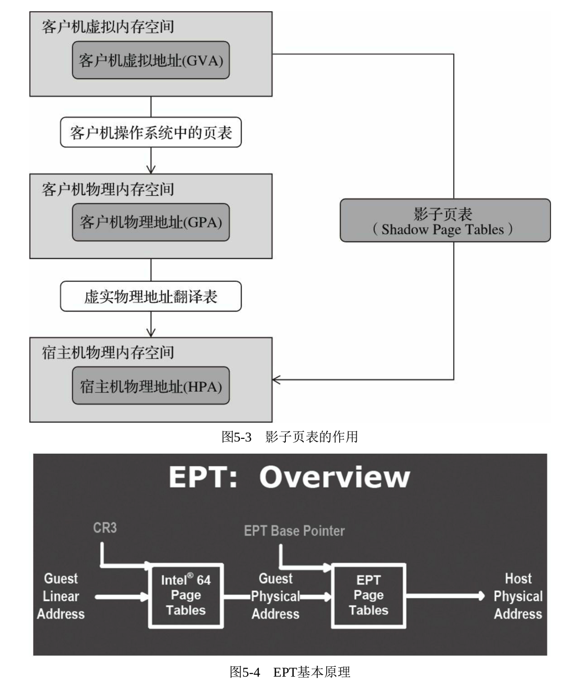

<!-- @import "[TOC]" {cmd="toc" depthFrom=1 depthTo=6 orderedList=false} -->

<!-- code_chunk_output -->

- [1. 内存设置基本参数](#1-内存设置基本参数)
- [2. EPT 和 VPID 简介](#2-ept-和-vpid-简介)
  - [2.1. 系统检查](#21-系统检查)
    - [2.1.1. /proc/cpuinfo](#211-proccpuinfo)
    - [2.1.2. 2.1.2 sysfs 文件系统](#212-212-sysfs-文件系统)
- [3. 内存过载使用](#3-内存过载使用)

<!-- /code_chunk_output -->

# 1. 内存设置基本参数

在通过 qemu 命令行启动客户机时设置内存大小的参数如下:

```
-m megs #设置客户机的内存为 megs MB 大小
```

**默认的单位为 MB**, 也支持加上"**M**"或"**G**"作为后缀来显式指定使用**MB**或**GB** 作为内存分配的单位.

如果**不设置\-m 参数**, QEMU 对客户机分配的内存大小**默认值为 128MB**(参见源代码中**hw/core/machine.c**中的函数 **machine_class_init**), 这个大小对于 RHEL OS 来说是不够的(见 https://access.redhat.com/articles/rhel\-limits ), 所以笔者在尝试不指定内存大小而启动 RHEL7 guest, guest 启动过程中会失败, 告警内存不足.

一般我们启动客户机, 这个参数都是必不可少的. 下面通过两个示例来进一步说明"\-m"参数设置内存的具体用法.

# 2. EPT 和 VPID 简介

**EPT(Extended Page Tables, 扩展页表**), 属于 Intel 的**第二代硬件虚拟化**技术, 它是针对内存管理单元(MMU)的虚拟化扩展. EPT 降低了内存虚拟化的难度(与影子页表相比), 也提升了内存虚拟化的性能. 从基于 Intel 的 Nehalem 架构的平台开始, EPT 就作为 CPU 的一个特性加入 CPU 硬件中了.

和运行在真实物理硬件上的操作系统一样, 在客户机操作系统看来, 客户机可用的内存空间也是一个从零地址开始的连续的物理内存空间. 为了达到这个目的, Hypervisor(即 KVM)引入了一层新的地址空间, 即**客户机物理地址空间**, 这个地址空间不是真正的硬件上的地址空间, 它们之间还有一层映射.

所以, 在**虚拟化环境**下, 内存使用就需要**两层的地址转换**, 即客户机应用程序可见的客户机虚拟地址(Guest Virtual Address, **GVA**)到客户机物理地址(Guest Physical Address, **GPA**)的转换, 再从客户机物理地址(**GPA**)到宿主机物理地址(Host Physical Address, **HPA**)的转换. 其中, **前一个转换**由**客户机操作系统**来完成, 而**后一个转换**由**Hypervisor**来负责.

在硬件 EPT 特性加入之前, **影子页表(Shadow Page Tables**)从软件上维护了从客户机虚拟地址(**GVA**)到宿主机物理地址(**HPA**)之间的映射, 每一份客户机操作系统的页表也对应一份影子页表. 有了影子页表, 在普通的内存访问时都可实现从 GVA 到 HPA 的直接转换, 从而避免了上面前面提到的两次地址转换. Hypervisor 将影子页表载入物理上的内存管理单元(Memory Management Unit, MMU)中进行地址翻译. 图 5\-3 展示了 GVA、GPA、HPA 之间的转换, 以及影子页表的作用.

尽管影子页表提供了在物理 MMU 硬件中能使用的页表, 但是其缺点也是比较明显的. 首先影子页表的实现非常复杂, 导致其开发、调试和维护都比较困难. 其次, 影子页表的内存开销也比较大, 因为需要为每个客户机进程对应的页表的都维护一个影子页表.

为了解决影子页表存在的问题, Intel 的 CPU 提供了 EPT 技术(AMD 提供的类似技术叫作 NPT, 即 Nested Page Tables), 直接在硬件上支持 GVA -> GPA -> HPA 的两次地址转换, 从而降低内存虚拟化实现的复杂度, 也进一步提升了内存虚拟化的性能. 图 5-4 展示了 Intel EPT 技术的基本原理.



CR3(控制寄存器 3)将客户机程序所见的客户机虚拟地址(GVA)转化为客户机物理地址(GPA), 然后再通过 EPT 将客户机物理地址(GPA)转化为宿主机物理地址(HPA). 这两次地址转换都是由 CPU 硬件来自动完成的, 其转换效率非常高. 在使用 EPT 的情况下, 客户机内部的 Page Fault、INVLPG(使 TLB 项目失效)指令、CR3 寄存器的访问等都不会引起 VM\-Exit, 因此大大减少了 VM-Exit 的数量, 从而提高了性能. 另外, EPT 只需要维护一张 EPT 页表, 而不需要像"影子页表"那样为每个客户机进程的页表维护一张影子页表, 从而也减少了内存的开销. VPID(Virtual Processor Identifiers, 虚拟处理器标识)是在硬件上对 TLB 资源管理的优化, 通过在硬件上为每个 TLB 项增加一个标识, 用于不同的虚拟处理器的地址空间, 从而能够区分 Hypervisor 和不同处理器的 TLB. 硬件区分了不同的 TLB 项分别属于不同虚拟处理器, 因此可以避免每次进行 VM\-Entry 和 VM\-Exit 时都让 TLB 全部失效, 提高了 VM 切换的效率. 由于有了这些在 VM 切换后仍然继续存在的 TLB 项, 硬件减少了一些不必要的页表访问, 减少了内存访问次数, 从而提高了 Hypervisor 和客户机的运行速度. VPID 也会对客户机的实时迁移(Live Migration)有很好的效率提升, 会节省实时迁移的开销, 提升实时迁移的速度, 降低迁移的延迟(Latency). VPID 与 EPT 是一起加入 CPU 中的特性, 也是 Intel 公司在 2009 年推出 Nehalem 系列处理器上新增的与虚拟化相关的重要功能.

## 2.1. 系统检查

### 2.1.1. /proc/cpuinfo

在 Linux 操作系统中, 可以通过如下命令查看/**proc/cpuinfo**中的 CPU 标志, 来确定当前系统是否支持 EPT 和 VPID 功能.

```
[root@kvm-host ~]# grep -E "ept|vpid" /proc/cpuinfo
```

如果查找到了表示你当前的 CPU 是**支持虚拟化功能**的, 但是**不代表你现在的 VT 功能是开启**的.

### 2.1.2. 2.1.2 sysfs 文件系统

在**宿主机**中, 可以根据**sysfs 文件系统**中**kvm_intel 模块**的**当前参数值**来确定 KVM 是否打开**EPT 和 VPID**特性.

在默认情况下, 如果硬件支持了 EPT、VPID, 则**kvm_intel 模块加载**时**默认开启 EPT 和 VPID**特性, 这样 KVM 会默认使用它们.

```
[root@kvm-host ~]# cat /sys/module/kvm_intel/parameters/ept
Y
[root@kvm-host ~]# cat /sys/module/kvm_intel/parameters/vpid
Y
```

在加载 kvm_intel 模块时, 可以通过**设置 ept**和**vpid 参数**的值来**打开或关闭 EPT 和 VPID**.

当然, 如果 kvm_intel 模块已经处于**加载状态**, 则需要**先卸载**这个模块, 在**重新加载**之时加入所需的参数设置. 当然, 一般不要手动关闭 EPT 和 VPID 功能, 否则会导致客户机中内存访问的性能下降.

```
[root@kvm-host ~]# modprobe kvm_intel ept=0,vpid=0
[root@kvm-host ~]# rmmod kvm_intel
[root@kvm-host ~]# modprobe kvm_intel ept=1,vpid=1
```

# 3. 内存过载使用

在 KVM 中, 内存也是允许过载使用(**over\-commit**)的, KVM 能够让分配给客户机的内存总数大于实际可用的物理内存总数.

一般来说, 有如下**3 种方式**来实现**内存的过载使用**.

1)**内存交换**(**swapping**): 用**交换空间(swap space**)来弥补内存的不足.

2)**气球**(**ballooning**): 通过**virio_balloon 驱动**来实现**宿主机 Hypervisor**和**客户机**之间的协作.

3)**页共享**(**page sharing**): 通过**KSM(Kernel Samepage Merging**)合并多个客户机进程使用的**相同内存页**.

其中, 第 1 种内存交换的方式是最成熟的(Linux 中很早就开始应用), 也是目前广泛使用的, 不过, 相比 KSM 和 ballooning 的方式**效率较低**一些.

本章主要介绍利用 swapping 这种方式实现内存过载使用.

KVM 中客户机是一个**QEMU 进程**, 宿主机系统没有特殊对待它而分配特定的内存给 QEMU, 只是把它当作一个**普通 Linux 进程**. Linux 内核在**进程请求更多内存**时**才分配**给它们更多的内存, 所以也是在**客户机操作系统请求更多内存**时, KVM 才向其**分配更多的内存**.

用 swapping 方式来让内存过载使用, 要求有**足够的交换空间(swap space**)来满足**所有的客户机进程**和**宿主机中其他进程所需内存**.

**可用的物理内存空间**和**交换空间的大小**之和应该**等于或大于**配置给**所有客户机的内存总和**, 否则, 在各个客户机内存使用同时达到较高比率时, 可能会有客户机(因内存不足)被强制关闭.

下面通过一个实际的例子来说明如何计算应该分配的交换空间大小以满足内存的过载使用.

某个服务器有**32GB 的物理内存**, 想在其上运行**64 个**内存配置为**1GB 的客户机**.

在**宿主机**中, 大约需要**4GB 大小**的内存来满足系统进程、驱动、磁盘缓存及其他应用程序所需内存(**不包括客户机进程所需内存**).

计算过程如下:

**客户机**所需**交换分区**为: 64×1GB\+4GB―32GB=36GB.

根据**Redhat 的建议**, 对于**32GB 物理内存**的 RHEL 系统, 推荐使用**至少 4GB 的交换分区**.

所以, 在**宿主机**中总共需要建立**至少 40GB(36GB\+4GB)的交换分区**, 来满足安全实现客户机内存的过载使用.

从下面的简单实验可以看出, **客户机**并非一开始就在宿主机中占用其启动时配置的内存: **分配 4G**, 但启动后**实际消耗掉系统内存 1G**.

在宿主机中, 在启动客户机之前和之后查看到的系统内存情况如下:

```
[root@kvm-host ~]# free -g
              total        used        free      shared  buff/cache   available
Mem:            125           3         116           0           6         121
Swap:            31           0          31

[root@kvm-host ~]# qemu-system-x86_64 -enable-kvm -smp 2 -m 4G rhel7.img -daemonize

[root@kvm-host ~]# free -g
              total        used        free      shared  buff/cache   available
Mem:            125           3         115           0           6         121
Swap:            31           0          31
```

在客户机中, 查看内存使用情况如下(它确实有 3G 没有用, 所以宿主机并不急于分配这 3G 给它):

```
[root@kvm-guest ~]# free -g
              total        used        free      shared  buff/cache   available
Mem:              3           0           3           0           0           3
Swap:             3           0           3
```

从理论上来说, 供客户机过载使用的内存可以达到实际物理内存的几倍甚至几十倍, 不过除非特殊情况, 一般**不建议过多地过载使用内存**.

- 一方面, **交换空间**通常是由**磁盘分区来实现的**, 其读写速度比物理内存读写速度慢得多, 性能并不好;

- 另一方面, 过多的内存过载使用也可能导致**系统稳定性降低**.

所以, KVM 允许内存过载使用, 但在生产环境中配置内存的过载使用之前, 仍然应该根据实际应用进行充分的测试.
