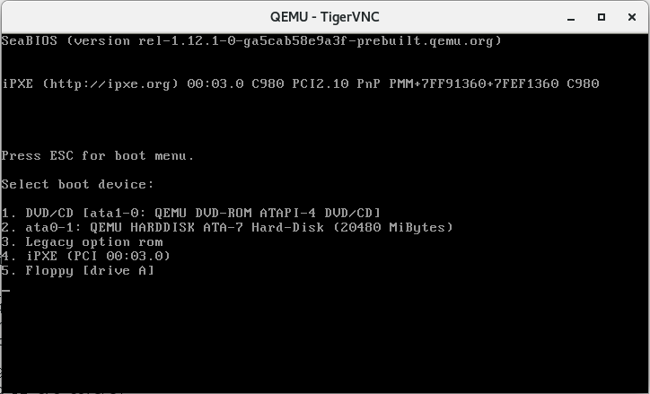

<!-- @import "[TOC]" {cmd="toc" depthFrom=1 depthTo=6 orderedList=false} -->

<!-- code_chunk_output -->

- [1. 存储配置和启动顺序](#1-存储配置和启动顺序)
  - [1.1. 存储的基本配置选项](#11-存储的基本配置选项)
    - [1.1.1. -hda file](#111--hda-file)
    - [1.1.2. -hdb file](#112--hdb-file)
    - [1.1.3. -hdc file](#113--hdc-file)
    - [1.1.4. -hdd file](#114--hdd-file)
    - [1.1.5. -fda file](#115--fda-file)
    - [1.1.6. -fdb file](#116--fdb-file)
    - [1.1.7. -cdrom file](#117--cdrom-file)
    - [1.1.8. -mtdblock file](#118--mtdblock-file)
    - [1.1.9. -sd file](#119--sd-file)
    - [1.1.10. -pflash file](#1110--pflash-file)
  - [1.2. 详细配置存储驱动器的 -drive 参数](#12-详细配置存储驱动器的--drive-参数)
  - [1.3. 配置客户机启动顺序的参数](#13-配置客户机启动顺序的参数)
  - [1.4. 存储配置的示例](#14-存储配置的示例)
- [2. qemu-img 命令](#2-qemu-img-命令)
  - [2.1. check: 一致性检查](#21-check-一致性检查)
  - [2.2. create: 创建镜像](#22-create-创建镜像)
  - [2.3. commit: 提交更改到后端镜像文件](#23-commit-提交更改到后端镜像文件)
  - [2.4. convert: 镜像格式转换](#24-convert-镜像格式转换)
  - [2.5. info: 镜像信息](#25-info-镜像信息)
  - [2.6. snapshot: 快照相关](#26-snapshot-快照相关)
  - [2.7. rebase: 改变后端镜像文件](#27-rebase-改变后端镜像文件)
  - [2.8. resize: 调整大小](#28-resize-调整大小)
- [3. QEMU 支持的镜像文件格式](#3-qemu-支持的镜像文件格式)
  - [3.1. raw](#31-raw)
  - [3.2. qcow2](#32-qcow2)
  - [3.3. qcow](#33-qcow)
  - [3.4. vdi](#34-vdi)
  - [3.5. vmdk](#35-vmdk)
  - [3.6. vpc](#36-vpc)
  - [3.7. vhdx](#37-vhdx)
  - [3.8. sheepdog](#38-sheepdog)
- [4. 客户机存储方式](#4-客户机存储方式)
  - [4.1. 本地镜像文件](#41-本地镜像文件)
  - [4.2. 磁盘或 LVM 分区](#42-磁盘或-lvm-分区)
  - [4.3. NFS](#43-nfs)
  - [4.4. iSCSI](#44-iscsi)
  - [4.5. 光纤](#45-光纤)
  - [4.6. GFS2](#46-gfs2)
- [5. 资料](#5-资料)

<!-- /code_chunk_output -->

# 1. 存储配置和启动顺序

QEMU 提供了对多种块存储设备的模拟, 包括**IDE 设备**、**SCSI 设备**、**软盘**、**U 盘**、**virtio 磁盘**等, 而且对设备的启动顺序提供了灵活的配置.

## 1.1. 存储的基本配置选项

在 qemu 命令行工具中, 主要有如下的参数来配置客户机的存储.

### 1.1.1. -hda file

将 file 镜像文件作为客户机中的**第 1 个 IDE 设备**(序号 0), 而在**客户机**中表现为:

* `/dev/hda` 设备, 若客户机中使用 `PIIX_IDE` 驱动;

* `/dev/sda` 设备, 若客户机中使用 `ata_piix` 驱动(目前 kernel 使用的).

如果**不指定** `-hda` 或 `-hdb` 等参数, 那么在前面一些例子中提到的 `qemu-system-x86_64 /root/kvm_demo/rhel6u3.img` 就与加上`-hda` 参数来指定镜像文件的**效果是一样的**.

也可以将**宿主机！！！**中的**一个硬盘！！！**(如 `/dev/sdb`)作为 `-hda` 的 file 参数来使用, 从而让**整个硬盘**模拟为客户机的**第 1 个 IDE 设备**.

如果**file 文件的文件名**中包含有**英文逗号(",**"), 则在书写 file 时应该使用**两个逗号**(因为**逗号是 qemu 命令行中的特殊间隔符**), 如使用"\-hda my,,file"将"my,file"这个文件作为客户机的第 1 个 IDE 设备.

### 1.1.2. -hdb file

将 file 作为客户机中的**第 2 个 IDE 设备**(序号 1), 在客户机中表现为/**dev/hdb**或/**dev/sdb**设备.

### 1.1.3. -hdc file

将 file 作为客户机中的**第 3 个 IDE 设备**(序号 2), 在客户机中表现为/**dev/hdc**或/**dev/sdc**设备.

### 1.1.4. -hdd file

将 file 作为客户机中的第 4 个 IDE 设备(序号 3), 在客户机中表现为 `/dev/hdd` 或 `/dev/sdd` 设备.

### 1.1.5. -fda file

将 file 作为客户机中的**第 1 个软盘设备**(序号 0), 在客户机中表现为 `/dev/fd0` 设备. 也可以将**宿主机**中的**软驱**(`/dev/fd0`)作为 `-fda` 的 file 来使用.

### 1.1.6. -fdb file

将 file 作为客户机中的**第 2 个软盘设备**(序号 1), 在客户机中表现为 `/dev/fd1` 设备.

### 1.1.7. -cdrom file

将**file**作为**客户机**中的**光盘 CD\-ROM**, 在客户机中通常表现为/**dev/cdrom 设备**.

也可以将**宿主机中的光驱**(`/dev/cdrom`)作为 `-cdrom` 的 file 来使用.

注意, `-cdrom` 参数不能和 `-hdc` 参数同时使用, 因为"\-cdrom"就是**客户机**中的**第 3 个 IDE 设备！！！**.

在通过**物理光驱中的光盘**或**磁盘中 ISO 镜像**文件**安装客户机操作系统**时(参见 3.5 节), **一般会使用\-cdrom 参数**.

### 1.1.8. -mtdblock file

使用 file 文件作为客户机自带的一个**Flash 存储器**(通常说的**闪存**).

### 1.1.9. -sd file

使用 file 文件作为客户机中的**SD 卡**(Secure Digital Card).

### 1.1.10. -pflash file

使用 file 文件作为客户机的并行 Flash 存储器(Parallel Flash Memory).

## 1.2. 详细配置存储驱动器的 -drive 参数

QEMU 还提供了"`-drive`"参数来**详细定义一个存储驱动器**, 该参数的具体形式如下:

```
-drive option[,option[,option[,...]]]
```

为客户机定义一个新的驱动器, 它有如下一些选项:

(1) file=file

使用 file 文件作为镜像文件加载到客户机的驱动器中.

(2) if=interface

指定驱动器使用的接口类型, 可用的类型有: **ide**、**scsi**、**sd**、**mtd**、**floopy**、**pflash**、**virtio**, 等等.

其中, 除了 virtio、scsi 之外, 其余几种类型都在本节的前面介绍过了. virtio 将在第 6 章中介绍.

(3) bus=bus, unit=unit

设置驱动器在客户机中的**总线编号**和**单元编号**.

(4)index=index

设置在同一种接口的驱动器中的**索引编号**.

(5) media=media

设置驱动器中**媒介的类型**, 其值为"**disk**"或"**cdrom**".

(6) snapshot=snapshot

设置是否启用"\-snapshot"选项, 其可选值为"on"或"off".

当**snapshot 启用**时, QEMU**不会**将**磁盘数据的更改**写回**镜像文件**中, 而是写到**临时文件**中.

当然可以在 QEMU monitor 中使用"**commit**"命令强制将磁盘数据的更改保存回镜像文件中.

(7) cache=cache

设置宿主机对**块设备数据**(包括**文件**或**一个磁盘**)访问中的**cache 情况**, 可以设置为"**none**"(或"**off**")"**writeback**""**writethrough**"等.

其**默认值**是"**writethrough**", 即"**直写模式**", 它是在**调用 write**写入数据的**同时**将数据**写入磁盘缓存**(disk cache)和**后端块设备**(block device)中, 其优点是操作简单, 其缺点是写入数据速度较慢.

而"writeback"即"回写模式", 在调用 write 写入数据时只将数据写入磁盘缓存中即返回, 只有在数据被换出缓存时才将修改的数据写到后端存储中. 其优点是写入数据速度较快, 其缺点是一旦更新数据在写入后端存储之前遇到系统掉电, 数据会无法恢复.

"writethrough"和"writeback"在读取数据时都**尽量使用缓存**, 若设置了"cache=none"关闭缓存的方式, QEMU 将在调用 open 系统调用打开镜像文件时使用"O\_DIRECT"标识, 所以其读写数据都是**绕过缓存**直接从块设备中读写的.

一些**块设备文件**(如后面即将介绍的**qcow2**格式文件)在"**writethrough**"模式下性能表现很差, 如果这时对性能要求比正确性更高, 建议使用"writeback"模式.

(8) aio=aio

选择**异步 IO**(Asynchronous IO)的方式, 有"**threads**"和"**native**"两个值可选.

- 其默认值为"threads", 即让**一个线程池**去处理**异步 IO**.
- 而"native"只适用于"**cache=none**"的情况, 就是使用**Linux 原生的 AIO**.

(9)format=format

指定使用的**磁盘格式**, 在**默认**情况下 QEMU**自动检测磁盘格式**.

(10)serial=serial

指定分配给**设备的序列号**.

(11)addr=addr

分配给驱动器控制器的**PCI 地址**, 该选项只有在使用**virtio 接口**时才适用.

(12)id=name

设置该**驱动器的 ID**, 这个 ID 可以在 QEMU monitor 中用"**info block**"看到.

(13)readonly=on|off

设置该驱动器是否只读.

```
-drive file=rbd:volumes/volume-684a7a54-0cfc-4bf5-b1ab-8e43145b112c:id=cinder-volume:auth_supported=cephx\;none:mon_host=10.5.8.126\:6789\;10.5.8.127\:6789\;10.5.8.128\:6789,file.password-secret=virtio-disk0-secret0,format=raw,if=none,id=drive-virtio-disk0,serial=684a7a54-0cfc-4bf5-b1ab-8e43145b112c,cache=none,discard=unmap
```

## 1.3. 配置客户机启动顺序的参数

前面介绍了各种存储设备的使用参数, 它们在客户机中的启动顺序可以用如下的参数设定:

```
-boot [order=drives][,once=drives][,menu=on|off] [,splash=splashfile] [,splash-time=sp-time]
```

在 QEMU 模拟的**x86 PC**平台中, 用"**a**""**b**"分别表示**第 1 个**和**第 2 个软驱**, 用"**c**"表示**第 1 个硬盘**, 用"**d**"表示**CD\-ROM 光驱**, 用"**n**"表示**从网络启动**.

其中, **默认从硬盘启动**, 要从**光盘启动**可以设置"\-boot order=d".

"once"表示设置第 1 次启动的启动顺序, 在**系统重启(reboot)后该设置即无效**, 如"\-boot once=d"设置表示本次从光盘启动, 但**系统重启**后从**默认的硬盘启动**.

"memu=on|off"用于设置**交互式的启动菜单选项**(前提是使用的**客户机 BIOS 支持！！！**), 它的默认值是"menu=off", 表示不开启交互式的启动菜单选择.

"splash=splashfile"和"splash\-time=sp\-time"选项都是在"**menu=on**"时才有效,

- 将名为**splashfile 的图片**作为**logo**传递给 BIOS 来显示;
- 而**sp\-time**是**BIOS 显示 splash 图片的时间**, 其单位是**毫秒**(ms).

图 5-5 展示了在使用"\-**boot order=dc, menu=on**"设置后, 在客户机启动窗口中按 esc 键进入的启动菜单.

```
qemu-system-x86_64 -enable-kvm -m 2G -hdb /data/images/centos7.4.20g.qcow2 -boot order=dcn,menu=on,splash=/root/t.jpeg,splash-time=20000 -daemonize
```



## 1.4. 存储配置的示例

在介绍完基本的参数与启动顺序后, 通过示例来看一下磁盘实际配置和在客户机中的效果. 通过如下的 3 个等价命令之一启动一个客户机.

```
qemu-system-x86_64 -m 1024 -smp 2 rhel7.img
qemu-system-x86_64 -m 1024 -smp 2 -hda rhel7.img
qemu-system-x86_64 -m 1024 -smp 2 -drive file=rhel7.img,if=ide
```

进入启动菜单, 在客户机中查看磁盘情况

# 2. qemu-img 命令

qemu\-img 是 QEMU 的**磁盘管理工具**, 在完成**QEMU 源码！！！编译后**就会**默认编译**好 qemu\-img 这个二进制文件.

qemu-img 工具的命令行基本用法如下:

```
qemu-img [standard options] command [command options]
```

它支持的命令分为如下几种.

## 2.1. check: 一致性检查

```
check [-f fmt] filename
```

对**磁盘镜像文件**进行**一致性检查**, 查找镜像文件中的错误, 目前**仅支持**对"**qcow2**""**qed**""**vdi**"格式文件的检查. 其中,

- qcow2 是目前使用最广泛的格式.
- qed(QEMU enhanced disk)是从 QEMU 0.14 版开始加入的增强磁盘文件格式, 它可以在不支持空洞(hole)的文件系统和存储媒介上压缩 image, 避免了 qcow2 格式的一些缺点, 也提高了性能.
- 而 vdi(Virtual Disk Image)是 Oracle 的 VirtualBox 虚拟机中的存储格式.

参数\-f fmt 是指定文件的格式, 如果**不指定格式**, qemu\-img 会**自动检测**. filename 是磁盘镜像文件的名称(包括路径).

如下命令行演示了 qemu\-img 的 check 命令的使用方法.

```
[root@kvm-host ~]# qemu-img check rhel7.3.qcow2
No errors were found on the image.
Image end offset: 262144
```

## 2.2. create: 创建镜像

```
create [-f fmt] [-o options] filename [size]
```

创建一个**格式为 fmt**, **大小为 size**, 文件名为 filename 的镜像文件.

根据文件格式**fmt 的不同**, 还可以添加**一个或多个选项(options**)来附加对该文件的各种功能设置.

可以使用"\-o ?"来查询某种格式文件**支持哪些选项**, 在"\-o"选项中**各个选项用逗号来分隔**.

如果在"\-o"选项中使用了**backing\_file**这个选项来指定其**后端镜像文件**, 那么这个**创建的镜像文件**仅记录与**后端镜像文件**的**差异部分**.

**后端镜像文件不会被修改！！！**, 除非在**QEMU monitor**中使用"**commit**"命令或使用"**qemu\-img commit**"命令去手动提交这些改动. 在这种情况下, **size 参数不是必需**的, 其值**默认**为**后端镜像文件的大小**.

另外, 直接使用"\-**b backfile**"参数效果也与"\-**o backing\_file=backfile**"相同.

size 选项用于指定**镜像文件的大小**, 其**默认**单位是**字节(bytes**), 也可以支持**k(即 K**)、**M**、**G**、**T**来分别表示**kB**、**MB**、**GB**、**TB**大小. 另外, 镜像文件的大小(**size**)也并非必须写在命令的最后, 也可以写在"\-o"选项中作为**其中一个选项**.

对 create 命令的演示如下所示, 其中包括查询 qcow2 格式支持的选项、创建有 backing_file 的 qcow2 格式的镜像文件、创建没有 backing_file 的 10GB 大小的 qcow2 格式的镜像文件.

```
[root@gerrylee ~]# qemu-img create -f qcow2 -o ?
Supported qcow2 options:
  backing_file=<str>     - File name of a base image
  backing_fmt=<str>      - Image format of the base image
  cluster_size=<size>    - qcow2 cluster size
  compat=<str>           - Compatibility level (0.10 or 1.1)
  data_file=<str>        - File name of an external data file
  data_file_raw=<bool (on/off)> - The external data file must stay valid as a raw image
  encrypt.cipher-alg=<str> - Name of encryption cipher algorithm
  encrypt.cipher-mode=<str> - Name of encryption cipher mode
  encrypt.format=<str>   - Encrypt the image, format choices: 'aes', 'luks'
  encrypt.hash-alg=<str> - Name of encryption hash algorithm
  encrypt.iter-time=<num> - Time to spend in PBKDF in milliseconds
  encrypt.ivgen-alg=<str> - Name of IV generator algorithm
  encrypt.ivgen-hash-alg=<str> - Name of IV generator hash algorithm
  encrypt.key-secret=<str> - ID of secret providing qcow AES key or LUKS passphrase
  encryption=<bool (on/off)> - Encrypt the image with format 'aes'. (Deprecated in favor of encrypt.format=aes)
  lazy_refcounts=<bool (on/off)> - Postpone refcount updates
  preallocation=<str>    - Preallocation mode (allowed values: off, metadata, falloc, full)
  refcount_bits=<num>    - Width of a reference count entry in bits
  size=<size>            - Virtual disk size

The protocol level may support further options.
Specify the target filename to include those options.

[root@kvm-host ~]# qemu-img create -f qcow2 -o backing_file=rhel7.img,size=20G  rhel7-2.qcow2
Formatting 'rhel7-2.qcow2', fmt=qcow2 size=21474836480 backing_file=rhel7.img encryption=off cluster_size=65536 lazy_refcounts=off refcount_bits=16

[root@kvm-host ~]# qemu-img create -f qcow2 ubuntu.qcow2 10G
Formatting 'ubuntu.qcow2', fmt=qcow2 size=10737418240 encryption=off cluster_size=65536 lazy_refcounts=off refcount_bits=16
```

## 2.3. commit: 提交更改到后端镜像文件

```
commit[-f fmt]filename
```

提交 filename 文件中的更改到后端支持镜像文件(创建时通过**backing\_file**指定的)中.

## 2.4. convert: 镜像格式转换

```
convert[-c][-f fmt][-O output_fmt][-o options]filename[filename2[...]]output_filename
```

将 fmt 格式的 filename 镜像文件根据**options 选项**转换为格式为**output\_fmt 的**、名为 output\_filename 的镜像文件.

这个命令支持不同格式的镜像文件之间的转换, 比如可以用 VMware 使用的**vmdk 格式**文件转换为**qcow2**文件, 这对从其他虚拟化方案转移到 KVM 上的用户非常有用.

一般来说, **输入文件格式**fmt 由 qemu\-img 工具**自动检测**到, 而**输出文件格式**output\_fmt 根据自己需要来指定, **默认**会被转换为**raw 文件格式**(且默认使用**稀疏文件的方式存储**, 以节省存储空间).

其中, "\-c"参数表示对输出的镜像文件进行**压缩**, 不过只有**qcow2**和**qcow**格式的镜像文件才支持压缩, 并且**这种压缩是只读的**, 如果压缩的扇区被重写, 则会被重写为未压缩的数据.

同样, 可以使用"\-**o options**"来指定各种选项, 如后端镜像、文件大小、是否加密等. 使用 backing\_file 选项来指定后端镜像, 使生成的文件成为 copy\-on\-write 的增量文件, 这时必须让在转换命令中指定的后端镜像与输入文件的后端镜像的内容相同, 尽管它们各自后端镜像的目录和格式可能不同.

如果使用 qcow2、qcow 等作为输出文件格式来转换 raw 格式的镜像文件(非稀疏文件格式), 镜像转换还可以将镜像文件转化为更小的镜像, 因为它可以将空的扇区删除, 使之在生成的输出文件中不存在.

下面的命令行演示了两个转换: 将 VMware 的 vmdk 格式镜像转换为 KVM 可以使用的 raw 格式的镜像, 将一个 raw 镜像文件转化为 qcow2 格式的镜像.

```
[root@kvm-host ~]# qemu-img convert -O raw my-VMware.vmdk my-kvm.img

[root@kvm-host ~]# qemu-img convert -O qcow2 rhel7.img rhel7-a.qcow2
```

## 2.5. info: 镜像信息

```
info[-f fmt]filename
```

展示 filename 镜像文件的信息. 如果文件使用的是稀疏文件的存储方式, 也会显示出它本来分配的大小及实际已占用的磁盘空间大小. 如果文件中存放有客户机快照, 快照的信息也会被显示出来. 下面的命令行演示了前面进行文件转换的输入、输出文件的信息.

```
[root@kvm-host ~]# qemu-img info rhel7.img
image: rhel7.img
file format: raw
virtual size: 40G (42949672960 bytes)
disk size: 40G
[root@kvm-host ~]# qemu-img info rhel7-a.qcow2
image: rhel7-a.qcow2
file format: qcow2
virtual size: 40G (42949672960 bytes)
disk size: 24G
cluster_size: 65536
Format specific information:
    compat: 1.1
    lazy refcounts: false
    refcount bits: 16
    corrupt: false
```

## 2.6. snapshot: 快照相关

```
snapshot[-l|-a snapshot|-c snapshot|-d snapshot]filename
```

- "\-l"选项表示查询并列出镜像文件中的所有快照,

- "\-a snapshot"表示让镜像文件使用某个快照,

- "\-c snapshot"表示创建一个快照,

- "\-d"表示删除一个快照.

## 2.7. rebase: 改变后端镜像文件

```
rebase[-f fmt][-t cache][-p][-u]-b backing_file[-F backing_fmt]filename
```

改变镜像文件的后端镜像文件, 只有 qcow2 和 qed 格式支持 rebase 命令. 使用"-b backing_file"中指定的文件作为后端镜像, 后端镜像也被转化为"-F backing_fmt"中指定的后端镜像格式.

这个命令可以工作于两种模式之下, 一种是安全模式(Safe Mode), 这是默认的模式, qemu-img 会根据比较原来的后端镜像与现在的后端镜像的不同进行合理的处理; 另一种是非安全模式(Unsafe Mode), 是通过"-u"参数来指定的, 这种模式主要用于将后端镜像重命名或移动位置后对前端镜像文件的修复处理, 由用户去保证后端镜像的一致性.

## 2.8. resize: 调整大小

```
resize filename [+|-]size
```

改变镜像文件的大小, 使其不同于创建之时的大小.

"\+"和"\-"分别表示增加和减少镜像文件的大小, size 也支持 K、M、G、T 等单位的使用.

缩小镜像的大小之前, 需要在客户机中保证其中的文件系统有空余空间, 否则数据会丢失.

另外, **qcow2**格式文件**不支持缩小镜像**的操作. 在增加了镜像文件大小后, 也需启动客户机在其中应用"**fdisk**""**parted**"等分区工具进行相应的操作, 才能真正让客户机使用到增加后的镜像空间. 不过使用 resize 命令时需要小心(做好备份), 如果失败, 可能会导致镜像文件无法正常使用, 而造成数据丢失.

如下命令行演示了两个镜像的大小改变: 将一个 8GB 的 qcow2 镜像增加 2GB 的空间, 将一个 8GB 大小的 raw 镜像减少 1GB 的空间.

```
[root@kvm-host ~]# qemu-img resize rhel7-a.qcow2 +2G
Image resized.

[root@kvm-host ~]# qemu-img info rhel7-a.qcow2
image: rhel7-a.qcow2
file format: qcow2
virtual size: 42G (45097156608 bytes)
disk size: 24G
cluster_size: 65536
Format specific information:
    compat: 1.1
    lazy refcounts: false
    refcount bits: 16
    corrupt: false
[root@kvm-host ~]# qemu-img resize rhel7-b.img -10G
Image resized.
[root@kvm-host ~]# qemu-img info rhel7-b.img
image: rhel7-b.img
file format: raw
virtual size: 30G (32212254720 bytes)
disk size: 30G
```

# 3. QEMU 支持的镜像文件格式

可以通过"qemu\-img \-h"查看帮助, 它支持 20 多种格式: file, quorum, blkverify, luks, dmg, sheepdog, parallels, nbd, vpc, bochs, blkdebug, qcow2, vvfat, qed, host_cdrom, cloop, vmdk, host_device, qcow, vdi, null\-aio, blkreplay, null\-co, raw 等.

## 3.1. raw

**原始的磁盘镜像格式**, 也是 qemu\-img 命令**默认的文件格式**. 这种格式的文件的优势在于它非常简单, 且非常容易移植到**其他模拟器**(**emulator**, **QEMU 也是一个 emulator**)上去使用.

如果**客户机文件系统！！！**(如**Linux**的**ext2/ext3/ext4**、Windows 的**NTFS**)支持"**空洞"(hole！！！**), 那么镜像文件只有在**被写有数据的扇区**才会**真正占用磁盘空间**, 从而节省磁盘空间, 就如前面用"**qemu\-img info**"命令查看镜像文件信息中看到的那样.

qemu\-img 默认的 raw 格式的文件其实是**稀疏文件(sparse file**), 可以用**preallocation 参数=full**来**禁用**稀疏文件方式而完全预分配空间.

raw 格式**只有一个参数选项**: **preallocation**. 它有 3 个值: off, falloc, full.

- off 就是**禁止预分配**空间, 即采用**稀疏文件**方式, 这是**默认值**.
- falloc 是 qemu\-img 创建镜像时候调用**posix\_fallocate**()函数来**预分配磁盘空间**给镜像文件(但**不往其中写入数据**, 所以也能**瞬时完成**).
- full 是除了实实在在地预分配空间以外, 还逐字节地写 0, 所以很慢.

我们通过实验来看一下.

```
[root@kvm-host ~]# time qemu-img create -f raw test.img -o preallocation=off 100G
Formatting 'test.img', fmt=raw size=107374182400 preallocation=off

real   0m0.003s
user   0m0.001s
sys   0m0.003s

[root@kvm-host ~]# time qemu-img create -f raw test_falloc.img -o preallocation=falloc 10G
Formatting 'test_falloc.img', fmt=raw size=10737418240 preallocation=falloc

real   0m0.041s
user   0m0.001s
sys   0m0.002s

[root@kvm-host ~]# time qemu-img create -f raw test_full.img -o preallocation=full 10G
Formatting 'test_full.img', fmt=raw size=10737418240 preallocation=full

real   1m26.129s
user   0m0.009s
sys      0m7.356s
[root@kvm-host ~]# du -h test*.img
10G      test_falloc.img
10G      test_full.img
0      test.img
```

**off**和**falloc**都是**瞬时返回**, 而**full**要花 1 分多钟时间.

文件所占磁盘空间, **off**的情况下, **不占任何空间**, 而 falloc 和 full 则都实际预分配了空间.

在不追求性能的情况下, 我们推荐使用**默认的 off 方式**.

## 3.2. qcow2

qcow2 是 QEMU 目前推荐的镜像格式.

它支持**稀疏文件**(即**支持空洞**)以节省存储空间, 它支持可选的**AES 加密**以提高镜像文件安全性, 支持**基于 zlib 的压缩**, 支持在**一个镜像文件**中有**多个虚拟机快照**.

在 qemu\-img 命令中, qcow2 支持如下几个选项:

- **size**, 指定镜像文件的大小. 等同于 qemu\-img create \-f fmt \<文件名\> size.
- **compat**(**兼容性水平**, compatibility level), 可以等于**0.10**或者**1.1**, 表示适用于**0.10 版本以后的 QEMU**, 或者是**1.1 版本以后的 QEMU**.
- backing\_file, 用于指定**后端镜像文件**.
- backing\_fmt, 设置**后端镜像的镜像格式**.
- cluster\_size, 设置镜像中**簇的大小**, 取值为**512B~2MB**, 默认值为**64kB**. **较小的簇**可以**节省**镜像文件的空间, 而**较大的簇**可以带来**更好的性能**, 需要根据实际情况来平衡. **一般采用默认值**即可.
- preallocation, 设置镜像文件空间的**预分配模式**, 其值可为**off**、**falloc**、**full**、**metadata**. 前 3 种与 raw 格式的类似, **metadata**模式用于设置**为镜像文件预分配 metadata 的磁盘空间！！！**, 所以这种方式生成的**镜像文件稍大**一点, 不过在其真正分配空间写入数据时效率更高. 生成**镜像文件的大小**依次是 off \< metadata \< falloc = full, 性能上 full 最好, 其他 3 种依次递减.
- encryption, 用于**设置加密**, 该选项**将来会被废弃**, 不推荐使用. 对于需要**加密镜像**的需求, 推荐使用 Linux 本身的**Linux dm\-crypt/LUKS**系统.
- lazy\_refcounts, 用于**延迟引用计数(refcount)的更新**, 可以减少 metadata 的 I/O 操作, 以达到提高 performance 的效果. 适用于**cache=writethrough**这类不会自己组合 metadata 操作的情况. 它的缺点是一旦客户机意外崩溃, **下次启动**时会隐含一次**qemu\-img check \-r all**的操作, 需要额外花费点时间. 它是当**compact=1.1**时才有的选项.
- refcount\_bits, 一个**引用计数**的**比特宽度**, 默认为 16.

```
[root@kvm-host ~]# qemu-img create -f qcow2 -o compat=0.10,size=10G test.qcow2
Formatting 'test.qcow2', fmt=qcow2 size=10737418240 compat=0.10 encryption=off cluster_size=65536 lazy_refcounts=off refcount_bits=16
[root@kvm-host ~]# qemu-img info test.qcow2
image: test.qcow2
file format: qcow2
virtual size: 10G (10737418240 bytes)
disk size: 196K
cluster_size: 65536
Format specific information:
    compat: 0.10
    refcount bits: 16
[root@kvm-host ~]# qemu-img create -f qcow2 -o compat=1.1,size=10G test.qcow2
Formatting 'test.qcow2', fmt=qcow2 size=10737418240 compat=1.1 encryption=off cluster_size=65536 lazy_refcounts=off refcount_bits=16
[root@kvm-host ~]# qemu-img info test.qcow2
image: test.qcow2
file format: qcow2
virtual size: 10G (10737418240 bytes)
disk size: 196K
cluster_size: 65536
Format specific information:
    compat: 1.1
    lazy refcounts: false
    refcount bits: 16
    corrupt: false
```

## 3.3. qcow

这是较旧的 QEMU 镜像格式, 现在已经很少使用了, 一般用于兼容比较老版本的 QEMU. 它支持 size、backing\_file(后端镜像)和 encryption(加密)3 个选项.

## 3.4. vdi

兼容 Oracle(Sun)VirtualBox1.1 的镜像文件格式(Virtual Disk Image).

## 3.5. vmdk

兼容 VMware 4 版本以上的镜像文件格式(Virtual Machine Disk Format).

## 3.6. vpc

兼容 Microsoft 的 Virtual PC 的镜像文件格式(Virtual Hard Disk format).

## 3.7. vhdx

兼容 Microsoft Hyper-V 的镜像文件格式.

## 3.8. sheepdog

sheepdog 项目是由日本 NTT 实验室发起的、为 QEMU/KVM 做的一个开源的分布式存储系统, 为 KVM 虚拟化提供块存储. 它无单点故障(无类似于元数据服务器的中央节点), 方便扩展(已经支持上千个节点数量), 配置简单, 运维成本较低. 总的来说, 它具有高可用性、易扩展性、易管理性等优势. sheepdog 项目的官方网站为: http://www.osrg.net/sheepdog/.

# 4. 客户机存储方式

前面介绍了存储的配置和 qemu\-img 工具来**管理镜像**, 在 QEMU/KVM 中, 客户机**镜像文件**可以由很多种方式来构建, 其中几种如下:
·
- **本地存储**的客户机镜像文件.
- **物理磁盘**或**磁盘分区**.
- **LVM**(Logical Volume Management), 逻辑分区.
- **NFS**(Network File System), 网络文件系统.
- **iSCSI**(Internet Small Computer System Interface), 基于 Internet 的小型计算机系统接口.
- **本地或光纤通道连接的 LUN**(Logical Unit Number).
- **GFS2**(Global File System 2).

## 4.1. 本地镜像文件

本地存储的客户机镜像文件是最常用的一种方式, 它有预分配空间的 raw 文件、稀疏文件类型的 raw 文件、qcow2 等多种格式.

## 4.2. 磁盘或 LVM 分区

不仅一个文件可以分配给客户机作为镜像文件系统, 而且**一个完整！！！的磁盘**或**LVM 分区**也可以**作为镜像分配给客户机**使用. 一般来说, 磁盘或 LVM 分区会有较好的性能, 读写的延迟较低、吞吐量较高. 不过为了**防止客户机破坏物理磁盘分区**, 一般**不将整个磁盘**作为镜像分配给客户机使用. 使用磁盘或 LVM 分区的**劣势**在于**管理和移动性**方面都不如镜像文件方便, 而且**不方便通过网络远程**使用.

## 4.3. NFS

而**NFS**作为使用非常广泛的**分布式文件系统**, 可以使**客户端挂载远程 NFS 服务器中的共享目录**, 然后**像使用本地文件系统**一样使用 NFS 远程文件系统.

如果 NFS 服务器端向客户端开放了**读写的权限**, 那么可以直接挂载 NFS, 然后使用其中的镜像文件作为客户启动磁盘.

如果**没有向客户端开放写权限**, 也可以在 NFS 客户端系统中将远程 NFS 系统上的镜像文件作为**后端镜像(backing file**), 以建立 qcow2 格式 Copy\-On\-Write 的本地镜像文件供客户机使用. 这样做还有一个好处是**保持 NFS 服务器上的镜像一致性、完整性**, 从而可以供给**多个客户端同时使用**.

而且由于 NFS 的共享特性, 因此 NFS 方式为客户机的**动态迁移**(第 8 章会介绍)提供了非常方便的共享存储系统. 下面的命令行演示了 NFS 作为后端镜像的应用, 在本地用 qcow2 格式镜像文件启动一个客户机.

在宿主机中, 挂载 NFS 文件系统, 建立 qcow2 镜像, 然后启动客户机, 如下所示(my\-nfs 就是网络上的 NFS server):

```
[root@kvm-host ~]# mount my-nfs:/images /images/
[root@kvm-host ~]# qemu-img create -f qcow2 -o backing_file=/images/linux/ia32e_rhel7.img,size=20G rhel7.qcow2
Formatting 'rhel7.qcow2', fmt=qcow2 size=21474836480 backing_file='/images/linux/ia32e_rhel7.img' encryption=off cluster_size=65536
[root@kvm-host ~]# qemu-system-x86_64 -smp 2 -m 1024 -net nic -net tap -hda rhel7.qcow2 -vnc :0 -daemonize
```

在客户机中, 查看磁盘文件系统, 如下所示:

```
[root@kvm-guest ~]# fdisk -l

Disk /dev/sda: 21.5 GB, 21474836480 bytes
255 heads, 63 sectors/track, 2610 cylinders
Units = cylinders of 16065 * 512 = 8225280 bytes
Sector size (logical/physical): 512 bytes / 512 bytes
I/O size (minimum/optimal): 512 bytes / 512 bytes
Disk identifier: 0x000726b0

   Device Boot      Start         End      Blocks   Id  System
/dev/sda1   *           1         931     7471104   83  Linux
Partition 1 does not end on cylinder boundary.
/dev/sda2             931        1045      916480   82  Linux swap / Solaris
```

## 4.4. iSCSI

iSCSI 是一套**基于 IP 协议**的网络存储标准, 真正的**物理存储**放在**目标端(target**), 而**使用 iSCSI 磁盘**的是**初始端(initiator**), 它们之间实现了**SCSI 标准的命令**, 让**目标端使用**起来就与**使用本地的 SCSI 硬盘**一样, 只是数据是在网络上进行读写操作的.

## 4.5. 光纤

**光纤通道(Fibre Channel**)也可以实现与 iSCSI 类似的存储区域网络(storage area network, SAN), 不过它需要光纤作为特殊的网络媒介.

## 4.6. GFS2

而 GFS2 是由 Redhat 公司主导开发的主要给**Linux 计算机集群**使用的**共享磁盘文件系统**, 一般在 Redhat 的 RHEL 系列系统中有较多使用, 它也可被用作 QEMU/KVM 的磁盘存储系统.

另外, 如果需要获得**更高性能的磁盘 I/O**, 可以使用**半虚拟化的 virtio**作为磁盘**驱动程序**, 第 6 章中将会详细介绍 virtio 的相关内容.

# 5. 资料

QEMU 虚拟存储的几种访问形式: http://mnstory.net/2016/06/13/storage-access-by-qemu/