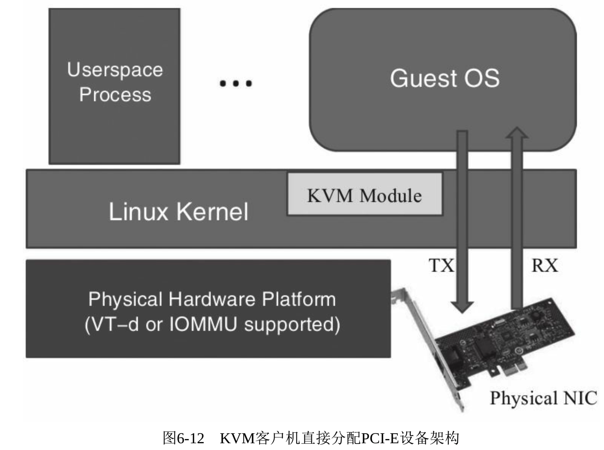
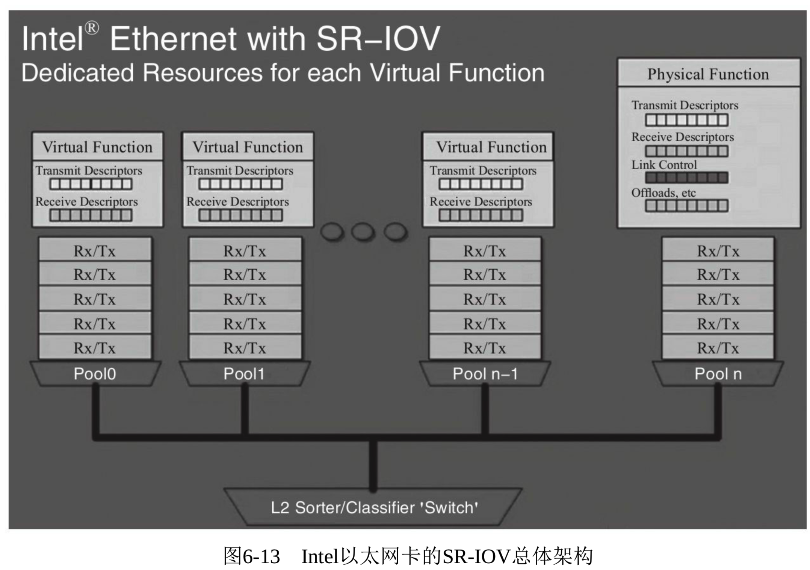
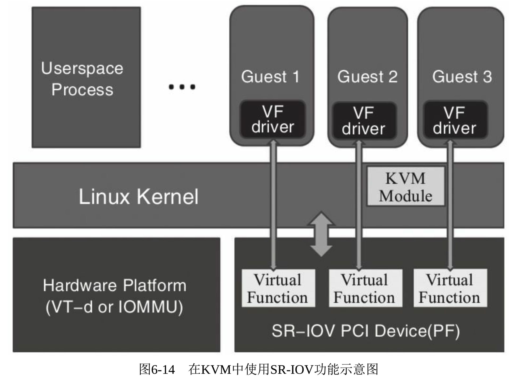

<!-- @import "[TOC]" {cmd="toc" depthFrom=1 depthTo=6 orderedList=false} -->

<!-- code_chunk_output -->

- [1. VT-d 概述](#1-vt-d-概述)
  - [1.1. 3 种客户机设备类型](#11-3-种客户机设备类型)
  - [1.2. VT-d 的硬件支持和软件使用](#12-vt-d-的硬件支持和软件使用)
  - [1.3. VT-d 的 3 个缺点和解决方案](#13-vt-d-的-3-个缺点和解决方案)
- [2. VFIO 简介](#2-vfio-简介)
  - [2.1. VFIO 相对于 pci-stub 的改进](#21-vfio-相对于-pci-stub-的改进)
- [3. VT-d 环境配置](#3-vt-d-环境配置)
  - [3.1. 硬件支持和 BIOS 设置](#31-硬件支持和-bios-设置)
  - [3.2. 宿主机内核的配置](#32-宿主机内核的配置)
    - [3.2.1. VT-d 相关内核编译选项以及启动参数](#321-vt-d-相关内核编译选项以及启动参数)
    - [3.2.2. VFIO 相关内核编译选项](#322-vfio-相关内核编译选项)
    - [3.2.3. 系统检查](#323-系统检查)
  - [3.3. 在宿主机中隐藏设备](#33-在宿主机中隐藏设备)
  - [3.4. 通过 QEMU 命令行分配设备给客户机](#34-通过-qemu-命令行分配设备给客户机)
- [4. VT-d 操作示例](#4-vt-d-操作示例)
  - [4.1. 网卡直接分配](#41-网卡直接分配)
  - [4.2. 硬盘控制器直接分配](#42-硬盘控制器直接分配)
  - [4.3. USB 控制器直接分配](#43-usb-控制器直接分配)
  - [4.4. VGA 显卡直接分配](#44-vga-显卡直接分配)
- [5. SR-IOV 技术](#5-sr-iov-技术)
  - [5.1. SR-IOV 概述](#51-sr-iov-概述)
    - [5.1.1. SRIOV 原理](#511-sriov-原理)
    - [5.1.2. SRIOV 的硬件和软件支持](#512-sriov-的硬件和软件支持)
    - [5.1.3. PF 生成 VF 的两种方式](#513-pf-生成-vf-的两种方式)
      - [5.1.3.1. sysfs 动态生成](#5131-sysfs-动态生成)
      - [5.1.3.2. PF 驱动加载参数](#5132-pf-驱动加载参数)
    - [5.1.4. SR-IOV 的优缺点](#514-sr-iov-的优缺点)
  - [5.2. SR-IOV 操作示例](#52-sr-iov-操作示例)
  - [5.3. SR-IOV 使用问题解析](#53-sr-iov-使用问题解析)
    - [5.3.1. VF 在客户机中 MAC 地址全为零](#531-vf-在客户机中-mac-地址全为零)
    - [5.3.2. Windows 客户机中关于 VF 的驱动程序](#532-windows-客户机中关于-vf-的驱动程序)
    - [5.3.3. 少数网卡的 VF 在少数 Windows 客户机中不工作](#533-少数网卡的-vf-在少数-windows-客户机中不工作)

<!-- /code_chunk_output -->

# 1. VT-d 概述

## 1.1. 3 种客户机设备类型

在 QEMU/KVM 中, **客户机可以使用的设备**大致可分为如下**3 种类型**.

1)Emulated device: **QEMU 纯软件模拟**的设备, 比如`-device rt8139`等.

2)virtio device: 实现**VIRTIO API**的**半虚拟化驱动的设备**, 比如`-device virtio-net-pci`等.

3)PCI device assignment: **PCI 设备直接分配**.

**模拟 I/O 设备**方式的优点是对硬件平台依赖性较低, 可以方便地模拟一些流行的和较老久的设备, 不需要宿主机和客户机的额外支持, 因此**兼容性高**; 而其缺点是 I/O 路径较长, VM-Exit 次数很多, 因此**性能较差**. 一般适用于对 I/O 性能要求不高的场景, 或者模拟一些老旧遗留(legacy)设备(如 RTL8139 的网卡).

**virtio 半虚拟化设备**方式的优点是实现了 VIRTIO API, 减少了 VM-Exit 次数, 提高了客户机 I/O 执行效率, 比普通模拟 I/O 的**效率高很多**; 而其缺点是需要客户机中与 virtio 相关驱动的支持(较老的系统默认没有自带这些驱动, Windows 系统中需要额外手动安装 virtio 驱动), 因此**兼容性较差**, 而且 I/O 频繁时的 **CPU 使用率较高**.

**PCI 设备直接分配**(Device Assignment, 或 PCI pass-through), 它允许将宿主机中的物理 PCI(或 PCI-E)设备直接分配给客户机完全使用, 这正是本节要介绍的重点内容. 兼具**高性能**和**高兼容性**.

## 1.2. VT-d 的硬件支持和软件使用

较新的**x86 架构**的主要硬件平台(包括服务器级、桌面级)都已经支持设备直接分配, 其中**Intel**定义的 I/O 虚拟化技术规范为"`Intel(R)Virtualization Technology for Directed I/O`"( **VT-d** ), 而 AMD 的 I/O 虚拟化技术规范为"`AMD-Vi`"(也叫作**IOMMU**).

KVM 虚拟机支持将宿主机中的**PCI**、**PCI-E 设备**附加到虚拟化的客户机. 在 KVM 中通过 VT-d 技术使用一个 PCI-E 网卡的系统架构示例如图 6-12 所示.



运行在支持 `VT-d` 平台上的 QEMU/KVM, 可以分配**网卡**、**磁盘控制器**、**USB 控制器**、**VGA 显卡**等供客户机**直接使用**. 而为了设备分配的**安全性**, 还需要**中断重映射(interrupt remapping！！！**)的支持.

尽管在使用 **qemu 命令**行进行设备分配时并**不直接检查中断重映射功能是否开启**, 但是在通过**一些工具使用 KVM 时**(如 **libvirt！！！**)默认**需要有中断重映射的功能支持**, 才能使用 `VT-d` 分配设备供客户机使用.

## 1.3. VT-d 的 3 个缺点和解决方案

不过, `VT-d` 也有自己的缺点,

- 一台服务器**主板上的空间比较有限**, 允许添加的**PCI 和 PCI-E 设备是有限**的, 如果一台宿主机上有较多数量的客户机, 则很难向每台客户机都独立分配 VT-d 的设备.

- 另外, 大量使用 VT-d 独立分配设备给客户机, 导致硬件设备数量增加, 这会增加**硬件投资成本**.

为了避免这两个缺点, 可以考虑采用如下两个方案:

- 一是在一台**物理宿主机**上, 仅对**I/O(如网络**)**性能要求较高**的**少数客户机**使用**VT-d 直接分配设备**(如网卡), 而对**其余的客户机**使用**纯模拟(emulated**)或使用**virtio**, 以达到多个客户机共享同一个设备的目的;

- 二是对于**网络 I/O**的解决方法, 可以选择 **SR-IOV**, 使一个网卡产生多个独立的虚拟网卡, 将每个虚拟网卡分别分配给一个客户机使用, 这也正是后面 6.2.5 节要介绍的内容.

另外, **设备直接分配**还有一个**缺点**是, 对于使用**VT-d**直接分配了设备的客户机, 其**动态迁移功能将会受限**, 不过也可以用**热插拔**或 **libvirt 工具**等方式来缓解这个问题, 详细内容将在 8.1.5 节介绍.

# 2. VFIO 简介

在上一版中, VT-d 部分依然是以**pci-stub 模块**为例讲解的.

**Kernel 3.10**发布, **VFIO**正式被引入, 取代了原来的 pci-stub 的 VT-d 方式.

## 2.1. VFIO 相对于 pci-stub 的改进

与 Legacy KVM Device Assignment(使用**pci-stub driver**)相比, VFIO(Virtual Function IO)最大的改进就是**隔离了设备之间的 DMA 和中断！！！**, 以及对**IOMMU Group！！！的支持**, 从而有了更好的安全性.

IOMMU Group 可以认为是**对 PCI 设备的分组**, **每个 group**里面的**设备**被视作**IOMMU 可以操作的最小整体**; 换句话说, **同一个 IOMMU Group**里的设备**不可以分配给不同的客户机**.

在以前的 Legacy KVM Device Assignment 中, 并不会检查这一点, 而后面的操作却注定是失败的. 新的 VFIO 会检查并及时报错.

另外, 新的 VFIO 架构也做到了平台无关, 有更好的可移植性.

# 3. VT-d 环境配置

在 KVM 中使用 `VT-d` 技术进行设备直接分配, 需要以下几方面的环境配置.

## 3.1. 硬件支持和 BIOS 设置

目前市面上的 **x86 硬件平台**基本都**支持 VT-d**, 包括服务器平台 Xeon 以及桌面级的酷睿系列.

除了在硬件平台层面对 VT-d 支持之外, 还需要在**BIOS 将 VT-d 功能打开**, 使其处于 "Enabled" 状态. 由于各个 BIOS 和硬件厂商的标识的区别, VT-d 在 BIOS 中设置选项的名称也有所不同. 笔者见到 BIOS 中 VT-d 设置选项一般为 "Intel(R)VT for Directed I/O" 或 "Intel VT-d" 等, 在图 3-2 中已经演示了在 BIOS 设置中打开 VT-d 选项的情况.


## 3.2. 宿主机内核的配置

在**宿主机系统**中, 内核也需要配置相应的选项.

### 3.2.1. VT-d 相关内核编译选项以及启动参数

在 RHEL 7 自带的 Kernel config 中, 也都已经使这些类似的配置**处于打开状态**.

```conf
CONFIG_GART_IOMMU=y         #AMD 平台相关
# CONFIG_CALGARY_IOMMU is not set      #IBM 平台相关
CONFIG_IOMMU_HELPER=y
CONFIG_VFIO_IOMMU_TYPE1=m
CONFIG_VFIO_NOIOMMU=y
CONFIG_IOMMU_API=y
CONFIG_IOMMU_SUPPORT=y
CONFIG_IOMMU_IOVA=y
CONFIG_AMD_IOMMU=y            #AMD 平台的 IOMMU 设置
CONFIG_AMD_IOMMU_STATS=y
CONFIG_AMD_IOMMU_V2=m
CONFIG_INTEL_IOMMU=y         #Intel 平台的 VT-d 设置
# CONFIG_INTEL_IOMMU_DEFAULT_ON is not set#Intel 平台的 VT-d 是否默认打开. 这里没有选上, 需要在 kernel boot parameter 中加上"intel_iommu=on"
CONFIG_INTEL_IOMMU_FLOPPY_WA=y
# CONFIG_IOMMU_DEBUG is not set
# CONFIG_IOMMU_STRESS is not set
```

`CONFIG_INTEL_IOMMU_DEFAULT_ON`, 表明的是 Intel 平台的**VT-d 是否默认打开**. 这里没有选上, 需要在 **kernel boot parameter** 中加上"**intel_iommu=on**"

而在**较旧**的**Linux 内核**(3.0 版本及以下, 如 2.6.32 版本)中, 应该配置如下几个 VT-d 相关的配置选项.

```conf
CONFIG_DMAR=y
# CONFIG_DMAR_DEFAULT_ON is not set   #本选项可设置为 y, 也可不设置
CONFIG_DMAR_FLOPPY_WA=y
CONFIG_INTR_REMAP=y
```

### 3.2.2. VFIO 相关内核编译选项

另外, 为了配合接下来的第 3 步设置(用于**隐藏设备**), 还需要配置**vfio-pci**这个内核模块, 相关的内核配置选项如下.

在 RHEL 7**默认内核**中, 都将**CONFIG_KVM_VFIO 配置为 y**(直接编译到内核), 其他的功能配置为模块(m).

```conf
CONFIG_VFIO_IOMMU_TYPE1=m
CONFIG_VFIO=m
CONFIG_VFIO_NOIOMMU=y         #支持用户空间的 VFIO 框架
CONFIG_VFIO_PCI=m
# CONFIG_VFIO_PCI_VGA is not set      #这个是 for 显卡的 VT-d
CONFIG_VFIO_PCI_MMAP=y
CONFIG_VFIO_PCI_INTX=y
CONFIG_KVM_VFIO=y
```

### 3.2.3. 系统检查

在启动宿主机系统(这里需要手动修改 grub)后, 可以通过内核的打印信息来检查 `VT-d` 是否处于打开可用状态, 如下所示:

```
[root@kvm-host ~]# dmesg | grep -i dmar
[    0.000000] ACPI: DMAR 000000007b6a0000 00100 (v01 INTEL   S2600WT 00000001 INTL 20091013)
[    0.000000] DMAR: IOMMU enabled
[    0.303666] DMAR: Host address width 46
[    0.303670] DMAR: DRHD base: 0x000000fbffc000 flags: 0x0
[    0.303683] DMAR: dmar0: reg_base_addr fbffc000 ver 1:0 cap 8d2078c106f0466 ecap
     f020de
[    0.303686] DMAR: DRHD base: 0x000000c7ffc000 flags: 0x1
[    0.303696] DMAR: dmar1: reg_base_addr c7ffc000 ver 1:0 cap 8d2078c106f0466 ecap
     f020de
[    0.303699] DMAR: RMRR base: 0x0000007a3e3000 end: 0x0000007a3e5fff
[    0.303702] DMAR: ATSR flags: 0x0
[    0.303707] DMAR-IR: IOAPIC id 10 under DRHD base  0xfbffc000 IOMMU 0
[    0.303710] DMAR-IR: IOAPIC id 8 under DRHD base  0xc7ffc000 IOMMU 1
[    0.303713] DMAR-IR: IOAPIC id 9 under DRHD base  0xc7ffc000 IOMMU 1
[    0.303716] DMAR-IR: HPET id 0 under DRHD base 0xc7ffc000
[    0.303719] DMAR-IR: Queued invalidation will be enabled to support x2apic and
     Intr-remapping.
[    0.304885] DMAR-IR: Enabled IRQ remapping in x2apic mode
[   36.384332] DMAR: dmar0: Using Queued invalidation
[   36.384603] DMAR: dmar1: Using Queued invalidation
[   36.384898] DMAR: Setting RMRR:
[   36.384965] DMAR: Setting identity map for device 0000:00:1a.0 [0x7a3e3000 -
    0x7a3e5fff]
[   36.385067] DMAR: Setting identity map for device 0000:00:1d.0 [0x7a3e3000 -
    0x7a3e5fff]
[   36.385140] DMAR: Prepare 0-16MiB unity mapping for LPC
[   36.385177] DMAR: Setting identity map for device 0000:00:1f.0 [0x0 - 0xffffff]
[   36.385221] DMAR: Intel(R) Virtualization Technology for Directed I/O

[root@kvm-host ~]# dmesg | grep -i iommu
...
[    0.000000] DMAR: IOMMU enabled
[    0.303707] DMAR-IR: IOAPIC id 10 under DRHD base  0xfbffc000 IOMMU 0
[    0.303710] DMAR-IR: IOAPIC id 8 under DRHD base  0xc7ffc000 IOMMU 1
[    0.303713] DMAR-IR: IOAPIC id 9 under DRHD base  0xc7ffc000 IOMMU 1
[   36.385596] iommu: Adding device 0000:ff:08.0 to group 0
[   36.385674] iommu: Adding device 0000:ff:08.2 to group 0
[   36.385751] iommu: Adding device 0000:ff:08.3 to group 0
[   36.386041] iommu: Adding device 0000:ff:09.0 to group 1
[   36.386119] iommu: Adding device 0000:ff:09.2 to group 1
[   36.386196] iommu: Adding device 0000:ff:09.3 to group 1
...(iommu grouping)
[   36.422115] iommu: Adding device 0000:80:05.2 to group 49
[   36.422257] iommu: Adding device 0000:80:05.4 to group 49
[    1.674091]     intel_iommu=on
```

如果**只有 "DMAR: IOMMU enabled" 输出**, 则需要**检查 BIOS 中 VT-d** 是否已打开.

## 3.3. 在宿主机中隐藏设备

使用 `vfio_pci` 这个内核模块来对需要分配给客户机的设备进行隐藏

需要通过如下 3 步来隐藏一个设备.

1) 加载**vfio-pci 驱动**(前面已提及将 "**CONFIG_VFIO_PCI=m**" 作为内核编译的配置选项), 如下所示:

```
[root@gerrylee ~]# modprobe vfio_pci
[root@gerrylee ~]# lsmod | grep vfio_pci
vfio_pci               41268  0
vfio                   32657  2 vfio_iommu_type1,vfio_pci
irqbypass              13503  2 kvm,vfio_pci
[root@gerrylee ~]# ls /sys/bus/pci/drivers/vfio-pci/
bind  module  new_id  remove_id  uevent  unbind
```

如果 **vfio_pci** 已**被编译到内核**而**不是作为 module**, 则**仅需最后一个命令**来检查 `/sys/bus/pci/drivers/vfio-pci/` 目录是否存在即可.

2) 查看**设备的 vendor ID 和 device ID**, 如下所示(假设此设备的 BDF 为`03: 10.3`):

```
[root@kvm-host ~]# lspci -s 03:10.3 -Dn
0000:03:10.3 0200: 8086:1520 (rev 01)
```

在上面 lspci 命令行中,

- `-D` 选项表示在输出信息中显示设备的 domain;
- `-n` 选项表示用**数字的方式**显示设备的 **vendor ID** 和 **device ID**;
- `-s` 选项表示仅显示后面指定的一个设备的信息.

在该命令的输出信息中, "`0000:03:10.3`"表示设备在**PCI/PCI-E 总线**中的具体位置, 依次是设备的**domain**(0000)、**bus**(03)、**slot**(10)、**function**(3), 其中 domain 的值一般为 0(当机器有多个 host bridge 时, 其取值范围是 0~0xffff), bus 的取值范围是 0~0xff, slot 取值范围是 0~0x1f, function 取值范围是 0~0x7, 其中后面 3 个值一般简称为 BDF(即`bus: device: function`).

在输出信息中, 设备的 **vendor ID** 是 "**8086**"("8086"ID 代表 **Intel Corporation**), **device ID** 是"1520"(代表**i350 VF**).

3) **绑定设备到 vfio-pci 驱动**, 命令行操作如下所示.

查看它目前的驱动, 如不是`vfio-pci`, 则从原有驱动解绑, 然后绑定到 vfio-pci 上.

```
[root@kvm-host ~]# lspci -s 03:10.3 -k
03:10.3 Ethernet controller: Intel Corporation I350 Ethernet Controller Virtual Function (rev 01)
Subsystem: Intel Corporation Device 35c4
Kernel driver in use: igbvf
Kernel modules: igbvf

[root@kvm-host ~]# echo 0000:03:10.3 > /sys/bus/pci/drivers/igbvf/unbind

[root@kvm-host ~]# echo -n "8086 1520" > /sys/bus/pci/drivers/vfio-pci/new_id

[root@kvm-host ~]# lspci -s 03:10.3 -k
03:10.3 Ethernet controller: Intel Corporation I350 Ethernet Controller Virtual Function (rev 01)
Subsystem: Intel Corporation Device 35c4
Kernel driver in use: vfio-pci
Kernel modules: igbvf
```

> 关于 bind/unbind, new_id/remove_id, 见 https://blog.csdn.net/Longyu_wlz/article/details/106535012
> bind
> 写入的 0000:00:19.0 就是上面我们提到过的 pci 号. 对 bind 文件写入每一个接口的 pci 号意味着我们可以将一个网卡上的不同口绑定到不同的驱动上.
> 向 unbind 文件写入接口的 pci 号就会解除当前绑定的驱动. 一个接口可以不绑定到任何驱动上面, 不过我们常常不会这样去做.
> id
> 向 new_id 中写入设备 id, 将会动态的在 pci 设备驱动中添加一个新的设备 id. 这种功能允许驱动添加更多的硬件而非仅有在编译时包含到驱动中的静态支持设备 ID 列表中的硬件.
> 写入这个文件的格式中, Vendor Id 与 Device Id 字段是必须的, 其它的字段可以不指定. 成功添加一个设备 ID 时, 驱动会尝试 probe 系统中匹配到的设备并尝试绑定到它之上.
> remove_id 中写入的格式与 new_id 的写入格式相同. 写入 remove_id 可以用来确保内核不会自动 probe 匹配到这个驱动的设备.
> summary
> 也就是说, new_id 会自动 probe 驱动且 bind; remove_id 仅仅是取消自动功能(并没有 unbind); bind/unbind 功能很纯粹
> 所以查看附件脚本逻辑:
> 1. hide 时候, 从原 driver unbind; 在 vfio-pci new_id(自动 bind)
> 2. unhide 时候, 从 vfio-pci remove id 且手动 unbind; 在原 driver bind

在绑定前, 用 lspci 命令查看 BDF 为 03: 10.3 的设备使用的驱动是 Intel 的 igbvf 驱动, 而绑定到 vfio_pci 后, 通过命令可以可查看到它目前使用的驱动是 vfio-pci 而不是 igbvf, 其中 lspci 的 **-k 选项** 表示输出信息中显示**正在使用的驱动**和**内核中可以支持该设备的模块**.

而在客户机不需要使用该设备后, 让宿主机使用该设备, 则需要将其恢复到使用原本的驱动.

这里的**隐藏和恢复设备**, 利用附件的 Shell 脚本可以方便实现

`vfio_pci.sh` 和 `stub_pci.sh`

```
./vfio_pci.sh -h 01:00.0
./vfio_pci.sh -u 01:00.0 -d nvme
```

## 3.4. 通过 QEMU 命令行分配设备给客户机

利用 `qemu-system-x86_64` 命令行中 "`-device`" 选项可以为客户机分配一个设备, 配合其中的"`vfio-pci`" 作为**子选项！！！** 可以实现**设备直接分配**.

```
-device driver[,prop[=value][,...]]
```

其中**driver**是设备**使用的驱动**, 有很多种类, 如

- `vfio-pci`表示**VFIO 方式**的**PCI 设备直接分配**,
- `virtio-balloon-pci`(又为`virtio-balloon`)表示**ballooning 设备**(这与 6.1.3 节提到的"`-balloon virtio`"的意义相同).

`prop[=value]`是设置**驱动的各个属性值**.

"`-device help`"可以查看有哪些**可用的驱动**, "`-device driver, help`" 可查看某个驱动的各个属性值, 如下面命令行所示:

```
[root@kvm-host ~]# qemu-system-x86_64 -device help
Controller/Bridge/Hub devices:
name "i82801b11-bridge", bus PCI
...

USB devices:
......

Storage devices:
......
name "virtio-blk-pci", bus PCI, alias "virtio-blk"
name "virtio-scsi-device", bus virtio-bus
name "virtio-scsi-pci", bus PCI, alias "virtio-scsi"

Network devices:
......
name "e1000e", bus PCI, desc "Intel 82574L GbE Controller"
......
name "virtio-net-device", bus virtio-bus
name "virtio-net-pci", bus PCI, alias "virtio-net"
......

Input devices:
......
name "virtconsole", bus virtio-serial-bus
......

Display devices:
......

Sound devices:
......

Misc devices:
......
name "vfio-pci", bus PCI, desc "VFIO-based PCI device assignment"
name "virtio-balloon-device", bus virtio-bus
name "virtio-balloon-pci", bus PCI, alias "virtio-balloon"
name "virtio-mmio", bus System
name "virtio-rng-device", bus virtio-bus
name "virtio-rng-pci", bus PCI, alias "virtio-rng"

Uncategorized devices:
......

[root@kvm-host ~]# qemu-system-x86_64 -device vfio-pci,help
vfio-pci.x-pci-sub-device-id=uint32
vfio-pci.x-no-kvm-msi=bool
vfio-pci.rombar=uint32
vfio-pci.x-pcie-lnksta-dllla=bool (on/off)
vfio-pci.x-igd-opregion=bool (on/off)
vfio-pci.x-vga=bool (on/off)
vfio-pci.x-pci-vendor-id=uint32
vfio-pci.multifunction=bool (on/off)
vfio-pci.bootindex=int32
vfio-pci.x-req=bool (on/off)
vfio-pci.x-igd-gms=uint32
vfio-pci.romfile=str
vfio-pci.x-no-kvm-intx=bool
vfio-pci.x-pci-device-id=uint32
vfio-pci.host=str (Address (bus/device/function) of the host device, example: 04:10.0)
vfio-pci.x-no-kvm-msix=bool
vfio-pci.x-intx-mmap-timeout-ms=uint32
vfio-pci.command_serr_enable=bool (on/off)
vfio-pci.addr=int32 (Slot and optional function number, example: 06.0 or 06)
vfio-pci.x-pci-sub-vendor-id=uint32
vfio-pci.sysfsdev=str
vfio-pci.x-no-mmap=bool
```

在 `-device vfio-pci` 的属性中, **host 属性**指定分配的 PCI 设备在**宿主机！！！** 中的**地址(BDF 号**), **addr 属性**表示设备在**客户机！！！** 中的 PCI 的 **slot 编号！！！**(即 BDF 中的 **D-device 的值**).

`qemu-system-x86_64` 命令行工具在启动时分配一个设备给客户机, 命令行如下所示:

```
[root@kvm-host ~]# qemu-system-x86_64 -enable-kvm -smp 4 -m 8G rhel7.3.img -device vfio-pci,host=03:10.3,addr=08
```

如果要一次性分配**多个设备**给客户机, 只需在`qemu-system-x86_64`命令行中重复**多次** "`-device vfio-pci,host=$BDF`" 这样的选项即可.

由于设备直接分配是客户机独占该设备, 否则在通过命令行启动另一个客户机**再分配这个设备**时, 会遇到如下的错误提示:

```
[root@kvm-host ~]# qemu-system-x86_64 -enable-kvm -smp 4 -m 8G rhel7.3.img -device vfio-pci,host=03:10.3,addr=08 -net none
qemu-system-x86_64: -device vfio-pci,host=03:10.3,addr=08: vfio: error opening /dev/vfio/50: Device or resource busy
qemu-system-x86_64: -device vfio-pci,host=03:10.3,addr=08: vfio: failed to get group 50
qemu-system-x86_64: -device vfio-pci,host=03:10.3,addr=08: Device initialization failed
```

除了在客户机启动时就分配**直接分配设备**之外, QEUM/KVM 还支持设备的**热插拔(hot-plug**), 在客户机**运行时！！！添加**所需的**直接！！！分配设备**, 这需要在 QEMU monitor 中运行相应的命令, 相关内容将在 6.3 节中详细介绍.

# 4. VT-d 操作示例

## 4.1. 网卡直接分配

Intel 82599 型号的 PCI-E 网卡, 这里省略 BIOS 配置、宿主机内核检查等操作步骤.

1) **选择需要直接分配的网卡**.

```
[root@kvm-host ~]# lspci -s 05:00.1 -k
05:00.1 Ethernet controller: Intel Corporation 82599ES 10-Gigabit SFI/SFP+ Network Connection (rev 01)
Subsystem: Intel Corporation Ethernet Server Adapter X520-2
Kernel driver in use: ixgbe
Kernel modules: ixgbe
```
2) **隐藏该网卡**(使用了前面介绍的**vfio-pci.sh 脚本**).

```
[root@kvm-host ~]# ./vfio-pci.sh -h 05:00.1
Unbinding 0000:05:00.1 from ixgbe
Binding 0000:05:00.1 to vfio-pci
[root@kvm-host ~]# lspci -s 05:00.1 -k
05:00.1 Ethernet controller: Intel Corporation 82599ES 10-Gigabit SFI/SFP+ Network Connection (rev 01)
Subsystem: Intel Corporation Ethernet Server Adapter X520-2
Kernel driver in use: vfio-pci
Kernel modules: ixgbe
```

3) 在**启动客户机**时分配网卡.

```
[root@kvm-host ~]# qemu-system-x86_64 -enable-kvm -cpu host -smp 2 -m 4G -drive file=rhel7.img,format=raw,if=virtio,media=disk -device vfio-pci,host=05:00.1 -net none
VNC server running on '::1:5900'
```

命令行中的"-**net none**"表示**不使用其他的网卡设备**(除了直接分配的网卡之外), 否则在客户机中将会出现**一个直接分配的网卡**和**另一个 emulated 的网卡**.

在 QEMU monitor 中, 可以用"**info pci**"命令**查看**分配给客户机的 PCI 设备的情况.

```
(qemu) info pci
    Bus  0, device   0, function 0:
        Host bridge: PCI device 8086:1237
            id ""
<! – 此处省略其余一些 PCI 设备的信息 -->
    Bus  0, device   3, function 0:
        Ethernet controller: PCI device 8086:10fb
            IRQ 11.
            BAR0: 64 bit prefetchable memory at 0xfe000000 [0xfe07ffff].
            BAR2: I/O at 0xc040 [0xc05f].
            BAR4: 64 bit prefetchable memory at 0xfe080000 [0xfe083fff].
            id ""
<! – 此处省略其余一些 PCI 设备的信息 -->
```

4) 在**客户机中查看**网卡的工作情况.

```
[root@kvm-guest ~]# lspci -s 00:03.0 -k
00:03.0 Ethernet controller: Intel Corporation 82599ES 10-Gigabit SFI/SFP+ Network Connection (rev 01)
Subsystem: Intel Corporation Ethernet Server Adapter X520-2
Kernel driver in use: ixgbe
Kernel modules: ixgbe
[root@kvm-guest ~]# ethtool -i ens3
driver: ixgbe
version: 4.4.0-k
firmware-version: 0x61bf0001
expansion-rom-version:
bus-info: 0000:00:03.0
supports-statistics: yes
supports-test: yes
supports-eeprom-access: yes
supports-register-dump: yes
supports-priv-flags: no
[root@kvm-guest ~]# ping 192.168.0.106 -I ens3 -c 1
PING 192.168.0.106 (192.168.0.106) from 192.168.0.62 ens3: 56(84) bytes of data.
64 bytes from 192.168.0.106: icmp_seq=1 ttl=64 time=0.106 ms

--- 192.168.0.106 ping statistics ---
1 packets transmitted, 1 received, 0% packet loss, time 0ms
rtt min/avg/max/mdev = 0.106/0.106/0.106/0.000 ms
```

由上面输出信息可知, 在**客户机**中看到的网卡是使用**ixgbe 驱动**的**Intel 82599 网卡**(和**宿主机隐藏它之前看到的是一样！！！** 的), ens3 就是该网卡的网络接口, 通过 ping 命令查看其网络是畅通的.

5) **关闭客户机**后, 在宿主机中**恢复前面被隐藏的网卡**.

在客户机关闭或网卡从客户机中虚拟地"拔出"来之后, 如果想让宿主机继续使用该网卡, 则可以使用 vfio-pci.sh 脚本来恢复其在宿主机中的驱动绑定情况. 操作过程如下所示:

```
[root@kvm-host ~]# ./vfio-pci.sh -u 05:00.1 -d ixgbe
Unbinding 0000:05:00.1 from vfio-pci
Binding 0000:05:00.1 to ixgbe
[root@kvm-host ~]# lspci -s 05:00.1 -k
05:00.1 Ethernet controller: Intel Corporation 82599ES 10-Gigabit SFI/SFP+ Network Connection (rev 01)
Subsystem: Intel Corporation Ethernet Server Adapter X520-2
Kernel driver in use: ixgbe
Kernel modules: ixgbe
```

在 vfio-pci.sh 脚本中, "-**u \$BDF**"是指定需要取消隐藏(unhide)的**设备**, "-d \$driver"是指将从 vfio_pci 的绑定中取消隐藏的设备绑定到另外一个新的驱动(driver)中. 由上面的输出信息可知, **05: 00.1 设备**使用的**驱动**从**vfio-pci**变回了**ixgbe**.

## 4.2. 硬盘控制器直接分配

在现代计算机系统中, 一般**SATA**或**SAS**等类型**硬盘的控制器(Controller**)都是**接入 PCI(或 PCIe**)总线上的, 所以也可以将**硬盘控制器**作为**普通 PCI 设备直接分配给客户机**使用.

不过当**SATA 或 SAS 设备**作为 **PCI 设备直接分配**时, 实际上将其**控制器！！！作为一个整体分配到客户机！！！** 中, 如果**宿主机使用的硬盘**也连接在**同一个 SATA 或 SAS 控制器！！！**上, 则**不能**将该控制器直接分配给客户机, 而是需要硬件平台中至少有**两个或以上的 STAT 或 SAS 控制器**.
* 宿主机系统使用**其中一个**;
* 另外的一个或多个 `SATA/SAS` 控制器完全分配给客户机使用.

下面以一个 SATA 硬盘控制器为实例, 介绍对硬盘控制器的直接分配过程.

1) 先在宿主机中查看**硬盘设备**, 然后**隐藏**需要直接分配的硬盘. 其命令行操作如下所示:

```
[root@kvm-host ~]# ll /dev/disk/by-path/pci-0000\:16\:00.0-sas-0x1221000000000000-lun-0
lrwxrwxrwx 1 root root 9 Sep 24 11:17 /dev/disk/by-path/pci-0000:16:00.0-sas-0x1221000000000000-lun-0 -> ../../sda

[root@kvm-host ~]# ll /dev/disk/by-path/pci-0000\:00\:1f.2-scsi-0\:0\:0\:0
lrwxrwxrwx 1 root root 9 Sep 24 11:17 /dev/disk/by-path/pci-0000:00:1f.2-scsi-0:0:0:0 -> ../../sdb

[root@kvm-host ~]# lspci -k -s 16:00.0
16:00.0 SCSI storage controller: LSI Logic / Symbios Logic SAS1078 PCI-Express Fusion-MPT SAS (rev 04)
    Subsystem: Intel Corporation Device 3505
    Kernel driver in use: mptsas
    Kernel modules: mptsas

[root@kvm-host ~]# lspci -k -s 00:1f.2
00:1f.2 SATA controller: Intel Corporation 82801JI (ICH10 Family) SATA AHCI Controller
    Subsystem: Intel Corporation Device 34f8
    Kernel driver in use: ahci
    Kernel modules: ahci

[root@kvm-host ~]# fdisk -l /dev/sdb

Disk /dev/sdb: 164.7 GB, 164696555520 bytes
255 heads, 63 sectors/track, 20023 cylinders
Units = cylinders of 16065 * 512 = 8225280 bytes
Sector size (logical/physical): 512 bytes / 512 bytes
I/O size (minimum/optimal): 512 bytes / 512 bytes
Disk identifier: 0x0003e001

    Device Boot      Start         End      Blocks   Id  System
/dev/sdb1   *            1        6528    52428800   83  Linux
/dev/sdb2             6528        7050     4194304   82  Linux swap / Solaris
/dev/sdb3             7050        9600    20480000   83  Linux

[root@kvm-host ~]# df -h
Filesystem            Size  Used Avail Use% Mounted on
/dev/sda1             197G   13G  175G   7% /
tmpfs                  12G   76K   12G   1% /dev/shm

[root@kvm-host ~]# ./vfio-pci.sh -h 00:1f.2
Unbinding 0000:00:1f.2 from ahci
Binding 0000:00:1f.2 to vfio-pci

[root@kvm-host]# lspci -k -s 00:1f.2
00:1f.2 SATA controller: Intel Corporation 82801JI (ICH10 Family) SATA AHCI Controller
    Subsystem: Intel Corporation Device 34f8
    Kernel driver in use: vfio-pci
    Kernel modules: ahci
```

由上面的命令行输出可知, 在宿主机中有**两块硬盘 sda 和 sdb**, 分别对应一个**SAS Controller**(`16:00.0`, 对应的是 sas)和一个**SATA Controller**(`00:1f.2`, 对应的是 scsi), 其中**sdb**大小为 160GB, 而**宿主机系统**安装在**sda**的**第一个分区(sda1**)上.

在用 `vfio-pci.sh` 脚本隐藏 SATA Controller 之前, 它使用的驱动是**ahci 驱动**, 之后, 将其绑定到 vfio-pci 驱动, 为设备直接分配做准备.

2) 用如下命令行将 SATA 硬盘分配(实际是**分配 SATA Controller**)给客户机使用.

```
[root@kvm-host ~]# qemu-system-x86_64 rhel7.img -m 1024 -device vfio-pci,host=00:1f.2,addr=0x6 -net nic -net tap
VNC server running on '::1:5900'
```

3)在客户机启动后, 在**客户机中查看**直接分配得到的 SATA 硬盘. 命令行如下所示:

```
[root@kvm-guest ~]# fdisk -l /dev/sdb

Disk /dev/sdb: 164.7 GB, 164696555520 bytes
255 heads, 63 sectors/track, 20023 cylinders
Units = cylinders of 16065 * 512 = 8225280 bytes
Sector size (logical/physical): 512 bytes / 512 bytes
I/O size (minimum/optimal): 512 bytes / 512 bytes
Disk identifier: 0x0003e001

    Device Boot      Start         End      Blocks   Id  System
/dev/sdb1   *            1        6528    52428800   83  Linux
/dev/sdb2             6528        7050     4194304   82  Linux swap / Solaris
/dev/sdb3             7050        9600    20480000   83  Linux

[root@kvm-guest ~]# ll /dev/disk/by-path/pci-0000\:00\:04.0-scsi-2\:0\:0\:0
lrwxrwxrwx 1 root root 9 Sep 23 23:47 /dev/disk/by-path/pci-0000:00:04.0-scsi-2:0:0:0 -> ../../sdb

[root@kvm-guest ~]# lspci -k -s 00:06.0
00:06.0 SATA controller: Intel Corporation 82801JI (ICH10 Family) SATA AHCI Controller
    Subsystem: Intel Corporation Device 34f8
    Kernel driver in use: ahci
    Kernel modules: ahci
```

由客户机中的以上命令行输出可知, 宿主机中的**sdb 硬盘**(BDF 为 00: 06.0)就是设备直接分配的那个 160GB 大小的 SATA 硬盘.

在 SATA 硬盘成功直接分配到客户机后, 客户机中的程序就可以像使用普通硬盘一样对其进行读写操作(也包括**磁盘分区等管理操作**).

## 4.3. USB 控制器直接分配

与 SATA 和 SAS 控制器类似, 在很多现代计算机系统中, **USB 主机控制器**(USB Host Controller)也是**接入 PCI 总线！！！** 中去的, 所以也可以**对 USB 设备做设备直接分配**.

同样, 这里的 USB 直接分配也是指对**整个 USB Host Controller 的直接分配**, 而并不一定仅分配一个 USB 设备.

常见的 USB 设备, 如**U 盘**、**键盘**、**鼠标**等都可以作为设备**直接分配**到客户机中使用.

这里以 U 盘为例来介绍 USB 直接分配, 而 USB 键盘、鼠标的直接分配也与此类似. 在后面介绍 VGA 直接分配的示例时, 也会将鼠标、键盘直接分配到客户机中.

1) 在**宿主机**中查看**U 盘设备**, 并将其隐藏起来以供直接分配. 命令行操作如下所示:

```
[root@kvm-host ~]# fdisk -l /dev/sdb

Disk /dev/sdb: 16.0 GB, 16008609792 bytes
21 heads, 14 sectors/track, 106349 cylinders
Units = cylinders of 294 * 512 = 150528 bytes
Sector size (logical/physical): 512 bytes / 512 bytes
I/O size (minimum/optimal): 512 bytes / 512 bytes
Disk identifier: 0xcad4ebea

    Device Boot      Start         End      Blocks   Id  System
/dev/sdb1   *            7      106350    15632384    c  W95 FAT32 (LBA)

[root@kvm-host ~]# ls -l /dev/disk/by-path/pci-0000\:00\:1d.0-usb-0\:1.2\:1.0-scsi-0\:0\:0\:0
lrwxrwxrwx 1 root root 9 Sep 24 06:47 /dev/disk/by-path/pci-0000:00:1d.0-usb-0:1.2:1.0-scsi-0:0:0:0 -> ../../sdb

[root@kvm-host ~]# lspci -k -s 00:1d.0
00:1d.0 USB controller: Intel Corporation C600/X79 series chipset USB2 Enhanced Host Controller #1 (rev 06)
    Subsystem: Intel Corporation Device 35a0
    Kernel driver in use: ehci_hcd
    Kernel modules: ehci-hcd

[root@kvm-host ~]# ./vfio-pci.sh -h 00:1d.0
Unbinding 0000:00:1d.0 from ehci_hcd
Binding 0000:00:1d.0 to vfio-pci

[root@kvm-host ~]# lspci -k -s 00:1d.0
00:1d.0 USB controller: Intel Corporation C600/X79 series chipset USB2 Enhanced Host Controller #1 (rev 06)
    Subsystem: Intel Corporation Device 35a0
    Kernel driver in use: vfio-pci
    Kernel modules: ehci-hcd
```

由**宿主机**中的命令行输出可知, **sdb**就是那个使用**USB 2.0 协议的 U 盘**, 它的大小为 16GB, 其 PCI 的 ID 为 00: 1d.0, 在 vfio-pci.sh 隐藏之前使用的是 ehci-hcd 驱动, 然后被绑定到 vfio-pci 驱动隐藏起来, 以供后面直接分配给客户机使用.

2) 将 U 盘直接分配给客户机使用的命令行如下所示, 与普通 PCI 设备直接分配的操作完全一样.

```
[root@kvm-host ~]# qemu-system-x86_64 rhel7.img -m 1024 -device vfio-pci,host= 00:1d.0,addr=0x5 -net nic -net tap
VNC server running on '::1:5900'
```

3)在客户机中, 查看通过直接分配得到的 U 盘的命令行如下:

```
[root@kvm-guest ~]# df -h
Filesystem            Size  Used Avail Use% Mounted on
/dev/sda1             7.4G  6.3G  734M  90% /
tmpfs                 499M     0  499M   0% /dev/shm

[root@kvm-guest ~]# fdisk -l /dev/sdb

Disk /dev/sdb: 16.0 GB, 16008609792 bytes
21 heads, 14 sectors/track, 106349 cylinders
Units = cylinders of 294 * 512 = 150528 bytes
Sector size (logical/physical): 512 bytes / 512 bytes
I/O size (minimum/optimal): 512 bytes / 512 bytes
Disk identifier: 0xcad4ebea

    Device Boot      Start         End      Blocks   Id  System
/dev/sdb1   *            7      106350    15632384    c  W95 FAT32 (LBA)

[root@kvm-guest ~]# lspci -k -s 00:05.0
00:05.0 USB controller: Intel Corporation C600/X79 series chipset USB2 Enhanced Host Controller #1 (rev 06)
    Subsystem: Intel Corporation Device 35a0
    Kernel driver in use: ehci_hcd
```

由客户机中的命令行输出可知, **sdb**就是那个**16GB 的 U 盘**(BDF 为 00: 05.0), 目前使用 ehci_hcd 驱动. 在 U 盘直接分配成功后, 客户机就可以像在普通系统中使用 U 盘一样直接使用它了.

另外, 也有其他的命令行参数(-**usbdevice**)来支持**USB 设备的分配**. 不同于前面介绍的对 USB Host Controller 的直接分配, -**usbdevice 参数**用于分配**单个 USB 设备**. 在宿主机中不要对 USB Host Controller 进行隐藏(如果前面已经隐藏了, 可以用"vfio-pci.sh -u 00: 1d.0 -d ehci_hcd"命令将其释放出来), 用"lsusb"命令查看需要分配的 USB 设备的信息, 然后在要启动客户机的命令行中使用"-usbdevice host: xx"这样的参数启动客户机即可. 其操作过程如下:

```
[root@kvm-host ~]# lsusb
Bus 001 Device 002: ID 8087:0024 Intel Corp. Integrated Rate Matching Hub
Bus 001 Device 001: ID 1d6b:0002 Linux Foundation 2.0 root hub
Bus 001 Device 003: ID 0781:5567 SanDisk Corp. Cruzer Blade
#用于分配的 SandDisk 的 U 盘设备
root@kvm-host ~]# qemu-system-x86_64 rhel7.img -m 1024 -usbdevice host:0781:5667 -net nic -net tap
VNC server running on '::1:5900'
```

## 4.4. VGA 显卡直接分配

在计算机系统中, **显卡**也是作为一个**PCI 或 PCIe 设备**接入**系统总线**之中的.

在**KVM 虚拟化**环境中, 如果有在客户机中看高清视频和玩高清游戏的需求, 也可以将**显卡像普通 PCI 设备一样完全分配**给某个客户机使用.

目前, 市面上**显卡的品牌**很多, 有**Nvidia**、**ATI**等**独立显卡**品牌, 也包括**Intel 等**公司在较新的 CPU 中**集成的 GPU**模块(具有 3D 显卡功能).

显卡也有**多种标准的接口类型**, 如**VGA**(Video Graphics Array)、**DVI**(Digital Visual Interface)、**HDMI**(High-Definition Multimedia Interface)等.

下面以一台服务器上的**集成 VGA 显卡**为例, 介绍显卡设备的直接分配过程. 在此过程中也将 USB 鼠标和键盘一起分配给客户机, 以方便用服务器上直接连接的物理鼠标、键盘操作客户机.

1) 查看**USB 键盘和鼠标的 PCI 的 BDF**, 查看**VGA 显卡的 BDF**. 命令行操作如下所示:

```
[root@kvm-host ~]# dmesg | grep -i mouse
[233824.471274] usb 3-7: Product: HP Mobile USB Optical Mouse
[233824.473781] input: PixArt HP Mobile USB Optical Mouse as /devices/pci0000: 00/0000:00:14.0/usb3/3-7/3-7:1.0/input/input7
[233824.473928] hid-generic 0003:03F0:8607.0006: input,hidraw5: USB HID v1.11 Mouse [PixArt HP Mobile USB Optical Mouse] on usb-0000:00:14.0-7/input0

[root@kvm-host ~]# dmesg | grep -i keyboard
[246115.530543] usb 3-12: Product: HP Basic USB Keyboard
[246115.536008] input: CHICONY HP Basic USB Keyboard as /devices/pci0000: 00/0000:00:14.0/usb3/3-12/3-12:1.0/input/input8
[246115.587246] hid-generic 0003:03F0:0024.0007: input,hidraw3: USB HID v1.10 Keyboard [CHICONY HP Basic USB Keyboard] on usb-0000:00:14.0-12/input0

[root@kvm-host ~]# lsusb
......
Bus 003 Device 005: ID 03f0:8607 Hewlett-Packard Optical Mobile Mouse
......
Bus 003 Device 006: ID 03f0:0024 Hewlett-Packard KU-0316 Keyboard
......

[root@kvm-host ~]# lsusb -t
/:  Bus 04.Port 1: Dev 1, Class=root_hub, Driver=xhci_hcd/6p, 5000M
/:  Bus 03.Port 1: Dev 1, Class=root_hub, Driver=xhci_hcd/15p, 480M
    |__ Port 2: Dev 2, If 0, Class=Human Interface Device, Driver=usbhid, 12M
    |__ Port 7: Dev 5, If 0, Class=Human Interface Device, Driver=usbhid, 1.5M
    |__ Port 9: Dev 3, If 0, Class=Human Interface Device, Driver=usbhid, 12M
    |__ Port 9: Dev 3, If 1, Class=Human Interface Device, Driver=usbhid, 12M
    |__ Port 12: Dev 6, If 0, Class=Human Interface Device, Driver=usbhid, 1.5M
/:  Bus 02.Port 1: Dev 1, Class=root_hub, Driver=ehci-pci/2p, 480M
    |__ Port 1: Dev 2, If 0, Class=Hub, Driver=hub/8p, 480M
/:  Bus 01.Port 1: Dev 1, Class=root_hub, Driver=ehci-pci/2p, 480M
    |__ Port 1: Dev 2, If 0, Class=Hub, Driver=hub/6p, 480M
```

从上面命令输出可以看出, 在笔者环境中, 分别有一个**HP 鼠标(USB 接口**)和一个**HP 键盘(USB 接口**)接在主机上. 而它们又都从属于**USB bus3 根控制器**(BDF 是 0000: 00: 14.0).

下面我们来看看这个 00: 14.0 PCI 设备究竟**是不是 USB 根控制器**.

```
[root@kvm-host ~]# lspci -s 00:14.0 -v
00:14.0 USB controller: Intel Corporation C610/X99 series chipset USB xHCI Host Controller (rev 05) (prog-if 30 [XHCI])
Subsystem: Intel Corporation Device 35c4
Flags: bus master, medium devsel, latency 0, IRQ 33, NUMA node 0
Memory at 383ffff00000 (64-bit, non-prefetchable) [size=64K]
Capabilities: [70] Power Management version 2
Capabilities: [80] MSI: Enable+ Count=1/8 Maskable- 64bit+
Kernel driver in use: xhci_hcd
```

果然, 它是一个**USB3.0 的根控制器**. 后面我们就通过**将它 VT-d 给客户机**, 进而实现把它下属的 HP 的**USB 鼠标**、**键盘**(以及其他的**下属 USB 设备**)都分配给客户机的目的.

下面我们再来找到**VGA 设备的 BDF 号**.

```
[root@kvm-host ~]# lspci | grep -i vga
08:00.0 VGA compatible controller: Matrox Electronics Systems Ltd. MGA G200e [Pilot] ServerEngines (SEP1) (rev 05)

[root@kvm-host ~]# lspci -s 08:00.0 -v
08:00.0 VGA compatible controller: Matrox Electronics Systems Ltd. MGA G200e [Pilot] ServerEngines (SEP1) (rev 05) (prog-if 00 [VGA controller])
Subsystem: Intel Corporation Device 0103
Flags: fast devsel, IRQ 19, NUMA node 0
Memory at 90000000 (32-bit, prefetchable) [disabled] [size=16M]
Memory at 91800000 (32-bit, non-prefetchable) [disabled] [size=16K]
Memory at 91000000 (32-bit, non-prefetchable) [disabled] [size=8M]
Expansion ROM at 91810000 [disabled] [size=64K]
Capabilities: [dc] Power Management version 2
Capabilities: [e4] Express Legacy Endpoint, MSI 00
Capabilities: [54] MSI: Enable- Count=1/1 Maskable- 64bit-
Kernel driver in use: mgag200
Kernel modules: mgag200
```

可以看到笔者主机上的 VGA 显卡是 Matrox 公司的 G200e 型号, BDF 为 08: 00.0.

2) 分别将**鼠标**、**键盘**和**VGA 显卡隐藏起来**, 以便分配给客户机. 命令行操作如下所示:

```
[root@kvm-host ~]# ./vfio-pci.sh -h 00:14.00
Unbinding 0000:00:14.0 from xhci_hcd
Binding 0000:00:14.0 to vfio-pci

[root@kvm-host ~]# lspci -s 00:14.0 -k
00:14.0 USB controller: Intel Corporation C610/X99 series chipset USB xHCI Host Controller (rev 05)
Subsystem: Intel Corporation Device 35c4
Kernel driver in use: vfio-pci

[root@kvm-host ~]# ./vfio-pci.sh -h 08:00.0
Unbinding 0000:08:00.0 from mgag200
Binding 0000:08:00.0 to vfio-pci

[root@kvm-host ~]# lspci -s 08:00.0 -k
08:00.0 VGA compatible controller: Matrox Electronics Systems Ltd. MGA G200e [Pilot] ServerEngines (SEP1) (rev 05)
Subsystem: Intel Corporation Device 0103
Kernel driver in use: vfio-pci
Kernel modules: mgag200
```

3) qemu 命令行启动一个客户机, 将**USB3.0 根控制器**和**VGA 显卡**都分配给它. 其命令行操作如下所示:

```
[root@kvm-host ~]# qemu-system-x86_64 -enable-kvm -smp 4 -m 8G rhel7.img -device vfio-pci,host=00:14.0 -device vfio-pci,host=08:00.0 -device virtio-net-pci,netdev=nic0 -netdev bridge,br=virbr0,id=nic0
```

4)在客户机中查看分配的 VGA 显卡和 USB 键盘鼠标, 命令行操作如下所示:

```
[root@kvm-guest ~]# lspci | grep -i usb
00:03.0 USB controller: Intel Corporation C610/X99 series chipset USB xHCI Host Controller (rev 05)
[root@kvm-guest ~]# lspci -s 00:03.0 -v
00:03.0 USB controller: Intel Corporation C610/X99 series chipset USB xHCI Host Controller (rev 05) (prog-if 30 [XHCI])
Subsystem: Intel Corporation Device 35c4
Physical Slot: 3
Flags: bus master, medium devsel, latency 0, IRQ 24
Memory at fe850000 (64-bit, non-prefetchable) [size=64K]
Capabilities: [70] Power Management version 2
Capabilities: [80] MSI: Enable+ Count=1/8 Maskable- 64bit+
Kernel driver in use: xhci_hcd

[root@kvm-guest ~]# lsusb
Bus 002 Device 001: ID 1d6b:0003 Linux Foundation 3.0 root hub
Bus 001 Device 004: ID 046b:ff10 American Megatrends, Inc. Virtual Keyboard and Mouse
Bus 001 Device 007: ID 03f0:8607 Hewlett-Packard Optical Mobile Mouse
Bus 001 Device 002: ID 14dd:1005 Raritan Computer, Inc.
Bus 001 Device 005: ID 03f0:0024 Hewlett-Packard KU-0316 Keyboard
Bus 001 Device 001: ID 1d6b:0002 Linux Foundation 2.0 root hub
[root@kvm-guest ~]# lsusb -t
/:  Bus 02.Port 1: Dev 1, Class=root_hub, Driver=xhci_hcd/6p, 5000M
/:  Bus 01.Port 1: Dev 1, Class=root_hub, Driver=xhci_hcd/15p, 480M
    |__ Port 2: Dev 2, If 0, Class=Human Interface Device, Driver=usbhid, 12M
    |__ Port 7: Dev 8, If 0, Class=Human Interface Device, Driver=usbhid, 1.5M
    |__ Port 9: Dev 4, If 0, Class=Human Interface Device, Driver=usbhid, 12M
    |__ Port 9: Dev 4, If 1, Class=Human Interface Device, Driver=usbhid, 12M
    |__ Port 12: Dev 5, If 0, Class=Human Interface Device, Driver=usbhid, 1.5M
[root@kvm-guest ~]# lspci | grep -i vga
00:02.0 VGA compatible controller: Device 1234:1111 (rev 02)
00:04.0 VGA compatible controller: Matrox Electronics Systems Ltd. MGA G200e [Pilot] ServerEngines (SEP1) (rev 05)
[root@kvm-guest ~]# dmesg | grep -i vga
[    0.000000] Console: colour VGA+ 80x25
[    1.136954] vgaarb: device added: PCI:0000:00:02.0,decodes=io+mem,owns=io+mem,
     locks=none
[    1.136963] vgaarb: device added: PCI:0000:00:04.0,decodes=io+mem,owns=io+mem,
     locks=none
[    1.136964] vgaarb: loaded
[    1.136965] vgaarb: bridge control possible 0000:00:04.0
[    1.136965] vgaarb: no bridge control possible 0000:00:02.0
[    1.771908] [drm] Found bochs VGA, ID 0xb0c0.
[   13.302791] mgag200 0000:00:04.0: VGA-1: EDID block 0 invalid.
```

由上面输出可以看出, 随着**USB 根控制器！！！的传入**, 其**下属的所有 USB 设备！！！**(包括我们的**目标 USB 鼠标和键盘**)也都传给了客户机(此时宿主机上 lsusb 就看不到 USB3.0 根控制器及其从属的 USB 设备了).

**客户机**有**两个 VGA 显卡**, 其中 BDF 00: 02.0 是 5.6 节提到的 QEMU 纯软件模拟的 Cirrus 显卡, 而另外的 BDF 00: 04.0 就是设备直接分配得到的 GMA G200e 显卡, 它的信息与在宿主机中查看到的是一样的. 从 demsg 信息可以看到, 系统启动后, 00: 04.0 显卡才是最后真正使用的显卡, 而 00: 02.0 是不可用的(处于"no bridge control possible"状态).

另外, 本示例在客户机中也启动了图形界面, 对使用的显卡进行检查, 还可以在客户机中查看 Xorg 的日志文件: /var/log/Xorg.0.log, 其中部分内容如下:

```
X.Org X Server 1.17.2
Release Date: 2015-06-16
[    24.254] X Protocol Version 11, Revision 0
<!-- 此处省略数十行文字 -->
[    24.257] (II) xfree86: Adding drm device (/dev/dri/card0)
[    24.257] (II) xfree86: Adding drm device (/dev/dri/card1)
[    24.260] (--) PCI:*(0:0:2:0) 1234:1111:1af4:1100 rev 2, Mem @ 0xfb000000/16777216,
     0xfe874000/4096, BIOS @ 0x????????/65536
[    24.260] (--) PCI: (0:0:4:0) 102b:0522:8086:0103 rev 5, Mem @ 0xfc000000/16777216,
     0xfe870000/16384, 0xfe000000/8388608, BIOS @ 0x????????/65536
<！-- 省略中间更多日志输出 -->
(II) VESA: driver for VESA chipsets: vesa
(II) FBDEV: driver for framebuffer: fbdev
(II) Primary Device is: PCI 00@00:04:0
<! -- 省略其他信息输出 -->
```

由上面日志 Xorg.0.log 中的信息可知, X 窗口程序检测到两个 VGA 显卡, 最后使用的是 BDF 为 00: 04.0 的显卡, 使用了 VESA 程序来驱动该显卡. 在客户机内核的配置中, 对 VESA 的配置已经编译到内核中去了, 因此可以直接使用.

```
[root@kvm-guest ~]# grep -i vesa /boot/config-3.10.0-514.el7.x86_64
CONFIG_FB_BOOT_VESA_SUPPORT=y
# CONFIG_FB_UVESA is not set
CONFIG_FB_VESA=y
```

在本示例中, 在 RHEL 7.3 客户机启动的前期默认使用的是 QEMU 模拟的 Cirrus 显卡, 而在系统启动完成后打开用户登录界面(启动了 X-window 图形界面), 客户机就自动切换到使用直接分配的设备 GMA G200e 显卡了, 在连接物理显卡的显示器上就出现了客户机的界面.

对于不同品牌的显卡及不同类型的客户机系统, KVM 对它们的支持有所不同, 其中也存在部分 bug. 在使用显卡设备直接分配时, 可能有的显卡在某些客户机中并不能正常工作, 这就需要根据实际情况来操作. 另外, 在 Windows 客户机中, 如果在"设备管理器"中看到了分配给它的显卡, 但是并没有使用和生效, 可能需要下载合适的显卡驱动, 并且在"设备管理器"中关闭纯软件模拟的那个显卡, 而且需要开启设置直接分配得到的显卡, 这样才能让接 VGA 显卡的显示器能显示 Windows 客户机中的内容.

# 5. SR-IOV 技术

## 5.1. SR-IOV 概述

为了实现**多个虚拟机**能够**共享同一个物理设备的资源**, 并且达到设备直接分配的性能, **PCI-SIG 组织**发布了**SR-IOV(Single Root I/O Virtualization and Sharing)规范**, 该规范定义个了一个标准化的机制, 用以原生地支持实现多个共享的设备(**不一定是网卡设备**).

不过, **目前 SR-IOV(单根 I/O 虚拟化**)最广泛的应用还是在**以太网卡设备**的虚拟化方面. QEMU/KVM 在 2009 年实现了对 SR-IOV 技术的支持, 其他一些虚拟化方案(如 Xen、VMware、Hyper-V 等)也都支持 SR-IOV 了.

### 5.1.1. SRIOV 原理

在详细介绍 SR-IOV 之前, 先介绍一下 SR-IOV 中引入的两个新的**功能(function)类型**.

1) Physical Function(PF, 物理功能): 拥有包含 `SR-IOV` 扩展能力在内的所有完整的 PCI-e 功能, 其中 `SR-IOV` 能力使 PF 可以配置和管理 SR-IOV 功能. 简言之, PF 就是一个普通的 PCI-e 设备(带有 SR-IOV 功能), 可以放在宿主机中配置和管理其他 VF, 它本身也可以作为一个完整独立的功能使用.

2) Virtual Function(VF, 虚拟功能): 由 PF 衍生而来的"轻量级"的 PCI-e 功能, 包含数据传送所必需的资源, 但是仅谨慎地拥有最小化的配置资源. 简言之, VF 通过 PF 的配置之后, 可以分配到客户机中作为独立功能使用.

SR-IOV 为客户机中使用的**VF**提供了**独立的内存空间、中断、DMA 流**, 从而**不需要 Hypervisor 介入数据的传送过程**. SR-IOV 架构设计的目的是允许一个设备支持多个 VF, 同时也尽量减小每个 VF 的硬件成本. Intel 有不少高级网卡可以提供 SR-IOV 的支持, 图 6-13 展示了 Intel 以太网卡中的 SR-IOV 的总体架构.



一个**具有 SR-IOV 功能的设备**能够被配置为在**PCI 配置空间**(configuration space)中呈现出**多个 Function(包括一个 PF 和多个 VF**), **每个 VF**都有自己**独立的配置空间**和**完整的 BAR(Base Address Register, 基址寄存器**).

**Hypervisor**通过将**VF 实际的配置空间**映射到**客户机看到的配置空间**的方式, 实现将一个或多个 VF 分配给一个客户机.

通过**Intel VT-x**和**VT-d**等硬件辅助虚拟化技术提供的**内存转换技术**, 允许**直接的 DMA**传输**去往或来自**一个**客户机**, 从而绕过了 Hypervisor 中的软件交换机(software switch).

每个 VF 在同一个时刻只能被分配到一个客户机中, 因为 VF 需要真正的硬件资源(不同于 emulated 类型的设备). 在客户机中的 VF, 表现给客户机操作系统的就是一个完整的普通的设备.

在 KVM 中, 可以将一个或多个 VF 分配给一个客户机, 客户机通过**自身的 VF 驱动程序**直接操作设备的 VF 而**不需要 Hypervisor(即 KVM)的参与**, 其示意图如图 6-14 所示.



### 5.1.2. SRIOV 的硬件和软件支持

为了让 SR-IOV 工作起来,

- 需要硬件平台支持**Intel VT-x**和**VT-d(或 AMD 的 SVM 和 IOMMU**)硬件辅助虚拟化特性,
- 还需要有**支持 SR-IOV 规范的设备**,
- 当然也需要**QEMU/KVM 的支持**.

支持 SR-IOV 的设备较多, 其中**Intel**有很多**中高端网卡**支持 SR-IOV 特性, 如 Intel 82576 网卡(代号"Kawella", 使用**igb 驱动**)、I350 网卡(**igb 驱动**)、**82599 网卡**(代号"Niantic", 使用**ixgbe 驱动**)、X540(使用**ixgbe 驱动**)、X710(使用**i40e 驱动**)等.

在宿主机 Linux 环境中, 可以通过"`lspci -v -s $BDF`"的命令来查看网卡 PCI 信息的"**Capabilities**"项目, 以确定设备**是否具备 SR-IOV 功能**. 命令行如下所示:

```
[root@kvm-host ~]# lspci -s 03:00.0 -v
03:00.0 Ethernet controller: Intel Corporation I350 Gigabit Network Connection (rev 01)
    Subsystem: Intel Corporation Device 35c4
    Physical Slot: 0
    Flags: bus master, fast devsel, latency 0, IRQ 32, NUMA node 0
    Memory at 91920000 (32-bit, non-prefetchable) [size=128K]
    I/O ports at 2020 [size=32]
    Memory at 91944000 (32-bit, non-prefetchable) [size=16K]
    Capabilities: [40] Power Management version 3
    Capabilities: [50] MSI: Enable- Count=1/1 Maskable+ 64bit+
    Capabilities: [70] MSI-X: Enable+ Count=10 Masked-
    Capabilities: [a0] Express Endpoint, MSI 00
    Capabilities: [100] Advanced Error Reporting
    Capabilities: [140] Device Serial Number 00-1e-67-ff-ff-ed-fb-dd
    Capabilities: [150] Alternative Routing-ID Interpretation (ARI)
    Capabilities: [160] Single Root I/O Virtualization (SR-IOV)
    Capabilities: [1a0] Transaction Processing Hints
    Capabilities: [1c0] Latency Tolerance Reporting
    Capabilities: [1d0] Access Control Services
    Kernel driver in use: igb
    Kernel modules: igb
```

一个设备可支持多个 VF, **PCI-SIG 的 SR-IOV 规范**指出**每个 PF**最多能拥有**256 个 VF**, 而实际支持的**VF 数量**是由设备的**硬件设计**及其**驱动程序**共同决定的.

前面举例的几个网卡, 其中使用"**igb**"驱动的 82576、I350 等千兆(1G)以太网卡的每个 PF 支持**最多 7 个 VF**, 而使用"**ixgbe**"驱动的 82599、X540 等万兆(10G)以太网卡的每个 PF 支持**最多 63 个 VF**.

在**宿主机系统**中可以用"**modinfo**"命令来查看**某个驱动的信息**, 其中包括驱动模块的可用参数. 如下命令行演示了常用 igb 和 ixgbe 驱动的信息.

```
[root@kvm-host ~]# modinfo igb
...
parm: max_vfs:Maximum number of virtual functions to allocate per physical function (uint)
parm: debug:Debug level (0=none,...,16=all) (int)

[root@kvm-host ~]# modinfo ixgbe
...
parm: max_vfs:Maximum number of virtual functions to allocate per physical function - default is zero and maximum value is 63 (uint)
parm: allow_unsupported_sfp:Allow unsupported and untested SFP+ modules on 82599-based adapters (uint)
parm:  debug:Debug level (0=none,...,16=all) (int)
```

通过 **sysfs** 中开放出来的**设备的信息**, 我们可以知道具体**某款网卡设备**到底支持**多少 VF**(**sriov_totalvfs**), 以及**当前有多少 VF**(**sriov_numvfs**).

```
[root@kvm-host ~]# cat /sys/bus/pci/devices/0000\:03\:00.0/sriov_totalvfs
7

[root@kvm-host ~]# cat /sys/bus/pci/devices/0000\:03\:00.0/sriov_numvfs
0
```

### 5.1.3. PF 生成 VF 的两种方式

如何让 PF 衍生出 VF 呢?

#### 5.1.3.1. sysfs 动态生成

>推荐: 通过 **sysfs** 动态生成及增减.

如上面例子中已经看到, 在**设备的 sysfs entry** 中有**两个入口**: **sriov_totalvfs** 和 **sriov_numvfs**, 分别用于表面网卡最多支持多少 VF, 已经实时有多少 VF.

我们可以通过如下命令让 PF(BDF `03:00.3`)衍生出 5 个 VF:

```
[root@kvm-host ~]# echo 5 > /sys/bus/pci/devices/0000\:03\:00.3/sriov_numvfs
[root@kvm-host ~]# cat /sys/bus/pci/devices/0000\:03\:00.3/sriov_numvfs
5

[root@kvm-host ~]# lspci | grep -i eth
03:00.0 Ethernet controller: Intel Corporation I350 Gigabit Network Connection (rev 01)
03:00.3 Ethernet controller: Intel Corporation I350 Gigabit Network Connection (rev 01)
03:10.3 Ethernet controller: Intel Corporation I350 Ethernet Controller Virtual Function (rev 01)
03:10.7 Ethernet controller: Intel Corporation I350 Ethernet Controller Virtual Function (rev 01)
03:11.3 Ethernet controller: Intel Corporation I350 Ethernet Controller Virtual Function (rev 01)
03:11.7 Ethernet controller: Intel Corporation I350 Ethernet Controller Virtual Function (rev 01)
03:12.3 Ethernet controller: Intel Corporation I350 Ethernet Controller Virtual Function (rev 01)
```

可以看到, 系统中多出来了 `03:10.3`、`03:10.7`、`03:11.3`、`03:11.7`、`03:12.3` 这 5 个 "Intel Corporation I350 Ethernet Controller Virtual Function(rev 01)" 设备.

我们可以通过下面的命令来查看 PF 和 VF 的所属关系:

```
[root@kvm-host ~]# ls -l /sys/bus/pci/devices/0000\:03\:00.3/virtfn*
lrwxrwxrwx 1 root root 0 Dec 25 15:33 /sys/bus/pci/devices/0000:03:00.3/virtfn0 -> ../0000:03:10.3
lrwxrwxrwx 1 root root 0 Dec 25 15:33 /sys/bus/pci/devices/0000:03:00.3/virtfn1 -> ../0000:03:10.7
lrwxrwxrwx 1 root root 0 Dec 25 15:33 /sys/bus/pci/devices/0000:03:00.3/virtfn2 -> ../0000:03:11.3
lrwxrwxrwx 1 root root 0 Dec 25 15:33 /sys/bus/pci/devices/0000:03:00.3/virtfn3 -> ../0000:03:11.7
lrwxrwxrwx 1 root root 0 Dec 25 15:33 /sys/bus/pci/devices/0000:03:00.3/virtfn4 -> ../0000:03:12.3
```

#### 5.1.3.2. PF 驱动加载参数

>不推荐: 通过 PF 驱动(如 igb, ixgbe)**加载**时候指定 **max_vfs 参数**.

在前面一节中, 我们通过 "**modinfo**" 命令查看了 igb 和 ixgbe 驱动, 知道了其 "max_vfs" 参数就是决定加载时候启动多少个 VF. 如果**当前系统还没有启用 VF**, 则需要**卸载掉驱动**后**重新加载驱动**(加上 **VF 个数的参数**)来开启 VF.

如下命令行演示了**开启 igb 驱动**中**VF 个数**的参数的过程及在开启 VF 之前和之后系统中**网卡的状态**.

```
[root@kvm-host ~]# lspci | grep -i eth
03:00.0 Ethernet controller: Intel Corporation I350 Gigabit Network Connection (rev 01)
03:00.3 Ethernet controller: Intel Corporation I350 Gigabit Network Connection (rev 01)

[root@kvm-host ~]# modprobe -r igb; modprobe igb max_vfs=7

[root@kvm-host ~]# lspci | grep -i eth
03:00.0 Ethernet controller: Intel Corporation I350 Gigabit Network Connection (rev 01)
03:00.3 Ethernet controller: Intel Corporation I350 Gigabit Network Connection (rev 01)
03:10.0 Ethernet controller: Intel Corporation I350 Ethernet Controller Virtual Function (rev 01)
03:10.3 Ethernet controller: Intel Corporation I350 Ethernet Controller Virtual Function (rev 01)
03:10.4 Ethernet controller: Intel Corporation I350 Ethernet Controller Virtual Function (rev 01)
03:10.7 Ethernet controller: Intel Corporation I350 Ethernet Controller Virtual Function (rev 01)
03:11.0 Ethernet controller: Intel Corporation I350 Ethernet Controller Virtual Function (rev 01)
03:11.3 Ethernet controller: Intel Corporation I350 Ethernet Controller Virtual Function (rev 01)
03:11.4 Ethernet controller: Intel Corporation I350 Ethernet Controller Virtual Function (rev 01)
03:11.7 Ethernet controller: Intel Corporation I350 Ethernet Controller Virtual Function (rev 01)
03:12.0 Ethernet controller: Intel Corporation I350 Ethernet Controller Virtual Function (rev 01)
03:12.3 Ethernet controller: Intel Corporation I350 Ethernet Controller Virtual Function (rev 01)
03:12.4 Ethernet controller: Intel Corporation I350 Ethernet Controller Virtual Function (rev 01)
03:12.7 Ethernet controller: Intel Corporation I350 Ethernet Controller Virtual Function (rev 01)
03:13.0 Ethernet controller: Intel Corporation I350 Ethernet Controller Virtual Function (rev 01)
03:13.3 Ethernet controller: Intel Corporation I350 Ethernet Controller Virtual Function (rev 01)
```

由上面的演示可知, BDF 03: 00.0 和 03: 00.3 是 PF, 而在通过加了"max_vfs=7"的参数**重新加载 igb 驱动**后, 对应的**VF 被启用**了, 每个 PF 启用了 7 个 VF. 可以通过在 **modprobe.d** 中配置相应驱动的**启动配置文件**, 让系统加载驱动时候自动带上 max_vfs 参数, 示例如下所示:

```
[root@kvm-host ~]# vim /etc/modprobe.d/igb.conf
option igb max_vfs=7
```

可以发现,

- 第 2 种方法**不够灵活**, **重新加载驱动**会作用于**所有适用此驱动的设备**.
- 而第 1 种方法可以**不用重新加载驱动**, 并且可以**只作用于某一个 PF**.

另外, 值得注意的是, 由于**VF**还是**共享和使用对应 PF 上的部分资源**, 因此要使 SR-IOV 的**VF 能够在客户机中工作**, 必须保证其**对应的 PF 在宿主机中处于正常工作状态**.

### 5.1.4. SR-IOV 的优缺点

使用 SR-IOV 主要有如下 3 个优势:

1) 真正实现了设备的共享(多个客户机共享一个 SR-IOV 设备的物理端口).

2) 接近于原生系统的**高性能**(比纯软件模拟和 virtio 设备的性能都要好).

3) 相比于 VT-d, SR-IOV 可以用更少的设备支持更多的客户机, 可以提高数据中心的空间**利用率**.

而 SR-IOV 的不足之处有如下两点:

1) 对**设备有依赖**, 只有**部分 PCI-E 设备**支持 SR-IOV(如前面提到的 Intel 82576、82599 网卡).

2) 使用 SR-IOV 时, 不方便动态迁移客户机(在 8.1.4 节中会介绍一种绕过这个问题的方法).

## 5.2. SR-IOV 操作示例

在了解了 SR-IOV 的基本原理及优劣势之后, 本节将以一个完整的示例来介绍在 KVM 中使用 SR-IOV 的各个步骤. 这个例子是这样的, 在笔者的环境中(kvm-host), 有一个两口的 i350 网卡, 使用 SR-IOV 技术将其中的一个 PF(BDF 03: 00.3)的一个 VF 分配给一个 RHEL 7 的客户机使用.

1) 在这个 **PF 上派生出若干 VF**(此处 5 个).

```
[root@kvm-host ~]# lspci | grep -i eth
03:00.0 Ethernet controller: Intel Corporation I350 Gigabit Network Connection (rev 01)
03:00.3 Ethernet controller: Intel Corporation I350 Gigabit Network Connection (rev 01)

[root@kvm-host ~]# echo 5 > /sys/bus/pci/devices/0000\:03\:00.3/sriov_numvfs

[root@kvm-host ~]# lspci | grep -i eth
03:00.0 Ethernet controller: Intel Corporation I350 Gigabit Network Connection (rev 01)
03:00.3 Ethernet controller: Intel Corporation I350 Gigabit Network Connection (rev 01)
03:10.3 Ethernet controller: Intel Corporation I350 Ethernet Controller Virtual Function (rev 01)
03:10.7 Ethernet controller: Intel Corporation I350 Ethernet Controller Virtual Function (rev 01)
03:11.3 Ethernet controller: Intel Corporation I350 Ethernet Controller Virtual Function (rev 01)
03:11.7 Ethernet controller: Intel Corporation I350 Ethernet Controller Virtual Function (rev 01)
03:12.3 Ethernet controller: Intel Corporation I350 Ethernet Controller Virtual Function (rev 01)

[root@kvm-host ~]# ls -l /sys/bus/pci/devices/0000\:03\:00.3/virtfn*
lrwxrwxrwx 1 root root 0 Dec 25 19:04 /sys/bus/pci/devices/0000:03:00.3/virtfn0 -> ../0000:03:10.3
lrwxrwxrwx 1 root root 0 Dec 25 19:04 /sys/bus/pci/devices/0000:03:00.3/virtfn1 -> ../0000:03:10.7
lrwxrwxrwx 1 root root 0 Dec 25 19:04 /sys/bus/pci/devices/0000:03:00.3/virtfn2 -> ../0000:03:11.3
lrwxrwxrwx 1 root root 0 Dec 25 19:04 /sys/bus/pci/devices/0000:03:00.3/virtfn3 -> ../0000:03:11.7
lrwxrwxrwx 1 root root 0 Dec 25 19:04 /sys/bus/pci/devices/0000:03:00.3/virtfn4 -> ../0000:03:12.3

[root@kvm-host ~]# ip link show
1: lo: <LOOPBACK,UP,LOWER_UP> mtu 65536 qdisc noqueue state UNKNOWN mode DEFAULT qlen 1
    link/loopback 00:00:00:00:00:00 brd 00:00:00:00:00:00
4: virbr0: <NO-CARRIER,BROADCAST,MULTICAST,UP> mtu 1500 qdisc noqueue state DOWN mode DEFAULT qlen 1000
    link/ether 00:00:00:00:00:00 brd ff:ff:ff:ff:ff:ff
17: eno1: <BROADCAST,MULTICAST,UP,LOWER_UP> mtu 1500 qdisc mq state UP mode DEFAULT qlen 1000
    link/ether 00:1e:67:ed:fb:dc brd ff:ff:ff:ff:ff:ff
25: eno2: <BROADCAST,MULTICAST> mtu 1500 qdisc noop state DOWN mode DEFAULT qlen 1000
    link/ether 00:1e:67:ed:fb:dd brd ff:ff:ff:ff:ff:ff
    vf 0 MAC 00:00:00:00:00:00, spoof checking on, link-state auto
    vf 1 MAC 00:00:00:00:00:00, spoof checking on, link-state auto
    vf 2 MAC 00:00:00:00:00:00, spoof checking on, link-state auto
    vf 3 MAC 00:00:00:00:00:00, spoof checking on, link-state auto
    vf 4 MAC 00:00:00:00:00:00, spoof checking on, link-state auto
26: enp3s16f3: <NO-CARRIER,BROADCAST,MULTICAST,UP> mtu 1500 qdisc pfifo_fast state DOWN mode DEFAULT qlen 1000
    link/ether 2e:64:71:17:30:69 brd ff:ff:ff:ff:ff:ff
27: enp3s16f7: <NO-CARRIER,BROADCAST,MULTICAST,UP> mtu 1500 qdisc pfifo_fast state DOWN mode DEFAULT qlen 1000
    link/ether 9a:e4:2e:31:e5:f9 brd ff:ff:ff:ff:ff:ff
28: enp3s17f3: <NO-CARRIER,BROADCAST,MULTICAST,UP> mtu 1500 qdisc pfifo_fast state DOWN mode DEFAULT qlen 1000
    link/ether 3a:8f:85:fd:bf:31 brd ff:ff:ff:ff:ff:ff
29: enp3s17f7: <NO-CARRIER,BROADCAST,MULTICAST,UP> mtu 1500 qdisc pfifo_fast state DOWN mode DEFAULT qlen 1000
    link/ether 92:4b:5b:71:e1:07 brd ff:ff:ff:ff:ff:ff
30: enp3s18f3: <NO-CARRIER,BROADCAST,MULTICAST,UP> mtu 1500 qdisc pfifo_fast state DOWN mode DEFAULT qlen 1000
    link/ether 52:68:c4:b4:f5:e0 brd ff:ff:ff:ff:ff:ff
```

由以上输出信息可知, `03:00.3` PF 派生出了 `03:10.3`、`03:10.7`、`03:11.3`、`03:11.7`、`03:12.3` 这 5 个 VF. 通过 `ip link show` 命令, 可以看到 `03:00.3` 这个 PF 在宿主机中是连接正常的, 同时可以看到它派生出来的 5 个 VF(`vf0 ~ vf4`).

2) 将**其中一个 VF(03:10.3) 隐藏**, 以供客户机使用. 命令行操作如下:

```
[root@kvm-host ~]# lspci -s 03:10.3 -k
03:10.3 Ethernet controller: Intel Corporation I350 Ethernet Controller Virtual Function (rev 01)
Subsystem: Intel Corporation Device 35c4
Kernel driver in use: igbvf
Kernel modules: igbvf

[root@kvm-host ~]# ./vfio-pci.sh -h 03:10.3
Unbinding 0000:03:10.3 from igbvf
Binding 0000:03:10.3 to vfio-pci

[root@kvm-host ~]# lspci -s 03:10.3 -k
03:10.3 Ethernet controller: Intel Corporation I350 Ethernet Controller Virtual Function (rev 01)
Subsystem: Intel Corporation Device 35c4
Kernel driver in use: vfio-pci
Kernel modules: igbvf
```

这里隐藏的 `03:10.3` 这个 VF 对应的**PF**是 `03: 00.3`, 该 PF 处于可用状态, 才能让 VF 在客户机中正常工作.

3) 在命令行**启动客户机**时分配一个 VF 网卡. 命令行操作如下:

```
[root@kvm-host ~]# qemu-system-x86_64 -enable-kvm -smp 4 -m 8G rhel7.img -device vfio-pci,host=03:10.3,addr=06 -net none
```

4) 在**客户机中查看**VF 的工作情况. 命令行操作如下:

```
[root@kvm-guest ~]# lspci | grep -i eth
00:06.0 Ethernet controller: Intel Corporation I350 Ethernet Controller Virtual Function (rev 01)

[root@kvm-guest ~]# lspci -s 00:06.0 -v
00:06.0 Ethernet controller: Intel Corporation I350 Ethernet Controller Virtual Function (rev 01)
Subsystem: Intel Corporation Device 35c4
Physical Slot: 6
Flags: bus master, fast devsel, latency 0
Memory at fe000000 (64-bit, prefetchable) [size=16K]
Memory at fe004000 (64-bit, prefetchable) [size=16K]
Capabilities: [70] MSI-X: Enable+ Count=3 Masked-
Capabilities: [a0] Express Endpoint, MSI 00
Kernel driver in use: igbvf
Kernel modules: igbvf

[root@kvm-guest ~]# ifconfig
ens6: flags=4163<UP,BROADCAST,RUNNING,MULTICAST>  mtu 1500
    inet6 fe80::e890:ddff:fe71:ada8  prefixlen 64  scopeid 0x20<link>
    ether ea:90:dd:71:ad:a8  txqueuelen 1000  (Ethernet)
    RX packets 5  bytes 300 (300.0 B)
    RX errors 0  dropped 0  overruns 0  frame 0
    TX packets 0  bytes 912 (912.0 B)
    TX errors 0  dropped 0 overruns 0  carrier 0  collisions 0

lo: flags=73<UP,LOOPBACK,RUNNING>  mtu 65536
    inet 127.0.0.1  netmask 255.0.0.0
    inet6 ::1  prefixlen 128  scopeid 0x10<host>
    loop  txqueuelen 1  (Local Loopback)
    RX packets 280  bytes 22008 (21.4 KiB)
    RX errors 0  dropped 0  overruns 0  frame 0
    TX packets 280  bytes 22008 (21.4 KiB)
    TX errors 0  dropped 0 overruns 0  carrier 0  collisions 0

virbr0: flags=4099<UP,BROADCAST,MULTICAST>  mtu 1500
    inet 192.168.122.1  netmask 255.255.255.0  broadcast 192.168.122.255
    ether 52:54:00:48:d8:d1  txqueuelen 1000  (Ethernet)
    RX packets 0  bytes 0 (0.0 B)
    RX errors 0  dropped 0  overruns 0  frame 0
    TX packets 0  bytes 0 (0.0 B)
    TX errors 0  dropped 0 overruns 0  carrier 0  collisions 0
```

此时, 客户机里这个**网卡是没有 IP 地址**的, 因为没有这个接口相对应的配置文件.

按照 **RHEL 7 的使用手册**, 我们添加一个这样的配置文件, 然后 ifup 这个接口即可.

```
[root@kvm-guest ~]# cat /etc/sysconfig/network-scripts/ifcfg-ens6
TYPE=Ethernet
BOOTPROTO=dhcp
DEFROUTE=yes
PEERDNS=yes
PEERROUTES=yes
IPV4_FAILURE_FATAL=no
IPV6INIT=yes
IPV6_AUTOCONF=yes
IPV6_DEFROUTE=yes
IPV6_PEERDNS=yes
IPV6_PEERROUTES=yes
IPV6_FAILURE_FATAL=no
NAME=ens6
DEVICE=ens6
ONBOOT=yes

[root@kvm-guest ~]# ifup ens6

[root@kvm-guest ~]# ifconfig ens6
ens6: flags=4163<UP,BROADCAST,RUNNING,MULTICAST>  mtu 1500
    inet 192.168.100.85  netmask 255.255.252.0  broadcast 192.168.103.255
    inet6 fe80::e890:ddff:fe71:ada8  prefixlen 64  scopeid 0x20<link>
    ether ea:90:dd:71:ad:a8  txqueuelen 1000  (Ethernet)
    RX packets 873  bytes 73154 (71.4 KiB)
    RX errors 0  dropped 0  overruns 0  frame 0
    TX packets 259  bytes 34141 (33.3 KiB)
    TX errors 0  dropped 0 overruns 0  carrier 0  collisions 0

[root@kvm-guest ~]# route -n
Kernel IP routing table
Destination     Gateway         Genmask         Flags Metric Ref    Use Iface
0.0.0.0         192.168.100.1   0.0.0.0         UG    100    0        0 ens6
192.168.100.0   0.0.0.0         255.255.252.0   U     100    0        0 ens6
192.168.122.0   0.0.0.0         255.255.255.0   U     0      0        0 virbr0

[root@kvm-guest ~]# ping 192.168.100.1
PING 192.168.100.1 (192.168.100.1) 56(84) bytes of data.
64 bytes from 192.168.100.1: icmp_seq=1 ttl=255 time=0.517 ms
64 bytes from 192.168.100.1: icmp_seq=2 ttl=255 time=0.547 ms
^C
--- 192.168.100.1 ping statistics ---
2 packets transmitted, 2 received, 0% packet loss, time 999ms
rtt min/avg/max/mdev = 0.517/0.532/0.547/0.015 ms
```

## 5.3. SR-IOV 使用问题解析

在使用 `SR-IOV` 时, 可能也会遇到各种小问题. 这里根据笔者的经验来介绍一些可能会遇到的问题及其解决方法.

### 5.3.1. VF 在客户机中 MAC 地址全为零

如果使用 Linux 3.9 版本作为宿主机的内核, 在使用 igb 或 ixgbe 驱动的网卡(如: Intel 82576、I350、82599 等)的 VF 做 `SR-IOV` 时, 可能会在**客户机**中看到 igbvf 或 ixgbevf 网卡的 **MAC 地址全为零**(即: `00:00:00:00:00:00`), 从而导致 VF 不能正常工作.

比如, 在一个 Linux 客户机的 dmesg 命令的输出信息中, 可能会看到如下的错误信息:

```
igbvf 0000:00:03.0: irq 26 for MSI/MSI-X
igbvf 0000:00:03.0: Invalid MAC Address: 00:00:00:00:00:00
igbvf: probe of 0000:00:03.0 failed with error -5
```

关于这个问题, 笔者曾向 Linux/KVM 社区报过一个 bug, 其网页链接为:

https://bugzilla.kernel.org/show_bug.cgi?id=55421

这个问题的原因是, Linux 3.9 的内核代码中的 igb 或 ixgbe 驱动程序在做 SR-IOV 时, 会将 VF 的 MAC 地址设置为全是零, 而不是像之前那样使用一个随机生成的 MAC 地址. 它这样调整主要也是为了解决两个问题:

- 一是随机的 MAC 地址对 Linux 内核中的设备管理器 udev 很不友好, 多次使用 VF 可能会导致 VF 在客户机中的以太网络接口名称持续变化(如可能变为 eth100);
- 二是随机生成的 MAC 地址并不能完全保证其唯一性, 有很小的概率可能与其他网卡的 MAC 地址重复而产生冲突.

对于 VF 的 MAC 地址全为零的问题, 可以通过如下两种方法之一来解决.

1)在分配 VF 给客户机之前, 在宿主机中用 ip 命令来设置需要使用的 VF 的 MAC 地址. 命令行操作实例如下:

```
[root@kvm-host ~]# ip link set eno2 vf 0 mac 52:54:00:56:78:9a
```

在上面的命令中, eno2 为宿主机中 PF 对应的以太网接口名称, 0 代表设置的 VF 是该 PF 的编号为 0 的 VF(即第一个 VF). 那么, 如何确定这个 VF 编号对应的 PCI-E 设备的 BDF 编号呢?可以使用如下的两个命令来查看 PF 和 VF 的关系:

```
[root@kvm-host ~]# ethtool -i eno2
driver: igb
version: 5.3.0-k
firmware-version: 1.63, 0x80000c80
expansion-rom-version:
bus-info: 0000:03:00.3
supports-statistics: yes
supports-test: yes
supports-eeprom-access: yes
supports-register-dump: yes
supports-priv-flags: no
[root@kvm-host ~]# ls -l /sys/bus/pci/devices/0000\:03\:00.3/virtfn*
lrwxrwxrwx 1 root root 0 Dec 25 19:04 /sys/bus/pci/devices/0000:03:00.3/virtfn0 -> ../0000:03:10.3
lrwxrwxrwx 1 root root 0 Dec 25 19:04 /sys/bus/pci/devices/0000:03:00.3/virtfn1 -> ../0000:03:10.7
<!-- 此处省略其余 VF 的对应关系 -->
```

2)可以升级客户机系统的内核或 VF 驱动程序, 比如可以将 Linux 客户机升级到使用 Linux 3.9 之后的内核及其对应的 igbvf 驱动程序. 最新的 igbvf 驱动程序可以处理 VF 的 MAC 地址为零的情况.

### 5.3.2. Windows 客户机中关于 VF 的驱动程序

对于 Linux 系统, 宿主机中 PF 使用的驱动(如 igb、ixgbe 等)与客户机中 VF 使用的驱动(如 igbvf、ixgbevf 等)是不同的. 当前流行的 Linux 发行版(如 RHEL、Fedora、Ubuntu 等)中都默认带有这些驱动模块. 而对于 Windows 客户机系统, Intel 网卡(如 82576、82599 等)的 PF 和 VF 驱动是同一个, 只是分为 32 位和 64 位系统两个版本. 有少数的最新 Windows 系统(如 Windows 8、Windows 2012 Server 等)默认带有这些网卡驱动, 而多数的 Windows 系统(如 Windows 7、Windows 2008 Server 等)都没有默认带有相关的驱动, 需要自行下载和安装. 例如, 前面提及的 Intel 网卡驱动都可以到其官方网站(http://downloadcenter.intel.com/Default.aspx)下载.

### 5.3.3. 少数网卡的 VF 在少数 Windows 客户机中不工作

读者在进行 SR-IOV 的实验时, 可能遇到 VF 在某些 Windows 客户机中不工作的情况. 笔者就遇到过这样的情况, 在用默认的 qemu-kvm 命令行启动客户机后, Intel 的 82576、82599 网卡的 VF 在 32 位 Windows 2008 Server 版的客户机中不能正常工作, 而在 64 位客户机中的工作正常. 该问题的原因不在于 Intel 的驱动程序, 也不在于 KVM 中 SR-IOV 的代码逻辑不正确, 而在于默认的 CPU 模型是 qemu64, 它不支持 MSI-X 这种中断方式, 而 32 位的 Windows 2008 Server 版本中的 82576、82599 网卡的 VF 只能用 MSI-X 中断方式来工作. 所以, 需要在通过命令行启动客户机时指定 QEMU 模拟的 CPU 的类型(在 5.2.4 节中介绍过), 从而可以绕过这个问题. 可以用"-cpu SandyBridge""-cpu Westmere"等参数来指定 CPU 类型, 也可以用"-cpu host"参数来尽可能多地将物理 CPU 信息暴露给客户机, 还可以用"-cpu qemu64, model=13"来改变 qemu64 类型 CPU 的默认模型. 通过命令行启动一个 32 位 Windows 2008 Server 客户机, 并分配一个 VF 给它使用, 命令行操作如下:

```
[root@kvm-host ~]# qemu-system-x86_64 32bit-win2k8.img -smp 2 -cpu SandyBridge -m 1024 -device vfio-pci,host=06:10.1 -net none
```

在客户机中, 网卡设备正常显示, 网络连通状态正常, 如图 6-15 所示.

另外, 笔者也曾发现个别版本的 VF(如: Intel I350)在个别版本的 Windows(如: Windows 2008 Server)中不工作的情况, 如下面这个 bug 所示, 目前也没有被修复.

https://bugzilla.kernel.org/show_bug.cgi?id=56981

所以读者可以根据硬件和操作系统的实际兼容情况选择合适的配置来使用 SR-IOV 特性.
