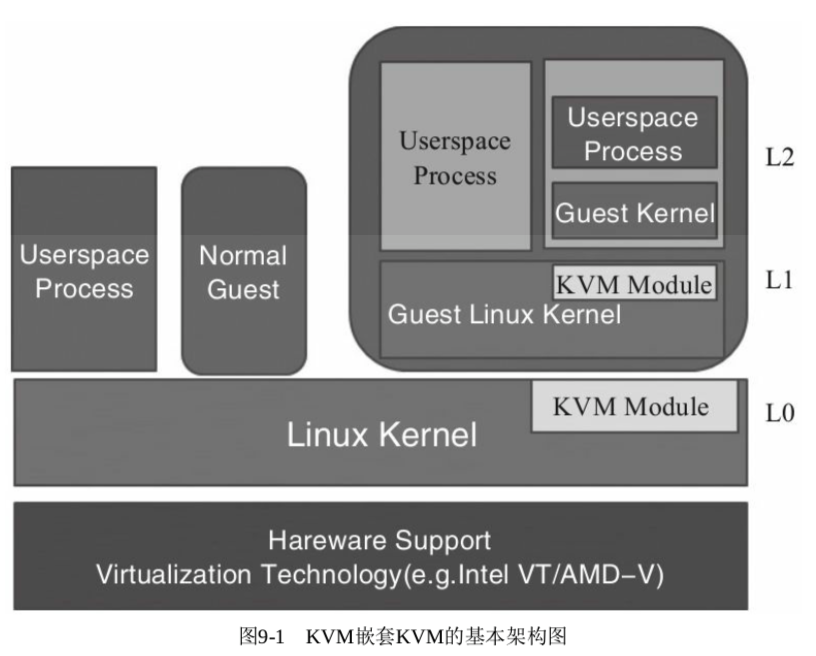
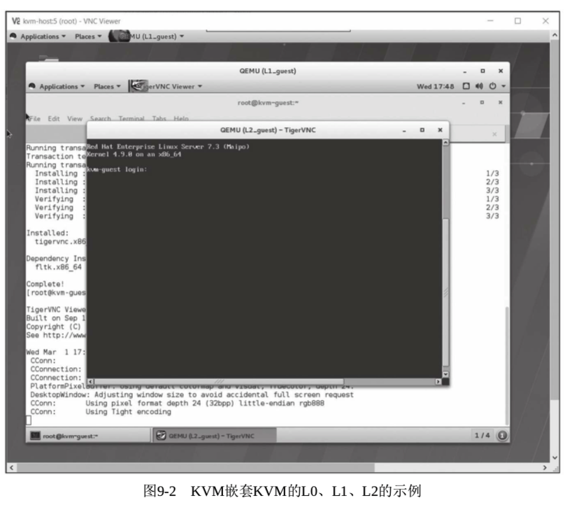

<!-- @import "[TOC]" {cmd="toc" depthFrom=1 depthTo=6 orderedList=false} -->

<!-- code_chunk_output -->

- [嵌套虚拟化的基本概念](#嵌套虚拟化的基本概念)
- [KVM 嵌套 KVM](#kvm-嵌套-kvm)

<!-- /code_chunk_output -->

# 嵌套虚拟化的基本概念

嵌套虚拟化(nested virtualization 或 recursive virtualization)是指在虚拟化的客户机中运行一个 Hypervisor, 从而再虚拟化运行一个客户机. 嵌套虚拟化不仅包括相同 Hypervisor 的嵌套(如 KVM 嵌套 KVM、Xen 嵌套 Xen、VMware 嵌套 VMware 等), 也包括不同 Hypervisor 的相互嵌套(如 VMware 嵌套 KVM、KVM 嵌套 Xen、Xen 嵌套 KVM 等). 根据嵌套虚拟化这个概念可知, 不仅包括两层嵌套(如 KVM 嵌套 KVM), 还包括多层的嵌套(如 KVM 嵌套 KVM 再嵌套 KVM).

嵌套虚拟化的使用场景是非常多的, 至少包括如下**5 个主要应用**:

1) **IaaS**(Infrastructure as a Service)类型的云计算提供商, 如果有了嵌套虚拟化功能的支持, 就可以为其客户提供让客户可以自己运行所需 Hypervisor 和客户机的能力. 对于有这类需求的客户来说, 这样的嵌套虚拟化能力会成为吸引他们购买云计算服务的因素.

2) 为测试和调试 Hypervisor 带来了非常大的便利. 有了嵌套虚拟化功能的支持, 被调试 Hypervisor 运行在更底层的 Hypervisor 之上, 就算遇到被调试 Hypervisor 的系统崩溃, 也只需要在底层的 Hypervisor 上重启被调试系统即可, 而不需要真实地与硬件打交道.

3) 在一些为了起到安全作用而带有 Hypervisor 的固件(firmware)上, 如果有嵌套虚拟化的支持, 则在它上面不仅可以运行一些普通的负载, 还可以运行一些 Hypervisor 启动另外的客户机.

4) 嵌套虚拟化的支持对虚拟机系统的动态迁移也提供了新的功能, 从而可以将一个 Hypervisor 及其上面运行的客户机作为一个单一的节点进行动态迁移. 这对服务器的负载均衡及灾难恢复等方面也有积极意义.

5) 嵌套虚拟化的支持对于系统隔离性、安全性方面也提供更多的实施方案.

对于不同的 Hypervisor, 嵌套虚拟化的实现方法和难度都相差很大. 对于完全纯软件模拟 CPU 指令执行的模拟器(如 QEMU), 实现嵌套虚拟化相对来说并不复杂; 而对于 QEMU/KVM 这样的必须依靠硬件虚拟化扩展的方案, 就必须在客户机中模拟硬件虚拟化特性(如 vmx、svm)的支持, 还要对上层 KVM hypervisor 的操作指令进行模拟. 据笔者所知, 目前, Xen 方面已经支持 Xen on Xen 和 KVM on Xen, 而且在某些平台上已经可以运行 KVM on Xen on Xen 的多级嵌套虚拟化; VMware 已经支持 VMware on VMware 和 KVM on VMware 这两类型的嵌套. KVM 已经性能较好地支持 KVM on KVM 和 Xen on KVM 的情况, 但都处于技术预览(tech preview)阶段.

# KVM 嵌套 KVM

KVM 嵌套 KVM, 即在 KVM 上面运行的**第一级客户机**中再加载**kvm**和**kvm_intel**(或 kvm_amd)模块, 然后在第一级的客户机中用 QEMU 启动带有 KVM 加速的第二级客户机. "KVM 嵌套 KVM"的基本架构如图 9-1 所示, 其中底层是具有 Intel VT 或 AMD-V 特性的硬件系统, 硬件层之上就是底层的宿主机系统(我们称之为 L0, 即 Level 0), 在 L0 宿主机中可以运行加载有 KVM 模块的客户机(我们称之为 L1, 即 Level 1, 第一级), 在 L1 客户机中通过 QEMU/KVM 启动一个普通的客户机(我们称之为 L2, 即 Level 2, 第二级). 如果 KVM 还可以做多级的嵌套虚拟化, 各个级别的操作系统被依次称为: L0、L1、L2、L3、L4......, 其中 L0 向 L1 提供硬件虚拟化环境(Intel VT 或 AMD-V), L1 向 L2 提供硬件虚拟化环境, 依此类推. 而最高级别的客户机 Ln(如图 9-1 中的 L2)可以是一个普通客户机, 不需要下面的 Ln\-1 级向 Ln 级中的 CPU 提供硬件虚拟化支持.

KVM 对"KVM 嵌套 KVM"的支持从 2010 年就开始了, 目前已经比较成熟了. "KVM 嵌套 KVM"功能的配置和使用有如下几个步骤.

1) 在 L0 中, 查看 kvm_intel 模块是否已加载以及其 nested 参数是否为'Y', 如下:

```
[root@kvm-host ~]# cat /sys/module/kvm_intel/parameters/nested
N
[root@kvm-host ~]# modprobe -r kvm_intel
[root@kvm-host ~]# modprobe kvm_intel nested=Y
[root@kvm-host ~]# cat /sys/module/kvm_intel/parameters/nested
Y
```



如果 kvm_intel 模块已经处于使用中, 则需要用"modprobe \-r kvm_intel"命令移除 kvm_intel 模块后重新加载, 然后再检查"/sys/module/kvm_intel/parameters/nested"这个参数是否为"Y". 对于 AMD 平台上的 kvm\-amd 模块的操作也是一模一样的.

2) 启动 L1 客户机时, 在 qemu 命令中加上"\-**cpu host**"或"\-**cpu qemu64,\+vmx**"选项, 以便将 CPU 的硬件虚拟化扩展特性暴露给 L1 客户机, 如下:

```
[root@kvm-host ~]# qemu-system-x86_64 -enable-kvm -cpu host -smp 4 -m 8G -drive file=./rhel7.img,format=raw,if=virtio -device virtio-net-pci,netdev=nic0 -netdev bridge,id=nic0,br=virbr0 -snapshot -name L1_guest -drive file=./raw_disk.img,format=raw,if=virtio,media=disk
```

这里, "\-cpu host"参数的作用是尽可能地将宿主机 L0 的 CPU 特性暴露给 L1 客户机; "\-cpu qemu64, \+vmx"表示以 qemu64 这个 CPU 模型为基础, 然后加上 Intel VMX 特性(即 CPU 的 VT-x 支持). 当然, 以其他 CPU 模型为基础再加上 VMX 特性, 如"\-cpu SandyBridge, \+vmx""\-cpu Westmere, \+vmx"也是可以的. 在 AMD 平台上, 则需要对应的 CPU 模型("qemu64"是通用的), 再加上 AMD\-V 特性, 如"\-cpu qemu64, \+svm".

3) 在**L1 客户机**中, 查看**CPU 的虚拟化支持**, 查看 kvm 和 kvm_intel 模块的加载情况(如果没有加载, 需要读者自行加载这两个模块), 启动一个 L2 客户机, L2 的客户机镜像事先放在 raw_disk.img 中, 并将其作为 L1 客户机的第二块硬盘, /dev/vdb. 在 L1 客户机中(需像 L0 中一样, 编译好 qemu), 我们将/dev/vdb mount 在/mnt 目录下, 如下:

```
[root@kvm-guest ~]# cat /proc/cpuinfo | grep vmx | uniq
flags : fpu vme de pse tsc msr pae mce cx8 apic sep mtrr pge mca cmov pat pse36 clflush mmx fxsr sse sse2 ss syscall nx pdpe1gb rdtscp lm constant_tsc arch_perfmon rep_good nopl xtopology eagerfpu pni pclmulqdq vmx ssse3 fma cx16 pcid sse4_1 sse4_2 x2apic movbe popcnt tsc_deadline_timer aes xsave avx f16c rdrand hypervisor lahf_lm abm 3dnowprefetch arat tpr_shadow vnmi flexpriority ept vpid fsgsbase tsc_adjust bmi1 hle avx2 smep bmi2 erms invpcid rtm rdseed adx smap xsaveopt

[root@kvm-guest ~]# lsmod | grep kvm
kvm_intel             170181  0
kvm                   554609  1 kvm_intel
irqbypass              13503  1 kvm

[root@kvm-guest ~]# qemu-system-x86_64 -enable-kvm -cpu host -drive file=/mnt/rhel7.img,format=raw,if=virtio, -m 4G -smp 2 -snapshot -name L2_guest
VNC server running on '::1:5900'
```

如果 L0 没有向 L1 提供硬件虚拟化的 CPU 环境, 则加载 kvm_intel 模块时会有错误, kvm_intel 模块会加载失败. 在 L1 中启动客户机, 就与在普通 KVM 环境中的操作完全一样. 不过对 L1 系统的内核要求并不高, 一般选取较新 Linux 内核即可, 如笔者选用了 RHEL 7.3 系统自带的内核和 Linux 4.9 的内核, 这都是可以的.

4) 在 L2 客户机中查看是否正常运行. 图 9\-2 展示了"KVM 嵌套 KVM"虚拟化的运行环境, L0 启动了 L1, 然后在 L1 中启动了 L2 系统.



由于 KVM 是全虚拟化 Hypervisor, 对于其他 L1 Hypervisor(如 Xen)嵌套运行在 KVM 上情况, 在 L1 中启动 L2 客户机的操作与在普通的 Hypervisor 中的操作步骤完全一样, 因为 KVM 为 L1 提供了有硬件辅助虚拟化特性的透明的硬件环境.
