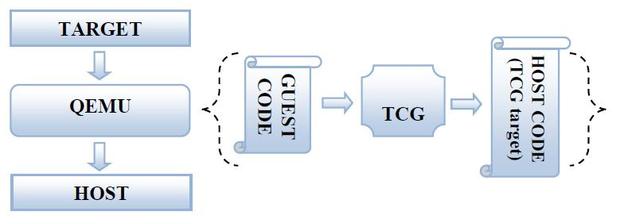
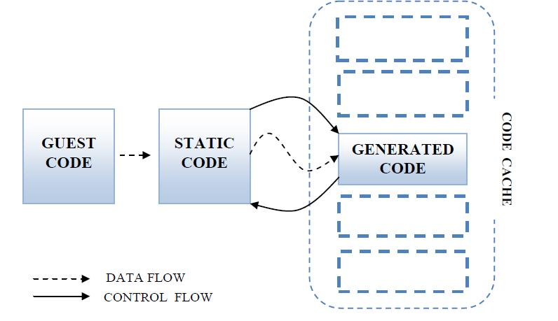
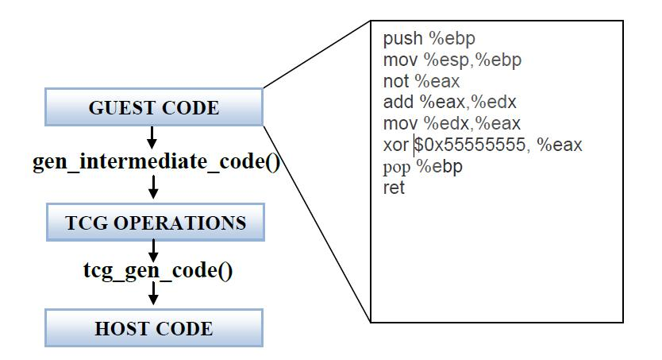
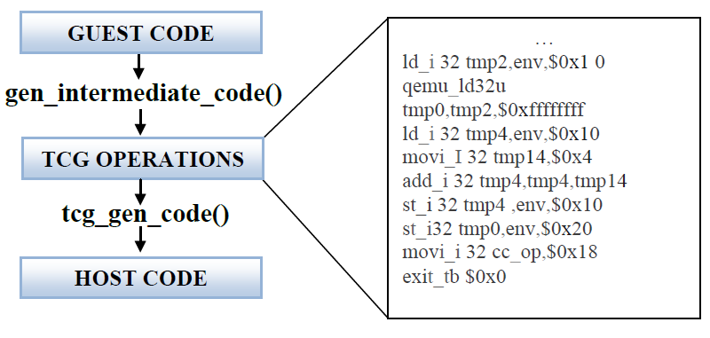
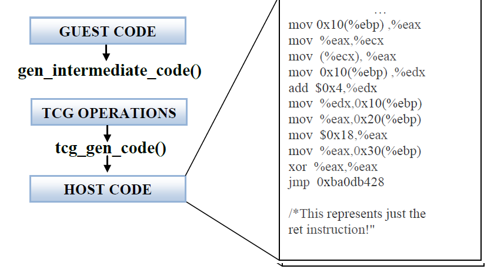
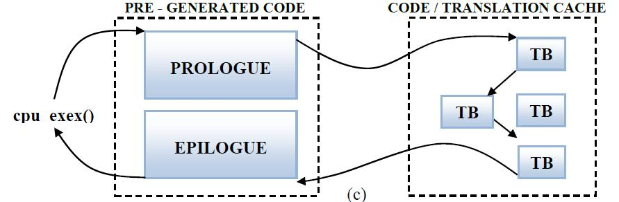

<!-- @import "[TOC]" {cmd="toc" depthFrom=1 depthTo=6 orderedList=false} -->

<!-- code_chunk_output -->

- [1. 代码结构](#1-代码结构)
  - [1.1. 开始执行](#11-开始执行)
  - [1.2. 硬件模拟: /hw/](#12-硬件模拟-hw)
  - [1.3. 目标机器: /target/arch/, 将客户机代码转为 TCG 操作码](#13-目标机器-targetarch-将客户机代码转为-tcg-操作码)
  - [1.4. 主机: /tcg/, 将 TCG 操作码转换成主机代码](#14-主机-tcg-将-tcg-操作码转换成主机代码)
  - [1.5. 文件总结和补充:](#15-文件总结和补充)
- [2. TCG - 动态翻译](#2-tcg---动态翻译)
- [3. TB 链](#3-tb-链)
- [4. QEMU 的 TCG 代码分析](#4-qemu-的-tcg-代码分析)
- [5. QEMU 中的 IOCTL](#5-qemu-中的-ioctl)
- [6. 参考](#6-参考)

<!-- /code_chunk_output -->

# 1. 代码结构

如我们所知, QEMU 是一个模拟器, 它能够动态模拟**特定架构的 CPU 指令**, 如 X86, PPC, ARM 等等.

**QEMU 模拟的架构**叫**目标架构**,

**运行 QEMU**的**系统架构**叫**主机架构**,

Qemu 的翻译过程为: 将 Guest 代码指令翻译成`TCG`(`Tiny Code Generator`)中间代码, 最终翻译成 Host 架构支持的代码指令;

QEMU 中有一个**模块**叫做**微型代码生成器(TCG, Tiny Code Generator**), 它用来将**目标代码翻译成主机代码**. 如下图所示.



将**运行在虚拟 cpu**上的代码叫做**客户机代码**

**QEMU**的**主要功能**就是**不断提取客户机代码！！！** 并且**转化成主机指定架构的代码！！！**.

**整个翻译任务**分为**两个部分**:

- 第一个部分是将做**目标代码(TB**)转化成**TCG 中间代码**,
- 然后再将**中间代码**转化成**主机代码**.

QEMU 的代码结构非常清晰但是内容非常复杂, 这里先简单分析一下总体的结构

```
├── audio
├── backends
├── block
├── bsd-user
├── chardev
├── configure
├── contrib
├── crypto  加密解密算法等.
├── docs
├── dtc
├── fpu
├── fsdev
├── hw  所有硬件设备, 包括总线、串口、网卡、鼠标等等. 通过设备模块串在一起.
├── include
├── io
├── linux-headers
├── linux-user
├── Makefile
├── migration
├── nbd
├── net
├── pc-bios
├── pixman
├── po
├── qapi
├── qga
├── qobject
├── qom
├── README
├── replay
├── roms
├── scripts
├── stubs
├── target  不同架构的对应目录, 将客户 CPU 架构的 TBs 转化成 TCG 中间代码, 这个就是 TCG 前半部分.
├── tcg  这部分是使用 TCG 代码生成主机的代码, 不同架构对应不同子目录. 整个生成主机代码的过程即 TCG 后半部分.
├── tests
├── trace
├── trace-events
├── trace-events-all
├── ui
├── util
├── VERSION
├── vl.c  main 函数, 程序执行起点. 最主要的模拟循环, 虚拟机环境初始化和 CPU 的执行.
├── x86_64-softmmu  ./configure 配置生成的目录
```

## 1.1. 开始执行

主要比较重要的 c 文件有: /vl.c, /cpus.c, /exec\-all.c, /exec.c, /cpu\-exec.c.

QEMU 的**main 函数**定义在/**vl.c**中, 它也是**执行的起点**, 这个函数的功能主要是**建立一个虚拟的硬件环境**.

它通过**参数的解析**, 将**初始化内存**, 需要的**模拟的设备初始化**, **CPU 参数**, **初始化 KVM**等等.

接着程序就跳转到**其他的执行分支文件**如: /cpus.c, /exec\-all.c, /exec.c, /cpu\-exec.c.

## 1.2. 硬件模拟: /hw/

所有的**硬件设备**都在/**hw**/ 目录下面, **所有的设备**都有**独自的文件**, 包括**总线**, **串口**, **网卡**, **鼠标**等等. 它们通过**设备模块串在一起**, 在**vl.c**中的**machine\_init**中初始化.

## 1.3. 目标机器: /target/arch/, 将客户机代码转为 TCG 操作码

现在 QEMU**模拟的 CPU 架构**有: Alpha, ARM, Cris, i386, M68K, PPC, Sparc, Mips, MicroBlaze, S390X and SH4.

我们在 QEMU 中使用./**configure** 可以**配置运行的架构**, 这个脚本会**自动**读取**本机真实机器的 CPU 架构**, 并且编译的时候就编译**对应架构的代码**.

```
./configure --target-list=x86_64-softmmu
```

对于不同的 QEMU 做的事情都不同, 所以不同架构下的代码在不同的目录下面.

/**target/arch**/目录就对应了**相应架构的代码**, 如/target/i386/就对应了 x86 系列的代码部分.

虽然**不同架构做法不同**, 但是都是为了**实现**将**对应客户机 CPU 架构的 TBs！！！** 转化成**TCG 的中间代码**.

这个就是**TCG 的前半部分**.

## 1.4. 主机: /tcg/, 将 TCG 操作码转换成主机代码

这个部分就是**使用 TCG 代码生成主机的代码**, 这部分代码在/tcg/里面, 在这个目录里面也**对应了不同的架构**, 分别在不同的子目录里面, 如 i386 就在/tcg/i386 中.

**整个生成主机代码的过程**也可以叫**TCG 的后半部分**.

## 1.5. 文件总结和补充:

/vl.c: 最主要的**模拟循环**, **虚拟机机器环境初始化**, 和**CPU 的执行**.

/**target/arch/translate.c**: 将**客户机代码**转化成**不同架构的 TCG 操作码**.

/tcg/tcg.c: **主要的 TCG 代码**.

/**tcg/arch/tcg\-target.c**: 将**TCG 代码**转化生成**主机代码**

/**cpu\-exec.c**: 其中的**cpu\-exec**()函数主要**寻找下一个 TB(翻译代码块**), 如果没找到就**请求得到下一个 TB**, 并且操作生成的代码块.

# 2. TCG - 动态翻译

关于 TCG 的解释: TCG(Tiny Code Generator), QEMU 的官方解释在 http://wiki.qemu-project.org/Documentation/TCG .

TCG 的作用就是将 Target 的指令通过 TCG 前端转换成 TCG ops, 进而通过 TCG 后端转换成 Host 上运行的指令.

需要将 QEMU 移植到一个新 CPU 上运行, 需要关注 TCG 后端. 需要基于 QEMU 模拟一个新 CPU, 需要关注 TCG 前端.

QEMU 在 0.9.1 版本之前使用**DynGen 翻译 c 代码**. 当我们**需要的时候**TCG 会动态的转变代码, 这个想法的目的是用**更多的时间**去**执行我们生成的代码**.

当**新的代码**从**TB 中生成**以后,  将会被**保存到一个 cache**中, 因为**很多相同的 TB**会被**反复的进行操作**, 所以这样类似于内存的 cache, 能够**提高使用效率**. 而**cache 的刷新使用 LRU 算法**.



**编译器**在执行器会从**源代码**中**产生目标代码**, 像**GCC**这种编译器, 它为了产生像**函数调用**, 目标代码会产生一些**特殊的汇编目标代码**, 他们能够让编译器需要知道在**调用函数**、**需要什么**以及**函数调用以后需要返回什么**, 这些**特殊的汇编代码产生过程**就叫做函数的**Prologue 和 Epilogue**, 这里就叫前端和后端吧.

我在其他文章中也分析过**汇编调用函数的过程**, 至于汇编里面函数调用过程中寄存器是如何变化的, 在本文中就不再描述了.

**函数的后端**会**恢复前端的状态**, 主要做下面 2 点:

1. **恢复堆栈的指针**, 包括**栈顶**和**基地址**.

2. 修改**cs**和**ip**, 程序回到之前的**前端记录点**.

**TCG**就如编译器一样可以产生目标代码, 代码会保存在缓冲区中, 当进入前端和后端的时候就会将 TCG 生成的缓冲代码插入到目标代码中.

接下来我们就来看下如何翻译代码的:

```
tb_gen_code
    ->gen_intermediate_code
    ->tcg_gen_code
```

由**tb\_gen\_code**调用, 将**客户机代码**转换成**主机代码**. gen\_intermediate\_code 之前是客户机代码, tcg\_gen\_code 之后是主机代码, 两者之间是 TCG 中间代码.

>客户机代码



>TCG 中间代码



>主机代码



# 3. TB 链

在 QEMU 中, 从**代码 cache**到**静态代码**再**回到代码 cache**, 这个过程比较耗时, 所以在 QEMU 中涉及了**一个 TB 链**将**所有 TB 连在一起**, 可以让**一个 TB**执行完以后**直接跳到下一个 TB**, 而**不用每次都返回到静态代码**部分. 具体过程如下图:



# 4. QEMU 的 TCG 代码分析

接下来来看看 QEMU 代码中中到底怎么来执行这个 TCG 的, 看看它是如何生成主机代码的.

在 CPU 虚拟化访问接口中: pc\_init1(hw/i386/pc\_piix.c)  ->  pc\_cpus\_init(hw/i386/pc.c)  ->  pc\_new\_cpu(hw/i386/pc.c)

```cpp
x86_cpu_realizefn  架构相关初始化函数 // target/i386/cpu.c
    ->qemu_init_vcpu  // cpus.c
        ->qemu_tcg_init_vcpu // cpus.c
            ->qemu_tcg_cpu_thread_fn  创建一个 vcpu 线程, 执行函数
                ->tcg_cpu_exec
                    ->cpu_exec  这个函数是主要的执行循环, 这里第一次翻译 TB, 然后不停的执行异常处理.
                        ->tb_find  首先在 Hash 表中查找, 如果找不到则调用 tb_gen_code 创建一个 TB.
                            ->tb_gen_code  分配一个新的 TB.
                                ->gen_intermediate_code
                                ->tcg_gen_code  将 TCG 代码转换成主机代码.
                        ->cpu_loop_exec_tb
                            ->cpu_tb_exec  执行 TB 主机代码
                                ->tcg_qemu_tb_exec
```

>main\_loop(...){/vl.c}:
>
>函数 main\_loop 初始化 qemu\_main\_loop\_start() 然后**进入无限循环**cpu\_exec\_all(), 这个是 QEMU 的一个主要循环, 在里面会不断的**判断一些条件**, 如**虚拟机的关机断电之类**的.


>qemu\_main\_loop\_start(...){/cpus.c} :
>
>函数设置**系统变量 qemu\_system\_ready = 1**并且**重启所有的线程**并且等待一个条件变量.  


>cpu\_exec\_all(...){/cpus.c} :
>
>它是 cpu 循环, QEMU 能够启动 256 个 cpu 核, 但是这些核将会分时运行, 然后执行 qemu\_cpu\_exec() .


>struct CPUState{/target\-xyz/cpu.h} :
>
>它是 CPU 状态结构体, 关于 cpu 的各种状态, 不同架构下面还有不同.

 

>cpu\_exec(...){/cpu\-exec.c}:
>
>这个函数是主要的执行循环, 这里第一次翻译之前说道德 TB, TB 被初始化为(TranslationBlock \*tb) , 然后不停的执行异常处理. 其中嵌套了两个无限循环 find tb\_find\_fast() 和 tcg\_qemu\_tb\_exec().
>cantb\_find\_fast()为客户机初始化查询下一个 TB, 并且生成主机代码.
>tcg\_qemu\_tb\_exec()执行生成的主机代码 


>struct TranslationBlock {/exec-all.h}:
>
>结构体 TranslationBlock 包含下面的成员: PC, CS_BASE, Flags (表明 TB), tc\_ptr (指向这个 TB 翻译代码的指针), tb\_next\_offset\[2], tb\_jmp\_offset\[2] (接下去的 Tb), \*jmp_next\[2], \*jmp\_first (之前的 TB).

 
>tb\_find\_fast(...){/cpu-exec.c} :
>
>函数通过调用获得程序指针计数器, 然后传到一个哈希函数从 tb\_jmp\_cache\[](一个哈希表)得到 TB 的所以, 所以使用 tb\_jmp\_cache 可以找到下一个 TB. 如果没有找到下一个 TB, 则使用 tb\_find\_slow.


>tb\_find\_slow(...){/cpu\-exec.c}:
>
>这个是在快速查找失败以后试图去访问物理内存, 寻找 TB.


>tb\_gen\_code(...){/exec.c}:
>
>开始分配一个新的 TB, TB 的 PC 是刚刚从 CPUstate 里面通过 using get_page_addr_code()找到的

>phys_pc = get_page_addr_code(env, pc);
>
>tb = tb_alloc(pc);

>ph 当调用 cpu_gen_code() 以后, 接着会调用 tb_link_page() , 它将增加一个新的 TB, 并且指向它的物理页表.

>cpu_gen_code(...){translate-all.c}:

>函数初始化真正的代码生成, 在这个函数里面有下面的函数调用:

>gen_intermediate_code(){/target-arch/translate.c}->gen_intermediate_code_internal(){/target-arch/translate.c }->disas_insn(){/target-arch/translate.c}

>disas_insn(){/target-arch/translate.c}

>函数 disas_insn() 真正的实现将客户机代码翻译成 TCG 代码, 它通过一长串的 switch case, 将不同的指令做不同的翻译, 最后调用 tcg_gen_code.

 

>tcg_gen_code(...){/tcg/tcg.c}:

>这个函数将 TCG 的代码转化成主机代码, 这个就不细细说明了, 和前面类似.

 

>\#define tcg_qemu_tb_exec(...){/tcg/tcg.g}:
>
>通过上面的步骤, 当 TB 生成以后就通过这个函数进行执行.

>next_tb = tcg_qemu_tb_exec(tc_ptr) :

>extern uint8_t code_gen_prologue[];

>\#define tcg_qemu_tb_exec(tb_ptr) ((long REGPARM(*)(void *)) code_gen_prologue)(tb_ptr)

通过上面的步骤我们就解析了 QEMU 是如何将客户机代码翻译成主机代码的, 了解了 TCG 的工作原理. 接下来看看 QEMU 与 KVM 是怎么联系的.

# 5. QEMU 中的 IOCTL

在 QEMU-KVM 中, 用户空间的 QEMU 是通过 IOCTL 与内核空间的 KVM 模块进行通讯的.

1. 创建 KVM

在/vl.c 中通过 kvm_init()将会创建各种 KVM 的结构体变量, 并且通过 IOCTL 与已经初始化好的 KVM 模块进行通讯, 创建虚拟机. 然后创建 VCPU, 等等.

2. KVM_RUN

这个 IOCTL 是使用最频繁的, 整个 KVM 运行就不停在执行这个 IOCTL, 当 KVM 需要 QEMU 处理一些指令和 IO 等等的时候就会退出通过这个 IOCTL 退回到 QEMU 进行处理, 不然就会一直在 KVM 中执行.

它的初始化过程:

vl.c 中调用 machine->init 初始化硬件设备接着调用 pc_init_pci, 然后再调用 pc_init1.

接着通过下面的调用初始化 KVM 的主循环, 以及 CPU 循环. 在 CPU 循环的过程中不断的执行 KVM_RUN 与 KVM 进行交互.

pc_init1->pc_cpus_init->pc_new_cpu->cpu_x86_init->qemu_init_vcpu->kvm_init_vcpu->ap_main_loop->kvm_main_loop_cpu->kvm_cpu_exec->kvm_run

3.KVM_IRQ_LINE

这个 IOCTL 和 KVM_RUN 是不同步的, 它也是个频率非常高的调用, 它就是一般中断设备的中断注入入口. 当设备有中断就通过这个 IOCTL 最终调用 KVM 里面的 kvm_set_irq 将中断注入到虚拟的中断控制器. 在 kvm 中会进一步判断属于什么中断类型, 然后在合适的时机写入 vmcs. 当然在 KVM_RUN 中会不断的同步虚拟中断控制器, 来获取需要注入的中断, 这些中断包括 QEMU 和 KVM 本身的, 并在重新进入客户机之前注入中断.

# 6. 参考

- https://blog.csdn.net/yearn520/article/details/6602182
- https://www.cnblogs.com/arnoldlu/p/6510626.html