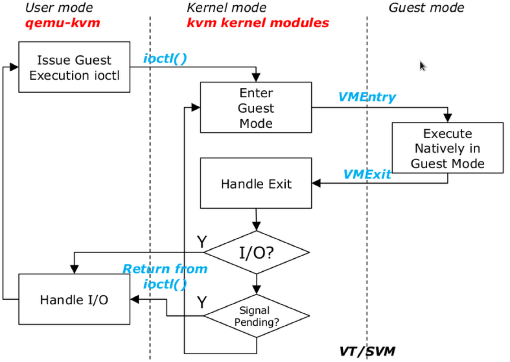
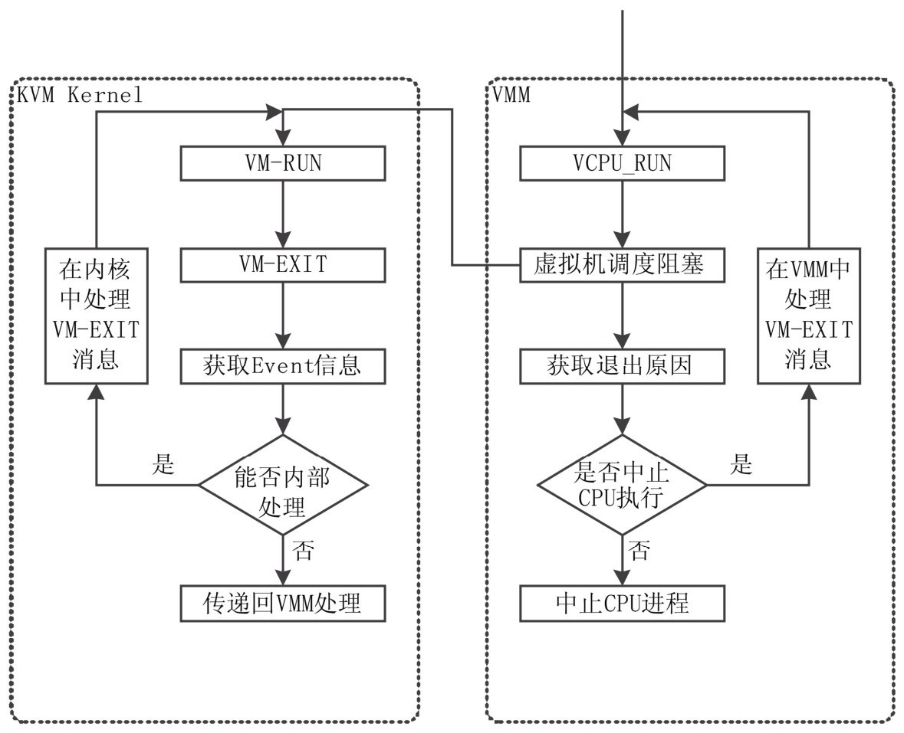
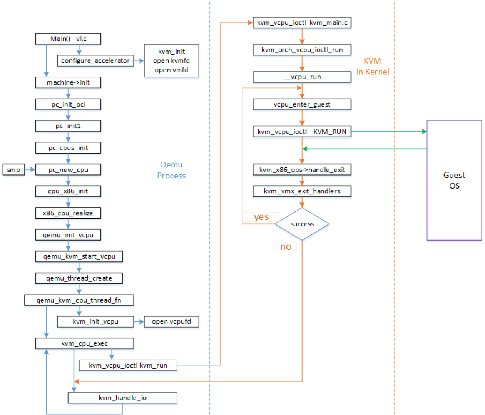
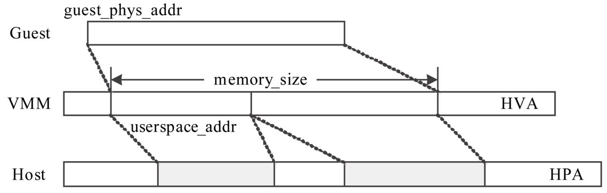
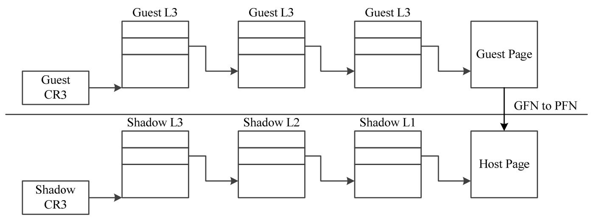
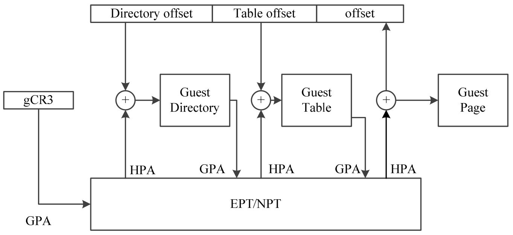
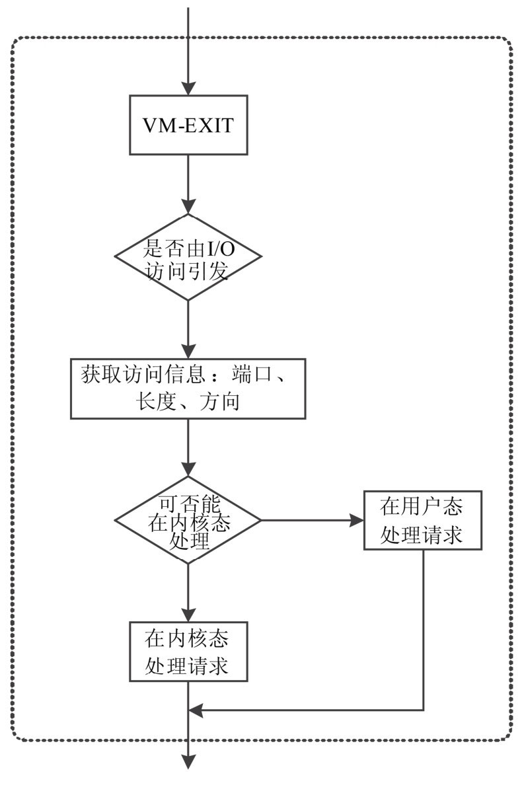

<!-- @import "[TOC]" {cmd="toc" depthFrom=1 depthTo=6 orderedList=false} -->

<!-- code_chunk_output -->

- [1. KVM 中的 Machine 模块](#1-kvm-中的-machine-模块)
  - [1.1. qemu 虚拟机启动命令](#11-qemu-虚拟机启动命令)
  - [1.2. QEMU 的 machine_module](#12-qemu-的-machine_module)
    - [1.2.1. machine 对象](#121-machine-对象)
    - [1.2.2. PC 结构的初始化](#122-pc-结构的初始化)
- [2. 基于 KVM 加速支持的 CPU 虚拟化模块](#2-基于-kvm-加速支持的-cpu-虚拟化模块)
  - [2.1. QEMU 初始化创建 VCPU 线程: kvm_init_vcpu()](#21-qemu-初始化创建-vcpu-线程-kvm_init_vcpu)
  - [2.2. VCPU 线程执行主函数 ap_main_loop()](#22-vcpu-线程执行主函数-ap_main_loop)
    - [2.2.1. kvm_create_vcpu 创建 vCPU](#221-kvm_create_vcpu-创建-vcpu)
    - [2.2.2. vCPU 主要执行函数 kvm_main_loop_cpu()](#222-vcpu-主要执行函数-kvm_main_loop_cpu)
      - [2.2.2.1. kvm_run()](#2221-kvm_run)
- [3. 虚拟机的内存管理](#3-虚拟机的内存管理)
  - [3.1. 虚拟内存到物理地址转换](#31-虚拟内存到物理地址转换)
    - [3.1.1. shadow page 影子页表](#311-shadow-page-影子页表)
    - [3.1.2. EPT 页表](#312-ept-页表)
    - [3.1.3. shadow page 和 EPT 对比](#313-shadow-page-和-ept-对比)
  - [3.2. qemu-kvm 内存管理](#32-qemu-kvm-内存管理)
- [4. IO 管理](#4-io-管理)

<!-- /code_chunk_output -->

# 1. KVM 中的 Machine 模块

## 1.1. qemu 虚拟机启动命令

通过 virt-manager 启动的 KVM 虚拟机, 可以通过 ps aux|grep 指令获得其执行的指令, 代码如下.

该实例指令启动的开关较多, 也提供了一个完整的虚拟机启动信息.

代码 6-6 qemu-kvm 的启动示例指令

```
(01)/usr/libexec/qemu-kvm -S
(02)-M rhel5.4.0 -m 2048 -smp 2,sockets=2,cores=1,threads=1
(03)-name win2008-3
(04)-uuid f93c2981-08b9-ba30-ec02-5484ce166090
(05)-monitor unix:/var/lib/libvirt/qemu/win2008-3.monitor,server,nowait
(06) -localtime
(07) -no-kvm-pit-reinjection
(08)-boot c
(09)-drive file=/dev/vm-lvm/win3,if=ide,bus=0,unit=0,boot=on,format=raw,cache=none
(10)-drive if=ide,media=cdrom,bus=1,unit=0,readonly=on,format=raw
(11)-net nic,macaddr=54:52:00:69:3e:74,vlan=0
(12)-net tap,fd=17,vlan=0
(13)-serial pty
(14)-parallel none -usb -usbdevice tablet
(15)-vnc 127.0.0.1:2 -k en-us -vga cirrus
(16) -balloon virtio
```

01 行中的 qemu\-kvm 代表了执行 QEMU 虚拟机的宿主程序. 紧随其后的第一个参数\-S 控制 vm 在创建之后的 CPU 处于 freeze 状态, 等待进一步的确认.

02 行中, 用\-M 开关指定了选择的虚拟机模板, 目前选择了 rhel, 用\-m 制定内存为 2048MB. \-smp 2,sockets=2,cores=1,threads=1 表明支持 smp, 有两个 CPU 核, 使用 1 个线程, 拥有 2 个 Socket 接口.

03 行和 04 行中, 通过指定\-name win2008 确定了这台虚拟机的名称, 通过 uuid 参数指定了这台虚拟机的 guid, 方便管理.

05 行中, 使用\-monitor 参数指定了该虚拟机控制台的输出文件, 通过读取该文件, 可以获得该虚拟机的实时图像.

在 06 行和 07 行中, 设置了使用**本地时间**作为**虚拟机的时间**, 禁止 KVM 的陷阱注入功能.

在 08 行中, 用 boot 参数指定启动的磁盘, c 代表 CD\-ROM.

在 09 行中, 指定了虚拟机的第一个**块设备文件为/dev/vm\-lvm/win3**, 该文件代表了 vm 虚拟机中的虚拟磁盘.

10 行指定了虚拟机的另外一个虚拟磁盘为光驱, 使用一个 ISO 文件.

11、12 行则指定了该虚拟机搭配的网卡配置, 在 11 行中指定了网卡的 MAC, 使用默认的 RTL8139 模型, 在 12 行中配置了虚拟机同宿主机之间的网络通信方式是基于 tap 接口的.

13、14 行则指定了一些外设的配置信息.

15 行配置了用于显示的 VNC 信息, 指定了 VNC 的端口, 另外配置了 vga 显示适配器默认为 cirrus 显卡, 该显卡从 Windows 95 之后的操作系统均默认支持, 也支持所有的 X\-Windows.

16 行指定 **balloon 驱动**为 **virto**. **balloon**是 QEMU 中对客户机所占用的**物理内存进行回收**的**一种机制**. 其原理为通过**一个驱动程序**在 QEMU 内部尝试**申请足够大的内存空间**, 从而引起 Guest OS**释放掉不常用的页**, 进而让宿主机降低 Quest OS 所占用的内存空间, 优化整个虚拟化系统的性能.

## 1.2. QEMU 的 machine_module

从上面分析 qemu\-kvm 启动命令所需要的典型参数配置可以看出, QEMU 内部能够**模拟一套完整的 PC 系统**, 并且提供了**相应的配置机制**, 可以对部分驱动程序进行调整, 达到**性能调优**的目的.

QEMU 内部通过 **machine\_module** 来代表**一个完整的模拟系统**. 在**hw/pc\_piix.c**文件中定义了**有关 PC 体系结构的结构体**, 默认设置下, 该**结构体的配置**决定了将要模拟的 **PC 系统**的**外设**及**组件**.

### 1.2.1. machine 对象

在该文件中, 一共定义了 **5 个 machine 对象**, 分别代表**5 个不同版本的主机**. 其中以本文源代码最新的 0.14 版本中的 PC 主机结构体定义如下.

代码 6\-7 pc\_machine 结构体

```c
// hw/pc_piix.c
(233)    static QEMUMachine pc_machine = {
(234)        .name = "pc-0.14",
(235)        .alias = "pc",
(236)        .desc = "Standard PC",
(237)        .init = pc_init_pci,
(238)        .max_cpus = 255,
(239)        .is_default = 1,
(240)    };
```

在该结构体中, 最重要的是.**ini** 字段设置的函数指针, 该函数指针代表了 PC 进行**初始化**的函数入口 **pc\_init\_pci**, 其他选项配置了**名称**、**最大 CPU 参数**等, 另外, **is\_default**被置位为**1**, 说明了该配置是 QEMU 的**PC 模拟配置**中的**默认配置**.

其他几个结构体在该结构体之上, 替换了相关的配置, 如模拟 VMware 显卡、启用 virtio 总线等, 这些**配置**可以通过**命令行**进行**控制**, 为 QEMU 的 Quest OS 提供了更多的支持.

### 1.2.2. PC 结构的初始化

在这些结构体中, **init 字段**所指向的 **pc\_init\_pci** 函数指针是一个关键的函数, 这个函数实现了**PC 体系结构！！！的初始化！！！操作**, 通过调用 QEMU 的支持函数(如 **I/O 口**、**DMA 设定**和**中断设定**等), 为 **vCPU** 准备了一个**完整的 PC 主机运行环境**.

在该函数的内部实现中, 只是直接调用了 **pc\_init1** 函数, 它实际的初始化函数的代码如下.

代码 6\-8 pc\_init1 实际的初始化函数

```c
// hw/pc_piix.c
(67)static void pc_init1(ram_addr_t ram_size,
(68)                    const char *boot_device,
(69)                    const char *kernel_filename,
(70)                    const char *kernel_cmdline,
(71)                    const char *initrd_filename,
(72)                    const char *cpu_model,
(73)                    int pci_enabled)
(74) {
(75)    int i;
(76)    ram_addr_t below_4g_mem_size, above_4g_mem_size;
(77)    PCIBus *pci_bus;
(78)    PCII440FXState *i440fx_state;
(79)    int piix3_devfn = -1;
(80)    qemu_irq *cpu_irq;
(81)    qemu_irq *isa_irq;
(82)    qemu_irq *i8259;
(83)    qemu_irq *cmos_s3;
(84)    qemu_irq *smi_irq;
(85)    IsaIrqState *isa_irq_state;
(86)    DriveInfo *hd[MAX_IDE_BUS * MAX_IDE_DEVS];
(87)    FDCtrl *floppy_controller;
(88)    BusState *idebus[MAX_IDE_BUS];
(89)    ISADevice *rtc_state;
(90)
(91)    global_cpu_model = cpu_model;
(92)
(93)    pc_cpus_init(cpu_model);
(94)
(95)    vmport_init();
(96)
(97)    /* allocate ram and load rom/bios */
(98)    pc_memory_init(ram_size,kernel_filename,kernel_cmdline,initrd_filename,
(99)                  &below_4g_mem_size, &above_4g_mem_size);
(100)
(101)        cpu_irq = pc_allocate_cpu_irq();
(102)    #ifdef KVM_CAP_IRQCHIP
(103)        if (kvm_enabled() && kvm_irqchip_in_kernel()) {
(104)            isa_irq_state = qemu_mallocz(sizeof(*isa_irq_state));
(105)            if (pci_enabled) {
(106)               ioapic_init(isa_irq_state);
(107)            }
(108)            isa_irq = i8259 = kvm_i8259_init(cpu_irq[0]);
(109)            ioapic_irq_hack = isa_irq;
(110)        } else
(111)    #endif
(112)        {
(113)            i8259 = i8259_init(cpu_irq[0]);
(114)            isa_irq_state = qemu_mallocz(sizeof(*isa_irq_state));
(115)            isa_irq_state->i8259 = i8259;
(116)            if (pci_enabled) {
(117)               ioapic_init(isa_irq_state);
(118)            }
(119)            isa_irq = qemu_allocate_irqs(isa_irq_handler, isa_irq_state, 24);
(120)        }
(121)
(122)        if (pci_enabled) {
(123)            pci_bus=i440fx_init(&i440fx_state,&piix3_devfn,isa_irq,ram_size);
(124)        } else {
(125)            pci_bus = NULL;
(126)            i440fx_state = NULL;
(127)            isa_bus_new(NULL);
(128)        }
(129)        isa_bus_irqs(isa_irq);
(130)
(131)        pc_register_ferr_irq(isa_reserve_irq(13));
(132)
(133)        pc_vga_init(pci_enabled? pci_bus: NULL);
(134)
(135)        /* init basic PC hardware */
(136)        pc_basic_device_init(isa_irq, &floppy_controller, &rtc_state);
(137)
(138)        for(i = 0; i < nb_nics; i++) {
(139)            NICInfo *nd = &nd_table[i];
(140)
(141)            if(!pci_enabled||(nd->model&&strcmp(nd->model,"ne2k_isa")==0))
(142)               pc_init_ne2k_isa(nd);
(143)            else
(144)               pci_nic_init_nofail(nd, "rtl8139", NULL);
(145)        }
(146)
(147)        if (drive_get_max_bus(IF_IDE) >= MAX_IDE_BUS) {
(148)            fprintf(stderr, "qemu: too many IDE bus\n");
(149)            exit(1);
(150)        }
(151)
(152)        for(i = 0; i < MAX_IDE_BUS * MAX_IDE_DEVS; i++) {
(153)            hd[i] = drive_get(IF_IDE, i / MAX_IDE_DEVS, i % MAX_IDE_DEVS);
(154)        }
(155)
(156)        if (pci_enabled) {
(157)            PCIDevice *dev;
(158)            dev = pci_piix3_ide_init(pci_bus, hd, piix3_devfn + 1);
(159)            idebus[0] = qdev_get_child_bus(&dev->qdev, "ide.0");
(160)            idebus[1] = qdev_get_child_bus(&dev->qdev, "ide.1");
(161)        } else {
(162)            for(i = 0; i < MAX_IDE_BUS; i++) {
(163)               ISADevice *dev;
(164)               dev = isa_ide_init(ide_iobase[i], ide_iobase2[i], ide_irq[i],
(165)                         hd[MAX_IDE_DEVS*i],hd[MAX_IDE_DEVS*i+1]);
(166)               idebus[i] = qdev_get_child_bus(&dev->qdev, "ide.0");
(167)            }
(168)        }
(169)
(170)        audio_init(isa_irq, pci_enabled ? pci_bus : NULL);
(171)
(172)        pc_cmos_init(below_4g_mem_size,above_4g_mem_size,boot_device,
(173)                    idebus[0], idebus[1], floppy_controller, rtc_state);
(174)
(175)        if (pci_enabled && usb_enabled) {
(176)            usb_uhci_piix3_init(pci_bus, piix3_devfn + 2);
(177)        }
(178)
(179)        if (pci_enabled && acpi_enabled) {
(180)            uint8_t *eeprom_buf = qemu_mallocz(8 * 256); /* XXX: make
this persistent */
(181)            i2c_bus *smbus;
(182)
(183)            cmos_s3=qemu_allocate_irqs(pc_cmos_set_s3_resume,rtc_state,1);
(184)            smi_irq=qemu_allocate_irqs(pc_acpi_smi_interrupt,first_cpu,1);
(185)            /* TODO: Populate SPD eeprom data.  */
(186)            smbus = piix4_pm_init(pci_bus, piix3_devfn + 3, 0xb100,
(187)                              isa_reserve_irq(9), *cmos_s3, *smi_irq,
(188)                              kvm_enabled());
(189)            for (i = 0; i < 8; i++) {
(190)               DeviceState *eeprom;
(191)               eeprom = qdev_create((BusState *)smbus, "smbus-eeprom");
(192)               qdev_prop_set_uint8(eeprom, "address", 0x50 + i);
(193)               qdev_prop_set_ptr(eeprom,"data",eeprom_buf+(i*256));
(194)               qdev_init_nofail(eeprom);
(195)            }
(196)        }
(197)
(198)        if (i440fx_state) {
(199)            i440fx_init_memory_mappings(i440fx_state);
(200)        }
(201)
(202)        if (pci_enabled) {
(203)            pc_pci_device_init(pci_bus);
(204)        }
(205)    }
```

该结构体通过一个**qemu\_irq\_handler**的函数指针指向**具体的中断服务例程**, 通过 opaque 保存该中断的**中断向量**, n 则代表所对应的**中断号**.

在 93 行中, 初始化了**cpu\_model**. 根据所要模拟的目标系统的**CPU 个数**, **循环**调用 **pc\_new\_cpu** 函数, 创建相应的 **CPU 信息结构体 cpu\_model**. 在初始化该结构体的过程中, 会根据**宿主机**的 **cpuid 信息**填充入 cpu\_model 中, 方便 Guest OS 了解 CPU 的相关特性并对执行流程进行优化. **填充**完**APIC 信息**之后, 将会调用**qemu\_register\_reset**函数和**pc\_cpu\_reset**对该**CPU**进行一次**复位操作**, 保证初始化完成.

在 95 行中, 调用**vmport\_init**函数, 初始化**QEMU**和**Guest OS**专用的**特殊端口**: **vmport**. 该 vmport 主要用于实现**Guest OS**和**QEMU**模拟系统之间的**直接通信**, 其**I/O 地址**为**0x5658**.

在 98~100 行中, 将会分配该**模拟目标机**所需要的**内存**, QEMU 对内存分配实行**按需分配**, 并且将 **BIOS** 的**指令**和**数据**加载到**指定的内存位置**, 以便**复位后直接执行**.

在 101~131 行的主要任务是初始化**PCI 和 ISA 总线**的**中断信息**.

在 133 行中, 通过调用**pc\_vga\_init**函数初始化**显示适配器**, 根据目标硬件是否支持 PCI, 会传入不同的初始化参数.

在 138~145 行中, 将**初始化 NIC 硬件**, 如果支持**PCI**, 则会模拟 RTL8139 网卡, 如果是 **ISA**, 则会模拟 NE2000 网卡, 这两款网卡的驱动在当前几乎所有的操作系统中均能支持.

在 147~167 行中, 将根据目标机的**磁盘设置**, 初始化 IDE 磁盘.

在 170、172 和 175 行中, 分别初始化**Audio 设备**、**CMOS 内存空间**和**USB 控制器**, 这些函数的初始化都是调用其具体的设备函数中的初始化入口点实现的, 实现内容主要是将端口处理函数注册到虚拟机的某一端口上.

在 179~195 行对 eeprom 等信息进行最后的初始化之后, 整个虚拟机的初始化任务完成, 等待发出**上电执行的指令**之后, 就将切换到 **BIOS 的第一条指令处开始执行**.

# 2. 基于 KVM 加速支持的 CPU 虚拟化模块

KVM 是基于硬件虚拟化实现的, 从之前的内核模块截图中也能看到, 真实的虚拟化实现在 intel_kvm.ko 中.

硬件虚拟化中将运行模式分为 root 模式和 non-root 模式, 每个模式都保留了 ring0-3 的优先级, 通过降低模式切换的开销来提升虚拟化的性能.

KVM 的 vCPU 执行流程从架构上看, 其示意图如图 6\-5 所示.

图 6\-5 KVM 的 CPU 执行架构





当**Guest OS 开机**后, VMM 就会**创建一个 vCPU**, 该 vCPU 基于一个**线程**执行. VMM 实质上是 QEMU 中的一个**进程**, 而 vCPU 就是这个进程中的**一个线程**.

VMM 在调用**vCPU 的 API**之后, 会陷入内核, 此时, vCPU 将开始执行,  vCPU 将运行在 Guest 中, KVM 会调用 VM 执行的相关 ioctl api 调用, 使其进入代码片段执行. 如果此时产生了中断或者异常, 就会产生 Event 事件, 暂停虚拟机的执行状态, 并且判断该 Event 是否可以在 KVM 内部处理.

如果该 Event 可以在 KVM 内部处理完成, 则会继续调用**KVM**的**VM\_RUN 控制字 API**, 继续执行; 如果不能在内部处理完成, 则会将这个 Event 事件传递回用户态的 VMM 中.

此时, 用户态的 VMM 从内核态的 KVM 执行中退出, 然后开始分析该 Event 的内容, 如果该部分内容可以在用户态的 VMM 中进行处理(如来自 **I/O 方面的磁盘读取**、**网络读取**等), 则调用 QEMU 的相关模块进行执行; 如果是不能在 VMM 中处理的终端(如 NMI、错误等), 则关闭该 CPU.



注: 新版本代码流程和下面不太一样, 但大流程类似

## 2.1. QEMU 初始化创建 VCPU 线程: kvm_init_vcpu()

在 QEMU**初始化虚拟机的 CPU**时, 会为 KVM 的**每一块虚拟 CPU**创建**一个线程**, 通过这个线程来**执行 vCPU 的相关代码**, **线程**的主要执行内容是**ap\_main\_loop 方法**.

这部分代码在**ap\_main\_loop**中, 具体代码如下.

代码 6\-9 kvm\_init\_vcpu 代码

```cpp
// accel/kvm/kvm-all.c
(1470)   int kvm_init_vcpu(CPUState *env)
(1471)   {
(1472)       pthread_create(&env->kvm_cpu_state.thread,NULL,ap_main_loop,env);
(1473)
(1474)       while (env->created == 0) {
(1475)           qemu_cond_wait(&qemu_vcpu_cond);
(1476)       }
(1477)
(1478)       return 0;
(1479)   }
```

这个函数执行的内容比较简单, 通过 **pthread\_create** 调用创建一个有关 kvm\_cpu 的进程, 这个进程的方法入口是**ap\_main\_loop**. 因为**初始化**涉及一些**进程切换等非同步**的操作, 所以该代码会**一直等待**, 直到 env 的 created 标志位被置位后, 返回 0. (这里是**父进程**)

## 2.2. VCPU 线程执行主函数 ap_main_loop()

ap\_main\_loop 函数是**vCPU 创建**的主要函数, 代码如下.

代码 6\-10 ap\_main\_loop 函数

```c
(1429)   static void *ap_main_loop(void *_env)
(1430)   {
(1431)       CPUState *env = _env;
(1432)       sigset_t signals;
(1433)   #ifdef CONFIG_KVM_DEVICE_ASSIGNMENT
(1434)       struct ioperm_data *data = NULL;
(1435)   #endif
(1436)
(1437)       current_env = env;
(1438)       env->thread_id = kvm_get_thread_id();
(1439)       sigfillset(&signals);
(1440)       sigprocmask(SIG_BLOCK, &signals, NULL);
(1441)
(1442)   #ifdef CONFIG_KVM_DEVICE_ASSIGNMENT
(1443)       /* do ioperm for io ports of assigned devices */
(1444)       QLIST_FOREACH(data, &ioperm_head, entries)
(1445)           on_vcpu(env, kvm_arch_do_ioperm, data);
(1446)   #endif
(1447)
(1448)       pthread_mutex_lock(&qemu_mutex);
(1449)       cpu_single_env = env;
(1450)
(1451)       kvm_create_vcpu(env, env->cpu_index);
(1452)       setup_kernel_sigmask(env);
(1453)
(1454)       /* signal VCPU creation */
(1455)       current_env->created = 1;
(1456)       pthread_cond_signal(&qemu_vcpu_cond);
(1457)
(1458)       /* and wait for machine initialization */
(1459)       while (!qemu_system_ready) {
(1460)           qemu_cond_wait(&qemu_system_cond);
(1461)       }
(1462)
(1463)       /* re-initialize cpu_single_env after re-acquiring qemu_mutex */
(1464)       cpu_single_env = env;
(1465)
(1466)       kvm_main_loop_cpu(env);
(1467)       return NULL;
(1468)   }
```

通过 1431~1449 的**环境初始化**之后, 在 1451 行中, 将调用**kvm\_create\_vcpu**创建**vCPU**的工作.

创建完成后, 在 1455 行设置 current\_env 的 created 标志位为 1, 并且通过**pthread\_cond\_signal**函数通知**父线程**, 该 vCPU 已经创建完成, 可以返回, 然后**vcpu 子进程**进入**kvm\_main\_loop\_cpu**函数中执行.

### 2.2.1. kvm_create_vcpu 创建 vCPU

kvm\_create\_vcpu 函数主要实现了**虚拟 CPU 的创建**工作, 其代码如下.

代码 6\-11 kvm\_create\_vcpu 函数

```c
(247)    static void kvm_create_vcpu(CPUState *env, int id)
(248)    {
(249)        long mmap_size;
(250)        int r;
(251)        KVMState *s = kvm_state;
(252)
(253)        r = kvm_vm_ioctl(kvm_state, KVM_CREATE_VCPU, id);
(254)        if (r < 0) {
(255)            fprintf(stderr, "kvm_create_vcpu: %m\n");
(256)            fprintf(stderr, "Failed to create vCPU. Check the -smp
            parameter.\n");
(257)            goto err;
(258)        }
(259)
(260)        env->kvm_fd = r;
(261)        env->kvm_state = kvm_state;
(262)
(263)        mmap_size = kvm_ioctl(kvm_state, KVM_GET_VCPU_MMAP_SIZE, 0);
(264)        if (mmap_size < 0) {
(265)            fprintf(stderr, "get vcpu mmap size: %m\n");
(266)            goto err_fd;
(267)        }
(268)        env->kvm_run =
(269)            mmap(NULL,mmap_size,PROT_READ|PROT_WRITE,MAP_SHARED,env->kvm_fd,
(270)                0);
(271)        if (env->kvm_run == MAP_FAILED) {
(272)            fprintf(stderr, "mmap vcpu area: %m\n");
(273)            goto err_fd;
(274)        }
(275)
(276)    #ifdef KVM_CAP_COALESCED_MMIO
(277)        if (s->coalesced_mmio && !s->coalesced_mmio_ring)
(278)            s->coalesced_mmio_ring = (void *) env->kvm_run +
(279)                  s->coalesced_mmio * PAGE_SIZE;
(280)    #endif
(281)
(282)        r = kvm_arch_init_vcpu(env);
(283)        if (r == 0) {
(284)            qemu_register_reset(kvm_reset_vcpu, env);
(285)        }
(286)
(287)        return;
(288)      err_fd:
(289)        close(env->kvm_fd);
(290)      err:
(291)        /* We're no good with semi-broken states. */
(292)        abort();
(293)    }
```

在代码的 253 行中, 通过**KVM**的**vm ioctl 控制**调用**KVM\_CREATE\_VCPU**指令, 从而在内核中**创建了 KVM 的 vCPU 对象**. (kvm\_vm\_ioctl)

创建成功后, 在 263 行再次调用 KVM 的 iotcl 指令字**KVM\_GET\_VCPU\_MMAP\_SIZE**, 创建并且获取**对应的映射空间**. (kvm\_ioctl)

最后, 在 282 行调用**kvm\_arch\_init\_vcpu**, 针对 Intel 和 AMD 的两种不同的 CPU 虚拟化技术, 对刚才创建的虚拟机进行**初始化操作**.

### 2.2.2. vCPU 主要执行函数 kvm_main_loop_cpu()

KVM 的 CPU 执行环节中, kvm\_main\_loop\_cpu 函数是主要的执行函数, 其代码如下.

代码 6-12 kvm\_main\_loop\_cpu 函数

```c
(1410)   static int kvm_main_loop_cpu(CPUState *env)
(1411)   {
(1412)       while (1) {
(1413)           int run_cpu = !kvm_cpu_is_stopped(env);
(1414)           if (run_cpu && !kvm_irqchip_in_kernel()) {
(1415)              process_irqchip_events(env);
(1416)              run_cpu = !env->halted;
(1417)           }
(1418)           if (run_cpu) {
(1419)              kvm_cpu_exec(env);
(1420)              kvm_main_loop_wait(env, 0);
(1421)           } else {
(1422)              kvm_main_loop_wait(env, 1000);
(1423)           }
(1424)       }
(1425)       pthread_mutex_unlock(&qemu_mutex);
(1426)       return 0;
(1427)   }
```

在 1413~1417 行中, 首先校验了**CPU 的工作状态**后, 作为 VMM 的虚拟机开始执行 **kvm\_cpu\_exec** 函数, 然后**等待其返回值**.

只有当**返回的信息不可用**时, 才**通知其父线程 pthread**.

#### 2.2.2.1. kvm_run()

注: 这里和最新代码是一致的

kvm\_cpu\_exec 函数通过一系列调用后, 最终将落在**kvm\_run**函数中, 其代码如下.

代码 6\-13 kvm\_run 函数

```cpp
(555)    int kvm_run(CPUState *env)
(556)    {
(557)        int r;
(558)        kvm_context_t kvm = &env->kvm_state->kvm_context;
(559)        struct kvm_run *run = env->kvm_run;
(560)        int fd = env->kvm_fd;
(561)
(562)      again:
(563)        if (env->kvm_vcpu_dirty) {
(564)            kvm_arch_load_regs(env, KVM_PUT_RUNTIME_STATE);
(565)            env->kvm_vcpu_dirty = 0;
(566)        }
(567)        push_nmi(kvm);
(568)    #if !defined(__s390__)
(569)        if (!kvm->irqchip_in_kernel) {
(570)            run->request_interrupt_window = kvm_arch_try_push_interrupts(env);
(571)        }
(572)    #endif
(573)
(574)        r = pre_kvm_run(kvm, env);
(575)        if (r) {
(576)            return r;
(577)        }
(578)        if (env->exit_request) {
(579)            env->exit_request = 0;
(580)            pthread_kill(env->kvm_cpu_state.thread, SIG_IPI);
(581)        }
(582)        r = ioctl(fd, KVM_RUN, 0);
(583)
(584)        if (r == -1 && errno != EINTR && errno != EAGAIN) {
(585)            r = -errno;
(586)            post_kvm_run(kvm, env);
(587)            fprintf(stderr, "kvm_run: %s\n", strerror(-r));
(588)            return r;
(589)        }
(590)
(591)        post_kvm_run(kvm, env);
(592)
(593)        kvm_flush_coalesced_mmio_buffer();
(594)
(595)    #if !defined(__s390__)
(596)        if (r == -1) {
(597)            r = handle_io_window(kvm);
(598)            goto more;
(599)        }
(600)    #endif
(601)        if (1) {
(602)            switch (run->exit_reason) {
(603)            case KVM_EXIT_UNKNOWN:
(604)               r = handle_unhandled(run->hw.hardware_exit_reason);
(605)               break;
(606)            case KVM_EXIT_FAIL_ENTRY:
(607)               r = handle_failed_vmentry(run->fail_entry.hardware_
            entry_failure_reason);
(608)               break;
(609)            case KVM_EXIT_EXCEPTION:
(610)               fprintf(stderr, "exception %d (%x)\n", run->ex.exception,
(611)                       run->ex.error_code);
(612)               kvm_show_regs(env);
(613)               kvm_show_code(env);
(614)               abort();
(615)               break;
(616)            case KVM_EXIT_IO:
(617)               r = kvm_handle_io(run->io.port,
(618)                                  (uint8_t *)run + run->io.data_offset,
(619)                                  run->io.direction,
(620)                                  run->io.size,
(621)                                  run->io.count);
(622)               r = 0;
(623)               break;
(624)            case KVM_EXIT_DEBUG:
(625)               r = handle_debug(env);
(626)               break;
(627)            case KVM_EXIT_MMIO:
(628)               r = handle_mmio(env);
(629)               break;
(630)            case KVM_EXIT_HLT:
(631)               r = kvm_arch_halt(env);
(632)               break;
(633)            case KVM_EXIT_IRQ_WINDOW_OPEN:
(634)               break;
(635)            case KVM_EXIT_SHUTDOWN:
(636)               r = handle_shutdown(kvm, env);
(637)               break;
(638)    #if defined(__s390__)
(639)            case KVM_EXIT_S390_SIEIC:
(640)               r = kvm_s390_handle_intercept(kvm, env, run);
(641)               break;
(642)            case KVM_EXIT_S390_RESET:
(643)               r = kvm_s390_handle_reset(kvm, env, run);
(644)               break;
(645)    #endif
(646)         case KVM_EXIT_INTERNAL_ERROR:
(647)               kvm_handle_internal_error(env, run);
(648)               r = 1;
(649)             break;
(650)            default:
(651)               if (kvm_arch_run(env)) {
(652)                   fprintf(stderr,"unhandled vm exit:0x%x\n",run->exit_reason);
(653)                   kvm_show_regs(env);
(654)                   abort();
(655)               }
(656)               break;
(657)            }
(658)        }
(659)    more:
(660)        if (!r) {
(661)            goto again;
(662)        }
(663)        return r;
(664)    }
```

该函数代码量虽然较大, 但是结构比较简单. 在一开始的 557~577 行中, 主要是加载 m 的**相关寄存器**环境, 然后通过 582 行的 **KVM\_RUN 系统调用**, 进入**KVM 虚拟机内部**, 执行 Guest OS 的操作内容. (r = ioctl(fd, KVM\_RUN, 0); 最新代码是**kvm\_vcpu\_ioctl**(cpu, KVM\_RUN, 0))

584~593 行代码处理当控制权从**Guest OS 返回**时的工作任务: **保存现场环境**.

最重要的工作是在 601~648 行中, 该部分代码将**分析并反馈从 KVM 中返回来的消息**, 包括 KVM\_EXIT\_UNKNOWN、KVM\_EXIT\_FAIL\_ENTRY、KVM\_EXIT\_EXCEPTION、**KVM\_EXIT\_IO**、KVM\_EXIT\_DEBUG、**KVM\_EXIT\_MMIO**、KVM\_EXIT\_HLT、**KVM\_EXIT\_SYSTEM\_EVENT**、KVM\_EXIT\_IRQ\_WINDOW_OPEN、KVM\_EXIT\_SHUTDOWN 和 KVM\_EXIT\_INTERNAL\_ERROR. 这些消息均可以被 KVM 内部的**handler**函数所处理, 如果出现异常, 这些内部的 handler 函数均不能成立, 则会打印出当前 KVM 模块对应的所有寄存器, 并且中止该 vCPU 的执行进程.

# 3. 虚拟机的内存管理

KVM 对**虚拟内存**的最终管理是通过 **KVM\_SET\_USER\_MEMORY\_REGION**这个 ioctl 控制字实现的, **Guest OS**中的**physical address**通过该函数, 实际映射到**Host 的虚拟内存**中, 原理如图 6\-6 所示.

```c
kvm_vm_ioctl(s, KVM_SET_USER_MEMORY_REGION, &mem)
```

图 6\-6 KVM 的内存映射原理



## 3.1. 虚拟内存到物理地址转换

**虚拟内存**到**物理地址**的转换是通过**shadow page**或者**EPT 技术**实现的, 其示意图如图 6\-7 所示.

### 3.1.1. shadow page 影子页表

当**Guest OS**需要访问到**物理地址**中时, **vCPU**中会产生**缺页异常**, 也就是 page fault int, 此时会跳出**KVM 的执行流程**. KVM 的异常执行程序会处理这个异常, 并且根据**Guest OS**的**page table**填充**shadow page**. 此时, **shadow page**中就保存了**Guest OS**中的**虚拟地址**到**Host OS**中的**物理地址**的**转换信息**.

图 6\-7 Guest OS 内存访问流程示意图



在这个过程中, 需要将**Guest OS**的**L1~L3 缓存**都设置为**write\-protected 状态**, 这样在**写 Guest OS**的时候, 会**产生异常**, 这样就会**自动同步 shadow page**. **Guest CR3 并不会加载**, 其主要目的是为了**帮助 KVM 修正 shadow page 中的条目信息**, 实际执行的过程中, **加载**的内容是**shadow page 的 CR3**.

### 3.1.2. EPT 页表

当 KVM 运行于 Intel 支持**EPT 技术**的 CPU 中时, 将使用这种更高效的虚拟机\-主机内存管理方法, 将 shadow page 所需要的部分软件工作直接由其**硬件寄存器操作**完成, 其结构图如图 6\-8 所示. EPT 也是通过**KVM 进行修正**的.

图 6\-8 EPT 内存管理模式



### 3.1.3. shadow page 和 EPT 对比

shadow page 和 EPT 这两种虚拟化方法比较如下.

从**资源占用**角度比较, **shadow page**会占用**较多的资源**. 因为**每次进行上下文切换**的时候, **shadow page 将被销毁**, 但是如果**一个进程**有**多个线程**, 则这些**线程**可以**共享该进程的 shadow page**.

对**EPT**来说, 如果**所有的 VCPU 都加载同一个 EPT**, 如果转换条目被页表缓存成功缓存, 则可以直接使用, 否则就需要到**EPT**中去找**该转换条目**, 如果**EPT 中没有**, **vCPU**才引发**中断**, 退出 Guest OS, 进入 KVM 中进行修正.

因此, EPT 的资源占用和执行效能都较 shadow page 的方式好, 当能支持 EPT 的时候, 应优先选择 EPT 的方式.

## 3.2. qemu-kvm 内存管理

qemu\-kvm 内存管理的这一系列执行流程的起点在 **kvm\_init** 函数中, 通过调用 **kvm\_cpu\_register\_phys\_memory\_client** 函数, 注册 **CPUPhysMemoryClient 结构体**, 该结构体负责**管理 KVM 内存的相关操作**, 其定义如下.

代码 6-14 CPUPhysMemoryClient 结构体

```
(658)    static CPUPhysMemoryClient kvm_cpu_phys_memory_client = {
(659)        .set_memory = kvm_client_set_memory,
(660)        .sync_dirty_bitmap = kvm_client_sync_dirty_bitmap,
(661)        .migration_log = kvm_client_migration_log,
(662)    };
```

该结构体的成员包含三个函数的功能:

- **kvm\_client\_set\_memory**负责对**Guest OS 的内存进行映射**管理,
- **kvm\_client\_sync\_dirty\_bitmap** 用于**同步**内存中已经被标记为更改的页面,
- kvm\_client\_migration\_log 是在**主机迁移**过程中使用的函数.

后两者与 KVM 的迁移相关, 因此, 本节主要针对 **kvm\_client\_set\_memory** 进行讨论和分析, 该函数内容很简单, 直接调用 **kvm\_set\_phys\_mem** 即可, 其代码如下.

代码 6\-15 kvm\_set\_phys\_mem 函数

```cpp
(509)    static void kvm_set_phys_mem(target_phys_addr_t start_addr,ram_addr_t size,
(510)                               ram_addr_t phys_offset)
(511)    {
(512)        KVMState *s = kvm_state;
(513)        ram_addr_t flags = phys_offset & ~TARGET_PAGE_MASK;
(514)        KVMSlot *mem, old;
(515)        int err;
(516)
(517)        /* kvm works in page size chunks, but the function may be called
(518)           with sub-page size and unaligned start address. */
(519)        size = TARGET_PAGE_ALIGN(size);
(520)        start_addr = TARGET_PAGE_ALIGN(start_addr);
(521)
(522)        /* KVM does not support read-only slots */
(523)        phys_offset &= ~IO_MEM_ROM;
(524)
(525)        while (1) {
(526)            mem = kvm_lookup_overlapping_slot(s, start_addr, start_addr + size);
(527)            if (!mem) {
(528)               break;
(529)            }
(530)
(531)            if (flags < IO_MEM_UNASSIGNED && start_addr >= mem->start_addr &&
(532)               (start_addr + size <= mem->start_addr + mem->memory_size) &&
(533)               (phys_offset-start_addr==mem->phys_offset-mem->start_addr)){
(534)               /* The new slot fits into the existing one and comes with
(535)                * identical parameters - nothing to be done. */
(536)               return;
(537)            }
(538)
(539)            old = *mem;
(540)
(541)            /* unregister the overlapping slot */
(542)            mem->memory_size = 0;
(543)            err = kvm_set_user_memory_region(s, mem);
(544)            if (err) {
(545)               fprintf(stderr,"%s:error unregistering overlapping slot:%s\n",
(546)                       __func__, strerror(-err));
(547)               abort();
(548)            }
(549)
(550)            /*Workaround for older KVM versions:we can't join slots,even not by
(551)             *unregistering the previous ones and then registering the larger
(552)             * slot. We have to maintain the existing fragmentation. Sigh.
(553)             *
(554)             * This workaround assumes that the new slot starts at the same
(555)             *address as the first existing one.If not or if some overlapping
(556)             *slot comes around later,we will fail(not seen in practice so far)
(557)             * - and actually require a recent KVM version. */
(558)            if (s->broken_set_mem_region &&
(559)               old.start_addr == start_addr && old.memory_size < size &&
(560)               flags < IO_MEM_UNASSIGNED) {
(561)               mem = kvm_alloc_slot(s);
(562)               mem->memory_size = old.memory_size;
(563)               mem->start_addr = old.start_addr;
(564)               mem->phys_offset = old.phys_offset;
(565)               mem->flags = 0;
(566)
(567)               err = kvm_set_user_memory_region(s, mem);
(568)               if (err) {
(569)                   fprintf(stderr,"%s:error updating slot:%s\n",__func__,
(570)                          strerror(-err));
(571)                   abort();
(572)               }
(573)
(574)               start_addr += old.memory_size;
(575)               phys_offset += old.memory_size;
(576)               size -= old.memory_size;
(577)               continue;
(578)            }
(579)
(580)            /* register prefix slot */
(581)            if (old.start_addr < start_addr) {
(582)               mem = kvm_alloc_slot(s);
(583)               mem->memory_size = start_addr - old.start_addr;
(584)               mem->start_addr = old.start_addr;
(585)               mem->phys_offset = old.phys_offset;
(586)               mem->flags = 0;
(587)
(588)               err = kvm_set_user_memory_region(s, mem);
(589)               if (err) {
(590)                   fprintf(stderr,"%s:error registering prefix slot:%s\n",
(591)                          __func__, strerror(-err));
(592)                   abort();
(593)               }
(594)            }
(595)
(596)            /* register suffix slot */
(597)            if (old.start_addr + old.memory_size > start_addr + size) {
(598)               ram_addr_t size_delta;
(599)
(600)               mem = kvm_alloc_slot(s);
(601)               mem->start_addr = start_addr + size;
(602)               size_delta = mem->start_addr - old.start_addr;
(603)               mem->memory_size = old.memory_size - size_delta;
(604)               mem->phys_offset = old.phys_offset + size_delta;
(605)               mem->flags = 0;
(606)
(607)               err = kvm_set_user_memory_region(s, mem);
(608)               if (err) {
(609)                   fprintf(stderr,"%s:error registering suffix slot:%s\n",
(610)                          __func__, strerror(-err));
(611)                   abort();
(612)               }
(613)            }
(614)        }
(615)
(616)        /* in case the KVM bug workaround already "consumed" the new slot */
(617)        if (!size) {
(618)            return;
(619)        }
(620)        /* KVM does not need to know about this memory */
(621)        if (flags >= IO_MEM_UNASSIGNED) {
(622)            return;
(623)        }
(624)        mem = kvm_alloc_slot(s);
(625)        mem->memory_size = size;
(626)        mem->start_addr = start_addr;
(627)        mem->phys_offset = phys_offset;
(628)        mem->flags = 0;
(629)
(630)        err = kvm_set_user_memory_region(s, mem);
(631)        if (err) {
(632)            fprintf(stderr, "%s: error registering slot: %s\n", __func__,
(633)                   strerror(-err));
(634)            abort();
(635)        }
(636)    }
```

KVM 对内存的**分配管理**是通过 **slot** 进行的, 因此, 在 526 行, 通过调用 kvm\_lookup\_overlapping\_slot 函数查找有**交叠的槽位**, 如果没有, 则反复执行 525 行的 while(1)循环.

如果有**交叠的内存槽位**, 则在 524 行中, 将**交叠的槽位**先从**列表**中**取消注册**. **取消内存槽注册**的方法是将**该块内存的长度设置为 0**之后, 调用系统提供的**kvm\_set\_user\_memory\_region**函数.

然后执行一定的**页表计算**, 选择合适的位置后, 在 588 行和 607 行**注册新的内存槽位**.

需要注意的是, **当前版本**中, KVM 不支持将**内存槽合并**, 需要手工将这些内存块中的信息进行合并, 这部分代码在 578~588 行.

在 617~628 行, 将新的内存分配完成之后, 需要**修改 KVM 的内存使用量统计信息**.

在以上代码执行过程中, **kvm\_set\_user\_memory\_region** 函数为内存映射的添加、更改、取消提供了支持, 其代码如下.

代码 6\-16 kvm\_set\_user\_memory\_region 代码

```cpp
(175)    static int kvm_set_user_memory_region(KVMState *s, KVMSlot *slot)
(176)    {
(177)        struct kvm_userspace_memory_region mem;
(178)
(179)        mem.slot = slot->slot;
(180)        mem.guest_phys_addr = slot->start_addr;
(181)        mem.memory_size = slot->memory_size;
(182)        mem.userspace_addr=(unsigned long)qemu_safe_ram_ptr(slot->phys_offset);
(183)        mem.flags = slot->flags;
(184)        if (s->migration_log) {
(185)            mem.flags |= KVM_MEM_LOG_DIRTY_PAGES;
(186)        }
(187)        return kvm_vm_ioctl(s, KVM_SET_USER_MEMORY_REGION, &mem);
(188)    }
```

从该段代码中可以清楚地看到, 通过配置 **kvm\_userspace\_memory\_region**中的成员变量, 设置 guest 的 physical address、host 中的 userspace address, 然后调用**kvm\_vm\_ioctl**函数, 最终实现内存管理的功能.

# 4. IO 管理

qemu\-kvm 的 I/O 管理主要分为两种类型: virtIO 和 MMIO.

**virtIO**是一种**半虚拟化的 I/O 传递模式**, 虚拟机和主机之间通过 KVM 提供的通信端口进行高速通信, 本质上成了一种 C/S 调用.

MMIO, 即**Memory Mapped IO**, 是对某个内存读/写区域进行模拟, 然后由 Hypervisor 通过对内存读/写区域的应答, 模拟实际的物理设备, 如 RTL8139、E1000 网卡等.

I/O 虚拟化的执行流程如图 6\-9 所示. 当**Guest OS**访问**Guest I/O**时, 会引发**VM\-EXIT**, 然后 KVM 会尝试**解释这个 Event**, 进而进行模拟.

图 6-9 qemu-kvm 的 I/O 处理流程



当从**VMM 中退出**之后, 首先, KVM 将检查该次**中断的原因**是否是由**I/O 访问**引起的.

如果是 **I/O** 访问引起的, 则尝试获得该次访问的**端口号**、**长度**和**方向**(输入还是输出).

如果该端口是**KVM 内核模拟仿真**(如 i8259 芯片等), 则直接**进入 KVM 的 emulate 子代码**中进行处理.

如果该端口是被 VMM 通过翻译硬件通信接口实现设备仿真模拟(如 HDD、显示卡等), 则在 VMM 的代码中进行处理.

从效率而言, 在**内核**中处理 I/O 请求时, 因为**不需要**涉及**内核态和用户态的切换**, 其效率更高.