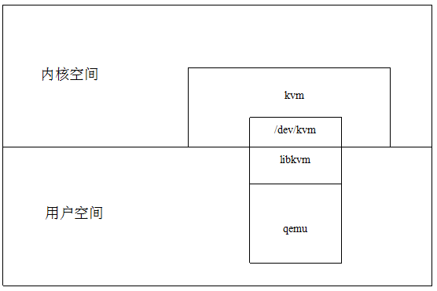
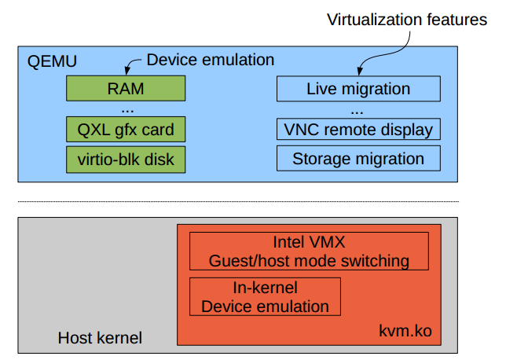
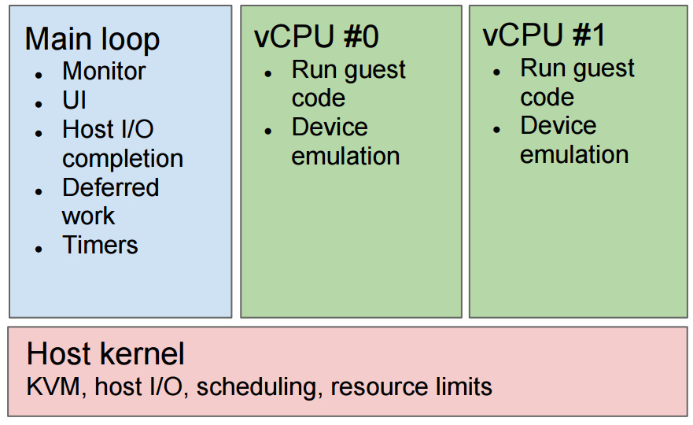

<!-- @import "[TOC]" {cmd="toc" depthFrom=1 depthTo=6 orderedList=false} -->

<!-- code_chunk_output -->

- [1. QEMU 官网描述](#1-qemu-官网描述)
- [2. QEMU 与 KVM 的关系](#2-qemu-与-kvm-的关系)
- [3. QEMU 的代码结构](#3-qemu-的代码结构)
  - [3.1. 线程事件驱动模型](#31-线程事件驱动模型)
  - [3.2. 设备模拟](#32-设备模拟)
  - [3.3. QEMU 中的虚拟机管理命令](#33-qemu-中的虚拟机管理命令)
  - [3.4. 块操作](#34-块操作)
- [4. QEMU 源码编译](#4-qemu-源码编译)
- [5. 参考](#5-参考)

<!-- /code_chunk_output -->

# 1. QEMU 官网描述

QEMU is a generic and open source machine emulator and virtualizer.

Full-system emulation: Run operating systems for any machine, on any supported architecture

User-mode emulation: Run programs for another Linux/BSD target, on any supported architecture

Virtualization: Run KVM and Xen virtual machines with near native performance

以上说明 QEMU 的以下特点:

1. QEMU 既可以作为模拟器(emulator), 也可作为虚拟机(virtualizer)

2. 全系统模拟器: 在所有支持的架构上运行任何机器的操作系统

3. 用户模式模拟器: 在任何支持的架构上, 运行另一个 Linux / BSD 目标的程序

4. 虚拟机: 必须基于 Xen Hypervisor 或 KVM 内核模块才能支持虚拟化. 在这种条件下 QEMU 虚拟机可以通过直接在本机 CPU 上运行客户机代码获得接近本机的性能.

# 2. QEMU 与 KVM 的关系

当 QEMU 在**模拟器模式**下, 运行操作系统时, 我们可以认为这是一种**软件实现的虚拟化技术**, 它的效率比真机差很多, 用户可以明显地感觉出来.

当 QEMU 在**虚拟机模式**下, QEMU 必须在 Linux 上运行, 并且需要借助**KVM 或者 Xen**, 利用 Intel 或者 Amd 提供的硬件辅助虚拟化技术, 才能使虚拟机达到接近真机的性能.

QEMU 与 KVM 内核模块协同工作, 在虚拟机进程中, 各司其职, 又相互配合, 最终实现高效的虚拟机应用.

QEMU 与 KVM 的关系如下:



**KVM**在**物理机启动**时创建/**dev/kvm 设备文件**,

当**创建虚拟机**时, KVM 为**该虚拟机进程**创建一个**VM 的文件描述符**,

当**创建 vCPU**时, KVM 为**每个 vCPU**创建一个**文件描述符**.

同时, KVM 向用户空间提供了一系列针对**特殊设备文件的 ioctl 系统调用**. QEMU 主要是通过**ioctl 系统调用**与 KVM 进行交互的.

那么 QEMU 和 KVM 具体都实现了哪些功能呢?我们用一张图说明:



QEMU 所实现的功能包括: 虚拟机的配置和创建、虚拟机运行依赖的虚拟设备、虚拟机运行时用户操作环境和交互(vnc)以及一些针对虚拟机的特殊技术(如**动态迁移**), 都是 QEMU 自己实现的.

同时 QEMU 还实现了利用 KVM 提供的接口实现虚拟机硬件加速.

而 KVM 的主要功能在于**初始化 CPU 硬件**, **打开虚拟化模式**, 然后将**虚拟客户机运行在虚拟机模式**下, 并对虚拟客户机的运行提供支持, 这些支持主要是以**针对相关的特殊设备文件**的**ioctl 系统调用**.

外设的模拟一般不会由 KVM 负责, 只有对**性能要求较高的虚拟设备**, 如**虚拟中断控制器**和**虚拟时钟**, 是由 KVM 模拟的, 这样可以大量减少处理器的**模式转换的开销**.

# 3. QEMU 的代码结构

## 3.1. 线程事件驱动模型



QEMU 的体系结构正如上图展示的——**每个 vCPU**都是**一个线程**, 这些**vCPU 线程**可以运行**客户机的代码**, 以及**虚拟中断控制器**、虚拟时钟的模拟. 而**Main loop 主线程**则是**Event\-driver**的, 通过**轮询文件描述符**, 调用对应的回调函数, 处理由 Monitor 发出的命令、Timers 超时, 并且实现 VNC、完成 IO 等功能.

QEMU 事件驱动的代码主要可以查看 include/qemu/main\-loop.h, 以及相关的实现代码.

## 3.2. 设备模拟

QEMU 为了实现大量设备的模拟, 实现了比较完备的**面向对象模型**——**QOM(QEMU Object Model**). QEMU 对于**CPU**、**内存**、**总线**以及**主板**的模拟都是依赖于 QOM 的, QEMU 中**设备相关的数据结构**的初始化工作都是依赖于**QOM 的初始化**实现机制. 对于它的实现主要可以查看 include/qom/object.h. 对于具体的 CPU、内存等设备的模拟, 可以查看 include/qom/cpu.h、include/exec/memory.h、include/hw/qdev\-core.h

## 3.3. QEMU 中的虚拟机管理命令

QEMU 中可以使用 hmp command 对虚拟机进行管理, 在虚拟机环境中同时按住 ctrl、Alt、2 就可以进入 QEMU 的命令模式. 通过输入命令, 就可以进行虚拟机的管理. 比如 savevm 命令可以把虚拟机的当前状态保存到虚拟机的磁盘中. 这些**命令的实现函数**都有一个统一的命名方式: **hmp\_xxx**, 比如**hmp\_savevm**就是 savevm 的实现函数的起始位置, hmp\_migrate 就是 migrate 的实现函数的起始位置.
因此对于 QEMU 中的每一条命令都可以很快找到相关的实现函数.

## 3.4. 块操作

QEMU 实现了大量的块设备驱动, 从而支持了包括 qcow2、qed、raw 等格式的镜像, 这些格式的实现代码都在 block 的文件夹下以及主目录下的 block.c 中. QEMU 设计了 BlockDriver 数据结构, 其中包含了大量的回调函数指针, 对于每一种磁盘格式, 都有一个对应的 BlockDriver 的对象, 并且实现了 BlockDriver 中的回调函数, 然后将这个 BlockDriver 的对象注册, 即添加到一个全局的 BlockDriver 的链表中.

# 4. QEMU 源码编译

QEMU 的编译过程并不复杂, 首先进入 QEMU 的代码目录后, 首先运行./configure \–help, 查看 qemu 支持的特性. 然后选择相关的特性进行编译.

由于我们使用的 X86_64 的平台, 并且主要查看的是 QEMU 与 KVM 协同工作实现虚拟化的代码, 我们使用下列命令配置:

```
./configure –enable-debug –enable-kvm –target-list=x86_64-softmmu
```

上述命令会生成 Makefile 文件, 然后直接 make 就可以了, 为了加速编译可以使用多线程: make -j number.

./configure 命令运行时会检查物理机的环境, 检查需要的相关的库是否已经安装在宿主机上. 因此可能由于相关库没有安装而中断, 其中一些库包括:
pkg\-config、zlib1g\-dev、libglib2.0\-dev、libpixman\-1\-dev、make 等

以上库都可以通过 ubuntu 的包管理命令 apt\-get install 直接安装.

如果需要把 QEMU 安装到系统中可以使用 make install 命令.

# 5. 参考

https://blog.csdn.net/u011364612/article/details/53470925