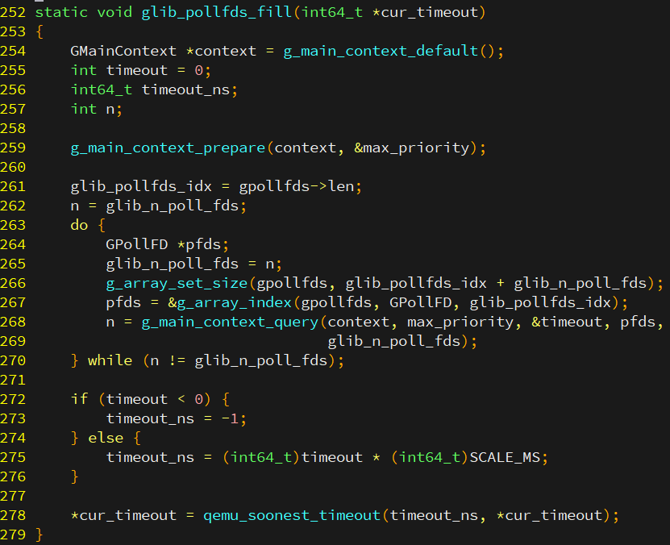
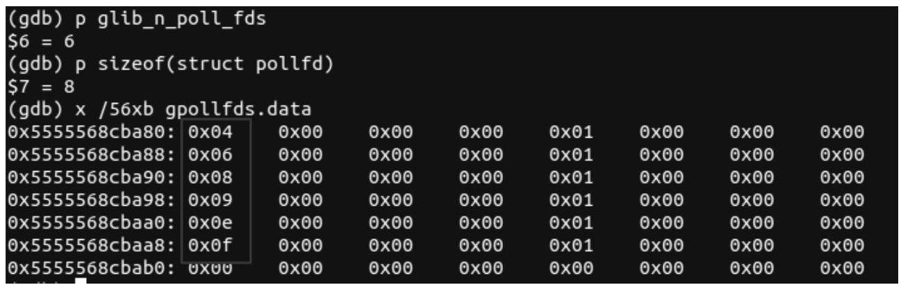
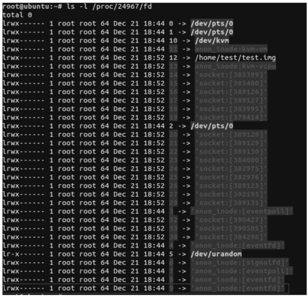
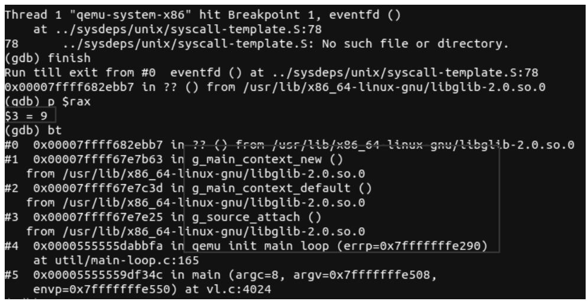

前面介绍了QEMU的事件循环机制, 并且在随后的几节中介绍了与事件循环机制相关的源码, 本节将实际分析QEMU主事件循环监听的fd来源. 首先以如下命令启动虚拟机. 

```cpp

```

为了方便稍后的叙述, 这里再把 glib_pollfds_fill 的代码和行号列在下面: 



使用 gdb 在第 272 行下断点. 

```
b main-loop.c:272
```

输入"r"让QEMU进程运行起来. 

gpollfds 是一个数组, 存着所有需要监听的fd, 其成员类型为pollfd, 成员都存放在gpollfds.data中, 所以这里可以判断到底监听了哪些fd. 图2-9显示了所有监听的fd, 总共有6个fd, 分别是4、6、8、9、e、f. 

QEMU 监听的 fd:



从图2-9可以看出来, 第一个fd 4是在monitor_init_globals初始化调用iohandler_init并创建iohander_ctx时调用的, 其本身对应iohander_ctx中的事件通知对象的fd. gdb继续输入"c"让程序运行起来, 在随后的g_source_add_poll断点中可以看到6、8、e、f这几个fd的来源. 6是调用qemu_signal_init创建signalfd对应的fd, 8是qemu_aio_context对应的fd, e和f是vnc创建的fd. 但是没有fd 9的信息. 

找到 QEMU 对应的进程 id, 查看 /proc/ 目录下该QEMU进程对应fd情况, 如下图所示. 这里可以看到fd 9是一个eventfd, 其虽然在glib事件循环监听中, 但是其并没有通过g_source_add_poll加入. 

QEMU 进程 fd 分布:



在eventfd函数下断点, 每次停下来之后在gdb中输入finish命令完成当前函数的执行, 然后查看rax寄存器的值, 当其是9的时候查看堆栈, 结果如图2-11所示. 从中可以看出, fd 9这个eventfd是由glib库自己创建使用的. 

这样, glib监听的6个fd就搞清楚了. 当然, 如果给QEMU提供不同的参数, 其监听的fd也会随着变化. 

fd 9 注册过程:

