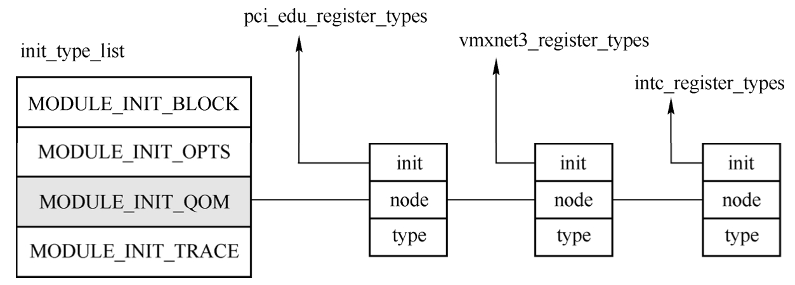

在面向对象思想中, 说到对象时都会提到它所属的类, QEMU也需要实现一个类型系统. 以hw/misc/edu.c文件为例, 这本身不是一个实际的设备, 而是教学用的设备, 它的结构简单, 比较清楚地展示了QEMU中的模拟设备. 类型的注册是通过type_init完成的.

```cpp

```

在include/qemu/module.h中可以看到, type_init是一个宏, 并且除了type_init还有其他几个init宏, 比如block_init、opts_init、trace_init等, 每个宏都表示一类module, 均通过module_init按照不同的参数构造出来. 按照是否定义BUILD_DSO宏, module_init有不同的定义, 这里假设不定义该宏, 则module_init的定义如下.

```cpp

```

可以看到各个QOM类型最终通过函数register_module_init注册到了系统, 其中function是每个类型都需要实现的初始化函数, type表示是MODULE_INIT_QOM. 这里的constructor是编译器属性, 编译器会把带有这个属性的函数do_qemu_init_##function放到特殊的段中, 带有这个属性的函数会早于main函数执行, 也就是说所有的QOM类型注册在main执行之前就已经执行了. register_module_init及相关函数代码如下.

```cpp

```

register_module_init函数以类型的初始化函数以及所属类型(对QOM类型来说是MODULE_INIT_QOM)构建出一个ModuleEntry, 然后插入到对应module所属的链表中, 所有module的链表存放在一个init_type_list数组中. 图2-17简单表示了init_type_list与各个module以及ModuleEntry之间的关系.

init_type_list结构:



综上可知, QEMU使用的各个类型在main函数执行之前就统一注册到了 `init_type_list [MODULE_INIT_QOM]` 这个链表中.

进入 main 函数后不久就以 MODULE_INIT_QOM 为参数调用了函数 module_call_init, 这个函数执行了 `init_type_list[MODULE_INIT_QOM]` 链表上每一个ModuleEntry的init函数.

```cpp

```

以edu设备为例, 该类型的init函数是pci_edu_register_types, 该函数唯一的工作是构造了一个TypeInfo类型的edu_info, 并将其作为参数调用type_register_static, type_register_static调用type_register, 最终到达了type_register_internal, 核心工作在这一函数中进行.

TypeInfo表示的是类型信息, 其中parent成员表示的是父类型的名字, instance_size和instance_init成员表示该类型对应的实例大小以及实例的初始化函数, class_init成员表示该类型的类初始化函数.

type_register_internal以及相关函数代码如下:

```cpp

```

type_register_internal函数很简单, type_new函数首先通过一个TypeInfo结构构造出一个TypeImpl, type_table_add则将这个TypeImpl加入到一个哈希表中. 这个哈希表的key是TypeImpl的名字, value为TypeImpl本身的值.

这一过程完成了从TypeInfo到TypeImpl的转变, 并且将其插入到了一个哈希表中. TypeImpl的数据基本上都是从TypeInfo复制过来的, 表示的是一个类型的基本信息. 在C++中, 可以使用class关键字定义一个类型. QEMU使用C语言实现面向对象时也必须保存对象的类型信息, 所以在TypeInfo里面指定了类型的基本信息, 然后在初始化的时候复制到TypeImpl的哈希表中.

TypeImpl中存放了类型的所有信息, 其定义如下.

```cpp

```

下面对其进行基本介绍.

name表示类型名字, 比如edu, isa-i8259等; class_size,instance_size表示所属类的大小以及该类所属实例的大小; class_init, class_base_init, class_finalize表示类相关的初始化与销毁函数, 这类函数只会在类初始化的时候进行调用; instance_init,instance_post_init, instance_finalize表示该类所属实例相关的初始化与销毁函数; abstract表示类型是否是抽象的, 与C++中的abstract类型类似, 抽象类型不能直接创建实例, 只能创建其子类所属实例; parent和parent_type表示父类型的名字和对应的类型信息, parent_type是一个TypeImpl; class是一个指向ObjectClass的指针, 保存了该类型的基本信息; num_interfaces和interfaces描述的是类型的接口信息, 与Java语言中的接口类似, 接口是一类特殊的抽象类型.