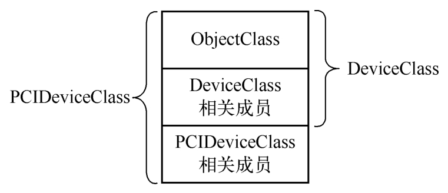

上一节中从type_initialize可以看到, 类型初始化时会初始化父类型, 这一节专门对类型的层次结构进行介绍, QOM通过这种层次结构实现了类似C++中的继承概念.

在edu设备的类型信息edu_info结构中有一个parent成员, 这就指定了edu_info的父类型的名称, edu设备的父类型是TYPE_PCI_DEVICE, 表明edu设备被设计成为一个PCI设备.

可以在hw/pci/pci.c中找到TYPE_PCI_DEVICE的类型信息, 它的父类型为TYPE_DEVICE. 更进一步, 可以在hw/core/qdev.c中找到TYPE_DEVICE的类型信息, 它的父类型是TYPE_OBJECT, 接着在qom/object.c可以找到TYPE_OBJECT的类型信息, 而它已经没有父类型, TYPE_OBJECT是所有能够初始化实例的最终祖先, 类似的, 所有interface的祖先都是TYPE_INTERFACE. 下面的代码列出了类型的继承关系.

```cpp

```

所以这个edu类型的层次关系为:

```

```

当然, QEMU中还会有其他类型, 如TYPE_ISA_DEVICE, 同样是以TYPE_DEVICE为父类型, 表示的是ISA设备, 同样还可以通过TYPE_PCI_DEVICE派生出其他的类型. 总体上, QEMU使用的类型一起构成了以TYPE_OBJECT为根的树.

下面再从数据结构方面谈一谈类型的层次结构. 在类型的初始化函数type_initialize中会调用ti->class=g_malloc0(ti->class_size)语句来分配类型的class结构, 这个结构实际上代表了类型的信息. 类似于C++定义的一个类, 从前面的分析看到ti->class_size为TypeImpl中的值, 如果类型本身没有定义就会使用父类型的class_size进行初始化. edu设备中的类型本身没有定义, 所以它的class_size为TYPE_PCI_DEVICE中定义的值, 即sizeof(PCIDeviceClass).

```cpp

```

PCIDeviceClass表明了类属PCI设备的一些信息, 如表示设备商信息的vendor_id和设备信息device_id以及读取PCI设备配置空间的config_read和config_write函数. 值得注意的是, 一个域是第一个成员DeviceClass的结构体, 这描述的是属于"设备类型"的类型所具有的一些属性. 在device_type_info中可以看到:

```cpp

```

DeviceClass定义了设备类型相关的基本信息以及基本的回调函数, 第一个域也是表示其父类型的Class, 为ObjectClass. ObjectClass是所有类型的基础, 会内嵌到对应的其他Class的第一个域中. 图2-18展示了ObjectClass、DeviceClass和PCIDeviceClass三者之间的关系, 可以看出它们之间的包含与被包含关系, 事实上, 编译器为C++继承结构编译出来的内存分布跟这里是类似的.

PCIDeviceClass的层级结构:



父类型的成员域是在什么时候初始化的呢?在type_initialize中会调用以下代码来对父类型所占的这部分空间进行初始化.

```cpp

```

回头再看来分析类的初始化type_initialize, 最后一句话为:

```cpp

```

第一个参数为ti->class, 对edu而言就是刚刚分配的PCIDeviceClass, 但是这个class_init回调的参数指定的类型是ObjectClass, 所以需要完成ObjectClass到PCIDeviceClass的转换.

```cpp

```

类型的转换是由PCI_DEVICE_CLASS完成的, 该宏经过层层扩展, 会最终调用到object_class_dynamic_cast函数, 从名字可以看出这是一种动态转换, C++也有类似的dynamic_cast来完成从父类转换到子类的工作. object_class_dynamic_cast函数的第一个参数是需要转换的ObjectClass, 第二个typename表示要转换到哪一个类型.

函数首先通过type_get_by_name得到要转到的TypeImpl, 这里的typename是TYPE_PCI_DEVICE.

```cpp

```

以edu为例, type->name是"edu", 但是要转换到的却是TYPE_PCI_DEVICE, 所以会调用type_is_ancestor("edu", TYPE_PCI_DEVICE)来判断后者是否是前者的祖先.

在该函数中依次得到edu的父类型, 然后判断是否与TYPE_PCI_DEVICE相等, 由edu设备的TypeInfo可知其父类型为TYPE_PCI_DEVICE, 所以这个type_is_ancestor会成功, 能够进行从ObjectClass到PCIDeviceClass的转换. 这样就可以直接通过(PCIDeviceClass*)ObjectClass完成从ObjectClass到PCIDeviceClass的强制转换.

