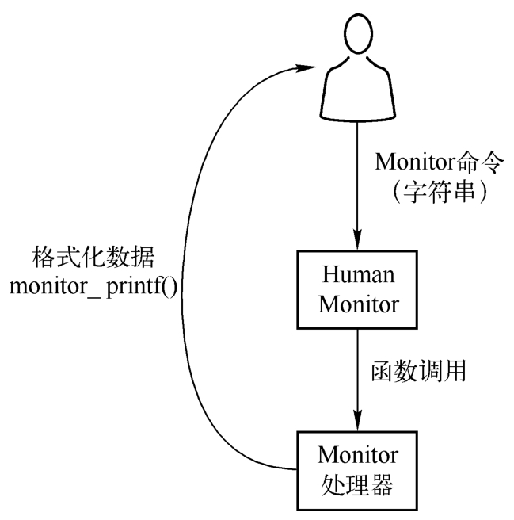
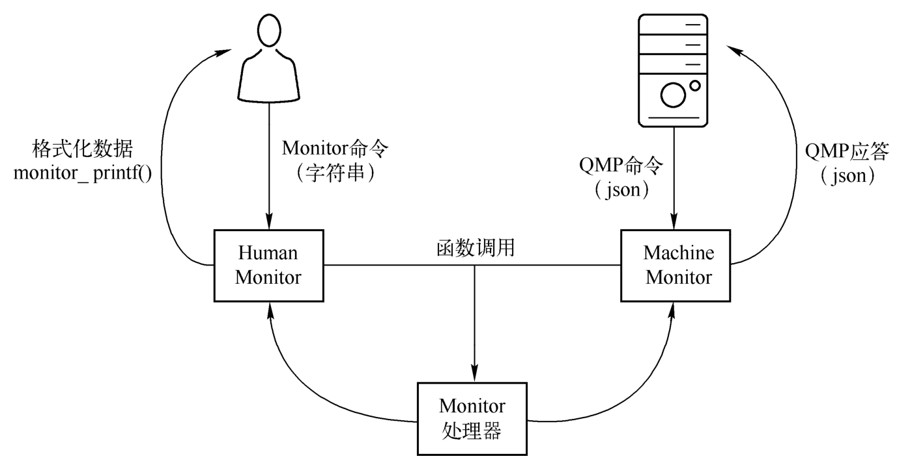

QEMU 程序在运行时提供了一个所谓的监控器 (monitor) 来跟外界进行数据交互. QEMU monitor 有很多功能, 如得到虚拟机运行的一些统计信息, 进行设备的热插拔, 动态设置一些参数, 开启一些功能等. QEMU monitor 能够使用多种方式进行交互, 如 QEMU 的控制台, TCP 网络, UNIX 套接字, 文件等.

与 QEMU monitor 进行交互的协议有两类, 传统的是基于字符串的协议, 叫作 Human Monitor Protocol(HMP), 其功能比较简单, 可用于进行简单的调试和查看虚拟机状态等. 其基本原理如图 2-23 所示.

hmp 原理:

另一个协议是 QEMU Monitor Protocol(qmp), 它是一个基于 json, 用来与 QEMU 进行交互的协议, 采用典型的服务器 - 客户端架构. 通过 qmp, 上层管理软件可以很方便地对 QEMU 虚拟机进行管理, 如 virsh 就能够使用 qmp 对虚拟机进行管理. qmp 原理如图 2-24 所示.

qmp 原理:

现在的 QEMU 底层其实都是通过 qmp 完成功能的, 只是还保留了 hmp 的接口.

从 `hmp 原理 ` 图可以看出, hmp 是针对人的, 所以采用了基于 "info xxx" 等简单易记字符串的协议, 而 qmp 主要是针对机器和其他程序的, 所以采用了更加规范的 json 格式来传递数据.

