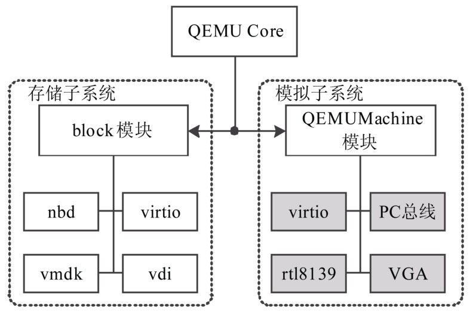
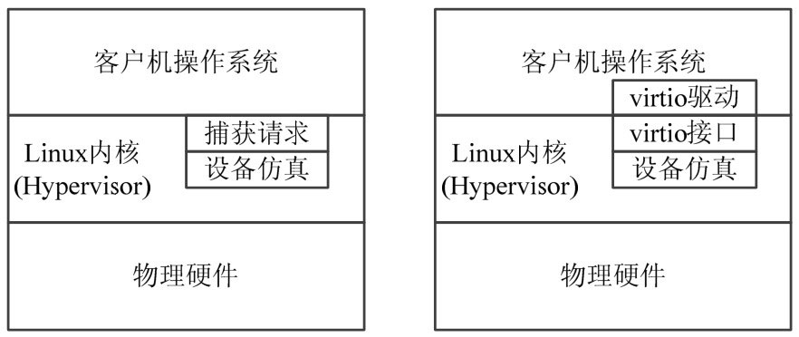
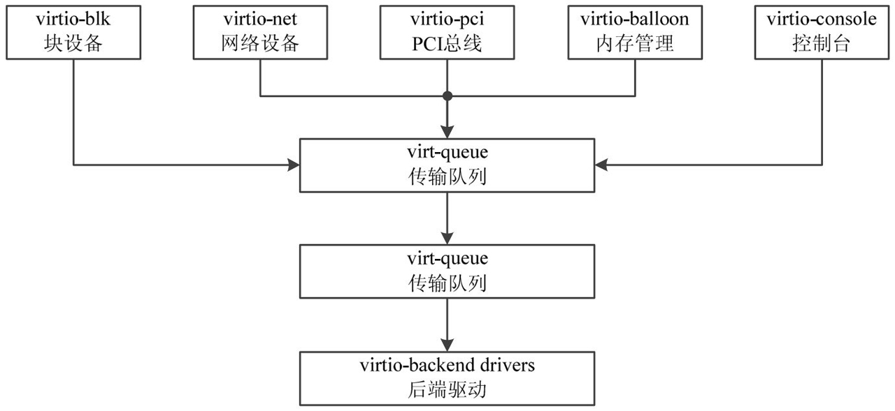

<!-- @import "[TOC]" {cmd="toc" depthFrom=1 depthTo=6 orderedList=false} -->

<!-- code_chunk_output -->

- [1. 模块模型](#1-模块模型)
  - [1.1. 块设备模块 module_block](#11-块设备模块-module_block)
  - [1.2. 主机模块 module_machine](#12-主机模块-module_machine)
  - [1.3. 设备模块 module_device](#13-设备模块-module_device)
  - [1.4. 模块之间的关系](#14-模块之间的关系)
  - [1.5. 模块的初始化](#15-模块的初始化)
- [2. libkvm 模块](#2-libkvm-模块)
- [3. virtio 组件](#3-virtio-组件)
  - [3.1. 完全虚拟化和半虚拟化](#31-完全虚拟化和半虚拟化)
  - [3.2. front-end 实现概述](#32-front-end-实现概述)
    - [3.2.1. scan 设备](#321-scan-设备)
    - [3.2.2. 准备 virt-queue: notify 函数](#322-准备-virt-queue-notify-函数)
    - [3.2.3. 注册用户态空间设备文件](#323-注册用户态空间设备文件)
  - [3.3. virtio 发起 I/O 请求](#33-virtio-发起-io-请求)

<!-- /code_chunk_output -->

# 1. 模块模型

与 Linux 内核一样, **QEMU 的扩展组件**都以**模块方式**提供, 模块主要分三种类型:

- `module_block`, 块设备模块

- `module_device`, 设备模块

- `module_machine`, 主机模块

这些模块的定义在**module.h**和**module.c**中, **不同类型的模块**为 QEMU 的内部提供**不同的功能服务**.

## 1.1. 块设备模块 module_block

**块设备模块**为 QEMU 提供**存储能力的支持**, 支持包括**存储网络**、**磁盘分区**、**磁盘映像文件**等存储媒介的读/写, 最终为所要模拟的平台提供一个**存储的块设备接口**.

在块设备模块的帮助下, **QEMU**能够**读/写**多种虚拟化方案的**映像文件**, 如 VMware 的**VMDK**、Virtual PC 的**VPC**、**VDI**以及**DMG**等各种格式, 而且根据这些开源代码所提供的接口, 用户还可以**自行编写**所需要支持的映像文件格式.

块设备模块的初始化标志为`MODULE_INIT_BLOCK`.

## 1.2. 主机模块 module_machine

**主机模块**一般在 QEMU 的发行版本中**只有一个或者数个**, 一般**一个主机模块**代表**一台完整的模拟系统**, 如**一台 PC**、**一块开发板**等.

**主机模块**通过**下挂接总线**、**设备驱动**等, 提供一个**待模拟的系统**所拥有的**所有硬件设备**.

machine 模块的初始化标志为`MODULE_INIT_MACHINE`.

## 1.3. 设备模块 module_device

设备模块是 QEMU 中**数量最大**、**功能最丰富**的模块, 用于**模拟各种各样的设备**、**外设**、**适配器**等.

设备模块的主要实现在 QEMU 源代码目录的**hw 子目录**中, 既实现了包括**网卡**、**图形适配器**、**蓝牙**等方面的**具体物理设备的模拟**, 也实现了**PCI**、**ISA**等**局部总线**, 还提供了基于**PPC**、OMAP、MIPS 等**SoC 系统**的**片上组件实现**.

这些模块的初始化标志为 `MODULE_INIT_DEVICE`.

## 1.4. 模块之间的关系

以上三种模块为 QEMU 的工作提供了灵活性的支持, 在**不同的场景**下, 通过**搭配不同的模块**, 实现**不同的功能**.

如通过引入**block 模块**, 让**QEMU**能够以几乎**任何介质**作为其虚拟机的存储器空间, 也能通过在 **block 模块**中通过**扩充**, 实现虚拟机的存储介质**动态迁移**的目标.

这三种模块在 QEMU 系统中的相互关系如图 2 所示, 其中, **block 模块**和**QEMU Machine 模块**已经在图中给出, 图中**灰色模块**部分则是**device 模块**.

图 2 QEMU 系统中模块的相互关系



## 1.5. 模块的初始化

QEMU 的代码中, 充分使用了 **GCC** 的特性, 尤其是在**模块编译部分**. 在上述三种模块的代码中, 可以看到模块内部分别通过 **block\_init**、**machine\_init**和**device\_init**这三种宏进行初始化声明, 其代码在 module.h 中, 具体如下.

代码 6\-1 模块初始化声明代码

```cpp
(30) #define block_init(function) module_init(function, MODULE_INIT_BLOCK)
(31) #define device_init(function) module_init(function, MODULE_INIT_DEVICE)
(32) #define machine_init(function)module_init(function,MODULE_INIT_MACHINE)
```

这三个宏都调用了 module\_init 宏, 但是**传入**了**不同的初始化参数**,  **module\_init 宏**的代码如下.

与传统的 C 语言代码相比, 这里增加了**构造属性说明**`__attribute__((constructor))`, 这个说明是**GCC**对于 C 语言的扩展性说明, 用于**全局变量初始化**, 标识有`__attribute__((constructor))`的函数将表示这段代码将在**main 函数前调用**.

代码 6\-2 module\_init 代码

```
(17) /* This should not be used directly.  Use block_init etc. instead.  */
(18) #define module_init(function, type)                                  \
(19) static void__attribute__((constructor))do_qemu_init_##function(void){ \
(20)    register_module_init(function, type);                             \
(21) }
```

# 2. libkvm 模块

**libkvm 模块**是 **QEMU** 和 **KVM 内核模块**中间的**通信模块**, 虽然 KVM 的 API 比较稳定, 也提供了`/dev/kvm`作为同 KVM 的 API 接口, 但从**未来扩展性**出发, **KVM 开发小组**还提供了**libkvm**, **包装**了针对`/dev/kvm`的具体的**ioctl 操作**, 并且添加了 KVM 的一些**初始化函数**, 使之成为一个**可复用的 KVM 用户空间控制模块**, 供其他开发程序使用, 如**libvirt**.

libkvm 模块的代码在**kvm\libkvm**中, 针对**不同的硬件平台**准备了**不同的支持文件**, 以及对 **KVM 的参数设置模块**. 主要文件是 **libkvm.h**和 libkvm.h, 针对 **KVM 的接口**进行封装, 以封装 KVM\_CREATE\_VM 的函数 **kvm\_create\_vm**举例如下.

代码 6\-3 kvm\_create\_vm 函数代码

```
(419)    int kvm_create_vm(kvm_context_t kvm)
(420)    {
(421)         int fd = kvm->fd;
(422)
(423)    #ifdef KVM_CAP_IRQ_ROUTING
(424)         kvm->irq_routes = malloc(sizeof(*kvm->irq_routes));
(425)         if (!kvm->irq_routes)
(426)              return -ENOMEM;
(427)         memset(kvm->irq_routes, 0, sizeof(*kvm->irq_routes));
(428)         kvm->nr_allocated_irq_routes = 0;
(429)    #endif
(430)
(431)         kvm->vcpu_fd[0] = -1;
(432)
(433)         fd = ioctl(fd, KVM_CREATE_VM, 0);
(434)         if (fd == -1) {
(435)              fprintf(stderr, "kvm_create_vm: %m\n");
(436)              return -1;
(437)         }
(438)         kvm->vm_fd = fd;
(439)         return 0;
(440)    }
```

该函数将会在 **qemu\_kvm**的 **kvm\_create**函数中被调用, 根据传入的 **KVM 文件描述符 fd\_kvm**通过**ioctl**进行创建 VCPU 的操作, 最终获得代表该 VCPU 的文件描述符 vm\_fd, 并且加入 KVM 的内部数据结构 kvm\_context\_t 中, 完成本次的请求操作.

libkvm 中除了定义操作函数之外, 还定义了**一系列回调函数**, 这些回调函数被整理在 kvm\_callbacks 结构体中, 包含了对客户机进行操作之后的反馈信息, 如读取、写入客户机空间, 对 kvm\_run 前后的钩子函数, 开机和关机通知、异常和出错等钩子函数的相关信息, 该结构体代码如下.

代码 6\-4 kvm\_callbacks 结构体

```
(39) /*!
(40)  * \brief KVM callbacks structure
(41)  *
(42)  * This structure holds pointers to various functions that KVM will call
(43)  * when it encounters something that cannot be virtualized, such as
(44)  * accessing hardware devices via MMIO or regular IO.
(45)  */
(46) struct kvm_callbacks {
(47)     /// For 8bit IO reads from the guest (Usually when executing 'inb')
(48)    int (*inb)(void *opaque, uint16_t addr, uint8_t *data);
(49)     /// For 16bit IO reads from the guest (Usually when executing 'inw')
(50)    int (*inw)(void *opaque, uint16_t addr, uint16_t *data);
(51)     /// For 32bit IO reads from the guest (Usually when executing 'inl')
(52)    int (*inl)(void *opaque, uint16_t addr, uint32_t *data);
(53)     /// For 8bit IO writes from the guest (Usually when executing 'outb')
(54)    int (*outb)(void *opaque, uint16_t addr, uint8_t data);
(55)     ///For 16bit IO writes from the guest(Usually when executing'outw')
(56)    int (*outw)(void *opaque, uint16_t addr, uint16_t data);
(57)     ///For 32bit IO writes from the guest(Usually when executing'outl')
(58)    int (*outl)(void *opaque, uint16_t addr, uint32_t data);
(59)     /// generic memory reads to unmapped memory (For MMIO devices)
(60)    int (*mmio_read)(void *opaque, uint64_t addr, uint8_t *data,
(61)                         int len);
(62)     /// generic memory writes to unmapped memory (For MMIO devices)
(63)    int (*mmio_write)(void *opaque, uint64_t addr, uint8_t *data,
(64)                         int len);
(65) #ifdef KVM_CAP_SET_GUEST_DEBUG
(66)    int (*debug)(void *opaque, void *env,
(67)           struct kvm_debug_exit_arch *arch_info);
(68) #endif
(69)     /*!
(70)      * \brief Called when the VCPU issues an 'hlt' instruction.
(71)      *
(72)      * Typically, you should yeild here to prevent 100% CPU utilization
(73)      * on the host CPU.
(74)      */
(75)    int (*halt)(void *opaque, int vcpu);
(76)    int (*shutdown)(void *opaque, void *env);
(77)    int (*io_window)(void *opaque);
(78)    int (*try_push_interrupts)(void *opaque);
(79) #ifdef KVM_CAP_USER_NMI
(80)    void (*push_nmi)(void *opaque);
(81) #endif
(82)    void (*post_kvm_run)(void *opaque, void *env);
(83)    int (*pre_kvm_run)(void *opaque, void *env);
(84)    int (*tpr_access)(void *opaque, int vcpu, uint64_t rip, int is_write);
(85) #if defined(__powerpc__)
(86)    int (*powerpc_dcr_read)(int vcpu, uint32_t dcrn, uint32_t *data);
(87)    int (*powerpc_dcr_write)(int vcpu, uint32_t dcrn, uint32_t data);
(88) #endif
(89) #if defined(__s390__)
(90)    int (*s390_handle_intercept)(kvm_context_t context, int vcpu,
(91)     struct kvm_run *run);
(92)    int (*s390_handle_reset)(kvm_context_t context, int vcpu,
(93)      struct kvm_run *run);
(94) #endif
(95) };
```

在该结构体中的代码虽然很长, 但是因为包含了太多其他平台的代码, 因此, 总体为上层提供的回调功能并不多. 40~58 行定义了对客户机操作系统的 MMIO 和内存空间读取调用. 在 68~77 行则对客户机的开机、重启、关闭等事件信息提供回调. 其余部分则提供 PowerPC、S390 等系统的支持.

# 3. virtio 组件

**virtio**是 Rusty Russell 为自己的**lguest**虚拟化方案所编写的一套**设备半虚拟化引擎**, 后来移植到 Linux 平台中.

## 3.1. 完全虚拟化和半虚拟化

在**虚拟化**中, 如果按照**传统硬件的方式**, 对虚拟机提供一个**完整的模拟设备**, 通过**标准的 I/O 端口**、**DMA**等方式进行操作, 则要达到同一个功能, 需要使用**较多的指令**去**捕捉对该设备的请求**, 执行该设备的具体操作, 效率较低.

而 virtio 在**设备模拟层**引入了**半虚拟化**的方法, 即在**虚拟机**中安装符合**给定标准的接口驱动**, 通过这些接口**与主机之间通信**, **省去**了传统模拟设备中的**I/O 端口指令集模拟**等方面的烦琐开销.

这两种方式的对比如图 3 所示, 使用了 **virtio 驱动**的 VM 虚拟机会在性能上有较大提高, 充分使用完全虚拟化和半虚拟化各自的优势.

在**完全虚拟化**中, Guest OS 运行在位于物理机器上的 KVM 的 Hypervisor 之上. Guest OS 不需要知道自己运行于虚拟化环境中, 并且不需要任何更改就可以在该配置下工作.

相反, 在**基于 virtio**的**半虚拟化**中, Guest OS 不仅知道它运行在 KVM 之上, 而且还安装了相应的 virtio 驱动, 优化了其访问能力.

图 3 **设备层半虚拟化**与**全虚拟化**架构图



在**完全虚拟化模式**中, Hypervisor 必须**模拟设备硬件**, 它是在会话的最低级别进行模拟的(例如, 网络驱动程序). 尽管在该抽象中模拟很干净, 但它同时也是最低效、最复杂的. 在半虚拟化模式中, Guest OS 和宿主机的 Linux 内核能够共同合作, 让模拟更加高效.

基于**virtio 的驱动程序架构**如图 4 所示, virtio 通过提供一个叫做**vqueue**的组件, 将 **Guest OS** 的**各种 I/O 请求**保存在一个**缓冲区**中, 随后交给**QEMU！！！** 以进行**调度执行**. 除了在 Guest OS 和 Hypervisor 中分别有 **Frond\-end Drivers**和 **Back\-end Drivers** 之外, 还定义了另外**两个层次**用于支持 Guest OS 到 Hypervisor(KVM)的通信. 在**顶级**的是**virt\-queue 虚拟队列接口**, 负责**缓冲前端驱动程序的请求**和**后端驱动程序的反馈**.

图 4 virtio 驱动程序架构: **块设备**、**网络设备**、**PCI 总线**、**内存管理**、**控制台**等.



virtio 的驱动程序可以使用**0 个或者多个队列**, 具体的队列数量取决于该驱动程序实现的需求. 例如,

- **virtio\-net**网络驱动程序中, 使用了**两个虚拟队列**, 一个用于**接收**, 一个用于**发送**.
- 而**virtio\-blk**块设备驱动程序则仅仅使用了**1 个虚拟队列**.

虚拟队列可以看做是 Guest OS 和 Hypervisor 的衔接点, 在满足 API 接口的前提下, 双方可以任意协商实现, 但是必须一致.

**virtio 实质**上是通过**virt\-queue**作为**缓冲**, 为**Guest OS**和**Hypervisor**之间的**驱动程序数据接口**提供了一个框架.

## 3.2. front-end 实现概述

在 **Linux 内核**的代码中可以找到 **virtio** 的**front\-end 驱动程序**的实现方式, 在这里简要概述如下.

### 3.2.1. scan 设备

首先需要**自行**实现**scan 设备**的功能, 然后调用`register_virtio_device` 函数来**注册发现的虚拟设备**.

参考 `drivers/lguest/lguest_device.c` 中的 `scan\_devices`函数. 一个典型的实现是**虚拟机主机**提供的**共享内存配置**, 其中提供了虚拟设备的列表相同的配置, 然后自己根据配置注册 device.

virtio 的**设备扫描功能**类似**PCI 总线的工作方式**, **PCI**首先扫描**各个硬件插槽**, 然后**发现**新的 PCI 设备, 接着**创建 device 结构**, 再调用到驱动的**probe**函数实现**驱动和 device 结构**的匹配. device 结构体的生命周期包括扫描过程的各个阶段.

### 3.2.2. 准备 virt-queue: notify 函数

接下来, 需要为 **virtio\_device** 设备准备 **virt\-queue** 队列, 具体的实现可以参考 kvm\_find\_vq 函数, 实现的重点是需要提供**符合 virt\-queue 结构**的 **notify 函数**, 该函数用于**通知 host 主机队列中已经有消息存在**, 可以进行下一步的操作, 一般是**hypercall**, 就是通过**vmcall 指令**或者**traps 陷阱代码**来通知 Hypervisor 执行进一步的操作, 代码如下.

代码 6\-5 kvm\_notify 函数

```
(161)    /*
(162)     * When the virtio_ring code wants to notify the Host, it calls us here and we
(163)     * make a hypercall.  We hand the address  of the virtqueue so the Host
(164)     * knows which virtqueue we're talking about.
(165)     */
(166)    static void kvm_notify(struct virtqueue *vq)
(167)    {
(168)         struct kvm_vqconfig *config = vq->priv;
(169)
(170)         kvm_hypercall1(KVM_S390_VIRTIO_NOTIFY, config->address);
(171)    }
```

### 3.2.3. 注册用户态空间设备文件

最后, 使用**virtio\_device\_register**函数**注册 virtio 设备**, 就为**Guest OS**中的**用户态空间**创建了相应的**设备文件(/dev**), 与操作具体的物理设备一样, 可以对**virtio 的设备**进行控制.

## 3.3. virtio 发起 I/O 请求

在 Linux 中, 为了便于编写 virtio 驱动程序, 提供了针对**virt\-queue**的**helper 函数**: **virtqueue\_get\_buf**和**virtqueue\_add\_buf**. 驱动程序可以通过 virtqueue\_get\_buf 从 virtqueue 中取得来自 Hypervisor 的响应消息.

如果 **virtio 驱动**需要**发起一个 I/O 请求**, 则应**执行如下操作**.

1)调用**virtio\_queue\_add\_buf**函数**加入**一个**新的 I/O 请求**.

2)调用**virtio\_kick**函数将**这个 I/O 请求**发送给**Hypervisor**. 如果本次希望尝试多次 virtio 请求, 则可以反复调用多次 virtio\_queue\_add\_buf 函数之后, 通过调用 virtio\_kick 函数**一次性**将**请求批量提交**.

3)virtio\_kick 函数中将会**调用传输到 QEMU 的 notify 函数**, 通知 QEMU 有该请求, QEMU 在接到该请求之后, 将执行具体的操作.

在 qemu\-kvm 体系结构中, 因为 Guest OS 实质上是一个 Linux 用户态中的进程. 因此, 可以使用**共享内存**的方式, 在**QEMU**和**Guest OS**的系统空间之间交换数据, 效率非常高.
