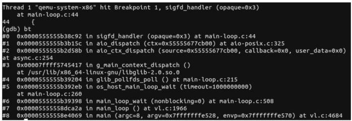

上一节介绍了QEMU的自定义事件源, 本节以signalfd的处理为例介绍QEMU事件处理的过程. signalfd是Linux的一个系统调用, 可以将特定的信号与一个fd绑定起来, 当有信号到达的时候fd就会产生对应的可读事件. 以如下命令启动虚拟机.

```cpp

```

在sigfd_handler函数下断点, 在另一个终端向QEMU发送SIGALARM信号, 命令如下, 其中2762是QEMU进程号. 

```

```

在第一个命令行的中断中可以看到QEMU进程已经在sigfd_handler函数被中断下来, 图2-7显示了此时的函数调用情况, 从中可以看到整个过程调用了glib的事件分发函数g_main_context_dispatch, 然后调用了AioContext自定义事件源的回调函数aio_ctx_dispatch, 最终调用到QEMU为信号注册的可读回调函数sigfd_handler. 

图2-7 sigfd_handler函数的栈回溯:



下面对这个过程进行简单分析, 首先分析signal事件源的初始化. vl.c中的main函数会调用qemu_init_main_loop进行AioContext事件源的初始化, 该函数代码如下. 

```cpp

```

qemu_init_main_loop函数调用qemu_signal_init将一个fd与一组信号关联起来, qemu_signal_init调用了之前提到的qemu_set_fd_handler函数, 设置该signalfd对应的可读回调函数为sigfd_handler. qemu_set_fd_handler在首次调用时会调用iohandler_init创建一个全局的iohandler_ctx事件源, 这个事件源的作用是监听QEMU中的各类事件. 最终qemu_signal_init会在iohandlers_ctx的aio_handlers上挂一个AioHandler节点, 其fd为这里的signalfd, 其io_read函数为这里的sigfd_handler. 

qemu_init_main_loop函数接着会调用aio_context_new创建一个全局的qemu_aio_context事件源, 这个事件源主要用于处理BH和块设备层的同步使用. 

最后, 该函数调用aio_get_g_source和iohandler_get_g_source分别获取qemu_aio_context和iohandler_ctx的GSource, 以GSource为参数调用g_source_attach两个AioContext加入到glib的主循环中去. 

将信号对应的fd加入事件源以及将事件源加入到glib的主循环之后, QEMU就会按照2.1.2节所述, 在一个while循环中进行事件监听. 当使用kill向QEMU进程发送SIGALARM信号时, signalfd就会有可读信号, 从而导致glib的主循环返回调用g_main_context_dispatch进行事件分发, 这会调用到aio_ctx_dispatch, 最终会调用到qemu_signal_init注册的可读处理函数sigfd_handler. 