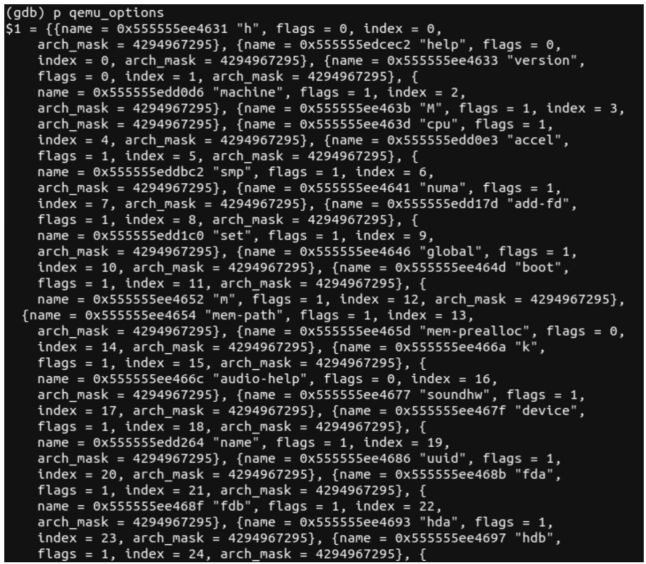
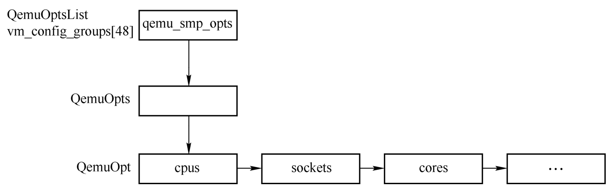
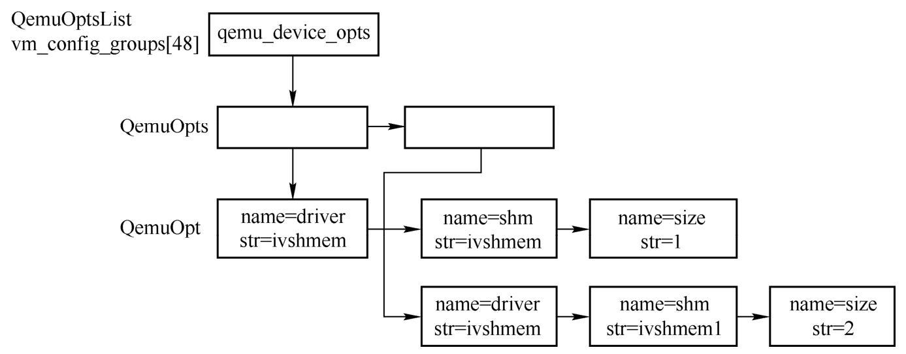

qemu 命令:

```
qemu-system-x86_64
```

QEMU 使用 QEMUOption 来表示QEMU程序的参数选项, 其定义如下.

```cpp
// system/vl.c
typedef struct QEMUOption {
    const char *name;
    int flags;
    int index;
    uint32_t arch_mask;
} QEMUOption;
```

其中, name 表示参数选项的名字; flags 表示选项中一些参数选项的属性, 比如是否有子参数; arch_mask 表示参数支持的体系结构.

vl.c 在全局范围定义了一个 qemu_options, 存储了所有的可用选项, main 函数中会调 lookup_opt 来解析 QEMU 命令行参数, 不在 qemu_options 中的参数是不合法的.

```cpp
// system/vl.c
static const QEMUOption qemu_options[] = {
    { "h", 0, QEMU_OPTION_h, QEMU_ARCH_ALL },

#define DEF(option, opt_arg, opt_enum, opt_help, arch_mask)     \
    { option, opt_arg, opt_enum, arch_mask },
#define DEFHEADING(text)
#define ARCHHEADING(text, arch_mask)

#include "qemu-options.def"
    { /* end of list */ }
};
```

qemu_options的生成使用QEMU_OPTIONS_GENERATE_OPTIONS编译控制选项以及一个文件qemu-options-wrapper.h填充. 在qemu-options-wrapper.h中, 根据是否定义QEMU_OPTIONS_GENERATE_ENUM, QEMU_OPTIONS_GENERATE_HELP, QEMU_OPTIONS_GENERATE_OPTIONS以及qemu-options.def文件可以生成不同的内容. qemu-options.def是在Makefile中利用scripts/hxtool脚本根据qemu-options.hx文件生成的.

在这里只需要理解qemu_options中包括了所有可能的参数选项, 如上面的-enable-kvm、-smp、-realtime、-device等即可. 下图显示了gdb中部分qemu_options的值.

QEMU参数选项:



QEMUOption提供了参数的基本信息情况. 实际参数的保存是由3个数据结构完成的.

QEMU将所有参数分成了几个大选项, 如 -eanble-kvm 和 -kernel 都属于 machine 相关的, 每一个大选项使用结构体 QemuOptsList 表示, QEMU 在 qemu-config.c 中定义了 vm_config_groups.

```cpp
// util/qemu-config.c"
static QemuOptsList *vm_config_groups[48];
```

这表示可以支持48个大选项. 在main函数中用 qemu_add_opts 将各个QemuOptsList添加到 vm_config_groups 中.

```cpp
// system/vl.c
void qemu_init(int argc, char **argv)
{
    ...
    qemu_add_opts(&qemu_drive_opts);
    qemu_add_drive_opts(&qemu_legacy_drive_opts);
    qemu_add_drive_opts(&qemu_common_drive_opts);
    qemu_add_drive_opts(&qemu_drive_opts);
    qemu_add_drive_opts(&bdrv_runtime_opts);
    qemu_add_opts(&qemu_chardev_opts);
    ...
    qemu_add_opts(&qemu_tpmdev_opts);
    qemu_add_opts(&qemu_overcommit_opts);
    qemu_add_opts(&qemu_msg_opts);
    qemu_add_opts(&qemu_name_opts);
    qemu_add_opts(&qemu_numa_opts);
    qemu_add_opts(&qemu_icount_opts);
    qemu_add_opts(&qemu_semihosting_config_opts);
    qemu_add_opts(&qemu_fw_cfg_opts);
    qemu_add_opts(&qemu_action_opts);
    ...
}
```

每个 QemuOptsList 存储了大选项支持的所有小选项, 如 `-overcommit` 大选项定义如下.

```cpp
// system/vl.c
static QemuOptsList qemu_overcommit_opts = {
    .name = "overcommit",
    .head = QTAILQ_HEAD_INITIALIZER(qemu_overcommit_opts.head),
    .desc = {
        {
            .name = "mem-lock",
            .type = QEMU_OPT_BOOL,
        },
        {
            .name = "cpu-pm",
            .type = QEMU_OPT_BOOL,
        },
        { /* end of list */ }
    },
};
```

`-overcommit` 支持两个值为 bool 的子选项, 即 `-overcommit mlock=on/off cpu-pm=on/off`. 但是像 -device 这种选项就没有这么死板了, -device 并没有规定必需的选项, 因为设备有无数多种, 不可能全部进行规定, 解析就是按照","或者"="来进行的. 每个子选项由一个QemuOpt结构表示, 定义如下.

```cpp

```

name表示子选项的字符串表示; str表示对应的值.

QemuOptsList并不和QemuOpt直接联系, 中间还需要有一层QemuOpts, 这是因为QEMU命令行可以指定创建两个相同的设备, 此时这类设备都在QemuOptsList的链表上, 这是两个独立QemuOpts, 每个QemuOpts有自己的QemuOpt链表. QemuOpts结构如下.

```cpp

```

head是QemuOpts下的QemuOpt链表头; next用来连接相同QemuOptsList下同一种Qemu Opts.

QemuOptsList、QemuOpts与QemuOpt三者的关系如下图所示:



这里以-device参数项为例简单分析参数的处理过程, vl.c中的main函数中有一个很长的for循环来解析参数, 当解析到"-device"时, 下面是对QEMU_OPTION_device的分支处理.

```cpp

```

qemu_find_opts函数从全局变量vm_config_groups中找到刚才插入的device QemuOptsList并返回. qemu_opts_parse_noisily函数只是简单调用了opts_parse, 后者解析出一个QemuOpts, 每一个大类的参数(如-device edu)都会在相应的QemuOptsList下面构造处理一个Opts.

```cpp

```

opts_parse函数调用的最重要的两个函数是qemu_opts_create和opts_do_parse, 前者用来创建opts并且将它插入到QemuOptsList上, 后者则开始解析出一个一个的QemuOpt. opts_do_parse的作用就是解析参数的值, 如本节开始的命令行参数ivshmem,shm=ivshmem,size=1. QEMU的参数可以有多种情况, 比如foo,bar中foo表示开启一个flag, 也有可能类似于foo=bar, 对此opts_do_parse需要处理各种情况, 并对每一个值生成一个QemuOpt. 关键代码如下.

```cpp

```

该函数首先根据各种情况(foo,bar或者foo=bar,more)解析出option以及value, 然后调用opt_set, 在该函数中会分配一个QemuOpt结构, 并且进行初始化. 例子中的ivshmem,shm=ivshmem, size=1会解析出3个QemuOpt, name=str分别是driver=ivshmem、shm=ivshmem、size=1. 所以对于两个device的参数解析会形成图2-15所示的链表.

QEMU参数解析结果:



