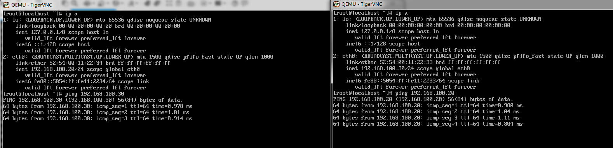
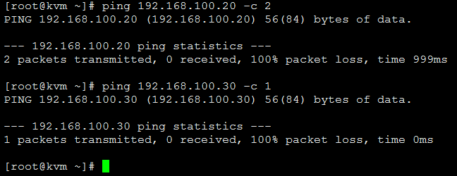
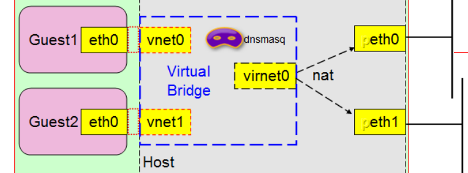
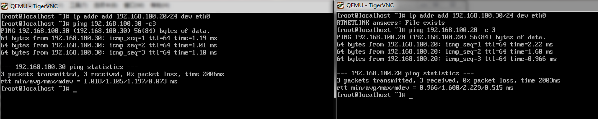
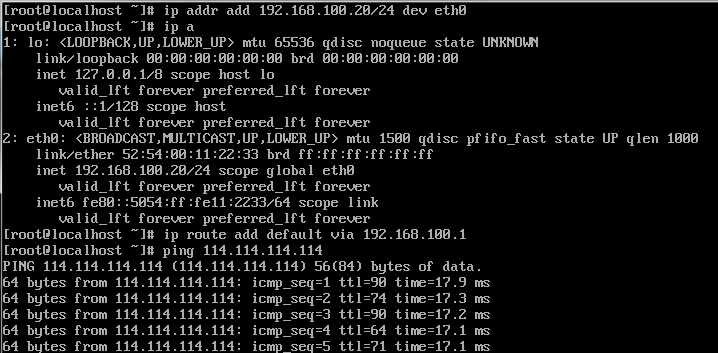
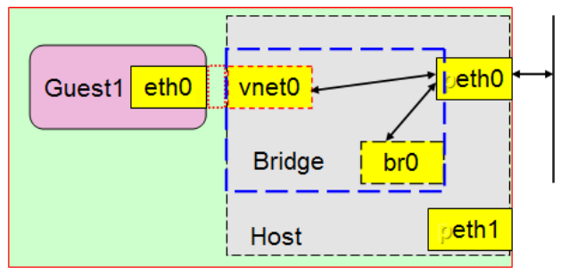

<!-- @import "[TOC]" {cmd="toc" depthFrom=1 depthTo=6 orderedList=false} -->

<!-- code_chunk_output -->

- [1. 隔离模式](#1-隔离模式)
  - [1.1 使用 qemu-kvm 创建隔离模式](#11-使用-qemu-kvm-创建隔离模式)
- [2. 路由模式及 NAT 模型](#2-路由模式及-nat-模型)
  - [2.1 使用 qemu-kvm 创建 NAT 模式](#21-使用-qemu-kvm-创建-nat-模式)
- [3. 桥接模式](#3-桥接模式)
  - [3.1 使用 qemu-kvm 创建桥接模式](#31-使用-qemu-kvm-创建桥接模式)

<!-- /code_chunk_output -->

http://www.cnblogs.com/hukey/p/6436211.html

1. 隔离模式: **虚拟机之间组建网络**, 该模式无法与宿主机通信, 无法与其他网络通信, 相当于虚拟机只是连接到一台交换机上.
2. 路由模式: 相当于虚拟机连接到一台路由器上, 由路由器(物理网卡), 统一转发, 但是不会改变源地址.
3. NAT 模式: 在路由模式中, 会出现虚拟机可以访问其他主机, 但是其他主机的报文无法到达虚拟机, 而 NAT 模式则将源地址转换为路由器(物理网卡)地址, 这样其他主机也知道报文来自那个主机, 在 docker 环境中经常被使用.
4. 桥接模式: 在宿主机中创建一张虚拟网卡作为宿主机的网卡, 而物理网卡则作为交换机.

## 1. 隔离模式


Guest1 和 Guest2 都为虚拟机.

Linux 在虚拟机中的网卡都包含前半段和后半段, 前半段在虚拟机上, 后半段在宿主机上. 上图 eth0 在 Guest1 虚拟机上的网卡, 对应的后半段为 vnet0, 在 Guest1 上所有发往 eth0 的数据就直接发往 vnet0 了, 也可以将 vnet0 看作一张网卡

Guest1 和 Guest2 如何通信:

在宿主机中创建一个虚拟交换机, 让 vnet0 和 vnet1 分别为虚拟交换机的一个接口, 交换机也可以叫做 bridge, 只要两个虚拟网卡的前半段 ip 地址在同一个网段内, 就可以相互通信, 这就是隔离模式.

### 1.1 使用 qemu-kvm 创建隔离模式

```
[root@kvm ~]# yum install bridge-utils qemu-kvm -y         # 安装所需软件包

# 创建网桥

[root@kvm ~]# brctl addbr br0

[root@kvm ~]# brctl show
bridge name    bridge id        STP enabled    interfaces
br0        8000.000000000000    no

[root@kvm ~]# ip link set br0 up     # 必须保持桥接网卡的活跃状态, 否则虚拟机之间无法互通
```

虚拟机启动时, 网卡的后半段不会自动添加到虚拟网桥, 需要一个脚本来实现, 首先编写脚本

添加网卡脚本:

```
[root@kvm ~]# vim /etc/qemu-ifup

#!/bin/bash
#
BRIDGE=br0
if [ -n $1 ]; then
    ip link set $1 up
    sleep 1
    brctl addif $BRIDGE $1
[ $? -eq 0 ] && exit 0 || exit 1
else
    echo "Error: no interface specified."
exit 1
fi

[root@kvm ~]# sh -n /etc/qemu-ifup         # 检测有无语法错误
[root@kvm ~]# chmod +x /etc/qemu-ifup     # 给与执行权限

当虚拟机停止时, 网卡会自动从网桥中 down 掉, 所以不用编写停止网卡脚本

[root@kvm ~]# qemu-kvm -smp 1 -m 512 -cpu host -drive file=/images/centos7.img,if=virtio,media=disk,cache=writeback -net nic,model=virtio,macaddr=52:54:00:11:22:33 -net tap,ifname=vnet0.0,script=/etc/qemu-ifup -daemonize
VNC server running on `127.0.0.1:5900'


    -smp: 虚拟机 cpu 线程数
    -cpu: cpu 的类型; host 为虚拟机使用物理机 cpu 类型
    -drive: 驱动设备
        file: 驱动设备目录
        if: 驱动设备类型, virtio 为半虚拟化类型, 性能较好
        media: 驱动设备是 disk 还是 cdrom
        cache: 设备缓存, writeback 为回写
    -net
        nic: 虚拟机网卡前半段, 这是在虚拟机中使用的网卡
        macaddr: 设置虚拟机网卡 mac 地址, 在使用 qemu-kvm 创建虚拟机时, 需要手动指定 mac 地址, 否则会出现相同的 mac 地址虚拟机
        model: 网卡类型, virtio 为半虚拟化类型, 性能较好
        tap: 为虚拟网卡后半段, 需要连接到网桥上
        ifname: 系统中网卡名称, 比如: vnet0.0
        script: 指定启动时, 需要执行的脚本, 该脚本是将虚拟机的后半段网卡添加到网桥中
```

启动第二台虚拟机

```
[root@kvm ~]# qemu-kvm -smp 1 -m 512 -cpu host -drive file=/images/centos7-1.img,if=virtio,media=disk,cache=writeback -net nic,model=virtio,macaddr=52:54:00:11:22:34 -net tap,ifname=vnet0.1,script=/etc/qemu-ifup -daemonize
VNC server running on `127.0.0.1:5901'
```


通过上图, 虚拟主机之间能相互连通.



宿主机是无法访问到虚拟机, 这就是 kvm 隔离模式

## 2. 路由模式及 NAT 模型

NAT 模式:



该模式网桥要作为路由器对虚拟机地址进行转发, 路由模式是无法修改源地址 ip, 因此虚拟机可能会成功的将报文发送给目标地址 ip, 而目标地址 ip 无法将报文回传给源地址 ip; NAT 模式则是将源地址 ip 改为物理网卡 ip 发送给目标地址, 目标地址 ip 回传给物理网卡, 在将报文发送至虚拟主机.

### 2.1 使用 qemu-kvm 创建 NAT 模式

```
[root@kvm ~]# yum install qemu-kvm iptables-services bridge-utils -y     # 安装需要的程序包, 使用 iptables 规则对报文进行转发.
```
编写虚拟机开启执行脚本:

```
[root@kvm ~]# vim /etc/qemu-natup

#!/bin/bash
#
bridge=br0
net="192.168.100.1/24"

checkbr() {
    if brctl show | grep -i $1; then
        return 0
    else
        return 1
    fi
}

initbr() {
    brctl addbr $bridge
    ip link set $bridge up
    ip addr add $net dev $bridge
}

enable_ip_forward() {
    sysctl -w net.ipv4.ip_forward=1
}

setup_nat() {
    checkbr $bridge
    if [ $? -eq 1 ]; then
        initbr
        enable_ip_forward
        iptables -t nat -A POSTROUTING -s $net ! -d $net -j MASQUERADE
    fi
}

if [ -n $1 ]; then
    setup_nat
    ip link set $1 up
    brctl addif $bridge $1
    exit 0
else
    echo "Error: no interface specified."
    exit 1
fi
```

编写虚拟机关闭执行脚本:

```
[root@kvm ~]# vim /etc/qemu-natdown

#!/bin/bash
#
bridge=br0
net='192.168.100.0/24'

remove_rule() {
    iptables -t nat -F
}

isalone_bridge() {
    if ! brctl show | awk "/^$bridge/{print \$4}" | grep "[^[:space:]]" &> /dev/null; then
        ip link set $bridge down
        brctl delbr $bridge
        remove_rule
    fi
}

if [ -n $1 ]; then
    ip link set $1 down
    brctl delif $bridge $1
    isalone_bridge
exit 0
else
    echo "Error: no interface specified."
    exit 1
fi
```

以上两个脚本对于 NAT 模型来说非常重要.

使用 qemu-kvm 创建虚拟机

```
[root@kvm ~]# qemu-kvm -smp 1 -m 512 -cpu host -drive file=/images/centos7.img,if=virtio,media=disk,cache=writeback -net nic,model=virtio,macaddr=52:54:00:11:22:33 -net tap,ifname=vnet0.0,script=/etc/qemu-natup,downscript=/etc/qemu-natdown -daemonize
net.ipv4.ip_forward = 1
VNC server running on `127.0.0.1:5900'


[root@kvm ~]# qemu-kvm -smp 1 -m 512 -cpu host -drive file=/images/centos7-1.img,if=virtio,media=disk,cache=writeback -net nic,model=virtio,macaddr=52:54:00:11:22:34 -net tap,ifname=vnet0.1,script=/etc/qemu-natup,downscript=/etc/qemu-natdown -daemonize
br0        8000.9acac824e624    no        vnet0.0
VNC server running on `127.0.0.1:5901'
```

查看两台虚拟机的后半段网卡都连接在桥 br0 上, 在通过 POSTROUTING 链进行源地址转换.

```
[root@kvm ~]# brctl show
bridge name    bridge id        STP enabled    interfaces
br0        8000.9acac824e624    no        vnet0.0
                                    vnet0.1


[root@kvm ~]# ip a
1: lo: <LOOPBACK,UP,LOWER_UP> mtu 65536 qdisc noqueue state UNKNOWN
    link/loopback 00:00:00:00:00:00 brd 00:00:00:00:00:00
    inet 127.0.0.1/8 scope host lo
       valid_lft forever preferred_lft forever
2: eno16777736: <BROADCAST,MULTICAST,UP,LOWER_UP> mtu 1500 qdisc pfifo_fast state UP qlen 1000
    link/ether 00:0c:29:7b:9f:8c brd ff:ff:ff:ff:ff:ff
    inet 10.0.0.11/24 brd 10.0.0.255 scope global eno16777736
       valid_lft forever preferred_lft forever
6: vnet0.0: <BROADCAST,MULTICAST,UP,LOWER_UP> mtu 1500 qdisc pfifo_fast master br0 state UNKNOWN qlen 500
    link/ether 9a:ca:c8:24:e6:24 brd ff:ff:ff:ff:ff:ff
7: br0: <BROADCAST,MULTICAST,UP,LOWER_UP> mtu 1500 qdisc noqueue state UP
    link/ether 9a:ca:c8:24:e6:24 brd ff:ff:ff:ff:ff:ff
    inet 192.168.100.1/24 scope global br0
       valid_lft forever preferred_lft forever
8: vnet0.1: <BROADCAST,MULTICAST,UP,LOWER_UP> mtu 1500 qdisc pfifo_fast master br0 state UNKNOWN qlen 500
    link/ether f6:6c:f7:34:91:d4 brd ff:ff:ff:ff:ff:ff


[root@kvm ~]# iptables -L -n -t nat
Chain PREROUTING (policy ACCEPT)
target     prot opt source               destination

Chain INPUT (policy ACCEPT)
target     prot opt source               destination

Chain OUTPUT (policy ACCEPT)
target     prot opt source               destination

Chain POSTROUTING (policy ACCEPT)
target     prot opt source               destination
MASQUERADE  all  --  192.168.100.0/24    !192.168.100.0/24
```

分别给两台虚拟机配置 ip 地址, 命令如下:

```
ip addr add 192.168.100.20/24 dev eth0
ip addr add 192.168.100.30/24 dev eth0
```



两台虚拟机之间实现互通了, 配置默认路由为 br0 地址, 实现公网的访问.

路由配置如下:

```
ip route add default via 192.168.100.1
```



kvm-nat 模型实现成功.

## 3. 桥接模式



在该模式下, 宿主机会虚拟出来一张虚拟网卡作为宿主机本身的通信网卡, 而宿主机的物理网卡则成为桥设备(交换机), 所以虚拟机相当于在宿主机所在局域网内的一个单独的主机, 他的行为和宿主机是同等地位的, 没有依存关系.

### 3.1 使用 qemu-kvm 创建桥接模式

为宿主机创建虚拟网卡, 并将物理网卡作为桥设备

```
[root@kvm ~]# cd /etc/sysconfig/network-scripts/
[root@kvm network-scripts]# cp -a ifcfg-eno16777736 ifcfg-br0
[root@kvm network-scripts]# vim ifcfg-eno16777736

TYPE=Ethernet
BOOTPROTO=none
DEFROUTE=yes
PEERDNS=yes
PEERROUTES=yes
IPV4_FAILURE_FATAL=no
IPV6INIT=no
NAME=eno16777736
UUID=9f0bf158-e598-4309-8c0c-7609174ff212
DEVICE=eno16777736
ONBOOT=yes
BRIDGE=br0

[root@kvm network-scripts]# vim ifcfg-br0

TYPE=Bridge
BOOTPROTO=none
DEFROUTE=yes
PEERDNS=yes
PEERROUTES=yes
IPV4_FAILURE_FATAL=no
IPV6INIT=no
NAME=br0
DEVICE=br0
ONBOOT=yes
IPADDR=10.0.0.11
NETMASK=255.255.255.0
GATEWAY=10.0.0.1
DNS1=10.0.0.1
DNS2=114.114.114.114


[root@kvm network-scripts]# systemctl restart network
[root@kvm network-scripts]# ip a
1: lo: <LOOPBACK,UP,LOWER_UP> mtu 65536 qdisc noqueue state UNKNOWN
    link/loopback 00:00:00:00:00:00 brd 00:00:00:00:00:00
    inet 127.0.0.1/8 scope host lo
       valid_lft forever preferred_lft forever
2: eno16777736: <BROADCAST,MULTICAST,UP,LOWER_UP> mtu 1500 qdisc pfifo_fast master br0 state UP qlen 1000
    link/ether 00:0c:29:7b:9f:8c brd ff:ff:ff:ff:ff:ff
5: br0: <BROADCAST,MULTICAST,UP,LOWER_UP> mtu 1500 qdisc noqueue state UP
    link/ether 00:0c:29:7b:9f:8c brd ff:ff:ff:ff:ff:ff
    inet 10.0.0.11/24 brd 10.0.0.255 scope global br0
       valid_lft forever preferred_lft forever


[root@kvm network-scripts]# brctl show
bridge name    bridge id        STP enabled    interfaces
br0        8000.000c297b9f8c    no        eno16777736
```

物理网卡 eno16777736 将作为交换机使用, 没有 ip 地址

编写虚拟机启动脚本, 该脚本和隔离模式脚本一致:

```
[root@kvm network-scripts]# vim /etc/qemu-ifup

#!/bin/bash
#
BRIDGE=br0
if [ -n $1 ]; then
    ip link set $1 up
    sleep 1
    brctl addif $BRIDGE $1
[ $? -eq 0 ] && exit 0 || exit 1
else
    echo "Error: no interface specified."
exit 1
fi
```

启动虚拟机
```
[root@kvm network-scripts]# qemu-kvm -smp 1 -m 512 -cpu host -drive file=/images/centos7-1.img,if=virtio,media=disk,cache=writeback -net nic,model=virtio,macaddr=52:54:00:11:22:34 -net tap,ifname=vnet0.1,script=/etc/qemu-ifup -daemonize
VNC server running on `127.0.0.1:5900'
```


桥接模式完成.   以上为 KVM 最简单是 4 种网络模型, 最为常见的是桥接模型. 虚拟化环境中, 目前见过最多的就是使用桥接模型. 现在流行的 docker 一般是基于 nat 模型实现的.