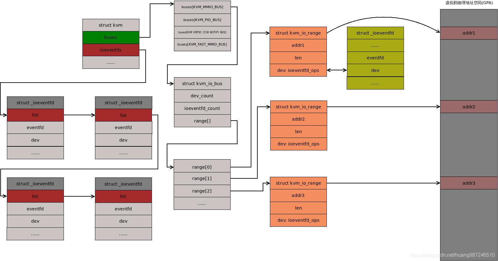
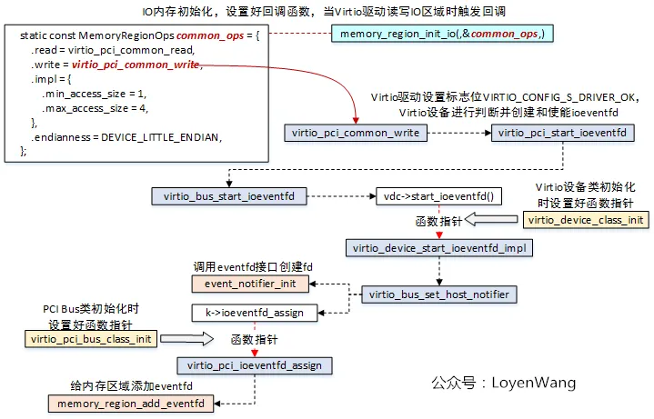
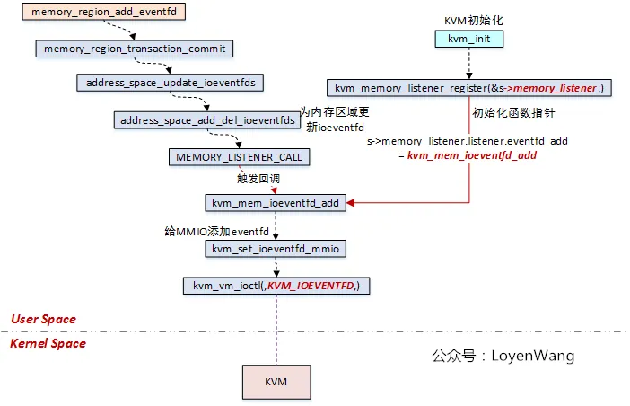
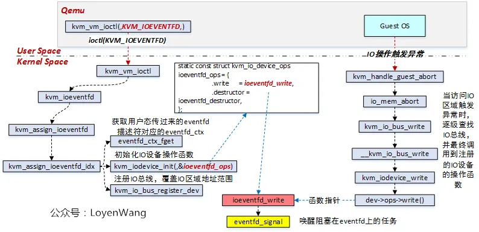
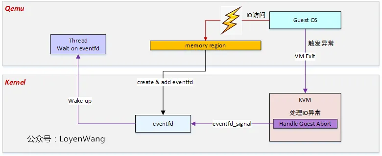

<!-- @import "[TOC]" {cmd="toc" depthFrom=1 depthTo=6 orderedList=false} -->

<!-- code_chunk_output -->

- [1. 背景](#1-背景)
  - [1.1. 同步 IO](#11-同步-io)
  - [1.2. 异步 IO](#12-异步-io)
  - [1.3. ioeventfd](#13-ioeventfd)
- [2. KVM](#2-kvm)
  - [2.1. 数据结构](#21-数据结构)
    - [2.1.1. KVM_IOEVENTFD 命令字](#211-kvm_ioeventfd-命令字)
    - [2.1.2. 用户态结构体 kvm_ioeventfd](#212-用户态结构体-kvm_ioeventfd)
      - [2.1.2.1. 用户态用法](#2121-用户态用法)
    - [2.1.3. 内核态结构体_ioeventfd](#213-内核态结构体_ioeventfd)
    - [2.1.4. 虚拟机 kvm 关联信息](#214-虚拟机-kvm-关联信息)
  - [2.2. 注册流程](#22-注册流程)
  - [2.3. 触发流程](#23-触发流程)
- [3. QEMU](#3-qemu)
  - [3.1. 数据结构](#31-数据结构)
  - [3.2. 注册流程](#32-注册流程)
- [QEMU 侧](#qemu-侧)
- [KVM 侧](#kvm-侧)
- [4. 总结](#4-总结)

<!-- /code_chunk_output -->

# 1. 背景

## 1.1. 同步 IO

传统的 QEMU 设备模拟, 当**虚机**访问到 **pci 的配置空间**或者 **BAR 空间**时:

1) 会触发**缺页异常**而 `VM-Exit`, **kvm** 会进行检查;

2) kvm 发现虚机访问的是用户 **QEMU** 模拟 的**用户态设备的空间**, 这是 IO 操作, 就会退出到用户态交给 QEMU 处理;

3) 由 **QEMU 最终进行分发**并进行处理;

4) IO 完成之后的**原路返回**.

这样的一次路径称为**同步 IO**, 即指 Guest 需要**等待 IO 操作的结果**才能继续运行.

梳理整个流程, 需要经过**两次 cpu 模式切换**:

* 一次是**非根模式**到**根模式**;

* 一次是**内核态**到**用户态**. 原因是**kvm 没有模拟这个设备**, 处理不了这种情况才退出到用户态让 QEMU 处理.

## 1.2. 异步 IO

但存在这样一种情况, 即 guest 中的**某次 IO 操作**只是作为一个**通知事件**, 用于**通知** `QEMU/KVM` 完成**另一个具体的 IO**, 这种情况下没有必要像普通 IO 一样等待数据完全写完, **只需要触发通知**并等待具体 IO 完成即可. 这样也**节省**了一个**内核态到用户态的开销**.

如果以这样的方式实现, 假设虚机所有 IO 操作 kvm 都一股脑儿通知 QEMU, 那 **QEMU** 也**不知道**到底是**哪个设备**需要处理, 所以需要一个东西作为 **QEMU 和 KVM 之间通知的载体**:

1) 当 QEMU 模拟一个设备时, 首先将这个**设备**的**物理地址空间信息**摘出来, 对应关联一个**回调函数**, 然后**传递给 KVM**;

2) 其目的是告知 KVM, 当**虚机内部**有**访问该物理地址空间**的动作时, KVM 调用 QEMU 关联的回调函数**通知 QEMU**, 这样就能实现针对具体物理区间的通知.

3) 这个实现就是 ioeventfd.

## 1.3. ioeventfd

ioeventfd 正是为 IO 提供**通知机制**的东西. ioeventfd 机制为 Guest 提供了向 qemu-kvm 发送通知的快捷通道.

**QEMU** 可以将**虚拟机特定地址**关联一个 **eventfd**, 对该 eventfd 进行 **POLL**, 并利用 `ioctl(KVM_IOEVENTFD)` 向 KVM 注册这段**特定地址**, 当 Guest 进行 IO 操作 exit 到 kvm 后, kvm 可以**判断**本次 exit 是否发生在**这段特定地址**中, 如果是, 则直接调用 `eventfd_signal` 发送信号到**对应的 eventfd**, 导致 QEMU 的监听循环返回, 触发具体的操作函数, 进行普通 IO 操作.

这样的一次 IO 操作相比于不使用 ioeventfd 的 IO 操作, 能**节省**一次在 **QEMU** 中**分发 IO 请求**和**处理 IO 请求**的时间.

ioeventfd 基本原理是基于 eventfd, eventfd 是内核实现的高效**线程通信机制**, 还适合于**内核与用户态的通信**, KVM 模块利用 eventfd 实现了 KVM 和 qemu 的高效通信机制 ioeventfd.

> `Linux\Eventfd\Linux\` 的 `eventfd 机制.md`

分为 KVM 的实现和 qemu 的使用两部分.

# 2. KVM

## 2.1. 数据结构

### 2.1.1. KVM_IOEVENTFD 命令字

ioeventfd 是内核 kvm 模块向 qemu 提供的一个 vm ioctl 命令字 `KVM_IOEVENTFD`, 对应调用 `kvm_vm_ioctl` 函数.

这个命令字的功能是将一个 **eventfd** 绑定到**一段客户机的地址空间**, 这个空间可以是 **mmio**, 也可以是 **pio**.

当 **guest 写**这段地址空间时, 会触发 `EPT_MISCONFIGURATION` **缺页异常**, **KVM** 处理时如果发现这段地址落在了**已注册的 ioeventfd 地址区间**里, 会通过**写**关联 **eventfd** 通知 **qemu**, 从而**节约**一次**内核态到用户态的切换开销**.

### 2.1.2. 用户态结构体 kvm_ioeventfd

描述了一个 ioeventfd 要注册到 kvm 中的所有信息, 其中包含了 ioeventfd 信息和需要注册到 Guest 的总线和设备信息.

**用户态**传入的参数如下:

```cpp
// "include/uapi/linux/kvm.h"
struct kvm_ioeventfd {
    __u64 datamatch;
    __u64 addr;        /* legal pio/mmio address */
    __u32 len;         /* 1, 2, 4, or 8 bytes; or 0 to ignore length */
    __s32 fd;
    __u32 flags;
    __u8  pad[36];
};
```

* datamatch: 如果 flags 设置了 `KVM_IOEVENTFD_FLAG_DATAMATCH`, 只有当**客户机**向 addr 地址**写入的值**与 datamatch 值**相等**, 才会**触发 event**

* fd: eventfd 关联的 fd, `eventfd_ctx` 的结构在初始化时被放在了 file 结构的 `private_data` 中, 首先**通过 fd** 从**进程**的 **fd 表**中可以**找到 file 结构**, 顺藤摸瓜可以找到 `eventfd_ctx`.

#### 2.1.2.1. 用户态用法

**ioeventfd 的用法**是:

1) **用户态**先注册好 **evenfd** 并获得 fd(通过**系统调用** `eventfd2` 或 `eventfd`);

> evenfd(0, 0); flags 是 0, 表示 阻塞非信号量
>
> **阻塞非信号量**: 以非信号量方式创建的 eventfd, 在读 eventfd 之后, 内核的计数器**归零**, 下一次再读就会阻塞, 除非有进程再次写 eventfd.


2) 然后将 fd 和感兴趣的**地址区间**封装成 `kvm_ioeventfd` **结构体**作为**参数**;

3) 最后调用 `ioctl KVM_IOEVENTFD` **命令字**, 注册到 kvm

### 2.1.3. 内核态结构体_ioeventfd

描述 eventfd 和 guest io 地址之间的关联

用户态信息 `kvm_ioeventfd` 需要转化成**内核态存放**, 当 **guest** 写地址时**找到对应的结构体**, 触发 event, ioeventfd **内核态结构体**基于 eventfd, 如下:

```cpp
// "virt/kvm/eventfd.c"
struct _ioeventfd {
    struct list_head     list;
    u64                  addr;
    int                  length;
    struct eventfd_ctx  *eventfd;
    u64                  datamatch;
    struct kvm_io_device dev;
    u8                   bus_idx;
    bool                 wildcard;
};
```

* list: 用于将当前 ioeventfd 链接到 kvm 的所有 ioeventfd 链表中去

* addr: 客户机 `PIO/MMIO` 地址, 当**客户机**向该地址**写**入数据时触发 event

* length: 客户机向该地址写入数据时数据的**长度**, 当 length 为 0 时, **忽略写入数据的长度**

* eventfd: 该 ioeventfd 对应关联的 eventfd

* datamatch: 用户态程序设置的 match data, 当 ioeventfd 被设置了 `KVM_IOEVENTFD_FLAG_DATAMATCH`, 只有满足客户机写入的值等于 datamatch 的条件时才触发 event

* dev: 用于将该 **ioeventfd 与 Guest 关联**起来(通过注册该 dev 到 Guest 实现). `VM-Exit` 退出时调用 `dev->ops` 的 write 操作, 对应 `ioeventfd_write`

* `bus_idx`: 客户机的地址被分为了 4 类, MMIO, PIO, `VIRTIO_CCW_NOTIFY`, `FAST_MMIO`, `bus_idx` 用来区分注册到 kvm 的 MMIO 总线还是 PIO 总线

* wildcard: 与 datamatch 互斥, 如果 datamatch 为 false, 则 wildcard 设为 true

### 2.1.4. 虚拟机 kvm 关联信息

用户态下发 `KVM_IOEVENTFD` 命令字最终会生成 `_ioeventfd` 结构体, 存放在内核中, 由于它是**和一个虚机关联的**, 因此被放到了 kvm 结构体中维护, kvm 结构体中有两个字段, 存放了 ioeventfd 相关的信息, 如下:

```cpp
// "include/linux/kvm_host.h"
struct kvm {
    ......
    struct kvm_io_bus __rcu *buses[KVM_NR_BUSES];
#ifdef CONFIG_HAVE_KVM_EVENTFD
    struct list_head ioeventfds;
#endif
    ......
}

// "include/linux/kvm_host.h"
struct kvm_io_bus {
    int dev_count;
    int ioeventfd_count;
    struct kvm_io_range range[];
};

// "include/linux/kvm_host.h"
enum kvm_bus {
    KVM_MMIO_BUS,
    KVM_PIO_BUS,
    KVM_VIRTIO_CCW_NOTIFY_BUS,
    KVM_FAST_MMIO_BUS,
    KVM_NR_BUSES
};
```

* **buses**: 虚拟机中所有的 **I/O 总线结构体数组**. 总线分为 **4 类**, **每类地址**可以认为有**独立的地址空间**, 它们被抽象成 4 个 bus 上的地址. 分别是 `kvm_bus` 所列出的 MMIO, PIO, `VIRTIO_CCW_NOTIFY`, `FAST_MMIO`. MMIO 和 `FAST_MMIO` 的区别是, MMIO 需要**检查**写入地址的**值长度**是否和 ioeventfd 指定的长度相等, `FAST_MMIO` 不需要检查. ioeventfd 的地址信息被放在 `kvm_io_bus` 的 range 中;
* ioeventfds: ioeventfd 的整个信息通过 list 成员被链接到了 ioeventfds 中

相关数据结构之间的关系:



## 2.2. 注册流程

```cpp

kvm_vm_ioctl() -> (case KVM_IOEVENTFD) -> kvm_ioeventfd() -> kvm_assign_ioeventfd()
```

整个 KVM 注册 ioeventfd 流程:

1) 将一个 **ioeventfd** 与一个**虚拟设备** dev 联系起来

2) 该虚拟设备 dev 拥有写函数

3) 当 Guest 访问 ioeventfd 对应的 io 地址时, 则调用虚拟设备的 write 方法

`KVM_IOEVENTFD` ioctl **命令字**的主要功能是在 kvm 上注册这个 ioevent, **最终目的**是将 **ioevenfd 信息**添加到 **kvm 结构**的 **buses** 和 **ioeventfds** 两个成员中.

在 QEMU 调用了 `kvm_vm_ioctl(KVM_IOEVENTFD)` 之后, kvm 会对该 ioctl 做出反应.

```cpp
// virt/kvm/kvm_main.c
kvm_vm_ioctl
=> case KVM_IOEVENTFD:
{
    copy_from_user(&data, argp, sizeof(data))
    kvm_ioeventfd(kvm, &data)
}
```

kvm 在获得了 QEMU 传入的参数, 也就是 `struct kvm_ioeventfd` 结构的值之后, 会调用 `kvm_ioeventfd` 函数, 原型如下:

```cpp
// "include/linux/kvm_host.h"
int kvm_ioeventfd(struct kvm *kvm, struct kvm_ioeventfd *args);

// virt/kvm/eventfd.c
int kvm_ioeventfd(struct kvm *kvm, struct kvm_ioeventfd *args)
{
    if (args->flags & KVM_IOEVENTFD_FLAG_DEASSIGN)
        return kvm_deassign_ioeventfd(kvm, args);

    return kvm_assign_ioeventfd(kvm, args);
}

```

判断 `flags` 中是否含有 `KVM_IOEVENTFD_FLAG_DEASSIGN`,

* 如果有则调用解除 io 地址和 ioeventfd 关联的函数: `kvm_deassign_ioeventfd()`;

* 如果没有, 则调用将 io 地址和 ioeventfd 关联起来的函数: `kvm_assign_ioeventfd()`

```cpp
// "virt/kvm/eventfd.c"
static int
kvm_assign_ioeventfd(struct kvm *kvm, struct kvm_ioeventfd *args)
{
    enum kvm_bus bus_idx;
    ......
    bus_idx = ioeventfd_bus_from_flags(args->flags); /* 1 */
    ret = kvm_assign_ioeventfd_idx(kvm, bus_idx, args); /* 2 */
    ......
```

* 1: 首先从 `kvm_ioeventfd->flags` 中提取出该 eventfd 是 MMIO 还是 PIO,  找到总线索引 `bus_idx`, 方便在 `kvm->buses` 数组中找到 `kvm_io_bus` 结构

* 2: 进行**实际关联**: 注册 ioeventfd, 将用户态的信息拆解, 封装成内核态的 `kvm_io_bus` 和 `_ioeventfd` 结构, 保存到 kvm 结构体的对应成员

跟踪 `kvm_assign_ioeventfd_idx` 主要流程:

```cpp
// "virt/kvm/eventfd.c"
static int kvm_assign_ioeventfd_idx(struct kvm *kvm,
                enum kvm_bus bus_idx,
                struct kvm_ioeventfd *args)
{
    struct eventfd_ctx *eventfd;
    struct _ioeventfd *p;
    ......
    eventfd = eventfd_ctx_fdget(args->fd); /* 1 */
    p = kzalloc(sizeof(*p), GFP_KERNEL_ACCOUNT); /* 2 */
    INIT_LIST_HEAD(&p->list);
    p->addr    = args->addr;
    p->bus_idx = bus_idx;
    p->length  = args->len;
    p->eventfd = eventfd;

    /* The datamatch feature is optional, otherwise this is a wildcard */
    if (args->flags & KVM_IOEVENTFD_FLAG_DATAMATCH) /* 3 */
        p->datamatch = args->datamatch;
    else
        p->wildcard = true;

    /* Verify that there isn't a match already */
    if (ioeventfd_check_collision(kvm, p)) { /* 4 */
        ret = -EEXIST;
        goto unlock_fail;
    }

    kvm_iodevice_init(&p->dev, &ioeventfd_ops); /* 5 */
    kvm_io_bus_register_dev(kvm, bus_idx, p->addr, p->length, &p->dev); /* 6 */
    kvm_get_bus(kvm, bus_idx)->ioeventfd_count++; /* 7 */
    list_add_tail(&p->list, &kvm->ioeventfds); /* 8 */
    ......
}
```

1: 根据 fd 从进程的描述符表中找到 struct file 结构, 从 `file->private_data` 取出 `eventfd_ctx`, 即内核态的 eventfd

2: 分配 `_ioeventfd` 结构 p, 使用用户态传入的 `kvm_ioeventfd` 进行**初始化**

3: 判断 `kvm_ioeventfd` 结构中的 flags 是否含有 datamatch, 如果有, 则置 `p->datamatch` 为 true

4: 判断本次与地址关联的 ioeventfd 是否之前存在

5: 初始化 `_ioeventfd` 中的 `kvm_io_device` 设备成员, 并设置该设备的 IO 操作**钩子函数**. 当虚机**写内存缺页**时, KVM 首先尝试触发 `p->dev` 中的 **write** 函数, 检查缺页地址是否满足 ioeventfd 触发条件

6: 将 `_ioevetfd` 结构中的 kvm_io_device 设备注册到 Guest 上. 将 `_ioeventfd` 中的**地址信息**和**钩子函数**封装成 `kvm_io_range`, 放到 `kvm->buses` 的 `range[]` 数组中. 之后 kvm 在处理缺页就**可以查询**到缺页地址是否在已注册的 `ioeventfd` 的地址区间

7: 更新 ioeventfd 的计数

8: 将 ioeventfd 放到 kvm 的 ioeventfds **链表**中, 维护起来

```cpp
static const struct kvm_io_device_ops ioeventfd_ops = {
    .write      = ioeventfd_write,
    .destructor = ioeventfd_destructor,
};
```

需要注意的是, ioeventfd 对应的文件操作**只有 write 操作**, 而**没有 read 操作**.

write 操作/OUT 类指令 只是简单向外部输出数据, 无需等待 QEMU 处理完成即可继续运行 Guest, 但 read 操作/IN 类指令 需要从外部获取数据, 必须要等待 QEMU 处理完成 IO 请求再继续运行 Guest.

ioeventfd 设计的初衷就是节省 Guest 运行 write 操作/OUT 类指令 时的时间, read 操作/IN 类指令 执行时间无法节省, 因此这里的 ioeventfd 文件操作中只有 write 而没有 read.

## 2.3. 触发流程

当虚拟机向注册了 ioeventfd 的地址写数据时, 会产生 vmexit.

当 kvm 检查 `VM-Exit` 退出原因, 如果是缺页引起的退出并且原因是 `EPT misconfiguration`, 首先检查缺页的**物理地址**是否落在已注册 **ioeventfd** 的物理区间, 如果是, 调用对应区间的 write 函数. 虚机触发缺页的流程如下:

```cpp
vmx_handle_exit
    kvm_vmx_exit_handlers[exit_reason](vcpu)
        handle_ept_misconfig
```

缺页流程处理函数:

```cpp
// "arch/x86/kvm/vmx/vmx.c"
static int handle_ept_misconfig(struct kvm_vcpu *vcpu)
{
    gpa_t gpa;
    // 第一
    gpa = vmcs_read64(GUEST_PHYSICAL_ADDRESS); /* 1 */
    // 第二
    if (!is_guest_mode(vcpu) &&
        !kvm_io_bus_write(vcpu, KVM_FAST_MMIO_BUS, gpa, 0, NULL)) { /* 2 */
        trace_kvm_fast_mmio(gpa);
        return kvm_skip_emulated_instruction(vcpu);
    }
    // 第三
    return kvm_mmu_page_fault(vcpu, gpa, PFERR_RSVD_MASK, NULL, 0); /* 3 */
}
```

第一. 从 VMCS 结构中读取引发缺页的虚机物理地址

第二. 首先尝试**触发 ioeventfd**, 如果成功, eventfd 会通知用户态 qemu, 因此不需要退到用户态, 触发 ioeventfd 之后再次进入客户态就行了

第三. 如果引发缺页的地址不在 ioeventfd 监听范围内, 进行缺页处理, 这里的实现我们跳过, 重点分析触发 ioeventfd 的情形

分析如何触发 eventfd 流程:

```cpp
// "virt/kvm/kvm_main.c"
int kvm_io_bus_write(struct kvm_vcpu *vcpu, enum kvm_bus bus_idx, gpa_t addr,
             int len, const void *val)
{
    struct kvm_io_bus *bus;
    struct kvm_io_range range;

    range = (struct kvm_io_range) { /* 4 */
        .addr = addr,
        .len = len,
    };

    bus = srcu_dereference(vcpu->kvm->buses[bus_idx], &vcpu->kvm->srcu); /* 5 */
    r = __kvm_io_bus_write(vcpu, bus, &range, val); /* 6 */
    ......
}
EXPORT_SYMBOL_GPL(kvm_io_bus_write);
```

4: 将引发缺页的**虚拟机物理地址**和**长度**封装成 `kvm_io_range` 格式, 方便与以在总线上注册的 range 进行对比

5: 找到该虚拟机 mmio 类型的**地址总线**, 这个总线上记录这**所有**在该总线上注册的 ioeventfd 的**地址区间**

6: **对比**总线上的**地址区间**和引发缺页的物理地址区间, 如果缺页地址区间**落在**的总线上的地址区间里, 调用**对应的 write 函数**触发 eventfd

```cpp
// virt/kvm/kvm_main.c
static int __kvm_io_bus_write(struct kvm_vcpu *vcpu, struct kvm_io_bus *bus,
                  struct kvm_io_range *range, const void *val)
{
    int idx;

    idx = kvm_io_bus_get_first_dev(bus, range->addr, range->len); /* 1 */
    if (idx < 0)
        return -EOPNOTSUPP;

    while (idx < bus->dev_count &&
        kvm_io_bus_cmp(range, &bus->range[idx]) == 0) {
        if (!kvm_iodevice_write(vcpu, bus->range[idx].dev, range->addr,
                    range->len, val))
            return idx;
        idx++;
    }

    return -EOPNOTSUPP;
}
```

1: 用于获得 bus 上由 `kvm_io_range` 指定的具体**地址和长度范围内**的**第一个设备**的 id

2: 然后在 bus 的这个**地址范围内**, 针对**每一个设备**调用 `kvm_iodevice_write`, 该函数会调用**每个设备**之前注册好的 `kvm_io_device_ops` 操作函数 `kvm_io_device->write()` 触发 eventfd, 对于 ioeventfd "设备"来说, 就是 `ioeventfd_write`

```cpp
// "virt/kvm/eventfd.c"
//
/* MMIO/PIO writes trigger an event if the addr/val match */
static int ioeventfd_write(struct kvm_vcpu *vcpu, struct kvm_io_device *this, gpa_t addr,
        int len, const void *val)
{
    struct _ioeventfd *p = to_ioeventfd(this); /* 7 */

    if (!ioeventfd_in_range(p, addr, len, val)) /* 8 */
        return -EOPNOTSUPP;

    eventfd_signal(p->eventfd, 1); /* 9 */
    return 0;
}
```

7: 根据从 bus 总线上取下的 `range[]`, 取出其 dev 成员, 由于 dev 结构体是 `_ioeventfd` 的一个成员, 通过 container 转化可以取出 `_ioeventfd`

8: 检查缺页**物理地址**和 range 中**注册的地址**是否匹配

9: 取出 `_ioeventfd` 中的 `eventfd_ctx` 结构体, 调用 `eventfd_signal` 往它维护的**计数器中加 1**, 触发一次 POLLIN 事件

`eventfd_signal` 实现如下:

```cpp
// "fs/eventfd.c"
//
/**
 * eventfd_signal - Adds @n to the eventfd counter.
 * @ctx: [in] Pointer to the eventfd context.
 * @n: [in] Value of the counter to be added to the eventfd internal counter.
 *          The value cannot be negative.
 *
 * This function is supposed to be called by the kernel in paths that do not
 * allow sleeping. In this function we allow the counter to reach the ULLONG_MAX
 * value, and we signal this as overflow condition by returning a EPOLLERR
 * to poll(2).
 *
 * Returns the amount by which the counter was incremented.  This will be less
 * than @n if the counter has overflowed.
 */
__u64 eventfd_signal(struct eventfd_ctx *ctx, __u64 n)
{
    ......
    current->in_eventfd_signal = 1;
    if (ULLONG_MAX - ctx->count < n) /* 10 */
        n = ULLONG_MAX - ctx->count;
    ctx->count += n; /* 11 */
    if (waitqueue_active(&ctx->wqh)) /* 12 */
        wake_up_locked_poll(&ctx->wqh, EPOLLIN);
    current->in_eventfd_signal = 0;
    ......
}
EXPORT_SYMBOL_GPL(eventfd_signal);
```

10: 首先判断下**计数器**是否即将**溢出**. 如果计数器加上 1 之后溢出了, 让计数器直接等于最大值, 内核态写 eventfd 与用户态有所区别, 它**不允许阻塞**, 因此当计数器溢出时直接设置其为**最大值**

11: 增加计数器的值

12: **唤醒**阻塞在 eventfd 上的**读线程**, 如果计数器原来为 0, 有读线程阻塞在这个 eventfd 上, 那么此时计数器加 1 后, 就可以唤醒这些线程

如果 QEMU 有对该 eventfd 的检测, 便会在 QEMU 中进行本次 IO 的处理, 与此同时, kvm 中的 `handle_ept_misconfig` 会返回 0, 表示成功完成了 IO 请求

# 3. QEMU

## 3.1. 数据结构

以 virtio 磁盘为例, virtio 磁盘是一个 pci 设备, 它有 **pci 空间**, 这些空间的内存都是 QEMU 模拟的, 当虚机**写**这些 pci 空间时, QEMU 需要做对应的处理, 在 virtio 磁盘**初始化成功**后, 它就会将自己的**地址空间信息提取出来**, 封装成 **ioeventfd**, 通过 `ioctl` **命令字**传递给 KVM, **ioeventfd** 中包含一个 QEMU 提前通过 **eventfd** 创建好的 fd, KVM 通知 QEMU 是就往这个 fd 中写 1. 以下就是这个 ioeventfd 的结构, 具体含义见前面的分析.

```cpp
// linux-headers/linux/kvm.h
struct kvm_ioeventfd {
    __u64 datamatch;
    __u64 addr;        /* legal pio/mmio address */
    __u32 len;         /* 1, 2, 4, or 8 bytes; or 0 to ignore length */
    __s32 fd;
    __u32 flags;
    __u8  pad[36];
};
```

QEMU 是通过 **MemoryRegion** 来进行**虚机内存管理**的, **一个 MR** 可以对应**一段虚机的内存区间**, MR 结构中有**两个成员**与 ioeventfd 相关:

```cpp
// include/exec/memory.h
struct MemoryRegion {
    ......
    unsigned ioeventfd_nb; /* 1 */
    MemoryRegionIoeventfd *ioeventfds; /* 1 */
    ......
}
```

* 1: 表示 **MR 对应的地址区间**中有**多少个 ioeventfd**
* 2: MR 中包含的 **ioeventfds 数组**, 每注册一个 ioeventfd, 不只 KVM 会有记录, QEMU 也会有记录

`MemoryRegionIoeventfd` 具体结构如下:

```cpp
// softmmu/memory.c
struct MemoryRegionIoeventfd {
    AddrRange addr; /* 3 */
    bool match_data; /* 4 */
    uint64_t data;
    EventNotifier *e; /* 5 */
};
```

* 3: **虚机物理地址空间**(GPA), 用户告知 KVM, 当虚机写这个空间时通知 QEMU
* 4: 是否匹配写入的值, 如果 `match_data` 这个为真, 只有当写入 addr 地址的值为 data 时, KVM 才通知 QEMU
* 5: 当满足上面的所有条件后, KVM 通过增加 `EventNotifier->wfd` 对应的内核计数器, 通知 QEMU

## 3.2. 注册流程

**ioeventfd 的用法**是:

1) **用户态**先注册好 **evenfd** 并获得 fd(通过 `linux-gnu` 的 eventfd 接口(`#include <sys/eventfd.h>`));

> evenfd(0, 0); flags 是 0, 表示 阻塞非信号量
>
> **阻塞非信号量**: 以非信号量方式创建的 eventfd, 在读 eventfd 之后, 内核的计数器**归零**, 下一次再读就会阻塞, 除非有进程再次写 eventfd.


2) 然后将 fd 和感兴趣的**地址区间**封装成 `kvm_ioeventfd` **结构体**作为**参数**;

3) 最后调用 `ioctl KVM_IOEVENTFD` **命令字**, 注册到 kvm


QEMU 注册 ioeventfd 的时间点是在 virtio 磁盘**驱动初始化成功之后**, 流程如下:

```cpp
// hw/virtio/virtio-pci.c
static void virtio_ioport_write(void *opaque, uint32_t addr, uint32_t val)
{
    switch (addr) {
    case VIRTIO_PCI_STATUS:
        /* 前端驱动想 device_status 字段写入 DRIVER_OK, 表明驱动初始化完成 */
        if (val & VIRTIO_CONFIG_S_DRIVER_OK) {
            virtio_pci_start_ioeventfd(proxy);
        }
      ......
}
```

`virtio_pci_start_ioeventfd` 之后走到`virtio_blk_data_plane_start`, 这个函数会针对 virtio 磁盘的**每个队列**都设置**一个 ioeventfd**, 从这里可以看出, virtio 数据到达的通知针对每个队列都是独立的:

```cpp
virtio_pci_start_ioeventfd
    virtio_bus_start_ioeventfd(&proxy->bus)
        vdc->start_ioeventfd(vdev)
            vdc->start_ioeventfd = virtio_blk_data_plane_start

// "hw/block/dataplane/virtio-blk.c"
int virtio_blk_data_plane_start(VirtIODevice *vdev)
{
    ......
     /* Set up virtqueue notify */
    for (i = 0; i < nvqs; i++) { /* 为 virtio 磁盘的每个队列都设置一个 ioeventfd */
        r = virtio_bus_set_host_notifier(VIRTIO_BUS(qbus), i, true);
    }
    ......
}
```

`virtio_bus_set_host_notifier` 具体实现如下:

```cpp
// hw/virtio/virtio-bus.c
int virtio_bus_set_host_notifier(VirtioBusState *bus, int n, bool assign)
{
    ......
    EventNotifier *notifier = virtio_queue_get_host_notifier(vq); /* 1 */
    r = event_notifier_init(notifier, 1); /* 2 */
    k->ioeventfd_assign(proxy, notifier, n, true); /* 3 */
    ......
}

// include/qemu/event_notifier.h
struct EventNotifier {
#ifdef _WIN32
    HANDLE event;
#else
    int rfd;
    int wfd;
    bool initialized;
#endif
};
```

1: **每个 virtio 队列**关联**一个 eventfd**, eventfd 的 **fd** 被**存放**到 `VirtQueue->host_notifier` 中, 这里把它**取出来**, 用于初始化并传递给 KVM

2: 初始化 **EventNotifier**, 将 **eventfd** 对应的**计数器设置为 1**

3: 注册 ioeventfd, 最终会通过 ioctl **命令字** `KVM_IOEVENTFD` 注册到 KVM

QEMU 进行 ioeventfd 注册的时候需要一个 EventNotifier, 该 EventNotifier 由 `event_notifier_init()` 初始化, `event_notifier_init` 中**判断系统**是否支持 **EVENTFD** 机制, 如果支持, 那么 EventNotifier 中的 rfd 和 wfd 相等, 均为 eventfd()系统调用返回的新建的 fd, 并根据 `event_notifier_init` 收到的参数 active 决定是否唤醒 POLLIN 事件, 即直接触发 `eventfd`/`EventNotifer` 对应的 handler. 如果系统不支持 EVENTFD 机制, 则 QEMU 会利用 pipe 模拟 eventfd, 略过.

**ioeventfd** 关联一段**内存空间**, 由于 QEMU 每有**地址空间变化**, 都会影响全部的地址空间, QEMU 要**统一更新地址空间的视图**, 包括 **flatview** 和 **ioeventfd** 的更新. 在注册了 EventNotifier 之后, 需要将 EventNotifier 中含有的 `fd(ioeventfd)` 与对应的 Guest IO 地址关联起来. `ioeventfd_assign` 对应 `virtio_pci_ioeventfd_assign`, 流程如下:

```cpp
virtio_pci_ioeventfd_assign
    memory_region_add_eventfd

// softmmu/memory.c
void memory_region_add_eventfd(MemoryRegion *mr,
                               hwaddr addr,
                               unsigned size,
                               bool match_data,
                               uint64_t data,
                               EventNotifier *e)
{
    ......
    MemoryRegionIoeventfd mrfd = { /* 4 */
        .addr.start = int128_make64(addr),
        .addr.size = int128_make64(size),
        .match_data = match_data,
        .data = data,
        .e = e,
    };
    ......
    memory_region_transaction_begin();
    for (i = 0; i < mr->ioeventfd_nb; ++i) {
        if (memory_region_ioeventfd_before(&mrfd, &mr->ioeventfds[i])) { /* 5 */
            break;
        }
    }
    ++mr->ioeventfd_nb;
    mr->ioeventfds = g_realloc(mr->ioeventfds, /* 6 */
                                  sizeof(*mr->ioeventfds) * mr->ioeventfd_nb);
    memmove(&mr->ioeventfds[i+1], &mr->ioeventfds[i], /* 7 */
            sizeof(*mr->ioeventfds) * (mr->ioeventfd_nb-1 - i));
    mr->ioeventfds[i] = mrfd; /* 8 */
    ioeventfd_update_pending |= mr->enabled; /* 9 */
    memory_region_transaction_commit(); /* 10 */
    ......
}
```

函数参数如下:
* mr: 指 IO 地址所在的 MemoryRegion
* addr: 表示 IO 地址(GPA)
* size: 表示 IO 地址的大小
* match_data: bool 值, 表示的是 Guest 向 addr 写入的值是否要与参数 data 完全一致才让 KVM 走 ioeventfd 路径, 如果 `match_data` 为 true, 那么需要完全一致才让 KVM 走 ioeventfd 路径, 如果为 false. 则不需要完全一致.
* data: 与 `match_data` 共同作用, 用于限制 Guest 向 addr 写入的值
* e: 指前面注册的 EventNotifier

4: 封装地址信息

5: 寻找本次要处理的 ioeventfd 应该在 ioeventfd 数组中的什么位置

6: 分配原 ioeventfd 数组大小 +1 的空间, 用于将新的 ioeventfd 插入到 ioeventfd 数组中

7: 将第一步找到的位置之后的 ioeventfd 从 ioeventfd 数组中后移一位

8: 将新的 ioeventfd 插入到 MemoryRegion 的 ioeventfds 数组中

9: 设置 `ioeventfd_update_pending`

9: 检查根 MR 下面的每个子 MR, 搜集所有的 ioeventfd, 统一注册

MemoryRegion 中有很多 ioeventfd, 他们**以地址从小到大的顺序**排列, `ioeventfd_nb` 是 MemoryRegion 中 ioeventfd 的数量, 通过 for 循环找到本次要添加的 ioeventfd 应该放在 ioeventfd 数组中的什么位置, 为 ioeventfd 数组分配 `原大小+sizeof(ioeventfd)` 的空间, 然后将之前找到的 ioeventfd 数组中位置之后的 ioeventfd 向后移动一个位置, 然后将新的 ioeventfd 插入到 ioeventfd 数组中. 最后设置 ioevetfd_update_pending 标志, 调用 `memory_region_transaction_commit` 更新 KVM 中的 ioeventfd 布局.

`memory_region_transaction_commit` 最终走到系统调用, 下发 ioctl 命令字给 KVM, 注册 ioeventfd

```cpp
memory_region_transaction_commit
    address_space_update_ioeventfds
        address_space_add_del_ioeventfds
            MEMORY_LISTENER_CALL(as, eventfd_add, Reverse, &section, fd->match_data, fd->data, fd->e);
                kvm_io_ioeventfd_add
                    kvm_set_ioeventfd_pio
                        kvm_vm_ioctl(kvm_state, KVM_IOEVENTFD, &kick)
```

即 `memory_region_add_eventfd` 最终会调用 `memory_region_transaction_commit`, 而后者会调用 `eventfd_add` 函数, 该 `eventfd_add` 函数在 qemu 中的定义如下:

```cpp
// PIO
static MemoryListener kvm_io_listener = {
    .eventfd_add = kvm_io_ioeventfd_add,
    .eventfd_del = kvm_io_ioeventfd_del,
    .priority = 10,
};

// MMIO
if (kvm_eventfds_allowed) {
    s->memory_listener.listener.eventfd_add = kvm_mem_ioeventfd_add;
```

对于 MMIO 和 PIO, 最终调用的 `eventfd_add` 函数不同, MMIO 对应的是 `kvm_mem_ioeventfd_add`, 而 PIO 调用的是 `kvm_io_ioeventfd_add`. KVM 对 MMIO 和 PIO 注册的 ioeventfd 进行分辨, 靠的是在调用 `kvm_vm_ioctl(kvm_state, KVM_IOEVENTFD, &iofd)` 中的 `iofd->flags` 进行辨认, 如果 flag 为 0, 则为 MMIO, 如果 flag 为 2, 则为 PIO.

接下来分别看这两个不同的 `eventfd_add` 函数.

kvm_io_ioeventfd_add

```cpp
kvm_io_ioeventfd_add
=> fd = event_notifier_get_fd(e) // 获取之前注册的 EventNotifier 中的 eventfd 的 fd
=> kvm_set_ioeventfd_pio(fd, section->offset_within_address_space,
              data, true, int128_get64(section->size),match_data);
   => // 定义一个 kvm_ioeventfd 结构类型变量 kick, 将要注册的 ioeventfd 的 data_match,io 地址, flags(MMIO/PIO),io 地址范围, fd 填充进去
   => // 确定 flags 中是否要设置 KVM_IOEVENTFD_FLAG_DATAMATCH, 表明需要全匹配才让 kvm 走 irqfd 路径
   => // 确定 flags 中是否要设置 KVM_IOEVENTFD_FLAG_DEASSIGN, 该 flag 在 ioctl 后告知 kvm, 需要将某地址和该 ioeventfd 解除关联
   => kvm_vm_ioctl(kvm_state, KVM_IOEVENTFD, &kick) // 将 ioeventfd 注册进 kvm

```

`kvm_io_ioeventfd_add` 的逻辑很简单, 就是先获取本次要注册到 kvm 的 ioeventfd 的相关信息, 然后调用 ioctl 注册进 kvm.

kvm_mem_ioeventfd_add

```cpp
kvm_mem_ioeventfd_add
=> fd = event_notifier_get_fd(e) // 获取之前注册的 EventNotifier 中的 eventfd 的 fd
=> kvm_set_ioeventfd_mmio(fd, section->offset_within_address_space,
               data, true, int128_get64(section->size),match_data);
   => // 定义一个 kvm_ioeventfd 结构类型变量 iofd, 将要注册的 ioeventfd 的 data_match,io 地址, flags(MMIO/PIO),io 地址范围, fd 填充进去
   => // 确定 flags 中是否要设置 KVM_IOEVENTFD_FLAG_DATAMATCH, 表明需要全匹配才让 kvm 走 irqfd 路径
   => // 确定 flags 中是否要设置 KVM_IOEVENTFD_FLAG_DEASSIGN, 该 flag 在 ioctl 后告知 kvm, 需要将某地址和该 ioeventfd 解除关联
   => kvm_vm_ioctl(kvm_state, KVM_IOEVENTFD, &iofd);// 将 ioeventfd 注册进 kvm
```

可以看到, `kvm_mem_ioeventfd_add` 与 `kvm_io_ioeventfd_add` 的处理步骤几乎完全一样, 只是在 `kvm_ioeventfd` 结构中将 flags 置为 0, 标志这是一个 MMIO ioeventfd 注册.


# QEMU 侧

以 PCI 设备为例:



* Qemu 中模拟PCI设备时, 在初始化过程中会调用memory_region_init_io来进行IO内存空间初始化, 这个过程中会绑定内存区域的回调函数集, 当Guest OS访问这个IO区域时, 可能触发这些回调函数的调用;

* Guest OS中的Virtio驱动配置完成后会将状态位置上VIRTIO_CONFIG_S_DRIVER_OK, 此时Qemu中的操作函数调用virtio_pci_common_write, 并按图中的调用流逐级往下;

* event_notifier_init: 完成eventfd的创建工作, 它实际上就是调用系统调用eventfd()的接口, 得到对应的文件描述符;

* memory_region_add_eventfd: 为内存区域添加eventfd, 将eventfd和对应的内存区域关联起来;

看一下memory_region_add_eventfd的流程:



* 内存区域MemoryRegion中的ioeventfds成员按照地址从小到大排序, memory_region_add_eventfd函数会选择合适的位置将ioeventfds插入, 并提交更新;

* 提交更新过程中最终触发回调函数kvm_mem_ioeventfd_add的执行, 这个函数指针的初始化是在Qemu进行kvm_init时, 针对不同类型的内存区域注册了对应的memory_listener用于监听变化;

* kvm_vm_ioctl: 向KVM注册ioeventfd;


`Virtualization\2. 核心组件\3. QEMU\3. 基本机制\1. 事件循环机制\2. QEMU中的事件循环机制.md`

qemu_main_loop -> main_loop_wait -> os_host_main_loop_wait ->

* `glib_pollfds_fill()`, 收集所有需要监听的 fd

* `qemu_poll_ns()`, 监听所有文件的事件

* `glib_pollfds_poll()`, 事件的分发处理

Qemu中完成了初始化后, 任务就转移到了KVM中.

# KVM 侧

KVM 中的 ioeventfd注册如下:



KVM中注册ioeventfd的核心函数为kvm_assign_ioeventfd_idx, 该函数中主要工作包括:

1) 根据用户空间传递过来的fd获取到内核中对应的struct eventfd_ctx结构体上下文;

2) 使用ioeventfd_ops操作函数集来初始化IO设备操作;

3) 向KVM注册IO总线, 比如KVM_MMIO_BUS, 注册了一段IO地址区域, 当操作这段区域的时候出发对应的操作函数回调;

当Guest OS中进行IO操作时, 触发VM异常退出, KVM进行捕获处理, 最终调用注册的ioevnetfd_write, 在该函数中调用 eventfd_signal 唤醒阻塞在eventfd上的任务, Qemu和KVM完成了闭环;

总体效果如下图:



# 4. 总结

整个 ioeventfd 的逻辑流程如下:

1) QEMU 分配一个 eventfd, 并将该 eventfd 加入 KVM 维护的 eventfd 数组中
2) QEMU 向 KVM 发送更新 eventfd 数组内容的请求
3) QEMU 构造一个包含 IO 地址, IO 地址范围等元素的 ioeventfd 结构, 并向 KVM 发送注册 ioeventfd 请求
4) KVM 根据传入的 ioeventfd 参数内容确定该段 IO 地址所属的总线, 并在该总线上注册一个 ioeventfd 虚拟设备, 该虚拟设备的 write 方法也被注册
5) Guest 执行 OUT 类指令(包括 MMIO Write 操作)
6) VMEXIT 到 KVM
7) 调用虚拟设备的 write 方法
8) write 方法中检查本次 OUT 类指令访问的 IO 地址和范围是否符合 ioeventfd 设置的要求
9) 如果符合则调用 eventfd_signal 触发一次 POLLIN 事件并返回 QEMU
10) QEMU 监测到 ioeventfd 上出现了 POLLIN, 则调用相应的处理函数处理 IO


