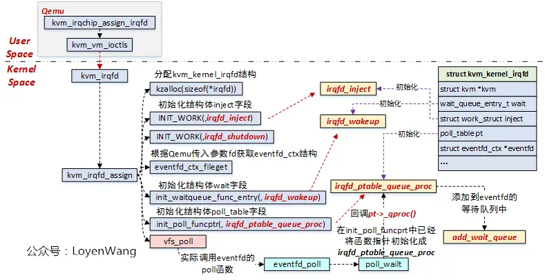
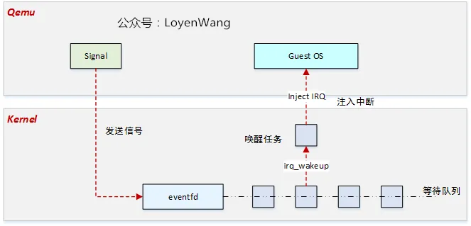
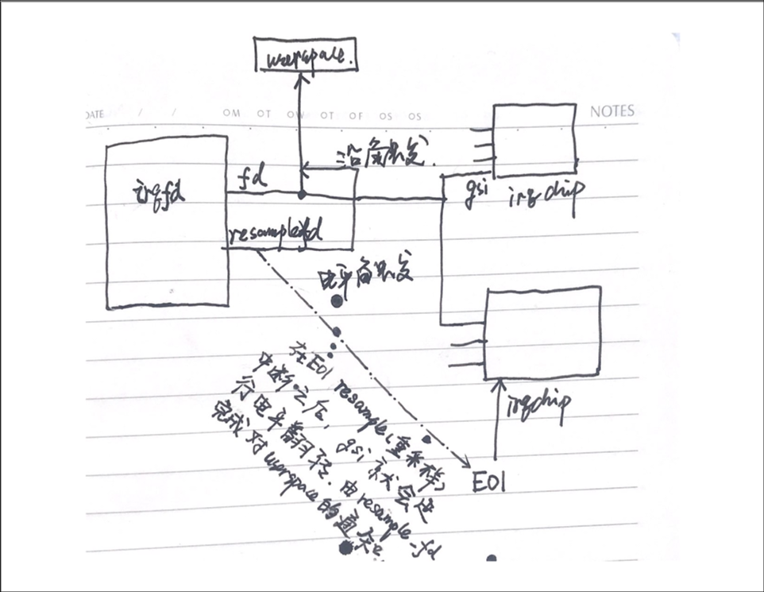
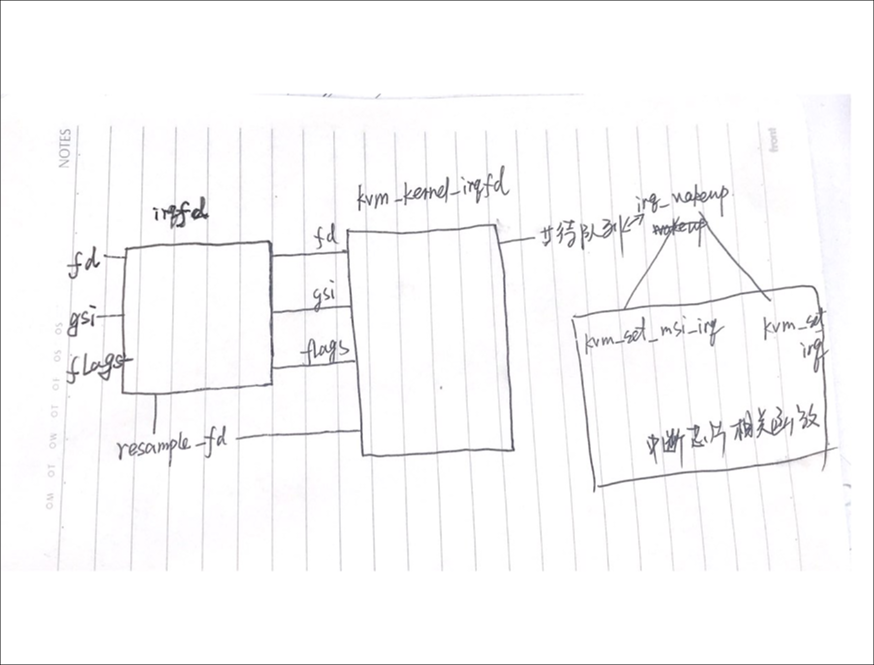

<!-- @import "[TOC]" {cmd="toc" depthFrom=1 depthTo=6 orderedList=false} -->

<!-- code_chunk_output -->

- [1. 介绍](#1-介绍)
- [综述](#综述)
- [2. QEMU 获取 eventfd](#2-qemu-获取-eventfd)
- [3. 向 kvm 发送注册中断 irqfd 请求](#3-向-kvm-发送注册中断-irqfd-请求)
- [4. kvm 注册 irqfd](#4-kvm-注册-irqfd)
- [5. 总结](#5-总结)
- [6. reference](#6-reference)

<!-- /code_chunk_output -->

# 1. 介绍

irqfd 机制与 ioeventfd 机制类似, 其基本原理都是基于 eventfd.

> Linux\Eventfd\

ioeventfd 机制为 Guest 提供了向 qemu-kvm 发送通知的快捷通道, 对应地, irqfd 机制提供了 qemu-kvm 向 Guest 发送通知的快捷通道.

irqfd 机制将一个 **eventfd** 与**一个全局中断号**联系起来, 当**向这个 eventfd 发送信号**时, 就会导致对应的**中断注入到虚拟机**中.

# 综述

Qemu 和 KVM 中的流程如下图:



1) Qemu 中通过 `kvm_irqchip_assign_irqfd` 向 KVM 申请注册 irqfd;

2) 在 KVM 中, 内核通过维护 `struct kvm_kernel_irqfd` 结构体来管理整个 irqfd 的流程;

3) `kvm_irqfd_assign`:

* 分配 `struct kvm_kernel_irqfd` 结构体, 并进行各个字段的初始化;

* 初始化**工作队列任务**, 设置成 `irqfd_inject`, 用于向 Guest OS 注入虚拟中断;

* 初始化**等待队列**的唤醒函数, 设置成 `irqfd_wakeup`, 当**任务被唤醒**时执行, 在该函数中会去**调度工作任务** `irqfd_inject`;

* 初始化 `struct poll_table pt` 字段的处理函数, 设置成 `irqfd_ptable_queue_proc`, 该函数实际是调用 `add_wait_queue` 将**任务**添加至 `eventfd` 的**等待队列**中, 这个过程是在 `vfs_poll` 中完成的;

4) 当 **Qemu** 通过 irqfd 机制**发送信号**时, 将唤醒睡眠在 eventfd 上的任务, 唤醒后执行 `irqfd_wakeup` 函数, 在该函数中调度任务, 调用 `irqfd_inject` 来注入中断;

总体效果如下:



# 2. QEMU 获取 eventfd

> eventfd(0, 0)

与 ioeventfd 类似, irqfd 在使用前必须先初始化一个 EventNotifier 对象(利用 `event_notifier_init` 函数初始化), 初始化 EventNotifier 对象完成之后获得了一个 **eventfd**.

# 3. 向 kvm 发送注册中断 irqfd 请求

获得一个 eventfd 之后, QEMU 通过 `kvm_irqchip_add_irqfd_notifier_gsi => kvm_irqchip_assign_irqfd` 构造 `kvm_irqchip` 结构, 并向 kvm 发送 `ioctl(KVM_IRQFD)`.

```cpp
static int kvm_irqchip_assign_irqfd(KVMState *s, int fd, int rfd, int virq,
                                    bool assign)
{
    struct kvm_irqfd irqfd = {
        .fd = fd,
        .gsi = virq,
        .flags = assign ? 0 : KVM_IRQFD_FLAG_DEASSIGN,
    };

    if (rfd != -1) {
        irqfd.flags |= KVM_IRQFD_FLAG_RESAMPLE;
        irqfd.resamplefd = rfd;
    }

    // 请求注册
    return kvm_vm_ioctl(s, KVM_IRQFD, &irqfd);
}
```

首先构造了一个 `kvm_irqfd` 结构的变量 irqfd, 其中:

* fd 为之前初始化的 eventfd;

* gsi 是**全局系统中断**;

* flags:

  * bit 0 定义了是向 kvm 注册 irqfd(0) 还是解除注册 irqfd(1); 
  * bit 1(`KVM_IRQFD_FLAG_RESAMPLE`) 表明该中断是否为**电平触发**.

`KVM_IRQFD_FLAG_RESAMPLE` 相关信息



当中断处于**边沿触发**模式时, `irqfd->fd` 连接 kvm 中中断芯片(`irqchip`)的 gsi 管脚, 也由 `irqfd->fd` 负责中断的 toggle, 以及对用户空间的 handler 的触发.

当中断处于**电平触发**模式时, 同样 `irqfd->fd` 连接 kvm 中中断芯片的 gsi 管脚, 当中断芯片收到一个 EOI(end of interrupt) 重采样信号时, gsi 进行电平翻转, 对用户空间的通知由 `irqfd->resample_fd` 完成(`resample_fd` 也是一个 eventfd).

# 4. kvm 注册 irqfd

收到 `ioctl(KVM_IRQFD)` 之后, kvm 调用 `kvm_irqfd` 函数.

```cpp
    case KVM_IRQFD: {
        struct kvm_irqfd data;
        ...
        r = kvm_irqfd(kvm, &data);
        break;
    }

kvm_irqfd(struct kvm *kvm, struct kvm_irqfd *args)
{
    // 
    if (args->flags & ~(KVM_IRQFD_FLAG_DEASSIGN | KVM_IRQFD_FLAG_RESAMPLE))
        return -EINVAL;
    // 解除注册
    if (args->flags & KVM_IRQFD_FLAG_DEASSIGN)
        return kvm_irqfd_deassign(kvm, args);
    // 注册
    return kvm_irqfd_assign(kvm, args);
}
```

> `kvm_irqfd_assign` 的分析中省略定义了 `CONFIG_HAVE_KVM_IRQ_BYPASS` 和水平中断的注册情况. 这样分析便于理清 irqfd 的注册框架.

在 `kvm_irqfd_assign` 中, 首先申请了一个 `kvm_kernel_irqfd` 结构类型的变量 irqfd, 并为之分配空间, 之后对 irqfd 的各子域进行赋值.

```cpp
irqfd = kzalloc(sizeof(*irqfd), GFP_KERNEL_ACCOUNT);
if (!irqfd)
    return -ENOMEM;

irqfd->kvm = kvm;
irqfd->gsi = args->gsi;
INIT_LIST_HEAD(&irqfd->list);
INIT_WORK(&irqfd->inject, irqfd_inject);
INIT_WORK(&irqfd->shutdown, irqfd_shutdown);
seqcount_init(&irqfd->irq_entry_sc);
```

`kvm_kernel_irqfd` 结构中有 2 个 `work_struct`, inject 和 shutdown, 分别负责**触发中断**和**关闭中断**, 这两个 `work_struct` 各自对应的操作函数分别为 `irqfd_inject` 和 `irqfd_shutdown`.

```cpp
/*
* Install our own custom wake-up handling so we are notified via
* a callback whenever someone signals the underlying eventfd
*/
init_waitqueue_func_entry(&irqfd->wait, irqfd_wakeup);
init_poll_funcptr(&irqfd->pt, irqfd_ptable_queue_proc);
```

调用 `init_waitqueue_func_entry` 将 `irqfd_wakeup` 函数注册为 irqfd 中等待队列 entry 激活时的处理函数. 这样任何写入该 irqfd 对应的 eventfd 的行为都将导致**触发这个函数**.

利用 `init_poll_funcptr` 将 `irqfd_ptable_queue_proc` 函数注册为 irqfd 中的 poll table 的处理函数. `irqfd_ptable_queue_proc` 会将 poll table 中对应的 wait queue entry 加入到 waitqueue 中去.

`kvm_irq_assign` 接着判断该 eventfd 是否已经被其它中断使用.

```cpp
list_for_each_entry(tmp, &kvm->irqfds.items, list) {
    if (irqfd->eventfd != tmp->eventfd)
        continue;
    /* This fd is used for another irq already. */
    ret = -EBUSY;
    spin_unlock_irq(&kvm->irqfds.lock);
    goto fail;
}
```

`kvm_irq_assign` 以 `irqfd->pt` 为参数, 调用 eventfd 的 poll 函数, 也就是 `eventfd_poll`, 后者会调用 `poll_wait` 函数, 也就是之前为 poll table 注册的 `irqfd_ptable_queue_proc` 函数. `irqfd_ptable_queue_proc` 将 `irqfd->wait` 加入到了 eventfd 的 wqh **等待队列**中. 这样, 当有其它进程或者内核对 eventfd 进行 write 时, 就会导致 eventfd 的 wqh 等待队列上的对象函数得到执行, 也就是 `irqfd_wakeup` 函数.

这里只讨论有数据, 即 flgas 中的 `EPOLLIN` 置位时, 会调用 `kvm_arch_set_irq_inatomic` 进行中断注入.

```cpp
kvm_arch_set_irq_inatomic
=> kvm_set_msi_irq
=> kvm_irq_delivery_to_apic_fast
```

如果 `kvm_arch_set_irq_inatomic` 无法注入中断(即非 MSI 中断或非 `HV_SINT` 中断), 那么就调用 `irqfd->inject`, 即调用 `irqfd_inject` 函数.

```cpp
static void irqfd_inject(struct work_struct *work)
{
    struct kvm_kernel_irqfd *irqfd =
        container_of(work, struct kvm_kernel_irqfd, inject);
    struct kvm *kvm = irqfd->kvm;

    if (!irqfd->resampler) {
        kvm_set_irq(kvm, KVM_USERSPACE_IRQ_SOURCE_ID, irqfd->gsi, 1,
                    false);
        kvm_set_irq(kvm, KVM_USERSPACE_IRQ_SOURCE_ID, irqfd->gsi, 0,
                    false);
    } else
        kvm_set_irq(kvm, KVM_IRQFD_RESAMPLE_IRQ_SOURCE_ID,
                    irqfd->gsi, 1, false);
}
```

在 `irqfd_inject` 函数中, 如果该 irqfd 配置的中断为边沿触发, 则调用 2 次 `kvm_set_irq`, 形成一个中断脉冲, 以便 kvm 中的中断芯片(irqchip)能够感知到这个中断. 如果该 irqfd 配置的中断为电平触发, 则调用一次 `kvm_set_irq`, 将中断拉至高电平, 使 irqchip 感知到, 电平触发的中断信号拉低动作会由后续的 irqchip 的 EOI 触发.

# 5. 总结



irqfd 基于 eventfd 机制, qemu 中将一个 gsi(全局系统中断号) 与 eventfd 捆绑后, 向 kvm 发送注册 irqfd 请求, kvm 收到请求后将带有 gsi 信息的 eventfd 加入到与 irqfd 有关的等待队列中, 一旦有进程向该 eventfd 写入, 等待队列中的元素就会唤醒, 并调用相应唤醒函数(`irqfd_wakeup`)向 Guest 注入中断, 而**注入中断**这一步骤相关知识与特定的中断芯片如 PIC、APIC 有关.

# 6. reference

https://www.cnblogs.com/haiyonghao/p/14440723.html
