- [1. 什么是 Xen Project Hypervisor?](#1-什么是-xen-project-hypervisor)
- [2. Xen Project 架构介绍](#2-xen-project-架构介绍)
- [3. 虚拟机类型](#3-虚拟机类型)
  - [3.1. PV(x86)](#31-pvx86)
  - [3.2. HVM 及其变体(x86)](#32-hvm-及其变体x86)
  - [3.3. PVH (x86)](#33-pvh-x86)
  - [3.4. ARM 主机](#34-arm-主机)
  - [3.5. 总结](#35-总结)
- [4. 工具栈和管理 API](#4-工具栈和管理-api)
  - [4.1. xl](#41-xl)
- [5. Xen 中的 I/O 虚拟化](#5-xen-中的-io-虚拟化)
  - [5.1. PV I/O 支持](#51-pv-io-支持)
  - [5.2. HVM I/O 支持](#52-hvm-io-支持)
  - [5.3. 存储](#53-存储)
  - [5.4. 网络](#54-网络)
- [6. 连接到虚拟机: 控制台, ssh,VNC](#6-连接到虚拟机-控制台-sshvnc)
- [7. Xen 的启动选项](#7-xen-的启动选项)
- [8. xl](#8-xl)
  - [8.1. 最小配置文件](#81-最小配置文件)
  - [8.2. 常见的 xl 命令](#82-常见的-xl-命令)
  - [8.3. Xen 文件系统位置](#83-xen-文件系统位置)
- [9. 获取 Xen Project, 主机和虚拟机安装](#9-获取-xen-project-主机和虚拟机安装)
  - [9.1. 选择控制域(Dom0)](#91-选择控制域dom0)
  - [9.2. 获取 Xen Project 软件](#92-获取-xen-project-软件)
  - [9.3. 主机和虚拟机安装](#93-主机和虚拟机安装)
- [10. 入门教程(在 VirtualBox 中运行 Xen)](#10-入门教程在-virtualbox-中运行-xen)
  - [10.1. 系统要求和设置](#101-系统要求和设置)
  - [10.2. 练习脚本](#102-练习脚本)
  - [10.3. 伴随演示文稿](#103-伴随演示文稿)
  - [10.4. 下载的图像和文件](#104-下载的图像和文件)
- [11. 获取帮助](#11-获取帮助)
  - [11.1. 新闻来源](#111-新闻来源)
  - [11.2. 文档](#112-文档)
  - [11.3. 邮件列表](#113-邮件列表)
  - [11.4. IRC](#114-irc)
  - [11.5. 其他地方](#115-其他地方)
  - [11.6. 提交错误](#116-提交错误)
  - [11.7. 路线图, 发布周期, 维护版本](#117-路线图-发布周期-维护版本)
- [12. 也请参见](#12-也请参见)
  - [12.1. 安装](#121-安装)
  - [12.2. 发布信息](#122-发布信息)
  - [12.3. 专题: 网络, 性能, 安全, NUMA,VGA 等](#123-专题-网络-性能-安全-numavga-等)
  - [12.4. 常见问题, 操作方法等](#124-常见问题-操作方法等)
- [13. reference](#13-reference)

# 1. 什么是 Xen Project Hypervisor?

Xen Project hypervisor 是一个开源的 Type-1 或 baremetal hypervisor, 它使得在一台机器 (或主机) 上并行运行多个操作系统实例或不同的操作系统成为可能. Xen Project hypervisor 是唯一可用的开源 Type-1 hypervisor. 它被用作多种商业和开源应用的基础, 如: 服务器虚拟化, 基础设施即服务(IaaS), 桌面虚拟化, 安全应用, 嵌入式和硬件设备. Xen Project hypervisor 正在为当今最大的云提供动力.

以下是 Xen Project hypervisor 的一些关键特性:

- **小巧的占用空间和接口**:(大约 1MB). 由于它采用了**微内核设计**, 具有较小的内存占用空间和有限的接口, 因此比其他 hypervisor 更加健壮和安全.

- **操作系统无关性**: 大多数安装使用 Linux 作为主要控制栈(即 "Dom0"). 但也可以使用其他操作系统, 包括 NetBSD 和 OpenSolaris.

- **驱动程序隔离**: Xen Project hypervisor 具有能力允许系统的**主要设备驱动程序**在**虚拟机中运行**. 如果**驱动程序崩溃或被攻破**, 包含该驱动程序的**虚拟机可以重新启动**, 而不会影响系统的其他部分.

- **半虚拟化**: 完全半虚拟化的虚拟机已经针对虚拟机环境进行了优化. 这使得虚拟机的运行速度比使用硬件扩展(HVM) 更快. 此外, hypervisor 可以在**不支持虚拟化扩展的硬件**上运行.

本页面将探讨用户需要理解的 Xen Project 架构的关键方面, 以便做出最佳选择.

# 2. Xen Project 架构介绍

以下是 Xen Project 架构的图示.

<div align='center'>
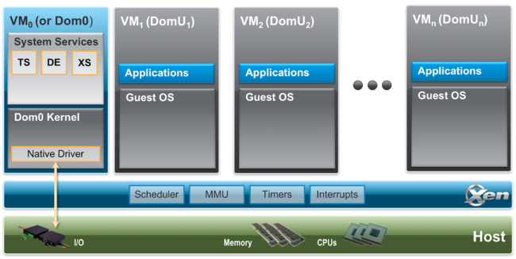
</div>

Xen Project hypervisor 直接在硬件上运行, 负责处理 (**CPU**, **内存**, **定时器**和**中断**). 它是 bootloader(**引导加载程序**)退出后运行的第一个程序. 在 hypervisor 上运行着多个虚拟机. **一个运行中的虚拟机实例**称为 **域** 或 **虚拟机**.

一个特殊的域, 称为 **Dom0**, 包含系统中**所有设备的驱动程序**. Dom0 还包含**控制栈**和**其他系统服务**, 用于管理基于 Xen 的系统. 请注意, 通过 Dom0 分离, 可以在专用虚拟机中运行这些服务和设备驱动程序的一部分: 但这不是正常的系统设置.

组件详细说明:

- **Xen Project Hypervisor**: 这是一个非常精简的软件层(在 Arm 上小于 **65KSLOC**, 在 x86 上小于 300KSLOC), 直接在硬件上运行, 负责管理 CPU, 内存和中断. 它是引导加载程序退出后运行的第一个程序. Hypervisor 本身不涉及 **I/O 功能**, 如网络和存储.

- **客户域/虚拟机**: 这些是虚拟化环境, 每个环境都运行自己的操作系统和应用程序. Hypervisor 支持几种不同的虚拟化模式, 下面将更详细地描述. 客户虚拟机完全与硬件隔离: 换句话说, 它们没有权限访问硬件或 I/O 功能. 因此, 它们也被称为**非特权域**(或 DomU).

- **控制域(或 Dom0)**: 这是一个特殊的虚拟机, 具有特殊权限, 如直接访问硬件, 处理对系统 I/O 功能的所有访问以及与其他虚拟机交互. 没有 Dom0, Xen Project hypervisor 无法使用, 它是系统启动的第一个虚拟机. 在标准设置中,  Dom0 包含以下功能:

  - **系统服务**: 如 [XenStore](https://wiki.xenproject.org/wiki/XenStore)/[XenBus](https://wiki.xenproject.org/wiki/XenBus) (XS) 用于**管理设置**, 工具栈 (Toolstack, TS) 为基于 Xen 的系统提供**用户界面**, **设备仿真** (Device Emulation, DE) 基于 Xen 系统中的 QEMU(参见 `Xen/qemu/qemu.md`).

  - **本地设备驱动程序**:  Dom0 是物理设备驱动程序的来源, 因此是 Xen 系统的本地硬件支持.

  - **虚拟设备驱动程序**:  Dom0 包含**虚拟设备驱动程序**(也称为后端).

  - **工具栈**: 允许用户管理虚拟机的(创建, 销毁和配置). 工具栈提供一个接口, 可以通过(**命令行控制台**, **图形界面**或**云编排堆栈**) (如 OpenStack 或 CloudStack) 来驱动. 请注意, 可以使用多种不同的工具栈与 Xen 一起使用.

- **Xen Project 使能的操作系统**:  Dom0 需要一个 Xen Project 使能的内核. 半虚拟化虚拟机需要一个 PV 启用的虚拟机. 基于 Linux 内核版本高于 Linux 3.0 的 Linux 发行版都是 Xen Project 启用的, 并且通常包含包含 hypervisor 和工具 (默认工具栈和控制台) 的软件包. 几乎所有旧版 Linux 内核 (早于 Linux 2.6.24) 都是 PV 启用的, 能够运行 PV 虚拟机.

参见:

* Xen 项目 Realease Features: https://wiki.xenproject.org/wiki/Xen_Project_Release_Features

* Xen 使能的 OS: https://wiki.xenproject.org/wiki/Dom0_Kernels_for_Xen

# 3. 虚拟机类型

以下图示展示了 Xen 中虚拟机类型的演变.

<div align='center'>
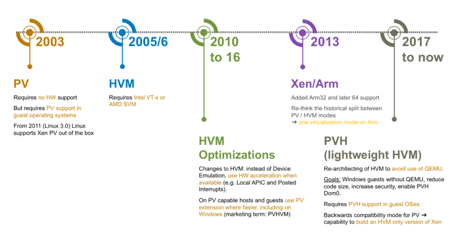
</div>

在 **ARM** 主机上, **只有一种虚拟机类型**, 而在 **x86** 主机上, hypervisor 支持以下**三种类型的虚拟机**:

- **半虚拟化虚拟机或 PV 虚拟机**: PV 是一种最初由 Xen Project 引入的软件虚拟化技术, 后来被其他虚拟化平台采用. PV **不需要主机 CPU 的虚拟化扩展**, 但需要 Xen 意识的虚拟机操作系统. PV 虚拟机主要用于**旧硬件**和**旧虚拟机镜像**, 以及特殊场景, 例如特殊虚拟机类型, 特殊工作负载(例如 Unikernels), 在另一个 hypervisor 内运行 Xen 而不使用嵌套硬件虚拟化支持, 作为容器主机等.

- **HVM 虚拟机**: HVM 虚拟机使用**主机 CPU 的虚拟化扩展**来虚拟化虚拟机. HVM 需要 Intel VT 或 AMD-V 硬件扩展. Xen Project 软件使用 **QEMU 设备模型**来仿真 PC 硬件, 包括 (**BIOS**, **IDE 磁盘控制器**, **VGA 图形适配器**, **USB 控制器**, **网络适配器**)等. HVM 虚拟机在虚拟机中可用 PV 接口和驱动程序时 (通常在 Linux 和 BSD 虚拟机上是这种情况) 使用 PV 接口和驱动程序. 在 Windows 上, 驱动程序可以通过我们的下载页面下载. 当可用时, HVM 将使用**硬件和软件加速**, 例如 LAPIC, Posted Interrupt, Viridian(Hyper-V)启发式优化, 并在虚拟机中可用时使用 PV 接口. 通常, HVM 是 Linux, Windows,BSDs 的最佳性能选项.

- **PVH 虚拟机**: PVH 虚拟机是**轻量级的 HVM-like 虚拟机**, 使用主机 CPU 的虚拟化扩展来虚拟化虚拟机. 与 HVM 虚拟机不同, PVH 虚拟机**不需要 QEMU 来仿真设备**, 而是使用 **PV 驱动程序**进行 I/O 和原生操作系统接口进行(**虚拟化定时器, 虚拟化中断和引导**). PVH 虚拟机需要 **PVH 使能的虚拟机操作系统**. 这种方法类似于 Xen 虚拟化 ARM 虚拟机的方式, 只是 **ARM CPU** 提供了**硬件支持**用于**虚拟化定时器和中断**.

## 3.1. PV(x86)

半虚拟化 (PV, Paravirtualization) 是一种最初由 Xen Project 引入的虚拟化技术, 后来被其他虚拟化平台采用. PV **不需要主机 CPU 的虚拟化扩展**, 因此非常适合在旧硬件上运行. 然而, 半虚拟化虚拟机需要 PV 启用的内核和 PV 驱动程序, 因此虚拟机了解 hypervisor 并且可以在没有仿真或虚拟仿真硬件的情况下高效运行. Linux, NetBSD 和 FreeBSD 都存在 PV 启用的内核. Linux 内核从 2.6.24 开始使用 Linux pvops 框架实现 PV. 实际上, 这意味着 PV 可以与大多数 Linux 发行版一起使用(除了非常旧的发行版版本).

参见:

* 半虚拟化: https://wiki.xenproject.org/wiki/Paravirtualization_(PV)

* PV 特定的配置选项: http://xenbits.xen.org/docs/unstable/man/xl.cfg.5.html#paravirtualised__pv__guest_specific_options

## 3.2. HVM 及其变体(x86)

**全虚拟化**或**硬件辅助虚拟化** (HVM, `Hardware-assisted virtualization`) 使用**主机 CPU 的虚拟化扩展**来虚拟化虚拟机. HVM 需要 Intel VT 或 AMD-V 硬件扩展. Xen Project 软件使用 QEMU 来仿真 PC 硬件, 包括 BIOS, IDE 磁盘控制器, VGA 图形适配器, USB 控制器, 网络适配器等. 虚拟化硬件扩展用于提高仿真的性能. 完全虚拟化的虚拟机不需要任何内核支持. 这意味着 Windows 操作系统可以作为 Xen Project HVM 虚拟机使用. 对于较旧的主机操作系统, 完全虚拟化的虚拟机通常比半虚拟化虚拟机慢, 因为需要仿真.

为了解决这个问题, Xen Project 社区已经将 PV 驱动程序和接口上游化到 Linux 和其他开源操作系统. 在[具有 Xen 支持的操作系统](https://wiki.xenproject.org/wiki/DomU_Support_for_Xen)上, 这些驱动程序和软件接口将在选择 HVM 虚拟化模式时自动使用. 在 Windows 上, 这需要安装适当的 PV 驱动程序. 您可以找到更多信息:

- Windows PV 驱动程序下载: https://xenproject.org/downloads/windows-pv-drivers.html
- Windows PV 驱动程序门户: https://wiki.xenproject.org/wiki/Category:Windows_PV_Drivers
- 第三方 GPL PV 驱动程序(提供签名驱动程序): https://wiki.xenproject.org/wiki/Xen_Windows_GplPv

即使在使用半虚拟化 (PV) 驱动的情况下, 全虚拟化 (HVM) 模式仍存在一些不必要的**低效**问题. 以**中断控制器**为例: HVM 模式为虚拟机内核提供**模拟的中断控制器** (APICs 和 IOAPICs). **每条与 APIC 交互的指令**都需要调用 **Xen** 并进行**软件指令解码**; 并且每次传递中断都需要进行多次这样的模拟操作. 对于运行在 HVM 模式下的虚拟机, 有许多用于中断, 定时器等的半虚拟化接口是可用的. 当虚拟机支持这些接口时(大多数现代版本的 Linux, BSD 和 Windows 都是如此), HVM 模式会使用这些接口. 这其中包括 Viridian(即 Hyper - V) 优化机制, 该机制能确保 Windows 虚拟机知晓自己处于虚拟化环境中, 从而加快在 Xen 上运行的 Windows 工作负载的处理速度.

在引入 HVM 改进时, 我们使用了术语来描述这些改进. 当时这似乎是个不错的策略, 但后来却给用户造成了困惑. 例如, 我们曾用 "**PVHVM 虚拟机**" 来描述 **HVM 虚拟机使用 PV 接口**的能力, 尽管 PVHVM 虚拟机本质上就是 HVM 虚拟机. 下表概述了用于描述 HVM 演进阶段的术语, 你偶尔会在 Xen 维基百科和其他文档中看到这些术语:

<div align='center'>
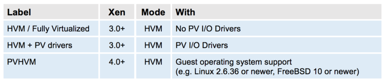
</div>

与基于半虚拟化 (PV) 的虚拟化技术相比, 全虚拟化 (HVM) 通常速度更快.

可参考: [HVM 特定的配置选项](http://xenbits.xen.org/docs/unstable/man/xl.cfg.5.html#fully_virtualised__hvm__guest_specific_options)

## 3.3. PVH (x86)

PVH 的主要动机是结合 **PV** 和 **HVM** 模式的优点, 并**简化**支持 Xen 的操作系统与 Xen Hypervisor 之间的**接口**. 为此, 我们有两种选择:

* 一是从 **PV guest** 开始, 实现一个 "轻量级(lightweight)" 的 HVM 包装器(HVM wrapper, 就像我们对 ARM 的处理一样);

* 二是从 **HVM guest** 开始, 去除不需要的功能.

基于我们在 Xen ARM port 上的经验, 第一种选择看起来更有前景, 因此我们开始开发一种名为 **PVH**(现在称为 **PVHv1**) 的**实验性虚拟化模式**, 并在 Xen Project 4.4 和 4.5 中交付. 不幸的是, 最初的设计并没有像我们希望的那样简化操作系统 - hypervisor 接口, 因此我们开始评估第二种选择, 这要简单得多. 这导致了 **PVHv2**(早期也称为 **HVMLite**)的诞生.

**PVHv2 guests** 是**轻量级的 HVM guests**, 使用**硬件虚拟化**支持来处理**内存**和**特权指令**, 使用 **PV 驱动程序**进行 **I/O**, 并使用**原生操作系统接口**处理其他所有事务. PVHv2 也**不使用 QEMU 进行设备仿真**, 但 QEMU 仍然可以用于**用户空间后端**(参见 PV I/O 支持).

PVHv1 已在 Xen 4.9 中被 PVHv2 取代, 并在 Xen 4.10 中得到完全支持. PVH(v2)要求 guests 使用 Linux 4.11 或更新的内核.

**另请参见**

- PVH 特定配置选项(Xen 4.10+): http://xenbits.xen.org/docs/unstable/man/xl.cfg.5.html#PVH-Guest-Specific-Options
- 目前 PVH 仅支持 [直接内核启动(Direct Kernel Boot)](http://xenbits.xen.org/docs/unstable/man/xl.cfg.5.html#Direct-Kernel-Boot). EFI 支持正在开发中.

## 3.4. ARM 主机

在 ARM 主机上, 只有一种虚拟化模式, **不使用 QEMU**.

pvh 或者 hvm, 代码中只有 pv 或者 hvm 两种

## 3.5. 总结

下图概述了 Xen 中实现的各种虚拟化模式, 并显示了每种虚拟化模式使用的底层虚拟化技术.

<div align='center'>
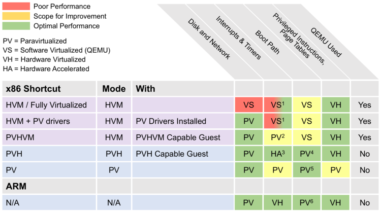
</div>

Footnotes(注脚):

1. 在**较旧的硬件**上使用 **QEMU**, 在**较新的硬件**上使用**硬件加速** – 详见 3）

2. 始终使用事件通道

3. 通过软件实现, 并得到 IO APIC 和已发布中断的硬件加速器支持

4. PVH 使用**直接内核引导**或 **PyGrub**. EFI 支持目前正在开发中.

5. PV 使用 **PvGrub** 进行引导

6. ARM 虚拟机使用 **EFI 引导**或**设备树**(用于嵌入式应用)

从用户的角度来看, 虚拟化模式主要具有以下影响:

- **性能**和**内存消耗**会因虚拟化模式而异

- 许多**命令行和配置选项**将取决于虚拟化模式

- HVM 和 PV/PVH 的**启动路径**和 guest 安装不同: 在 HVM guest 中安装客户操作系统的流程与在真实硬件上安装相同, 而在 PV/PVH 虚拟机中安装则有所不同. 请参阅本文的启动 / 安装部分.

# 4. 工具栈和管理 API

Xen Project 软件采用了多种不同的工具栈. 每个工具栈都暴露了一个 API, 可以针对该 API 运行不同的工具集或用户界面. 下图简要概述了您的选择, 哪些商业产品使用了哪些工具栈, 以及使用特定 API 的托管供应商示例.

<div align='center'>
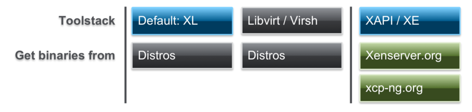
</div>

蓝色标记的框由 Xen Project 开发

Xen Project 软件可以使用**默认工具栈**, [Libvirt](https://wiki.xenproject.org/wiki/Libvirt) 或 [XAPI](https://wiki.xenproject.org/wiki/XAPI). **Xen Project hypervisor** 和 **XAPI** 的组合被称为 [**XCP**](https://wiki.xenserver.org/index.php?title=Category:XCP), 已被开源的 [XenServer](http://xenserver.org/) 和 [XCP-ng](https://xcp-ng.org/) 取代. 上述图展示了各种选项: 它们都有不同的权衡, 并针对不同的用例进行了优化. 然而, 一般来说, 您在图中的位置越靠右, 提供的功能就越多.

选择哪个?

["工具栈选择"](https://wiki.xenproject.org/wiki/Choice_of_Toolstacks) 一文为您提供了各种选项的概览, 并进一步链接到特定 API 暴露的工具和工具栈.

## 4.1. xl

在本文的其余部分, 我们假设您使用的是带有命令行工具 XL 的默认工具栈. 这些在项目的[手册页](https://wiki.xenproject.org/wiki/Xen_Man_Pages)中有所描述. xl 主要分为两部分:

- [**xl 命令行工具**](https://xenbits.xen.org/docs/unstable/man/xl.1.html): 可用于创建, 暂停和关闭域, 列出当前域, 启用或固定 VCPU, 以及连接或断开虚拟块设备. 它通常以 root 身份在 Dom0 中运行

- [**域配置文件**](https://xenbits.xen.org/docs/unstable/man/xl.cfg.5.html): 描述每个域 / VM 配置, 并存储在 **Dom0** 文件系统中

# 5. Xen 中的 I/O 虚拟化

Xen Project Hypervisor 支持以下 I/O 虚拟化技术:

- **PV 分离驱动模型**: 在这种模型中, **虚拟前端设备驱动程序**与**虚拟后端设备驱动程序**通信, 后者再通过 (原生) **设备驱动程序**与**物理设备通信**. 这使得多个 VM 可以使用相同的硬件资源, 同时能够**复用原生硬件支持**. 在标准 Xen 配置中, (原生)**设备驱动程序**和**虚拟后端设备驱动**程序位于 **Dom0** 中. Xen 也确实允许在所谓的 [**驱动域**](https://wiki.xenproject.org/wiki/Driver_Domain) 中运行**设备驱动程序**. 基于 I/O 虚拟化的 PV 是**磁盘**和**网络**的主要 I/O 虚拟化方法, 但还有许多为**非服务器用途**开发的 **DRM**, **触摸屏**(Touchscreen), **音频**(Audio)等 PV 驱动程序. 此模型与 Xen 使用的虚拟化模式无关, 仅取决于相关驱动程序的存在. 这些驱动程序随 Linux 和 BSD 一起提供. 对于 Windows, 需要下载并安装驱动程序到客户 OS 中.

- **基于设备仿真的 I/O**: HVM 虚拟机在**软件中仿真硬件设备**. 在 Xen 中, 使用 **QEMU** 作为**设备仿真器**. 由于性能开销较高, 基于设备的仿真通常仅在系统启动或安装期间以及针对低带宽设备时使用.

- **直通**: 允许您将物理设备的控制权交给虚拟机. 换句话说, 您可以使用 PCI 直通将 PCI 设备 (网卡, 磁盘控制器, HBA,USB 控制器, FireWire 控制器, 声卡等) 分配给虚拟机虚拟机, 使其能够完全直接访问 PCI 设备. Xen 支持多种 PCI 直通, 包括 VT-d 直通和 SR-IOV. 但请注意, 使用直通存在安全影响, 这些影响在[文档](https://docs.openstack.org/security-guide/compute/hardening-the-virtualization-layers.html)中有详细说明.

## 5.1. PV I/O 支持

以下两个图展示了 Xen 中实现的 **PV 分离驱动模型**的两个变体:

使用**分离驱动模型**的 I/O 虚拟化:

<div align='center'>
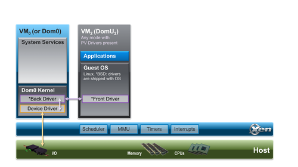
</div>

使用 **QEMU 用户空间后端驱动程序**的 I/O 虚拟化:

<div align='center'>
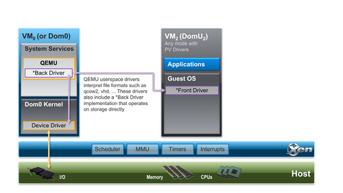
</div>

在第一种模型中, PV 前端驱动程序将直接与 **Dom0** 内核中的 **PV 后端驱动程序**通信. 此模型主要用于使用 **LVM**, **iSCSI**, **DRBD** 等进行普通的网络和存储虚拟化. 请注意, 上述图是 Xen 堆栈中发生情况的简化表示, 因为即使在最简单的情况下, 后端驱动程序和实际硬件设备之间也会有 Linux/BSD 网络/块堆栈.

在第二种模型中, QEMU 用户空间后端将解释格式化的文件数据(如 qcow2, vmdk, vdi 等), 并向其自己的 PV 后端实现呈现原始磁盘接口.

从用户或虚拟机的角度来看, 后端驱动程序在用户空间还是内核空间运行没有可见差异. Xen 将根据使用的配置选项自动选择前端和后端驱动程序的适当组合.

## 5.2. HVM I/O 支持

下图展示了**设备仿真**在隔离使用以及与 PV I/O 支持结合使用时的情况.

<div align='center'>
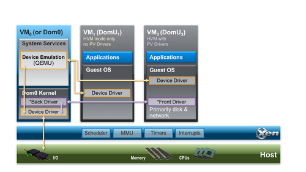
</div>

此支持仅适用于 HVM 虚拟机, 主要用于仿真 guest 启动过程中需要的 legacy 设备. 它也用于**低带宽设备**, 例如 HVM 虚拟机的**串行控制台**.

## 5.3. 存储

下图简要概述了 Xen 的存储选项

<div align='center'>
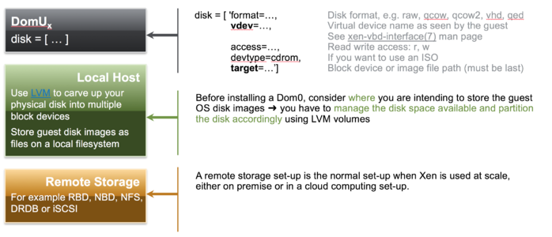
</div>

定义存储相对简单, 但在大规模使用时需要一些规划. 这适用于 Xen Project 软件以及其他虚拟化解决方案. 更多信息请参阅:

- xl-disk-configuration(5): https://xenbits.xen.org/docs/unstable/man/xl-disk-configuration.5.html
- 存储选项: https://wiki.xenproject.org/wiki/Storage_options

## 5.4. 网络

使用 xl 时, 主机网络配置不由工具栈配置. 通常, xl 工具栈遵循不实现在主机 OS 中可用功能的哲学: 设置网络以及管理系统服务是示例. 因此, 主机管理员需要使用本机 Linux/BSD 工具在 Dom0 中设置适当的网络配置, 使用以下常见的网络风格之一: 桥接(最常见),Open vSwitch, 路由, NAT. 这通常在 Xen 安装后立即进行. 请参阅下图:

<div align='center'>
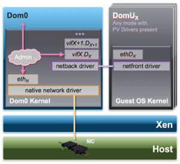
</div>

为此, 您可能需要:

- **步骤 1**: 如果尚未存在, 安装桥接软件包
- **步骤 2**:: 在 Dom0 中设置网络桥(xenbr0). 这因发行版而异: 您可以在此处找到许多示例.

    如前所述, 一个 paravirtualized 网络设备由一对网络设备组成. 第一个 (前端) 将位于虚拟机域中, 第二个 (后端) 将位于后端域 (通常是 Dom0) 中.

    - 前端设备在虚拟机域中看起来像任何其他物理以太网 NIC. 通常在 Linux 下, 它绑定到 xen-netfront 驱动程序并创建一个名为 **ethN** 的设备. 在 NetBSD 和 FreeBSD 下, 前端设备分别命名为 xennetN 和 xnN.

    - 后端设备通常命名为包含虚拟机域 ID 和设备索引. 在 Linux 下, 这些设备默认命名为 **vifDOMID.DEVID**, 而在 NetBSD 下使用 xvifDOMID.DEVID.

- **步骤3**: 要将这些虚拟网络设备连接到网络, 需要在相应域配置文件中为每个后端设备添加一个 **vif** 条目.

这看起来像这样:

```
vif = ['mac=…, bridge=xenbr0' ]
```

默认情况下, 大多数 Xen 工具栈会选择一个随机 MAC 地址. 根据工具栈的不同, 这将在虚拟机的整个生命周期内保持静态 (例如 Libvirt,XAPI) 或每次虚拟机启动时都会更改(例如 XL). 对于后者, 最好分配一个定义的 MAC 地址, 以便在使用 DHCP 服务器时 IP 地址保持静态.

尽管 Xen 中的网络设置可能看起来很复杂, 但实际上相当简单. 更多信息请参阅:

- xl-network-configuration(5): https://xenbits.xen.org/docs/unstable/man/xl-network-configuration.5.html
- Xen 网络指南: https://wiki.xenproject.org/wiki/Xen_Networking
- 为后端设备分配唯一 MAC 地址的脚本: https://wiki.xenproject.org/wiki/Scripts/make-mac.sh
- 在 CentOS 7 上设置桥接的脚本: https://wiki.xenproject.org/wiki/Scripts/centos-bridge-setup.sh

# 6. 连接到虚拟机: 控制台, ssh,VNC

下图概述了连接到 Xen 虚拟机的不同方法

<div align='center'>
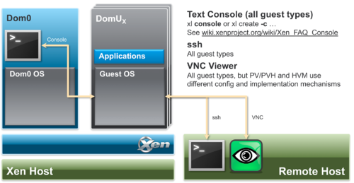
</div>

**另请参见**

- FAQ: 控制台, https://wiki.xenproject.org/wiki/Xen_FAQ_Console
- 为 PV 虚拟机设置 VNC 控制台, https://www.virtuatopia.com/index.php/Configuring_a_VNC_based_Graphical_Console_for_a_Xen_Paravirtualized_domainU_Guest
- 在 Xen 虚拟机上运行和连接到 VNC 服务器, https://www.virtuatopia.com/index.php/Running_and_Connecting_to_VNC_Servers_on_a_Xen_Guest_(domainU)_System
- 初学者指南 - 包括 VNC 设置, https://wiki.xenproject.org/wiki/Xen_Project_Beginners_Guide

# 7. Xen 的启动选项

当创建一个 VM 时, 它不包含可启动的操作系统. 用户原则上主要有以下选择:

- 使用正常的操作系统安装程序安装 OS: 即使用基于 ISO 的安装介质, 网络安装 (例如 PXE) 或类似方式.
- 克隆以前创建的 VM 实例. 请注意, 有许多来源提供预构建的 Xen [虚拟机 VM 映像](https://wiki.xenproject.org/wiki/Guest_VM_Images). 克隆可用于设置一系列相同的虚拟机, 并且还可以分发到其他目的地. 一些基于 Xen 的产品和发行版提供了导出和导入 VM 映像的功能 (例如任何基于 libvirt 的 Xen 变体, XenServer 和 XCP-ng):xl 不提供此类功能. 但是, 保存主磁盘映像和配置文件, 并使用磁盘映像和配置文件的文件副本创建克隆(需要进行调整) 就足够了.
- 一些基于 Xen 的产品 (例如 XenServer 和 XCP-ng) 以及 libvirt 工具栈提供了一种称为模板的机制, 以简化创建 VM 克隆的过程. 模板是设计为用于克隆的虚拟机实例. 您可以从一个模板创建多个克隆, 并使用提供的模板工具对每个克隆进行少量修改.
- 此外, 还有供应工具, 如 Xen 工具

<div align='center'>
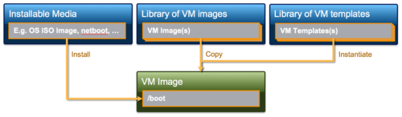
</div>

**另请参见**

- 启动概述: https://wiki.xenproject.org/wiki/Booting_Overview
- PV Netboot: https://wiki.xenproject.org/wiki/Xenpvnetboot
- PvGrub2: https://wiki.xenproject.org/wiki/PvGrub2
- PyGrub: https://wiki.xenproject.org/wiki/PyGrub

# 8. xl

## 8.1. 最小配置文件

以下代码片段展示了一个最小的 xl [配置文件](https://xenbits.xen.org/docs/unstable/man/xl.cfg.5.html). 请注意, `/etc/xen` 中有配置文件模板

```
# 虚拟机名称和类型, 内存大小和 VCPU
name = "myguestname"
type = "TYPE"
memory = MMM
vcpus = VVV

# 与启动相关的信息, 除非 type='hvm' … 以下之一
# 有关解释, 请参阅 https://wiki.xenproject.org/wiki/Booting_Overview

# Netboot/Direct Kernel Boot/PV GRUB
kernel = "/…/vmlinuz"
ramdisk = "/…/initrd.gz"
extra = …
# 要使用 PVGrub(如果已安装)
firmware="pvgrub32|pvgrub64
# 从磁盘启动
bootloader="pygrub"

# 磁盘规格
disk = [' ']
# 网络规格
vif = [' ']
```

## 8.2. 常见的 xl 命令

https://xenbits.xen.org/docs/unstable/man/xl.1.html

**VM 控制**

- xl create \[configfile\] \[OPTIONS\]
- xl shutdown \[OPTIONS\] -a\|domain-id
- xl destroy \[OPTIONS\] domain-id
- xl pause domain-id
- xl unpause domain-id 信息

**信息**

- xl info \[OPTIONS\]
- xl list \[OPTIONS\] \[domain-id ...\]
- xl top

**调试**

- xl dmesg \[OPTIONS\]
- xl -v … 从 /var/log/xen/xl-${DOMNAME}.log, /var/log/xen/qemu-dm-${DOMNAME}.log 等日志文件中获取日志

## 8.3. Xen 文件系统位置

- /etc/xen : 脚本, 配置文件示例, 您的配置文件
- /var/log/xen : 日志文件
- /usr/lib64/xen/bin : Xen 二进制文件
- /usr/lib64/xen/boot : Xen 固件和与启动相关的二进制文件
- /boot : 启动和安装映像

# 9. 获取 Xen Project, 主机和虚拟机安装

## 9.1. 选择控制域(Dom0)

如前所述, Xen Project hypervisor 需要一个作为控制域的内核. 大多数 Xen Project 启用的内核在 hypervisor 本身的角度来看非常相似. 为您选择合适的 Dom0 取决于:

- 您对特定发行版的熟悉程度(例如包装系统等)
- 发行版附带的 Xen Project Hypervisor 版本
- 您是否可以获得商业支持(如果您需要)

如果您使用 XenServer 或 XCP-ng, 除非您是高级用户, 否则通常不会太多接触 Dom0.

**另请参见**

- Dom 0 内核, https://wiki.xenproject.org/wiki/Dom0_Kernels_for_Xen
- 入门指南, https://wiki.xenproject.org/wiki/Getting_Started

## 9.2. 获取 Xen Project 软件

Xen Project hypervisor 可从 XenProject.org 以源代码分发形式获得. 然而, 您可以从许多 Linux 和 Unix 发行版中获取 recent binaries 作为软件包, 包括开源和商业版本.

**Xen Project 源代码分发**

Xen Project 社区按照 Linux 内核的交付模式提供 hypervisor 的源代码分发. 软件大约每 6-9 个月发布一次, 每年有多个更新版本包含安全修复和关键错误修复. 要从源代码构建 Xen Project 软件, 您可以下载源代码发布或从源代码仓库获取源代码树. 每个源代码发布和源代码树的根目录中都包含一个 README 文件, 其中包含 hypervisor 的详细构建说明. 每个版本的发布说明也包含构建说明, Compiling Xen Project software 页面也是如此.

**Linux/Unix 发行版中的 Xen Project 软件 **

大多数 Linux 和许多 Unix 发行版都包含可以通过本机软件包管理系统下载和安装的 Xen Project hypervisor 的构建二进制文件. 如果您的 Linux/Unix 发行版包含 hypervisor 和 Xen Project 启用的内核, 我们建议您使用它们, 因为您可以受益于安装简便, 与发行版的良好集成, 发行版的支持, 安全更新的提供等. 在发行版中安装 hypervisor 通常需要以下基本步骤: a) 安装您喜欢的发行版, b) 安装 Xen Project 软件包或元软件包, c) 检查启动设置, d) 重启. 重启后, 您的系统将在 hypervisor 上运行您喜欢的 Linux/Unix 发行版作为控制域.

## 9.3. 主机和虚拟机安装

以下文档

- Category:Host Install 包含了为各种 Linux/Unix 发行版安装控制域的指南
- Category:Guest Install 包含了为各种 Linux/Unix 发行版安装各种虚拟机的指南

| | |
|---|---|
| 此表列出了 Xen Project 各种 Linux 和 Unix 发行版的资源.| \[ 编辑 \]|

| 发行版 | 主网站 | 描述 | 资源 |
| ---| ---| ---| ---|
| Arch Linux| archlinux.org| Arch Linux 是一个轻量级且灵活的 Linux® 发行版, 试图 "保持简单".| - Arch 作为 Xen 主机 < br>- Arch 作为 Xen 虚拟机 (PV)<br>- 所有 Arch_Linux 页面 |
| Alpine Linux| alpinelinux.org| 一个基于 musl libc 和 busybox 的面向安全的轻量级 Linux 发行版.| - Xen Dom0 在 HDD 上 < br>- Xen Dom0 在 USB / SSD 上 < br>- Xen DomU 安装 < br>- Alpine Linux Xen LiveCD<br>- 所有 Alpine Linux wiki 页面 |
| CentOS 5| centos.org| CentOS 是从北美一家知名 Enterprise Linux 供应商公开提供的源代码衍生的企业级 Linux 发行版. CentOS 完全符合上游供应商的再分发政策, 并旨在实现 100% 二进制兼容.(CentOS 主要更改软件包以去除上游供应商的品牌和艺术作品.)CentOS 是免费的.| - CentOS 5.x 包括 Xen Project 3.4 Hypervisor, 并且可以开箱即用地用作 dom0 和 domU<br>- CentOS / RHEL 6 作为 Xen Project 主机 < br>- 所有 CentOS wiki 页面 |
| CentOS 6| centos.org| CentOS 是从北美一家知名 Enterprise Linux 供应商公开提供的源代码衍生的企业级 Linux 发行版. CentOS 完全符合上游供应商的再分发政策, 并旨在实现 100% 二进制兼容.(CentOS 主要更改软件包以去除上游供应商的品牌和艺术作品.)CentOS 是免费的.| **CentOS 6.0 - 6.3** 不包含 Xen Project 软件, 但您可以从各种来源获得支持. 以下文章可能有用 < br>- CentOS / RHEL 6 作为 Xen Project 主机 < br>- CentOS 6 作为 Xen Project 虚拟机 (32 位)<br>- CentOS 6 作为 Xen Project 虚拟机 (64 位)<br>- CentOS 6 作为 XCP 虚拟机 < br>- 所有 CentOS wiki 页面 < br>**CentOS 6.4+** 包括 Xen Project 支持, 并且可以开箱即用地用作 dom0 和 domU, 这要归功于 Xen4CentOS 项目 < br>- Xen4CentOS<br>- Xen4CentOS6 发布说明 < br>- Xen4CentOS6 快速入门指南 < br>- 所有 CentOS wiki 页面 < br>CentOS 6 中的 Xen 软件包和商业支持也可以从 "Xen made easy!" 获得 < br>- 来自 "Xen made easy!" 的 Xen 软件包 |
| Debian| debian.org| Debian 项目制作了一个完全免费的操作系统, 赋予用户控制运行在其计算机上的软件的权力.| - Debian 作为 Xen 主机 < br>- 使用 Debian Installer 安装 Debian 虚拟机 < br>- 在基于 Debian 的发行版上使用 XCP 工具栈 < br>- 所有 Debian wiki 页面 |
| Fedora| fedoraproject.org| Fedora 是一个基于 RPM 的发行版, 每 6 个月发布一次, 是 RHEL 发布的社区支持基础.| - Fedora 16 及更新版本开箱即地提供完整的 Xen 支持.<br>- Fedora 主机安装 < br>- Fedora 测试日 < br>- 所有 Fedora wiki 页面 |
| FreeBSD| freebsd.org| FreeBSD® 是一个面向现代服务器, 桌面和嵌入式计算机平台的高级操作系统.| - 如何在 Linux 主机上安装 FreeBSD domU<br>- 所有 FreeBSD Wiki 页面 |
| Finnix| finnix.org| Finnix 是一个 sysadmin 实用程序 Linux LiveCD, 并且开箱即地支持 Xen Project 虚拟机.| - 适用于 VPS 提供商的 Finnix<br>- 所有 Finnix wiki 页面 |
| Gentoo Linux| gentoo.org| Gentoo Linux 是一种特殊的 Linux, 可以针对几乎任何应用程序或需求自动优化和定制. 卓越的性能, 可配置性和一流的用户和开发者社区都是 Gentoo 体验的标志.| - Gentoo Xen 页面 < br>- 所有 Gentoo wiki 页面 |
| NetBSD| netbsd.org| NetBSD 是一个免费, 快速, 安全且高度可移植的类 Unix 开源操作系统.| - NetBSD Xen 概述 < br>- NetBSD Xen HowTo<br>- 在 NetBSD 上从源代码编译 Xen<br>- 所有 NetBSD wiki 页面 |
| Oracle Linux| oracle.com| Oracle Corporation 分发 Oracle Linux the Unbreakable Enterprise Kernel.Oracle 表示 Unbreakable Enterprise Kernel 与 RHEL,Oracle 中间件和 3rd-party RHEL 认证应用程序兼容. Oracle Linux 支持 KVM,Xen Project 和基于 Xen 的 Oracle VM Server for x86.| - 所有 Oracle Linux wiki 页面 |
| openSuSE| opensuse.org| openSuSE 是一个免费且基于 Linux 的操作系统, 适用于您的 PC, 笔记本电脑或服务器.| - 所有 OpenSuSE wiki 页面 |
| Red Hat Enterprise Linux (RHEL) 5.x| redhat.com| RHEL 5.x 包括 Xen Project 3.4 Hypervisor 以及 Xen Project 启用的内核, 并且可以开箱即用地用作 dom0 和 domU| - CentOS / RHEL 6 作为 Xen Project 主机 < br>- 所有 RHEL wiki 页面 |
| Red Hat Enterprise Linux (RHEL) 6.x| redhat.com| RHEL 6.x 不包含 Xen Project Hypervisor. 但是, 可以从 Xen4CentOS 项目或 "Xen made easy!" 计划获得适用于 RedHat Enterprise Linux 6 及其衍生版的 Dom0 能用内核, Xen Project hypervisor 和 libvirt 软件包.| - Xen4CentOS<br>- 来自 "Xen made easy!" 的 Xen Project 软件包 |
| Ubuntu| ubuntu.com| 快速, 安全且时尚简洁的 Ubuntu 操作系统每天被全球 2000 万人使用.| - Ubuntu Xen Project Wiki 页面 < br>  <br>  (包括主机和虚拟机安装)<br>- 虚拟化文档 < br>- XCP Ubuntu 安装 < br>- 所有 Ubuntu wiki 页面 |

# 10. 入门教程(在 VirtualBox 中运行 Xen)

以下教程允许你在 VirtualBox 中尝试运行 Xen.

## 10.1. 系统要求和设置

- **系统要求**:
  - 一台运行 Windows,Linux 或 macOS 的主机.
  - 至少 8GB 的可用磁盘空间.
  - 至少 4GB 的 RAM.
  - 一个支持虚拟化的 CPU(Intel VT-x 或 AMD-V).

- **设置步骤**:
  1. **安装 VirtualBox**:
     - 从 [VirtualBox 官方网站](https://www.virtualbox.org/wiki/Downloads) 下载并安装 VirtualBox.
  2. **下载 Xen for VirtualBox**:
     - 从 [Xen Project 下载页面](https://wiki.xenproject.org/wiki/Downloads) 下载适用于 VirtualBox 的 Xen 镜像.
  3. **创建 VirtualBox 虚拟机**:
     - 打开 VirtualBox, 点击 "新建" 创建一个新的虚拟机.
     - 设置虚拟机名称为 "Xen for VirtualBox", 选择类型为 "其他"(Other), 版本为 "其他 / 未知"(Other/Unknown).
     - 分配至少 2GB 的 RAM.
     - 创建一个新的虚拟硬盘, 选择 "VDI"(动态分配)类型, 大小至少为 8GB.
  4. **配置虚拟机**:
     - 选择创建的虚拟机, 点击 "设置".
     - 在 "存储" 选项卡中, 添加下载的 Xen 镜像作为光盘驱动器.
     - 在 "网络" 选项卡中, 选择 "桥接模式"(Bridged Mode).
  5. **启动虚拟机**:
     - 选择虚拟机并点击 "启动".
     - 按照屏幕上的指示完成 Xen 的安装和配置.

## 10.2. 练习脚本

- **练习脚本**:
  - 该教程包含一个练习脚本, 用于指导你完成 Xen 的基本操作和配置.
  - 脚本内容包括创建虚拟机, 启动虚拟机, 安装操作系统等步骤.

## 10.3. 伴随演示文稿

- **演示文稿**:
  - 该教程包含一个演示文稿, 用于帮助你更好地理解 Xen 的基本概念和操作.
  - 演示文稿内容包括 Xen 的架构, 虚拟化模式, 工具栈和管理 API 等.

## 10.4. 下载的图像和文件

- **下载的图像和文件**:
  - 该教程需要下载以下文件:
    - Xen for VirtualBox 镜像(约 7.7GB).
    - 练习脚本和配置文件.

# 11. 获取帮助

Xen Project 社区包含许多乐于助人且友好的人. 我们在这里为你提供帮助. 有多种方式可以获取帮助并了解最新动态.

## 11.1. 新闻来源

- **Xen Project 首页**: 汇总了精选的新闻故事和博客文章.
- **Xen Project 博客**: 涵盖了技术和社区相关的故事.
- **xen-announce 邮件列表**: 这是一个低频率的邮件列表, 用于重要公告.

## 11.2. 文档

- **Xen Project Wiki**: XenProject.org 上的项目文档可在 Xen Project Wiki 上找到. 我们的 Wiki 是活跃且由社区维护的, 包含大量有用的信息, 并广泛使用分类以便于查找信息.
  - **Category: Manual**: 手册文档.
  - **Category: HowTo**: 操作指南.
  - **Category: FAQ**: 常见问题解答.
  - **Category: Release Notes**: 发布说明.

## 11.3. 邮件列表

- **搜索邮件列表**: 所有 XenProject.org 邮件列表都使用 [MarkMail](http://xen.markmail.org/) 系统在 xen.markmail.org 上存档. 在提问之前, 值得检查是否有人已经问过相同的问题.

- **主要邮件列表**:

  - [xen-users](http://lists.xenproject.org/mailman/listinfo/xen-users): 这是 Xen Project hypervisor 的技术支持和讨论列表. 如果你不确定你的问题属于哪里, 可以从这里开始.

## 11.4. IRC

- **IRC**: 互联网中继聊天 (IRC) 是与 Xen Project 社区成员进行实时聊天和支持的好方法.
  - **#xen**: 这是 Xen Project hypervisor 的技术支持和讨论频道. 如果你不确定你的问题属于哪里, 可以从这里开始.

## 11.5. 其他地方

- **其他地方**: 还有许多其他地方可以获取 Xen Project 软件的帮助. 例如:
  - **Xen Project Questions on serverfault**: 在 serverfault 上的 Xen Project 问题.
  - **XCP & XenServer Questions on serverfault**: 在 serverfault 上的 XCP 和 XenServer 问题.
  - **许多支持 Xen Project 软件的 Linux 发行版都有一个专门的列表**: 参见此链接中的表格.

## 11.6. 提交错误

- **提交错误**: 如果你发现了一个错误, 可以报告软件的错误. 在提交错误之前, 请阅读 [Reporting Bugs](https://wiki.xenproject.org/wiki/Reporting_Bugs).

## 11.7. 路线图, 发布周期, 维护版本

- **路线图**: Xen Project 社区每 6 个月发布一次 Xen Project Hypervisor(每年 6 月和 12 月). 路线图信息在 [Xen Roadmap](https://wiki.xenproject.org/wiki/Xen_Roadmap) 上跟踪.
- **维护版本**: 关于维护版本周期的信息可以在 [Xen Project Maintenance Releases](https://wiki.xenproject.org/wiki/Xen_Project_Maintenance_Releases) 上找到.

# 12. 也请参见

## 12.1. 安装

- **入门指南**: 指导新用户进行关键决策.
- **主机安装类别**: 包含安装控制域的指南.
- **虚拟机安装类别**: 包含安装各种虚拟机的指南.
- **主机配置类别**: 包含与引导加载程序, 控制台和网络配置相关的文档.
- **虚拟机虚拟机映像**: 提供各种预安装虚拟机映像的链接.

## 12.2. 发布信息

- **手册类别**: 包含 Xen Project 手动文档.
- **发布说明类别**: 包含 Xen Project 发布说明.
- **Xen 发布功能**: 包含 Xen Project 版本的功能矩阵.

## 12.3. 专题: 网络, 性能, 安全, NUMA,VGA 等

- **网络类别**: 包含与网络相关的文章.
- **NUMA 类别**: 包含所有与在 NUMA 架构上运行(或改进对运行的支持)Xen Project Hypervisor 相关的文章.
- **性能类别**: 包含与 Xen Project 软件性能相关的文档, 调优说明和基准测试.
- **安全类别**: 包含与 Xen Project 安全相关的文档.
- **VGA 类别**: 包含与 VGA,VTd,GPY 直通等相关的文档.

## 12.4. 常见问题, 操作方法等

- **常见问题类别**: 包含 Xen Project 常见问题解答.
- **操作方法类别**: 包含各种操作方法.
- **教程类别**: 包含各种教程.

# 13. reference

https://wiki.xenproject.org/wiki/Xen_Project_Software_Overview
