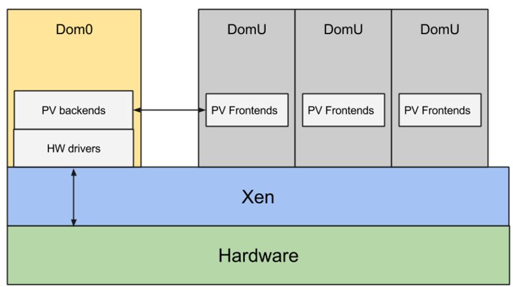
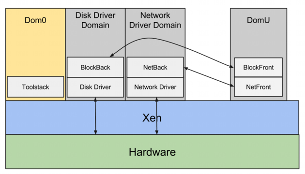
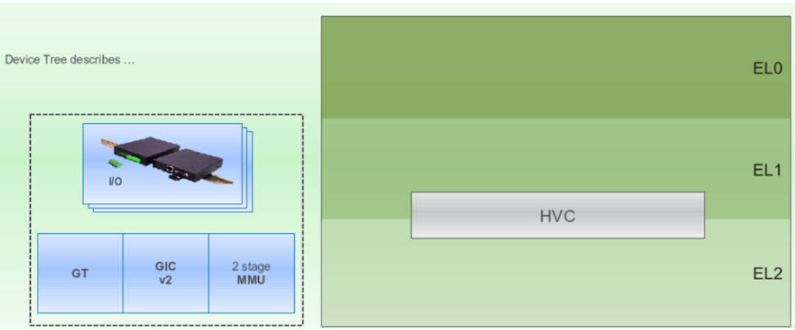
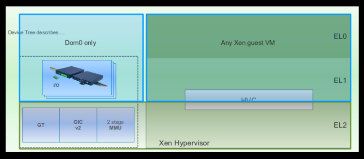
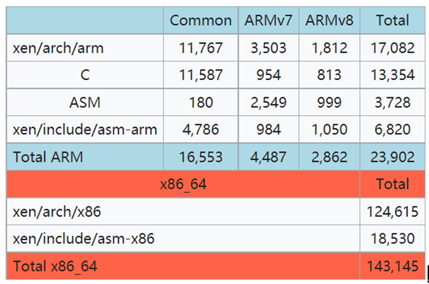

- [1. 什么是 Xen](#1-什么是-xen)
- [2. Xen 架构](#2-xen-架构)
  - [2.1. 驱动域](#21-驱动域)
- [3. 简洁架构](#3-简洁架构)
- [4. 虚拟化扩展](#4-虚拟化扩展)
- [5. 代码量](#5-代码量)
- [6. 移植 Xen 到一个新的 SoC](#6-移植-xen-到一个新的-soc)
- [7. 将操作系统移植到 ARM 架构的 Xen 上](#7-将操作系统移植到-arm-架构的-xen-上)
- [8. 移动平台与新的半虚拟化(PV)协议](#8-移动平台与新的半虚拟化pv协议)
  - [8.1. 单虚拟机访问设备的情况](#81-单虚拟机访问设备的情况)
  - [8.2. 多虚拟机同时访问设备的情况](#82-多虚拟机同时访问设备的情况)
  - [8.3. 编写驱动程序的难度](#83-编写驱动程序的难度)

# 1. 什么是 Xen

Xen 是一项轻巧, 高性能的开源管理程序. Xen 的 size 非常低: ARM 的代码小于 90k 行. Xen 是许可的 GPLV2, 拥有一个健康多样的社区, 可以支持它并为其发展提供资金. Xen 由 LinuxFoundation 托管, 为该项目提供管理.

# 2. Xen 架构

Xen是一种 type 1(裸金属) hypervisor : 它直接运行在硬件之上, 系统中的其他所有组件都作为虚拟机运行在 Xen 之上, 其中包括 Dom0, 也就是第一个虚拟机. Dom0 由 Xen 创建, 具有特权, 并且负责驱动平台上的设备.

Xen对 (**CPU, 内存, 中断和定时器**)进行虚拟化, 为虚拟机提供(**一个或多个虚拟CPU**, **系统内存的一部分**, **一个虚拟中断控制器**以及**一个虚拟定时器**). Xen将诸如 SATA 控制器和网卡之类的设备分配给Dom0, 并负责重新映射内存映射输入输出(MMIO)区域和中断请求(IRQ).

Dom0(通常运行的是Linux系统, 但也可能是 FreeBSD 或其他操作系统)运行与在原生环境中执行时所使用的相同的设备驱动程序来驱动这些设备.

DOM0 还运行一组名为 Paravirtalizatization 后端 的驱动程序. 单个后端可以为多个前端提供服务. 所有最常见的设备类别都存在一对 paravirtalizatization 驱动: (磁盘, 网络, 控制台, 框架, 鼠标, 键盘)等. 它们通常存在于操作系统内核中, 比如 Linux 内核. **少数半虚拟化后端**也可以在 QEMU 的用户空间中运行. 前端通过内存中的**共享页面**使用一种简单的环形协议与后端连接. Xen 提供了用于设备发现和建立初始通信的所有工具. Xen 还提供了一种机制, 使**前端**和**后端**能够共享**额外的页面**, 并通过软件中断相互通知.

## 2.1. 驱动域

尽管在 Dom0 中运行所有设备驱动程序和所有半虚拟化后端是最常见的配置方式, 但其实并没有理由一定要这样做. Xen架构支持**驱动域**(`driver domains`): 这些**非特权虚拟机**存在的唯一目的, 就是为**某一类设备**运行**驱动程序**和**半虚拟化后端**. 例如, 你可以设置一个磁盘驱动域, 将 **SATA controller** 分配给它, 让它运行该控制器的驱动程序以及磁盘半虚拟化后端. 你还可以设置一个**网络驱动域**, 为其分配网卡, 使其运行网卡的驱动程序以及网络半虚拟化后端.

由于驱动域是常规的**非特权虚拟机**, 它们让系统更加**安全**, 因为它们允许大量的代码(比如整个网络堆栈)在**非特权模式**下运行. 即使有**恶意虚拟机**成功控制了**半虚拟化网络后端**和**网络驱动域**, 它也无法掌控整个系统.

**驱动域**还提高了**隔离性**和**恢复能力**: **网络驱动域**与**磁盘驱动域**以及 **Dom0** 是**完全隔离**的. 如果网络驱动程序崩溃, 它不会导致整个系统瘫痪,而**只会影响网络功能**. 在这种情况下, 有可能**只重启网络驱动域**, 而其他所有部分仍保持在线状态.

最后, **驱动域**使 Xen 用户能够以其他方式无法实现的方法对系统进行**分解**(disaggregate)和**组件化**(componentize). 例如, 它们允许用户在**主操作系统**旁边运行一个**实时操作系统**, 来驱动有**实时性要求的设备**.它们还允许用户运行一个旧版操作系统,以驱动那些在现代操作系统中没有可用新驱动程序的旧设备. 它们使用户能够将关键功能与不太关键的功能分离并隔离开来. 比如, 它们允许用户运行像 QNX 这样的操作系统来驱动平台上的大多数设备, 同时使用**安卓系统**来提供**用户界面**.

# 3. 简洁架构

ARM 架构上的 Xen 并非是 x86 架构上 Xen 的简单 1:1 移植. 利用 ARM 这个机会对架构进行了清理, 并去除了在 x86 架构多年开发过程中积累的冗余部分.

首先, 消除了对任何模拟的需求. **模拟接口**既**缓慢**又**不安全**. 在 x86 架构的 Xen 上用于模拟的 **QEMU** 是一个维护良好的开源项目, 但无论是从二进制文件大小还是源代码行数来看, 它的**规模都很大**. 越小, 越简单越好. **ARM 架构上的 Xen 不需要 QEMU**, 因为**它不进行任何模拟**. 它通过尽可能多地利用硬件中的虚拟化支持, 并使用**半虚拟化接口**进行输入输出(IO)来实现这一目标. 因此, ARM 架构上的 Xen 速度更快且更安全.

在 x86 架构上, 两种不同类型的 Xen 虚拟机共存: **半虚拟化虚拟机**(PV), 如 **Linux** 和其他**开源操作系统**, 以及**硬件虚拟机**(HVM)虚拟机, 通常是微软 **Windows** 系统, 但任何操作系统都可以作为 HVM 虚拟机运行. 从 hypervisor 的角度来看, PV 虚拟机和 HVM 虚拟机有很大不同. 这种差异一直体现到用户层面, 用户需要通过在虚拟机配置文件中设置一行内容来选择如何运行虚拟机.

在 ARM 架构上, 我们不想引入这种区分: 我们认为这种区分是人为造成的, 而且会让人困惑. ARM 架构上的 Xen 只支持一种兼具两者优点的虚拟机类型: 它**不需要任何模拟**, 并且像 x86 架构上的 PV 虚拟机一样, 在启动序列中尽早依赖**半虚拟化接口**进行 IO 操作. 它尽可能多地利用硬件中的虚拟化支持, 并且不需要像 x86 架构上的 HVM 虚拟机那样对虚拟机操作系统内核进行大量修改就能运行.

为 ARM 架构上的 Xen 设计的新架构更加简洁和简单, 事实证明它与硬件非常匹配.

# 4. 虚拟化扩展

ARM 虚拟化扩展提供 3 个执行级别:

* EL0 用户模式

* EL1 内核模式

* EL2 Hypervisor 模式

ARM 引入了一个新指令 **HVC**, 用于在**内核模式**和 **Hypervisor** 模式之间切换. MMU 支持 **2 个 translation 阶段**, **通用定时器**和 **GIC 中断控制器**是虚拟化感知的, 如下图所示.

ARM 的虚拟化扩展非常适合 Xen 架构:

* **Xen** 完全且仅在 **hypervisor** 模式下运行.

* Xen 将**内核模式**留给**虚拟机操作系统内核**, 将 **EL0** 模式留给**虚拟机用户空间应用程序**. 而 **type 2 hypervisor** 需要频繁地在 **hypervisor 模式**和**内核模式**之间切换. 通过完全在 **EL2 模式**下运行, Xen 显著减少了所需的**上下文切换次数**.

* 内核使用新指令 **HVC**(超级调用指令)向 Xen 发出超级调用请求.

* Xen 利用 内存管理单元(**MMU**)中的**两级地址转换**来为虚拟机分配内存.

* Xen 使用**通用定时器**来接收**定时器中断**, 同时注入定时器中断, 并**将计数器暴露给虚拟机**.

* Xen 使用**通用中断控制器**(GIC)来接收中断, 并且还会**向虚拟机中注入中断**.

Xen 通过**设备树**来发现硬件. 它会将**自身不使用**的**所有设备**, 通过 **重映射** 相应的内存映射输入/输出(**MMIO**)区域和**中断**, 分配给 **Dom0**. 它会为 **Dom0** 生成一个**扁平化**的**设备树二进制文件**, 精确描述呈现给 Dom0 的环境.

**Dom0 的设备树**包含以下内容:

- Xen 为其创建的虚拟 CPU 的确切数量(可能少于平台上物理CPU的数量).

- Xen 分配给它的内存的确切大小(肯定少于可用的物理内存量).

- Xen 重新分配给它的设备, 仅此而已(并非所有设备都分配给了Dom0, 至少有**一个通用异步收发传输器**(UART)未被分配).

- 一个 hypervisor 节点, 用于表明平台上存在 Xen.

**Dom0 的启动方式**与在原生环境下的启动方式完全相同. 通过使用设备树来发现硬件, Dom0可以了解有哪些可用的硬件, 并加载相应的驱动程序. 它**不会尝试访问不存在的接口**, 因此Xen无需进行任何模拟. 通过找到Xen hypervisor 节点, **Dom0 知道自己运行在 Xen 之上**, 从而可以初始化半虚拟化后端. 而其他 DomUs 则会加载半虚拟化前端.

# 5. 代码量

我们之前提到过,新架构与硬件非常匹配,代码规模就能证明这一点:代码规模越小越好.ARM 架构上的 Xen 代码量仅为 x86_64 架构上 Xen 的六分之一,却仍能提供相近水平的功能.在 Xen 4.4.0 版本中:

注: Xen-4.12.0中,Arm平台代码量上升至 x86_64平台代码量的 28.4%.

# 6. 移植 Xen 到一个新的 SoC

假设你已经为自己的片上系统(SoC)准备好了一个能正常工作的 Dom0 内核(通常是 Linux), 那么将 Xen 移植到该系统上是一项非常简单的任务. 实际上, 就**设备**而言, Xen 仅使用以下几种:

- 通用中断控制器(GIC)

- 通用定时器

- 系统内存管理单元(SMMU)

- 一个用于调试的通用异步收发传输器(UART)

因此, 移植工作主要局限于为 Xen 编写一个**新的 UART 驱动程序**(**如果 SoC 配备的 UART 不受支持**), 以及编写启动 secondary CPU 的代码(如果该平台**不支持** 平台系统控制接口PSCI, Xen 已经有针对 PSCI 的驱动程序). 例如, 可以参考 [Exynos 4210 的 Xen 驱动程序](https://xenbits.xen.org/gitweb/?p=xen.git;a=blob;f=xen/drivers/char/exynos4210-uart.c) (`xen/drivers/char/exynos4210-uart.c`) 和 [Exynos5 平台代码](http://xenbits.xen.org/gitweb/?p=xen.git;a=blob;f=xen/arch/arm/platforms/exynos5.c) (`xen/arch/arm/platforms/exynos5.c`).

如果你需要**调试中断**, 可以查看 Xen 中的 `do_IRQ()` 函数. **所有中断**都会通过 GIC 被 Xen 获取并路由到 `do_IRQ()` 函数. 然后, 该函数会将 IRQ 分派给某个虚拟机, 或者调用 Xen 特定的处理程序. **Xen** 自身**仅处理有限数量的中断**, 包括**定时器中断**, **UART 中断**和 **SMMU 中断**. 其余的中断要么被路由到虚拟机, 要么被 Xen 列入黑名单.

# 7. 将操作系统移植到 ARM 架构的 Xen 上

将**操作系统**移植到 ARM 架构的 Xen 上很容易: 无需对**操作系统内核**做任何更改, 只需添加**几个新驱动程序**, 就能让**半虚拟化前端**运行起来, 并实现对 (网络, 磁盘, 控制台)等的访问.

**半虚拟化前端**依赖于以下组件:

- grant table for page sharing(用于页面共享的**授权表**)(有 [Linux 版](https://git.kernel.org/pub/scm/linux/kernel/git/torvalds/linux.git/tree/drivers/xen/grant-table.c) 和 [FreeBSD 版](http://svnweb.freebsd.org/base/head/sys/xen/gnttab.c?view=co))

- xenbus for discovery(用于**设备发现**的 **Xen 总线**)(有 [Linux 版](https://git.kernel.org/cgit/linux/kernel/git/torvalds/linux.git/tree/drivers/xen/xenbus) 和 [FreeBSD 版](http://svnweb.freebsd.org/base/head/sys/xen/xenbus/))

- event channels for notifications(用于通知的**事件通道**)(有 [Linux 版](https://git.kernel.org/cgit/linux/kernel/git/torvalds/linux.git/tree/drivers/xen/events)和 [FreeBSD 版](http://svnweb.freebsd.org/base/head/sys/x86/xen/xen_intr.c))

一旦操作系统支持了这些基础组件, 下一步就是引入**半虚拟化前端驱动程序**. 你很可能可以复用现有的驱动程序,包括:

- network 网络驱动(有 [Linux 版](https://git.kernel.org/cgit/linux/kernel/git/torvalds/linux.git/tree/drivers/net/xen-netfront.c) 和 [FreeBSD 版](http://svnweb.freebsd.org/base/head/sys/dev/xen/netfront/))

- block 块设备驱动(有 [Linux 版](https://git.kernel.org/cgit/linux/kernel/git/torvalds/linux.git/tree/drivers/block/xen-blkfront.c) 和 [FreeBSD 版](http://svnweb.freebsd.org/base/head/sys/dev/xen/blkfront/))

- console 控制台驱动(有 [Linux 版](https://git.kernel.org/cgit/linux/kernel/git/torvalds/linux.git/tree/drivers/tty/hvc/hvc_xen.c)和 [FreeBSD 版](http://svnweb.freebsd.org/base/head/sys/dev/xen/console/))

- framebuffer 帧缓冲驱动([Linux 版](https://git.kernel.org/cgit/linux/kernel/git/torvalds/linux.git/tree/drivers/video/xen-fbfront.c))

- keyboard 键盘和 mouse 鼠标驱动([Linux 版](https://git.kernel.org/cgit/linux/kernel/git/torvalds/linux.git/tree/drivers/input/misc/xen-kbdfront.c))

# 8. 移动平台与新的半虚拟化(PV)协议

对现代移动平台进行虚拟化时,需要处理诸如 (**摄像头**, **指南针**, **GPS**)等设备, 而目前针对这些设备的**半虚拟化前端和后端驱动**程序尚**不存在**.

## 8.1. 单虚拟机访问设备的情况

如果同一时间只有一个虚拟机需要访问这些设备中的某一个, 你只需将该设备分配给该虚拟机, 重新映射相应的内存映射输入/输出(**MMIO**)区域和**中断**即可.

## 8.2. 多虚拟机同时访问设备的情况

若多个虚拟机需要同时访问某一设备, 就必须编写一对**新的半虚拟化前端和后端驱动程序**. 幸运的是, 在 Linux 和其他操作系统中, 已经存在许多针对不同类型设备的半虚拟化前端和后端的开源实现. 很可能已经有类似的可用代码.

## 8.3. 编写驱动程序的难度

编写新的半虚拟化前端和后端驱动程序的难度会随着你尝试共享的设备的复杂度而增加. 如果设备比较简单, 例如**指南针**, 编写这一对新驱动程序会非常容易; 但如果设备很复杂, 例如 3D 图形加速器, 编写新的前端和后端驱动程序就会很困难.
