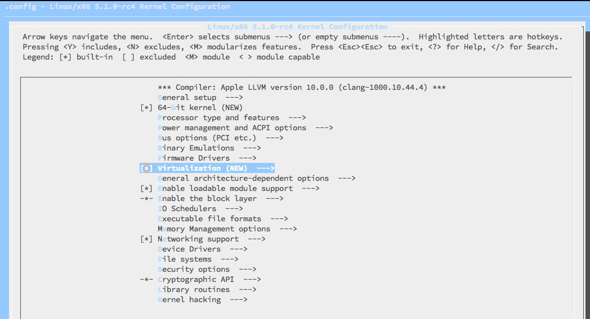
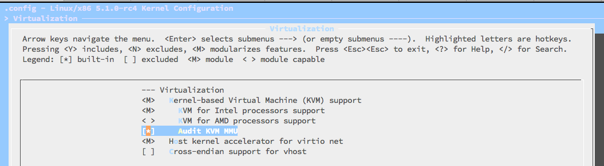

<!-- @import "[TOC]" {cmd="toc" depthFrom=1 depthTo=6 orderedList=false} -->

<!-- code_chunk_output -->

- [1. 下载 KVM 源代码](#1-下载-kvm-源代码)
  - [1.1. 下载 kvm.git](#11-下载-kvmgit)
  - [1.2. 下载 linux.git](#12-下载-linuxgit)
  - [1.3. 下载 Linux 的 Tarball (打包工具的意思)](#13-下载-linux-的-tarball-打包工具的意思)
  - [1.4. 通过 kernel.org 的镜像站点下载](#14-通过-kernelorg-的镜像站点下载)
- [2. 配置 KVM](#2-配置-kvm)
  - [2.1. make help](#21-make-help)
    - [2.1.1. make config](#211-make-config)
    - [2.1.2. make oldconfig](#212-make-oldconfig)
    - [2.1.3. make silentoldconfig](#213-make-silentoldconfig)
    - [2.1.4. make menuconfig](#214-make-menuconfig)
    - [2.1.5. make xconfig](#215-make-xconfig)
    - [2.1.6. make gconfig](#216-make-gconfig)
    - [2.1.7. make defconfig](#217-make-defconfig)
    - [2.1.8. make allyesconfig](#218-make-allyesconfig)
    - [2.1.9. make allnoconfig](#219-make-allnoconfig)
    - [2.1.10. make allmodconfig](#2110-make-allmodconfig)
    - [2.1.11. make localmodconfig](#2111-make-localmodconfig)
  - [2.2. make menuconfig](#22-make-menuconfig)
- [3. 编译 KVM](#3-编译-kvm)
  - [3.1. 编译 kernel](#31-编译-kernel)
  - [3.2. 编译 bzImage](#32-编译-bzimage)
  - [3.3. 编译 modules](#33-编译-modules)
- [4. 安装 KVM](#4-安装-kvm)
  - [4.1. 安装 module](#41-安装-module)
  - [4.2. 安装 kernel 和 initramfs](#42-安装-kernel-和-initramfs)
- [5. 确认内核模块加载成功](#5-确认内核模块加载成功)

<!-- /code_chunk_output -->

# 1. 下载 KVM 源代码

KVM 作为 Linux kernel 中的一个 module 而存在, 是从 Linux2.6.20 版本开始被完全正式加入到内核的主干开发和正式发布代码中. 所以, 只需要下载 2.6.20 版本之后**Linux kernel 代码**即可编译和使用 KVM. 如果是学习 KVM, 推荐使用最新正式发布或者正在开发中的 kernel 版本.

下载最新 KVM 源代码, 主要有如下三种方式:

- 下载 KVM 项目开发中的代码仓库 kvm.git.
- 下载 Linux 内核的代码仓库 linux.git.
- 打包下载 Linux 内核的源代码(Tarball 格式).

## 1.1. 下载 kvm.git

**KVM 项目的代码**是托管在**Linux 内核官方源码网站** http://git.kernel.org 上的, 可以到上面去查看和下载.

该网页上 virt/kvm/kvm.git 即是 KVM 项目的代码, 它是**最新的功能最丰富的 KVM 源代码库**(尽管并非最稳定的).

目前, kvm.git 的最主要维护者(maintainer)是来自 Redhat 公司的 Radim Krcmár 和 Paolo Bonzini.

从 http://git.kernel.org/?p=virt/kvm/kvm.git 网页可以看到, kvm.git 下载链接有如下 3 个 URL, 可用于下载最新的 KVM 的开发代码仓库.

```
git://git.kernel.org/pub/scm/virt/kvm/kvm.git
https://git.kernel.org/pub/scm/virt/kvm/kvm.git
https://kernel.googlesource.com/pub/scm/virt/kvm/kvm.git
```

## 1.2. 下载 linux.git

**Linux 内核**的官方网站为 http://kernel.org , 其中源代码管理网为 http://git.kernel.org , 可以在此网站上找到最新的 linux.git 代码.

在源码管理网站上, 我们看到有多个 linux.git , 我们选择 Linus Torvalds 的源码库(也即是**Linux 内核的主干**).

在内核源码的网页 http://git.kernel.org/?p=linux/kernel/git/torvalds/linux.git 中可以看到, 其源码仓库也有如下 3 个链接可用:

```
git://git.kernel.org/pub/scm/linux/kernel/git/torvalds/linux.git
https://git.kernel.org/pub/scm/linux/kernel/git/torvalds/linux.git
https://kernel.googlesource.com/pub/scm/linux/kernel/git/torvalds/linux.git
```

## 1.3. 下载 Linux 的 Tarball (打包工具的意思)

在 Linux 官方网站( http://kernel.org/ )上, 也提供 Linux 内核的 Tarball 文件下载; 除了在其首页上单击一些 Tarball 之外, 也可以到如下网址下载 Linux 内核的各个版本的 Tarball.

```
ftp://ftp.kernel.org/pub/linux/kernel/
http://www.kernel.org/pub/linux/kernel/
```

kernel.org 还提供一种 rsync 的方式下载, 此处不详细叙述, 请参见其官网首页的提示.

以用 wget 下载 linux\-4.8.1.tar.xz 为例, 命令行代码如下:

```
[root@kvm-host ~]# wget https://cdn.kernel.org/pub/linux/kernel/v4.x/linux-4.8.1.tar.xz
<!-此处省略输出->
```

## 1.4. 通过 kernel.org 的镜像站点下载

包括国内外的一些镜像站点

国内有名镜像站点有

- 清华大学开源镜像站:  http://mirror.tuna.tsinghua.edu.cn/ ,  其中的链接地址 http://mirror.tuna.tsinghua.edu.cn/kernel/linux/kernel/ 与 http://www.kernel.org/pub/linux/kernel/ 就是同步的, 用起来比较方便.

- 北京交通大学开源镜像站:
http://mirror.bjtu.edu.cn/kernel/linux/kernel/

还有如下两个镜像站可以推荐给大家:

- 网易开源镜像站, http://mirrors.163.com/

- 搜狐开源镜像站, http://mirrors.sohu.com/

# 2. 配置 KVM

上面方式下载的源代码都是可以**同样地进行配置和编译**, 本章以开发中的**最新源代码仓库 kvm.git**来讲解 KVM 的配置和编译等.

**KVM**是作为**Linux 内核**中的**一个 module**存在的, 而 **kvm.git** 是一个包含了**最新的 KVM 模块开发中代码**的完整的**Linux 内核源码仓库**.

它的配置方式, 与**普通的 Linux 内核配置**完全一样, 只是需要注意**将 KVM 相关的配置**选择为**编译进内核**或者**编译为模块**.

## 2.1. make help

在 kvm.git(Linux kernel)代码目录下, 运行"**make help**"命令可以得到一些关于如何配置和编译 kernel 的帮助手册, 命令行如下:

```
kvm git:(master) make help
Cleaning targets:
  clean		  - Remove most generated files but keep the config and
                    enough build support to build external modules
  mrproper	  - Remove all generated files + config + various backup files
  distclean	  - mrproper + remove editor backup and patch files

Configuration targets:
  config	  - Update current config utilising a line-oriented program
  nconfig         - Update current config utilising a ncurses menu based program
  menuconfig	  - Update current config utilising a menu based program
  xconfig	  - Update current config utilising a Qt based front-end
  gconfig	  - Update current config utilising a GTK+ based front-end
  oldconfig	  - Update current config utilising a provided .config as base
  localmodconfig  - Update current config disabling modules not loaded
  localyesconfig  - Update current config converting local mods to core
  defconfig	  - New config with default from ARCH supplied defconfig
  savedefconfig   - Save current config as ./defconfig (minimal config)
  allnoconfig	  - New config where all options are answered with no
  allyesconfig	  - New config where all options are accepted with yes
  allmodconfig	  - New config selecting modules when possible
  alldefconfig    - New config with all symbols set to default
  randconfig	  - New config with random answer to all options
  listnewconfig   - List new options
  olddefconfig	  - Same as oldconfig but sets new symbols to their
                    default value without prompting
  kvmconfig	  - Enable additional options for kvm guest kernel support
  xenconfig       - Enable additional options for xen dom0 and guest kernel support
  tinyconfig	  - Configure the tiniest possible kernel
  testconfig	  - Run Kconfig unit tests (requires python3 and pytest)

Other generic targets:
  all		  - Build all targets marked with [*]
* vmlinux	  - Build the bare kernel
* modules	  - Build all modules
  modules_install - Install all modules to INSTALL_MOD_PATH (default: /)
  dir/            - Build all files in dir and below
  dir/file.[ois]  - Build specified target only
  dir/file.ll     - Build the LLVM assembly file
                    (requires compiler support for LLVM assembly generation)
  dir/file.lst    - Build specified mixed source/assembly target only
                    (requires a recent binutils and recent build (System.map))
  dir/file.ko     - Build module including final link
  modules_prepare - Set up for building external modules
  tags/TAGS	  - Generate tags file for editors
  cscope	  - Generate cscope index
  gtags           - Generate GNU GLOBAL index
  kernelrelease	  - Output the release version string (use with make -s)
  kernelversion	  - Output the version stored in Makefile (use with make -s)
  image_name	  - Output the image name (use with make -s)
  headers_install - Install sanitised kernel headers to INSTALL_HDR_PATH
                    (default: ./usr)

Static analysers:
  checkstack      - Generate a list of stack hogs
  namespacecheck  - Name space analysis on compiled kernel
  versioncheck    - Sanity check on version.h usage
  includecheck    - Check for duplicate included header files
  export_report   - List the usages of all exported symbols
  headers_check   - Sanity check on exported headers
  headerdep       - Detect inclusion cycles in headers
  coccicheck      - Check with Coccinelle

Kernel selftest:
  kselftest       - Build and run kernel selftest (run as root)
                    Build, install, and boot kernel before
                    running kselftest on it
  kselftest-clean - Remove all generated kselftest files
  kselftest-merge - Merge all the config dependencies of kselftest to existing
                    .config.

Userspace tools targets:
  use "make tools/help"
  or  "cd tools; make help"

Kernel packaging:
  rpm-pkg             - Build both source and binary RPM kernel packages
  binrpm-pkg          - Build only the binary kernel RPM package
  deb-pkg             - Build both source and binary deb kernel packages
  bindeb-pkg          - Build only the binary kernel deb package
  snap-pkg            - Build only the binary kernel snap package (will connect to external hosts)
  tar-pkg             - Build the kernel as an uncompressed tarball
  targz-pkg           - Build the kernel as a gzip compressed tarball
  tarbz2-pkg          - Build the kernel as a bzip2 compressed tarball
  tarxz-pkg           - Build the kernel as a xz compressed tarball
  perf-tar-src-pkg    - Build perf-5.1.0-rc4.tar source tarball
  perf-targz-src-pkg  - Build perf-5.1.0-rc4.tar.gz source tarball
  perf-tarbz2-src-pkg - Build perf-5.1.0-rc4.tar.bz2 source tarball
  perf-tarxz-src-pkg  - Build perf-5.1.0-rc4.tar.xz source tarball

Documentation targets:
 Linux kernel internal documentation in different formats from ReST:
  htmldocs        - HTML
  latexdocs       - LaTeX
  pdfdocs         - PDF
  epubdocs        - EPUB
  xmldocs         - XML
  linkcheckdocs   - check for broken external links (will connect to external hosts)
  refcheckdocs    - check for references to non-existing files under Documentation
  cleandocs       - clean all generated files

  make SPHINXDIRS="s1 s2" [target] Generate only docs of folder s1, s2
  valid values for SPHINXDIRS are: admin-guide core-api crypto dev-tools doc-guide driver-api filesystems gpu input kernel-hacking maintainer media networking process sh sound userspace-api vm

  make SPHINX_CONF={conf-file} [target] use *additional* sphinx-build
  configuration. This is e.g. useful to build with nit-picking config.

  Default location for the generated documents is Documentation/output

Architecture specific targets (x86):
* bzImage      - Compressed kernel image (arch/x86/boot/bzImage)
  install      - Install kernel using
                  (your) ~/bin/installkernel or
                  (distribution) /sbin/installkernel or
                  install to $(INSTALL_PATH) and run lilo
  fdimage      - Create 1.4MB boot floppy image (arch/x86/boot/fdimage)
  fdimage144   - Create 1.4MB boot floppy image (arch/x86/boot/fdimage)
  fdimage288   - Create 2.8MB boot floppy image (arch/x86/boot/fdimage)
  isoimage     - Create a boot CD-ROM image (arch/x86/boot/image.iso)
                  bzdisk/fdimage*/isoimage also accept:
                  FDARGS="..."  arguments for the booted kernel
                  FDINITRD=file initrd for the booted kernel

  i386_defconfig           - Build for i386
  x86_64_defconfig         - Build for x86_64

  make V=0|1 [targets] 0 => quiet build (default), 1 => verbose build
  make V=2   [targets] 2 => give reason for rebuild of target
  make O=dir [targets] Locate all output files in "dir", including .config
  make C=1   [targets] Check re-compiled c source with $CHECK (sparse by default)
  make C=2   [targets] Force check of all c source with $CHECK
  make RECORDMCOUNT_WARN=1 [targets] Warn about ignored mcount sections
  make W=n   [targets] Enable extra gcc checks, n=1,2,3 where
		1: warnings which may be relevant and do not occur too often
		2: warnings which occur quite often but may still be relevant
		3: more obscure warnings, can most likely be ignored
		Multiple levels can be combined with W=12 or W=123

Execute "make" or "make all" to build all targets marked with [*]
For further info see the ./README file
```

对 KVM 或 Linux 内核配置时常用的配置命令的一些解释如下:

### 2.1.1. make config

基于文本的最为传统的也是最为枯燥的一种配置方式, 但是它可以适用于任何情况之下.

这种方式会为**每一个内核支持的特性**向用户提问,

- 如果用户回答"**y**", 则把特性**编译进内核**;
- 回答"**m**", 则把特性**作为模块**进行编译;
- 回答"**n**", 则表示**不对该特性提供支持**;
- 输入"**?**", 则显示该选项的**帮助信息**.

### 2.1.2. make oldconfig

make oldconfig 和 make config 类似, 但是它的作用是在**现有的内核设置文件！！！** 基础上**建立一个新的设置文件**, 只会向用户提供有关**新内核特性**的问题.

在**新内核升级**的过程中, make oldconfig 非常有用,

1. 用户将**现有的配置文件.config**复制到**新内核的源码**中,

2. 执行 make oldconfig, 此时, 用户只需要回答那些**针对新增特性**的问题.

### 2.1.3. make silentoldconfig

和上面 make oldconfig 一样, 但在屏幕上不再出现已在.config 中配置好的选项.

### 2.1.4. make menuconfig

基于终端的一种配置方式, 提供了文本模式的图形用户界面, 用户可以通过光标移动来浏览所支持的各种特性.

使用这用配置方式时, 系统中必须安装有**ncurses 库**, 否则会显示"Unable to find the ncurses libraries"的错误提示.

其中"y"、"n"、"m"、"?"键的选择功能与前面 make config 中介绍的一致.

### 2.1.5. make xconfig

基于**XWindow**的一种配置方式, 提供了漂亮的配置窗口, 不过只有能够在**X Server**上运行**X 桌面应用程序时**才能够使用, 它依赖于**QT**, 如果系统中没有安装 QT 库, 则会出现"Unable to find any QT installation"的错误提示.

### 2.1.6. make gconfig

与 make xconfig 类似, 不同的是 make gconfig 依赖于**GTK 库**.

### 2.1.7. make defconfig

按照内核代码中提供的**默认配置文件**对内核进行配置(在 Intel x86\_64 平台上, 默认配置为**arch/x86/configs/x86\_64\_defconfig**).

生成.**config**文件可以用作**初始化配置**, 然后再使用 make menuconfig 进行定制化配置.

### 2.1.8. make allyesconfig

尽可能多地使用"**y**"设置内核选项值, 生成的配置中包含了**全部的内核特性**.

### 2.1.9. make allnoconfig

除**必须的选项**外, 其他选项一律不选(常用于**嵌入式 Linux 系统**的编译).

### 2.1.10. make allmodconfig

尽可能多地使用"**m**"设置内核选项值来**生成配置文件**.

### 2.1.11. make localmodconfig

会执行**lsmod 命令**查看**当前系统**中加载了哪些模块(Modules), 并将原来的.config 中不需要的模块去掉, **仅保留前面 lsmod 命令**查出来的**这些模块**, 从而简化了内核的配置过程.

这样做确实方便了很多, 但是也有个缺点: 该方法仅能使编译出的内核支持**当前内核已经加载的模块**. 因为该方法使用的是 lsmod 查询得到的结果, 如果有的模块当前没有加载, 那么就不会编到新的内核中.

## 2.2. make menuconfig

下面以 make menuconfig 为例介绍一下如何选择 KVM 相关的配置.

运行 make menuconfig 后显示的界面如图所示.



选择了 Virtualization 之后, 进入其中进行详细配置, 包括选中 KVM、选中对处理器的支持(比如: KVM for Intel processors support, KVM for AMD processors support)等, 如图所示.



提示: 为了确保生成的.config 文件生成的 kernel 是实际可以工作的(**直接 make defconfig**生成的.config 文件编译出来的 kernel 常常是**不能工作**的), 最佳实践是以你**当前使用的 config**(比如, 我们安装好 RHEL 7.3 的 OS 以后, /boot/config\-3.10.0\-xxx.x86\_64)为基础, 将它**复制**到你的 linux 目录下, 重命名为.config, 然后通过**make olddefconfig**(也可以执行**make menuconfig**)更新补充一下这个.config.

在配置完成之后, 就会在 kvm.git 的目录下面生成一个.config 文件, 最好检查一下 KVM 相关的配置是否正确. 在本次配置中, 与 KVM 直接相关的几个配置项的主要情况如下:

```
CONFIG_HAVE_KVM=y
CONFIG_HAVE_KVM_IRQCHIP=y
CONFIG_HAVE_KVM_EVENTFD=y
CONFIG_KVM_APIC_ARCHITECTURE=y
CONFIG_KVM_MMIO=y
CONFIG_KVM_ASYNC_PF=y
CONFIG_HAVE_KVM_MSI=y
CONFIG_VIRTUALIZATION=y
CONFIG_KVM=m
CONFIG_KVM_INTEL=m
# CONFIG_KVM_AMD is not set
CONFIG_KVM_MMU_AUDIT=y
```

# 3. 编译 KVM

KVM 编译过程就完全是一个**普通 Linux 内核编译过程**, 需要经过

- 编译 kernel
- 编译 bzImage
- 编译 module

**编译 bzImage**这一步**不是必须的**, 在本章示例中, **config**中使用了**initramfs**, 所以这里**需要这个 bzImage 用于生成 initramfs image**.

根据 Makefile 中的定义可以看出, 直接执行"**make**"或"**make all**"命令就可以将这里提及的**3 个步骤全部包括在内**.

## 3.1. 编译 kernel

第一步, 编译 kernel 的命令为"make vmlinux", 如下:

```
# make vmlinux -j 20
```

编译命令中"-j"参数并非必须的, 它是让 make 工具用多进程来编译, 比如上面命令中提到的"-j 20", 会让 make 工具最多创建 20 个 GCC 进程同时来执行编译任务.

在一个比较空闲的系统上面, 有一个推荐值作为-j 参数的值, 即大约为 2 倍于系统上的 CPU 的 core 的数量(CPU 超线程也算 core).

## 3.2. 编译 bzImage

第二步, 执行编译 bzImage 的命令"make bzImage", 其输出为:

```
make bzImage -j 20
```

## 3.3. 编译 modules

第三步, 编译内核的模块, 命令为"make modules", 输出如下:

```
make modules -j 20
```

# 4. 安装 KVM

KVM 安装包括两步骤:

- module 安装
- kernel 与 initramfs 的安装.

## 4.1. 安装 module

通过 "`make modules_install`" 命令可以将**编译好的 module**安装到**相应的目录**之中, 在**默认**情况下 module 被安装到 `/lib/modules/$kernel_version/kernel` 目录之中.

```
make modules_install
```

安装好 module 之后, 可以查看下相应的安装路径, 可以看到 kvm 模块已经安装. 如下:

```
# ll /lib/modules/4.8.0+/kernel/

# ls /lib/modules/4.8.0+/kernel/arch/x86/kvm/
kvm-intel.ko kvm.ko
```

## 4.2. 安装 kernel 和 initramfs

通过"make install"可以安装 kernel 和 initramfs, 命令输出如下:

```
# make install

# ll /boot/
```

可见, 在 `/boot` 目录下生成了**内核(vmlinuz**)和**initramfs**等内核启动所需的文件.

在运行 make install 之后, grub 配置文件(如: /boot/grub/grub.conf)中也自动添加了一个 grub 选项, 如下所示:

```
menuentry 'Redhat Enterprise Linux Server (4.8.0+) 7.2 (Maipo)' ... {
    load_video
    insmod gzio
    insmod part_msdos
    insmod xfs
    set root='hd1,msdos1'
    if [ x$feature_platform_search_hint = xy ]; then
        search --no-floppy --fs-uuid --set=root --hint-bios=hd1,msdos1 --hint-efi=hd1, msdos1 --hint-baremetal=ahci1,msdos1  da2e2d53-4b33-4bfe-a649- 73fba55a7a9d
    else
        search --no-floppy --fs-uuid --set=root da2e2d53-4b33-4bfe-a649-73fba55a7a9d
    fi
    linux16 /vmlinuz-4.8.0+ root=/dev/mapper/rhel-root ro rd.lvm.lv=rhel/root crashkernel=auto rd.lvm.lv=rhel/swap vconsole.font=latarcyrheb-sun16 vconsole.keymap=us rhgb /dev/disk/by-uuid/19d79b0d-898f-4d34-a895-c842fa65e9b9 LANG=en_US.UTF-8 console=ttyS0,115200 console=tty0 intel_iommu=on
    initrd16 /initramfs-4.8.0+.img
}
```

检查了 grub 之后, 重新启动系统, 选择刚才为了 KVM 而编译、安装的内核启动.

# 5. 确认内核模块加载成功

系统启动后, 登录进入系统, 在通常情况下, 系统启动时**默认**已经加载了**kvm**和**kvm\_intel**这两个模块; 如果没有加载, 请手动用 modprobe 命令依次加载 kvm 和 kvm\_intel 模块.

```
[root@kvm-host kvm]# ll /sys/module/ | grep kvm
drwxr-xr-x 6 root root 0 Nov 13 10:12 kvm
drwxr-xr-x 6 root root 0 Nov 13 10:12 kvm_intel
[root@kvm-host kvm]# modprobe kvm
[root@kvm-host kvm]# modprobe kvm_intel
[root@kvm-host kvm]# lsmod | grep kvm
kvm_intel             192512  0
kvm                   577536  1 kvm_intel
```

确认 KVM 相关的模块加载成功后, 检查 `/dev/kvm` 这个文件, 它是 kvm 内核模块提供给用户空间的 qemu-kvm 程序使用的一个控制接口, 它提供了客户机(Guest)操作系统运行所需要的模拟和实际的硬件设备环境.