<!-- @import "[TOC]" {cmd="toc" depthFrom=1 depthTo=6 orderedList=false} -->

<!-- code_chunk_output -->

- [1. 用 QEMU 实现的网络模式](#1-用-qemu-实现的网络模式)
  - [1.1. 统一的设备模型参数](#11-统一的设备模型参数)
- [2. 使用直接的网桥模式](#2-使用直接的网桥模式)
  - [2.1. virt-manager/libvirt 配置后端](#21-virt-managerlibvirt-配置后端)
  - [2.2. qemu 命令行配置后端参数](#22-qemu-命令行配置后端参数)
  - [2.3. 网桥方式的网络配置](#23-网桥方式的网络配置)
    - [2.3.1. 配置过程](#231-配置过程)
    - [2.3.2. 状态确认](#232-状态确认)
    - [2.3.3. 新的网桥模式配置选项](#233-新的网桥模式配置选项)
- [3. 用网桥实现 NAT 模式](#3-用网桥实现-nat-模式)
  - [3.1. 网络配置](#31-网络配置)
- [4. QEMU 内部的用户模式网络](#4-qemu-内部的用户模式网络)
- [5. 其他网络选项](#5-其他网络选项)

<!-- /code_chunk_output -->

# 1. 用 QEMU 实现的网络模式

网络是现代计算机系统不可或缺的一部分, QEMU 也对虚拟机提供了丰富的网络支持. 通过 QEMU 的支持, 常见的可以实现以下 4 种网络形式:

1) 基于网桥(bridge)的虚拟网络.

2) 基于 NAT(Network Addresss Translation)的虚拟网络.

3) **QEMU 内置！！！** 的**用户模式网络**(user mode networking).

4) 直接分配网络设备从而直接接入物理网络(包括 VT\-d 和 SR\-IOV).

这里主要讲述前 3 种模式, 第 4 种网络设备的直接分配将在第 6 章中详细讲述. 除了特别的需要 iptables 配置端口映射、数据包转发规则的情况, **一般默认将防火墙所有规则都关闭**, 以避免妨碍客户机中的网络畅通. 在实际生产环境中, 可根据实际系统的特点进行配置.

在 qemu 命令行中, 对**客户机网络**的配置(**除了网络设备直接分配**之外)都是用"\-**net**"参数进行配置的, 如果没有设置任何的"\-net"参数, 则**默认**使用"\-**net nic \-net user**"参数, 进而使用完全基于**QEMU 内部实现的用户模式**下的网络协议栈(将在 5.5.4 节详细介绍).

## 1.1. 统一的设备模型参数

在新的 QEMU 中, 推荐用\-**device** \+ \-**netdev**组合的方式.

因为 QEMU 正逐渐**规范统一的设备模型的参数**使用:

- \-**device**囊括了**所有 QEMU 模拟的前端！！！** 的参数指定, 也就是**客户机**里看到的**设备**(包括本章的网卡设备);
- \-**netdev**指定的是**网卡模拟的后端方式！！！**, 也就是本节后面要讲的各种**QEMU 实现网络的方式！！！**.

本书沿用上一版的用法, 依然保留**传统的\-net \+ \-net**的参数组合, 但同时也会介绍等价的新方式的参数方法.

**QEMU！！！** 提供了对一系列主流和兼容性良好的网卡的模拟, 通过"\-**net nic, model**=\?"参数可以查询到当前的 QEMU 工具实现了哪些网卡的模拟. 如以下实验所示:

```
[root@gerrylee ~]# qemu-system-x86_64 -net nic,model=?
Supported NIC models:
e1000
e1000-82544gc
e1000-82545em
e1000e
i82550
i82551
i82557a
i82557b
i82557c
i82558a
i82558b
i82559a
i82559b
i82559c
i82559er
i82562
i82801
ne2k_pci
pcnet
rocker
rtl8139
virtio-net-pci
virtio-net-pci-non-transitional
virtio-net-pci-transitional
vmxnet3
```

"e1000"是提供 Intel e1000 系列的网卡模拟, 如果不显式指定, QEMU**默认**就是模拟**Intel e1000 系列**的虚拟网卡.

而**virtio 类型**是 QEMU 对**半虚拟化 I/O(virtio)驱动**的支持(将会在第 6 章中详细介绍 virtio 的基本原理、配置和使用).

qemu 命令行在**不加任何网络相关的参数**启动客户机后, 在客户机中可以看到它有一个默认的 e1000 系列的网卡, 使用的是**用户模式的网络**, 其功能非常有限(将在 5.5.4 节中详述).

在**客户机**中看到的 e1000 系列网卡如下所示, **默认**是**Intel 82540EM 系列的网卡**.

```
[root@kvm-guest ~]# lspci | grep Eth
00:03.0 Ethernet controller: Intel Corporation 82540EM Gigabit Ethernet Controller (rev 03)
```

在 QEMU monitor 中用"**info qtree**"可以看到它的被模拟的详细信息.

```
...
dev: e1000, id ""
     mac = "52:54:00:12:34:56"
     vlan = 0
     netdev = "hub0port0"
     autonegotiation = true
     mitigation = true
     extra_mac_registers = true
     addr = 03.0
     romfile = "efi-e1000.rom"
     rombar = 1 (0x1)
     multifunction = false
     command_serr_enable = true
     x-pcie-lnksta-dllla = true
     class Ethernet controller, addr 00:03.0, pci id 8086:100e (sub 1af4:1100)
     bar 0: mem at 0xfebc0000 [0xfebdffff]
     bar 1: i/o at 0xc000 [0xc03f]
     bar 6: mem at 0xffffffffffffffff [0x3fffe]
......
```

qemu 命令行中基本的"\-**net"参数**的细节如下:

```
-net nic[,vlan=n][,macaddr=mac][,model=type][,name=name][,addr=addr][,vectors=v]
```

执行这个命令行会让 QEMU 模拟出一块网卡, 并将其连接到**VLAN n**上.

其中:

- "\-**net nic**"是**必需的参数**, 表明这是一个**网卡的配置**.
- **vlan=n**, 表示**将网卡连入 VLAN n**, 默认为**0**(即**没有 VLAN**).
- **macaddr=mac**, 设置**网卡的 MAC 地址**, **默认**根据**宿主机中网卡**的地址来分配. 若局域网中客户机太多, 建议自己设置 MAC 地址, 以防止 MAC 地址冲突. 请大家在实际使用中最好配置自己的 MAC 地址, 否则 QEMU 会默认分配一个相同的 MAC 地址(如前面 info qtree 代码中看到的 52: 54: 00: 12: 34: 56), 几个虚拟机同时运行则可能会通过 DHCP 分配到相同的 IP, 从而引发 IP 地址冲突.
- model=type, 设置**模拟的网卡的类型**, 默认为 e1000.
- name=name, 为网卡设置一个易读的名称, 该名称仅在 QEMU monitor 中可能用到.
- addr=addr, 设置网卡在**客户机**中的**PCI 设备地址为 addr**.
- vectors=v, 设置该网卡设备的**MSI\-X 向量的数量为 v**, 该选项仅对使用**virtio 驱动的网卡有效**. 设置为"vectors=0"是关闭 virtio 网卡的 MSI\-X 中断方式.

如果需要向一个客户机提供**多个网卡**, 可以**多次使用"\-net"参数**.

在宿主机中用如下命令行启动一个客户机, 并使用上面的一些网络参数.

```
[root@kvm-host ~]# qemu-system-x86_64 -m 1024 rhel7.img -net nic,vlan=0,macaddr=52:54:00:12:34:22,model=e1000,addr=08 –net user
```

在客户机中用一些工具查看网卡相关的信息如下(这里使用了用户模式的网络栈, 其详细介绍可参考 5.5.4 节), 由此可知上面的网络设置都已生效.

```
[root@kvm-guest ~]# lspci | grep Eth
00:08.0 Ethernet controller: Intel Corporation 82540EM Gigabit Ethernet Controller (rev 03)
[root@kvm-guest ~]# ethtool -i eth1
driver: e1000
version: 7.3.21-k8-NAPI
firmware-version:
bus-info: 0000:00:08.0
[root@kvm-guest ~]# ifconfig
eth1      Link encap:Ethernet  HWaddr 52:54:00:12:34:22
          inet addr:10.0.2.15  Bcast:10.0.2.255  Mask:255.255.255.0
          inet6 addr: fe80::5054:ff:fe12:3422/64 Scope:Link
          UP BROADCAST RUNNING MULTICAST  MTU:1500  Metric:1
          RX packets:10 errors:0 dropped:0 overruns:0 frame:0
          TX packets:47 errors:0 dropped:0 overruns:0 carrier:0
          collisions:0 txqueuelen:1000
          RX bytes:1890 (1.8 KiB)  TX bytes:6380 (6.2 KiB)

lo        Link encap:Local Loopback
          inet addr:127.0.0.1  Mask:255.0.0.0
          inet6 addr: ::1/128 Scope:Host
          UP LOOPBACK RUNNING  MTU:16436  Metric:1
          RX packets:12 errors:0 dropped:0 overruns:0 frame:0
          TX packets:12 errors:0 dropped:0 overruns:0 carrier:0
          collisions:0 txqueuelen:0
          RX bytes:720 (720.0 b)  TX bytes:720 (720.0 b)
```

在 QEMU monitor 中查看网络的信息, 如下:

```
(qemu) info network
VLAN 0 devices:
    user.0: type=user,net=10.0.2.0,restrict=off
   e1000.0: type=nic,model=e1000,macaddr=52:54:00:12:34:22
Devices not on any VLAN:
```

# 2. 使用直接的网桥模式

在 QEMU/KVM 的网络使用中, **网桥(bridge**)模式可以让**客户机**和**宿主机**共享一个**物理网络设备**连接网络, **客户机**有自己的**独立 IP 地址**, 可以直接连接与宿主机一模一样的网络, 客户机可以访问**外部网络**, 外部网络也可以直接访问客户机(就像访问普通物理主机一样).

即使宿主机只有一个网卡设备, 使用 bridge 模式也可让多个客户机与宿主机共享网络设备. bridge 模式使用非常方便, 应用也非常广泛.

## 2.1. virt-manager/libvirt 配置后端

**virt\-manager/libvirt 创建网络时**, Network source(也就是**后端**)的"**Specify shared device name**"方式, 就是由**QEMU 的 bridge 方式**来实现的, 如图 5\-6 所示.

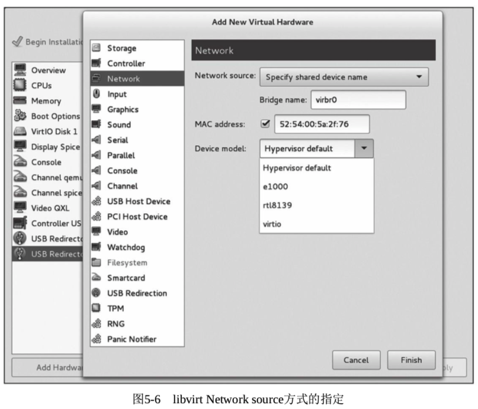

## 2.2. qemu 命令行配置后端参数

在 qemu 命令行中, 关于配置**bridge 模式**的网络(**后端**)参数如下:

```
-netdev tap,id=id[,fd=h][,ifname=name][,script=file][,downscript=dfile][,helper=helper]
```

或者,

```
-net tap[,vlan=n][,name=name][,fd=h][,ifname=name][,script=file][,downscript=dfile][,helper=helper]
```

这两个配置方法效果等价, 但用于不同场合:

- \-**netdev** tap, id=id\[, ...]与\-**device**参数配套使用.
- \-**net** tap\[, ...]与\-**net nic**参数配套使用.

第 2 种方法可以认为是第一种的简化版, 因为免去了后端设备 id 的指定. 如果不小心搞错了, 以"\-net nic[, ...]\+\-netdev tap, id=id[, ...]"这样组合来配置网卡, QEMU 会报如下错误, 以为\-netdev 指定的后端设备找不到前端设备与它配对.

```
(qemu) Warning: vlan 0 is not connected to host network
Warning: netdev tapdev0 has no peer
```

无论哪种组合方式都表示创建或者使用宿主机的**TAP 网络接口**与"\-**net nic**"模拟给**客户机**的**前端网卡**相连, 并将其**连接到 VLAN n**中. 使用**file**和**dfile**两个脚本分别在**启动客户机时配置网络**和在**关闭客户机时取消网络配置**, 使用 helper 程序帮助在非 root 权限的情况下创建配置上述网络设备.

- tap 参数, 表明**使用 TAP 设备**. TAP 是**虚拟网络设备**, 它仿真了一个**数据链路层设备**(ISO 七层网络结构的第 2 层), 它像一个网桥一样处理**第 2 层数据报**. 而 TUN 与 TAP 类似, 也是一种**虚拟网络设备**, 它是对网络层设备的仿真. TAP 用于**创建一个网桥**, 而**TUN**则与**路由相关**(工作在**IP 层**).
- vlan=n, 设置该设备连入 VLAN n, 默认值为 0(即没有 VLAN).
- name=name, 设置名称, 在 QEMU monior 中可能用到, 一般由系统自动分配即可. 与后面"ifname=name"的 name 没有关系.
- fd=h, 连接到现在已经打开着的 TAP 接口的文件描述符. 一般不要设置该选项, 而是让 QEMU 自动创建一个 TAP 接口. 在使用了 fd=h 选项后, ifname、script、downscript、helper、vnet\_hdr 等选项都不可用了(不能与 fd 选项同时出现在命令行中).
- ifname=name, 设置在宿主机中添加的 TAP 虚拟设备的名称(如 tap1、tap5 等). 当不设置这个参数时, QEMU 会根据系统中目前的情况, 产生一个 TAP 接口的名称.
- script=file, 设置宿主机在启动客户机时自动执行的网络配置脚本. 如果不指定, 其默认值为"/etc/qemu\-ifup"这个脚本. 可指定自己的脚本路径以取代默认值; 如果不需要执行脚本, 则设置为"script=no".
- downscript=dfile, 设置宿主机在客户机关闭时自动执行的网络配置脚本. 如果不设置, 其默认值为"/etc/qemu\-ifdown"; 若客户机关闭时宿主机不需要执行脚本, 则设置为"downscript=no".
- helper=helper, 设置启动客户机时在宿主机中运行的辅助程序, 包括建立一个 TAP 虚拟设备, 默认值为/usr/local/libexec/qemu\-bridge\-helper. 此处一般不用定义.

## 2.3. 网桥方式的网络配置

上面介绍了使用 TAP 设备的一些选项, 接下来通过在宿主机中执行如下步骤来实现网桥方式的网络配置.

### 2.3.1. 配置过程

1)要采用**bridge 模式**的网络配置, 首先需要安装**bridge\-utils 软件包**, 它提供 brctl 工具, 用于配置网桥.

```
[root@kvm-host ~]# yum install bridge-utils tunctl
```

2)查看 tun 模块和 bridge 模块是否加载, 如下:

```
[root@gerrylee ~]# lsmod | grep tun
tun                    31740  1
[root@gerrylee ~]# lsmod | grep bridge
bridge                151336  0
stp                    12976  1 bridge
llc                    14552  2 stp,bridge
```

如果 tun 模块没有加载, 则运行"modprobe tun"命令来加载. 当然, 如果已经将 tun 编译到内核(可查看内核 config 文件中是否有"**CONFIG_TUN=y**"选项), 则**不需要加载**了. 如果内核完全没有配置 TUN 模块, 则需要**重新编译内核**才行.

3)检查/dev/net/tun 的权限, 需要让当前用户拥有可读写的权限.

```
[root@gerrylee ~]# ll /dev/net/tun
crw-rw-rw- 1 root root 10, 200 5 月  21 10:13 /dev/net/tun
```

4)**建立一个 bridge**, 并将其绑定到一个可以**正常工作的网络接口**上, 同时让 bridge 成为连接本机与外部网络的接口. 主要的配置命令如下:

```
[root@kvm-host ~]# brctl addbr virbr0    #添加 virbr0 这个 bridge
```

创建 virbr0 的接口配置文件如下(/etc/sysconfig/network\-scripts/ifcfg\-virbr0), 与其他物理的接口一样, 网桥也是一个虚拟的接口, 它也需要有自己的接口配置文件. 系统启动的时候会根据这个配置文件来配置接口. 关于更多的 RHEL 系统的网络接口的配置, 可以参考其官方文档:

```
https://access.redhat.com/documentation/en-US/Red_Hat_Enterprise_Linux/7/html/Networking_Guide/sec-Network_Bridging_Using_the_Command_Line_Interface.html#sec-Create_a_Network_Bridge
[root@kvm-host ~]# cat /etc/sysconfig/network-scripts/ifcfg-virbr0
DEVICE=virbr0
STP=yes      #STP 需要打开, 以防止环路
TYPE=Bridge   #指定这个接口类型是 bridge
BOOTPROTO=dhcp    #指定这个接口用 DHCP 方式启动
DEFROUTE=no       #在笔者网络环境中, 不需要网桥成为默认路由的出口
PEERDNS=yes
PEERROUTES=yes
NAME="virbr0"
ONBOOT=yes      #系统启动时候自动启动
NM_CONTROLLED=no   #不要 network manager 来管
```

修改需要绑定到网桥的**物理接口(eno2**)的配置文件如下(它将成为**网桥**以及**连接到网桥的 Tap 接口**的与外界联系的**桥梁**):

```
[root@kvm-host ~]  # cat /etc/sysconfig/network-scripts/ifcfg-eno2
TYPE=Ethernet
BOOTPROTO=none   #作为网桥的 slave 接口, 不需要 boot protocol
DEFROUTE=no   #同网桥设置, 不需要 default 路由
NAME=eno2
UUID=d51cac95-203b-46c1-8c27-5fd935323c1c  #这个不是必需的
DEVICE=eno2
ONBOOT=yes
PEERDNS=yes
PEERROUTES=yes
BRIDGE=virbr0   #这个非常重要, 指定这个接口成为哪个网桥的 slave
NM_CONTROLLED=no
```

此时, 我们看到网桥(virbr0)还是**没有 slave 接口**的.

```
[root@kvm-host ~]# brctl show
bridge name     bridge id               STP enabled     interfaces
virbr0          8000.000000000000       yes
```

我们用**brctl 工具**将**eno2 绑定到 virbr0**上.

```
[root@kvm-host ~]# brctl addif virbr0 eno2
[root@kvm-host ~]# brctl show virbr0
bridge name     bridge id               STP enabled     interfaces
virbr0          8000.001e67afe8a4       yes             eno2
```

最后, 我们将**网桥接口 up 起来**, 它就获得**IP 地址**并与**外部网络连通**了.

进一步地, 当有**客户机启动**, QEMU 创建的**tap 设备绑定到网桥上**以后, 客户机也就和外部网络连通了.

```
[root@kvm-host ~]# ifup virbr0

Determining IP information for virbr0... done.
[root@kvm-host ~]# ifconfig virbr0
virbr0: flags=4163<UP,BROADCAST,RUNNING,MULTICAST>  mtu 1500
        inet 192.168.102.168  netmask 255.255.252.0  broadcast 192.168.103.255
        inet6 fe80::21e:67ff:feaf:e8a4  prefixlen 64  scopeid 0x20<link>
        ether 00:1e:67:af:e8:a4  txqueuelen 0  (Ethernet)
        RX packets 528  bytes 40646 (39.6 KiB)
        RX errors 0  dropped 0  overruns 0  frame 0
        TX packets 29  bytes 4751 (4.6 KiB)
        TX errors 0  dropped 0 overruns 0  carrier 0  collisions 0
```

此时, 作为**网桥接口的附庸(slave**), **eno2 接口**是**没有自己的 IP 地址**的, **网桥**寄生在**它身上(与它的 MAC 地址相同**), 与外界通讯.

```
[root@kvm-host ~]# ifconfig eno2
eno2: flags=4163<UP,BROADCAST,RUNNING,MULTICAST>  mtu 1500
      inet6 fe80::21e:67ff:feaf:e8a4  prefixlen 64  scopeid 0x20<link>
      ether 00:1e:67:af:e8:a4  txqueuelen 1000  (Ethernet)
      RX packets 3473864  bytes 1853969607 (1.7 GiB)
      RX errors 0  dropped 0  overruns 0  frame 0
      TX packets 69  bytes 10672 (10.4 KiB)
      TX errors 0  dropped 0 overruns 0  carrier 0  collisions 0
      device memory 0xb1100000-b117ffff
```

上述网桥创建完成后, 笔者的主机上的接口逻辑拓扑如图 5\-7 所示.

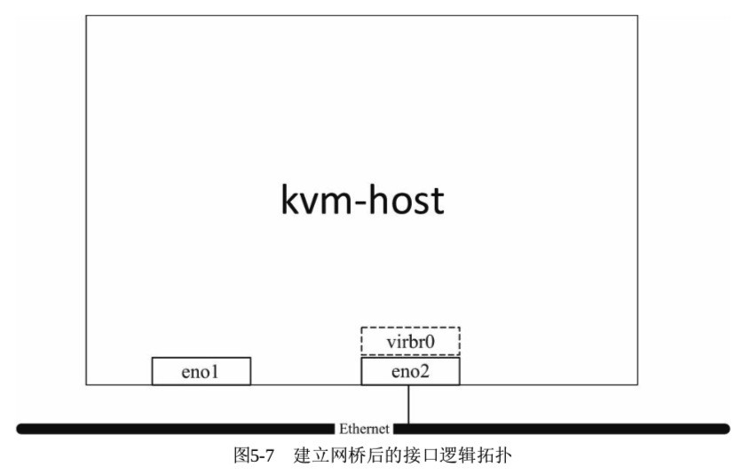

5)准备**qemu\-ifup**和**qemu\-ifdown 脚本**.

在客户机**启动网络前执行的脚本**是由"script"选项配置的(**默认为/etc/qemu\-ifup**). 该脚本的内容就是**将 QEMU 自动创建的 TAP 设备绑定到上一步创建好的网桥**上.

如下是 qemu\-ifup 脚本的示例, 其中"**$1**"是 QEMU 调用脚本时传入的参数, 它是**QEMU**为客户机创建的**TAP 设备**名称(前面提及的 ifname 选项的值或者系统自动选择的 tap0、tap1 等).

```
#!/bin/sh

switch=$(brctl show| sed -n 2p |awk '{print $1}')
/sbin/ifconfig $1 0.0.0.0 up
/usr/sbin/brctl addif ${switch} $1
```

由于**QEMU**在**客户机关闭！！！时**会**解除 TAP 设备的 bridge 绑定**, 也会**自动删除已不再使用的 TAP 设备**, 所以 qemu\-ifdown 这个**脚本不是必需**的, 最好设置为"**downscript=no**". 如下列出一个 qemu\-ifdown 脚本的示例, 是为了说明清理 bridge 模式网络环境的步骤, 在 QEMU 没有自动处理时可以使用.

```
#!/bin/bash
#This is a qemu-ifdown script for bridging.
#You can use it when starting a KVM guest with bridge mode network.
#Don't use this script in most cases; QEMU will handle it automatically.

switch=$(brctl show| sed -n 2p |awk '{print $1}')
if [ -n "$1" ]; then
        # Delete the specified interfacename
        tunctl -d $1
        #release TAP interface from bridge
        brctl delif ${switch} $1
        #shutdown the TAP interface
        ip link set $1 down
        exit 0
else
        echo "Error: no interface specified"
        exit 1
fi
```

6)用**qemu 命令行**启动 bridge 模式的网络.

在宿主机中, 用命令行启动客户机并检查 bridge 的状态, 如下:

```
[root@kvm-host ~]# qemu-system-x86_64 rhel7.img -enable-kvm -smp 4 -m 8G -net nic -net tap,script=/etc/qemu-ifup
[root@kvm-host ~]# brctl show
bridge name     bridge id               STP enabled     interfaces
virbr0          8000.001e67afe8a4       yes             eno2
                                                        tap0
[root@kvm-host ~]# ll /sys/devices/virtual/net/
total 0
drwxr-xr-x 5 root root 0 Nov 12 09:46 lo
drwxr-xr-x 6 root root 0 Nov 17 21:38 tap0
drwxr-xr-x 7 root root 0 Nov 17 20:54 virbr0
```

由上面信息可知, 在**创建客户机**后, 添加了一个名为**tap0 的 TAP 虚拟网络设备**, 将其**绑定在 br0 这个 bridge 上**.

查看到的**3 个虚拟网络设备**依次为: **网络回路设备 lo**(就是一般 IP 为**127.0.0.1 的设备**)、前面建立好的**bridge 设备 vibr0**、为客户机提供网络的**TAP 设备 tap0**.

### 2.3.2. 状态确认

在客户机中, 如下的几个命令用于检查网络是否配置好:

```
[root@kvm-guest ~]# ifconfig
ens3: flags=4163<UP,BROADCAST,RUNNING,MULTICAST>  mtu 1500
      inet 192.168.100.153  netmask 255.255.252.0  broadcast 192.168.103.255
      inet6 fe80::5054:ff:fe12:3456  prefixlen 64  scopeid 0x20<link>
      ether 52:54:00:12:34:56  txqueuelen 1000  (Ethernet)
      RX packets 672  bytes 78889 (77.0 KiB)
      RX errors 121  dropped 0  overruns 0  frame 121
      TX packets 132  bytes 17621 (17.2 KiB)
      TX errors 0  dropped 0 overruns 0  carrier 0  collisions 0

lo: flags=73<UP,LOOPBACK,RUNNING>  mtu 65536
    inet 127.0.0.1  netmask 255.0.0.0
    inet6 ::1  prefixlen 128  scopeid 0x10<host>
        loop  txqueuelen 0  (Local Loopback)
        RX packets 76  bytes 5948 (5.8 KiB)
        RX errors 0  dropped 0  overruns 0  frame 0
        TX packets 76  bytes 5948 (5.8 KiB)
        TX errors 0  dropped 0 overruns 0  carrier 0  collisions 0

virbr0: flags=4099<UP,BROADCAST,MULTICAST>  mtu 1500
        inet 192.168.122.1  netmask 255.255.255.0  broadcast 192.168.122.255
        ether 52:54:00:48:d8:d1  txqueuelen 0  (Ethernet)
        RX packets 0  bytes 0 (0.0 B)
        RX errors 0  dropped 0  overruns 0  frame 0
        TX packets 0  bytes 0 (0.0 B)
        TX errors 0  dropped 0 overruns 0  carrier 0  collisions 0
[root@kvm-guest ~]# route -n
Kernel IP routing table
Destination     Gateway         Genmask         Flags Metric Ref    Use Iface
0.0.0.0         192.168.100.1   0.0.0.0         UG    100    0        0 ens3
192.168.100.0   0.0.0.0         255.255.252.0   U     100    0        0 ens3
192.168.122.0   0.0.0.0         255.255.255.0   U     0      0        0 virbr0
[root@kvm-guest ~]# ping 192.168.100.1
PING 192.168.100.1 (192.168.100.1) 56(84) bytes of data.
64 bytes from 192.168.100.1: icmp_seq=1 ttl=255 time=0.560 ms
64 bytes from 192.168.100.1: icmp_seq=2 ttl=255 time=0.577 ms
^C
--- 192.168.100.1 ping statistics ---
2 packets transmitted, 2 received, 0% packet loss, time 1000ms
rtt min/avg/max/mdev = 0.560/0.568/0.577/0.025 ms
```

此时我们的客户机和主机之间的网络连接如图 5\-8 所示.

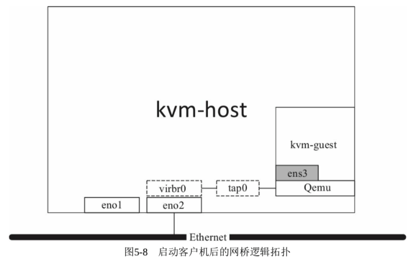

将**客户机关机**后, 在**宿主机**中再次查看 bridge 状态和虚拟网络设备的状态, 如下:

```
[root@kvm-host ~]# brctl show
bridge name     bridge id               STP enabled     interfaces
virbr0          8000.001e67afe8a4       yes             eno2
```

由上面的输出信息可知, QEMU 已经将 tap0 设备删除了.

### 2.3.3. 新的网桥模式配置选项

细心的读者会发现, 现在的 QEMU 已经有**更直接的网桥模式的配置选项**.

```
-netdev bridge,id=id[,br=bridge][,helper=helper]
```

或者,
```
-net bridge[,vlan=n][,name=name][,br=bridge][,helper=helper]
```

它们比上面的方式省掉了关于 tap name、script 等的参数指定, 而**只需要指定网桥**就可以了. 其他的都封装在**helper 程序**里面**自动**帮忙做掉了, 包括自**动命名**和**创建 tap 设备**、**自动启动 tap 设备**(即原来的 script 脚本要完成的工作)、**绑定网桥**等. 这些本来在多数应用场景中就不需要特别指定的.

下面两条启动命令与上面的完全等价:

```
qemu-system-x86_64 rhel7.img -enable-kvm -smp 4 -m 8G -net nic -net bridge,br=virbr0
```

或者,

```
qemu-system-x86_64 rhel7.img -enable-kvm -smp 4 -m 8G -device e1000,netdev=brdev0 -netdev bridge,id=brdev0,br=virbr0
```

# 3. 用网桥实现 NAT 模式

**NAT**(**Network Addresss Translation**, 网络地址转换)属于**广域网接入技术**的一种, 它将**内网地址转化为外网的合法 IP 地址**, 它被广泛应用于各种类型的 Internet 接入方式和各种类型的网络之中.

NAT 将来自**内网 IP 数据包**的**包头**中的**源 IP 地址**转换为一个**外网的 IP 地址**.

NAT 有助于**节约 IP 地址资源**. 另外, 通过 NAT 访问外部网络的内部主机, 其**内部 IP 对外是不可见的**, 这就隐藏了 NAT 内部网络拓扑结构和 IP 信息, 也就能够避免内部主机受到**外部网络的攻击**.

客观事物总是有正反两面性的, 没有任何技术是十全十美的. NAT 技术隐藏了内部主机细节, 从而提高了安全性. 但是如果 NAT 内的主机作为**Web 或数据库服务器**需要接受来自**外部网络的主动连接**, 这时 NAT 就表现出了**局限性**. 不过, 可以在**拥有外网 IP 的主机**上使用**iptables**等工具实现**端口映射**, 从而让外网将这个外网 IP 的一个端口的访问被重新映射到 NAT 内网的**某个主机的相应端口**上去.

在**QEMU/KVM**中, **默认**使用**IP 伪装的方式实现 NAT**, 而不是使用**SNAT(Source\-NAT**)或**DNAT(Destination\-NAT**)的方式.

图 5-9 展示了 KVM 中的 NAT 模式网络的结构图, 宿主机在**外网**的 IP 是**10.10.10.190**, 其上运行的**各个客户机**的 IP 属于**内网的网络段 192.168.122.0/24**.

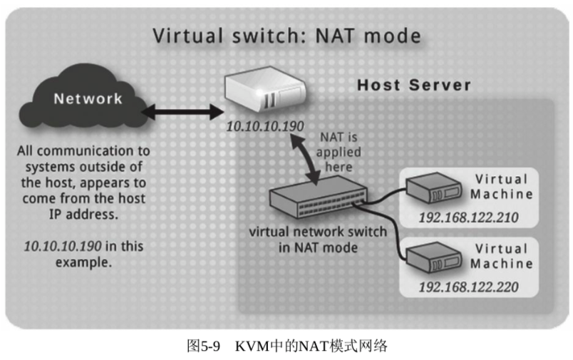

在 KVM 中配置客户机的 NAT 网络方式, 需要在**宿主机**中运行一个**DHCP 服务器**给**宿主机**分配**NAT 内网的 IP 地址**, 可以使用**dnsmasq 工具**来实现.

在**KVM**中, **DHCP 服务器**为客户机提供服务的基本架构如图 5\-10 所示.

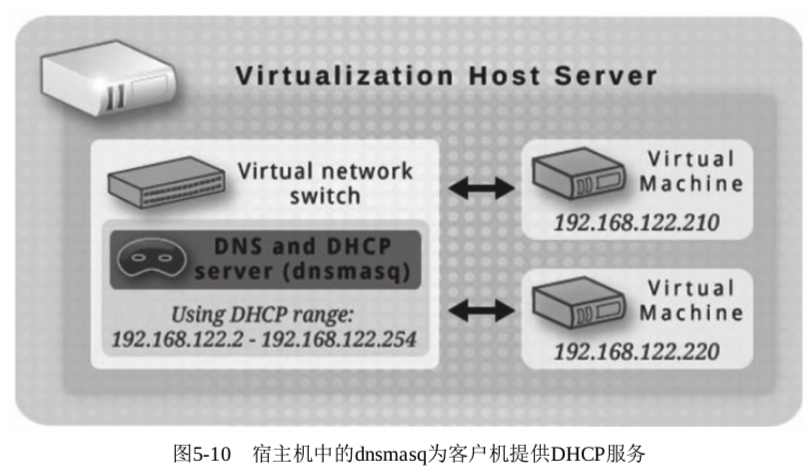

## 3.1. 网络配置

通过下面几步可以使客户机启动, 并以 NAT 方式配置好它的网络.

1)检查**宿主机内核编译的配置**, 将网络配置选项中与 NAT 相关的选项配置好, 否则在启动客户机使用 NAT 网络配置时可能会遇到类似如下错误提示, 因为无法按需加载"iptable\_nat"和"nf\_nat"等模块.

```
iptables v1.4.7: can't initialize iptables table `nat': Table does not exist (do you need to insmod?)
```

遇到这样的情况, 只能重新配置和编译内核了. 下面截取的一小段内核配置, 是一般情况下 NAT 的**部分相关配置**.

```
#
# IP: Netfilter Configuration
#
CONFIG_NF_DEFRAG_IPV4=m
CONFIG_NF_CONNTRACK_IPV4=m
CONFIG_NF_CONNTRACK_PROC_COMPAT=y
CONFIG_IP_NF_QUEUE=m
CONFIG_IP_NF_IPTABLES=m
CONFIG_IP_NF_MATCH_AH=m
CONFIG_IP_NF_MATCH_ECN=m
CONFIG_IP_NF_MATCH_RPFILTER=m
CONFIG_IP_NF_MATCH_TTL=m
CONFIG_IP_NF_FILTER=m
CONFIG_IP_NF_TARGET_REJECT=m
CONFIG_IP_NF_TARGET_ULOG=m
CONFIG_NF_NAT=m
CONFIG_NF_NAT_NEEDED=y
CONFIG_IP_NF_TARGET_MASQUERADE=m
CONFIG_IP_NF_TARGET_NETMAP=m
CONFIG_IP_NF_TARGET_REDIRECT=m
```

2)安装必要的软件包: **bridge\-utils**、**iptables**和**dnsmasq**等. 其中

- **bridge\-utils**包含**管理 bridge 的工具 brctl**
- **iptables**是对**内核网络协议栈**中**IPv4 包**的**过滤工具和 NAT 管理工具**,
- **dnsmasq**是一个**轻量级的 DHCP 和 DNS 服务器软件**.

当然, 如有其他满足类似功能的软件包, 也可以选用. 在宿主机中, 查看所需软件包的情况, 如下:

```
[root@kvm-host ~]# rpm -q bridge-utils
bridge-utils-1.5-9.el7.x86_64
[root@kvm-host ~]# rpm -q iptables
iptables-1.4.21-17.el7.x86_64
[root@kvm-host ~]# rpm -q dnsmasq
dnsmasq-2.66-21.el7.x86_64
```

3)准备一个为客户机建立 NAT 用的**qemu\-ifup 脚本**及关闭网络用的 qemu-ifdown 脚本. 这两个脚本中的 **$1**(传递给它们的**第 1 个参数**)就是在客户机中使用的网络接口在**宿主机！！！**中的**虚拟网络名称**(如 tap0、tap1 等).

其中, 在**启动客户机**时**建立网络的脚本示例**(/etc/qemu\-ifup\-NAT)如下.

主要功能是: **建立 bridge**, 设置**bridge**的**内网 IP**(此处为 192.168.122.1), 并且将**客户机**的**网络接口与其绑定**, 然后打开系统中**网络 IP 包转发的功能**, 设置**iptables**的**NAT 规则**, 最后**启动 dnsmasq**作为一个简单的 DHCP 服务器.

```sh
#!/bin/bash
# qemu-ifup script for QEMU/KVM with NAT netowrk mode

# set your bridge name
BRIDGE=virbr0

# Network information
NETWORK=192.168.122.0
NETMASK=255.255.255.0
# GATEWAY for internal guests is the bridge in host
GATEWAY=192.168.122.1
DHCPRANGE=192.168.122.2,192.168.122.254

# Optionally parameters to enable PXE support
TFTPROOT=
BOOTP=

function check_bridge()
{
    if brctl show | grep "^$BRIDGE" &> /dev/null; then
            return 1
    else
            return 0
    fi
}

function create_bridge()
{
        brctl addbr "$BRIDGE"
        brctl stp "$BRIDGE" on
        brctl setfd "$BRIDGE" 0
        ifconfig "$BRIDGE" "$GATEWAY" netmask "$NETMASK" up
}

function enable_ip_forward()
{
    echo 1 > /proc/sys/net/ipv4/ip_forward
}

function add_filter_rules()
{
    iptables -t nat -A POSTROUTING -s "$NETWORK"/"$NETMASK" \
            ! -d "$NETWORK"/"$NETMASK" -j MASQUERADE
}

function start_dnsmasq()
{
    # don't run dnsmasq repeatedly
    ps -ef | grep "dnsmasq" | grep -v "grep" &> /dev/null
    if [ $? -eq 0 ]; then
            echo "Warning:dnsmasq is already running."
            return 1
    fi

    dnsmasq \
            --strict-order \
            --except-interface=lo \
            --interface=$BRIDGE \
            --listen-address=$GATEWAY \
            --bind-interfaces \
            --dhcp-range=$DHCPRANGE \
            --conf-file="" \
            --pid-file=/var/run/qemu-dhcp-$BRIDGE.pid \
            --dhcp-leasefile=/var/run/qemu-dhcp-$BRIDGE.leases \
            --dhcp-no-override \
            ${TFTPROOT:+"--enable-tftp"} \
            ${TFTPROOT:+"--tftp-root=$TFTPROOT"} \
            ${BOOTP:+"--dhcp-boot=$BOOTP"}
}

function setup_bridge_nat()
{
   check_bridge "$BRIDGE"
    if [ $? -eq 0 ]; then
            create_bridge
    fi
    enable_ip_forward
    add_filter_rules "$BRIDGE"
    start_dnsmasq "$BRIDGE"
}

# need to check $1 arg before setup
if [ -n "$1" ]; then
    setup_bridge_nat
    ifconfig "$1" 0.0.0.0 up
    brctl addif "$BRIDGE" "$1"
    exit 0
else
    echo "Error: no interface specified."
    exit 1
fi
```

**关闭客户机**时调用的网络脚本示例(/etc/qemu\-ifdown\-NAT)如下.

它主要完成解除 bridge 绑定、删除 bridge 和清空 iptalbes 的 NAT 规则.

```sh
#!/bin/bash
# qemu-ifdown script for QEMU/KVM with NAT network mode

# set your bridge name
BRIDGE="virbr0"

if [ -n "$1" ]; then
    echo "Tearing down network bridge for $1"
    ip link set $1 down
    brctl delif "$BRIDGE" $1
    ip link set "$BRIDGE" down
    brctl delbr "$BRIDGE"
    iptables -t nat -F
    exit 0
else
    echo "Error: no interface specified"
    exit 1
fi
```

4)当**启动客户机**时, 使用上面提到的启动脚本(注意要事先赋予脚本可执行权限).

创建客户机的 qemu 命令行如下:

```
[root@kvm-host ~]# qemu-system-x86_64 -enable-kvm -smp 2 -m 4G -net nic, netdev=nic0 -netdev tap,id=nic0,script=/etc/qemu-ifup-NAT,downscript=/etc/qemu-ifdown-NAT rhel7.img
```

在启动客户机后, 检查脚本中描述的宿主机中的各种配置生效的情况, 如下:

```
[root@kvm-host ~]# brctl show
bridge name   bridge id      STP enabled   interfaces
br0      8000.92b3c4e817fb   yes      tap0
virbr0   8000.001e67edfbdd   yes      eno2
#注意区别这两个 bridge 的不同: virbr0 是前面提到的网桥模式使用的, 它与一个物理上的网络接口 eth0 绑定; 而 br0 是这里介绍的 NAT 方式的 bridge, 它没有绑定任何物理网络接口, 只是绑定了 tap0 这个客户机使用的虚拟网络接口
[root@kvm-host ~]# iptables -t nat -L
Chain PREROUTING (policy ACCEPT)
target     prot opt source               destination
Chain INPUT (policy ACCEPT)
target     prot opt source               destination
Chain OUTPUT (policy ACCEPT)
target     prot opt source               destination
Chain POSTROUTING (policy ACCEPT)
target     prot opt source               destination
MASQUERADE  all  --  192.168.122.0/24    !192.168.122.0/24
[root@kvm-host ~]# ifconfig br0
br0: flags=4163<UP,BROADCAST,RUNNING,MULTICAST>  mtu 1500
     inet 192.168.122.1  netmask 255.255.255.0  broadcast 192.168.122.255
     inet6 fe80::90b3:c4ff:fee8:17fb  prefixlen 64  scopeid 0x20<link>
     ether 92:b3:c4:e8:17:fb  txqueuelen 1000  (Ethernet)
     RX packets 167  bytes 17161 (16.7 KiB)
     RX errors 0  dropped 0  overruns 0  frame 0
     TX packets 133  bytes 17247 (16.8 KiB)
     TX errors 0  dropped 0 overruns 0  carrier 0  collisions 0
[root@kvm-host ~]# ps -eLf | grep dnsmasq | grep -v grep
nobody   176580      1 176580  0    1 19:12 ?        00:00:00 dnsmasq --strict-order --except-interface=lo --interface=br0 --listen-address=192.168.122.1 --bind-interfaces --dhcp-range=192.168.122.2,192.168.122.254 --conf-file= --pid-file=/var/run/qemu-dhcp-br0.pid --dhcp-leasefile=/var/run/qemu-dhcp-br0.leases --dhcp-no-override
```

5)在客户机中, 通过 DHCP 动态获得 IP, 并且检查网络是否畅通, 如下:

```
[root@kvm-guest ~]# ifconfig
ens3: flags=4163<UP,BROADCAST,RUNNING,MULTICAST>  mtu 1500
      inet 192.168.122.89  netmask 255.255.255.0  broadcast 192.168.122.255
      inet6 fe80::5054:ff:fe12:3456  prefixlen 64  scopeid 0x20<link>
      ether 52:54:00:12:34:56  txqueuelen 1000  (Ethernet)
      RX packets 92  bytes 13375 (13.0 KiB)
      RX errors 133  dropped 0  overruns 0  frame 133
      TX packets 159  bytes 19513 (19.0 KiB)
      TX errors 0  dropped 0 overruns 0  carrier 0  collisions 0

lo: flags=73<UP,LOOPBACK,RUNNING>  mtu 65536
    inet 127.0.0.1  netmask 255.0.0.0
    inet6 ::1  prefixlen 128  scopeid 0x10<host>
    loop  txqueuelen 1  (Local Loopback)
    RX packets 4  bytes 340 (340.0 B)
    RX errors 0  dropped 0  overruns 0  frame 0
    TX packets 4  bytes 340 (340.0 B)
    TX errors 0  dropped 0 overruns 0  carrier 0  collisions 0

[root@kvm-guest ~]# route -n
Kernel IP routing table
Destination     Gateway         Genmask         Flags Metric Ref    Use Iface
0.0.0.0         192.168.122.1   0.0.0.0         UG    100    0        0 ens3
192.168.122.0   0.0.0.0         255.255.255.0   U     100    0        0 ens3
[root@kvm-guest ~]# ping 192.168.122.1 -c 1
PING 192.168.122.1 (192.168.122.1) 56(84) bytes of data.
64 bytes from 192.168.122.1: icmp_seq=1 ttl=64 time=0.109 ms

--- 192.168.122.1 ping statistics ---
1 packets transmitted, 1 received, 0% packet loss, time 0ms
rtt min/avg/max/mdev = 0.109/0.109/0.109/0.000 ms
[root@kvm-guest ~]# ping 192.168.199.1 -c 1
PING 192.168.199.1 (192.168.199.1) 56(84) bytes of data.
64 bytes from 192.168.199.1: icmp_seq=1 ttl=63 time=0.323 ms

--- 192.168.199.1 ping statistics ---
1 packets transmitted, 1 received, 0% packet loss, time 0ms
rtt min/avg/max/mdev = 0.323/0.323/0.323/0.000 ms
```

从上面的命令行输出可知, **客户机**可以通过**DHCP**获得网络 IP(**192.168.122.0/24 子网**中), 其**默认网关**是**宿主机**的**bridge 的 IP(192.168.122.1**), 并且可以 ping 通网关(192.168.122.1)和子网外的**另外一个主机(192.168.199.1**), 说明其与**外部网络**的连接正常.

另外, **客户机**中的**DNS**服务器**默认**配置为**宿主机**(**192.168.122.1**), 如果**宿主机没有启动 DNS 服务**, 则可能导致在客户机中无法解析域名. 这时需要将**客户机**中/**etc/resolv.conf**修改为**与宿主机中一致的可用的 DNS 配置**, 然后就可以正常解析外部的域名(主机名)了, 如下:

```
[root@kvm-guest ~]# vi /etc/resolv.conf
[root@kvm-guest ~]# cat /etc/resolv.conf
; generated by /sbin/dhclient-script
search tsp.org
nameserver 192.168.199.3
[root@kvm-guest ~]# nslookup vt-snb9
Server:         192.168.199.3
Address:        192.168.199.3#53

Name:   vt-snb9.tsp.org
Address: 192.168.199.99
[root@kvm-guest ~]# ping vt-snb9 -c 1
PING vt-snb9.tsp.org (192.168.199.99) 56(84) bytes of data.
64 bytes from 192.168.199.99: icmp_seq=1 ttl=63 time=0.741 ms

--- vt-snb9.tsp.org ping statistics ---
1 packets transmitted, 1 received, 0% packet loss, time 2ms
rtt min/avg/max/mdev = 0.741/0.741/0.741/0.000 ms
```

6)添加**iptables 规则**进行**端口映射**, 让**外网主机**也能**访问客户机**.

到步骤 5)为止, 客户机已可以正常连通外部网络, 但是外部网络(除宿主机外)无法直接连接到客户机. 其中一个解决方案是, 在**宿主机！！！** 中设置 iptables 的规则进行端口映射, 使外部主机**对宿主机 IP 的一个端口的请求**转发到客户机中的某一个端口.

在**宿主机**中, 查看网络配置情况, 然后 iptables 设置端口映射将如下. 将**宿主机的 80 端口**(常用于 HTTP 服务)映射到**客户机的 80 端口**.

```
[root@kvm-host ~]# route -n
Kernel IP routing table
Destination     Gateway         Genmask         Flags Metric Ref    Use Iface
0.0.0.0         192.168.199.1   0.0.0.0         UG    100    0        0 eno1
192.168.96.0    0.0.0.0         255.255.240.0   U     0      0        0 virbr0
192.168.122.0   0.0.0.0         255.255.255.0   U     0      0        0 br0
[root@kvm-host ~]# ifconfig eno1
eno1: flags=4163<UP,BROADCAST,RUNNING,MULTICAST>  mtu 1500
      inet 192.168.199.176  netmask 255.255.255.0  broadcast 192.168.199.255
      inet6 fe80::21e:67ff:feed:fbdc  prefixlen 64  scopeid 0x20<link>
      ether 00:1e:67:ed:fb:dc  txqueuelen 1000  (Ethernet)
      RX packets 249885  bytes 18082213 (17.2 MiB)
      RX errors 0  dropped 0  overruns 0  frame 0
      TX packets 274878  bytes 322965088 (308.0 MiB)
      TX errors 0  dropped 0 overruns 0  carrier 0  collisions 0
      device memory 0x91d20000-91d3ffff
[root@kvm-host ~]# iptables -t nat -A PREROUTING -p tcp 杁 \ 192.168.199.176 --dport 80 -j DNAT --to 192.168.122.89:80
[root@kvm-host ~]# iptables -t nat -L
Chain PREROUTING (policy ACCEPT)
target     prot opt source               destination
DNAT     tcp  --  anywhere    p-demo4.tsp.org    tcp dpt:http to:192.168.122.89:80

Chain INPUT (policy ACCEPT)
target     prot opt source               destination

Chain OUTPUT (policy ACCEPT)
target     prot opt source               destination

Chain POSTROUTING (policy ACCEPT)
target     prot opt source               destination
MASQUERADE  all  --  192.168.122.0/24    !192.168.122.0/24
```

在**客户机**中, 编辑一个在 HTTP 服务中被访问的示例文件(/var/www/html/index.html, **Apache 默认根目录为/var/www/html**), 然后启动 Apache 服务.

```
[root@kvm-guest ~]# cat /var/www/html/index.html
This http index file in kvm-guest
[root@kvm-guest ~]# systemctl start httpd.service
```

在**外部网络**某主机上测试连接**宿主机(192.168.199.176)的 80 端口**, 就会**被映射**到**客户机(192.168.122.29**)中的**80 端口**. 如图 5-11 所示, 外部网络已经可以正常访问在 NAT 内网中的那台客户机 80 端口上的 HTTP 服务了.

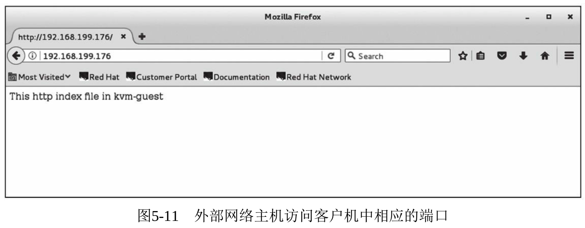

在上面的示例中, NAT 的配置涉及的一些**iptables**配置规则**仅用于实验演示**, 在**实际生产环境**中需要根据实际情况进行**更细粒度的配置！！！**. 如果将访问规则和数据包转发规则设置得过于宽松, 可能会带来网络安全方面的隐患.

熟悉 libvirt 的读者会发现, 上面实现的不就是**libvirt**的**虚拟网络**的**NAT 模式**吗?

是的, **libvirt**的**3 种虚拟网络**的实现(**NAT、Routed、Isolated**), 在**Hypervisor**是**QEMU/KVM！！！** 的情况下, 就是**通过 QEMU！！！的 bridge 网络模式！！！** 来**实现**的. Routed 和 Isolated 的具体实验我们就不在这里赘述了, 感兴趣的读者可以自行探索.

# 4. QEMU 内部的用户模式网络

在**没有任何"\-net"参数**时, **QEMU 默认**使用的是"\-**net nic\-net user**"的参数, 提供了一种**用户模式(user\-mode**)的网络模拟.

使用**用户模式的网络！！！** 的**客户机！！！** 可以连通**宿主机！！！及外部的网络！！！**.

**用户模式**网络**完全是由 QEMU 自身实现！！！** 的, **不依赖**于其他的工具(如前面提到的 bridge\-utils、dnsmasq、iptables 等), 而且**不需要 root 用户权限**(前面介绍过的 bridge 模式和 NAT 模式在配置宿主机网络和设置 iptables 规则时一般都需要 root 用户权限).

QEMU 使用**Slirp**实现了**一整套 TCP/IP 协议栈**, 并且使用这个协议栈实现了**一套虚拟的 NAT 网络**.

由于其使用简单、独立性好、不需 root 权限、客户机网络隔离性好等优势, 用户模式网络是**QEMU 的默认网络配置**.

不过, 用户模式网络也有以下**3 个缺点**:

1)由于其在 QEMU 内部实现所有网络协议栈, 因此其**性能较差**.

2)**不支持部分网络功能**(如**ICMP**), 所以**不能**在**客户机**中使用**ping 命令测试外网连通性！！！**.

3)不能从**宿主机**或**外部网络直接访问客户机！！！**.

使用用户模式的网络, 其 qemu 命令行参数为:

```
-netdev user,id=id[,option][,option][,...]
```

或者,

```
-net user[,option][,option][,...]
```

其中常见的选项(option)及其意义如下:

- vlan=n, 将用户模式网络栈连接到编号为 n 的 VLAN 中(默认值为 0).
- name=name, 分配一个在 QEMU monitor 中会用到的名字(如在 monitor 的"info network"命令中可看到这个网卡的 name).
- net=addr\[\/mask], 设置客户机可以看到的网络地址(客户机所在子网), 其默认值是 10.0.2.0/24. 其中, 子网掩码(mask)有两种形式可选, 一种是类似于 255.255.255.0 这样的地址, 另一种是 32 位 IP 地址中前面被置位为 1 的位数(如 10.0.2.0/24).
- host=addr, 指定客户机可见宿主机的地址, 默认值为客户机所在网络的第 2 个 IP 地址(如 10.0.2.2).
- ipv6-net=addr\[\/int], 设置客户机看到的 IPv6 网络地址, 默认是 fec0: : /64.
- ipv6\-host=addr, 设置客户机的 IPv6 地址, 默认是第 2 个 IP 地址 xxxx: : 2.
- restrict=y|yes|n|no, 如果将此选项打开(为 y 或 yes), 则客户机将会被隔离, 客户机不能与宿主机通信, 其 IP 数据包也不能通过宿主机而路由到外部网络中. 这个选项不会影响"hostfwd"显式地指定的转发规则, "hostfwd"选项始终会生效. 默认值为 n 或 no, 不会隔离客户机.
- hostname=name, 设置在内置的 DHCP 服务器中保存的客户机主机名.
- dhcpstart=addr, 设置能够分配给客户机的第 1 个 IP, 在 QEMU 内嵌的 DHCP 服务器有 16 个 IP 地址可供分配. 在客户机中 IP 地址范围的默认值是子网中的第 15~30 个 IP 地址(如 10.0.2.15~10.0.2.30).
- dns=addr, 指定虚拟 DNS 的地址, 这个地址必须与宿主机地址(在"host=addr"中指定的)不相同, 其默认值是网络中的第 3 个 IP 地址(如 10.0.2.3).
- tftp=dir, 激活 QEMU 内嵌的 TFTP 服务器, 目录 dir 是 TFTP 服务的根目录. 不过, 在客户机使用 TFTP 客户端连接 TFTP 服务后需要使用 binary 模式来操作.
- bootfile=file, 与 tftp=dir 配合使用, 可以实现虚拟的 PXE boot. 比如"\-boot n \-net user, tftp=/path/to/tftp/files, bootfile=/pxelinux.0"就指定了客户机 PXE 启动文件, 它位于 QEMU 虚拟的 tftp 服务器路径下.
- smb=dir\[, smbserver=addr]. QEMU 可以激活(模拟)一个内置的 Samba 服务器, 作为连接 host 和 Windows 客户机的文件传输的纽带. "dir"指示的就是 host 上存放共享文件的文件夹, "smbserver"(可选)指定对客户机而言的 Samba server 的 IP 地址, 默认是 net 的第 4 个 IP, 即 x.x.x.4. 注意, Windows 客户机需要把这个 Samba server 的 IP 地址静态解析("10.0.2.4 smbserver"这样一行)写入它的 LMHOSTS 文件中, 比如 Windows 10 系统的 C: \Windows\System32\drivers\etc\lmhosts.sam 文件. 这样, 在客户机中, 就可以通过\\smbserver\qemu 访问宿主机的"dir"文件夹了. 注意, 宿主机要求安装好 Samba 服务并启动.
- ipv6\-dns=addr, 指定虚拟的 IPv6 DNS 的地址, 这个地址必须与宿主机地址(在"ipv6-host=addr"中指定的)不相同, 其默认值是网络中的第 3 个 IP 地址(如 xxxx: : 3).
- dnssearch=domain. 内置的 DHCP server 在分配 IP 给客户机的时候, 会附带 DNS 域的信息. 这个参数就是指定域列表(可以是多个).
- hostfwd=\[tcp|udp]: \[hostaddr]: hostport\-\[guestaddr]: guestport, 将访问宿主机的 hostpot 端口的 TCP/UDP 连接重定向到客户机(IP 为 guestaddr)的 guestport 端口上. 如果没有设置 guestaddr, 那么默认使用 x.x.x.15(DHCP 服务器可分配的第 1 个 IP 地址). 如果指定了 hostaddr 的值, 则可以根据宿主机上的一个特定网络接口的 IP 端口来重定向. 如果没有设置连接类型为 TCP 或 UDP, 则默认使用 TCP 连接. "hostfwd=..."这个选项在一个命令行中可以多次重复使用.
- guestfwd=\[tcp]: server: port\-dev 及 guestfwd=\[tcp]: server: port\-cmd: command, 将客户机中访问 IP 地址为 server 的 port 端口的连接转发到宿主机的 dev 这个字符设备上. 或者每次访问这个 server: port 就执行一次命令(cmd: 具体命令). "guestfwd=..."这个选项也可以在一个命令行中多次重复使用.

下面用一个示例来介绍用户模式网络的使用.

1)通过如下的命令行启动了一个客户机, 为它配置**用户模式网络**, 并且开启**TFTP 服务**. 还将宿主机的 5022 端口转发到客户机的 22 端口(SSH 服务默认端口), 将宿主机的 5080 端口转发到客户机的 80 端口(HTTP 服务默认端口).

```
qemu-system-x86_64 -smp 4 -m 4G -enable-kvm rhel7.img -device e1000,netdev=usernet0 -netdev user,id=usernet0,tftp=/root/tftp_root,hostfwd=tcp::5022-:22,hostfwd= tcp::5080-:80
```

客户机启动后, 检查其网络连接.

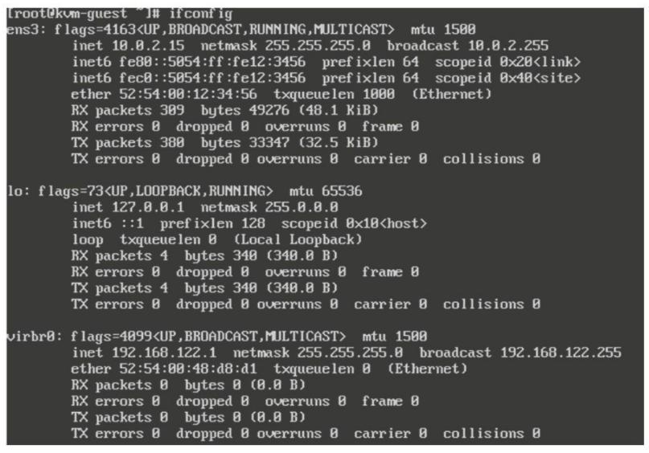

检查其**路由状态**和**默认网关**, 可以看到, **默认的用户模式网络**是**10.0.2.0/24**, **默认网关**是**10.0.2.2**(网络的**第 2 个 IP**), **网关**其实就是**宿主机**(我们 ssh 进去就看到).

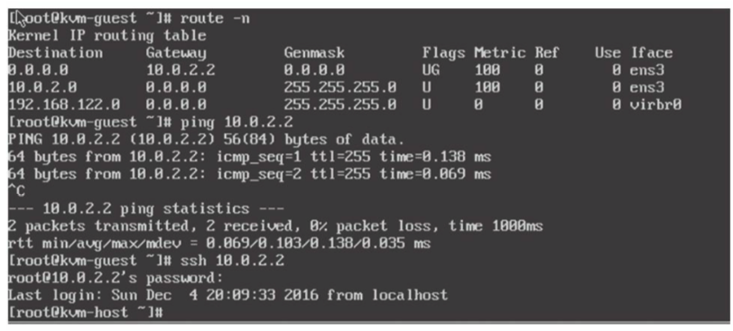

我们用**ping 命令**来测试**ICMP 包的对外传输**(如前面所说, ICMP 在用户模式和网络中是不可用的, 192.168.199.1 是宿主机的网关).

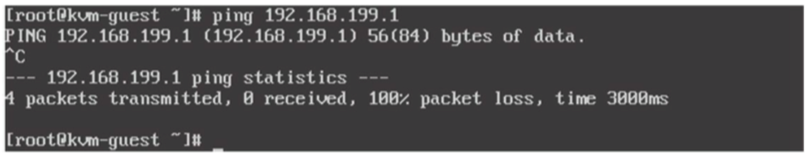

2)使用**wget**访问宿主机的外网 http 服务以测试其**外网网络连通性**, 并且访问宿主机中的 TFTP 服务(在其中测试了下载文件), 还启动了客户机中的 HTTP 服务器.

我在主机的 http 服务目录下放置了 kvm-host.txt 文件以供下载.

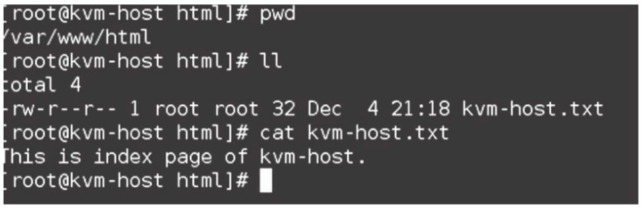

在客户机中通过 http 协议下载, 可以看到下载是成功的.

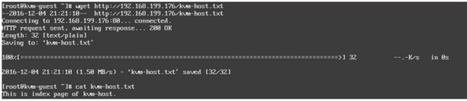

我们把另一个文件放在主机的 tftp_root 目录下, 从客户机中下载.

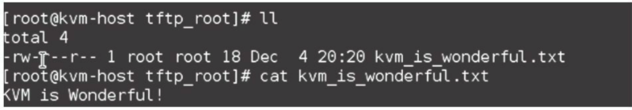

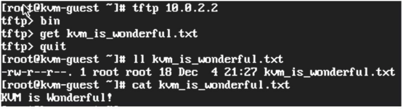

3)在外网中另外一台主机(kvm-host2)上测试前面配置的宿主机对客户机的端口转发. 如下命令行是在某台主机上, 通过 ssh 连接到宿主机的 5022 端口(使用\-p 参数指定 ssh 连接的端口), 连接请求被自动转发到了客户机的 22 端口(ssh 服务), 然后可以登录到客户机.

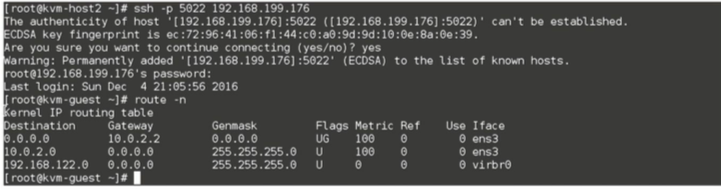

同样, 在外部网络的一个主机上通过 Firefox 浏览器对宿主机的 5080 端口的访问, 即被转发到了客户机的 80 端口. 浏览器中显示了在客户机的 HTTP 服务中测试网页内容, 在客户机的 HTTP 服务中测试网页内容, 如图 5-12 所示.

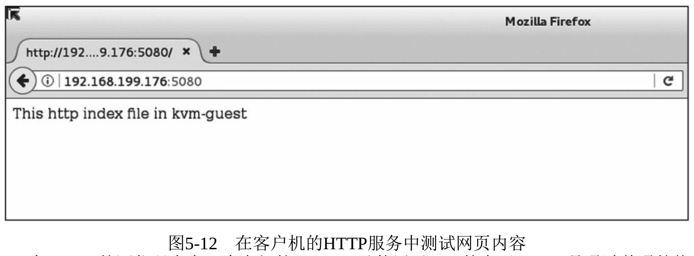

# 5. 其他网络选项

关于网络的设置, 还有其他几个并不太常用的选项, 下面对其进行简单介绍.

(1)使用 TCP socket 连接客户机的 VLAN

```
-net socket[,vlan=n][,name=name][,fd=h][,listen=[host]:port][,connect=host:port]
```

使用 TCP socket 连接将 n 号 VLAN 连接到一个远程的 QEMU 虚拟机的 VLAN. 如果有"listen=..."参数, 那么 QEMU 会等待对 port 端口的连接, 而 host 参数是可选的(默认值为本机回路 IP 地址 127.0.0.1). 如果有"connect=..."参数, 则表示连接远端的已经使用"listen"参数的 QEMU 实例. 可使用"fd=h"(文件描述符 h)指定一个已经存在的 TCP socket.

(2)使用 UDP 的多播 socket 建立客户机间的连接

```
-net socket[,vlan=n][,name=name][,fd=h][,mcast=maddr:port]
```

建立 n 号 VLAN, 使用 UDP 多播 socket 连接使其与另一个 QEMU 虚拟机共享, 用相同的多播地址(maddr)和端口(port)为每个 QEMU 虚拟机建立同一个总线. 多播的支持还与用户模式 Linux(User-Mode Linux)兼容.

Use\-Mode Linux 是一种安全地运行 Linux 各个版本(单独的 kernel)和 Linux 进程的方式. 项目主页: http://user-mode-linux.sourceforge.net .

(3)使用 VDE swith 的网络连接

```
-net vde[,vlan=n][,name=name][,sock=socketpath][,port=n][,group=groupname][,mode= octalmode]
```

连接 n 号 VLAN 到一个 VDEswitch 的 n 号端口, 这个 VDE switch 运行在宿主机上并且监听着在 socketpath 上进来的连接. 它使用 groupname 和 octalmode(八进制模式的权限设置)去更改通信端口的拥有组和权限. 这个选项只有在 QEMU 编译时有了对 VDE 的支持后才可用.

(4)转存(dump)出 VLAN 中的网络数据

```
-net dump[,vlan=n][,file=file][,len=len]
```

将编号为 n 的 VLAN 中的网络流量转存(dump)出来保存到 file 文件中(默认为当前目录中的 qemu\-vlan0.pcap 文件). 最多截取并保存每个数据包中的前 len(默认值为 64)个字节的内容. 保存的文件格式为 libcap, 故可以使用 tcpdump、Wireshark 等工具来分析转存出来的文件.

(5)不分配任何网络设备

```
-net none
```

单独使用它时, 表示不给客户机配置任何网络设备, 可用于覆盖没有任何"\-net"相关参数时的默认值"\-net nic\-net user".
