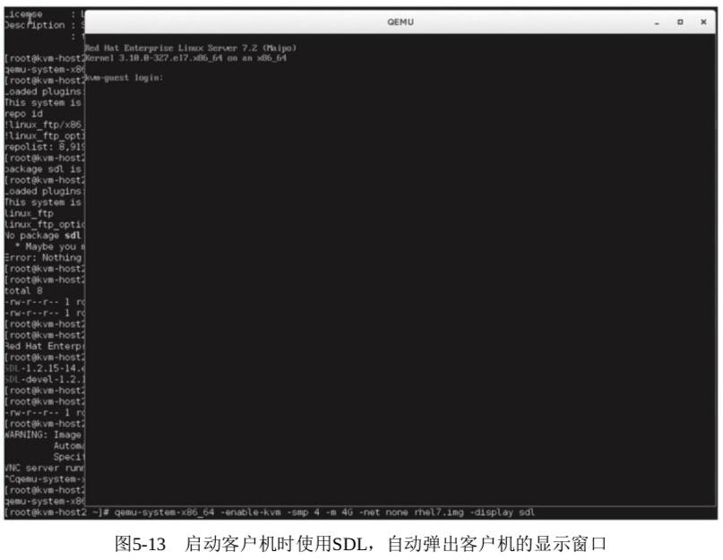
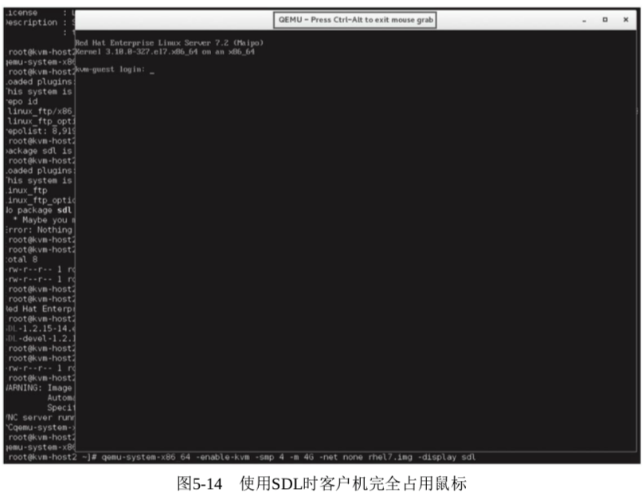
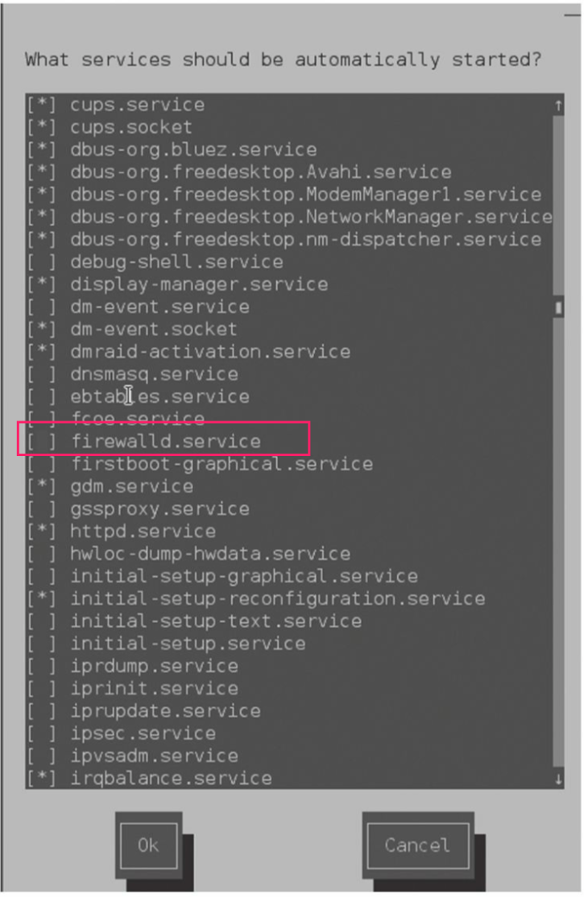
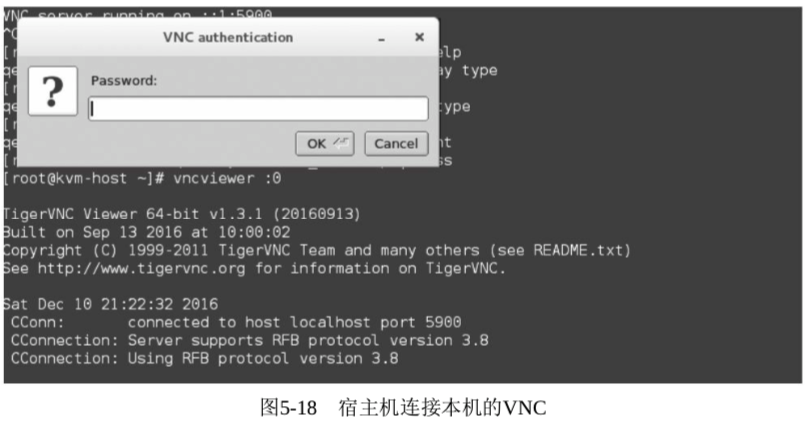
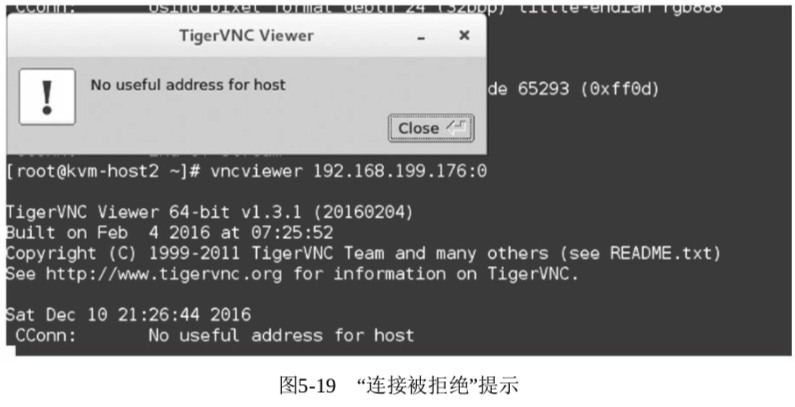
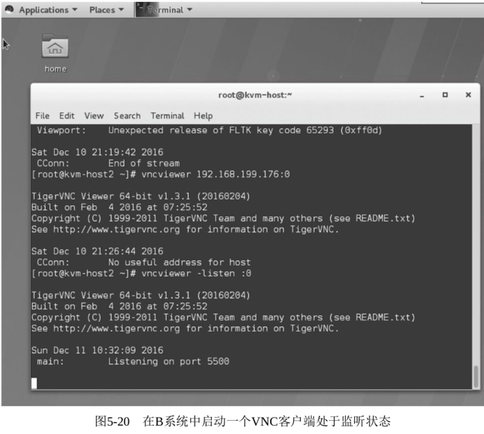
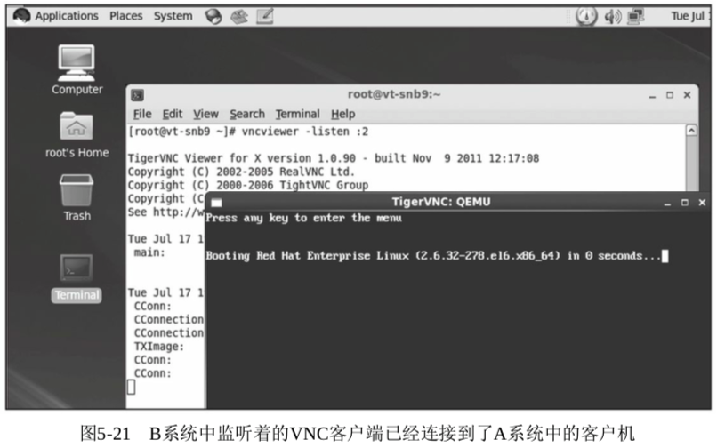
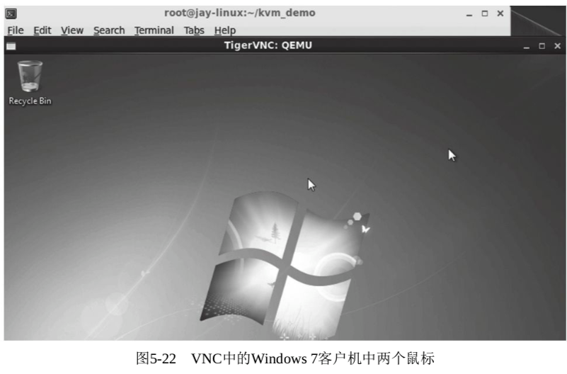
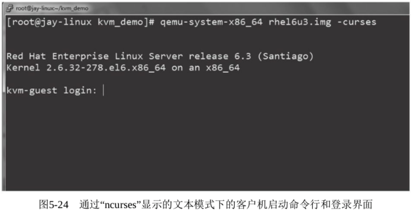

<!-- @import "[TOC]" {cmd="toc" depthFrom=1 depthTo=6 orderedList=false} -->

<!-- code_chunk_output -->

- [1. SDL 的使用](#1-sdl-的使用)
  - [1.1. QEMU 编译选项](#11-qemu-编译选项)
  - [1.2. SDL 图形局限以及使用](#12-sdl-图形局限以及使用)
- [2. VNC 的使用](#2-vnc-的使用)
  - [2.1. 宿主机中的 VNC 使用](#21-宿主机中的-vnc-使用)
    - [2.1.1. 安装 vnc-server 包](#211-安装-vnc-server-包)
    - [2.1.2. 设置安全策略](#212-设置安全策略)
      - [2.1.2.1. 关闭防火墙](#2121-关闭防火墙)
      - [2.1.2.2. 关闭 SELinux](#2122-关闭-selinux)
    - [2.1.3. 启动 vnc server](#213-启动-vnc-server)
    - [2.1.4. 安装 vnc client 包](#214-安装-vnc-client-包)
    - [2.1.5. 连接 vnc](#215-连接-vnc)
  - [2.2. QEMU 使用 VNC 图形显示方式启动客户机](#22-qemu-使用-vnc-图形显示方式启动客户机)
    - [2.2.1. displayport 参数](#221-displayport-参数)
    - [2.2.2. 使用示例](#222-使用示例)
      - [2.2.2.1. -display vnc=:0](#2221--display-vnc0)
      - [2.2.2.2. -display vnc=localhost:0,password -monitor stdio](#2222--display-vnclocalhost0password--monitor-stdio)
      - [2.2.2.3. -display vnc=none -monitor stdio](#2223--display-vncnone--monitor-stdio)
      - [2.2.2.4. -display vnc=localhost:0 -monitor stdio](#2224--display-vnclocalhost0--monitor-stdio)
      - [2.2.2.5. 反向连接](#2225-反向连接)
- [3. VNC 显示中的鼠标偏移](#3-vnc-显示中的鼠标偏移)
- [4. 非图形模式: -nographic](#4-非图形模式--nographic)
  - [4.1. 客户机配置输出重定向](#41-客户机配置输出重定向)
  - [4.2. qemu 通过 -nographic 启动虚拟机](#42-qemu-通过--nographic-启动虚拟机)
- [5. 显示相关的其他选项](#5-显示相关的其他选项)
  - [5.1. -curses](#51--curses)
  - [5.2. -vga type](#52--vga-type)
  - [5.3. -no-frame](#53--no-frame)
  - [5.4. -full-screen](#54--full-screen)
  - [5.5. -alt-grab](#55--alt-grab)
  - [5.6. -ctrl-grab](#56--ctrl-grab)

<!-- /code_chunk_output -->

# 1. SDL 的使用

SDL(**Simple DirectMedia Layer**)是一个用 C 语言编写的、跨平台的、免费和开源的**多媒体程序库**, 它提供了一个**简单的接口**用于**操作硬件平台**的**图形显示**、**声音**、**输入设备**等.

SDL 库被广泛应用于各种操作系统(如 Linux、FreeBSD、Windows、MacOS、iOS、Android 等)上的游戏开发、多媒体播放器、模拟器(如 QEMU)等众多应用程序之中.

尽管 SDL 是用 C 语言编写的, 但是**其他很多流行的编程语言**(如 C++、C#、Java、Objective C、Lisp、Erlang、Pascal、Perl、Python、PHP、Ruby 等)都提供了**对 SDL 库的绑定**, 在这些编程语言中可以很方便地调用 SDL 的功能.

## 1.1. QEMU 编译选项

在**QEMU 模拟器**中的图形显示**默认使用！！！** 的就是**SDL**. 当然, 需要在**编译 QEMU**时配置**对 SDL 的支持**后, 才能编译 SDL 功能到 QEMU 的命令行工具中, 最后才能在启动客户机时使用 SDL 的功能.

在**编译 QEMU**时, 需要有 SDL 的开发包的支持. 例如, 在 RHEL 系统中需要安装**SDL\-devel**这个 RPM 包.

```
rpm -q SDL-devel
yum install SDL-devel
```

如果有了**SDL\-devel**软件包, 在 3.4.2 节中配置 QEMU 时**默认会配置为提供 SDL**的支持.

运行**configure 程序**, 在其输出信息中看到"**SDL support yes**"即表明 SDL 支持将会被编译进去.

当然, 如果不想将 SDL 的支持编译进去, 那么在配置 QEMU 时加上"\-\-**disable\-sdl**"的参数即可, 在**configure 输出**信息中会显示提示"SDL support no".

查看当时编译的**build/config.status**能得知编译的选项

```
unset SDL_CONFIG
unset SDL2_CONFIG
```

## 1.2. SDL 图形局限以及使用

SDL 的功能很好用, 也比较强大.

不过它也有**局限性**, 那就是在**创建客户机并以 SDL 方式显示**时会**直接弹出一个窗口！！！**, 所以 SDL 方式**只能在图形界面！！！** 中使用.

如果在**非图形界面**中(如 ssh 连接到宿主机中)使用 SDL 会出现如下的错误信息:

```
[root@kvm-host root]# qemu-system-x86_64 rhel7.img
Could not initialize SDL(No available video device) - exiting
```

在通过 qemu 命令行启动客户机时, 若采用 SDL 方式, 其效果如图 5\-13 所示.



在**使用 SDL**时, 如果将鼠标放入客户机中进行操作会导致**鼠标被完全抢占**, 此时在**宿主机**中**不能使用鼠标**进行任何操作. QEMU**默认使用 Ctrl+Alt**组合键来实现鼠标在**客户机与宿主机中的切换**. 图 5\-14 显示了客户机抢占了鼠标的使用场景, 在 QEMU monitor 上部边框中提示按哪个组合键可以释放鼠标.



使用**SDL 方式启动客户机**时, 弹出的**QEMU 窗口**是一个**普通的窗口**, 其右上角有最小化、最大化(或还原)和关闭等功能. 其中, 单击"**关闭**"按钮会将 QEMU 窗口关闭, 同时**客户机也被直接关闭**了, **QEMU 进程会直接退出**.

为了避免因误操作而**关闭窗口从而导致客户机直接退出**的情况发生, QEMU 命令行提供了"\-**no\-quit**"参数来**去掉 SDL 窗口的直接关闭功能**.

在加了"\-no\-quit"参数后, SDL 窗口中的"关闭"按钮的功能将会失效, 而最小化、最大化(或还原)等功能正常.

# 2. VNC 的使用

VNC(Virtual Network Computing)是图形化的桌面分享系统, 它使用**RFB**(**Remote FrameBuffer**)协议来远程控制另外一台计算机系统. 它通过**网络**将控制端的**键盘、鼠标的操作**传递到**远程受控计算机**中, 而将**远程计算机**中的**图形显示屏幕反向传输回控制端的 VNC 窗口**中. VNC 是**不依赖于操作系统**的.

尽管 QEMU 仍然采用**SDL 作为默认的图形显示方式**, 但 VNC 的管理方式在虚拟化环境中使用得更加广泛, 因为它克服了**SDL**"**只能在图形界面中使用**"的局限性, 而很多的 Linux**服务器**系统通常**启动文本模式**而**不是图形界面模式**.

VNC 中的操作在**VNC 窗口关闭或网络断开**后, 仍然会在**服务端继续执行**. 另外, 使用了 VNC, 可以在**服务器端**分别启动**多个 VNC session**, 从而让多人通过**各自 VNC 客户端同时连接到各自！！！的 VNC 桌面！！！** 并进行图形界面下的操作与维护.

下面分别讲述在宿主机中直接使用 VNC 和在通过 qemu 命令行创建客户机时采用 VNC 方式的图形显示.

## 2.1. 宿主机中的 VNC 使用

### 2.1.1. 安装 vnc-server 包

在宿主机中**安装 VNC 的服务器软件包**(如**tigervnc\-server**). 可以用如下命令查询 vnc server 的安装情况.

```
[root@gerrylee qemu]# rpm -q tigervnc
tigervnc-1.8.0-13.el7.x86_64
[root@gerrylee qemu]# rpm -q tigervnc-server
tigervnc-server-1.8.0-13.el7.x86_64
```

### 2.1.2. 设置安全策略

设置**宿主机中的安全策略**, 使其允许 VNC 方式的访问, 主要需要设置**防火墙**和**SELinux**的安全策略. 这里为了简单起见, 直接关闭了防火墙和 SELinux, 在实际生产环境中, 需要根据特定的安全策略去设置.

#### 2.1.2.1. 关闭防火墙

可以使用"**setup**"命令来**设置或关闭防火墙**, 如图所示.



也可以用"**systecmctl stop firewalld**"命令来实现同样的效果.

#### 2.1.2.2. 关闭 SELinux

**关闭 SELinux**可以采取如下 3 种方式:

- 在运行时执行"**setenforce**"命令来设置, 命令行如下(这个效果是**一次性**的):

```
[root@gerrylee qemu]# setenforce 0
setenforce: SELinux is disabled
[root@gerrylee qemu]# getenforce
Disabled
```

- 修改配置文件"/etc/selinux/config", 代码段如下(这个效果是永久的):

```
# This file controls the state of SELinux on the system.
# SELINUX= can take one of these three values:
#     enforcing - SELinux security policy is enforced.
#     permissive - SELinux prints warnings instead of enforcing.
#     disabled - No SELinux policy is loaded.
SELINUX=disabled
# SELINUXTYPE= can take one of these two values:
#     targeted - Targeted processes are protected,
#     mls - Multi Level Security protection.
SELINUXTYPE=targeted
```

- 设置**系统启动时 GRUB 配置的 kernel 命令参数**, 加上"**selinux=0**"即可. /boot/grub/grub.conf 配置文件中 KVM 启动条目的示例如下(这个效果只对本次启动有效):

```
title Redhat Enterprise Linux Server (3.5.0)
    root (hd0,0)
    kernel /boot/vmlinuz-3.5.0 ro root=UUID=1a65b4bb-cd9b-4bbf-97ff-7e1f7698d3db selinux=0
    initrd /boot/initramfs-3.5.0.img
```

### 2.1.3. 启动 vnc server

在宿主机中启动 VNC 服务端, 运行命令"vncserver: 1"即可启动端口为 5901(5900+1)的 VNC 远程桌面的服务器, 示例如下.

可以**启动多个 VNC Server**, 使用**不同的端口供多个客户端使用**.

```
[root@kvm-host ~]# vncserver :1

New 'kvm-host:1 (root)' desktop is kvm-host:1

Starting applications specified in /root/.vnc/xstartup
Log file is /root/.vnc/kvm-host:1.log

[root@gerrylee qemu]# ps aux | grep Xvnc
root     13862  0.0  0.0 112724   988 pts/0    S+   10:26   0:00 grep --color=auto Xvnc
root     18890  0.0  0.2 312084 46052 ?        Sl   5 月 21   0:31 /usr/bin/Xvnc :1 -auth /root/.Xauthority -desktop gerrylee:1 (root) -fp catalogue:/etc/X11/fontpath.d -geometry 1024x768 -httpd /usr/share/vnc/classes -pn -rfbauth /root/.vnc/passwd -rfbport 5901 -rfbwait 30000
```

### 2.1.4. 安装 vnc client 包

在客户端中, 安装 VNC 的客户端软件.

在 RHEL 中可以安装上面查询结果中列出的"**tigervnc**"这个 RPM 包;

在 Windows 中, 可以安装**RealVNC**的**VNC Viewer**软件.

### 2.1.5. 连接 vnc

连接到远程的宿主机服务器, 使用的格式为"IP(hostname): PORT".

## 2.2. QEMU 使用 VNC 图形显示方式启动客户机

在**qemu 命令行**中, 添加"\-**display vnc=displayport**"参数就能让 VGA 显示输出到**VNC 会话中而不是 SDL**中.

如果在进行**QEMU 编译时没有 SDL**的支持, 却有**VNC**的支持, 则 qemu 命令行在启动客户机时**不需要"\-vnc**"参数也会自**动使用 VNC**而**不是 SDL**.

### 2.2.1. displayport 参数

在 qemu 命令行的 VNC 参数中, **displayport 参数**是必不可少的, 它有如下 3 种具体值.

(1)host:N

表示仅允许从 host 主机的 N 号显示窗口来建立 TCP 连接到客户机. 在通常情况下, QEMU 会根据数字 N 建立对应的 TCP 端口, 其**端口号为 5900 \+ N**.

而**host 值**在这里是一个**主机名**或一个**IP 地址**, 是可选的, 如果**host 值为空**, 则表示 QEMU 建立的 Server 端接受来自**任何主机的连接**.

增加 host 参数值, 可以**阻止来自其他主机的 VNC 连接请求**, 从而在一定程度上提高了使用 QEMU 的 VNC 服务的安全性.

(2)to=L

QEMU 在上面**指定的端口(5900\+N**)已被被其他应用程序占用的情况下, 会依次**向后递增尝试**.

这里**to=L**, 就表示**递增到 5900\+L 端口号为止**, 不再继续往后尝试. **默认为 0, 即不尝试**.

(3)unix: path

表示允许通过 Unix domain socket 连接到客户机, 而其中的 path 参数是一个处于监听状态的 socket 的位置路径. 这种方式使用得不多, 故不详细叙述.

(4)none

表示**VNC 已经被初始化**, 但是并**不在开始时启动**. 而在需要**真正使用**VNC 之时, 可以在**QEMU monitor**中用**change 命令启动 VNC 连接**.

作为可选参数的 option 则有如下几个可选值, 每个 option 标志用逗号隔开.

(1)reverse

表示"反向"连接到一个处于监听中的 VNC 客户端, 这个客户端是由前面的 display 参数(host: N)来指定的. 需要注意的是, 在反向连接这种情况下, display 中的端口号 N 是对端(客户端)处于监听中的 TCP 端口, 而不是现实窗口编号, 即如果客户端(IP 地址为 IP_Demo)已经监听的命令为"vncviewer-listen: 2", 则这里的 VNC 反向连接的参数为"-vnc IP_Demo: 5902, reverse", 而不是用 2 这个编号.

(2)password

表示在客户端连接时需要采取基于密码的认证机制, 但这里只是声明它使用密码验证, 其具体的密码值必须在 QEMU monitor 中用 change 命令设置.

(3)"tls""x509=/path/to/certificate/dir""x509verify=/path/to/certificate/dir""sasl"和"acl"

这 5 个选项都是与 VNC 的验证、安全相关的选项, 本书不对其详述.

### 2.2.2. 使用示例

准备两个系统, 一个是 KVM 的宿主机系统 A(IP 为 192.168.199.176, 主机名为 kvm-host), 另一个是类似环境的备用 KVM 系统 B(IP 为 192.168.199.146, 主机名为 kvm-host2), 这两个系统之间可以通过网络连通.

#### 2.2.2.1. -display vnc=:0

示例 1:

在启动客户机时, 带有一个**不需要密码的对任何主机都可以连接的 VNC 服务**.

在宿主机 A 系统中, 运行如下命令即可启动服务.

> qemu-system-x86_64 -smp 4 -m 16G -enable-kvm rhel7.img -device e1000,netdev=brnet0 -netdev bridge,id=brnet0,br=virbr0 -display vnc=:0

在**宿主机**中, 用如下命令连接到客户机中.

```
[root@kvm-host ~]# vncviewer :0
```

而在**B 系统**中, 用如下命令中即可连接到**A 主机**中对客户机开启的 VNC 服务.

```
[root@kvm-host2 ~]# vncviewer 192.168.199.176:0
```

#### 2.2.2.2. -display vnc=localhost:0,password -monitor stdio

示例 2:

在启动客户机时, 带有一个**需要密码**的、**仅能通过本机连接**的 VNC 服务.

在宿主机 A 系统中, 运行如下命令即可将其启动. 如前面提过的, **VNC 的密码**需要在**QEMU monitor 中设置**, 所以这里加了"**\-monitor stdio**"参数, 使 monitor 指向目前的标准输入输出, 这样可以直接输入"change vnc password"命令来设置密码(否则, 我们就没法连入 guest 了).

```
[root@kvm-host ~]# qemu-system-x86_64 -smp 4 -m 16G -enable-kvm rhel7.img -device e1000,netdev=brnet0 -netdev bridge,id=brnet0,br=virbr0 -display vnc=localhost:0,password -monitor stdio

    Specify the 'raw' format explicitly to remove the restrictions.
QEMU 2.7.0 monitor - type 'help' for more information
(qemu) change vnc password "123456"
(qemu) change vnc password
Password: ******
(qemu)
```

在 QEMU monitor 中, 运行"**change vnc password"123456"**"命令可以将 VNC 密码设置为"123456", 而如果使用"change vnc password"命令不加具体密码, QEMU monitor 会**交互式地提示用户输入密码**. 这两个设置方法的效果是一样的.

设置好 VNC 密码后, 在本机系统(A)中运行"vncviewer: 0"或"vncviwer localhost: 0"即可连接到客户机的 VNC 显示上. 系统会需要密码验证, 输入之前设置的密码即可, 如图 5\-18 所示.



由于在 QEMU 启动时设置了**只有通过主机名为"localhost**"(即宿主机 A 系统)的主机的 0 号显示窗口才能连接到 VNC 服务, 因此在 B 系统中无论是使用 A 主机的 IP 还是主机名去连接其 0 号 VNC, 都会提示"连接被拒绝", 如图 5-19 所示.



#### 2.2.2.3. -display vnc=none -monitor stdio

示例 3:

启动客户机时**并不启动 VNC**, 启动后根据需要使用命令才真正开启 VNC.

在宿主机 A 系统中, 将 VNC 参数中的 display 设置为 none, 然后在重定向到标准输入输出的 QEMU monitor 中使用"change vnc: 0"命令来开启 VNC. 操作命令如下:

```
[root@kvm-host ~]# qemu-system-x86_64 -smp 4 -m 16G -enable-kvm rhel7.img -device e1000,netdev=brnet0 -netdev bridge,id=brnet0,br=virbr0 -display vnc=none -monitor stdio
WARNING: Image format was not specified for 'rhel7.img' and probing guessed raw.
         Automatically detecting the format is dangerous for raw images, write operations on block 0 will be restricted.
         Specify the 'raw' format explicitly to remove the restrictions.
QEMU 2.7.0 monitor - type 'help' for more information
(qemu) change vnc ?
no vnc port specified
(qemu) change vnc :0
```

#### 2.2.2.4. -display vnc=localhost:0 -monitor stdio

示例 4:

虽然在启动客户机时设置了 VNC 的参数, 但是仍希望在**guest 启动后动态地修改此参数**.

这个需求可以通过 QEMU monitor 中的"change vnc XX"命令来实现. 在客户机启动时, 仅允许 localhost: 0 连接到 VNC, 并且没有设置密码. 但是在客户机启动后, 根据实际的需求, 改变 VNC 设置为: 允许来自任意主机的对本宿主机上 3 号 VNC 端口的连接来访问客户机, 还增加了访问时的密码验证. 实现这个需求的命令行操作如下:

```
[root@kvm-host ~]# qemu-system-x86_64 -smp 4 -m 16G -enable-kvm rhel7.img -device e1000,netdev=brnet0 -netdev bridge,id=brnet0,br=virbr0 -display vnc=localhost:0 -monitor stdio
WARNING: Image format was not specified for 'rhel7.img' and probing guessed raw.
         Automatically detecting the format is dangerous for raw images, write operations on block 0 will be restricted.
         Specify the 'raw' format explicitly to remove the restrictions.
QEMU 2.7.0 monitor - type 'help' for more information
(qemu) change vnc :3
(qemu) change vnc password "hellovnc"
If you want use passwords please enable password auth using '-vnc ${dpy},password'.
Could not set password
(qemu) change vnc :3,password "hellovnc"
(qemu)
```

当然, 在本示例中, "\-monitor stdio"这个参数不是必需的, 只需要在启动客户机后切换到 QEMU monitor 中执行相关的 change 命令即可.

#### 2.2.2.5. 反向连接

示例 5:

在启动客户机时, 将**客户机的 VNC 反向连接到一个已经处于监听状态的 VNC 客户端**.

本示例中的这种使用场景也是非常有用的, 如某用户在 KVM 虚拟机中调试一个操作系统, 经常需要多次重启客户机中的操作系统, 而该用户并不希望每次都重新开启一个 VNC 客户端连接到客户机. 有了"reverse"参数, 在实现反向连接后, 该用户就可以先开启一个 VNC 客户端, 使其处于监听某个端口的状态, 然后在每次用 qemu 命令行重启客户机的时候, 自动地反向连接到那个处于监听状态的 VNC 客户端.

1)在 B 系统中启动**vncviwer 处于 listen 状态**, 如图 5\-20 所示.

```
vncviewer -listen :0
```



2)在宿主机(A 系统)中**启动客户机**, VNC 中的参数包含**B 主机的 IP(或主机名**)、TCP 端口, 以及"**reverse**"选项. 其中 TCP 端口的值根据 B 系统的监听端口来确定, 从图 5-20 中可以看到"Listening on port 5500", 所以监听的 TCP 端口是 5500. 在宿主机系统中, 启动客户机的命令行操作如下:

```
qemu-system-x86_64 rhel6u3.img -vnc 192.168.199.99:5500,reverse
```

3)在客户机启动后, 在 B 系统中监听中的 VNC 客户端, 就会自动连接上 A 系统的客户机, 呈现客户机启动过程的界面, 如图 5\-21 所示.



当然, 本示例在同一个系统中也是可以操作的, 在宿主机系统上监听, 然后在宿主机系统上启动客户机使其"反向"连接到本地处于监听状态的 VNC 客户端.

# 3. VNC 显示中的鼠标偏移

在 QEMU 中的 VNC 显示客户机使用很方便, 而且有较多可用选项, 所以其功能比较强大. 不过 VNC 显示客户机也有一个小的缺点, 那就是在**VNC 显示中有鼠标偏移**的现象.

这里的偏移现象是指通过**VNC 连接到客户机中操作**时, 会看到**两个鼠标**, 一个是**客户机中的鼠标**(这个是让客户机操作实际生效的鼠标), 另一个是连接到客户机 VNC 的客户端系统中的鼠标. 这两个鼠标的焦点通常不重合, 而且相差的距离还有点大, 这样会导致在客户机中移动鼠标非常不方便, 如图 5\-22 所示.



在图 5\-22 中, 右上方的鼠标是 Windows 7 客户机中实际使用的鼠标, 而中间位置的鼠标为连接 VNC 的客户端所在系统的鼠标.

因为存在鼠标偏移的问题, 所以在**使用 VNC 方式启动客户机**时, 强烈建议将"**\-usb**"和"**\-usbdevice tablet**"这两个 USB 选项一起使用, 从而解决上面提到的鼠标偏移问题.

- "`-usb`" 参数开启**为客户机 USB 驱动的支持**(**默认已经生效**, 可以省略此参数),
- 而 "`-usbdevice tablet`" 参数表示添加一个"tablet"类型的 USB 设备. "tablet"类型的设备是一个使用**绝对坐标定位的指针设备**, 就像在触摸屏中那样定位, 这样可以让 QEMU 能够在客户机不抢占鼠标的情况下获得鼠标的定位信息.

在最新的 QEMU 中, 与"`-usb -usbdevice tablet`"参数功能相同, 也可以用"`-device piix3-usb-uhci-device -device usb-tablet`"参数. 目前, QEMU 社区也主要推动使用功能丰富的"\-device"参数来替代以前的一些参数(如: \-usb 等).

用如下的命令启动客户机, 可解决 VNC 中的鼠标偏移问题.

```
qemu-system-x86_64 win7.img -vnc :2 -usb -usbdevice tablet
```

或者,

```
qemu-system-x86_64 win7.img -vnc :2 -device piix3-usb-uhci -device usb-tablet
```

# 4. 非图形模式: -nographic

在**qemu 命令行**中, 添加`"-nographic"`参数可以**完全关闭 QEMU 的图形界面输出**, 从而让**QEMU**在该模式下成为**简单的命令行工具**.

而在 QEMU 中**模拟产生的串口**被重定向到了**当前的控制台(console**)中, 所以在**客户机**中对其**内核**进行配置使**内核的控制台输出重定向到串口**后, 依然可以在**非图形模式下**管理客户机系统或调试客户机的内核.

## 4.1. 客户机配置输出重定向

需要修改**客户机的 grub 配置**, 使其在 kernel 行中加上将**console 输出重定向**到**串口 ttyS0**. 对一个客户机进行修改后的 grub 配置文件如下:

```
default=0
timeout=5
splashimage=(hd0,0)/boot/grub/splash.xpm.gz
hiddenmenu
title Redhat Enterprise Linux (2.6.32-279.el6.x86_64)
    root (hd0,0)
    kernel /boot/vmlinuz-2.6.32-279.el6.x86_64 ro root=UUID=9a971721-db8f-4002c-a3f4-f4ae8b037ba33 console=ttyS0 initrd /boot/initramfs-2.6.32-279.el6.x86_64.img
```

## 4.2. qemu 通过 -nographic 启动虚拟机

用 `"-nographic"` 参数关闭图形输出, 其启动命令行及客户机启动(并登录进入客户机)的过程如下所示.

可见内核启动的信息就通过重定向到串口从而输出在**当前的终端**之中, 而且可以通过串口登录到客户机系统(有的客户机 Linux 系统需要进行额外的设置才允许从串口登录).

```
[root@kvm-host ~]# qemu-system-x86_64 -enable-kvm -smp 2 -m 4G -nographic rhel7.img
WARNING: Image format was not specified for 'rhel7.img' and probing guessed raw.
         Automatically detecting the format is dangerous for raw images, write operations on block 0 will be restricted.
         Specify the 'raw' format explicitly to remove the restrictions.
[    0.000000] Linux version 4.9.0 (root@kvm-guest) (gcc version 4.8.5 20150623 (Redhat 4.8.5-11) (GCC) ) #1 SMP Mon Jan 2 15:16:01 CST 2017
[    0.000000] Command line: BOOT_IMAGE=/vmlinuz-4.9.0 root=/dev/mapper/rhel-root ro crashkernel=auto rd.lvm.lv=rhel/root rd.lvm.lv=rhel/swap rhgb console=tty0 console=ttyS0 LANG=en_US.UTF-8 3
<!--此处省略数百行 启动时的串口输出信息-->
Redhat Enterprise Linux Server 7.3 (Maipo)
Kernel 4.9.0 on an x86_64

kvm-guest login:
kvm-guest login: root      #这里就是客户机的登录界面了
Password:
Password:
Last login: Tue Aug  8 19:30:27 on :0
[root@kvm-guest ~]#
```

# 5. 显示相关的其他选项

QEMU 还有不少关于图形显示相关的其他选项, 本节再介绍其中几个比较有用的.

## 5.1. -curses

curses 是类 UNIX 上终端控制的库, 应用能基于它去构建文本模式下的用户界面. 而 ncurses 是指"new curses", 是目前 curses 最著名的实现.

让 QEMU 将**VGA 显示输出**到使用**curses/ncurses 接口**支持的**文本模式界面**, 而**不是使用 SDL 来显示客户机**.

与"\-nographic"模式相比, 它的好处在于, 由于它是**接收客户机 VGA！！！的正常输出**而**不是串口！！！的输出信息**, 因此**不需要！！！额外更改客户机配置**将控制台**重定向到串口**.

当然, 为了使用"\-curses"选项, 在宿主机中必须有"**curses**或**ncurses**"这样的软件包提供显示接口的支持, 然后再**编译 QEMU**.

通过 Putty 连接到宿主机, 然后添加"\-curses"参数的 qemu 命令行来启动客户机, 启动到登录界面如图 5\-24 所示.

```
qemu-system-x86_64 -enable-kvm -m 2G -hda /root/centos7.4.test.qcow2 -curses
```



## 5.2. -vga type

VGA(Video Graphics Array)是 1987 年 IBM 引入的显示硬件接口, 后来也成为了工业标准.

选择为客户机模拟的**VGA 卡的类别**, 可选类型有如下 6 种.

(1)**cirrus**

为客户机模拟出"**Cirrus Logic GD5446"显卡**, 在客户机启动后, 可以在客户机中看到 VGA 卡的型号, 如在 Linux 中可以用"**lspci**"查看到 VGA 卡的信息. 这个选项对图形显示的体验并不是很好, 它的彩色是 16 位的, 分辨率也不高, 仅支持 2D 显示, 不支持 3D. 不过绝大多数的系统(包括 Windows 95)都支持这个系列的显卡.

在 Linux 客户机中查看 VGA 卡的类型, 可以使用下面的命令行:

```
[root@kvm-guest ~]# lspci | grep VGA
00:02.0 VGA compatible controller: Cirrus Logic GD 5446
```

(2)**std**

模拟标准的 VGA 卡, 带有 Bochs VBE 扩展. 当客户机支持 VBE2.0 及以上标准时(目前流行的操作系统多数都支持), 如果需要支持更高的分辨率和彩色显示深度, 就会使用这个选项. 显示的 device id 是 1234: 1111.

(3)VMware

提供对"VMware SVGA-II"兼容显卡的支持.

(4)virtio

半虚拟化的 VGA 显卡模拟.

```
[root@kvm-guest ~]# lspci | grep VGA
00:02.0 VGA compatible controller: Redhat, Inc Virtio GPU (rev 01)
[root@kvm-guest ~]# lspci -s 00:02.0 -k
00:02.0 VGA compatible controller: Redhat, Inc Virtio GPU (rev 01)
    Subsystem: Redhat, Inc Device 1100
    Kernel driver in use: virtio-pci
    Kernel modules: virtio_pci
```

(5)qxl

它也是一种半虚拟化的模拟显卡, 与 VGA 兼容. 当使用 spice display 的时候, 推荐选择这种显卡.

(6)none

关闭 VGA 卡, 使 SDL 或 VNC 窗口中无任何显示. 一般不使用这个参数.

以上这些 VGA 设备的指定也都可以用-device 参数来替代, 并且 QEMU 推荐使用\-device 参数.

```
Display devices:
name "cirrus-vga", bus PCI, desc "Cirrus CLGD 54xx VGA"
name "isa-cirrus-vga", bus ISA
name "isa-vga", bus ISA
name "secondary-vga", bus PCI
name "sga", bus ISA, desc "Serial Graphics Adapter"
name "VGA", bus PCI
name "virtio-gpu-pci", bus PCI, alias "virtio-gpu"
name "virtio-vga", bus PCI
name "VMware-svga", bus PCI
```

## 5.3. -no-frame

使 SDL 显示时没有边框. 选择这个选项后, 图 5-13 和图 5-14 中 SDL 窗口就没有边框的修饰.

## 5.4. -full-screen

在启动客户机时, 自动使用全屏显示.

## 5.5. -alt-grab

使用"`Ctrl+Alt+Shift`"组合键去抢占和释放鼠标, 从而使"`Ctrl+Alt+Shift`"组合键成为 QEMU 中的一个特殊功能键. 在 QEMU 中默认使用"`Ctrl+Alt`"组合键, 所以本书常提到在 SDL 或 VNC 中用"`Ctrl+Alt+2`"组合键切换到`QEMU monitor`的窗口, 而使用了"`-alt-grab`"选项后, 应该相应改用"`Ctrl+Alt+Shift+2`"组合键切换到 QEMU monitor 窗口.

## 5.6. -ctrl-grab

使用右"Ctrl"键去抢占和释放鼠标, 使其成为 QEMU 中的特殊功能键. 这与前面的"`-alt-grab`"的功能类似.
