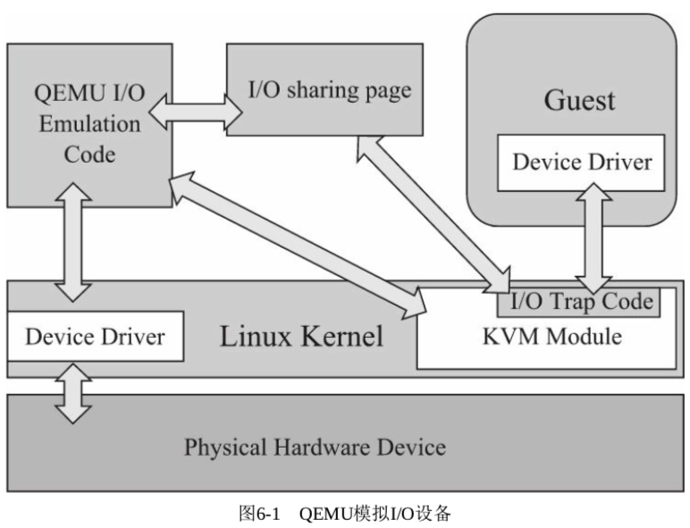
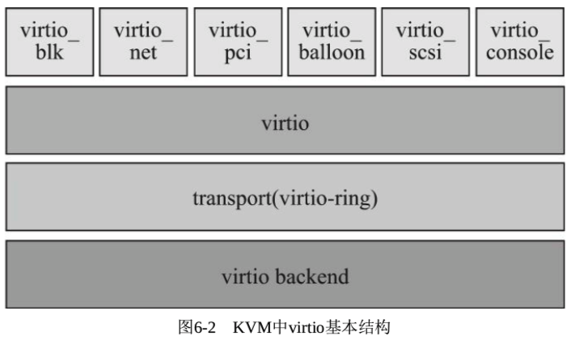
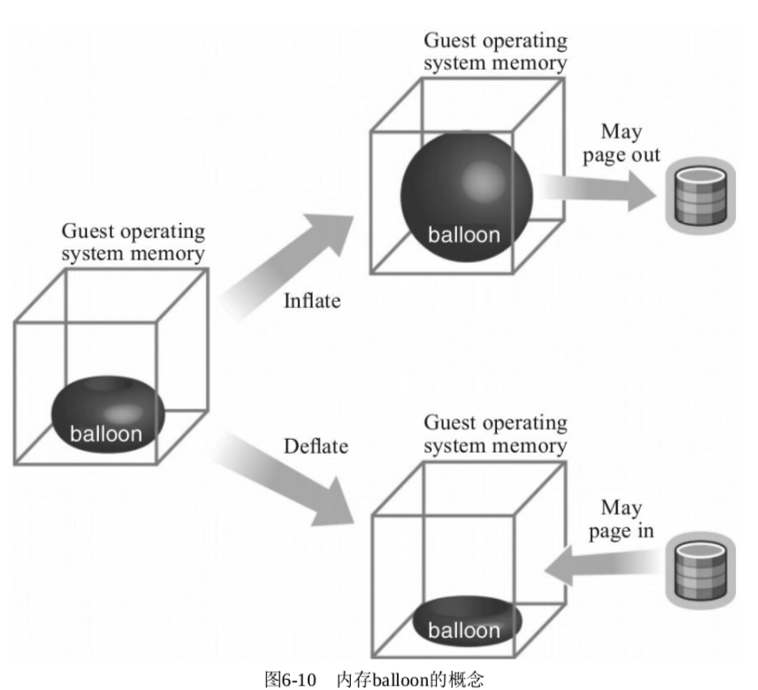

<!-- @import "[TOC]" {cmd="toc" depthFrom=1 depthTo=6 orderedList=false} -->

<!-- code_chunk_output -->

- [1. 虚拟化概述](#1-虚拟化概述)
- [2. QEMU 模拟 I/O 设备](#2-qemu-模拟-io-设备)
  - [2.1. 基本原理](#21-基本原理)
  - [2.2. 优点](#22-优点)
  - [2.3. 缺点](#23-缺点)
- [3. virtio 的基本原理和优缺点](#3-virtio-的基本原理和优缺点)
- [4. 安装 virtio 驱动](#4-安装-virtio-驱动)
  - [4.1. Linux 客户机中的 virtio 驱动](#41-linux-客户机中的-virtio-驱动)
    - [4.1.1. virtio 相关内核配置](#411-virtio-相关内核配置)
    - [4.1.2. virtio 内核模块](#412-virtio-内核模块)
  - [4.2. Windows 客户机中的 virtio 驱动](#42-windows-客户机中的-virtio-驱动)
- [5. 使用 virtio_balloon](#5-使用-virtio_balloon)
  - [5.1. ballooning 简介](#51-ballooning-简介)
  - [5.2. KVM 中 ballooning 的原理及优劣势](#52-kvm-中-ballooning-的原理及优劣势)
    - [5.2.1. KVM 中原理](#521-kvm-中原理)
    - [5.2.2. 优势](#522-优势)
    - [5.2.3. 缺点](#523-缺点)
  - [5.3. KVM 中 ballooning 使用示例](#53-kvm-中-ballooning-使用示例)
    - [5.3.1. 客户机内核模块确认](#531-客户机内核模块确认)
    - [5.3.2. qemu 命令行参数](#532-qemu-命令行参数)
    - [5.3.3. 使用 ballooning 操作步骤](#533-使用-ballooning-操作步骤)
  - [5.4. 通过 ballooning 过载使用内存](#54-通过-ballooning-过载使用内存)
- [6. 使用 virtio_net](#6-使用-virtio_net)
- [7. 使用 virtio_blk](#7-使用-virtio_blk)
- [8. 内核态的 vhost-net 后端以及网卡多队列](#8-内核态的-vhost-net-后端以及网卡多队列)
- [9. 使用用户态的 vhost-user 作为后端驱动](#9-使用用户态的-vhost-user-作为后端驱动)
- [10. kvm_clock 配置](#10-kvm_clock-配置)
  - [10.1. 虚拟中断的时间的缺点](#101-虚拟中断的时间的缺点)
  - [10.2. 半虚拟化时钟: kvm_clock](#102-半虚拟化时钟-kvm_clock)
    - [10.2.1. 宿主机 CPU flags](#1021-宿主机-cpu-flags)
    - [10.2.2. 客户机内核编译选项](#1022-客户机内核编译选项)
    - [10.2.3. QEMU 对 kvm_clock 的支持](#1023-qemu-对-kvm_clock-的支持)
  - [10.3. TSC Deadline Timer](#103-tsc-deadline-timer)
- [11. 对 Windows 客户机的优化](#11-对-windows-客户机的优化)

<!-- /code_chunk_output -->

# 1. 虚拟化概述

KVM 是必须使用硬件虚拟化辅助技术(如 Intel VT\-x、AMD\-V)的 Hypervisor, 在**CPU**运行效率方面有硬件支持, 其**效率是比较高**的;

在有 **Intel EPT**特性支持的平台上, **内存虚拟化**的效率也较高;

有**Intel VT\-d**的支持, 其**I/O 虚拟化**的效率也很高.

QEMU/KVM 提供了全虚拟化环境, 可以让客户机不经过任何修改就能运行在 KVM 环境中. 不过, KVM 在**I/O 虚拟化**方面, **传统的方式**是使用**QEMU 纯软件的方式**来**模拟 I/O 设备**(如第 5 章中提到模拟的网卡、磁盘、显卡等), 其**效率并不太高**.

在 KVM 中, 可以在客户机中使用**半虚拟化驱动**(**Paravirtualized Drivers, PV Drivers**)来提高客户机的性能(特别是**I/O 性能**). 目前, KVM 中实现半虚拟化驱动的方式是采用**virtio**这个 Linux 上的**设备驱动标准框架**.

# 2. QEMU 模拟 I/O 设备

## 2.1. 基本原理

QEMU 以纯软件方式模拟现实世界中的 I/O 设备的基本过程模型如图 6-1 所示.



在使用 QEMU 模拟 I/O 的情况下, 当**客户机**中的**设备驱动程序(Device Driver**)发起**I/O 操作请求**时, **KVM 模块(Module**)中的 **I/O 操作捕获代码**会拦截这次 I/O 请求, 然后在经过处理后将**本次 I/O 请求的信息**存放到**I/O 共享页(sharing page**), 并**通知用户空间的 QEMU 程序**. QEMU 模拟程序获得**I/O 操作的具体信息**之后, 交由**硬件模拟代码(Emulation Code**)来模拟出本次的 I/O 操作, 完成之后, 将**结果放回到 I/O 共享页**, 并通知 KVM 模块中的 I/O 操作捕获代码. 最后, 由 KVM 模块中的捕获代码读取 I/O 共享页中的操作结果, 并把结果返回客户机中. 当然, 在这个操作过程中, **客户机**作为一个**QEMU 进程**在**等待 I/O 时也可能被阻塞**.

另外, 当客户机通过**DMA**(Direct Memory Access)访问**大块 I/O**时, **QEMU**模拟程序将**不会把操作结果放到 I/O 共享页**中, 而是通过**内存映射的方式**将结果**直接写到客户机的内存**中去, 然后通过 KVM 模块告诉客户机 DMA 操作已经完成.

## 2.2. 优点

QEMU 模拟 I/O 设备的方式的优点是, 可以通过软件模拟出各种各样的硬件设备, 包括一些不常用的或很老很经典的设备(如 5.5 节中提到的 e1000 网卡), 而且该方式**不用修改客户机操作系统**, 就可以使模拟设备在客户机中正常工作. 在 KVM 客户机中使用这种方式, 对于解决手上没有足够设备的软件开发及调试有非常大的好处.

## 2.3. 缺点

而 QEMU 模拟 I/O 设备的方式的缺点是, **每次 I/O 操作的路径比较长**, 有**较多的 VMEntry**、**VMExit** 发生, 需要**多次上下文切换**(context switch), 也需要**多次数据复制**, 所以它的**性能较差**.

# 3. virtio 的基本原理和优缺点

virtio 最初由澳大利亚的一个天才级程序员 Rusty Russell 编写, 是一个在 Hypervisor 之上的**抽象 API 接口**, 让**客户机**知道自己运行在虚拟化环境中, 进而根据 virtio 标准**与 Hypervisor 协作**, 从而在客户机中达到**更好的性能**(特别是**I/O 性能**).

目前, 有不少虚拟机采用了 virtio 半虚拟化驱动来提高性能, 如 KVM 和 Lguest.

在 QEMU/KVM 中, virtio 的基本结构如图 6-2 所示.



- 其中**前端驱动**(**frondend**, 如**virtio\-blk**、**virtio\-net**等)是在**客户机**中存在的**驱动程序模块**,

- 而**后端处理程序(backend**)是在**QEMU 中实现**的. QEMU 中 virtio 相关代码在**hw**目录下, 带有**virtio 关键字**的文件.

在**前后端驱动之间**, 还定义了**两层**来支持**客户机**与**QEMU**之间的**通信**.

- 其中, "**virtio！！！**" 这一层是**虚拟队列接口**, 它在概念上将前端驱动程序附加到后端处理程序.

**一个前端驱动**程序可以使用**0 个或多个队列**, 具体数量取决于需求. 例如, **virtio\-net 网络驱动程序**使用**两个虚拟队列**(**一个用于接收**, **另一个用于发送**), 而**virtio\-blk 块驱动程序**仅使用**一个虚拟队列**. 虚拟队列实际上被实现为**跨越客户机操作系统和 Hypervisor**的衔接点, 但该衔接点可以通过任意方式实现, 前提是客户机操作系统和 virtio 后端程序都遵循一定的标准, 以相互匹配的方式实现它.

- 而**virtio\-ring**实现了**环形缓冲区(ring buffer**), 用于**保存前端驱动和后端处理程序执行的信息**.

该环形缓冲区可以**一次性**保存**前端驱动的多次 I/O 请求**, 并且交由后端驱动去**批量处理！！！**, 最后实际调用**宿主机**中**设备驱动实现物理上的 I/O 操作**, 这样做就可以根据约定实现**批量处理**而不是客户机中每次 I/O 请求都需要处理一次, 从而提高**客户机与 Hypervisor 信息交换**的效率.

**virtio 半虚拟化驱动**的方式, 可以获得很好的**I/O 性能**, 其性能几乎可以达到与 native(即非虚拟化环境中的原生系统)差不多的 I/O 性能. 所以, 在使用 KVM 之时, 如果宿主机内核和客户机都支持 virtio, 一般推荐使用 virtio, 以达到更好的性能. 当然, virtio 也是有缺点的, 它要求**客户机**必须安装**特定的 virtio 驱动**使其知道是运行在虚拟化环境中, 并且按照**virtio 的规定格式进行数据传输**.

客户机中可能有一些老的 Linux 系统不支持 virtio, 还有一些主流的 Windows 系统需要安装特定的驱动才支持 virtio. 不过, 较新的一些 Linux 发行版(如 RHEL 6.3、Fedora 17 以后等)**默认**都将**virtio 相关驱动编译为模块**, 可直接作为客户机使用, 然而主流 Windows 系统中都有对应的 virtio 驱动程序可供下载使用.

# 4. 安装 virtio 驱动

由于**virtio 的后端处理程序**是在位于**用户空间的 QEMU**中实现的, 所以, 在**宿主机**中只需要比较新的内核即可, **不需要**特别地编译**与 virtio 相关的驱动**.

**客户机**需要有**特定的 virtio 驱动**的支持, 以便**客户机**能识别和使用 QEMU 模拟的**virtio 设备**. 下面分别介绍 Linux 和 Windows 中 virtio 相关驱动的安装和使用.

## 4.1. Linux 客户机中的 virtio 驱动

新 Linux 自带的内核一般都将 **virtio 相关的驱动**编译为**模块**, 可以根据需要**动态地加载相应的模块**.

### 4.1.1. virtio 相关内核配置

RHEL 新版本都默认自动安装有 virtio 相关的半虚拟化驱动. 可以查看内核的配置文件来确定某发行版**是否支持 virtio 驱动**.

以 RHEL 7 中的**内核配置文件**为例, 其中与 virtio 相关的配置有如下几项:

```conf
CONFIG_VIRTIO=m
CONFIG_VIRTIO_PCI=m
CONFIG_VIRTIO_BALLOON=m
CONFIG_VIRTIO_BLK=m
CONFIG_SCSI_VIRTIO=m
CONFIG_VIRTIO_NET=m
CONFIG_VIRTIO_CONSOLE=m
CONFIG_HW_RANDOM_VIRTIO=m
CONFIG_NET_9P_VIRTIO=m
```

根据这样的配置选项, 在编译安装好内核之后, 在**内核模块中**就可以看到**virtio.ko**、**virtio\_ring.ko**、**virtio\_net.ko**这样的驱动, 如下所示:

```
[root@kvm-guest ~]# find /lib/modules/3.10.0-514.el7.x86_64/ -name virtio*.ko
/lib/modules/3.10.0-514.el7.x86_64/kernel/drivers/block/virtio_blk.ko
/lib/modules/3.10.0-514.el7.x86_64/kernel/drivers/char/hw_random/virtio-rng.ko
/lib/modules/3.10.0-514.el7.x86_64/kernel/drivers/char/virtio_console.ko
/lib/modules/3.10.0-514.el7.x86_64/kernel/drivers/gpu/drm/virtio/virtio-gpu.ko
/lib/modules/3.10.0-514.el7.x86_64/kernel/drivers/net/virtio_net.ko
/lib/modules/3.10.0-514.el7.x86_64/kernel/drivers/scsi/virtio_scsi.ko
/lib/modules/3.10.0-514.el7.x86_64/kernel/drivers/virtio/virtio.ko
/lib/modules/3.10.0-514.el7.x86_64/kernel/drivers/virtio/virtio_balloon.ko
/lib/modules/3.10.0-514.el7.x86_64/kernel/drivers/virtio/virtio_input.ko
/lib/modules/3.10.0-514.el7.x86_64/kernel/drivers/virtio/virtio_pci.ko
/lib/modules/3.10.0-514.el7.x86_64/kernel/drivers/virtio/virtio_ring.ko

[root@gerrylee qemu]# find /lib/modules/3.10.0-957.12.2.el7.x86_64/ -name virtio*.ko.xz
/lib/modules/3.10.0-957.12.2.el7.x86_64/kernel/drivers/block/virtio_blk.ko.xz
/lib/modules/3.10.0-957.12.2.el7.x86_64/kernel/drivers/char/hw_random/virtio-rng.ko.xz
/lib/modules/3.10.0-957.12.2.el7.x86_64/kernel/drivers/char/virtio_console.ko.xz
/lib/modules/3.10.0-957.12.2.el7.x86_64/kernel/drivers/gpu/drm/virtio/virtio-gpu.ko.xz
/lib/modules/3.10.0-957.12.2.el7.x86_64/kernel/drivers/net/virtio_net.ko.xz
/lib/modules/3.10.0-957.12.2.el7.x86_64/kernel/drivers/scsi/virtio_scsi.ko.xz
/lib/modules/3.10.0-957.12.2.el7.x86_64/kernel/drivers/virtio/virtio.ko.xz
/lib/modules/3.10.0-957.12.2.el7.x86_64/kernel/drivers/virtio/virtio_balloon.ko.xz
/lib/modules/3.10.0-957.12.2.el7.x86_64/kernel/drivers/virtio/virtio_input.ko.xz
/lib/modules/3.10.0-957.12.2.el7.x86_64/kernel/drivers/virtio/virtio_pci.ko.xz
/lib/modules/3.10.0-957.12.2.el7.x86_64/kernel/drivers/virtio/virtio_ring.ko.xz
```

### 4.1.2. virtio 内核模块

在一个**正在使用 virtio\_net 网络前端驱动**的 KVM**客户机**中, 已自动加载的 virtio 相关模块如下:

```
[root@kvm-guest ~]# lsmod | grep virtio
virtio_net             28024  0
virtio_pci             22913  0
virtio_ring            21524  2 virtio_net,virtio_pci
virtio                 15008  2 virtio_net,virtio_pci
```

其中**virtio！！！**、**virtio\_ring！！！**、**virtio\_pci！！！** 等驱动程序提供了对**virtio API 的基本支持**, 是**使用任何 virtio 前端驱动**都**必须使用！！！** 的, 而且它们的**加载还有一定的顺序**, 应该按照**virtio**、**virtio\_ring**、**virtio\_pci**的**顺序加载！！！**, 而 virtio\_net、virtio\_blk 这样的驱动可以根据实际需要进行选择性的编译和加载.

## 4.2. Windows 客户机中的 virtio 驱动

由于 Windows 不是开源的操作系统, 而且微软也并没有在其操作系统中默认提供 virtio 相关的驱动, 因此需要另外安装特定的驱动程序以便支持 virtio.

可以通过 Linux 系统发行版自带软件包(如果有该软件包)安装, 也可以到网上下载 Windows virtio 驱动自行安装.

(1)通过官方的 RPM 获得

以 RHEL 为例, 它有一个名为**virtio\-win 的 RPM 软件包**(在 RHEL 发行版的 Supplementary repository 中), 能为主流的 Windows 版本提供 virtio 相关的驱动.

```
[root@kvm-host ~]# yum install virtio-win
```

安装完以后, 在 **/usr/share/virtio\-win** 目录下可以看到**virtio\-win\-xxx.iso 文件**, 其中包含了所需要的驱动程序. 可以将 virtio\-win.iso 文件通过网络共享到 Windows 客户机中使用, 或者通过 qemu 命令行的"\-**cdrom**"参数将**virtio\-win.iso 文件**作为客户机的**光盘镜像**.

```
[root@kvm-host ~]# ls -l /usr/share/virtio-win/
total 137548
drwxr-xr-x 4 root root        31 Dec 18 15:35 drivers
drwxr-xr-x 2 root root        52 Dec 18 15:35 guest-agent
-rw-r--r-- 1 root root   2949120 Sep 19 22:34 virtio-win-1.9.0_amd64.vfd
-rw-r--r-- 1 root root 134948864 Sep 19 23:26 virtio-win-1.9.0.iso
-rw-r--r-- 1 root root   2949120 Sep 19 22:34 virtio-win-1.9.0_x86.vfd
lrwxrwxrwx 1 root root        26 Dec 18 15:35 virtio-win_amd64.vfd -> virtio-win-1.9.0_amd64.vfd
lrwxrwxrwx 1 root root        20 Dec 18 15:35 virtio-win.iso -> virtio-win-1.9.0.iso
lrwxrwxrwx 1 root root        24 Dec 18 15:35 virtio-win_x86.vfd -> virtio-win-1.9.0_x86.vfd
```

如图 6-3 所示是 virtio\-win.1.9.0 中的内容,
- **Balloon 目录**是**内存气球**相关的 virtio\_balloon 驱动,
- **NetKVM**目录是网络相关的**virtio\_net 驱动**,
- **vioserial**目录是**控制台相关的驱动**,
- **viostor**是磁盘块设备存储相关的**virtio\_blk**驱动,
- **vioscsi**是**SCSI 磁盘设备存储**.

以 NetKVM 目录为例, 其中又包含了各个 Windows 版本各自的驱动, 从古老的 XP 到最新的 Windows 10、Windows 2016 等都有. 每个 Windows 版本的目录下又包含"amd64"和"x86"两个版本, 分别对应 Intel/AMD 的 x86-64 架构和 x86-32 架构, 即 64 位的 Windows 系统应该选择 amd64 中的驱动, 而 32 位 Windows 则应选择 x86 中的驱动.

图 6-3　virtio-win 的目录内容

(2)通过开源的 Fedora 项目获得

添加 https://fedorapeople.org/groups/virt/virtio-win/virtio-win.repo 到本地的软件仓库以后, 也可以通过 yum 来装 virtio-win 这个软件包.

(3)如何在 Windows 中如何安装 virtio 驱动

Windows OS 本身是没有安装 virtio 驱动的, 所以直接分配给 Windows 客户机以半虚拟化设备的话, 是无法识别加载驱动的, 需要我们事先安装好.
下面以 Windows 10 为例, 来介绍如何在 Windows 客户机中安装半虚拟化硬盘、网卡的驱动.

安装一个全新的客户机的时候, 它的硬盘里还没有操作系统, 更别说驱动了. 所以, 一开始就分配给它半虚拟硬盘, 安装过程会无法识别, 也就无法安装客户机了. 那么, 怎么解决这个问题呢?我们可以在安装客户机时, 除了加载安装光盘以外, 还加载 virtio-win.iso.

```
[root@kvm-host ~]# qemu-img create -f raw win10.img 100G
Formatting 'win10.img', fmt=raw size=107374182400
[root@kvm-host ~]# qemu-system-x86_64 -enable-kvm -m 8G -smp 4 -drive file=./win10.img,format=raw,if=virtio -device virtio-net-pci,netdev=net0 -netdev bridge,br=virbr0,id=net0 -usb -usbdevice tablet -drive file=./cn_windows_10_enterprise_version_1607_updated_jul_2016_x64_dvd_9057083.iso,index=0,media=cdrom,if=ide -drive file=/usr/share/virtio-win/virtio-win.iso,media=cdrom,index=1,if=ide
```

安装过程中我们选择"自定义"安装, 如图 6-4 所示.

# 5. 使用 virtio_balloon

## 5.1. ballooning 简介

通常来说, 要改变客户机**占用的宿主机内存**, 要**先关闭客户机**, 修改启动时的内存配置, 然后重启客户机才能实现. 而**内存的 ballooning(气球**)技术可以在客户机**运行时动态地调整**它所**占用的宿主机内存资源**, 而不需要关闭客户机.

ballooning 技术形象地在客户机占用的内存中引入气球(balloon)的概念. **气球中的内存**是可以供**宿主机使用**的(但**不能被客户机访问或使用**), 所以, 当**宿主机内存紧张**, 空余内存不多时, 可以请求**客户机**回收利用已分配给客户机的**部分内存**, 客户机就会**释放其空闲的内存**.

此时若**客户机空闲内存不足**, 可能还会回收**部分使用中的内存**, 可能会将**部分内存换出**到客户机的**交换分区(swap**)中, 从而使**内存"气球"充气膨胀**, 进而使**宿主机**回收**气球**中的**内存**用于其他进程(或其他客户机).

反之, 当**客户机中内存不足**时, 也可以让**客户机的内存气球压缩**, 释放出内存气球中的部分内存, 让客户机有更多的内存可用.

目前很多虚拟机, 如 KVM、Xen、VMware 等, 都对 ballooning 技术提供支持. 内存 balloon 的概念示意图如图 6\-10 所示.



注: 气球在 guest OS 里面, 但是客户机不能访问.

## 5.2. KVM 中 ballooning 的原理及优劣势

### 5.2.1. KVM 中原理

KVM 中 ballooning 的工作过程主要有如下几步:

1) **Hypervisor**(即 KVM)发送请求到**客户机操作系统**, 让其归还一定数量的内存给 Hypervisor.

2) **客户机操作系统**中的**virtio\_balloon 驱动**接收到 Hypervisor 的请求.

3) **virtio\_balloon 驱动**使**客户机的内存气球膨胀**, 气球中的内存就不能被客户机访问. 如果此时客户机中内存剩余量不多(如某应用程序绑定/申请了大量的内存), 并且不能让内存气球膨胀到足够大以满足 Hypervisor 的请求, 那么 virtio\_balloon 驱动也会尽可能多地提供内存使气球膨胀, **尽量去满足**Hypervisor 所请求的内存数量(即使**不一定能完全满足**).

4) **客户机操作系统**归还**气球中的内存**给 Hypervisor.

5) Hypervisor 可以将从气球中得来的内存分配到任何需要的地方.

6) Hypervisor 也可以**将内存返还给客户机**. 这个过程为: Hypervisor 发送请求到客户机的 virtio\_balloon 驱动; 这个请求使客户机操作系统**压缩内存气球**; 在气球中的内存被释放出来, 重新由客户机访问和使用.

### 5.2.2. 优势

ballooning 在节约和灵活分配内存方面有明显的优势, 其好处有如下 3 点.

1) 因为 ballooning 能够被控制和监控, 所以能够潜在地节约大量的内存. 它不同于**内存页共享技术**(KSM 是**内核自发完成**的, **不可控**), 客户机系统的内存**只有在通过命令行**调整 balloon 时才会随之改变, 所以能够监控系统内存并验证 ballooning 引起的变化.

2) ballooning 对内存的调节很**灵活**, 既可以精细地请求少量内存, 也可以粗犷地请求大量的内存.

3) Hypervisor 使用 ballooning 让客户机归还部分内存, 从而缓解其内存压力. 而且从气球中回收的内存也**不要求**一定要被分配给另外某个进程(或另外的客户机).

### 5.2.3. 缺点

从另一方面来说, KVM 中 ballooning 的使用不方便、不完善的地方也是存在的, 其缺点如下:

1) ballooning 需要客户机操作系统加载**virtio\_balloon 驱动**, 然而并非每个客户机系统都有该驱动(如 Windows 需要自己安装该驱动).

2) 如果有**大量内存**需要从客户机系统中回收, 那么 ballooning 可能会**降低客户机操作系统运行的性能**.

- 一方面, **内存的减少**可能会让客户机中作为**磁盘数据缓存！！！的内存**被放到**气球**中, 从而使客户机中的**磁盘 I/O 访问增加**;
- 另一方面, 如果处理机制不够好, 也可能让客户机中**正在运行的进程**由于**内存不足而执行失败**.

3) 目前**没有**比较方便的、**自动化的机制**来管理 ballooning, 一般都采用在**QEMU monitor**中执行**balloon 命令**来实现 ballooning. 没有对客户机的有效监控, 没有自动化的 ballooning 机制, 这可能会不便于在生产环境中实现**大规模自动化部署**.

4) 内存的**动态增加或减少**可能会使内存被**过度碎片化**, 从而降低内存使用时的性能. 另外, 内存的变化会影响客户机内核对内存使用的优化, 比如, 内核起初根据目前状态对内存的分配采取了某个策略, 而后由于 balloon 的原因突然使可用内存减少了很多, 这时起初的内存策略就可能不是太优化了.

## 5.3. KVM 中 ballooning 使用示例

### 5.3.1. 客户机内核模块确认

KVM 中的 ballooning 是通过**宿主机**和**客户机协同**实现的,

- 在宿主机中应该有 KVM 模块, QEMU 提供后端功能

- 在**客户机**中将 "`config_virtio_balloon`" 配置为模块或编译到内核.

在很多 Linux 发行版中都已经配置有"`config_virtio_balloon=m`", 所以用较新的 Linux 作为客户机系统, 一般**不需要额外配置 virtio_balloon 驱动**, 使用**默认内核配置**即可.

### 5.3.2. qemu 命令行参数

在 qemu 命令行中可用"`-balloon virtio`"参数来分配 balloon 设备给客户机, 使其调用`virtio_balloon`驱动来工作, 而默认值为没有分配 balloon 设备(与"`-balloon none`"效果相同).

```
-balloon virtio[,addr=addr]   #使用 virtio balloon 设备, addr 为可配置客户机中该设备的 PCI 地址

或

-device virtio-balloon-pci,id=balloon0,bus=pci.0,addr=0x4
```

在 QEMU monitor 中, 有以下两个命令用于查看和设置客户机内存的大小.

```
(qemu) info balloon           #查看客户机内存占用量(balloon 信息)
(qemu) balloon num            #设置客户机内存占用量为 numMB
```

### 5.3.3. 使用 ballooning 操作步骤

下面介绍在 KVM 中使用 ballooning 的操作步骤.

1) QEMU 启动客户机时分配 balloon 设备, 命令行如下.

也可以使用较新的"`-device`"统一参数来分配 balloon 设备, 如"`-device virtio-balloon-pci,id=balloon0,bus=pci.0,addr=0x4`".

```
[root@gerrylee ~]# qemu-system-x86_64 -enable-kvm -m 2G -hda /root/centos7.4.test.qcow2 -device virtio-balloon-pci,id=balloon0 -display vnc=:0 -device piix3-usb-uhci -device usb-tablet -monitor stdio

[root@kvm-host ~]# qemu-system-x86_64 -enable-kvm rhel7.img -smp 4 -m 8G -balloon virtio
```

2) 在启动后的**客户机**中查看 balloon 设备及内存使用情况, 命令行如下:

```
[root@kvm-guest ~]# lspci | grep -i balloon
00:03.0 Unclassified device [00ff]: Redhat, Inc Virtio memory balloon
[root@kvm-guest ~]# lsmod |grep -i balloon
virtio_balloon         13834  0
virtio_ring            21524  3 virtio_net,virtio_pci,virtio_balloon
virtio                 15008  3 virtio_net,virtio_pci,virtio_balloon
[root@kvm-guest ~]# lspci -s 00:03.0 -v
00:03.0 Unclassified device [00ff]: Redhat, Inc Virtio memory balloon
        Subsystem: Redhat, Inc Device 0005
        Physical Slot: 3
        Flags: bus master, fast devsel, latency 0, IRQ 11
        I/O ports at c000 [size=32]
        Memory at fd000000 (64-bit, prefetchable) [size=8M]
        Capabilities: [84] Vendor Specific Information: VirtIO: <unknown>
        Capabilities: [70] Vendor Specific Information: VirtIO: Notify
        Capabilities: [60] Vendor Specific Information: VirtIO: DeviceCfg
        Capabilities: [50] Vendor Specific Information: VirtIO: ISR
        Capabilities: [40] Vendor Specific Information: VirtIO: CommonCfg
        Kernel driver in use: virtio-pci
        Kernel modules: virtio_pci
[root@kvm-guest ~]# free -m
              total        used        free      shared  buff/cache   available
Mem:           7822         147        7475           8         199        7423
Swap:          4095           0        4095
```

根据上面输出可知,

- 客户机中已经加载**virtio\_balloon 模块**,
- 有一个名为"Redhat, Inc Virtio memory balloon"的**PCI 设备**,
- 它使用了**virtio\_pci 驱动**.
- 当前内存是 8G

3) 在 QEMU monitor(按 Ctrl+Alt+2 组合键)中查看和改变客户机占用的内存, 命令如下:

```
(qemu) info balloon
balloon: actual=8192
(qemu) balloon 2048
(qemu) info balloon
balloon: actual=2048
```

如果**没有使用 balloon 设备**, 则在 monitor 中使用"info balloon"命令查看会得到"Device'balloon'has not been activated"的提示. 而"**balloon 2048**"命令将客户机内存设置为 2G.

4)设置了客户机内存为 2048 MB 后, 再到客户机中检查, 命令如下:

```
[root@kvm-guest ~]# free -m
              total        used        free      shared  buff/cache   available
Mem:           1678         154        1311           8         212        1265
Swap:          4095           0        4095
```

## 5.4. 通过 ballooning 过载使用内存

在 5.3.3 节中提到, **内存过载**使用主要有**3 种方式**: **swapping**、**ballooning**和**page sharing**.

在多个客户机运行时动态地调整其内存容量, ballooning 是一种让内存过载使用得非常有效的机制. 使用 ballooning 可以根据宿主机中对内存的需求, 通过"**balloon**"命令调整客户机内存占用量, 从而实现内存的过载使用.

如果**客户机**中有**virtio\_balloon 驱动**, 则使用 ballooning 来实现内存过载使用是非常方便的.

在**QEMU monitor**中使用**balloon 命令**改变内存的操作执行起来不方便

如果使用第 4 章中介绍的**libvirt 工具**来使用 KVM, 则对 ballooning 的操作会比较方便, 在**libvirt 工具**的"**virsh**"管理程序中就有"**setmem**"这个命令, 可**动态更改客户机的可用内存容量**. 该方式的完整命令如下:

```
virsh setmem <domain-id or domain-name> <Amount of memory in KB>
```

# 6. 使用 virtio_net

在选择 KVM 中的网络设备时, 一般来说应**优先选择半虚拟化的网络设备**, 而不是纯软件模拟的设备.

使用 virtio\_net 半虚拟化驱动可以提高**网络吞吐量(thoughput**)和降低网络**延迟(latency**), 从而让客户机中网络达到几乎和非虚拟化系统中使用原生网卡的网络差不多的性能.

可以通过如下步骤来使用 virtio\_net.

1) 检查**QEMU**是否支持**virtio 类型的网卡**.

```
[root@kvm-host ~]# qemu-system-x86_64 -net nic,model=?
```

2) 启动客户机时, 指定**分配 virtio 网卡设备**.

```
[root@kvm-host ~]# qemu-system-x86_64 -enable-kvm rhel7.img -smp 4 -m 8G -device virtio-net-pci,netdev=net0 -netdev bridge,br=virbr0,id=net0
```

```
[root@gerrylee ~]# qemu-system-x86_64 -enable-kvm -m 2G -hda /root/centos7.4.test.qcow2 -device virtio-balloon-pci,id=balloon0 -display vnc=:0 -device piix3-usb-uhci -device usb-tablet -monitor stdio -device virtio-net-pci,netdev=net0 -netdev user,id=net0
```

或者(等价),

```
[root@kvm-host ~]# qemu-system-x86_64 -enable-kvm rhel7.img -smp 4 -m 8G -net nic,model=virtio -net bridge,br=virbr0,id=net0
```

3) 在**客户机中查看**virtio 网卡的使用情况.

```
[root@kvm-guest ~]# lspci | grep -i virtio
00:03.0 Ethernet controller: Redhat, Inc Virtio network device
[root@kvm-guest ~]# lspci -s 00:03.0 -vvv
00:03.0 Ethernet controller: Redhat, Inc Virtio network device
Subsystem: Redhat, Inc Device 0001
Physical Slot: 3
Control: I/O+ Mem+ BusMaster+ SpecCycle- MemWINV- VGASnoop- ParErr- Stepping- SERR+ FastB2B- DisINTx+
Status: Cap+ 66MHz- UDF- FastB2B- ParErr- DEVSEL=fast >TAbort- <TAbort- <MAbort- > SERR- <PERR- INTx-
Latency: 0
Interrupt: pin A routed to IRQ 11
Region 0: I/O ports at c000 [size=32]
Region 1: Memory at febd1000 (32-bit, non-prefetchable) [size=4K]
Region 4: Memory at fe000000 (64-bit, prefetchable) [size=8M]
Expansion ROM at feb80000 [disabled] [size=256K]
Capabilities: [98] MSI-X: Enable+ Count=3 Masked-
    Vector table: BAR=1 offset=00000000
    PBA: BAR=1 offset=00000800
Capabilities: [84] Vendor Specific Information: VirtIO: <unknown>
    BAR=0 offset=00000000 size=00000000
Capabilities: [70] Vendor Specific Information: VirtIO: Notify
    BAR=4 offset=00003000 size=00400000 multiplier=00001000
Capabilities: [60] Vendor Specific Information: VirtIO: DeviceCfg
    BAR=4 offset=00002000 size=00001000
Capabilities: [50] Vendor Specific Information: VirtIO: ISR
    BAR=4 offset=00001000 size=00001000
Capabilities: [40] Vendor Specific Information: VirtIO: CommonCfg
    BAR=4 offset=00000000 size=00001000
Kernel driver in use: virtio-pci
Kernel modules: virtio_pci

[root@kvm-guest ~]# lsmod | grep -i virtio
virtio_net             28024  0
virtio_pci             22913  0
virtio_ring            21524  2 virtio_net,virtio_pci
virtio                 15008  2 virtio_net,virtio_pci
[root@kvm-guest ~]# ifconfig
eth0: flags=4163<UP,BROADCAST,RUNNING,MULTICAST>  mtu 1500
        inet 192.168.103.81  netmask 255.255.252.0  broadcast 192.168.103.255
        inet6 fe80::5054:ff:fe63:78de  prefixlen 64  scopeid 0x20<link>
        ether 52:54:00:63:78:de  txqueuelen 1000  (Ethernet)
        RX packets 1586  bytes 120421 (117.5 KiB)
        RX errors 0  dropped 5  overruns 0  frame 0
        TX packets 290  bytes 35562 (34.7 KiB)
        TX errors 0  dropped 0 overruns 0  carrier 0  collisions 0
...

[root@kvm-guest ~]# ethtool -i eth0
driver: virtio_net
version: 1.0.0
firmware-version:
expansion-rom-version:
bus-info: 0000:00:03.0
supports-statistics: no
supports-test: no
supports-eeprom-access: no
supports-register-dump: no
supports-priv-flags: no

[root@kvm-guest ~]# route -n
Kernel IP routing table
Destination     Gateway         Genmask         Flags Metric Ref    Use Iface
0.0.0.0         192.168.100.1   0.0.0.0         UG    100    0        0 eth0
192.168.100.0   0.0.0.0         255.255.252.0   U     100    0        0 eth0
192.168.122.0   0.0.0.0         255.255.255.0   U     0      0        0 virbr0
[root@kvm-guest ~]# ping 192.168.100.1
PING 192.168.100.1 (192.168.100.1) 56(84) bytes of data.
64 bytes from 192.168.100.1: icmp_seq=1 ttl=255 time=0.763 ms
64 bytes from 192.168.100.1: icmp_seq=2 ttl=255 time=1.62 ms
^C
--- 192.168.100.1 ping statistics ---
2 packets transmitted, 2 received, 0% packet loss, time 999ms
rtt min/avg/max/mdev = 0.763/1.192/1.621/0.429 ms
```

根据上面的输出信息可知,
- 网络接口 eth0 就是我们分配给客户机的 virtio NIC,
- 它使用了 virtio\_net 驱动,
- 并且当前网络连接正常工作.

# 7. 使用 virtio_blk

virtio\_blk 驱动使用**virtio API**为客户机提供了一个**高效访问块设备 I/O**的方法.

在 QEMU/KVM 中对块设备使用 virtio, 需要在两方面进行配置:
- **客户机**中的**前端驱动模块 virtio\_blk**
- **宿主机**中的 QEMU 提供**后端处理程序**.

目前比较流行的 Linux 发行版都将 **virtio\_blk** 编译为**内核模块**, 可以作为客户机直接使用 `virtio_blk`.

并且**较新的 QEMU**都是**支持 virtio block 设备**的**后端处理程序**的.

启动一个使用 `virtio_blk` 作为磁盘驱动的客户机, 其 qemu 命令行如下:

```
[root@kvm-host ~]# qemu-system-x86_64 -enable-kvm -cpu host -smp 2 -m 4G -drive file=rhel7.img,format=raw,if=virtio,media=disk -device e1000e,netdev=nic0 -netdev bridge,id=nic0,br=virbr0
VNC server running on '::1:5900'
```

```
[root@gerrylee ~]# qemu-system-x86_64 -enable-kvm -m 2G -drive file=/root/centos7.4.test.qcow2,if=virtio,media=disk -device virtio-balloon-pci,id=balloon0 -display vnc=:0 -device piix3-usb-uhci -device usb-tablet -monitor stdio -device virtio-net-pci,netdev=net0 -netdev user,id=net0
```

在客户机中, 查看 `virtio_blk` 生效的情况如下所示:

```
[root@kvm-guest ~]# grep -i virtio_blk /boot/config-3.10.0-514.el7.x86_64
CONFIG_VIRTIO_BLK=m
[root@kvm-guest ~]# lsmod | grep virtio
virtio_blk             20480  3
virtio_pci             24576  0
virtio_ring            24576  2 virtio_blk,virtio_pci
virtio                 16384  2 virtio_blk,virtio_pci
[root@kvm-guest ~]# lspci | grep block
00:04.0 SCSI storage controller: Redhat, Inc Virtio block device
[root@kvm-guest ~]# lspci -s 00:04.0 -vv
00:04.0 SCSI storage controller: Redhat, Inc Virtio block device
Subsystem: Redhat, Inc Device 0002
Physical Slot: 4
Control: I/O+ Mem+ BusMaster+ SpecCycle- MemWINV- VGASnoop- ParErr- Stepping- SERR+ FastB2B- DisINTx+
Status: Cap+ 66MHz- UDF- FastB2B- ParErr- DEVSEL=fast >TAbort- <TAbort- <MAbort- > SERR- <PERR- INTx-
Latency: 0
Interrupt: pin A routed to IRQ 11
Region 0: I/O ports at c000 [size=64]
Region 1: Memory at febd5000 (32-bit, non-prefetchable) [size=4K]
Region 4: Memory at fe000000 (64-bit, prefetchable) [size=16K]
Capabilities: [98] MSI-X: Enable+ Count=2 Masked-
    Vector table: BAR=1 offset=00000000
    PBA: BAR=1 offset=00000800
Capabilities: [84] Vendor Specific Information: VirtIO: <unknown>
    BAR=0 offset=00000000 size=00000000
Capabilities: [70] Vendor Specific Information: VirtIO: Notify
    BAR=4 offset=00003000 size=00001000 multiplier=00000004
Capabilities: [60] Vendor Specific Information: VirtIO: DeviceCfg
    BAR=4 offset=00002000 size=00001000
Capabilities: [50] Vendor Specific Information: VirtIO: ISR
    BAR=4 offset=00001000 size=00001000
Capabilities: [40] Vendor Specific Information: VirtIO: CommonCfg
    BAR=4 offset=00000000 size=00001000
Kernel driver in use: virtio-pci
Kernel modules: virtio_pci

[root@kvm-guest ~]# fdisk -l

Disk /dev/vda: 42.9 GB, 42949672960 bytes, 83886080 sectors
Units = sectors of 1 * 512 = 512 bytes
Sector size (logical/physical): 512 bytes / 512 bytes
I/O size (minimum/optimal): 512 bytes / 512 bytes
Disk label type: dos
Disk identifier: 0x00049f52

    Device Boot     Start         End      Blocks   Id  System
/dev/vda1   *        2048     1026047      512000   83  Linux
/dev/vda2         1026048    83886079    41430016   8e  Linux LVM
```

由上可知, 客户机中已经加载了 `virtio\_blk` 等驱动, QEMU 提供的 virtio 块设备使用 virtio\_blk 驱动(以上查询结果中显示为 virtio\_pci, 因为它是任意 virtio 的 PCI 设备的一个基础的、必备的驱动).

使用**virtio\_blk 驱动**的**磁盘**显示为"/**dev/vda**", 这不同于 IDE 硬盘的 "`/dev/hda`" 或 SATA 硬盘的 "`/dev/sda`" 这样的显示标识.

而 "`/dev/vd*`" 这样的磁盘设备名称可能会导致从前分配在磁盘上的 swap 分区失效, 因为有些客户机系统中记录文件系统信息的"/**etc/fstab**"文件中有类似如下的对 swap 分区的写法.

```
/dev/sda2  swap swap defaults 0 0
```
或
```
/dev/hda2  swap swap defaults 0 0
```

原因就是"/**dev/vda2**"这样的磁盘分区名称**未被正确识别**. 解决这个问题的方法就很简单了, 只需要修改它为如下形式并保存到"/etc/fstab"文件, 然后重启客户机系统即可.

```
/dev/vda2  swap swap defaults 0 0
```

如果启动的是已安装 virtio 驱动的 Windows 客户机, 那么可以在客户机的"设备管理器"中的"存储控制器"中看到, 正在使用"Redhat VirtIO SCSI Controller"设备作为磁盘.

# 8. 内核态的 vhost-net 后端以及网卡多队列

前面提到**virtio**在**宿主机**中的**后端处理程序(backend**)一般是由**用户空间的 QEMU 提供**的, 然而, 如果对于**网络 I/O 请求**的**后端处理**能够在**内核空间来完成**, 则效率会更高, 会提高网络吞吐量和减少网络延迟.

比较新的内核中有一个叫作"**vhost-net**"的**驱动模块**, 它作为一个内核级别的后端处理程序, 将**前端 virtio\-net**的**后端处理任务**放到**内核空间**中执行, 从而提高效率.

在 5.5.2 节中介绍网络配置时介绍过 `-netdev tap` 参数, 有几个选项是和 virtio 以及 vhost\_net 相关的, 这里也介绍一下.

```
-netdev tap,[,vnet_hdr=on|off][,vhost=on|off][,vhostfd=h][,vhostforce=on|off][,queues=n]
```

- vnet\_hdr=on|off, 设置是否打开 TAP 设备的"IFF_VNET_HDR"标识: "vnet\_hdr=off"表示关闭这个标识, 而"vnet\_hdr=on"表示强制开启这个标识. 如果没有这个标识的支持, 则会触发错误. IFF\_VNET\_HDR 是 tun/tap 的一个标识, 打开这个标识则允许在发送或接收大数据包时仅做部分的校验和检查. 打开这个标识, 还可以提高 virtio\_net 驱动的吞吐量.

- vhost=on|off, 设置是否开启 vhost\-net 这个内核空间的后端处理驱动, 它只对使用 MSI\-X 中断方式的 virtio 客户机有效.

- vhostforce=on|off, 设置是否强制使用 vhost 作为非 MSI-X 中断方式的 Virtio 客户机的后端处理程序.

- vhostfs=h, 设置去连接一个已经打开的 vhost 网络设备.

- queues=n, 设置创建的**TAP 设备**的**多队列个数**.

在 `-device virtio-net-pci` 参数中, 也有几个参数与**网卡多队列**相关:

- mq=on/off, 分别表示**打开和关闭多队列**功能.

- `vectors=2*N+2`, 设置 MSI\-X 中断矢量个数, 假设**队列个数为 N**, 那么这个值一般设置为 2\*N\+2, 是因为 N 个矢量给网络发送队列, N 个矢量给网络接收队列, 1 个矢量用于配置目的, 1 个矢量用于可能的矢量量化控制.

用如下命令行启动一个客户机, 就可以在客户机中使用**virtio\-net**作为**前端驱动程序**, 而在**后端处理程序**使用**vhost\-net**(当然需要**当前宿主机**内核支持**vhost\-net 模块**), 同时设置了**多队列的个数为 2**.

```
[root@kvm-host ~]# qemu-system-x86_64 rhel7.img -smp 4 -m 4096 -netdev tap,id=vnet0,vhost=on, queues=2 -device virtio-net-pci,netdev=vnet0,mq=on,vectors=6
```

在宿主机中可以查看 vhost 后端线程的运行情况, 如下:

```
[root@kvm-host ~]# ps -ef | grep 'vhost-'
root     129381   2  0 22:43 ?  00:00:00 [vhost-129379-0]
root     129382   2  0 22:43 ?  00:00:00 [vhost-129379-1]
root     129383   2  0 22:43 ?  00:00:00 [vhost-129379-0]
root     129384   2  0 22:43 ?  00:00:00 [vhost-129379-1]
```

该命令行输出中的**129379**为前面启动客户机的 QEMU 进程 PID, 可以看到有 4 个 vhost 内核线程, 其中 vhost-xxx-0 线程用于客户机的数据包接收, 而 vhost\-xxx\-1 线程用于客户机的数据包发送. 由于启动 qemu 命令行中 queues=2 参数设置了该客户机的网卡队列个数为 2, 故 vhost 收发方向的线程个数都分别为 2 个, 每个 vhost 线程对应客户机中的一个收或发方向的队列.

启动客户机后, 检查客户机网络, 应该是可以正常连接的. 不过, 网卡的多队列默认可能没有配置好, 我们到客户机中可以查看和设置多队列配置, 如下:

```
[root@kvm-guest ~]   # ethtool -l eth0
    Channel parameters for eth0:
    Pre-set maximums:
    RX:        0
    TX:        0
    Other:     0
    Combined:  2   # 这一行表示最多支持设置 2 个队列
    Current hardware settings:
    RX:        0
    TX:        0
    Other:     0
    Combined:  1   #表示当前生效的是 1 个队列

[root@kvm-guest ~]# ethtool -L eth0 combined 2
#设置 eth0 当前使用 2 个队列

[root@kvm-guest ~]# ping taobao.com -c 2
#再次检查网络连通性
PING taobao.com (140.205.220.96) 56(84) bytes of data.
64 bytes from 140.205.220.96: icmp_seq=1 ttl=42 time=7.82 ms
64 bytes from 140.205.220.96: icmp_seq=2 ttl=42 time=7.84 ms
```

对于平常使用 libvirt 的读者而言, 配置网卡多队列也是很简单的事情. 下面的客户机 XML 配置片段就表示配置 vhost\-net 的多个队列.

```xml
<interface type='network'>
    <mac address='54:52:00:1b:ea:47'/>
    <source network='default'/>
    <target dev='vnet1'/>
    <model type='virtio'/>
    <driver name='vhost' queues='2'/>
</interface>
```

在讲解 vhost\-net 时, 我们这里对网卡多队列进行较多的说明, 是因为这个功能对于提升虚拟机网卡处理能力, 包括每秒处理报文个数(packets per second, pps)和吞吐量(throughput)都有非常大的帮助. 当客户机中的 virtio\-net 网卡只有一个队列时, 那么该网卡的中断就只能集中由一个 CPU 来处理; 如果客户机用作一个高性能的 Web 服务器, 其网络较为繁忙、网络压力很大, 那么只能用单个 CPU 来处理网卡中断就会成为系统瓶颈. 当我们开启网卡多队列时, 在宿主机上, 我们前面已经看到, 会有多个 vhost 线程来处理网络后端, 同时在客户机中, virtio-net 多队列网卡也可以将网卡中断打散到多个 CPU 上由它们并行处理, 从而避免单个 CPU 处理网卡中断可能带来的瓶颈, 从而提高整个系统的网络处理能力.

一般来说, 使用 vhost-net 作为后端处理驱动可以提高网络的性能. 不过, 对于一些使用 vhost-net 作为后端的网络负载类型, 可能使其性能不升反降. 特别是从宿主机到其客户机之间的 UDP 流量, 如果客户机处理接收数据的速度比宿主机发送数据的速度要慢, 这时就容易出现性能下降. 在这种情况下, 使用 vhost-net 将会使 UDP socket 的接收缓冲区更快地溢出, 从而导致更多的数据包丢失. 因此, 在这种情况下不使用 vhost-net, 让传输速度稍微慢一点, 反而会提高整体的性能.

使用 qemu 命令行时, 加上"vhost=off"(或不添加任何 vhost 选项)就会不使用 vhost-net 作为后端驱动. 而在使用 libvirt 时, 默认会优先使用 vhost_net 作为网络后端驱动, 如果要选 QEMU 作为后端驱动, 则需要对客户机的 XML 配置文件中的网络配置部分进行如下的配置, 指定后端驱动的名称为"qemu"(而不是"vhost").

```
<interface type="network">
    ...
    <model type="virtio"/>
    <driver name="qemu"/>
    ...
</interface>
```

# 9. 使用用户态的 vhost-user 作为后端驱动

上一节中讲到的 vhost, 是为了减少网络数据交换过程中的多次上下文切换, 让 guest 与 host kernel 直接通信, 从而提高网络性能. 然而, 在大规模使用 KVM 虚拟化的云计算生产环境中, 通常都会使用 Open vSwitch 或与其类似的 SDN 方案, 以便可以更加灵活地管理网络资源. 通常在这种情况下, 在宿主机上会运行一个虚拟交换机(vswitch)用户态进程, 这时如果使用 vhost 作为后端网络处理程序, 那么也会存在宿主机上用户态、内核态的上下文切换. vhost-user 的产生就是为了解决这样的问题, 它可以让客户机直接与宿主机上的虚拟交换机进程进行数据交换.

vhost-user, 从其名字就可以看得出来它与 vhost 有较深的渊源. 简单来说, 可以理解为在用户态实现了 vhost 的一种协议. vhost-user 协议实现了在同一个宿主机上两个进程建立共享的虚拟队列(virtqueue)所需要的控制平面. 控制逻辑的信息交换是通过共享文件描述符的 UNIX 套接字来实现的; 当然, 在数据平面是通过两个进程间的共享内存来实现的.

vhost-user 协议定义了 master 和 slave 作为通信的两端, master 是共享自己 virtqueue 的一端, slave 是消费 virtqueue 的一端. 在 QEMU/KVM 的场景中, master 就是 QEMU 进程, slave 就是虚拟交换机进程(如: Open vSwitch、Snabbswitch 等).

一个使用 vhost\-user 与 Open vSwitch 交互的命令如下所示:

```
[root@kvm-host ~]# qemu-system-x86_64 rhel7.img -cpu host
-smp 4 -m 4096M --enable-kvm -object memory-backend-file,id=mem,size=4096M,mem-path=/dev/hugepages,share=on
-numa node,memdev=mem -mem-prealloc
-chardev socket,id=char1,path=/var/run/vswitch/vhost-user0
-netdev type=vhost-user,id=mynet1,chardev=char1,queues=2 -device virtio-net-pci,netdev=mynet1,mq=on,vectors=6
```

近几年来, Intel 等知名公司发起的**DPDK(Data Plane Development Kit**)项目提供了**网卡**运行在**polling 模式**的**用户态驱动**, 它可以和**vhost\-user**、**Open vSwitch**等结合起来使用, 可以让网络数据包都在用户态进行交换, 消除了用户态、内核态的上下文切换开销, 从而降低网络延迟、提高网络吞吐量.

# 10. kvm_clock 配置

## 10.1. 虚拟中断的时间的缺点

在保持**时间的准确性**方面, 虚拟化环境似乎天生就面临几个难题和挑战. 由于在**虚拟机中的中断并非真正的中断**, 而是通过**宿主机**向客户机**注入的虚拟中断**, 因此**中断**并**不总是**能**同时且立即**传递给一个**客户机的所有虚拟 CPU(vCPU**). 在需要向客户机注入中断时, 宿主机的物理 CPU 可能正在执行其他客户机的 vCPU 或在运行其他一些非 QEMU 进程, 这就是说中断需要的**时间精确性**有可能**得不到保障**.

客户机中时间不准确, 就可能导致一些程序和一些用户场景在正确性上遇到麻烦. 这类程序或场景, 一般是 Web 应用程序或基于网络的应用场景, 如 Web 应用中的 Cookie 或 Session 有效期计算、虚拟机的**动态迁移(Live Migration**), 以及其他一些依赖于时间戳的应用等.

## 10.2. 半虚拟化时钟: kvm_clock

而 QEMU/KVM 通过提供一个**半虚拟化的时钟**, 即**kvm\_clock**, 为客户机提供**精确**的**System time**和**Wall time**, 从而避免客户机中时间不准确的问题.

kvm\_clock 使用**较新的硬件**(如**Intel SandyBridge**平台)提供的支持, 如**不变的时钟计数器**(Constant Time Stamp Counter). **constant TSC 的计数频率**, 即使**当前 CPU 核心改变频率**(如使用了一些省电策略), 也能**保持恒定不变！！！**. CPU 有一个**不变的 constant TSC 频率**是将**TSC**作为**KVM 客户机时钟**的必要条件.

### 10.2.1. 宿主机 CPU flags

物理 CPU 对 constant TSC 的支持, 可以查看**宿主机**中**CPU 信息的标识**, 有"`constant_tsc`"的就是支持 constant TSC 的, 如下所示(信息来源于运行在 Broadwell 硬件平台的系统).

```
[root@kvm-host ~]# cat /proc/cpuinfo | grep flags | uniq | grep constant_tsc
```

### 10.2.2. 客户机内核编译选项

一般来说, 在较新的 Linux 发行版的内核中都已经将**kvm\_clock**相关的支持**编译进去**了, 可以查看如下的**虚拟机内核配置选项**:

```
[root@kvm-guest ~]# grep PARAVIRT_CLOCK /boot/config-3.10.0-493.el7.x86_64
CONFIG_PARAVIRT_CLOCK=y
# 较老的(如: RHEL6.x)的内核, 配置的是 CONFIG_KVM_CLOCK=y
```

### 10.2.3. QEMU 对 kvm_clock 的支持

而在用 qemu 命令行启动客户机时, 已经会**默认让其使用 kvm\_clock 作为时钟来源**. 用最普通的命令启动一个 Linux 客户机, 然后查看客户机中与时钟相关的信息如下, 可知使用了 kvm\_clock 和硬件的 TSC 支持.

```
[root@kvm-guest ~]# dmesg | grep clock
kvm-clock: Using msrs 4b564d01 and 4b564d00
kvm-clock: cpu 0, msr 2:3ff87001, primary cpu clock
kvm-clock: using sched offset of 6921190704 cycles
kvm-clock: cpu 1, msr 2:3ff87041, secondary cpu clock
kvm-clock: cpu 2, msr 2:3ff87081, secondary cpu clock
kvm-clock: cpu 3, msr 2:3ff870c1, secondary cpu clock
Switched to clocksource kvm-clock
rtc_cmos 00:00: setting system clock to 2017-08-18 07:15:53 UTC (1503040553)
tsc: Refined TSC clocksource calibration: 2494.179 MHz

[root@localhost ~]# cat /sys/devices/system/clocksource/clocksource0/current_cloc
kvm-clock
```

## 10.3. TSC Deadline Timer

另外, Intel 的一些较新的硬件还向时钟提供了更高级的硬件支持, 即**TSC Deadline Timer**, 在前面查看一个 Broadwell 平台的**CPU 信息**时已经有"**tsc\_deadline\_timer**"的标识了. TSC deadline 模式, **不是使用 CPU 外部总线的频率**去**定时减少计数器**的值, 而是用**软件**设置了一个"**deadline**"(最后期限)的**阈值**, 当 CPU 的时间戳计数器的值大于或等于这个"deadline"时, **本地的高级可编程中断控制器(Local APIC**)就产生一个**时钟中断请求**(IRQ). 正是由于这个特点(CPU 的时钟计数器运行于 CPU 的内部频率而不依赖于外部总线频率), TSC Deadline Timer 可以提供更精确的时间, 也可以更容易避免或处理竞态条件(Race Condition).

KVM 模块对 TSC Deadline Timer 的支持开始于 Linux 3.6 版本, QEMU 对 TSC Deadline Timer 的支持开始于 QEUM/KVM 0.12 版本. 而且在启动客户机时, 在 qemu 命令行使用"\-**cpu host**"参数才能将**这个特性**传递给客户机, 使其可以使用 TSC Deadline Timer.

# 11. 对 Windows 客户机的优化