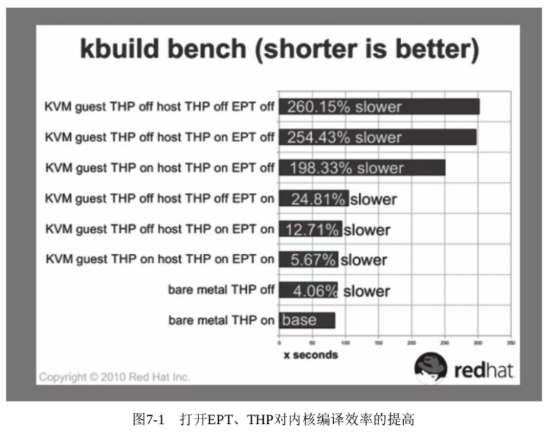

<!-- @import "[TOC]" {cmd="toc" depthFrom=1 depthTo=6 orderedList=false} -->

<!-- code_chunk_output -->

- [1. 大页的缺点](#1-大页的缺点)
- [2. 透明大页原理](#2-透明大页原理)
- [3. 透明大页的使用](#3-透明大页的使用)
  - [3.1. 内核编译选项和启动参数](#31-内核编译选项和启动参数)
  - [3.2. 宿主机中查看并配置 THP 的使用方式](#32-宿主机中查看并配置-thp-的使用方式)
    - [3.2.1. enable 接口](#321-enable-接口)
    - [3.2.2. defrag 接口](#322-defrag-接口)
    - [3.2.3. khugepaged/defrag 接口](#323-khugepageddefrag-接口)
    - [3.2.4. 客户机和宿主机同时使用](#324-客户机和宿主机同时使用)
  - [3.3. 透明大页的效果(系统和进程)](#33-透明大页的效果系统和进程)
    - [3.3.1. 启动虚拟机前透明大页](#331-启动虚拟机前透明大页)
    - [3.3.2. 启动虚拟机](#332-启动虚拟机)
    - [3.3.3. 查看系统透明大页](#333-查看系统透明大页)
    - [3.3.4. 查看 QEMU 进程透明大页](#334-查看-qemu-进程透明大页)
- [4. THP 的提出](#4-thp-的提出)

<!-- /code_chunk_output -->

# 1. 大页的缺点

在上一节中已经介绍过, 使用大页可以提高系统内存的使用效率和性能.

不过大页有如下几个缺点:

1)大页必须在**使用前就准备好**.

2)应用程序代码必须**显式地使用大页**(一般是调用 mmap、shmget 系统调用, 或者使用 libhugetlbfs 库对它们的封装).

3)大页必须**常驻物理内存**中, **不能交换到交换分区**中.

4)需要**超级用户权限**来**挂载 hugetlbfs 文件系统**, 尽管挂载之后可以指定挂载点的 uid、gid、mode 等使用权限供普通用户使用.

5)如果**预留了大页内存**但**没实际使用**, 就会造成**物理内存的浪费**.

# 2. 透明大页原理

而**透明大页**(Transparent Hugepage)既发挥了大页的一些优点, 又能**避免**了**上述缺点**.

透明大页(THP)是 Linux 内核的一个特性. 目前一些流行的 Linux 发行版(如 RHEL 6/7、Ubuntu 12.04 以后等)的内核都默认提供了透明大页的支持.

- 透明大页, 如它的名称描述的一样, **对所有应用程序都是透明**的(**transparent**), 应用程序不需要任何修改即可享受透明大页带来的好处.

- 在使用透明大页时, 普通的使用 hugetlbfs 大页依然可以正常使用, 而在**没有普通的大页可供使用**时, **才使用透明大页**.

- **透明大页**是**可交换的(swapable**), 当需要交换到**交换空间**时, 透明大页**被打碎为常规的 4KB 大小的内存页**.

- 在**使用透明大页**时, 如果因为**内存碎片**导致**大页内存分配失败**, 这时系统可以优雅地**使用常规的 4KB 页替换**, 而且**不会发生任何错误**、**故障或用户态的通知**.

- 而当系统内存较为充裕、有**很多的大页可用**时, **常规的页分配的物理内存**可以通过**khugepaged 内核线程自动迁往透明大页内存**.

内核线程 khugepaged 的作用是, **扫描正在运行的进程**, 然后**试图将使用的常规内存页转换到使用大页！！！**.

目前, **透明大页**仅仅**支持匿名内存(anonymous memory)的映射**, 对磁盘缓存(page cache)和共享内存(shared memory)的支持还处于开发之中.

Linux 4.8 开始, 加入了对 tmpfs 和 shmfs 的 page cache 使用 transparent huge page 的支持.

- tmpfs 文件系统通过 mount \-o 参数 huge=always/never/within\_size/advise 指定是否打开以及使用策略.

- 对于 shm, 通过 /sys/kernel/mm/transparent\_hugepage/**shmem\_enabled** 来控制.

# 3. 透明大页的使用

Linux 内核代码中关于透明大页的文档, 在 Documentation/vm/transhuge.txt .

下面看一下使用透明大页的步骤.

## 3.1. 内核编译选项和启动参数

1)在**编译 Linux 内核**时, 配置好透明大页的支持. 配置文件中的示例如下:

```
CONFIG_HAVE_ARCH_TRANSPARENT_HUGEPAGE=y
CONFIG_TRANSPARENT_HUGEPAGE=y
CONFIG_TRANSPARENT_HUGEPAGE_ALWAYS=y
# CONFIG_TRANSPARENT_HUGEPAGE_MADVISE is not set
```

这表示**默认对所有应用程序的内存分配！！！** 都**尽可能地使用透明大页**.

当然, 还可以在**系统启动**时修改 Linux 内核**启动参数**"**transparent\_hugepage**"来调整这个默认值. 其取值为如下 3 个值之一:

```
transparent_hugepage=[always|madvise|never]
```

它们的具体含义在下面解释.

## 3.2. 宿主机中查看并配置 THP 的使用方式

2)在运行的宿主机中查看及配置**透明大页的使用方式**, 命令行如下:

```
[root@kvm-host ~]# cat /sys/kernel/mm/transparent_hugepage/enabled
[always] madvise never

[root@kvm-host ~]# cat /sys/kernel/mm/transparent_hugepage/defrag
always defer [madvise] never

[root@kvm-host ~]# cat /sys/kernel/mm/transparent_hugepage/khugepaged/defrag
1

[root@kvm-host ~]# echo never > /sys/kernel/mm/transparent_hugepage/defrag

[root@kvm-host ~]# cat /sys/kernel/mm/transparent_hugepage/defrag
always madvise [never]
```

在本示例的系统中,

### 3.2.1. enable 接口

```
[root@kvm-host ~]# cat /sys/kernel/mm/transparent_hugepage/enabled
[always] madvise never
```

"/sys/kernel/mm/transparent\_hugepage/**enabled**"接口的值

- 为"**always**", 表示**尽可能地在内存分配中使用透明大页**;

- 若将该值设置为"**madvise**", 则表示**仅**在"**MADV\_HUGEPAGE**"标识的**内存区域**使用透明大页;

- 若将该值设置为"**never**"则表示**关闭透明内存大页的功能**.

enable 接口对**khugepaged 内核进程**的影响:

- 当设置为"**always**"或"**madvice**"时, 系统会**自动启动"khugepaged**"这个**内核进程**去执行透明大页的功能;
- 当设置为"**never**"时, 系统会**停止"khugepaged"进程**的运行.

### 3.2.2. defrag 接口

```
[root@kvm-host ~]# cat /sys/kernel/mm/transparent_hugepage/defrag
always defer [madvise] never
```

defrag 内存碎片整理

"transparent\_hugepage/**defrag**"这个接口是表示系统在**发生页故障(page fault**)时**同步地做内存碎片的整理**工作, 其运行的**频率较高**(在某些情况下可能会带来**额外的负担**);

### 3.2.3. khugepaged/defrag 接口

```
[root@kvm-host ~]# cat /sys/kernel/mm/transparent_hugepage/khugepaged/defrag
1
```

而"transparent\_hugepage/**khugepaged/defrag**"接口表示在**khugepaged 进程运行时**进行**内存碎片的整理工作**, 它运行的**频率较低**.

### 3.2.4. 客户机和宿主机同时使用

当然还可以在**KVM 客户机**中使用**透明大页**, 这样在**宿主机**和**客户机同时**使用的情况下, 更容易提高内存使用的性能.

关于透明大页的详细配置参数还有不少, 读者可以阅读 https://www.kernel.org/doc/Docu-mentation/vm/transhuge.txt 了解更多, 这里就不赘述了.

## 3.3. 透明大页的效果(系统和进程)

- 查看**系统使用透明大页**的效果, 可以通过查看"/**proc/meminfo**"文件中的"**AnonHugePages**"这行来看系统内存中**透明大页的大小**.

- 要查看**具体应用程序**使用了**多少内存**, 我们可以查看"/**proc/进程号/smaps**"中"**AnonHugePages**"的大小(它会有多个 VM 地址区间的映射, 但只有**少数匿名内存区可以使用透明大页**).

下面我们来启动一个客户机, 看看前后透明大页有没有变化.

### 3.3.1. 启动虚拟机前透明大页

启动前, 通过下面的命令行可以看到系统中已使用了 132 个透明大页.

```
[root@kvm-host ~]# cat /proc/meminfo | grep -i AnonHugePages
AnonHugePages:    270336 kB

[root@kvm-host ~]# echo $((270336/2048))
132
```

### 3.3.2. 启动虚拟机

我们按如下方式启动一个 16G 的客户机:

```
[root@kvm-host ~]# qemu-system-x86_64 -enable-kvm -cpu host -smp 4 -m 8G -drive file=./rhel7.img,format=raw,if=virtio -device virtio-net-pci,netdev=nic0 -netdev bridge,id=nic0,br=virbr0 -snapshot
```

### 3.3.3. 查看系统透明大页

客户机起来以后, 通过下面的命令行可以看到**系统中**已经在用的**透明大页有 756**个.

注意, 这个数字随系统运行而**动态变化**, 并且, 客户机并没有"\-mem\-prealloc", 所以此时系统并没有真的给它分配 16G 内存.

```
[root@kvm-host ~]# cat /proc/meminfo | grep -i AnonHugePages
AnonHugePages:   1548288 kB

[root@kvm-host ~]# echo $((1548288/2048))
756
```

### 3.3.4. 查看 QEMU 进程透明大页

然后进一步查看**QEMU 进程**使用了**多少透明大页**.

从下面的输出我们可以看到, 这个客户机使用了**2048\+1253376\+6144=1261568KB**, 共计**616 个 2MB 透明大页**, 差不多就是客户机启动前后系统透明大页的数量差.

这说明 QEMU 启动客户机, 什么特殊设置也没有做, 就默默地(莫名其妙地)利用上了透明大页.

```
[root@kvm-host ~]# ps aux | grep qemu
root       7212  7.9  1.0 12822852 1321188 pts/1 Sl+ 16:02   0:47 qemu-system-x86_64 -enable-kvm -cpu host -smp 4 -m 8G -drive file=./rhel7.img,format=raw,if=virtio -device virtio-net-pci,netdev=nic0 -netdev bridge,id=nic0,br=virbr0 -snapshot
root       7614  0.0  0.0 112648   960 pts/2    S+   16:13   0:00 grep --color=auto qemu

[root@kvm-host ~]# cat /proc/7212/smaps | grep -e "AnonHugePages"
...
AnonHugePages:      2048 kB
...
AnonHugePages:   1253376 kB
...
AnonHugePages:      6144 kB
...
```

# 4. THP 的提出

在 KVM 2010 年论坛(KVM Forum 2010)上, 透明大页的作者 Andrea Arcangeli 发表了一个题为"Transparent Hugepage Support"的演讲, 其中展示了不少透明大页对性能提升的数据.

KVM Forum 是 KVM 社区每年一届的技术盛会, 一般会讨论 KVM 中最新功能和技术、未来发展方向等. https://www.linux-kvm.org/page/KVM_Forum_2010 是关于"KVM Forum 2010"的, 有那次大会的 PPT, 可以下载.

图 7-1 展示了在是否打开宿主机和客户机的透明大页(THP)、是否打开 Intel EPT 特性时, 内核编译(kernel build)所需时间长度的对比, 时间越短说明效率越高.



由图 7-1 所示的数据可知, 当打开 EPT 的支持且在宿主机和客户机中同时打开透明大页的支持时, 内核编译的效率只比原生的非虚拟化环境中的系统降低了 5.67%; 而打开 EPT 但关闭宿主机和客户机的透明大页时, 内核编译效率比原生系统降低了 24.81%; EPT 和透明大页全部关闭时, 内核编译效率比原生系统降低了 260.15%. 这些数据说明, EPT 对内存访问效率有很大的提升作用, 透明大页对内存访问效率也有较大的提升作用.