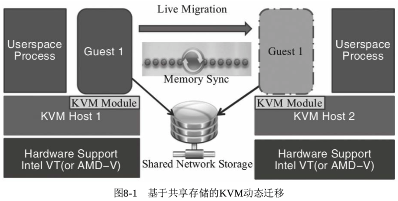
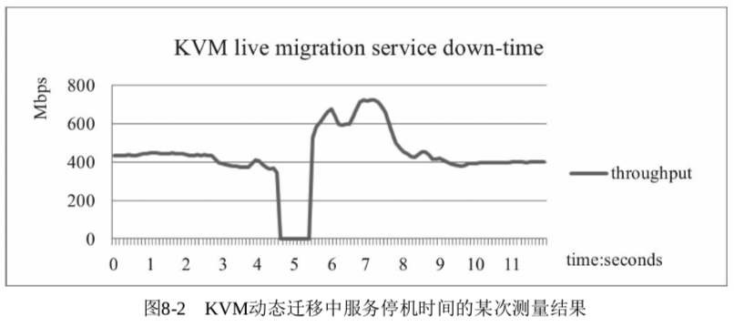
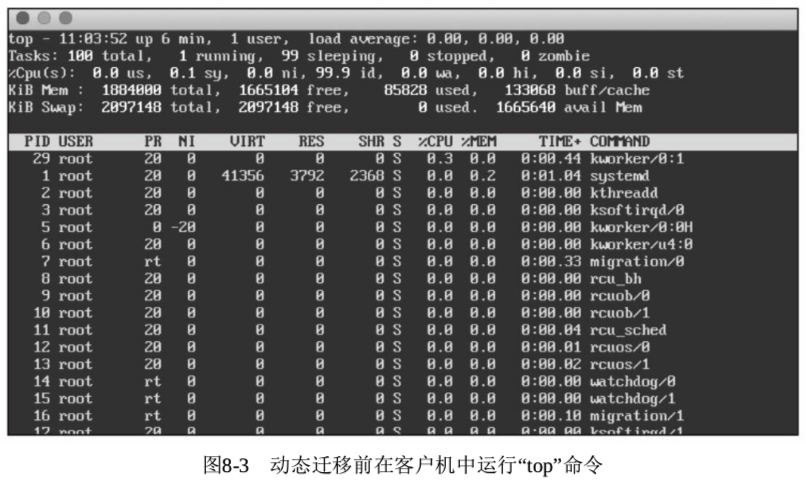
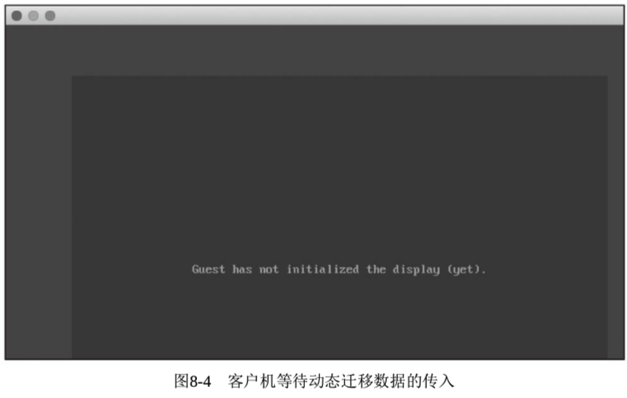
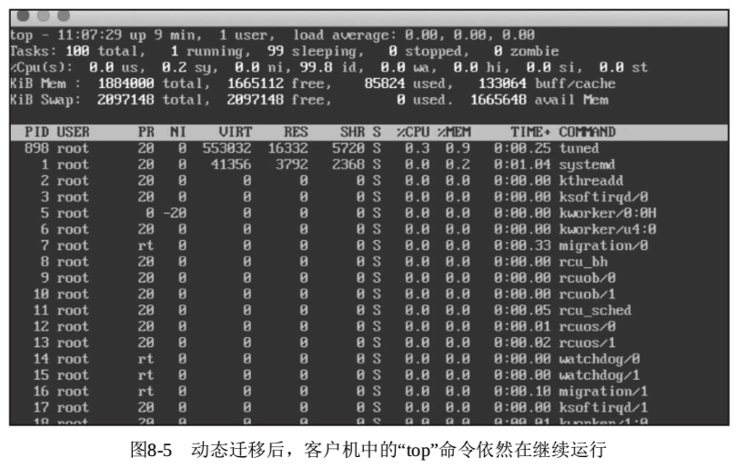

<!-- @import "[TOC]" {cmd="toc" depthFrom=1 depthTo=6 orderedList=false} -->

<!-- code_chunk_output -->

- [动态迁移的概念](#动态迁移的概念)
  - [迁移的基本概念](#迁移的基本概念)
  - [无虚拟化的迁移](#无虚拟化的迁移)
  - [虚拟化环境的迁移](#虚拟化环境的迁移)
    - [静态迁移](#静态迁移)
    - [动态迁移](#动态迁移)
- [动态迁移的效率和应用场景](#动态迁移的效率和应用场景)
  - [效率的衡量](#效率的衡量)
  - [应用场景](#应用场景)
- [KVM 动态迁移原理](#kvm-动态迁移原理)
  - [静态迁移操作](#静态迁移操作)
  - [动态迁移](#动态迁移-1)
    - [基于共享存储的动态迁移过程](#基于共享存储的动态迁移过程)
    - [迁移前后客户机状态不一致问题](#迁移前后客户机状态不一致问题)
    - [服务停机时间影响因素](#服务停机时间影响因素)
    - [KVM 动态迁移的](#kvm-动态迁移的)
- [KVM 动态迁移实践](#kvm-动态迁移实践)
  - [基于共享存储的动态迁移](#基于共享存储的动态迁移)
    - [源宿主机启动客户机](#源宿主机启动客户机)
    - [目的宿主机启动新客户机](#目的宿主机启动新客户机)
    - [monitor 中迁移](#monitor-中迁移)
    - [新虚拟机确认](#新虚拟机确认)
  - [磁盘复制的动态迁移](#磁盘复制的动态迁移)
    - [增量磁盘动态迁移](#增量磁盘动态迁移)
      - [源宿主机创建增量镜像文件并启动虚拟机](#源宿主机创建增量镜像文件并启动虚拟机)
      - [目的宿主机创建增量镜像文件并启动虚拟机](#目的宿主机创建增量镜像文件并启动虚拟机)
      - [monitor 中迁移虚拟机](#monitor-中迁移虚拟机)
    - [完整磁盘动态迁移](#完整磁盘动态迁移)
  - [monitor 中动态迁移相关命令](#monitor-中动态迁移相关命令)
- [VT-d/SR-IOV 的动态迁移](#vt-dsr-iov-的动态迁移)

<!-- /code_chunk_output -->

# 动态迁移的概念

本节首先介绍迁移的基本概念, 然后介绍有无虚拟化环境下的迁移, 最后详细介绍动态迁移.

## 迁移的基本概念

迁移(migration)包括**系统整体的迁移**和**某个工作负载的迁移**.

- **系统整体迁移**是将系统上的**所有软件(也包括操作系统)完全复制到另一台物理硬件机器**之上.
- 而**工作负载的迁移**, 是将系统上的**某个工作负载转移到另一台物理机器**上继续运行.

服务器系统迁移的作用在于

- **简化了系统维护管理**,
- **提高了系统负载均衡**,
- **增强了系统容错性**
- 并**优化了系统电源管理**.

## 无虚拟化的迁移

在**传统应用环境**中, 没有虚拟化技术的支持, **系统整体的迁移**主要是**静态迁移**. 这种迁移主要依靠**系统备份**和**恢复技术**, 将系统的软件完全复制到另一台机器上, 可以通过先做出系统的镜像文件, 然后复制到其他机器上, 或者直接通过硬盘相互复制来达到迁移的目的.

在非虚拟化环境中也有**动态迁移的概念**, 但都是**对某个(或某一组)工作负载**的迁移, 需要**特殊系统的支持**才能实现, 而且技术也不够成熟. 如哥伦比亚大学的 Zap 系统, 它通过在操作系统上提供了一个很薄的虚拟化层(这和现在主流的虚拟化技术不一样), 可以实现将工作负载迁移到另一台机器上.

## 虚拟化环境的迁移

在**虚拟化环境**中的迁移, 又分为**静态迁移(static migration**)和**动态迁移(live migration**), 也有部分人称之为**冷迁移(cold migration**)和**热迁移(hot migration**), 或者**离线迁移(offline migration**)和**在线迁移(online migration**).

**静态迁移**和**动态迁移**最大的区别就是, **静态迁移**有一段**明显时间**客户机中的**服务不可用**, 而动态迁移则没有明显的服务暂停时间.

### 静态迁移

**虚拟化环境**中的**静态迁移**也可以分为两种,

- 一种是**关闭客户机后**, 将其**硬盘镜像复制**到另一台宿主机上然后**恢复启动起来**, 这种迁移**不能保留客户机中运行的工作负载**;
- 另一种是**两台宿主机共享存储系统**, 只需在**暂停！！！(而不是完全关闭**)客户机后, **复制其内存！！！镜像**到另一台宿主机中**恢复启动即可**, 这种迁移可以**保持**客户机迁移前的内存状态和系统运行的**工作负载**.

### 动态迁移

**动态迁移**是指在保证客户机上应用服务正常运行的同时, 让客户机在不同的宿主机之间进行迁移, 其逻辑步骤与前面静态迁移几乎一致, 有硬盘存储和内存都复制的动态迁移, 也有仅复制内存镜像的动态迁移. 不同的是, 为了保证迁移过程中客户机服务的可用性, 迁移过程仅有非常短暂的停机时间. 动态迁移允许系统管理员将客户机在不同的物理机上迁移, 同时不会断开访问客户机中服务的客户端或应用程序的连接.

一个**成功的动态迁移**需要保证客户机的**内存**、**硬盘存储**、**网络连接**在迁移到目的主机后依然**保持不变**, 而且迁移过程的服务暂停时间较短.

另外, 对于虚拟化环境的迁移, 不仅包括**相同 Hypervisor 之间**的客户机迁移(如 KVM 迁移到 KVM、Xen 迁移到 Xen), 还包括**不同 Hypervisor 之间**的客户机迁移(如 Xen 迁移到 KVM、VMware 迁移到 KVM 等, 8.2 节会详细介绍).

# 动态迁移的效率和应用场景

虚拟机迁移主要增强了系统的可维护性, 其主要目标是在**客户没有感觉**的情况下, 将客户机迁移到了另一台物理机器上, 并保证其各个服务都正常使用.

## 效率的衡量

可以从如下几个方面来**衡量虚拟机迁移的效率**.

1) **整体迁移时间**: 从源主机(source host)中迁移操作开始到客户机被迁移到目的主机(destination host)并恢复其服务所花费的时间.

2) **服务器停机时间**(`service down-time`): 在迁移过程中, 源主机和目的主机上客户机的服务都处于不可用状态的时间, 此时**源主机上客户机已暂停服务**, **目的主机上客户机还未恢复服务**.

3) **对服务的性能影响**: 不仅包括**迁移后**的客户机中**应用程序的性能**与**迁移前相比是否有所降低**, 还包括迁移后对目的主机上的其他服务(或其他客户机)的性能影响.

动态迁移的**整体迁移时间**受诸多因素的影响, 如 Hypervisor 和迁移工具的种类、磁盘存储的大小(如果需要复制磁盘镜像)、内存大小及使用率、CPU 的性能及利用率、网络带宽大小及是否拥塞等, 整体迁移时间一般为几秒到几十分钟不等.

动态迁移的**服务停机时间**也受 Hypervisor 的种类、内存大小、网络带宽等因素的影响, 服务停机时间一般在几毫秒到几秒不等. 其中, 服务停机时间在几毫秒到几百毫秒, 而且在终端用户毫无察觉的情况下实现迁移, 这种动态迁移也被称为无缝的动态迁移. 而静态迁移的服务暂停时间一般都较长, 少则几秒钟, 多则几分钟, 需要依赖于管理员的操作速度和 CPU、内存、网络等硬件设备. 所以说, 静态迁移一般适合于对服务可用性要求不高的场景, 而动态迁移的停机时间很短, 适合对服务可用性要求较高的场景.

动态迁移一般**对服务的性能影响**不大, 这与两台宿主机的硬件配置情况、Hypervisor 是否稳定等因素相关.

## 应用场景

动态迁移的好处是非常明显的了, 下面来看一下动态迁移的几个应用场景.

1) **负载均衡**: 当一台物理服务器的负载较高时, 可以将其上运行的客户机动态迁移到负载较低的宿主机服务器中, 以保证客户机的服务质量(QoS). 而前面提到的, CPU、内存的过载使用可以解决某些客户机的资源利用问题, 之后当物理资源长期处于超负荷状态时, 对服务器稳定性能和服务质量都有损害的, 这时需要通过动态迁移来进行适当的负载均衡.

2) **解除硬件依赖**: 当系统管理员需要在宿主机上升级、添加、移除某些硬件设备的时候, 可以将该宿主机上运行的客户机非常安全、高效地动态迁移到其他宿主机上. 在系统管理员升级硬件系统之时, 使用动态迁移, 可以让终端用户完全感知不到服务有任何暂停时间.

3) **节约能源**: 在目前的数据中心的成本支出中, 其中有一项重要的费用是电能的开销. 当有较多服务器的资源使用率都偏低时, 可以通过动态迁移将宿主机上的客户机集中迁移到其中几台服务器上, 而在某些宿主机上的客户机完全迁移走之后, 就可以关闭其电源, 以节省电能消耗, 从而降低数据中心的运营成本.

4) 实现客户机**地理位置上的远程迁移**: 假设某公司运行某类应用服务的客户机本来仅部署在上海电信的 IDC 中, 后来发现来自北京及其周边地区的网通用户访问量非常大, 但是由于距离和网络互联带宽拥堵(如电信与网通之间的带宽)的问题, 北方用户使用该服务的网络延迟较大, 这时系统管理员可以将上海 IDC 中的部分客户机通过动态迁移部署到位于北京的网通的 IDC 中, 从而让终端用户使用该服务的质量更高.

# KVM 动态迁移原理

在 KVM 中, 既支持**离线的静态迁移**, 又支持**在线的动态迁移**.

## 静态迁移操作

对于**静态迁移**, 可以在**源宿主机**上某客户机的**QEMU monitor**中, 用"**savevm my\_tag**"命令来保存一个**完整的客户机镜像快照**(标记为 my\_tag), 然后在**源宿主机**中**关闭或暂停该客户机**.

将该客户机的**镜像文件复制**到另外一台宿主机中, 用于源宿主机中启动客户机时以**相同的命令！！！启动复制过来的镜像**, 在其 QEMU **monitor**中用"**loadvm my\_tag**"命令来**恢复刚才保存的快照**, 即可完全加载保存快照时的客户机状态.

这里的"**savevm**"命令保存的**完整客户机状态**包括**CPU 状态！！！**、**内存！！！**、**设备状态！！！**、**可写磁盘！！！**中的内容. 注意, 这种保存快照的方法需要**qcow2**、**qed 等格式**的磁盘镜像文件, 因为只有它们才**支持快照这个特性**.

## 动态迁移

本节**主要介绍**KVM 中比静态迁移更实用、更方便的**动态迁移**.

如果源宿主机和目的宿主机**共享存储系统**, 则只需要通过网络发送客户机的**vCPU 执行状态**、**内存中的内容**、**虚拟设备的状态**到目的主机上即可, 否则, 还需要将客户机的**磁盘存储(！！！KVM 是支持磁盘拷贝的！！！**) 发送到目的主机上去.

### 基于共享存储的动态迁移过程

KVM 中一个基于**共享存储的动态迁移过程**如图 8\-1 所示.



在**不考虑磁盘存储复制**的情况下(基于**共享存储系统**), KVM 动态迁移的具体迁移过程为:

1) 在客户机**动态迁移开始后**, 客户机依然在**源宿主机上运行**, 与此同时, 客户机的**内存页被传输到目的主机**之上.

2) `QEMU/KVM` 会监控并记录下迁移过程中**所有已被传输的内存页的任何修改**, 并在**所有的内存页都被传输完成后**即开始**传输**在前面过程中内存页的**更改内容**.

3) `QEMU/KVM` 也会估计**迁移过程**中的**传输速度**, 当剩余的**内存数据量**能够在一个可设定的迁移停机时间(目前 QEMU 中**默认为 300 毫秒**)内传输完成时, `QEMU/KVM` 将会**关闭源宿主机上的客户机**, 再将**剩余的数据量**传输到目的主机上去, **最后传输过来的内存内容**在目的宿主机上**恢复客户机的运行状态**.

至此, KVM 的一个动态迁移操作就完成了.

### 迁移前后客户机状态不一致问题

迁移后的客户机状态尽可能与迁移前一致, **除非目的宿主机上缺少一些配置**. 例如,

- 在**源宿主机**上有给客户机配置好**网桥类型的网络**, 但**目的主机**上**没有网桥配置**会导致迁移后客户机的**网络不通**.

- 而当客户机中**内存使用量非常大且修改频繁**, **内存中数据！！！** 被不断**修改的速度！！！** 大于 KVM 能够**传输的内存速度！！！** 之时, 动态迁移过程是不会完成的, 这时要进行迁移只能进行静态迁移. 笔者就曾遇到这样的情况, KVM 宿主机上一个拥有 4 个 vCPU、4GB 内存的客户机中运行着一个 SPECjbb2005(一个基准测试工具), 使客户机的负载较重且内存频繁地更新, 这时进行动态迁移无论怎样也不能完成, 直到客户机中 SPECjbb2005 测试工具停止运行后, 迁移过程才真正完成.

### 服务停机时间影响因素

在 KVM 中, **动态迁移服务停机时间**会与实际的**工作负载**和**网络带宽**等诸多因素有关, 一般在**数十毫秒到几秒钟之间**, 当然如果网络带宽过小或网络拥塞, 会导致服务停机时间变长.

必要的时候, 服务器端在动态迁移时暂停数百毫秒或数秒钟后恢复服务, 对于一些终端用户来说是可以接受的, 可能表现为: 浏览器访问网页速度会慢一点, 或者 ssh 远程操作过程中有一两秒不能操作但 ssh 连接并没有断开(不需要重新建立连接). 笔者曾经测试过**KVM 动态迁移过程**中的**服务停机时间**, 当时在**客户机**中运行了一个**UnixBench(一个基准测试工具**), 然后进行动态迁移, 经过测量, 某次动态迁移中服务停机时间约为 900 毫秒. 这次测试是在**客户机**中运行**netperf**(一个测试网络的基准测试工具)的**服务端**, 在另外一台机器上运行**netperf 的客户端**, 通过查看 netperf 客户端收到服务端响应数据包在迁移过程中**中断的间隔时间**来粗略地估算客户机迁移过程中服务停机时间. 某次实验的粗略结果如图 8\-2 所示, 可以看出时间从 4.6 秒到 5.5 秒为动态迁移过程中大致的服务停机时间.



### KVM 动态迁移的

从上面的介绍可知, KVM 的动态迁移是比较高效也是很有用处的功能, 在实际测试中也是比较稳定的(而且在一般情况下, 就算迁移不成功, 源宿主机上的客户机依然在正常运行). 不过, 对于 KVM 动态迁移, 也有如下几点**建议和注意事项**.

1) 源宿主机和目的宿主机之间尽量用**网络共享的存储系统**来保存客户机磁盘镜像, 尽管**KVM 动态迁移**也**支持连同磁盘镜像一起复制**(**加上一个参数**即可, 后面会介绍).

**共享存储(如 NFS**)在**源宿主机！！！** 和**目的宿主机！！！** 上的**挂载位置必须完全一致！！！**.

2) 为了提高动态迁移的成功率, 尽量在**同类型 CPU 的主机上面进行动态迁移**, 尽管 KVM 动态迁移也支持从 Intel 平台迁移到 AMD 平台(或者反向). 不过在 Intel 的两代不同平台之间进行动态迁移一般是比较稳定的, 如后面介绍实际操作步骤时, 就是从一台 Intel Broadwell 平台上运行的 KVM 中将一个客户机动态迁移到 Skylake 平台上.

3) **64 位的客户机**只能在**64 位宿主机**之间迁移, 而 32 位客户机可以在 32 位宿主机和 64 位宿主机之间迁移.

4) 动态迁移的源宿主机和目的宿主机对**NX(Never eXecute**)位的**设置是相同**, 要么同为关闭状态, 要么同为打开状态. 在 Intel 平台上的 Linux 系统中, 用"**cat/proc/cpuinfo|grep nx**"命令可以查看是否有 NX 的支持.

5) 在进行动态迁移时, **被迁移客户机的名称是唯一的**, 在目的宿主机上不能有与源宿主机中被迁移客户机同名的客户机存在. 另外, 客户机名称可以包含字母、数字和 "_"".""-" 等特殊字符.

6) 目的**宿主机**和源宿主机的软件配置要**尽可能地相同**. 例如, 为了保证动态迁移后客户机中的网络依然正常工作, 需要在目的宿主机上配置与源宿主机**同名的网桥**, 并让**客户机以桥接的方式**使用网络(参见 5.5.2 节).

# KVM 动态迁移实践

下面详细介绍在 KVM 上进行动态迁移的具体操作步骤.

## 基于共享存储的动态迁移

这里的**客户机镜像文件**存放在**NFS 的共享存储**上面, 源宿主机(kvm\-host1)和目的宿主机(kvm\-host2)都对 NFS 上的镜像文件具有可读写权限.

### 源宿主机启动客户机

1) 在源宿主机挂载 NFS 的上客户机镜像, 并启动客户机. 命令行操作如下:

```
[root@kvm-host1 ~]# mount my-nfs:/rw-images/ /mnt/images/
[root@kvm-host1 ~]# df -h | grep images
192.168.11.3:/mnt/images  734G  1.7G  695G   1% /mnt/images
[root@kvm-host1 ~]# qemu-system-x86_64 /mnt/images/rhel7.img -smp 2 -m 2048 -net nic -net tap
```

这里的特别之处是没有指定客户机中的 CPU 模型, **默认是 qemu64**这个基本的模型. 当然也可自行设置为"\-cpu Broadwell"等指定特定的模型, 不过要**保证在目的主机上也用相同的命令**. 同时指定相同的某个 CPU 模型, 可以让客户机在不同的几代平台上的迁移更加稳定.

另外, 还要在客户机中**运行一个程序**(这里执行了"top"命令), 以便在动态迁移后检查它**是否仍然正常地继续执行**. 在动态迁移前, 客户机运行"top"命令的状态如图 8\-3 所示.



### 目的宿主机启动新客户机

2) 目的宿主机上也挂载 NFS 上的客户机镜像的目录, 并且启动一个客户机用于接收动态迁移过来内存内容等. 命令行操作如下:

```
[root@kvm-host2 ~]# mount my-nfs:/rw-images/ /mnt/
[root@kvm-host2 ~]# df -h | grep images
192.168.11.3:/mnt/images  734G  1.7G  695G   1% /mnt/images
[root@kvm-host2 ~]# qemu-system-x86_64 /mnt/images/rhel7.img -smp 2 -m 2048 -net nic -net tap -incoming tcp:0:6666
```

在这一步骤中, 目的宿主机上的操作有两个值得注意的地方:

- 一是**NFS 的挂载目录**必须与**源宿主机上保持完全一致**;

- 二是启动客户机的命令与源宿主机上的启动命令一致, 但是需要增加"\-**incoming**"选项.

这里在启动客户机的 qemu 命令行中添加了"\-incoming tcp: 0: 6666"这个参数, 它表示在**6666 端口**建立一个**TCP Socket 连接**, 用于接收来自**源主机的动态迁移的内容**, 其中"**0**"表示允许来自**任何主机的连接**. "\-incoming"这个参数使这里的**QEMU 进程**进入**迁移监听(migration\-listen)模式**, 而**不是**真正以命令行中的镜像文件运行客户机.

从 VNC 中看到, 客户机是黑色的, 没有任何显示, 没有像普通客户机一样启动, 而是在等待动态迁移数据的传入, 如图 8\-4 所示.



### monitor 中迁移

3) 在源宿主机的客户机的 QEMU monitor(默认用 Ctrl+Alt+2 组合键进入 monitor)中, 使用命令"**migrate tcp:kvm\-host2:6666**"即可**进入动态迁移的流程**.

这里的 kvm\-host2 为目的宿主机的主机名(写为 IP 也是可以的), tcp 协议和 6666 端口号与目的宿主机上 qemu 命令行的"\-incoming"参数中的值保持一致.

### 新虚拟机确认

4) 在本示例中, migrate 命令从开始到执行完成, 大约用了 3 秒钟时间(万兆网络环境, 且此处无须传输磁盘镜像). 在执行完迁移后, 在目的主机上, 之前处于迁移监听模式的客户机就开始正常运行了, 其中运行的正是动态迁移过来的客户机, 可以看到客户机中的"top"命令在迁移后继续运行, 如图 8\-5 所示.



至此, 使用**NFS**作为**共享存储的动态迁移**就已经正确完成了.

## 磁盘复制的动态迁移

当然, `QEMU/KVM` 中也支持

- **增量复制磁盘修改部分数据**(使用**相同的后端镜像！！！** 时)的**动态迁移**,
- 以及**直接复制整个客户机磁盘镜像**的动态迁移.

### 增量磁盘动态迁移

使用**相同后端镜像文件**的动态迁移过程如下(即增量磁盘)

#### 源宿主机创建增量镜像文件并启动虚拟机

1) 在**源宿主机**上, 根据一个后端镜像文件, 创建一个 qcow2 格式的镜像文件, 并启动客户机. 命令行如下:

```
[root@kvm-host1 ~]# qemu-img create -f qcow2 -o backing_file=/mnt/rhel7.img,size=20G rhel7.qcow2

[root@kvm-host1 ~]# qemu-system-x86_64 rhel7.qcow2 -smp 2 -m 2048 -net nic -net tap
```

这里使用前面挂载的 NFS 上的镜像文件作为 qcow2 的后端镜像.

#### 目的宿主机创建增量镜像文件并启动虚拟机

2) 在目的宿主机上, 也建立相同的 qcow2 格式的客户机镜像, 并带有"\-**incoming**"参数来启动客户机使其处于迁移监听状态. 命令行如下:

```
[root@kvm-host2 ~]# qemu-img create -f qcow2 -o backing_file=/mnt/rhel7.img,size=20G rhel7.qcow2

[root@kvm-host2 ~]# qemu-system-x86_64 rhel7.qcow2 -smp 2 -m 2048 -net nic -net tap -incoming tcp:0:6666
```

#### monitor 中迁移虚拟机

3) 在**源宿主机**上的**客户机**的 QEMU **monitor**中, 运行"**migrate \-i tcp:kvm\-host2:6666**"命令, 即可进行动态迁移("\-i"表示**increasing**, **增量地**). 在**迁移过程**中, 还有**实时的迁移百分比显示**, 提示为"Completed 100%"即表示迁移完成.

与此同时, 在**目的宿主机！！！** 上, 在**启动迁移监听状态的客户机的命令行**所在标准输出中, 也会提示正在传输的(增量地)磁盘镜像百分比. 当传输完成时也会提示"Completed 100%", 如下:

```
[root@kvm-host2 ~]# qemu-system-x86_64 rhel7.qcow2 -smp 2 -m 2048 -net nic -net tap -incoming tcp:0:6666
VNC server running on '::1:5901'
Receiving block device images
Completed 100 %
```

至此, 基于**相同后端镜像**的磁盘增量动态迁移就已经完成, 在目的宿主机上可以看到迁移过来的客户机已经处于正常运行状态.

在本示例中, 由于 qcow2 文件中记录的**增量较小(只有几十 MB**), 因此整个迁移过程花费了**约 8 秒**的时间.

### 完整磁盘动态迁移

如果**不使用后端镜像**的**动态迁移**, 将会**传输完整的客户机磁盘镜像**(可能需要更长的迁移时间). 其步骤与上面类似, 只有**两点**需要修改:

- 一是**不需要**用"**qemu\-img**"命令创建 qcow2 格式的**增量镜像**这个步骤;

- 二是 QEMU **monitor**中的**动态迁移的命令**变为"migrate \-b tcp:kvm\-host2:6666"(\-b 参数意为**block**, **传输块设备**).

## monitor 中动态迁移相关命令

最后, 介绍在 QEMU monitor 中与动态迁移相关的几个命令. 可以用"help command"来查询命令的用法, 如下:

```
(qemu) help migrate
migrate [-d] [-b] [-i] uri -- migrate to URI (using -d to not wait for completion)
    -b for migration without shared storage with full copy of disk
    -i for migration without shared storage with incremental copy of disk (base image shared between src and destination)
(qemu) help migrate_cancel
migrate_cancel  -- cancel the current VM migration

(qemu) help migrate_set_speed
migrate_set_speed value -- set maximum speed (in bytes) for migrations. Defaults to MB if no size suffix is specified, ie. B/K/M/G/T

(qemu) help migrate_set_downtime
migrate_set_downtime value -- set maximum tolerated downtime (in seconds) for migrations

(qemu) info migrate    ##show migration status
```

对于 "`migrate [-d][-b][-i] uri`" 命令, 其中 uri 为 **uniform resource identifier**(统一资源标识符), 在上面的示例中就是 "`tcp: kvm-host2:6666`" 这样的字符串, 在不加 "-b" 和 "-i" 选项的情况下, 默认是**共享存储下的动态迁移**(**不传输任何磁盘镜像内容**).

"`-b`" 选项表示传输**整个磁盘镜像**, "`-i`" 选项是在有**相同的后端镜像**的情况下**增量传输 qcow2 类型的磁盘镜像**, 而 "`-d`" 选项是**不用等待迁移完成**就让 QEMU monior 处于**可输入命令的状态**(在前面的示例中都没有使用 "`-d`" 选项, 所以在动态迁移完成之前"migrate"命令会完全占有 monitor 操作界面, 而不能输入其他命令).

"`migrate_cancel`" 命令, 是在动态迁移进行过程中取消迁移(在 "`migrate`" 命令中需要使用 "`-d`" 选项才能有机会在迁移完成前操作 "`migrate_cancel`" 命令).

"`migrate_set_speed value`" 命令设置动态迁移中的最大传输速度, 可以带有 B、K、G、T 等单位, 表示每秒传输的字节数. 在某些生产环境中, 如果动态迁移消耗了过大的带宽, 可能会让网络拥塞, 从而降低其他服务器的服务质量, 这时也可以设置动态迁移用的合适的速度, 设置为 0 表示不限速.

"`migrate_set_downtime value`" 命令设置允许的最大停机时间, 单位是秒, value 的值可以是浮点数(如 0.5). QEUM 会预估最后一步的传输需要花费的时间, 如果预估时间大于这里设置的最大停机时间, 则不会做最后一步迁移, 直到预估时间小于等于设置的最大停机时间时才会完成最后迁移, 暂停源宿主机上的客户机, 然后传输内存中改变的内容.

# VT-d/SR-IOV 的动态迁移

前面已经介绍过, 使用 `VT-d`、`SR-IOV` 等技术, 可以让设备(如网卡)在客户机中获得非常良好的、接近原生设备的性能. 不过, 当 `QEMU/KVM` 中有**设备直接分配**到客户机中时, 就**不能对该客户机进行动态迁移**, 所以说 `VT-d`、`SR-IOV` 等的使用会破坏动态迁移的特性.

`QEMU/KVM` 并**没有直接解决**这个问题, 不过, 可以使用**热插拔设备**来**避免动态迁移的失效**.

比如, 想使用 `VT-d` 或 `SR-IOV` 方式的一个**网卡**(包括虚拟功能 VF), 可以在 qemu 命令行**启动客户机时不分配**这个网卡(而是使用网桥等方式为客户机分配网络), 当在客户机启动后, 再**动态添加该网卡到客户机**中使用. 当该客户机**需要动态迁移**时, 就**动态移除该网卡**, 让客户机在迁移前后这一小段时间内使用启动时分配的网桥方式的网络, 待动态迁移完成后, 如果迁移后的目的主机上也有可供直接分配的网卡设备, 就再重新动态添加一个网卡到客户机中. 这样既满足了使用高性能网卡的需求, 又没有损坏动态迁移的功能.

另外, 如果客户机使用**较新的 Linux 内核**, 还可以使用"**以太网绑定驱动**"(Linux Ethernet Bonding Driver), 该驱动可以将**多个网络接口绑定为一个逻辑上的单一接口**. 当在网卡热插拔场景中使用该绑定驱动时, 可以提高网络配置的灵活性和网络切换时的连续性. 关于 Linux 中的"以太网绑定驱动", 参考如下网页中 Linux 内核文档对该驱动的描述:

http://www.kernel.org/doc/Documentation/networking/bonding.txt

如果使用 **libvirt** 来**管理 QEMU/KVM**, 则在 libvirt 0.9.2 及之后的版本中已经开始支持**直接使用 VT-d 的普通设备和 SR-IOV 的 VF** 且**不丢失动态迁移的能力**. 在 libvirt 中直接使用宿主机网络接口需要 **KVM 宿主机**中 **macvtap 驱动**的支持, 要求宿主机的 Linux 内核是 2.6.38 或更新的版本.

在 libvirt 的客户机的 XML 配置文件中, 关于该功能的配置示例如下:

```xml
......
<devices>
    ......
    <interface type='direct'>
        <source dev='eth0' mode='passthrough'/>
        <model type='virtio'/>
    </interface>
</devices>
......
```

其中, `dev='eth0'` 表示使用宿主机中 eth0 这个网络接口, 如果需要在客户机中使用高性能的网络, 则 eth0 可以是一个高性能的网络接口(当然 eth0 可以根据实际情况替换为 ethX).

如果系统管理员对于客户机中网卡等设备的性能要求非常高, 而且不愿意丢失动态迁移功能, 那么可以考虑尝试使用本节介绍的 `PCI/PCI-e` 设备的动态热插拔方法, 或使用 libvirt 中提供的方法, 直接将宿主机中某个网络接口给客户机使用.

