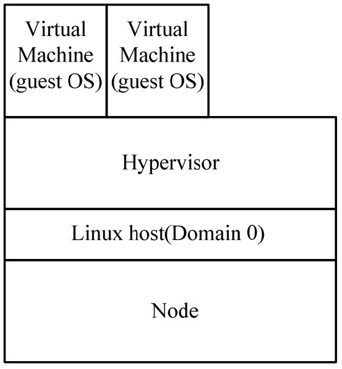
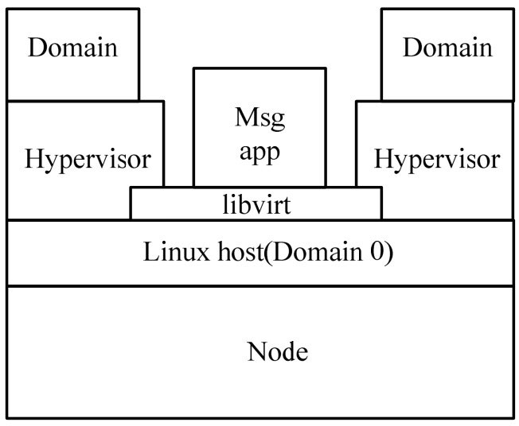
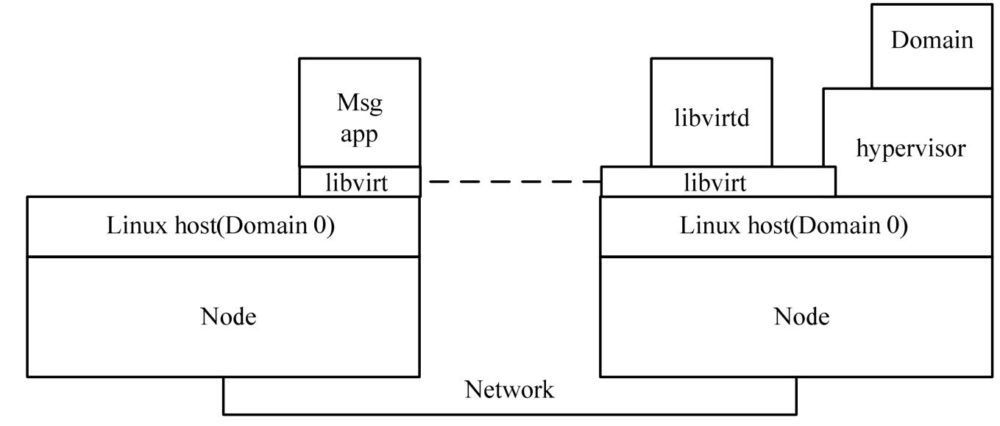
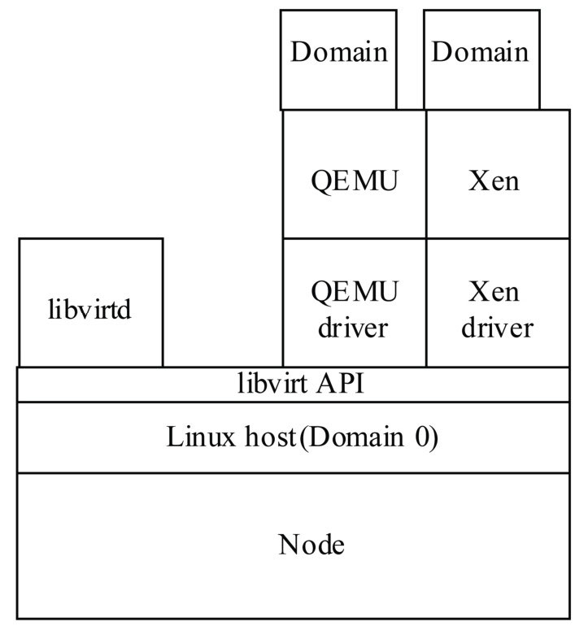
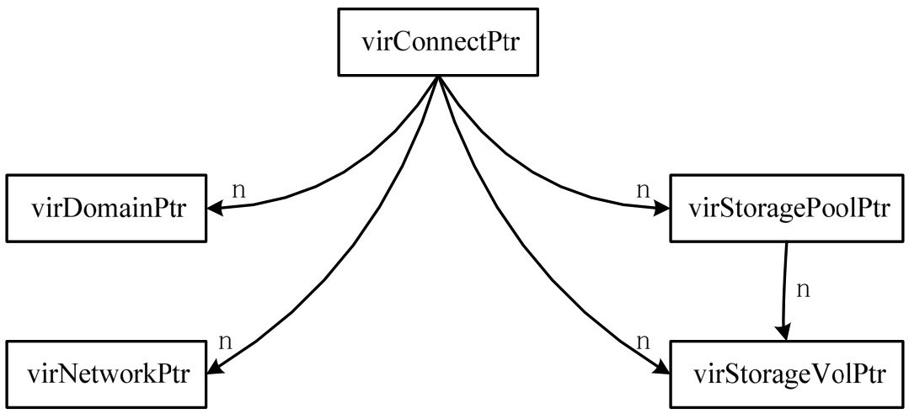
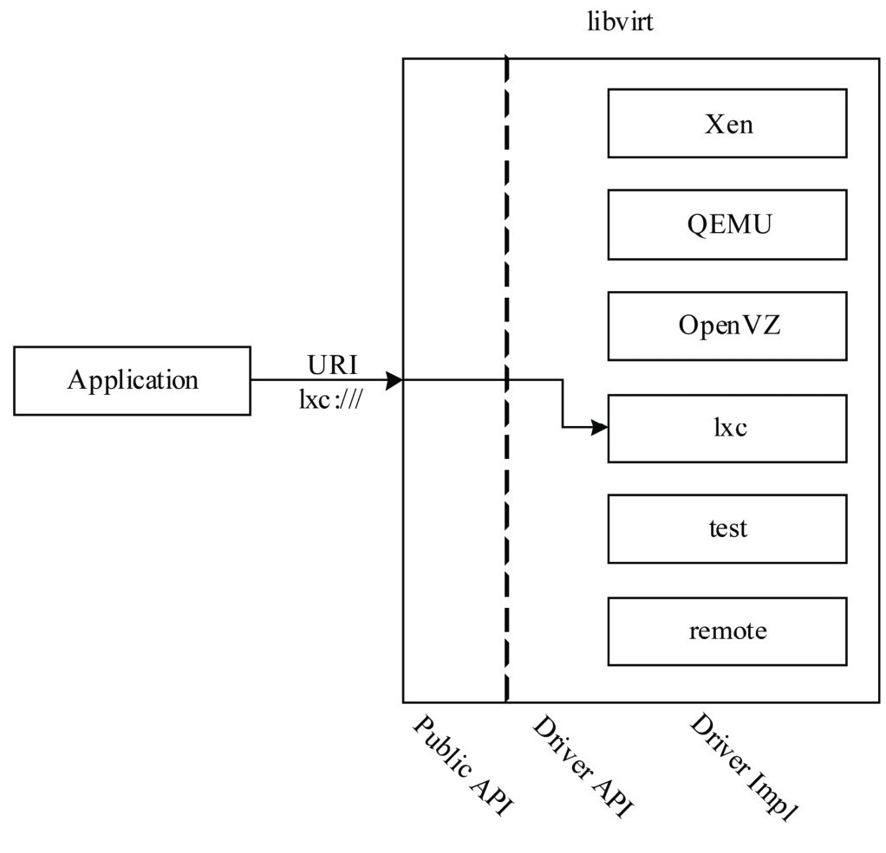
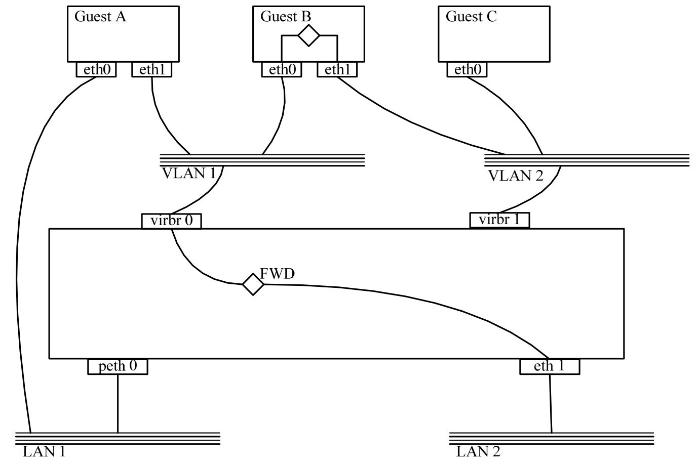
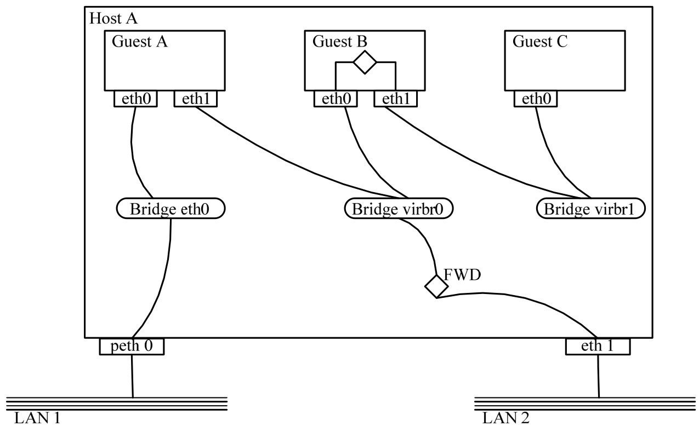

<!-- @import "[TOC]" {cmd="toc" depthFrom=1 depthTo=6 orderedList=false} -->

<!-- code_chunk_output -->

- [1. libvirt 架构说明](#1-libvirt-架构说明)
- [2. libvirt API 控制接口](#2-libvirt-api-控制接口)
  - [2.1. libvirt 对象](#21-libvirt-对象)
  - [2.2. libvirt 驱动](#22-libvirt-驱动)
  - [2.3. libvirt 守护进程及远程接入](#23-libvirt-守护进程及远程接入)
- [3. libvirt 的主机域管理](#3-libvirt-的主机域管理)
- [4. libvirt 的网络架构](#4-libvirt-的网络架构)
- [5. libvirt 的存储管理](#5-libvirt-的存储管理)

<!-- /code_chunk_output -->

libvirt 以一组 API 的形式存在, 主要用于管理应用程序. libvirt 通过一种**特定于虚拟机监控程序**的机制与**每个有效的虚拟机监控程序**进行通信, 以完成 API 请求.

libvirt 将**物理主机**称为**结点(node**), 将**客户机操作系统**称为域(**domain**).

libvirt 及其应用程序在**宿主操作系统**中运行.

# 1. libvirt 架构说明

下面通过示意图对 libvirt 架构进行介绍. 没有使用 libvirt 的虚拟机管理方式如图 8\-1 所示, 使用 libvirt 的虚拟机管理方式如图 8-2 所示.

图 8\-1 没有使用 libvirt 的虚拟机管理方式:

图 8-2 使用 libvirt 的虚拟机管理方式:

在图 8\-1 和图 8\-2 中:

- Node: 一台独立的物理机器, 即宿主机.
- Hypervisor: 宿主机中运行的软件模块, 可提供多个不同客户机操作系统的虚拟机.
- Domain: Hypervisor 所提供的运行在虚拟机之上的客户机操作系统实例.

通过比较可以看出, libvirt 为各种虚拟化工具提供一套方便、可靠的编程接口, 进而供应用程序调用, 对应用开发者屏蔽了不同虚拟机监控程序的区别.

libvirt 的控制方式有以下两种.

第一种方式**管理应用程序**和**域**位于**同一结点**上(如图 8-2 所示), 管理应用程序通过 libvirt 工作, 以控制本地域.

第二种方式**管理应用程序**和**域**位于**不同的结点**上(如图 8-3 所示). 该模式使用一种运行于远程结点上、名为 **libvirtd 的特殊守护进程**. 当在新结点上安装 libvirt 时, 该程序会自动启动, 且可自动确定本地虚拟机监控程序并为其安装驱动程序. 该**管理应用程序**通过一种**通用协议**从**本地 libvirt** 连接到**远程 libvirtd**. 对于 QEMU, 协议在 QEMU 监视器处结束. QEMU 包含一个监测控制台, 它允许检查运行中的来宾操作系统并控制虚拟机(VM)的各部分.

图 8-3 使用 libvirt 的远程虚拟机管理方式

为支持各种虚拟机监控程序的可扩展性, libvirt 实施一种基于驱动程序的架构, 该架构允许一种通用的 API 以通用方式为大量潜在的虚拟机监控程序提供服务. 这意味着: 一些虚拟机监控程序的某些专业功能在 API 中不可见. 另外, 有些虚拟机监控程序可能不能实施所有的 API 功能, 因而在特定的驱动程序内被定义为不受支持. 图 8-4 展示了 libvirt API 与相关驱动程序的层次结构. 这里也需要注意, libvirtd 提供从远程应用程序访问本地域的方式.

图 8-4 libvirt API 与相关驱动程序的层次结构

# 2. libvirt API 控制接口

本节主要对 libvirt API 的主要准则和架构选择进行详细描述.

为了能够对支持各种主流操作系统的虚拟化管理工具进行控制, libvirt API 公开了所有的资源.

## 2.1. libvirt 对象

高级 libvirt API 可划分为 5 个 API 部分, 如图 7\-5 所示.

图 8-5 高级 libvirt API 示意图

- virConnectPtr: 虚拟机监控程序连接 API. virConnectPtr 是操作所使用的第一个对象, 它代表一个到 Hypervisor 的连接. 应用程序一旦获得 virConnectPtr 连接的 Hypervisor, 就可以通过它来管理域, 以及管理存储、网络虚拟化等其他虚拟化资源.
- virDomainPtr: 域 API, 代表一个域(无论此域当前是否处于运行状态). virConnectListDomains 功能返回一系列域标识符, 它们代表当前 Hypervisor 上所有的活动域.
- virNetworkPtr: 网络 API, 代表一个网络(无论此网络当前是否在激活状态). virConnectListNetworks 功能可以将当前结点上所有的虚拟化网络列举出来.
- virStorageVolPtr: 存储卷 API , 代表一个存储卷. virStorageVolLookupByPath 功能在结点上可以根据路径找到相应的存储卷对象.
- virStoragePoolPtr: 存储池 API, 代表一个存储池. 存储池是一个对存储卷进行分配和存储的逻辑区域, virStoragePoolLookupByVolume 功能可以根据给定的存储容量找到符合要求的存储池.

以上所涉及的域、网络及存储池, 都可以处于运行状态或休眠状态. 所谓运行状态, 是指该域、网络或存储池正在运行或可以被立即调用; 所谓休眠状态, 是指该域、网络或存储池虽没有运行, 但系统中存储着对它们的永久性定义, 这样可以保证处于休眠状态的域、网络、存储池等资源在需要的时候被动态激活.

(1)Libvirt 对象运行机制的详细描述

为给定虚拟机监控程序创建连接后, 会通过该连接执行所有的通信任务和所有的 API 调用. 在 C API 中, 该行为通过 virConnectOpen 调用(以及其他进行认证的调用)提供. 这些函数的返回值是一个 virConnectPtr 对象. 该对象作为所有其他管理功能的基础, 是对给定虚拟机监控程序进行并发 API 调用所必需的语句. 重要的并发调用是 virConnectGetCapabilities 和 virNodeGetInfo, 前者返回虚拟机监控程序和驱动程序的功能, 后者获取有关结点的信息. 该信息以 XML 文档的形式返回, 这样通过解析便可了解可能发生的行为.

进入 Hypervisor 程序后, 便可以使用一组 API 调用函数重复使用该虚拟机监控程序上的各种资源. virConnectListDomains API 调用函数返回一列域标识符, 它们代表该虚拟机监控程序上的活动域.

API 实现大量针对域的函数. 要探究或管理域, 首先需要一个 virDomainPtr 对象. 我们可通过多种方式获得该句柄(使用 ID、UUID 或域名), 可以使用该函数返回的索引表并调用 virDomainLookupByID 来获取域句柄. 有了该域句柄, 就可以执行很多操作, 从探究域(virDomainGetUUID、virDomainGetInfo、virDomainGetXMLDesc、virDomainMemoryPeek)到控制域(virDomainCreate、virDomainSuspend、virDomainResume、virDomainDestroy 和 virDomainMigrate).

我们还可使用 API 管理并检查虚拟网络和存储资源. 建立 API 模型之后, 需要一个 virNetworkPtr 对象来管理并检查虚拟网络, 且需要一个 virStoragePoolPtr 或 virStorageVolPtr 对象来管理这些资源.

API 还支持一种事件机制, 您可使用该机制注册为在特定的事件(比如域的启动、中止、恢复或停止)发生时获得通知.

(2)libvirt 对象的命名方式

获取对象句柄的方式取决于该对象的命名方式, 大多数对象有多种命名方式, 主要的命名方式列举如下.

- 名字命名方式. 此命名方式直接使用该对象的名字, 可以提供非常友好的用户标识符, 但是在不同的结点中往往会有重名现象, 命名的单一性无法得到保证.
- ID 命名方式. 这种命名方式使用该对象运行时 Hypervisor 所分配的唯一标识符进行命名. 虽然保证了命名的单一性, 但是该命名在资源停用后将变得无意义.
- UUID 命名方式. 这种命名方式使用 16B 的唯一标识符进行命名. 该 16B 的标识符在 RFC 4122 中定义, 在整组结点中是唯一的, 并且长期有效.

## 2.2. libvirt 驱动

libvirt 驱动的结构如图 8-6 所示.

图 8-6 libvirt 驱动结构示意图

## 2.3. libvirt 守护进程及远程接入

只要机器上运行了 libvirt daemon(包括远程机器), 所有的 libvirt 功能就都可以访问和使用. libvirt 远程接入过程如图 8-7 所示.

图 8-7 libvirt 远程接入示意图

# 3. libvirt 的主机域管理

libvirt 的主机域管理主要是对虚拟机的管理.

libvirt 对虚拟机的管理包括不同领域的生命周期操作, 比如: 启动、停止、暂停、保存、恢复和迁移. 此外, libvirt 支持多种设备类型的热插拔操作, 包括: 磁盘、网卡、内存和 CPU.

# 4. libvirt 的网络架构

任何运行了 libvirt daemon 的主机都可以用来管理物理和逻辑的网络接口, 可以列出现有的接口卡, 配置和创建接口, 以及桥接、vlan 和关联设备等, 通过 netcf 都可以支持.

任何运行了 libvirt daemon 的主机都可以用来管理和创建虚拟网络. libvirt 虚拟网络使用防火墙规则作为路由器, 让虚拟机可以透明地访问主机的网络.

本节主要介绍启用 libvirt 网络 API 的网络配置, 详细内容如图 8-8 所示.

- VLAN 1: 此虚拟网络通过流量转发和 NAT 方式与 LAN 2 相连.
- VLAN 2: 此虚拟网络与所有的物理 LAN 完全隔离.
- Guest A: 第一个网络接口桥接到物理 LAN 1; 第二个网络接口与虚拟网络 VLAN 1 相连.
- Guest B: 第一个网络接口与虚拟网络 VLAN 1 相连, 具有有限的 NAT; 第二个网络接口与虚拟网络 VLAN 2 相连. Guest B 在两个虚拟网络之间充当路由, 可以提供有限的互联互通, 同时保证了 Guest C 与物理 LAN 2 的连接.
- Guest C: 仅有一个网络接口与虚拟网络 VLAN 2 相连. Guest C 没有直接与任何物理 LAN 相连, 只能依靠 Guest B 的路由.

libvirt 网络架构的逻辑示意图如图 8-8 所示.

图 8-8 libvirt 网络架构逻辑示意图

libvirt 网络架构的物理示意图如图 8-9 所示.

图 8-9 libvirt 网络架构物理示意图

# 5. libvirt 的存储管理

libvirt 存储管理 API 基于两个核心概念: 卷和池.

卷是一块独立的存储容量, 可以分配给用户, 也可以用于进一步构建池. 卷在一般情况下可以是一个块设备、一个原始文件, 也可以是一个特殊格式的文件.

池为获取一个存储块, 并将其分解为卷的过程提供支持. 我们可以通过池对物理磁盘、NFS 服务器、iSCSI 对象、主机适配器, 以及 LVM 组等设备进行管理.

卷和池这两个概念已被映射到 libvirt 对象中, 分别是 virStorageVolPtr 和 virStoragePoolPtr. 任何运行了 libvirt daemon 的主机都可以用来管理不同类型的存储: 创建不同格式的文件映像(如 qcow2、vmdk、raw 等)、挂接 NFS 共享、列出现有的 LVM 卷组、创建新的 LVM 卷组和逻辑卷、对未处理过的磁盘设备分区、挂接 iSCSI 共享等.

此外, 由于 libvirt 可以远程工作, 以上提到的功能都可以通过远程主机使用.
