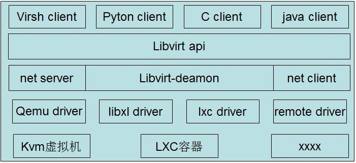
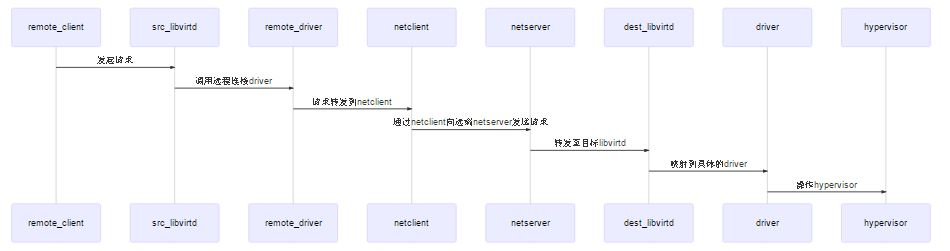
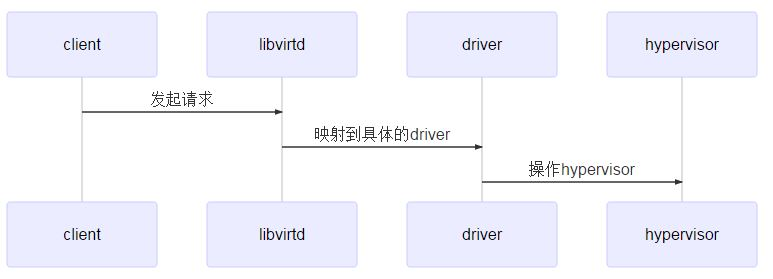

<!-- @import "[TOC]" {cmd="toc" depthFrom=1 depthTo=6 orderedList=false} -->

<!-- code_chunk_output -->

- [1. libvirt 的架构](#1-libvirt-的架构)
  - [1.1. 基本架构图](#11-基本架构图)
  - [1.2. 接口调用方式](#12-接口调用方式)
- [2. 从 nova 到 libvirt](#2-从-nova-到-libvirt)
- [3. libvirt 的接口调用流程](#3-libvirt-的接口调用流程)
- [4. qemuProcessStart()启动 qemu 进程](#4-qemuprocessstart 启动-qemu-进程)
- [5. 参考](#5-参考)

<!-- /code_chunk_output -->

# 1. libvirt 的架构

libvirt 是 CS 架构应用, 用户通过 client 与 server 交互, server 与 client 通过 socket 连接通信.

## 1.1. 基本架构图

基本架构图如下所示:



* libvirt 分为**client**和**deamon**两个部分
* libvirt **deamon**中还包含了**rpc**、**acl**、**事件机制**、**线程池**等公共组件.
    * **基于 rpc**可以实现**libvirt remote client**对本地虚拟机的操作.
    * **acl**实现了**访问控制标签**.
    * **事件机制**是 libvirt**所有动作的基础**, 所有的请求, 消息转发, 事件触发都是通过事件机制传递的.
* libvirt deamon 中通过**事件机制**监听**某个端口**的消息. **client**发出的请求会通过**socket 连接**发送到 libvirt **api**.
* libvirt deamon 在启动时会**加载**部署的**hypervisor 驱动**, libvirt api 接收到的请求会路由到**conn 对象**指定的**驱动程序**中.
* **驱动程序**接收到转发的请求之后会与**hypervisor 交互**实现对虚拟机的具体操作.
* libvirt 中目前实现了**多种 hypervisor 的驱动**, 其中**qemu_driver**对应**kvm**, **lxc**对应**容器**.
* 对于 kvm 而言, 一个虚拟机对应一个 qemu 进程. **qemu 进程**通过**软件**模拟计算机的**主板**, **CPU**, **南北桥**及**内存设备**. 虚拟机操作系统就运行在 qemu 进程内.
* libvirt 独立实现了 lxc driver 来管理容器. **lxc driver**启动一个**独立的进程**并使用这个进程拉起一个**init 子进程**, 这个子进程有其**独立的 namespace**并与 cgroup 结合实现了容器资源的隔离和限制.

## 1.2. 接口调用方式

在 libvirt 中接口的调用方式分为两种:

远程调用



本地调用



# 2. 从 nova 到 libvirt

openstack 是基于 Python 实现的, 而 libvirt 是基于 C 实现的. 那么 C 和 Python 之间是如何转换的呢.

下面以启动虚拟机实例来看一下在 openstack 中如何调用 libvirt 接口:

1. import python-libvirt 库

```python
if libvirt is None:
    libvirt = __import__('libvirt')
```

2. 通过 openAuth 获取与 libvirtd 进程的连接 conn

```python
return tpool.proxy_call(
    (libvirt.virDomain, libvirt.virConnect),
    libvirt.openAuth, uri, auth, flags)
)
```

3. 调用 define 接口创建一个虚拟机实例, 获取 domain 对象

```python
domain = self._conn.defineXML(xml)
```

4. 通过 domain 对象启动虚拟机实例

```python
domain.createWithFlags(launch_flags)
```

由这个流程我们可以看到, openstack 中主要通过与 libvirtd 进程交互, 完成对虚拟机实例的操作.

**libvirt\-python**是由 libvirt 提供的一个**面向 python client**的连接组件, 包含以下内容:

```
/usr/share/pyshared/libvirt.py #libvirt python 接口文件, 包含大部分的 libvirt 接口
/usr/share/pyshared/libvirt_lxc.py #lxc 接口文件, 因为这部分接口参数不能自动转换, 所以通过手动重写完成转换
/usr/share/pyshared/libvirt_qemu.py #与上面的类似, qemu 相关的.
/usr/lib/python2.7/dist-packages/libvirtmod_qemu.so
/usr/lib/python2.7/dist-packages/libvirtmod_lxc.so
/usr/lib/python2.7/dist-packages/libvirtmod.so
```

在**libvirt 代码**中有一个专门的目录用于存放接口 python 化相关的代码.

所有的**libvirt 接口**被分为了两个部分:

1. 可以**直接自动转换**的接口, 使用**generator.py**直接封装 python 接口
2. 无法直接自动转换的接口, 通过**libvirt-override.c 等文件**对 C 接口做一层封装再封装 python 接口.

**libvirt-python**工程会将未重写和重写过的接口编译到一个动态库中, 并且和生成的 py 文件一起打包到 python-libvirt 包中. 然后我们就可以通过引入这个 python 库的方式调用 libvirt 的 C 接口了.

# 3. libvirt 的接口调用流程

下面继续以创建虚拟机为例说明 libvirt 中接口调用的流程

1. libvirt 中接收**xml 格式定义的虚拟机实例配置**, nova 通过**defineXML 接口**定义虚拟机. 该接口返回一个虚拟机的 domain 对象, 用户接下来可以通过这个对象操作虚拟机.

```python
domain = self._conn.defineXML(xml)
```

2. 第一步只是执行了定义操作, 相当于 libvirt 开始管理这台虚拟机. 但是此时实际的虚拟机还没有运行, 用户还无法使用. nova 中调用 domain.**createWithFlags**(launch_flags)接口, 用第一步中定义的虚拟机规格在**hypervisor 层**把虚拟机真正创建起来.

3. createWithFlags 调用**libvirt\-python**封装的 virDomainCreateWithFlags

```python
def createWithFlags(self, flags=0):
        ret = libvirtmod.virDomainCreateWithFlags(self._o, flags)
        if ret == -1: raise libvirtError ('virDomainCreateWithFlags() failed', dom=self)
        return ret
```

4. 在 libvirt\-python 中, createWithFlags 接口是**直接封装**的, 参数不需要转换. 下一步会在转换中调用到**libvirt.c**中的**virDomainCreateWithFlags 接口**, 由此进入 libvirt api 层.  传入的 flag 值为 0, flag 取值范围及对应含义如下:

```python
VIR_DOMAIN_NONE               = 0,      /* Default behavior */
VIR_DOMAIN_START_PAUSED       = 1 << 0, /* Launch guest in paused state */
VIR_DOMAIN_START_AUTODESTROY  = 1 << 1, /* Automatically kill guest when virConnectPtr is closed */
VIR_DOMAIN_START_BYPASS_CACHE = 1 << 2, /* Avoid file system cache pollution */
VIR_DOMAIN_START_FORCE_BOOT   = 1 << 3, /* Boot, discarding any managed save */
```

```cpp
int
virDomainCreateWithFlags(virDomainPtr domain, unsigned int flags) {
    virConnectPtr conn;

    VIR_DOMAIN_DEBUG(domain, "flags=%x", flags);

    virResetLastError();#重置错误码.
    #libvirt 中采用了线程池机制, 每次从线程池中取出一个线程执行当前的请求.
    #线程中会保存当前线程最后产生的错误码, 因此在请求最开始的位置就要把原有的错误重置, 防止误报.

    #合法性检查, 传入的 domain 指针及其中的 conn 指针是否为正确的类型.
    if (!VIR_IS_CONNECTED_DOMAIN(domain)) {
        virLibDomainError(VIR_ERR_INVALID_DOMAIN, __FUNCTION__);
        virDispatchError(NULL);
        return -1;
    }
    #获取 domain 中的 conn 指针, 如果 conn 是只读的, 则设置错误码并直接退出. 因为创建虚拟机属于修改操作.
    conn = domain->conn;
    if (conn->flags & VIR_CONNECT_RO) {
        virLibDomainError(VIR_ERR_OPERATION_DENIED, __FUNCTION__);
        goto error;
    }
    #从这里跳转到具体的 driver 中执行. 驱动在 libvirtd 启动的时候加载, 映射关系由 conn 指针初始化的时候指定. 在配置文件中可以配置默认的 conn driver, 也可以在创建 conn 的时候通过接口参数指定.
    if (conn->driver->domainCreateWithFlags) {
        int ret;
        ret = conn->driver->domainCreateWithFlags(domain, flags);
        if (ret < 0)
            goto error;
        return ret;
    }
    #如果驱动中没有实现对应的方法, 直接报 no support 错误.
    virLibConnError(VIR_ERR_NO_SUPPORT, __FUNCTION__);

error:
    virDispatchError(domain->conn);
    return -1;
}
```

5. libvirt 中**每一个 driver**都有**一张映射关系表**, 用于对应 driver 中的函数指针和具体的 driver 函数. 第 4 步中从 api 映射到了具体的 driver. 在 qemu_driver.c 中查找该函数.

```cpp
static int
qemuDomainCreateWithFlags(virDomainPtr dom, unsigned int flags)
{
    virQEMUDriverPtr driver = dom->conn->privateData;
    virDomainObjPtr vm;
    int ret = -1;
    #首先检查传入 flag 参数的合法性, 必须是上面提到的几个可选值之一. 这里是一个宏来实现的, 如果出错直接返回-1.
    virCheckFlags(VIR_DOMAIN_START_PAUSED |
                  VIR_DOMAIN_START_AUTODESTROY |
                  VIR_DOMAIN_START_BYPASS_CACHE |
                  VIR_DOMAIN_START_FORCE_BOOT, -1);
    #获取虚拟机的 vm 指针
    if (!(vm = qemuDomObjFromDomain(dom)))
        return -1;
    #访问控制, 判断当前 conn 是否有权限执行该操作. 目前配置的访问控制标签默认为 None, 即所有用户都有最高权限.
    if (virDomainCreateWithFlagsEnsureACL(dom->conn, vm->def) < 0)
        goto cleanup;
    #获取虚拟机 job 锁, 类型为 MODIFY, 可选类型如后所示. 只有获得该锁才能继续执行.
    if (qemuDomainObjBeginJob(driver, vm, QEMU_JOB_MODIFY) < 0)
        goto cleanup;
    #检查虚拟机是否已经处于运行状态
    if (virDomainObjIsActive(vm)) {
        virReportError(VIR_ERR_OPERATION_INVALID,
                       "%s", _("domain is already running"));
        goto endjob;
    }
    #启动虚拟机
    if (qemuDomainObjStart(dom->conn, driver, vm, flags) < 0)
        goto endjob;

    ret = 0;

endjob:
    #该 job 是同步操作, 任务结束之后要释放 job 锁.
    if (!qemuDomainObjEndJob(driver, vm))
        vm = NULL;

cleanup:
    if (vm)
        virObjectUnlock(vm);
    return ret;
}
```

qemu job 的类型

```cpp
QEMU_JOB_NONE = 0,  /* Always set to 0 for easy if (jobActive) conditions */
QEMU_JOB_QUERY,         /* Doesn't change any state */
QEMU_JOB_DESTROY,       /* Destroys the domain (cannot be masked out) */
QEMU_JOB_SUSPEND,       /* Suspends (stops vCPUs) the domain */
QEMU_JOB_MODIFY,        /* May change state */
QEMU_JOB_ABORT,         /* Abort current async job */
QEMU_JOB_MIGRATION_OP,  /* Operation influencing outgoing migration */

/* The following two items must always be the last items before JOB_LAST */
QEMU_JOB_ASYNC,         /* Asynchronous job */
QEMU_JOB_ASYNC_NESTED,  /* Normal job within an async job */

QEMU_JOB_LAST
};
```

6. 第 5 步中调用到了 qemuDomainObjStart,这个函数处理了虚拟机 wakeup 的逻辑并且在虚拟机启动成功之后发送事件通知.

```cpp
static int
qemuDomainObjStart(virConnectPtr conn, virQEMUDriverPtr driver, virDomainObjPtr vm, unsigned int flags)
{
    int ret = -1;
    char *managed_save;
    #根据传入的参数确定虚拟机的启动模式
    bool start_paused = (flags & VIR_DOMAIN_START_PAUSED) != 0;
    bool autodestroy = (flags & VIR_DOMAIN_START_AUTODESTROY) != 0;
    bool bypass_cache = (flags & VIR_DOMAIN_START_BYPASS_CACHE) != 0;
    bool force_boot = (flags & VIR_DOMAIN_START_FORCE_BOOT) != 0;
    unsigned int start_flags = VIR_QEMU_PROCESS_START_COLD;

    start_flags |= start_paused ? VIR_QEMU_PROCESS_START_PAUSED : 0;
    start_flags |= autodestroy ? VIR_QEMU_PROCESS_START_AUTODESTROY : 0;

    #组装 hibernate 文件的路径
    managed_save = qemuDomainManagedSavePath(driver, vm);

    if (!managed_save)
        goto cleanup;
    #如果存在 hibernate 文件, 则从该文件恢复虚拟机
    if (virFileExists(managed_save)) {
        #启动时可以指定强制启动, 此时移除 hibernate 文件并按照正常流程启动虚拟机
        if (force_boot) {
            if (unlink(managed_save) < 0) {
                virReportSystemError(errno,
                                     _("cannot remove managed save file %s"),
                                     managed_save);
                goto cleanup;
            }
            vm->hasManagedSave = false;
        } else {
        #从 hibernate 文件恢复虚拟机, 因为我们目前还不支持内存快照的功能, 暂时不跟进了.
            ret = qemuDomainObjRestore(conn, driver, vm, managed_save,
                                       start_paused, bypass_cache);
            #恢复成功, 移除 suspend 文件
            if (ret == 0) {
                if (unlink(managed_save) < 0)
                    VIR_WARN("Failed to remove the managed state %s", managed_save);
                else
                    vm->hasManagedSave = false;
            }
            #如果恢复失败, 则忽略 suspend 文件直接按正常流程启动虚拟机
            if (ret > 0)
                VIR_WARN("Ignoring incomplete managed state %s", managed_save);
            else
                goto cleanup;
        }
    }
    #启动 qemu 进程
    ret = qemuProcessStart(conn, driver, vm, NULL, -1, NULL, NULL,
                           VIR_NETDEV_VPORT_PROFILE_OP_CREATE, start_flags);
    #虚拟机启动完成之后, 验证对应的启动参数, 并且在/var/run/libvirt/qemu 目录下保存一份运行状态的配置文件, 这个文件的内容在虚拟机配置改变的时候会随之改变,
    virDomainAuditStart(vm, "booted", ret >= 0);
    if (ret >= 0) {
        #向事件队列发送虚拟机启动事件. 如果此时有程序在监听此事件就会收到相应的通知.
        virDomainEventPtr event =
            virDomainEventNewFromObj(vm,
                                     VIR_DOMAIN_EVENT_STARTED,
                                     VIR_DOMAIN_EVENT_STARTED_BOOTED);
        if (event) {
            qemuDomainEventQueue(driver, event);
            #如果指定了启动之后 pause 虚拟机, 同时还要发送一个虚拟机 pause 事件.
            if (start_paused) {
                event = virDomainEventNewFromObj(vm,
                                                 VIR_DOMAIN_EVENT_SUSPENDED,
                                                 VIR_DOMAIN_EVENT_SUSPENDED_PAUSED);
                if (event)
                    qemuDomainEventQueue(driver, event);
            }
        }
    }

cleanup:
    VIR_FREE(managed_save);
    return ret;
}
```

7. 接下来我们来分析一下 qemuProcessStart 函数, 这个函数处理 qemu 进程启动的主逻辑流程. 由于这个函数中逻辑比较长, 就不直接贴代码了, 只选取其中关键部分了解一下.

# 4. qemuProcessStart()启动 qemu 进程

`qemu/qemu_process.c`

首先, 老规矩检查输入参数.

```cpp
virCheckFlags(VIR_QEMU_PROCESS_START_COLD |
                  VIR_QEMU_PROCESS_START_PAUSED |
                  VIR_QEMU_PROCESS_START_AUTODESTROY, -1);
```

再次检查虚拟机是否处于运行状态. 在 api 中检查的时候并未持有 job 锁, 虚拟机可能正在执行启动操作. 在拿到虚拟机 job 锁后做最后一次检查, 如果没有启动则可以保证在本次启动过程中不会有其他的启动操作了.

```cpp
if (virDomainObjIsActive(vm)) {
        virReportError(VIR_ERR_OPERATION_INVALID,
                       "%s", _("VM is already active"));
        virObjectUnref(cfg);
        return -1;
    }
```

复制**xml 文件**下发的配置, 作为虚拟机的**在线配置**.

在 libvirt 中, 虚拟机配置分为**在线配置**和**离线配置**两种.

* **在线配置**记录在**内存**中, 与**虚拟机实时状态**保持一致(比如执行网卡热插拔之后, 在线配置也会同步更新).
* 离线配置则作为一个**持久化配置**记录在宿主机磁盘上, 虚拟机关机之后仍然存在直到虚拟机被**undefine**, **下一次启动**的时候使用该配置. **离线插拔设备**等操作会更新离线配置信息, 虚拟机关机的时候也会把在线配置更新到离线配置中.

```cpp
if (virDomainObjSetDefTransient(caps, driver->xmlopt, vm, true) < 0)
        goto cleanup;
```

获取虚拟机 vm-id. 这个 ID 与 nova 中的 instance uuid 不是一回事, 仅有运行状态的虚拟机有这个 ID. 宿主机唯一, 宿主机重启之后会重新计算.

```cpp
vm->def->id = qemuDriverAllocateID(driver);
```

设置虚拟机的 fakereboot 标志位, 正常 reboot 虚拟机的时候, qemu 进程会被 kill 掉并重新启动. 而如果 fakereboot 被设置为 true 时, 只是重置当前 qemu 进程.

```cpp
qemuDomainSetFakeReboot(driver, vm, false);
```

设置虚拟机状态. libvirt 中有一套虚拟机状态管理机制, 分为 stat 和 reason. 并提供了相应的查询接口, 可以查询虚拟机当前状态以及进入当前状态的原因.

```cpp
virDomainObjSetState(vm, VIR_DOMAIN_SHUTOFF, VIR_DOMAIN_SHUTOFF_UNKNOWN);
```

执行 hook 脚本. libvirt 提供了**hook 机制**, 允许用户在某些事件发生时执行预先自定义的脚本文件. 目前我们的默认配置均为空.

```cpp
if (virHookPresent(VIR_HOOK_DRIVER_QEMU)) {
        char *xml = qemuDomainDefFormatXML(driver, vm->def, 0);
        int hookret;

        hookret = virHookCall(VIR_HOOK_DRIVER_QEMU, vm->def->name,
                              VIR_HOOK_QEMU_OP_PREPARE, VIR_HOOK_SUBOP_BEGIN,
                              NULL, xml, NULL);
        VIR_FREE(xml);

        /*
         * If the script raised an error abort the launch
         */
        if (hookret < 0)
            goto cleanup;
    }
```

获取宿主机上安装的 qemu 支持的特性列表, 用于后续对虚拟机执行某些操作时判断兼容性.

```cpp
if (!(priv->qemuCaps = virQEMUCapsCacheLookupCopy(driver->qemuCapsCache,
                                                      vm->def->emulator)))
        goto cleanup;
```

预处理配置文件中的虚拟设备.

```cpp
#处理配置文件中的直通网卡. 虽然在配置文件中指定设备类型为 interface, 但是实际上直通网卡还是一个 PCI 设备, 因此将其加入 hostdev 设备中.
    if (qemuNetworkPrepareDevices(vm->def) < 0)
       goto cleanup;
    #处理直通设备. 直通设备分为三类: PCI 设备, USB 设备及 scsi 设备.
    #PCI 设备的处理逻辑比较复杂, 大致流程为
    # - 检查配置的 PCI 设备是否已经直通到其他虚拟机
    # - 移除这些设备的原有驱动
    # - 重置这些设备
    # - 对于 SRIOV 的网卡直通设备, 需要额外设置一些网络相关的参数
    # - 在 qemu 驱动中将这些设备设置为 active 状态
    # - 在 qemu 驱动的未启用设备列表中移除这些设备
    # - 在 qemu 驱动中记录当前使用这些设备的虚拟机
    # - 记录这些设备的原始状态
    # - 从 host 上隐藏这些设备
    #经过以上处理之后, 配置的 PCI 设备就可以作为一个普通的虚拟机设备供虚拟机使用了.
    #对于 USB 直通设备不需要这么复杂, 只要确保设备存在并且在 qemu 驱动中记录使用这些设备的虚拟机.
    #
    if (qemuPrepareHostDevices(driver, vm->def, priv->qemuCaps,
                               !migrateFrom) < 0)
        goto cleanup;
    #处理字符设备, 包括 serial, parallels, channel, console 等设备类型, 主要是检查这些设备是否存在
    if (virDomainChrDefForeach(vm->def,
                               true,
                               qemuProcessPrepareChardevDevice,
                               NULL) < 0)
        goto cleanup;
```

安全相关的, 这块没有接触过.

移除原有的 cgroup 目录

```cpp
qemuRemoveCgroup(vm);
```

初始化图形设备 vnc/spice, 我们现在主要使用的是 vnc. 根据配置分配 vnc 端口.

创建虚拟机日志文件/var/log/libvirtd/qemu/虚拟机名称.log

```cpp
if (virFileMakePath(cfg->logDir) < 0) {
        virReportSystemError(errno,
                             _("cannot create log directory %s"),
                             cfg->logDir);
        goto cleanup;
    }
    if ((logfile = qemuDomainCreateLog(driver, vm, false)) < 0)
        goto cleanup;
```

检查宿主机是否支持 kvm, 判断条件为/dev/kvm 设备文件是否存在

```cpp
if (vm->def->virtType == VIR_DOMAIN_VIRT_KVM) {
        VIR_DEBUG("Checking for KVM availability");
        if (!virFileExists("/dev/kvm")) {
            virReportError(VIR_ERR_CONFIG_UNSUPPORTED, "%s",
                           _("Domain requires KVM, but it is not available. "
                             "Check that virtualization is enabled in the host BIOS, "
                             "and host configuration is setup to load the kvm modules."));
            goto cleanup;
        }
    }
```

检查 vcpu 配置的合法性. 配置的 maxvcpus 数量不能超过宿主机配置的最大 vcpu 数量

```cpp
    if (!qemuValidateCpuMax(vm->def, priv->qemuCaps))
        goto cleanup;
```

为所有的设备分配别名

```cpp
    if (qemuAssignDeviceAliases(vm->def, priv->qemuCaps) < 0)
        goto cleanup;
    #分配的别名可以通过 virsh dumpxml 命令查看
```

检查磁盘设备的后端文件是否存在

设置 numa 配置. numa 是 CPU/内存亲和性的配置, 宿主机的内存一般分配为两个 numa node, 每个 numa node 对应一个 CPU socket. 如果 cpu 访问的是对应 numa node 上的内存会带来性能提升. lscpu 命令可以看到宿主机的 numa 配置

```cpp
#如果配置文件中指定 numa 为自动模式, 会从 numad 中获取自动分配的结果.
    if ((vm->def->placement_mode ==
         VIR_DOMAIN_CPU_PLACEMENT_MODE_AUTO) ||
        (vm->def->numatune.memory.placement_mode ==
         VIR_NUMA_TUNE_MEM_PLACEMENT_MODE_AUTO)) {
        nodeset = virNumaGetAutoPlacementAdvice(vm->def->vcpus,
                                                vm->def->mem.max_balloon);
        if (!nodeset)
            goto cleanup;

        VIR_DEBUG("Nodeset returned from numad: %s", nodeset);

        if (virBitmapParse(nodeset, 0, &nodemask,
                           VIR_DOMAIN_CPUMASK_LEN) < 0)
            goto cleanup;
    }
    #在 hook 中记录对应的 numa 配置
    hookData.nodemask = nodemask;
```

设置 qemu monitor. qemu monitor 是 libvirtd 与 qemu 之间的 socket 通信管道, libvirt 对 qemu 的操作, qemu 进程的状态监控等都要通过这个管道使用 qmp 通信协议进行.

```cpp
    if (VIR_ALLOC(priv->monConfig) < 0)
        goto cleanup;
    if (qemuProcessPrepareMonitorChr(cfg, priv->monConfig, vm->def->name) < 0)
        goto cleanup;
    priv->monJSON = virQEMUCapsGet(priv->qemuCaps, QEMU_CAPS_MONITOR_JSON);
    priv->monError = false;
    priv->monStart = 0;
    priv->gotShutdown = false;
```

配置当前虚拟机的 pidfile, 这个文件用于检测虚拟机是否正在运行. 注意, 此处并没有真正创建该文件, qemu 进程还未拉起, 无法获取 qemu 进程 pid.

```cpp
    VIR_FREE(priv->pidfile);
    if (!(priv->pidfile = virPidFileBuildPath(cfg->stateDir, vm->def->name))) {
        virReportSystemError(errno,
                             "%s", _("Failed to build pidfile path."));
        goto cleanup;
    }
    if (unlink(priv->pidfile) < 0 &&
        errno != ENOENT) {
        virReportSystemError(errno,
                             _("Cannot remove stale PID file %s"),
                             priv->pidfile);
        goto cleanup;
    }
```

为 pci 设备分配插槽号. 正常情况下, 在虚拟机 define 之后就已经完成了插槽号的分配. 此处再分配一次的目的是为了解决一些升级的问题, 并为热插操作预留插槽. PCI 是计算机中的总线设备, 用于连接外围设备与 CPU. 默认每个 PCI 设备支持连接 32 个外围设备并且支持 PCI 设备的桥接. libvirt 目前仅支持在 pci root 设备上做 pci 桥接, 不支持 pci 设备的多级级联. 设备插槽号包括 bus, slot 和 function 三个层级. bus 表示在第几个 pci 总线设备, slot 表示在当前 pci 总线的第几个槽位, function 表示是当前槽位设备上的第几个 function 设备. (多 function 设备, 在一个插槽上可以集成多个功能设备, 在 kvm 虚拟机里面最典型的就是 ISA 总线, IDE 控制器, USB 控制器和 ACPI 高级电源管理几个设备都是集成在同一个插槽上的)

```cpp
    if (virQEMUCapsGet(priv->qemuCaps, QEMU_CAPS_DEVICE)) {
        VIR_DEBUG("Assigning domain PCI addresses");
        if ((qemuDomainAssignAddresses(vm->def, priv->qemuCaps, vm)) < 0)
            goto cleanup;
    }
```

组装 qemu 命令. 经过上面的步骤以后, 可以根据配置文件把 qemu 命令的命令行组装起来了

```cpp
    if (!(cmd = qemuBuildCommandLine(conn, driver, vm->def, priv->monConfig,
                                     priv->monJSON, priv->qemuCaps,
                                     migrateFrom, stdin_fd, snapshot, vmop,
                                     &buildCommandLineCallbacks)))
        goto cleanup;
```

qemu 命令组装完成之后就可以开始运行 qemu 进程了, 此时需要先触发 qemu 启动事件的 hook 脚本

```cpp
if (virHookPresent(VIR_HOOK_DRIVER_QEMU)) {
        char *xml = qemuDomainDefFormatXML(driver, vm->def, 0);
        int hookret;
        hookret = virHookCall(VIR_HOOK_DRIVER_QEMU, vm->def->name,
                              VIR_HOOK_QEMU_OP_START, VIR_HOOK_SUBOP_BEGIN,
                              NULL, xml, NULL);
        VIR_FREE(xml);
        if (hookret < 0)
            goto cleanup;
    }
```

向 qemu 日志中写入启动日志(时间和 qemu command 命令行)

```cpp
    if ((timestamp = virTimeStringNow()) == NULL) {
        goto cleanup;
    } else {
        if (safewrite(logfile, timestamp, strlen(timestamp)) < 0 ||
            safewrite(logfile, START_POSTFIX, strlen(START_POSTFIX)) < 0) {
            VIR_WARN("Unable to write timestamp to logfile: %s",
                     virStrerror(errno, ebuf, sizeof(ebuf)));
        }

        VIR_FREE(timestamp);
    }

    virCommandWriteArgLog(cmd, logfile);
```

向日志文件中写入一些告警信息(主要是一些有危险的配置告警, 没有什么影响)

```cpp
qemuDomainObjCheckTaint(driver, vm, logfile);
```

记录 qemu 日志文件的最后位置, 后面会用到

```cpp
    if ((pos = lseek(logfile, 0, SEEK_END)) < 0)
        VIR_WARN("Unable to seek to end of logfile: %s",
                 virStrerror(errno, ebuf, sizeof(ebuf)));
```

为 qemu cmd 设置一些标志位

```cpp
    virCommandSetPreExecHook(cmd, qemuProcessHook, &hookData);
    virCommandSetMaxProcesses(cmd, cfg->maxProcesses);
    virCommandSetMaxFiles(cmd, cfg->maxFiles);

    VIR_DEBUG("Setting up security labelling");
    if (virSecurityManagerSetChildProcessLabel(driver->securityManager,
                                               vm->def, cmd) < 0) {
        goto cleanup;
    }
    #qemu 的标准输出定向到日志文件
    virCommandSetOutputFD(cmd, &logfile);
    #qemu 错误输出定向到日志文件
    virCommandSetErrorFD(cmd, &logfile);
    virCommandNonblockingFDs(cmd);
    virCommandSetPidFile(cmd, priv->pidfile);
    virCommandDaemonize(cmd);
    #创建一个握手连接, 用于 qemu 和 libvirt 之间通信. 可以确保 hook 的执行时间可以由 libvirtd 控制. 当 qemu 进程启动, 但是还未完成的时候, libvirtd 没有通过这个连接发送信号, qemu 的 hook 不会执行. qemu 进程启动完成之后, libvirtd 检测到并且发送信号, 这时候才去执行 qemu 的 hook 脚本.
    virCommandRequireHandshake(cmd);
```

启动 qemu 进程(到这里终于真的启动了 qemu 进程, qemu 根据传入的参数创建各种设备, 创建 vcpu 线程, 申请内存, 这些操作完成之后相当于硬件准备完成, 主板发送上电信号, 引导主板上的 bios 程序并进一步引导磁盘设备上的 bootloader. )

```cpp
    ret = virCommandRun(cmd, NULL);
```

libvirt 通过**fork 函数**启动 qemu 进程. fork 执行完毕之后要判断 qemu 进程是否正常拉起.

```cpp
    #通过 fork 返回值和 pid file 内容判断
    if (ret == 0) {
        if (virPidFileReadPath(priv->pidfile, &vm->pid) < 0) {
            virReportError(VIR_ERR_INTERNAL_ERROR,
                           _("Domain %s didn't show up"), vm->def->name);
            ret = -1;
        }
        VIR_DEBUG("QEMU vm=%p name=%s running with pid=%llu",
                  vm, vm->def->name, (unsigned long long)vm->pid);
    } else {
        VIR_DEBUG("QEMU vm=%p name=%s failed to spawn",
                  vm, vm->def->name);
    }
```

保存虚拟机在线配置

```cpp
    if (virDomainSaveStatus(driver->xmlopt, cfg->stateDir, vm) < 0) {
        goto cleanup;
    }
```

监听之前创建的握手 socket, 等待 qemu 进程发出的握手信号

```cpp
    if (virCommandHandshakeWait(cmd) < 0) {
        goto cleanup;
    }
```

收到握手信号之后表明 qemu 进程已经启动完成, 接下来可以设置该进程的 cgroup 参数.

```cpp
    #首先要初始化当前虚拟机的 cgroup 目录, 在每一个 cgroup 子系统的 machine 层级下创建虚拟机对应的层级.
    #device 子系统, 设置当前虚拟机可以访问的设备号.
    #blkio 子系统, 设置磁盘 qos 参数.
    #memory 子系统, 设置内存 qos 参数, 这个目前暂时没有配置.
    #cpu 子系统, 设置 cpu qos 参数. 只是设置其中的 share 参数, 即 CPU 权重, 同样 VCPU 数量的前提下, 权重越大, 获得的 CPU 时间越多.
    #cpuset 子系统的设置项较多, 包括:
    #如果配置文件中指定了 numatune 配置, 则使用指定的参数. 如果没有指定, 则使用默认生成的推荐参数.
    #如果配置文件中指定 CPU 绑定方式为 auto, 则会根据默认生成的 numa 配置参数配置相应的 CPU 绑定关系. 如果指定了 CPU 绑定关系, 则按照指定的绑定关系配置.
    if (qemuSetupCgroup(driver, vm, nodemask) < 0)
        goto cleanup;
```

通过 taskset 命令直接指定 qemu 进程的 CPU 亲和性. 要注意的是这里的设置是针对整个 qemu 进程的.

```cpp
    if (!vm->def->cputune.emulatorpin &&
        qemuProcessInitCpuAffinity(driver, vm, nodemask) < 0)
        goto cleanup;
```

完成上面的配置之后, qemu 进程已经可以继续运行了. 通过上面创建的握手 socket 连接通知 qemu 进程继续运行. 如果在设置 cgroup 参数之前 qemu 进程就开始运行, 可能会导致 qemu 进程占用内存过多被 kill 掉.

```cpp
    if (virCommandHandshakeNotify(cmd) < 0) {
        goto cleanup;
    }
```

如果当前启动是热迁移目的端启动的虚拟机, 在启动之后要等待源端拷贝内存, 因此启动之后 CPU 不能直接运行, 要设置虚拟机状态为 pause.

```cpp
    if (migrateFrom)
        flags |= VIR_QEMU_PROCESS_START_PAUSED;
```

连接 qemu monitor. 在前面的步骤中, 只是初始化了 libvirt 中记录的 qemu monitor 信息, 真正的 socket 创建是在 qemu 中, libvirtd 在这里等待创建并连接.

```cpp
    if (qemuProcessWaitForMonitor(driver, vm, priv->qemuCaps, pos) < 0)
        goto cleanup;
```

连接 qemu guest agent. 如果 define 虚拟机的配置中包含 qemu-ga 的配置, qemu 进程会模拟一个串口设备, 并将串口设备的输出定位到配置指定的 socket 文件中. 这里就是与 socket 文件建立连接.

```cpp
    if (qemuConnectAgent(driver, vm) < 0) {
        VIR_WARN("Cannot connect to QEMU guest agent for %s",
                 vm->def->name);
        virResetLastError();
        priv->agentError = true;
    }
```

在 libvirt 的配置中, 有两处可以设置虚拟机的 CPU 绑定关系, 分别是

```cpp
<vcpu placement='static' cpuset="1-4,^3,6" current="1">2</vcpu>
```

和

```cpp
  <cputune>
    <vcpupin vcpu="0" cpuset="1-4,^2"/>
    <vcpupin vcpu="1" cpuset="0,1"/>
    <vcpupin vcpu="2" cpuset="2,3"/>
    <vcpupin vcpu="3" cpuset="0,4"/>
    <emulatorpin cpuset="1-3"/>
    <iothreadpin iothread="1" cpuset="5,6"/>
    <iothreadpin iothread="2" cpuset="7,8"/>
    <shares>2048</shares>
    <period>1000000</period>
    <quota>-1</quota>
    <emulator_period>1000000</emulator_period>
    <emulator_quota>-1</emulator_quota>
    <iothread_period>1000000</iothread_period>
    <iothread_quota>-1</iothread_quota>
    <vcpusched vcpus='0-4,^3' scheduler='fifo' priority='1'/>
    <iothreadsched iothreads='2' scheduler='batch'/>
  </cputune>
```

上面我们已经根据 vcpu 的 placement 设置过一次亲和性, 那一次是设置整个 qemu 进程的亲和性. libvirt 同时还提供了更细粒度的设置方式 cputune. libvirt 的策略是两处同时指定的话, cputune 会覆盖 vcpu placement 的配置.

```cpp
    #因为 vcpu 实际上是 qemu 进程中的线程, 通过线程号来绑定 vcpu 的亲和性, 所以需要先获取 qemu 中所有的线程号, 包括 emulator 和 vcpu.
    if (qemuProcessDetectVcpuPIDs(driver, vm) < 0)
        goto cleanup;
    #设置 vcpu 的 pin, quota 和 period 等参数
    if (qemuSetupCgroupForVcpu(vm) < 0)
        goto cleanup;
    #设置 emulator 的 cputune 参数
    if (qemuSetupCgroupForEmulator(driver, vm, nodemask) < 0)
        goto cleanup;
    #通过 taskset 设置 vcpu 线程和 emulator 的 cpu 亲和性. 如果没有配置单独的 vcpupin 直接返回, 否则按照 vcpupin 的配置设置线程亲和性. 如果 cputune 中配置了 emulatorpin 信息优先使用此配置, 否则尝试使用 vcpu placement 中的 cpuset 信息, 如果都没有直接返回.
    #这两步设置不是很清楚具体的原因. 个人理解是首先尝试设置 cgroup, 如果 cgroup 不存在则继续通过 taskset 设置. 如果存在则设置两次.
    if (qemuProcessSetVcpuAffinities(conn, vm) < 0)
        goto cleanup;
    if (qemuProcessSetEmulatorAffinities(conn, vm) < 0)
        goto cleanup;
```

设置密码, 包括终端设备(vnc 或者 spice), qcow 磁盘设备.

```cpp
    if (qemuProcessInitPasswords(conn, driver, vm) < 0)
        goto cleanup;
```

如果 qemu 中有一些设备, 在 libvirt 中没有自动分配 pci 插槽号. 在这里 libvirt 通过 qemu monitor 获取 qemu 中所有的设备列表, 并补齐所有的设备插槽号.

```cpp
    if (!virQEMUCapsGet(priv->qemuCaps, QEMU_CAPS_DEVICE)) {
        VIR_DEBUG("Determining domain device PCI addresses");
        if (qemuProcessInitPCIAddresses(driver, vm) < 0)
            goto cleanup;
    }
```

设置网卡的默认连接状态

```cpp
    qemuDomainObjEnterMonitor(driver, vm);
    if (qemuProcessSetLinkStates(vm) < 0) {
        qemuDomainObjExitMonitor(driver, vm);
        goto cleanup;
    }

    qemuDomainObjExitMonitor(driver, vm);
```

获取 qemu 中所有的设备列表

```cpp
    if (qemuDomainUpdateDeviceList(driver, vm) < 0)
        goto cleanup;
```

设置内存 balloon 参数. balloon 的操作是在 qemu 中实现的, libvirtd 在这里只是通过 qmp 协议设置 balloon 的参数.

```cpp
    cur_balloon = vm->def->mem.cur_balloon;
    if (cur_balloon != vm->def->mem.cur_balloon) {
        virReportError(VIR_ERR_OVERFLOW,
                       _("unable to set balloon to %lld"),
                       vm->def->mem.cur_balloon);
        goto cleanup;
    }
    qemuDomainObjEnterMonitor(driver, vm);
    if (vm->def->memballoon && vm->def->memballoon->period)
        qemuMonitorSetMemoryStatsPeriod(priv->mon, vm->def->memballoon->period);
    if (qemuMonitorSetBalloon(priv->mon, cur_balloon) < 0) {
        qemuDomainObjExitMonitor(driver, vm);
        goto cleanup;
    }
    qemuDomainObjExitMonitor(driver, vm);
```

如果没有指定虚拟机启动后 pause, 则开始执行 qemu 的 vcpu 线程, 相当于硬件上电. 并设置虚拟机状态为 running, 否则设置为 pause.

```cpp
    if (!(flags & VIR_QEMU_PROCESS_START_PAUSED)) {
        if (qemuProcessStartCPUs(driver, vm, conn,
                                 VIR_DOMAIN_RUNNING_BOOTED,
                                 QEMU_ASYNC_JOB_NONE) < 0) {
            if (virGetLastError() == NULL)
                virReportError(VIR_ERR_INTERNAL_ERROR,
                               "%s", _("resume operation failed"));
            goto cleanup;
        }
    } else {
        virDomainObjSetState(vm, VIR_DOMAIN_PAUSED,
                             migrateFrom ?
                             VIR_DOMAIN_PAUSED_MIGRATION :
                             VIR_DOMAIN_PAUSED_USER);
    }
```

如果指定了相关参数, 设定 qemu 进程的 autodestroy 标志位. 如果设定了 autodestroy, 在 conn 指针断开连接的时候会将这个虚拟机 destroy 掉.

保存虚拟机的在线配置

```cpp
    if (virDomainSaveStatus(driver->xmlopt, cfg->stateDir, vm) < 0)
        goto cleanup;
```

至此, 虚拟机 qemu 进程已经启动并设置完成, 虚拟机状态变为 running. 最后执行当前阶段注册的 hook 脚本.

# 5. 参考

上: https://sq.163yun.com/blog/article/172808502565068800

下: https://sq.163yun.com/blog/article/172820848620527616