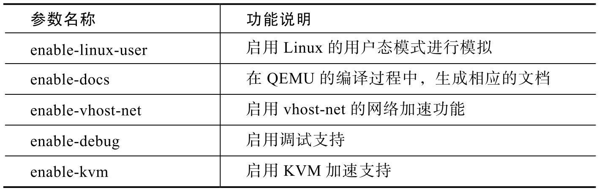
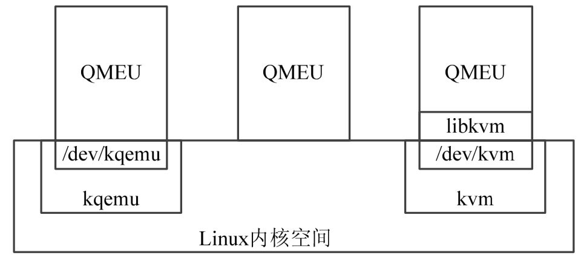
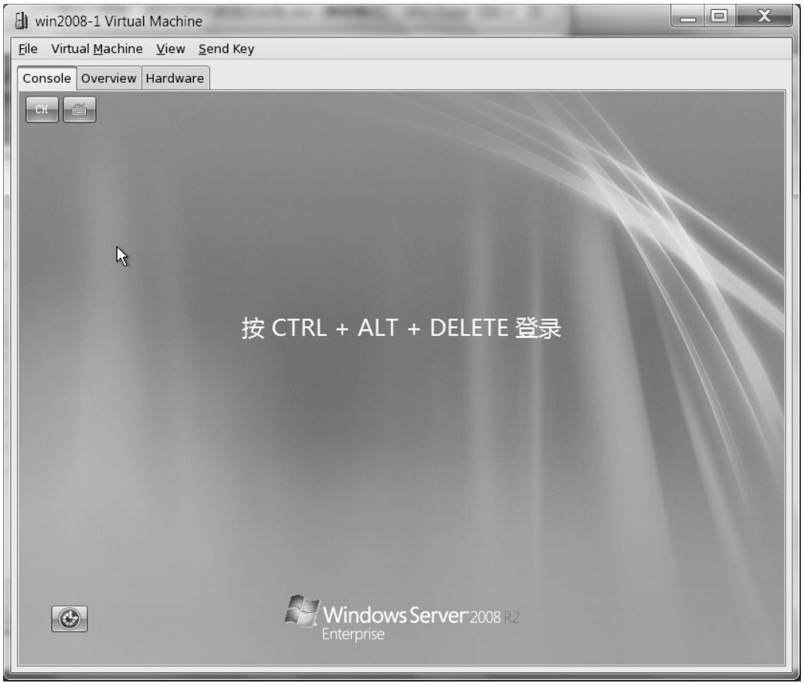

<!-- @import "[TOC]" {cmd="toc" depthFrom=1 depthTo=6 orderedList=false} -->

<!-- code_chunk_output -->

- [1. 曾经的 qemu-kvm](#1-曾经的-qemu-kvm)
- [2. qemu-kvm 的配置与编译](#2-qemu-kvm-的配置与编译)
- [3. qemu-kvm 的架构与配置](#3-qemu-kvm-的架构与配置)
- [4. QEMU 的三种运行模式](#4-qemu-的三种运行模式)
  - [4.1. kqemu 加速](#41-kqemu-加速)
  - [4.2. 用户态 qemu](#42-用户态-qemu)
  - [4.3. kvm-qemu 加速](#43-kvm-qemu-加速)
- [5. libvirt 和 virt-manager](#5-libvirt-和-virt-manager)

<!-- /code_chunk_output -->

# 1. 曾经的 qemu-kvm

qemu-kvm 原本是 kernel 社区维护的**专门用于 KVM 的 QEMU 的分支**.

在**2012 年**年末的时候, 这个分支**并入了主流的 QEMU**( git://git.qemu-project.org/qemu.git ).

从此**通用的 QEMU** 加上 `--enable-kvm` 选项就可以创建 KVM guest.

# 2. qemu-kvm 的配置与编译

QEMU 是一个高度可定制化的模块项目. 从官方网站获得 QEMU 源代码之后, 需要通过 configure 进行配置, 以为后续的 Makefile 编译出符合要求的 QEMU 版本而做好准备.

configure 的参数比较多, 重要的部分如表 1 所示. 因为篇幅限制, 所有以 `enable-xxx` 开头的开关, 一般都具有 `disable-xxx` 用于禁止 xxx 功能配置的对应项.

表 1 `qemu-kvm`中 Configure 的配置参数说明

如果直接执行 `qemu-kvm` 的 configure, 则默认会有如图 1 所示的参数.

图 1 `qemu-kvm` 的默认参数

在这些默认的参数中, 有一个重要的设置环节是 `target-list`, 该参数代表 qemu 将要模拟的**目标系统**, 针对 Linux 虚拟化环境中, 重要的 `target-list` 是两个:

* `x86_64-softmmu`, **使用软件对 mmu 进行管理**

* `x86_64-linux-user`, 使用到 **Linux 内部**的一些**硬件加速**特性.

在编译开关配置完成之后, 输入 make, 就可以对 `qemu-kvm` 的源代码进行编译, 编译完成后, 将获得 **qemu-img**, **qemu-nbd**, **qemu-io** 和与最终编译相关的 **qemu-kvm** 执行主程序.

qemu-kvm 的主程序执行针对特定平台的模拟功能, 其具体配置在 configure 阶段中. 但是, configure 的配置功能主要是为了支持 QEMU 进行多种异构平台的模拟, 如针对 ARM、MIPS 等平台的不同开发板配置. 因此, 针对 x86 架构提供虚拟化功能时, QEMU 更多的是作为一个开发和整合的框架, KVM 开发小组通过重用该框架, 用 KVM 的相关功能对该框架进行填充后, 从而形成一套解决方案.

# 3. qemu-kvm 的架构与配置

在 `qemu-kvm` 中, 基于 **x86 的架构**定义在 `hw/pc_piix.c`, `pc_q35.c` 文件中, 通过 **machine_init** 宏在 **qemu-kvm** 启动时进行初始化.

**定义 x86 架构主机**的**数据结构**在 `qemu-kvm` 中使用得非常巧妙, 通过 **configure 等编译工具**, 将这些数据结构的初始化代码放入**全局变量区域**中.

因此, 在 **QEMU 的代码**中只有对**这些数据结构**进行**获取和使用**的部分, 而**没有用于配置的部分**, 这样提高了整个架构面向的体系模拟结构的灵活性.

# 4. QEMU 的三种运行模式

QEMU 作为一个开源的硬件模拟器项目, 除了支持 x86 体系架构之外, 还支持 ARM、MIPS、PowerPC、IA64 等多种硬件架构. QEMU 采用模块化设计的方法, 因此, 还能支持多种多样的外设硬件, 并且能够方便地进行扩充.

除了支持 KVM 之外, QEMU 还支持全模拟化和 kqemu 加速模块等方式, 这三种方式的架构区别如下图所示.

图 5-6 QEMU 的三种模块架构

## 4.1. kqemu 加速

https://wiki.qemu.org/Documentation/KQemu

第一种模式是通过 kqemu 模块实现内核态的加速.

通过在**内核**中加入**kqemu 的相关模块**, 在**用户态的 QEMU**则通过访问 /dev/kqemu 设备文件接口调用改进型加速.

在这种模式中, 主要针对**虚拟机**和**宿主机**运行于**统一架构**的情况下进行虚拟化.

## 4.2. 用户态 qemu

第二种模式是在用户态直接运行 QEMU, 由 QEMU 对目标机的**所有指令进行翻译**后执行, 相当于**全虚拟化**.

在这种模式下, 可以运行各种不同形态的体系结构, 如 Android 开发环境中即使用了 QEMU 来为其模拟 ARM 运行环境, 但是在这种模拟环境下, 每一条目标机的执行指令都需要耗费少则数个, 多则成千上万个宿主机的指令周期来模拟实现, 速度方面不太理想.

## 4.3. kvm-qemu 加速

第三种模式则是 KVM 官方提供的 kvm\-qemu 加速模式.

运行在**内核态的 KVM 模块**通过/**dev/kvm** 字符设备文件向外提供操作接口. KVM 通过提供 libkvm 这个操作库, 将 `/dev/kvm` 这一层面的 ioctl 类型的 API 转化成为通常意义上的函数 API 调用, 提供给 QEMU 的相应适配层, 通过 QEMU 的支持来完成整个虚拟化工作.

针对这三种不同运行模式的测试结果表明, 通过 KVM 对 QEMU 进行加速从而获取的性能最为理想.

# 5. libvirt 和 virt-manager

在很多开源版本的 qemu\-kvm 实现中, 并不仅仅提供 qemu\-kvm 软件来进行管理, 而引入了一个叫做 libvirt 的库和 virt\-manager 进行管理.

**libvirt** 和 **virt\-manager** 都是开源的多虚拟化产品解决方案, 能够支持 QEMU、Xen、KVM 等解决方案在内的多种虚拟机. 在 Cent OS 等发行版本中, 通过使用 libvirt 和 virt\-manager 来进行虚拟机管理, 图 5\-4 为一运行了 Windows 2008 R2 的 KVM 虚拟机, 通过 virt\-manager 进行管理.

libvirt 通过引入**软件适配层**的概念, 通过统一的上层接口管理虚拟机, 对下则提供针对不同解决方案的适配器, 如 QEMU、Xen 和 KVM 等.

**virt\-manager** 是一个基于 **Python** 和 **pygtk** 编写的虚拟机管理工具前端, 通过引用 libvirt 来进行桌面环境下的虚拟机管理, 其运行界面如图 5-7 所示.

图 5-7 基于 libvirt 和 virt-manager 的虚拟机管理工具

