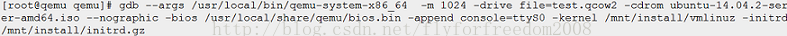
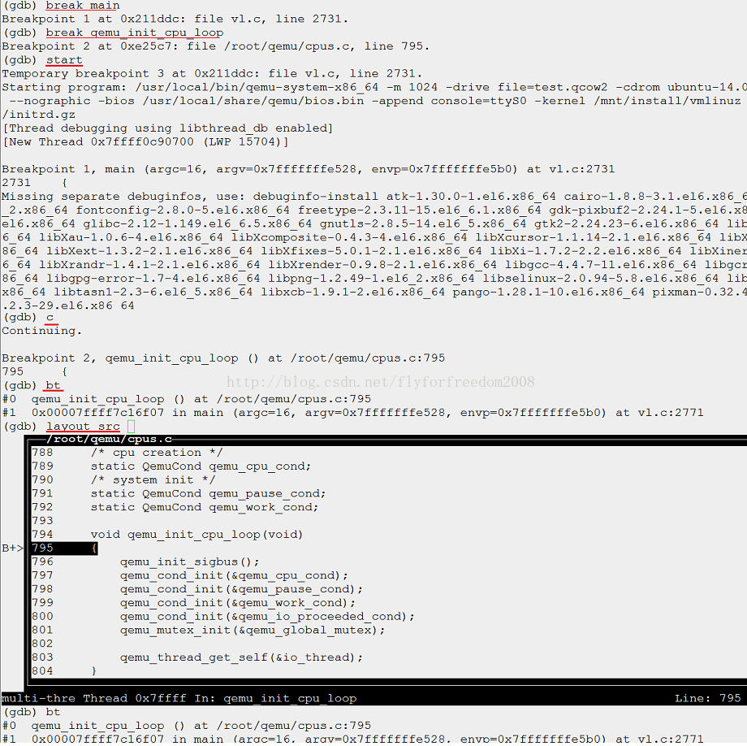

https://www.cnblogs.com/woshiweige/p/4518431.html

>
> gdb --args /usr/local/bin/qemu-system-x86_64 -m 1024 -drive file=test.qcow2 -cdrom ubuntu-14.04.2-server-amd64.sio --nographic -bios /usr/local/share/qemu/bios.bin -append console=ttyS0 -kernel /mnt/install/vmlinuz -initrd /mnt/install/initrd.gz

用上述命令启动 /usr/local/bin/qemu-system-x86_64, 然后来到 GDB 命令行输入界面, 如下图:

执行"`break main`", 和"`break qemu_init_cpu_loop`", 就在这两个函数的开始处分别设置了一个断点. 然后执行"start"命令, 看到运行到第一个断点处停了下来, 执行"c"继续运行, 又碰到了第二个断点, 执行"bt"看一下调用栈, 确实调用到了`qemu_init_cpu_loo`p 函数. 如果想看源代码, 执行"layout src"执行, 就出现了如上图所示的源码窗口, 接下来, 随便你玩了.

GDB 调试 QEMU 时经常遇到 SIGUSR1 与 SIGUSR2 后停下来, 解决办法是执行命令:

(gdb) handle SIGUSR1 SIGUSR2 noprint nostop

todo

* 怎么调试其他进程

* 怎么调试 monitor 输入