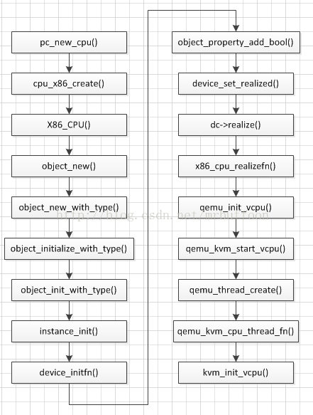

<!-- @import "[TOC]" {cmd="toc" depthFrom=1 depthTo=6 orderedList=false} -->

<!-- code_chunk_output -->

- [1. 整体介绍](#1-整体介绍)
- [2. Main()函数的关键点](#2-main函数的关键点)
  - [2.1. main()函数调用流程图](#21-main函数调用流程图)
  - [2.2. pstack 打印堆栈](#22-pstack-打印堆栈)
- [3. main()函数](#3-main函数)
  - [3.1. atexit()注册 QEMU 退出处理函数](#31-atexit注册-qemu-退出处理函数)
  - [3.2. module_call_init 机制](#32-module_call_init-机制)
    - [3.2.1. PC 的注册](#321-pc-的注册)
    - [3.2.2. module_init](#322-module_init)
      - [3.2.2.1. type_init](#3221-type_init)
      - [3.2.2.2. kvm_init()](#3222-kvm_init)
  - [3.3. machine_class](#33-machine_class)
    - [3.3.1. current_machine](#331-current_machine)
  - [3.4. pc_init1 函数](#34-pc_init1-函数)
    - [3.4.1. CPU 初始化](#341-cpu-初始化)
      - [3.4.1.1. vcpu 线程](#3411-vcpu-线程)
    - [3.4.2. 内存初始化](#342-内存初始化)
- [4. 参考](#4-参考)

<!-- /code_chunk_output -->

# 1. 整体介绍

前面讲了 KVM 内核层创建及初始化虚拟机的一些工作过程, 现在讲一下 QEMU 层的流程以及与 KVM 内核层的配合过程.

# 2. Main()函数的关键点

QEMU 通过`ioctl()`向 `/dev/kvm` 发送指令字对虚拟机进行操作, 直接抓住这个线看有 `kvm_ioctl`、`kvm_vm_ioctl`、`kvm_vcpu_ioctl`、`kvm_device_ioctl`等, 他们还都在一个 C 文件里面.

使用`kvm_ioctl`很少, 直接看调用的代码, 有`KVM_GET_VCPU_MMAP_SIZE`, `KVM_CHECK_EXTENSION`, `KVM_GET_API_VERSION`, `KVM_CREATE_VM`, `KVM_GET_SUPPORTED_CPUID 等等`, 需要记住只有`KVM_CREATE_VM`.

而调用`kvm_vm_ioctl`的函数很多, 需要看的是`KVM_SET_USER_MEMORY_REGION`, `KVM_CREATE_VCPU`, `KVM_CREATE_DEVICE`.

所有**寄存器的交换信息**都是通过`kvm_vcpu_ioctl`, 需要记住的操作只有, `KVM_RUN`.

所有看 QEMU 和 KVM 的配合流程如下:


QEMU 的入口`main()`函数位于 `vl.c` 中, 重点关注以下几点:

1. 何处创建 KVM 虚拟机并获取 fd?
2. 虚拟机 CPU、内存在何处进行初始化?
3. vCPU 子线程在何处创建, 如何运行?
4. 热迁移的 handlers 在何处注册?
5. 主线程如何监听事件?

> 新的代码架构, 入口在 `softmmu/main.c` 中

## 2.1. main()函数调用流程图

整个 main()函数的处理逻辑如下图所示:


```cpp
int main()
 ├─ atexit(qemu_run_exit_notifiers)          // 注册 QEMU 的退出处理函数
 ├─ module_call_init(MODULE_INIT_QOM)        // 初始化 QOM
 ├─ runstate_init()
 ├─ init_clocks()                            // 初始化时钟源
 ├─ module_call_init(MODULE_INIT_MACHINE)
 ├─ switch(popt->index) case QEMU_OPTION_XXX // 解析 QEMU 参数
 ├─ socket_init()
 ├─ os_daemonize()
 ├─ configure_accelerator()                  // 启用 KVM 加速支持
 |   └─ kvm_init()                           // 【1】创建 KVM 虚拟机并获取对应的 fd
 |       ├─ KVMState *s = KVM_STATE(ms->accelerator); //
 |       ├─ s->fd = qemu_open("/dev/kvm", O_RDWR); //
 |       ├─ kvm_ioctl(KVM_GET_API_VERSION)   // 检查 KVM API 版本
 |       ├─ kvm_ioctl(KVM_CREATE_VM)         // 创建虚拟机, 并获取 vmfd
 |       ├─ kvm_check_extension()            // 与 kvm 交互, 检查特性支持
 |       ├─ kvm_arch_init()
 |       |   ├─ kvm_check_extension()        // 与 kvm 交互, 架构相关特性检查
 |       |   ├─ kvm_vm_ioctl(s, KVM_SET_IDENTITY_MAP_ADDR, &identity_base);        // 与 kvm 交互, 架构相关特性检查
 |       |   ├─ kvm_vm_ioctl(s, KVM_SET_TSS_ADDR, identity_base + 0x1000);        // 与 kvm 交互, 架构相关特性检查
 |       |   ├─ e820_add_entry(identity_base, 0x4000, E820_RESERVED);        //
 |       ├─ kvm_irqchip_create()             // 创建中断管理
 |       |   ├─ kvm_check_extension(s, KVM_CAP_IRQCHIP)        // 检查 irqchip 功能
 |       |   ├─ kvm_vm_ioctl(s, KVM_CREATE_IRQCHIP);        // 与 kvm 交互, 创建 IRQ 芯片, 即 8259A
 |       └─ memory_listener_register(&kvm_memory_listener) // 注册 kvm_memory_listener
 |
 ├─ qemu_init_cpu_loop()                     // 初始化 vCPU 线程竞争的锁
 ├─ qemu_init_main_loop()
 |   └─ main_loop_init()
 |
 ├─ qemu_spice_init()                        // 初始化 SPICE
 ├─ cpu_exec_init_all()                      // 【2】初始化虚拟机的地址空间, 主要是 QEMU 侧的内存布局
 |   ├─ memory_map_init()                    // 初始化 MemoryRegion 及其对应的 FlatView
 |   |   ├─ memory_region_init(system_memory, NULL, "system", UINT64_MAX);   // 初始化 system_memory 全局 MemoryRegion, 分别对应参数 MemoryRegion *mr, Object *owner, const char *name, uint64_t size
 |   |   |   ├─ object_initialize(mr, sizeof(*mr), TYPE_MEMORY_REGION);   // 对象初始化
 |   |   |   └─ memory_region_do_init(mr, owner, name, size);           // 初始化, 就是一些赋值操作, size 是 2^64, ram_block 是 NULL
 |   |   ├─ address_space_init(&address_space_memory, system_memory, "memory");;   // 初始化 address_space_memory 全局 AddressSpace, 将 system_memory 作为 root(根 MR)
 |   |   |   ├─ QTAILQ_INIT(&as->listeners);      // 初始化该 AddressSpace 的 listeners 链表
 |   |   |   ├─ QTAILQ_INSERT_TAIL(&address_spaces, as, address_spaces_link);       // 初始化该 AddressSpace 为全局 as 链表 address_spaces 的节点(通过 as 的 address_spaces_link 域)
 |   |   |   └─ address_space_update_topology(as)      // 为 AddressSpace 生成 FlatView
 |   |   |   |   ├─ MemoryRegion *physmr = memory_region_get_flatview_root(as->root);  // 获取 as 指向的 mr
 |   |   |   |   ├─ flatviews_init();  // 生成新的哈希表 flat_views(memory.c 中的内部全局变量), 非空直接返回
 |   |   |   |   ├─ generate_memory_topology(physmr)   // 哈希表将 MemoryRegion 的拓扑结构渲染为 FlatRange 数组
 |   |   |   |   |   ├─ view = flatview_new(mr)     // 参数其实就是 physmr
 |   |   |   |   |   ├─ render_memory_region(&view, mr, int128_zero(), addrrange_make(int123_zero(), int128_2_64()), false, false) // 根据 mr 生成 view
 |   |   |   |   |   ├─ flatview_simplify(&view) // 简化 FlatView, 合并相邻的 FlatRange
 |   |   |   |   |   └─ g_hash_table_replace(flat_views, mr, view); // 添加到哈希表 flat_views, key 为 mr, value 是 flatview
 |   |   |   |   └─ address_space_set_flatview(as);
 |   |   |   |       ├─ address_space_update_topology_pass(AddressSpce, FlatView_old, FlatView_new) // 遍历 FlatView 的所有 FlatRange, 也就是得到若干个 MemoryRegionSection, 将其注册到 KVM
 |   |   |   |       |   └─ MEMORY_LISTENER_UPDATE_REGION(frnew, as, Forward, region_add)        // 回调函数 region_add, 对应的是 kvm_region_add()
 |   |   |   |       |   └─ kvm_region_add()        // region_add 对应的回调实现
 |   |   |   |       |       └─ kvm_set_phys_mem()  // 根据传入的 section 填充 KVMSlot, 修改虚拟机注册在内核中的内存
 |   |   |   |       |           └─ kvm_set_user_memory_region() // 将 QEMU 侧的内存布局注册到 KVM 中
 |   |   |   |       |               └─ kvm_ioctl(KVM_SET_USER_MEMORY_REGION) // 与 KVM 交互, 但是这时候 qemu 还没有申请内存
 |   |   |   |       ├─ atomic_rcu_set(&as->current_map, new_view); // 设置这个 as 的 current_map
 |   |   |   |
 |   |   |   └─ address_space_update_ioeventfds(as)
 |   |   |
 |   |   ├─ memory_region_init_io(system_io, NULL, &unassigned_io_ops, NULL, "io", 65536);   // 初始化 system_io 全局 MemoryRegion
 |   |   └─ address_space_init(&address_space_io, system_io, "I/O");   // 初始化 address_space_io 全局 AddressSpace, 将 system_io 作为 root(根 MR)
 |   |
 |   └─ io_mem_init()                  // 初始化 I/O MemoryRegion
 |       └─ memory_region_init_io()    // ram/rom/unassigned/notdirty/subpage-ram/watch
 |           └─ memory_region_init()
 |
 ├─ bdrv_init_with_whitelist()
 ├─ blk_mig_init()
 |   └─ register_savevm_live("block", &savevm_block_handlers, ...) // 注册块设备热迁移的处理函数
 |
 ├─ register_savevm_live("ram", &savevm_ram_handlers, ...)         // 注册内存热迁移的处理函数
 ├─ select_vgahw(vga_model) // 选择 VGA 显卡设备, std/cirrus/vmware/xenfb/qxl/none
 ├─ select_watchdog(watchdog)
 ├─ qdev_machine_init()
 ├─ machine->init()         // QEMU 1.2.0 默认的 QEMUMachine 为 pc_machine_v1_2
 |   └─ pc_init_pci()
 |       └─ pc_init1()
 |           ├─ pc_cpus_init(cpu_model) // 【3】CPU 初始化, 根据 smp_cpus 参数创建对应数量的 vCPU 子线程
 |           |   └─ pc_new_cpu(cpu_model)
 |           |       └─ cpu_x86_init(cpu_model)
 |           |           └─ x86_cpu_realize()
 |           |               └─ qemu_init_vcpu()
 |           |                   └─ qemu_kvm_start_vcpu()
 |           |                       └─ qemu_thread_create() // 顺序创建 vCPU 子线程, 失败会阻塞
 |           |                           └─ qemu_kvm_cpu_thread_fn()    // vCPU 线程的执行函数
 |           |                               ├─ kvm_init_vcpu()
 |           |                               |   ├─ kvm_ioctl(KVM_CREATE_VCPU) // 获取 vCPU 对应的 fd
 |           |                               |   └─ kvm_arch_init_vcpu()
 |           |                               |
 |           |                               ├─ qemu_kvm_init_cpu_signals()
 |           |                               ├─ kvm_cpu_exec()
 |           |                               |   └─ kvm_vcpu_ioctl(KVM_RUN) // 运行 vCPU
 |           |                               |       └─ kvm_arch_vcpu_ioctl_run() // 进入内核, 由 KVM 处理
 |           |                               |           └─ __vcpu_run()
 |           |                               |               └─ vcpu_enter_guest()
 |           |                               |                   └─ kvm_mmu_reload()
 |           |                               |                       └─ kvm_mmu_load() // spin_lock(&vcpu->kvm->mmu_lock)
 |           |                               |
 |           |                               └─ qemu_kvm_wait_io_event()
 |           |
 |           ├─ kvmclock_create()
 |           ├─ pc_memory_init() // 【4】内存初始化, 从 QEMU 进程的地址空间中进行实际的内存分配
 |           |   ├─ MemoryRegion *ram = g_malloc(sizeof(*ram)); // 新建 MR, "pc.ram"
 |           |   ├─ memory_region_allocate_system_memory(ram, NULL, "pc.ram", machine->ram_size); // 创建 pc.ram, pc.rom 并真正分配内存, ram_size 是虚拟机的真正内存大小
 |           |   |   └─ allocate_system_memory_nonnuma()
 |           |   |       |─ memory_region_init_ram_nomigrate()
 |           |   |       |   |─ memory_region_init(mr, owner, name, size);
 |           |   |       |   └─ mr->ram_block = qemu_ram_alloc(size, share, mr, &err); // 仅仅 root MR 有自己 RAMBlock(GPA)
 |           |   |       |       └─ qemu_ram_alloc_internal();
 |           |   |       |           |─ RAMBlock = g_malloc0(sizeof(*new_block)); // 创建 RAMBlock 并且初始化
 |           |   |       |           └─ ram_block_add(); //
 |           |   |       |               |─ new_block->offset = find_ram_offset(new_block->max_length); // 遍历全局 ram_list 所有区块, 找到满足长度的空间, 并将 ramblock 安插进去
 |           |   |       |               |─ new_block->host = phys_mem_alloc(new_block->max_length, &new_block->mr->align, shared); // 在 host 上真正分配虚拟内存
 |           |   |       |               |─ memory_try_enable_merging(new_block->host, new_block->max_length); //
 |           |   |       └─ vmstate_register_ram_global() // ramblock 与 mr 关联, 将 MR 的 name 写入 RAMBlock 的 idstr
 |           |   |           └─ vmstate_register_ram()
 |           |   |               └─ qemu_ram_set_idstr()
 |           |   |
 |           |   ├─ MemoryRegion *ram_below_4g = g_malloc(sizeof(*ram_below_4g)); // 新建 MR, "ram-below_4g"
 |           |   ├─ memory_region_init_alias(ram_below_4g, NULL, "ram-below_4g", ram, 0, x86ms->below_4g_mem_size);    // 初始化 ram_below_4g, 如果 x86ms->above_4g_mem_size 大于 0, 针对这个也执行 memory_region_init_alias, memory_region_add_subregion 和 e820_add_entry.
 |           |   |─ memory_region_add_subregion(system_memory, 0, ram_below_4g); // 在 system_memory 中添加 subregions, "ram_below_4g" MR
 |           |   |   └─ memory_region_add_subregion_common()
 |           |   |       └─ memory_region_update_topology() // 为 MemoryRegion 生成 FlatView
 |           |   |            └─ address_space_update_topology() // as->current_map = new_view
 |           |   |                ├─ generate_memory_topology()  // 将 MemoryRegion 的拓扑结构渲染为 FlatRange 数组
 |           |   |                |   ├─ flatview_init(&view)
 |           |   |                |   ├─ render_memory_region(&view, mr, ...) // 根据 mr 生成 view
 |           |   |                |   └─ flatview_simplify(&view) // 合并相邻的 FlatRange
 |           |   |                |
 |           |   |                ├─ address_space_update_topology_pass()
 |           |   |                |   └─ kvm_region_add()        // region_add 对应的回调实现
 |           |   |                |       └─ kvm_set_phys_mem()  // 根据传入的 section 填充 KVMSlot
 |           |   |                |           └─ kvm_set_user_memory_region() // 将 QEMU 侧的内存布局注册到 KVM 中
 |           |   |                |               └─ kvm_ioctl(KVM_SET_USER_MEMORY_REGION)
 |           |   |                |
 |           |   |                └─ address_space_update_ioeventfds()
 |           |   ├─ e820_add_entry(0, x86ms->below_4g_mem_size, E820_RAM)    //
 |           |   ├─ machine->device_memory = g_malloc0();    // device memory
 |           |   ├─ memory_region_init(&machine->device_memory->mr, OBJECT(pcms), "device-memory", device_mem_size);   // device memory
 |           |   ├─ memory_region_add_subregion(system_memory, machine->device_memory->base, &machine->device_memory->mr);    // device memory
 |           |   ├─ pc_system_firmware_init();    // PC 系统固件初始化
 |           |   ├─ MemoryRegion *option_rom_mr = g_malloc(sizeof(*option_rom_mr)); // 新建 MR, "pc.ram"
 |           |   ├─ memory_region_init_ram(option_rom_mr, NULL, "pc.rom", PC_ROM_SIZE, &error_fatal);   // pc.rom
 |           |
 |           ├─ i440fx_init()
 |           ├─ ioapic_init(gsi_state)
 |           ├─ pc_vga_init()
 |           ├─ pc_basic_device_init()
 |           ├─ pci_piix3_ide_init()
 |           ├─ audio_init()
 |           ├─ pc_cmos_init()
 |           └─ pc_pci_device_init()
 |
 ├─ cpu_synchronize_all_post_init()
 ├─ set_numa_modes()   // 设置 NUMA
 ├─ vnc_display_init() // 初始化 VNC
 ├─ qemu_spice_display_init()
 ├─ qemu_run_machine_init_done_notifiers()
 ├─ os_setup_post()
 ├─ resume_all_vcpus()
 ├─ main_loop() // 【5】主线程开启循环, 监听事件
 |   └─ main_loop_wait()
 |       └─ os_host_main_loop_wait()
 |           └─ select()
 |
 ├─ bdrv_close_all()
 ├─ pause_all_vcpus()
 ├─ net_cleanup()
 └─ res_free()
```

大致流程如下图所示(图源自网络), 对应 VMX 模式下 root 和 non-root 模式的概念:


* 左边蓝色部分即为根模式下的 Ring 3, 即为用户空间中的 QEMU, 通过循环调用 ioctl(KVM_RUN)进入内核运行 vCPU, 并处理 I/O 请求
* 中间橙色部分即为根模式下的 Ring 0, 即为内核空间中的 KVM, 通过 VM-Entry 进入非根模式, 运行 Guest OS, 并处理 VM-Exit. 如果能在内核处理, 则处理后再次通过 VM-Entry 进入 Guest OS; 如果不能处理(例如 I/O 请求), 则退出到用户空间, 由 QEMU 进行处理
* 右边紫色部分即为非根模式, Guest OS 运行在非根模式下的 Ring 0, 所有的敏感指令都被重新定义, 以便产生相应的 EXIT_REASON 交给 KVM 处理. Guest OS 中的进程则运行在非根模式下的 Ring 3

## 2.2. pstack 打印堆栈

通过 virsh 启动一台 32 核 CPU 的虚拟机, 使用 pstack 打印堆栈验证一下:

```bash
> pstack $(pidof qemu-system-x86_64)

...(省略重复的堆栈)
Thread 6 (Thread 0x7fdcd4dfa700 (LWP 37340)):
#0  0x00007fdd46002307 in ioctl () from /lib64/libc.so.6
#1  0x00000000005e4bcb in kvm_vcpu_ioctl ()
#2  0x00000000005e57d8 in kvm_cpu_exec ()
#3  0x00000000005a2601 in qemu_kvm_cpu_thread_fn ()
#4  0x00007fdd462d8893 in start_thread () from /lib64/libpthread.so.0
#5  0x00007fdd46009bfd in clone () from /lib64/libc.so.6
Thread 5 (Thread 0x7fdcbbfff700 (LWP 37341)):
#0  0x00007fdd46002307 in ioctl () from /lib64/libc.so.6
#1  0x00000000005e4bcb in kvm_vcpu_ioctl ()
#2  0x00000000005e57d8 in kvm_cpu_exec ()
#3  0x00000000005a2601 in qemu_kvm_cpu_thread_fn ()
#4  0x00007fdd462d8893 in start_thread () from /lib64/libpthread.so.0
#5  0x00007fdd46009bfd in clone () from /lib64/libc.so.6
Thread 4 (Thread 0x7fdcbb5fe700 (LWP 37342)):
#0  0x00007fdd46002307 in ioctl () from /lib64/libc.so.6
#1  0x00000000005e4bcb in kvm_vcpu_ioctl ()
#2  0x00000000005e57d8 in kvm_cpu_exec ()
#3  0x00000000005a2601 in qemu_kvm_cpu_thread_fn ()
#4  0x00007fdd462d8893 in start_thread () from /lib64/libpthread.so.0
#5  0x00007fdd46009bfd in clone () from /lib64/libc.so.6
Thread 3 (Thread 0x7fdcbabfd700 (LWP 37343)):
#0  0x00007fdd46002307 in ioctl () from /lib64/libc.so.6
#1  0x00000000005e4bcb in kvm_vcpu_ioctl ()
#2  0x00000000005e57d8 in kvm_cpu_exec ()
#3  0x00000000005a2601 in qemu_kvm_cpu_thread_fn ()
#4  0x00007fdd462d8893 in start_thread () from /lib64/libpthread.so.0
#5  0x00007fdd46009bfd in clone () from /lib64/libc.so.6
Thread 2 (Thread 0x7fc4a73fd700 (LWP 37451)):
#0  0x00007fdd462dc115 in pthread_cond_wait@@GLIBC_2.3.2 () from /lib64/libpthread.so.0
#1  0x0000000000568781 in qemu_cond_wait ()
#2  0x00000000005952c3 in vnc_worker_thread_loop ()
#3  0x0000000000595778 in vnc_worker_thread ()
#4  0x00007fdd462d8893 in start_thread () from /lib64/libpthread.so.0
#5  0x00007fdd46009bfd in clone () from /lib64/libc.so.6
Thread 1 (Thread 0x7fdd47cce700 (LWP 37247)):
#0  0x00007fdd460029f3 in select () from /lib64/libc.so.6
#1  0x000000000053b325 in main_loop_wait ()
#2  0x0000000000536ef4 in main ()
```

# 3. main()函数

Qemu 层是从 vl.c 中的 main()函数开始的, 这里通过在代码中添加一些注释的方式来进行讲解.

```cpp
int main(int argc, charchar **argv, charchar **envp)
{
    ......
    //注册了 Qemu 的退出函数
    atexit(qemu_run_exit_notifiers);
    ......
    //初始化 Qemu 的 QOM 模块
    module_call_init(MODULE_INIT_QOM);

    qemu_add_opts(&qemu_drive_opts);//将各种函数指针(也就是操作)集合添加到链表中
    qemu_add_opts(&qemu_chardev_opts);
    qemu_add_opts(&qemu_device_opts);
    qemu_add_opts(&qemu_netdev_opts);
    qemu_add_opts(&qemu_net_opts);
    qemu_add_opts(&qemu_rtc_opts);
    qemu_add_opts(&qemu_global_opts);
    qemu_add_opts(&qemu_mon_opts);
    qemu_add_opts(&qemu_trace_opts);
    qemu_add_opts(&qemu_option_rom_opts);
    qemu_add_opts(&qemu_machine_opts);
    qemu_add_opts(&qemu_boot_opts);
    qemu_add_opts(&qemu_sandbox_opts);
    qemu_add_opts(&qemu_add_fd_opts);
    qemu_add_opts(&qemu_object_opts);
    qemu_add_opts(&qemu_tpmdev_opts);
    qemu_add_opts(&qemu_realtime_opts);
     ......
    init_clocks();//时钟初始化相关
    rtc_clock = host_clock;
    ......
    //初始化 Qemu 的 MACHINE 模块
    module_call_init(MODULE_INIT_MACHINE);
    machine = find_default_machine();
    ......
    current_machine = MACHINE(object_new(object_class_get_name(
                        OBJECT_CLASS(machine_class))));
    ...
    // qemu 的内存结构体的初始化
    cpu_exec_init_all();
    ...
    // VCPU 的不同型号的模拟
    cpudef_init();//初始化 CPU def 相关
     ......
    //日志相关的设置, KVM 对外的日志在这里配置
    if (log_mask) {
        int mask;
        if (log_file) {
            qemu_set_log_filename(log_file);
        }
        mask = qemu_str_to_log_mask(log_mask);
        if (!mask) {
            qemu_print_log_usage(stdout);
            exit(1);
        }
        qemu_set_log(mask);
     }
    ......
    //进行虚拟机模拟器的配置, 这里重点注意, 它内部调用了 accel_list[i].init()函数
    configure_accelerator();
    ......
    current_machine->ram_size = ram_size;
    current_machine->maxram_size = maxram_size;
    current_machine->ram_slots = ram_slots;
    current_machine->boot_order = boot_order;
    current_machine->cpu_model = cpu_model;
    machine_class->init(current_machine);
    return 0;
}

/*
    for (i = 0; i < ARRAY_SIZE(accel_list); i++) {
        if (strcmp(accel_list[i].opt_name, buf) == 0) {
            if (!accel_list[i].available()) {
                printf("%s not supported for this target\n",accel_list[i].name);
                continue;
            }
            *(accel_list[i].allowed) = true;
            ret = accel_list[i].init();
            if (ret < 0) {
                init_failed = true;
                fprintf(stderr, "failed to initialize %s: %s\n",accel_list[i].name,strerror(-ret));
               *(accel_list[i].allowed) = false;
            } else {
                accel_initialised = true;
            }
            break;
         }
     }
    //accel_list 定义如下, 实际上在 kvm 平台, 我们就关注 kvm_init 即可.
    static struct {
        const char *opt_name;
        const char *name;
        int (*available)(void);
        int (*init)(void);
        bool *allowed;
    } accel_list[] = {
       { "tcg", "tcg", tcg_available, tcg_init, &tcg_allowed },
       { "xen", "Xen", xen_available, xen_init, &xen_allowed },
       { "kvm", "KVM", kvm_available, kvm_init, &kvm_allowed },
       { "qtest", "QTest", qtest_available, qtest_init, &qtest_allowed },
    };
    //kvm_init 函数内首先打开用于用户层以及内核层交互的字符设备文件/dev/kvm,
    然后通过 kvm_ioctl()与内核进行交互, 比如 KVM_GET_API_VERSION, KVM_CREATE_VM 等命令,
    其中 KVM_CREATE_VM 命令创建虚拟机并获得虚拟机句柄,
    后续 kvm_arch_init()、 kvm_irqchip_create()等函数
    就可以通过 kvm_vm_ioctl 系统调用进行更进一步的一些配置.
    这些系统调用实际上是传递到内核层, 由内核来完成相应的操作并返回到用户层,
    内核层的相关函数很多就是前一篇文章注册过的函数指针.
*/
```

## 3.1. atexit()注册 QEMU 退出处理函数

`atexit(qemu_run_exit_notifiers)`注册了 qemu 的退出处理函数, 后面再具体看`qemu_run_exit_notifiers`函数.

## 3.2. module_call_init 机制

module\_call\_init 则开始**初始化 qemu 的各个模块(！！！**), 陆陆续续的有**以下参数(！！！后续都会调用到并进行初始化**):

```c
typedef enum {
    MODULE_INIT_BLOCK,
    MODULE_INIT_MACHINE,
    MODULE_INIT_QAPI,
    MODULE_INIT_QOM,
    MODULE_INIT_MAX
} module_init_type;
```

最开始初始化的**MODULE\_INIT\_QOM**, **QOM**是 qemu 实现的一种**模拟设备**, 具体可以参考 http://wiki.qemu.org/Features/QOM , 代码下面的不远处就**MODULE\_INIT\_MACHINE**的**初始化**, 这两条语句放到一起看, 直接说一下**module\_call\_init 的机制**.

module\_call\_init 实际上是设计了一个**函数链表 ModuleTypeList**, 参数作为一个**Type**, **相关的函数注册到这个函数链表**上, 然后**内部通过调用 e\-\>init**()函数完成**所有 Type 相关的设备的初始化**.

**ModuleTypeList**的链表关系如下图


它把**相关的函数**注册到**对应的数组链表**上, 通过**执行 init**项目完成**所有设备的初始化**.

```c
[util/module.c]
void module_call_init(module_init_type type)
{
    ModuleTypeList *l;
    ModuleEntry *e;

    module_load(type);
    l = find_type(type);

    QTAILQ_FOREACH(e, l, node) {
        e->init();
    }
}
```

**module\_call\_init**就是执行**e\-\>init**()完成功能的.

而 e\-\>init 是什么时候通过**register\_module\_init(！！！**)注册到**ModuleTypeList**上的**ModuleEntry**??是通过**module\_init 注册**的, 而**调用 module\_init**的有

```
[include/qemu/module.h]
#define block_init(function) module_init(function, MODULE_INIT_BLOCK)
#define machine_init(function) module_init(function, MODULE_INIT_MACHINE)
#define qapi_init(function) module_init(function, MODULE_INIT_QAPI)
#define type_init(function) module_init(function, MODULE_INIT_QOM)
```

那么执行**machine\_init**则是**挂到了 MODULE\_INIT\_MACHINE**, **type\_init**则将函数挂载了**MODULE\_INIT\_QOM**.

### 3.2.1. PC 的注册

那么排查一下是, 我们**只关注 PC 的注册**, 那么就是**machine\_init(pc\_machine\_init\_\#\#suffix**), 源自**DEFINE\_PC\_MACHINE(suffix, namestr, initfn, optsfn)宏**会调用

```c
[hw/i386/pc_piix.c]
#define DEFINE_I440FX_MACHINE(suffix, name, compatfn, optionfn) \
    static void pc_init_##suffix(MachineState *machine) \
    { \
        void (*compat)(MachineState *m) = (compatfn); \
        if (compat) { \
            compat(machine); \
        } \
        pc_init1(machine); \
    } \
    DEFINE_PC_MACHINE(suffix, name, pc_init_##suffix, optionfn)

[include/hw/i386/pc.h]
#define DEFINE_PC_MACHINE(suffix, namestr, initfn, optsfn) \
    static void pc_machine_##suffix##_class_init(ObjectClass *oc, void *data) \
    { \
        MachineClass *mc = MACHINE_CLASS(oc); \
        optsfn(mc); \
        mc->name = namestr; \
        mc->init = initfn; \
    } \
    static const TypeInfo pc_machine_type_##suffix = { \
        .name       = namestr TYPE_MACHINE_SUFFIX, \
        .parent     = TYPE_PC_MACHINE, \
        .class_init = pc_machine_##suffix##_class_init, \
    }; \
    static void pc_machine_init_##suffix(void) \
    { \
        type_register(&pc_machine_type_##suffix); \
    } \
    machine_init(pc_machine_init_##suffix)
```

**DEFINE\_PC\_MACHINE**注册的函数**pc\_init\_\#\#suffix**在**DEFINE\_I440FX\_MACHINE 中定义**, 怎么组合都无关, **pc\_init1(machine**)函数一定要执行, 本质就是**pc\_init1 赋值给了 mc\-\>init**.

### 3.2.2. module_init

而**module\_init**的宏是

```cpp
// [include/qemu/module.h]
#define module_init(function, type) \
static void __attribute__((constructor)) do_qemu_init_ ## function(void) \
{ \
    register_dso_module_init(function, type); \
} \
#else \
/* This should not be used directly.  Use block_init etc. instead.  */
#define module_init(function, type) \
static void __attribute__((constructor)) do_qemu_init_ ## function(void) \
{ \
    register_module_init(function, type); \
} \
#endif
```

它前面的**修饰是\_\_attribute\_\_((constructor**)),这个导致**machine\_init(！！！**)或者**type\_init(！！！**)等会在**main()之前就被执行(！！！**).

#### 3.2.2.1. type_init

`kvm-all.c`

所有**type\_init**(**kvm\_type\_init**)\-\> **kvm\_accel\_type** \-\> **kvm\_accel\_class\_init** \-\> **kvm\_init**依次完成了**函数注册**.

所以说**module\_call\_init(MODULE\_INIT\_QOM**)函数**已经完成了 kvm\_init 的执行(！！！**), 所以这样就**清楚 KVM 调用关系**了.

#### 3.2.2.2. kvm_init()

如此就先去看`kvm_init`函数,

前面主要干了一件事, 填充`KVMState *s`结构体,

然后通过`kvm_ioctl(s, KVM_GET_API_VERSION, 0)`判断**内核 KVM**驱动和**当前 QEMU 版本**是否兼容,

下面则是执行`kvm_ioctl(s, KVM_CREATE_VM, type)`进行**虚拟机的创建**活动, **创建了 KVM 虚拟机**, 获取虚拟机句柄. 具体 KVM\_CREATE\_VM 在内核态做了什么, ioctl 的工作等另外再说.

现在假定`KVM_CREATE_VM`所代表的虚拟机创建成功, 下面通过检查`kvm_check_extension`结果填充 KVMState, `kvm_arch_init`初始化`KVMState`, 其中有`IDENTITY_MAP_ADDR`, `TSS_ADDR`, `NR_MMU_PAGES`等, `cpu_register_phys_memory_client`注册 qemu 对**内存管理的函数集**

`kvm_create_irqchip`创建 kvm**中断管理内容**, 通过`kvm_vm_ioctl(s, KVM_CREATE_IRQCHIP)`实现, 具体内核态的工作内容后面分析.

到此`kvm_init`的工作就完成了, 最主要的工作就是创建的虚拟机.

## 3.3. machine_class

这样绕了这么大圈, 重新回到 vl.c 上面来, 前面刚说了`module_call_init(MODULE_INIT_MACHINE)`本质就是把`pc_init1`赋值给了`mc->init`, 然后`machine_class = find_default_machine()`, 如此可以看到`machine_class`的 init 函数一定会执行`pc_init1()`.

### 3.3.1. current_machine

下面涉及对 OPT 入参的解析过程略过不提.  qemu 准备模拟的[机器的类型](http://oenhan.com/cgroup-src-1)从下面语句获得:

```c
current_machine = MACHINE(object_new(object_class_get_name(
                    OBJECT_CLASS(machine_class))));
```

machine\_class 则是通过**入参传入**的

```c
            case QEMU_OPTION_machine:
                olist = qemu_find_opts("machine");
                opts = qemu_opts_parse_noisily(olist, optarg, true);
                if (!opts) {
                    exit(1);
                }
                break;
```

man qemu

```c
       -machine [type=]name[,prop=value[,...]]
           Select the emulated machine by name.
           Use "-machine help" to list available machines
```

## 3.4. pc_init1 函数

下面有**cpu\_exec\_init\_all**就是执行了 qemu 的**内存结构体的初始化**而已, **cpudef\_init**()则提供了**VCPU 的不同型号的模拟**, qemu\_set\_log 设置日志输出, **kvm 对外的日志**是从**这里配置**的.

中间的乱七八糟的就忽略掉即可, 然后直接到了**machine\_class\->init(current\_machine**)函数, 其实就是执行了**pc\_init1**. 暂且记下来, 先看下面的, **cpu\_synchronize\_all\_post\_init**就是**内核和 qemu 数据不一致同步**一下. 下面的函数没有重要的了, 只有 vm\_start()函数需要记一下, 后面会用到.

在**pc\_init1**中重点看**两个函数**, **pc\_cpus\_init**和**pc\_memory\_init**, 顾名思义, **CPU 和内存的初始化**, 中断, vga 等函数的初始化先忽略掉, 先看这两个.

### 3.4.1. CPU 初始化

```cpp
void pc_cpus_init(const charchar *cpu_model, DeviceState *icc_bridge)
{
    int i;
    X86CPU *cpu = NULL;
    Error *error = NULL;

    /* init CPUs */
    if (cpu_model == NULL) {
#ifdef TARGET_X86_64
        cpu_model = "qemu64";
#else
        cpu_model = "qemu32";
#endif
    }
    current_cpu_model = cpu_model;

    for (i = 0; i < smp_cpus; i++) {
        //对每一个 CPU 进行初始化及创建
        cpu = pc_new_cpu(cpu_model, x86_cpu_apic_id_from_index(i),
                         icc_bridge, &error);
        if (error) {
            fprintf(stderr, "%s\n", error_get_pretty(error));
            error_free(error);
            exit(1);
        }
    }

    /* map APIC MMIO area if CPU has APIC */
    if (cpu && cpu->env.apic_state) {
        /* XXX: what if the base changes? */
        sysbus_mmio_map_overlap(SYS_BUS_DEVICE(icc_bridge), 0,
                                APIC_DEFAULT_ADDRESS, 0x1000);
    }
}
```

**pc\_cpus\_init**入参是**cpu\_model**, 前面说过这是**具体的 CPU 模型**, 所有**X86 的 CPU 模型**都在**builtin\_x86\_defs**中定义, 取其中一个看看

```c
[target-i386/cpu.c]
    {
        .name = "SandyBridge",
        .level = 0xd,
        .vendor = CPUID_VENDOR_INTEL,
        .family = 6,
        .model = 42,
        .stepping = 1,
        .features[FEAT_1_EDX] =
            CPUID_VME | CPUID_SSE2 | CPUID_SSE | CPUID_FXSR | CPUID_MMX |
            CPUID_CLFLUSH | CPUID_PSE36 | CPUID_PAT | CPUID_CMOV | CPUID_MCA |
            CPUID_PGE | CPUID_MTRR | CPUID_SEP | CPUID_APIC | CPUID_CX8 |
            CPUID_MCE | CPUID_PAE | CPUID_MSR | CPUID_TSC | CPUID_PSE |
            CPUID_DE | CPUID_FP87,
        .features[FEAT_1_ECX] =
            CPUID_EXT_AVX | CPUID_EXT_XSAVE | CPUID_EXT_AES |
            CPUID_EXT_TSC_DEADLINE_TIMER | CPUID_EXT_POPCNT |
            CPUID_EXT_X2APIC | CPUID_EXT_SSE42 | CPUID_EXT_SSE41 |
            CPUID_EXT_CX16 | CPUID_EXT_SSSE3 | CPUID_EXT_PCLMULQDQ |
            CPUID_EXT_SSE3,
        .features[FEAT_8000_0001_EDX] =
            CPUID_EXT2_LM | CPUID_EXT2_RDTSCP | CPUID_EXT2_NX |
            CPUID_EXT2_SYSCALL,
        .features[FEAT_8000_0001_ECX] =
            CPUID_EXT3_LAHF_LM,
        .features[FEAT_XSAVE] =
            CPUID_XSAVE_XSAVEOPT,
        .features[FEAT_6_EAX] =
            CPUID_6_EAX_ARAT,
        .xlevel = 0x80000008,
        .model_id = "Intel Xeon E312xx (Sandy Bridge)",
    },
```

你可以 cat 一个**本地的/proc/cpuinfo**, `builtin_x86_defs`定义的就是这些参数.

然后是**for 循环**中针对**每个 CPU 初始化(！！！**), 即**pc\_new\_cpu**(), 直接进入**cpu\_x86\_create**函数, 主要就是把**CPUX86State 填充**了一下, 涉及到 CPUID 和其他的 feature.

下面是 `x86_cpu_realize`, 即**唤醒 CPU**, 重点是**qemu\_init\_vcpu**, MCE 忽略掉, 走到**qemu\_kvm\_start\_vcpu**(), qemu 创建 VCPU, 如下:

```cpp
    //创建 VPU 对于的 qemu 线程, 线程函数是 qemu_kvm_cpu_thread_fn
    qemu_thread_create(cpu->thread, thread_name, qemu_kvm_cpu_thread_fn,
                       cpu, QEMU_THREAD_JOINABLE);
    //如果线程没有创建成功, 则一直在此处循环阻塞. 说明多核 vcpu 的创建是顺序的
    while (!cpu->created) {
        qemu_cond_wait(&qemu_cpu_cond, &qemu_global_mutex);
    }
```

**线程创建完成**, 具体任务支线提, 回到**主流程**上, **qemu\_init\_vcpu 执行完成**后, 下面就是**cpu\_reset**, 此处的作用是什么呢?答案是无用, 本质是一个空函数, 它的主要功能就是 CPUClass 的 reset 函数, reset 在 cpu\_class\_init 里面注册的, 注册的是 cpu\_common\_reset, 这是一个空函数, 没有任何作用. **cpu\_class\_init**则是被**cpu\_type\_info 即 TYPE\_CPU**使用, 而**cpu\_type\_info**则由 type\_init(cpu\_register\_types)完成, type\_init 则是前面提到的和 machine\_init 对应的注册关系. 根据下句完成工作

```cpp
#define type_init(function) module_init(function, MODULE_INIT_QOM)
```

#### 3.4.1.1. vcpu 线程

从上面看, **pc\_cpus\_init**函数过程已经理顺了, 下面看一下, **vcpu 所在的线程**对应的**qemu\_kvm\_cpu\_thread\_fn**中:

```cpp
//初始化 VCPU
    r = kvm_init_vcpu(env);
//初始化 KVM 中断
    qemu_kvm_init_cpu_signals(env);

//标志 VCPU 创建完成, 和上面判断是对应的
    cpu->created = true;
    qemu_cond_signal(&qemu_cpu_cond);
    while (1) {
        if (cpu_can_run(env)) {
          //CPU 进入执行状态
            r = kvm_cpu_exec(env);
            if (r == EXCP_DEBUG) {
                cpu_handle_guest_debug(env);
            }
        }
        qemu_kvm_wait_io_event(env);
    }
```

**CPU 进入执行状态**的时候我们看到**其他的 VCPU**包括**内存可能还没有初始化**, 关键是**此处有一个开关**, **qemu\_cpu\_cond**, **打开这个开关才能进入到 CPU 执行状态(！！！**), 谁来打开这个开关, 后面再说.

```cpp
int kvm_init_vcpu(CPUState *cpu)
{
    KVMState *s = kvm_state;
    long mmap_size;
    int ret;

    DPRINTF("kvm_init_vcpu\n");
    //通过 ioctl 调用向内核发起创建 CPU 请求, 内核完成相关工作
    ret = kvm_vm_ioctl(s, KVM_CREATE_VCPU, (voidvoid *)kvm_arch_vcpu_id(cpu));
    if (ret < 0) {
        DPRINTF("kvm_create_vcpu failed\n");
        goto err;
    }

    cpu->kvm_fd = ret;
    cpu->kvm_state = s;
    cpu->kvm_vcpu_dirty = true;
    //通过 ioctl 调用获取内核与用户层共享的内存大小, 这部分内存以内存映射的方式进行共享
    mmap_size = kvm_ioctl(s, KVM_GET_VCPU_MMAP_SIZE, 0);
    if (mmap_size < 0) {
        ret = mmap_size;
        DPRINTF("KVM_GET_VCPU_MMAP_SIZE failed\n");
        goto err;
    }
    //获取内存大小后, 用户层进行共享内存映射
    cpu->kvm_run = mmap(NULL, mmap_size, PROT_READ | PROT_WRITE, MAP_SHARED,
                        cpu->kvm_fd, 0);
    if (cpu->kvm_run == MAP_FAILED) {
        ret = -errno;
        DPRINTF("mmap'ing vcpu state failed\n");
        goto err;
    }
    //mmio 相关的一部分共享内存设置
    if (s->coalesced_mmio && !s->coalesced_mmio_ring) {
        s->coalesced_mmio_ring =
            (voidvoid *)cpu->kvm_run + s->coalesced_mmio * PAGE_SIZE;
    }

    ret = kvm_arch_init_vcpu(cpu);//相关初始化
    if (ret == 0) {
        qemu_register_reset(kvm_reset_vcpu, cpu);
        kvm_arch_reset_vcpu(cpu);
    }
err:
    return ret;
}
```

先看**kvm\_init\_vcpu**, 通过 kvm\_vm\_ioctl, KVM\_CREATE\_VCPU**创建 VCPU**, 用 KVM\_GET\_VCPU\_MMAP\_SIZE 获取**env\-\>kvm\_run 对应的内存映射**, **kvm\_arch\_init\_vcpu**则**填充对应的 kvm\_arch**内容, 具体内核部分, 后面单独写.

kvm\_init\_vcpu 就是**获取了 vcpu**, 将**相关内容填充了 env**.

继续 qemu\_kvm\_cpu\_thread\_fn, **qemu\_kvm\_init\_cpu\_signals**则是将**中断组合掩码**传递给 kvm\_set\_signal\_mask, 最终给**内核 KVM\_SET\_SIGNAL\_MASK**. kvm\_cpu\_exec 此时还在阻塞过程中, 先挂起来, 看内存的初始化.

### 3.4.2. 内存初始化

**内存初始化**函数是**pc\_memory\_init**, **memory\_region\_init\_ram**传入了**高端内存**和**低端内存**的值, memory\_region\_init 负责**填充 mr**, 重点在**qemu\_ram\_alloc**, 即**qemu\_ram\_alloc\_from\_ptr**, 首先有**RAMBlock**, ram\_list, 那就直接借助 find\_ram\_offset 函数一起看一下 qemu 的内存分布模型.


qemu 模拟了**普通内存分布模型**, 内存的线性也是**分块被使用**的, 每个块称为**RAMBlock**, 由 ram\_list 统领, RAMBlock.offset 则是区块的线性地址, 即相对于开始的偏移位, RAMBlock.length(size)则是区块的大小, find\_ram\_offset 则是在线性区间内找到没有使用的一段空间, 可以完全容纳新申请的 ramblock length 大小, 代码就是进行了所有区块的遍历, 找到满足新申请 length 的最小区间, 把 ramblock 安插进去即可, 返回的 offset 即是新分配区间的开始地址.

而 RAMBlock 的物理则是在 RAMBlock.host,由 kvm_vmalloc(size)分配真正物理内存, 内部 qemu_vmalloc 使用 qemu_memalign 页对齐分配内存. 后续的都是对 RAMBlock 的插入等处理.

从上面看, memory_region_init_ram 已经将 qemu 内存模型和实际的物理内存初始化了.

vmstate_register_ram_global 这个函数则是负责将前面提到的 ramlist 中的 ramblock 和 memory region 的初始地址对应一下, 将 mr->name 填充到 ramblock 的 idstr 里面, 就是让二者有确定的对应关系, 如此 mr 就有了物理内存使用.

后面则是 subregion 的处理, memory_region_init_alias 初始化, 其中将 ram 传递给 mr->owner 确定了隶属关系, memory_region_add_subregion 则是大头, memory_region_add_subregion_common 前面的判断忽略, QTAILQ_INSERT_TAIL(&mr->subregions, subregion, subregions_link)就是插入了链表而已, 主要内容在 memory_region_transaction_commit.

memory_region_transaction_commit 中引入了新的结构 address_spaces(AS), 注释里面提到"AddressSpace: describes a mapping of addresses to #MemoryRegion objects", 就是内存地址的映射关系, 因为内存有不同的应用类型, address_spaces 以链表形式存在, commit 函数则是对所有 AS 执行 address_space_update_topology, 先看 AS 在哪里注册的, 就是前面提到的 kvm_init 里面, 执行 memory_listener_register, 注册了 address_space_memory 和 address_space_io 两个, 涉及的另外一个结构体则是 MemoryListener, 有 kvm_memory_listener 和 kvm_io_listener, 就是用于监控内存映射关系发生变化之后执行回调函数.

下面进入到 address_space_update_topology 函数, FlatView 则是"Flattened global view of current active memory hierarchy", address_space_get_flatview 直接获取当前的, generate_memory_topology 则根据前面已经变化的 mr 重新生成 FlatView,然后通过 address_space_update_topology_pass 比较, 简单说 address_space_update_topology_pass 就是两个 FlatView 逐条的 FlatRange 进行对比, 以后一个 FlatView 为准, 如果前面 FlatView 的 FlatRange 和后面的不一样, 则对前面的 FlatView 的这条 FlatRange 进行处理, 差别就是 3 种情况, 如代码:

```cpp
 while (iold < old_view->nr || inew < new_view->nr) {
        if (iold < old_view->nr) {
            frold = &old_view->ranges[iold];
        } else {
            frold = NULL;
        }
        if (inew < new_view->nr) {
            frnew = &new_view->ranges[inew];
        } else {
            frnew = NULL;
        }

        if (frold
            && (!frnew
                || int128_lt(frold->addr.start, frnew->addr.start)
                || (int128_eq(frold->addr.start, frnew->addr.start)
                    && !flatrange_equal(frold, frnew)))) {
            /* In old but not in new, or in both but attributes changed. */

            if (!adding) { //这个判断代码添加的无用, 可以直接删除,
                //address_space_update_topology 里面的两个 pass 也可以删除一个
                MEMORY_LISTENER_UPDATE_REGION(frold, as, Reverse, region_del);
            }

            ++iold;
        } else if (frold && frnew && flatrange_equal(frold, frnew)) {
            /* In both and unchanged (except logging may have changed) */

            if (adding) {
                MEMORY_LISTENER_UPDATE_REGION(frnew, as, Forward, region_nop);
                if (frold->dirty_log_mask && !frnew->dirty_log_mask) {
                    MEMORY_LISTENER_UPDATE_REGION(frnew, as, Reverse, log_stop);
                } else if (frnew->dirty_log_mask && !frold->dirty_log_mask) {
                    MEMORY_LISTENER_UPDATE_REGION(frnew, as, Forward, log_start);
                }
            }

            ++iold;
            ++inew;
        } else {
            /* In new */

            if (adding) {
                MEMORY_LISTENER_UPDATE_REGION(frnew, as, Forward, region_add);
            }

            ++inew;
        }
    }
```

重点在 MEMORY_LISTENER_UPDATE_REGION 函数上, 将变化的 FlatRange 构造一个 MemoryRegionSection, 然后遍历所有的 memory_listeners, 如果 memory_listeners 监控的内存区域和 MemoryRegionSection 一样, 则执行第四个入参函数, 如 region_del 函数, 即 kvm_region_del 函数, 这个是在 kvm_init 中初始化的. kvm_region_del 主要是 kvm_set_phys_mem 函数, 主要是将 MemoryRegionSection 有效值转换成 KVMSlot 形式, 在 kvm_set_user_memory_region 中使用 kvm_vm_ioctl(s, KVM_SET_USER_MEMORY_REGION, &mem)传递给 kernel.
我们看内存初始化真正需要做的是什么?就是 qemu 申请内存, 把申请物理地址传递给 kernel 进行映射, 那我们直接就可以 KVMSlot 申请内存, 然后传递给 kvm_vm_ioctl, 这样也是 OK 的, 之所以有这么多代码, 因为 qemu 本身是一个软件虚拟机, mr 涉及的地址已经是 vm 的地址, 对于 KVM 是多余的, 只是方便函数复用而已.

内存初始化之后还是 pci 等处理先跳过, 如此 pc\_init 就完成了, 但是前面 VM 线程已经初始化成功, 在 qemu\_kvm\_cpu\_thread\_fn 函数中等待运行:

```c
    while (1) {
        if (cpu_can_run(cpu)) {
            r = kvm_cpu_exec(cpu);
            if (r == EXCP_DEBUG) {
                cpu_handle_guest_debug(cpu);
            }
        }
        qemu_kvm_wait_io_event(cpu);
    }
```

判断条件就是 cpu\_can\_run 函数, 即 cpu\-\>stop && cpu\-\>stopped && current\_run\_state ！= running 都是 false, 而这几个参数都是由**vm\_start 函数决定**的

```c
void vm_start(void)
{
    if (!runstate_is_running()) {
        cpu_enable_ticks();
        runstate_set(RUN_STATE_RUNNING);
        vm_state_notify(1, RUN_STATE_RUNNING);
        resume_all_vcpus();
        monitor_protocol_event(QEVENT_RESUME, NULL);
    }
}
```

如此 kvm\_cpu\_exec 就真正进入执行阶段, 即通过 kvm\_vcpu\_ioctl 传递 KVM\_RUN 给内核.


**e\->init**()函数是在**machine\_init(pc\_machine\_init)函数注册**时注册到**ModuleTypeList**的**ModuleEntry**上的, module\_call\_init()针对**X86 架构时调用 machine\_init**(),随即调用**pc\_machine\_init**()函数, 代码如下:

```c
static void pc_machine_init(void)   //在 hw/pc_piix.h 文件中
{
    qemu_register_machine(&pc_i440fx_machine_v1_5);
    qemu_register_machine(&pc_i440fx_machine_v1_4);
    qemu_register_machine(&pc_machine_v1_3);
    qemu_register_machine(&pc_machine_v1_2);
    qemu_register_machine(&pc_machine_v1_1);
    qemu_register_machine(&pc_machine_v1_0);
    qemu_register_machine(&pc_machine_v0_15);
    qemu_register_machine(&pc_machine_v0_14);
    qemu_register_machine(&pc_machine_v0_13);
    qemu_register_machine(&pc_machine_v0_12);
    qemu_register_machine(&pc_machine_v0_11);
    qemu_register_machine(&pc_machine_v0_10);
    qemu_register_machine(&isapc_machine);
#ifdef CONFIG_XEN
    qemu_register_machine(&xenfv_machine);
#endif
}

machine_init(pc_machine_init);
```

注意这里注册的第一个为**pc\_i440fx\_machine\_v1\_5**, 这个结构体定义为下:

```cpp
static QEMUMachine pc_i440fx_machine_v1_5 = {
    .name = "pc-i440fx-1.5",
    .alias = "pc",
    .desc = "Standard PC (i440FX + PIIX, 1996)",
    .init = pc_init_pci,
    .hot_add_cpu = pc_hot_add_cpu,
    .max_cpus = 255,
    .is_default = 1,
    DEFAULT_MACHINE_OPTIONS,
};
```

\.init=pc\_init\_pci, **pc\_init\_pci**()即为**初始化时候调用的函数**, 一路跟下去, 其实最终调到**pc\_init1**()这个函数. 再看 pc\_init1()这个函数, 这里面进行了**内存(pc\_memory\_init**)、**cpu(pc\_cpus\_init**)、**中断**等等多种的初始化, 这里不细说, 重点看 cpu 的初始化.

```cpp
void pc_cpus_init(const charchar *cpu_model, DeviceState *icc_bridge)
{
    int i;
    X86CPU *cpu = NULL;
    Error *error = NULL;

    /* init CPUs */
    if (cpu_model == NULL) {
#ifdef TARGET_X86_64
        cpu_model = "qemu64";
#else
        cpu_model = "qemu32";
#endif
    }
    current_cpu_model = cpu_model;

    for (i = 0; i < smp_cpus; i++) {
        cpu = pc_new_cpu(cpu_model, x86_cpu_apic_id_from_index(i),//对每一个 CPU 进行初始化及创建
                         icc_bridge, &error);
        if (error) {
            fprintf(stderr, "%s\n", error_get_pretty(error));
            error_free(error);
            exit(1);
        }
    }

    /* map APIC MMIO area if CPU has APIC */
    if (cpu && cpu->env.apic_state) {
        /* XXX: what if the base changes? */
        sysbus_mmio_map_overlap(SYS_BUS_DEVICE(icc_bridge), 0,
                                APIC_DEFAULT_ADDRESS, 0x1000);
    }
}
```

该函数内调用**pc\_new\_cpu**()函数对**每一个 CPU 进行初始化**, 其后依次调用关系为:



下面来看 kvm\_init\_vcpu()函数

```cpp
int kvm_init_vcpu(CPUState *cpu)
{
    KVMState *s = kvm_state;
    long mmap_size;
    int ret;

    DPRINTF("kvm_init_vcpu\n");
    //通过 ioctl 调用向内核发起创建 CPU 请求, 内核完成相关工作
    ret = kvm_vm_ioctl(s, KVM_CREATE_VCPU, (voidvoid *)kvm_arch_vcpu_id(cpu));
    if (ret < 0) {
        DPRINTF("kvm_create_vcpu failed\n");
        goto err;
    }

    cpu->kvm_fd = ret;
    cpu->kvm_state = s;
    cpu->kvm_vcpu_dirty = true;
    //通过 ioctl 调用获取内核与用户层共享的内存大小, 这部分内存以内存映射的方式进行共享
    mmap_size = kvm_ioctl(s, KVM_GET_VCPU_MMAP_SIZE, 0);
    if (mmap_size < 0) {
        ret = mmap_size;
        DPRINTF("KVM_GET_VCPU_MMAP_SIZE failed\n");
        goto err;
    }
    //获取内存大小后, 用户层进行共享内存映射
    cpu->kvm_run = mmap(NULL, mmap_size, PROT_READ | PROT_WRITE, MAP_SHARED,
                        cpu->kvm_fd, 0);
    if (cpu->kvm_run == MAP_FAILED) {
        ret = -errno;
        DPRINTF("mmap'ing vcpu state failed\n");
        goto err;
    }
    //mmio 相关的一部分共享内存设置
    if (s->coalesced_mmio && !s->coalesced_mmio_ring) {
        s->coalesced_mmio_ring =
            (voidvoid *)cpu->kvm_run + s->coalesced_mmio * PAGE_SIZE;
    }

    ret = kvm_arch_init_vcpu(cpu);//相关初始化
    if (ret == 0) {
        qemu_register_reset(kvm_reset_vcpu, cpu);
        kvm_arch_reset_vcpu(cpu);
    }
err:
    return ret;
}
```

回到上面一些列调用中的**qemu\_kvm\_cpu\_thread\_fn**()函数中, 在调用了 kvm\_init\_vcpu()函数**完成 cpu 的初始化**之后, 又调用**kvm\_cpu\_exec**()函数**运行 cpu**, 也就是运行了整个虚拟机.

我们来看 kvm\_cpu\_exec()这个函数

```cpp
int kvm_cpu_exec(CPUArchState *env)
{
    .......
    do{
        run_ret = kvm_vcpu_ioctl(cpu, KVM_RUN, 0);

       .......
        trace_kvm_run_exit(cpu->cpu_index, run->exit_reason);
        switch (run->exit_reason) {
        case KVM_EXIT_IO:
            ......
            break;
        case KVM_EXIT_MMIO:
            ......
            break;
        case KVM_EXIT_IRQ_WINDOW_OPEN:
            ......
            break;
        case KVM_EXIT_SHUTDOWN:
            ......
            break;
        case KVM_EXIT_UNKNOWN:
            ......
            break;
        case KVM_EXIT_INTERNAL_ERROR:
           ......
            break;
        default:
            ......
            break;
        }
    } while (ret == 0);

    .......
    return ret;
}
```

首先一个 `kvm_vcpu_ioctl` **系统调用**, 向内核请求****运行虚拟机****, 然后内核运行虚拟机, kvm\_cpu\_exec()内是有一个**while 循环**, 只要是没有错误就会不断运行不会终止, 后面的 switch 语句实际上是**接收内核传来的退出原因**, 因为**I/O 等是需要 Qemu 即用户层来完成**的, 这样虚拟机运行时内核层遇到 I/O 等就需要退出到 Qemu 层并记录退出原因, Qemu 根据退出原因执行相关操作, 完成后再次执行 ioctl 操作转到内核层继续运行虚拟机. 关于异常退出的具体流程后面文章再详细讲解.

关于**内存初始化**相关工作, 在之前提到过的 **kvm 初始化主函数** `kvm_init()` 函数里, 依次调用:

```cpp
memory_listener_register(&kvm_memory_listener, &address_space_memory);

listener_add_address_space(listener, as);

listener->region_add(listener, &section);

.region_add = kvm_region_add,

kvm_set_phys_mem(section, true);

err = kvm_set_user_memory_region(s, mem);

return kvm_vm_ioctl(s, KVM_SET_USER_MEMORY_REGION, &mem);
```

这些函数依次调用, 基本完成内存初始化过程, 这里最后的**ioctl 调用**是设置**影子页表信息**以及设置**页面访问权限**等.

最终, 在内核与用户层的配合下完成整个虚拟机的创建和初始化工作, 并运行虚拟机.

# 4. 参考

https://blog.csdn.net/mrbuffoon/article/details/53607038?utm_source=distribute.pc_relevant.none-task