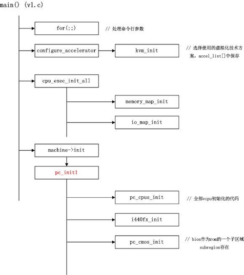
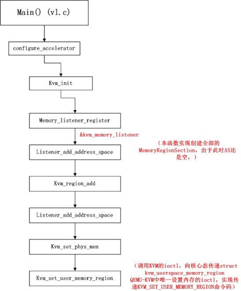
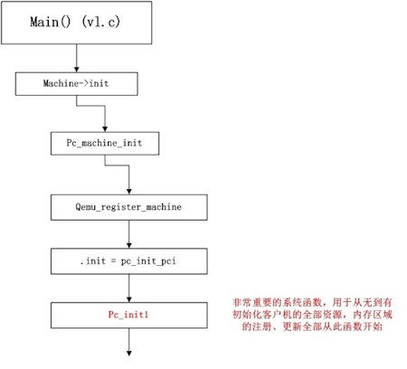

<!-- @import "[TOC]" {cmd="toc" depthFrom=1 depthTo=6 orderedList=false} -->

<!-- code_chunk_output -->


<!-- /code_chunk_output -->

虚拟机运行概览

首先直观的了解一下利用QEMU运行客户虚拟机的流程. 

在命令行中运行QEMU的启动命令格式举例: 

```
qemu-system-x86_64 --enable-kvm -cpu host \ 
-smp cores=4,threads=2,sockets=4 \
-m 16384 -k en-us -hda /pps/guohongwei/vm_test/ubuntu.img -monitor stdio
```

QEMU的核心初始化流程

客户系统运行之前, QEMU作为全系统模拟软件, 需要为客户系统模拟出CPU、主存以及I/O设备, 使客户系统就像运行在真实硬件之上, 而不用对客户系统代码做修改. 

如概览部分所示, 由用户为客户系统指定需要的虚拟CPU资源(包括CPU核心数, SOCKET数目, 每核心的超线程数, 是否开启NUMA等等), 虚拟内存资源, 具体参数设置参见${QEMU}/qemu-options.hx. 创建QEMU主线程, 执行QEMU系统的初始化, 在初始化的过程中针对每一个虚拟CPU, 单独创建一个posix线程. 每当一个虚拟CPU线程被调度到物理CPU上执行时, 该VCPU对应的一套完整的寄存器集合被加载到物理CPU上, 通过VM-LAUNCH或VM-RESUME指令切换到非根模式执行. 直到该线程时间片到, 或者其它中断引发虚拟机退出, VCPU退出到根模式, 进行异常处理. 

如下图所示, 当用户运行QEMU的System Mode的可执行文件时, QEMU从\${QEMU}/vl.c的main函数执行主线程. 以下着重分析, 客户系统启动之前, QEMU所做的初始化工作: 



1.处理命令行参数: 

进入vl.c的main函数, 首先有一个很长的for(;;)循环, 用于分析处理通过命令行传进来的参数, 进行相应系统的初始化设置. 比如创建多少VCPU, 是否开启NUMA, 分配多少虚拟内存资源等等. 

2.选择虚拟化方案: 

configure\_accelerator()函数, 选择使用哪种虚拟化解决方案. 

```c
accel_list[] = {
    { "tcg", "tcg", tcg_available, tcg_init, &tcg_allowed },
    { "xen", "Xen", xen_available, xen_init, &xen_allowed },
    { "kvm", "KVM", kvm_available, kvm_init, &kvm_allowed },
    { "qtest", "QTest", qtest_available, qtest_init, &qtest_allowed },
};
```

accel\_list[]数组声明了QEMU使用的**系统模拟方案**. "**tcg**"模式是**不使用任何硬件虚拟化辅助方式**, 采用基于二进制指令翻译的方式, 将目标平台的指令代码通过一个叫做**TCG的模块翻译**为本机可以执行的指令. "xen"、"kvm"分别为两种主流的开源虚拟化解决方案. 本文主要针对kvm这种硬件辅助的虚拟化解决方案. 



3.初始化内存布局: 

新版本的QEMU(1.4)中, cpu\_exec\_init\_all()函数只负责注册主存与IO内存两个顶层的memory\_region, 并且注册memory\_listener. 


4.虚拟客户机硬件初始化: 

在完成了QEMU自身的初始化工作后, 便开始了客户系统核心的初始化工作, 主要是QEMU根据命令行参数, 为客户系统创建虚拟的CPU、内存、I/O资源. 核心过程是machine\->init(&args), 对于x86目标平台, 实际调用的是pc\_init1函数. 下面着重分析该函数. 



4.1 VCPU初始化pc_cpus_init()


参考

https://blog.csdn.net/lux_veritas/article/details/9383643