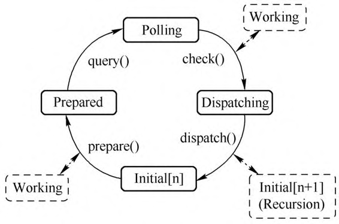

"一切皆文件"是 UNIX/Linux 的著名哲学理念, Linux 中的具体文件、设备、网络socket等都可以抽象为文件. 内核中通过虚拟文件系统(`Virtual File System`, **VFS**)抽象出一个统一的界面, 使得访问文件有统一的接口. Linux 通过 fd 来访问一个文件, **应用程序**也可以调用 **select**、**poll**、**epoll** 系统调用来监听文件的变化. QEMU 程序的运行即是基于各类文件 fd 事件的, QEMU 在运行过程中会将自己感兴趣的文件fd添加到其监听列表上并定义相应的处理函数, 在其主线程中, 有一个循环用来处理这些文件fd的事件, 如来自用户的输入、来自VNC的连接、虚拟网卡对应tap设备的收包等. 这种事件循环机制在 Windows 系统或者其他GUI应用中非常常见. QEMU的事件循环机制基于glib, glib是一个跨平台的、用C语言编写的若干底层库的集合. 本节对 glib 提供的事件循环机制进行简单介绍.

glib实现了完整的事件循环分发机制, 在这个机制中有一个主循环负责处理各种事件, 事件通过事件源描述, 事件源包括各种文件描述符(文件、管道或者socket)、超时和idle事件等, 每种事件源都有一个优先级, idle事件源在没有其他高优先级的事件源时会被调度运行. 应用程序可以利用glib的这套机制来实现自己的事件监听与分发处理. glib使用GMainLoop结构体来表示一个事件循环, 每一个GMainLoop都对应有一个主上下文GMainContext. 事件源使用GSource表示, 每个GSource可以关联多个文件描述符, 每个GSource会关联到一个GMainContext, 一个GMainContext可以关联多个GSource.

glib的一个重要特点是能够定义新的事件源类型, 可以通过定义一组回调函数来将新的事件源添加到glib的事件循环框架中. 新的事件源通过两种方式跟主上下文交互. 第一种方式是 GSourceFuncs 中的prepare函数可以设置一个超时时间, 以此来决定主事件循环中轮询的超时时间; 第二种方式是通过 `g_source_add_poll()` 函数来添加fd.

glib主上下文的一次循环包括 prepare、query、check、dispatch 四个过程, 分别对应glib的g_main_context_prepare()、g_main_context_query()、g_main_context_check() 以及 g_main_context_dispatch() 四个函数, 其状态转换如下图所示.

glib 事件循环状态转换图:

下面简单介绍这几个步骤:

1) prepare: 通过g_main_context_prepare()会调用事件对应的 prepare 回调函数, 做一些准备工作, 如果事件已经准备好进行监听了, 返回true.

2) query: 通过g_main_context_query()可以获得实际需要调用poll的文件fd.

3) check: 当query之后获得了需要进行监听的fd, 那么会调用 poll 对fd进行监听, 当poll返回的时候, 就会调用 `g_main_context_check()` 将 poll 的结果传递给主循环, 如果fd事件能够被分派就会返回 true.

4) dispatch: 通过 `g_main_context_dispatch()` 可以调用事件源对应事件的处理函数.

上面就是 glib 事件循环机制的处理流程, 应用程序需要做的就是把新的事件源加入到这个处理流程中, glib 会负责处理事件源上注册的各种事件.
