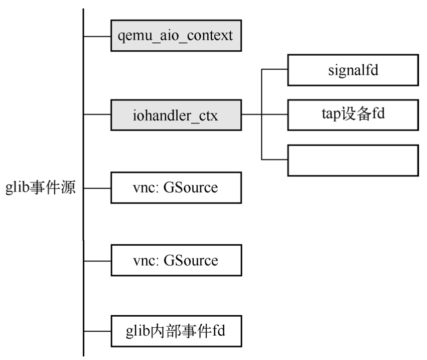
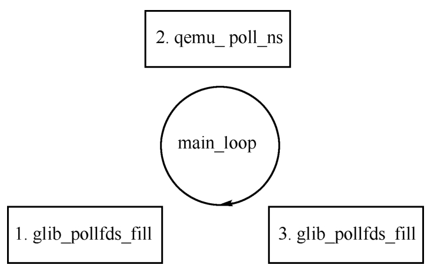
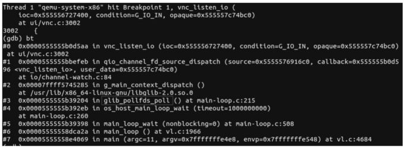

QEMU的事件循环机制如图2-2所示. QEMU在运行过程中会注册一些感兴趣的事件, 设置其对应的处理函数. 如对于VNC来说, 会创建一个 socket 用于监听来自用户的连接, 注册其可读事件为vnc_client_io, 当VNC有连接到来时, glib的框架就会调用vnc_client_io函数. 除了 VNC, QEMU 中还会注册很多其他事件监听, 如网卡设备的后端tap设备的收包, 收到包之后QEMU调用tap_send将包路由到虚拟机网卡前端, 若虚拟机使用qmp, 那么在管理界面中, 当用户发送qmp命令过来之后, glib会调用事先注册的tcp_chr_accept来处理用户的qmp命令. 本节将分析QEMU的事件循环实现. 关于QEMU的事件循环机制, Fam Zheng 在KVM Forum 2015上有一个非常不错的演讲, 题为"Improving the QEMU Event Loop", 读者可以自行搜索学习.

QEMU 事件循环机制:


可以通过如下命令启动虚拟机:

```
qemu-system-x86_64 -m 1024 -smp 4 -hda /home/haiwei/workspace/tools/ubuntu22.04.raw -accel kvm -vnc :0
```

在此命令行下启动的QEMU程序, 其主循环事件总共包含了下图所示的5个事件源, 其中前面两个qemu_aio_context和iohander_ctx都是类型为AioContext的自定义事件源, 中间两个VNC的事件源是glib标准事件源, 最后一个不是QEMU通过调用g_source_attach添加的事件源, 而是glib内部库自己使用的加入到事件循环的fd. qemu_aio_context和iohandler_ctx是两个比较特殊的自定义的类型为AioContext的事件源, 前者主要用于处理QEMU中块设备相关的异步I/O请求通知, 后者用于处理QEMU中各类事件通知, 这些事件通知包括信号处理的fd、tap设备的fd以及VFIO设备对应的中断通知等. glib中事件源可以添加多个事件fd, 对应的AioContext表示为每一个fd在AioContext都有记录, glib框架在执行iohandler_ctx的分发函数时, 会遍历其上所有的fd, 如果某个fd上的数据准备好了, 就会调用相应的回调函数. 这里需要注意, 每一个事件源本身都会有一个fd, 当添加一个fd到事件源时, 整个glib主循环都会监听该fd. 以前述命令为例, QEMU主循环总共会监听6个fd, 其中5个是事件源本身的fd, 还有一个是通过系统调用SYS_signalfd创建的用来处理信号的fd, 图2-3中的tap设备fd只是作为一个例子, 在上述命令行下并不会添加该fd. 任何一个fd准备好事件之后都可以唤醒主循环. 本节末会对这6个fd的产生及其分析过程进行介绍.

QEMU 事件源实例:



QEMU主循环对应的最重要的几个函数如图2-4所示. QEMU的main函数定义在vl.c中, 在进行好所有的初始化工作之后会调用函数main_loop来开始主循环.

QEMU 主循环对应的函数:



main_loop及其调用的main_loop_wait的主要代码如下. main_loop_wait函数调用了os_host_main_loop_wait函数, 在后者中可以找到对应图2-4的相关函数, 即每次main_loop循环的3个主要步骤. main_loop_wait在调用os_host_main_loop_wait前, 会调用qemu_soonest_timeout函数先计算一个最小的timeout值, 该值是从定时器列表中获取的, 表示监听事件的时候最多让主循环阻塞的事件, timeout使得QEMU能够及时处理系统中的定时器到期事件.

```cpp

```

QEMU主循环的第一个函数是glib_pollfds fill, 下面的代码显示了该函数的工作流程. 该函数的主要工作是获取所有需要进行监听的fd, 并且计算一个最小的超时时间. 首先调用g_main_context_prepare开始为主循环的监听做准备, 接着在一个循环中调用g_main context query获取需要监听的fd, 所有fd保存在全局变量gpollfds数组中, 需要监听的fd的数量保存在glib n poll fds中, g main context query还会返回fd时间最小的timeout, 该值用来与传过来的cur timeout (定时器的timeout) 进行比较, 选取较小的一个, 表示主循环最大阻塞的时间. 

```cpp

```

os_host_main_loop_wait 在调用 glib_pollfds fill之后就完成了图2-4的第一步, 现在已经有了所有需要监听的fd了, 然后会调用gemu mutex unlock iothread释放QEMU大锁 (Big emu Lock, BQL), BQL会在本章第2节"QEMU线程模型"中介绍, 这里略过. 接着os host main_loop wait函数会调用qemu poll ns, 该函数代码如下. 它接收3个参数, 第一个是要监听的fd数组, 第二个是fds数组的长度, 第三个是一个timeout值, 表示g_poll最多阻塞的时间. qemu_poll_ns在配置CONFIG PPOLL时会调用ppoll, 否则调用glib的函数g_poll, g_poll是一个跨平台的poll函数, 用来监听文件上发生的事件. 

```cpp

```

qemu_poll_ns的调用会阻塞主线程, 当该函数返回之后, 要么表示有文件fd上发生了事件, 要么表示一个超时, 不管怎么样, 这都将进入图2-4的第三步, 也就是调用glib pollfds poll函数进行事件的分发处理, 该函数的代码如下. glib pollfds poll调用了glib框架的g main context check检测事件, 然后调用g main context dispatch进行事件的分发. 

```cpp

```

下面以虚拟机的VNC连接为例分析相应的函数调用过程. VNC子模块在初始化的过程中会在vnc_display_open中调用qio_channel_add_watch, 设置其监听的回调函数为vnc_listen_io, 该过程最终会创建一个回调函数集合为qio_channel_fd_source_funcs的事件源, 其中的dispatch函数为qio_channel_fd_source_dispatch, 该函数会调用vnc_listen_io函数. 

```cpp

```

以本小节最开始的命令启动虚拟机, 然后在vnc_listen_io处下断点, 使用VNC客户端连接虚拟机, QEMU进程会中断到调试器中, 使用gdb的bt命令可以看到图2-5所示的函数调用堆栈. 

vnc连接fd的事件处理函数堆栈:



上面是QEMU效仿glib实现的主循环, 但主循环存在一些缺陷, 比如在主机使用多CPU的情况下伸缩性受到限制, 同时主循环使用了QEMU全局互斥锁, 从而导致VCPU线程和主循环存在锁竞争, 使性能下降. 为了解决这个问题, QEMU引入了iothread事件循环, 把一些I/O操作分配给iothread, 从而提高I/O性能. 


qemu2事件处理机制: https://blog.csdn.net/woai110120130/article/details/99693067

qemu AIO线程模型: https://blog.csdn.net/woai110120130/article/details/100050152

