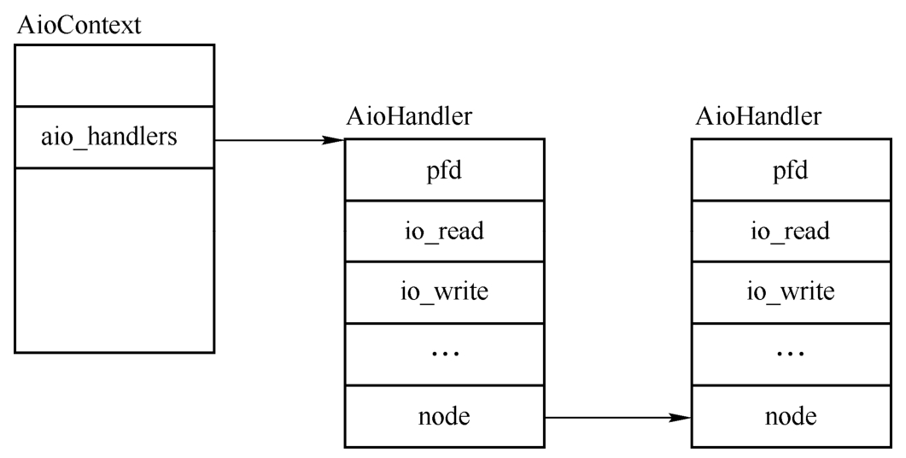

QEMU自定义了一个新的事件源AioContext, 有两种类型的AioContext, 第一类用来监听各种各样的事件, 比如iohandler_ctx, 第二类是用来处理块设备层的异步I/O请求, 比如QEMU默认的qemu_aio_context或者模块自己创建的AioContext. 这里只关注第一种情况, 即事件相关的AioContext. 下面的代码列出了AioContext结构中的主要成员.

```cpp

```

这里简单介绍一下AioContext中的几个成员. 

* source: glib中的GSource, 每一个自定义的事件源第一个成员都是GSource结构的成员. 

* lock: QEMU中的互斥锁, 用来保护多线程情况下对AioContext中成员的访问. 

* aio_handlers: 一个链表头, 其链表中的数据类型为AioHandler, 所有加入到AioContext事件源的文件fd的事件处理函数都挂到这个链表上. 

* notify_me和notified都与aio_notify相关, 主要用于在块设备层的I/O同步时处理QEMU下半部(Bottom Halvs, BH). 

* first_bh: QEMU下半部链表, 用来连接挂到该事件源的下半部, QEMU的BH默认挂在qemu_aio_context下. 

* notifier: 事件通知对象, 类型为EventNotifier, 在块设备进行同步且需要调用BH的时候需要用到该成员. 

* tlg: 管理挂到该事件源的定时器. 剩下的结构与块设备层的I/O同步相关, 这里略过. 

剩下的结构与块设备层的I/O同步相关, 这里略过. 

AioContext拓展了glib中source的功能, 不但支持fd的事件处理, 还模拟内核中的下半部机制, 实现了QEMU中的下半部以及定时器的管理. 

接下来介绍AioContext的相关接口, 这里只以文件fd的事件处理为主, 涉及AioContext与块设备层I/O同步的代码会省略掉. 首先是创建AioContext函数的aio_context_new, 该函数的核心调用如下. 

```cpp

```

aio_context_new函数首先创建分配了一个AioContext结构ctx, 然后初始化代表该事件源的事件通知对象ctx->notifier, 接着调用了aio_set_event_notifier用来设置ctx->notifier对应的事件通知函数, 初始化ctx中其他的成员. 

aio_set_event_notifier函数调用了aio_set_fd_handler函数, 后者是另一个重要的接口函数, 其作用是添加或者删除事件源中的一个fd. 如果作用是添加, 则会设置fd对应的读写函数, aio_set_fd_handler即可用于从AioContext中删除fd, 也可以用于添加fd, 下面的代码去掉了删除事件源中fd监听处理的步骤, 其代码如下. 

```cpp

```

aio_set_fd_handler的第一个参数ctx表示需要添加fd到哪个AioContext事件源; 第二个参数fd表示添加的fd是需要在主循环中进行监听的; is_external用于块设备层, 对于事件监听的fd都设置为false; io_read和io_write都是对应fd的回调函数, opaque会作为参数调用这些回调函数. 

aio_set_fd_handler函数首先调用find_aio_handler查找当前事件源ctx中是否已经有了fd, 考虑新加入的情况, 这里会创建一个名为node的AioHandler, 使用fd初始化node->pfd.fd, 并将其插入到ctx->aio_handlers链表上, 调用glib接口g_source_add_poll将该fd插入到了事件源监听fd列表中, 设置node事件读写函数为io_read, io_write函数, 根据io_read和io_write的有无设置node->pfd.events, 也就是要监听的事件. aio_set_fd_handler调用之后, 新的fd事件就加入到了事件源的aio_handlers链表上了, 如图所示. 

AioContext的aio_handlers链表:



aio_set_fd_handler函数一般被块设备相关的操作直接调用, 如果仅仅是添加一个普通的事件相关的fd到事件源, 通常会调用其封装函数qemu_set_fd_handler, 该函数将事件fd添加到全部变量iohandler_ctx事件源中. 

glib中自定义的事件源需要实现glib循环过程中调用的几个回调函数, QEMU中为AioContext事件源定义了名为aio_source_funcs的GSourceFuns结构. 

```cpp

```

这几个函数是自定义事件源需要实现的, 这里介绍一下最重要的事件处理分派函数aio_ctx_dispatch. aio_ctx_dispatch代码如下, 其会调用aio_dispatch, aio_dispatch要完成3件事: 第一是BH的处理, 第二是处理文件fd列表中有事件的fd, 第三是调用定时器到期的函数. 这里分析一下文件fd的处理部分. 

```cpp

```

aio_dispatch_handlers函数会遍历 aio_handlers, 遍历监听fd上的事件是否发生了. fd发生的事件存在node->pfd.revents中, 注册时指定需要接受的事件存放在node->pfd.events中, revents变量保存了fd接收到的事件. 对应 `G_IO_IN` **可读事件**来说, 会调用注册的fd的io read回调, 对 `G_IN_OUT` 可写事件来说, 会调用注册的 fd 的 io_write 函数. 当然, 如果当前的fd已经删除了, 则会删除这个节点. 

