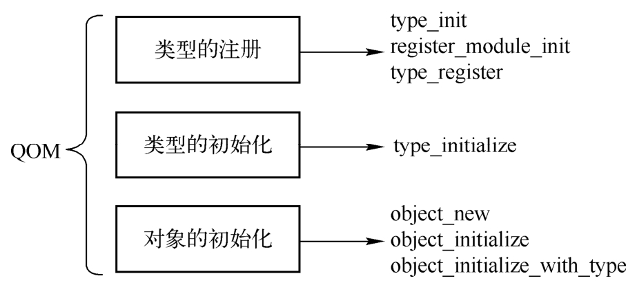

QOM的全称是QEMU Object Model, 顾名思义, 这是QEMU中对象的一个抽象层. 一般来讲, 对象是C++这类面向对象编程语言中的概念. 面向对象的思想包括继承、封装与多态, 这些思想在大型项目中能够更好地对程序进行组织与设计. Linux内核与QEMU虽然都是C语言的项目, 但是都充满了面向对象的思想, QEMU中体现这一思想的就是QOM. QEMU的代码中充满了对象, 特别是设备模拟, 如网卡、串口、显卡等都是通过对象来抽象的. QOM用C语言基本上实现了继承、封装、多态特点. 如网卡是一个类, 它的父类是一个PCI设备类, 这个PCI设备类的父类是设备类, 此即继承. QEMU通过QOM可以对QEMU中的各种资源进行抽象、管理(如设备模拟中的设备创建、配置、销毁). QOM还用于各种后端组件(如MemoryRegion, Machine等)的抽象, 毫不夸张地说, QOM遍布于QEMU代码. 这一节会对QOM进行详细介绍, 以帮助读者理解QOM, 进而更加方便地阅读QEMU代码.

要理解QOM, 首先需要理解类型和对象的区别. 类型表示种类, 对象表示该种类中一个具体的对象. 比如QEMU命令行中指定"-device edu,id=edu1, -device edu,id=edu2", edu本身是一个种类, 创建了edu1和edu2两个对象. QOM整个运作包括3个部分, 即类型的注册、类型的初始化以及对象的初始化, 3个部分涉及的函数如图2-16所示.

QOM对象机制组成部分:

