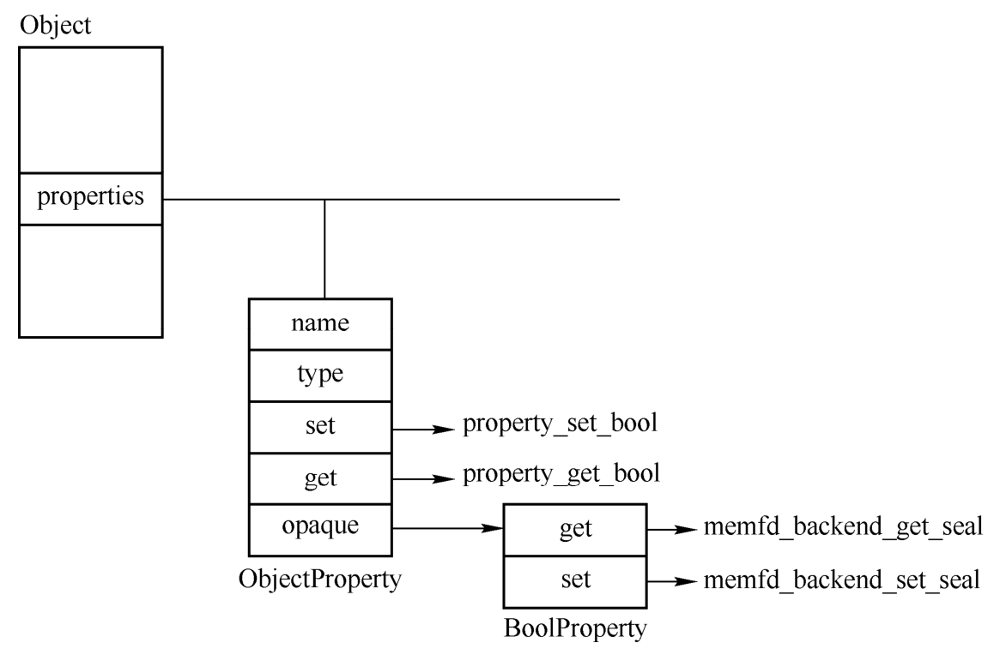
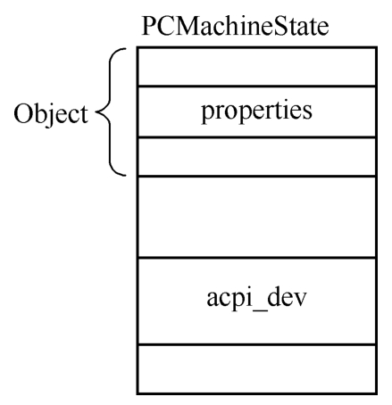
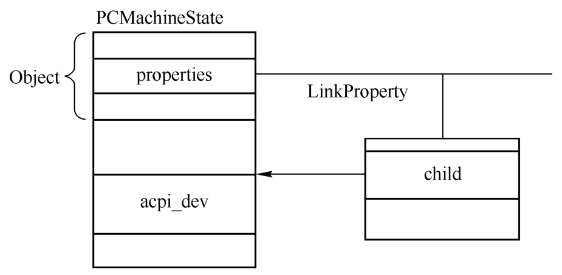
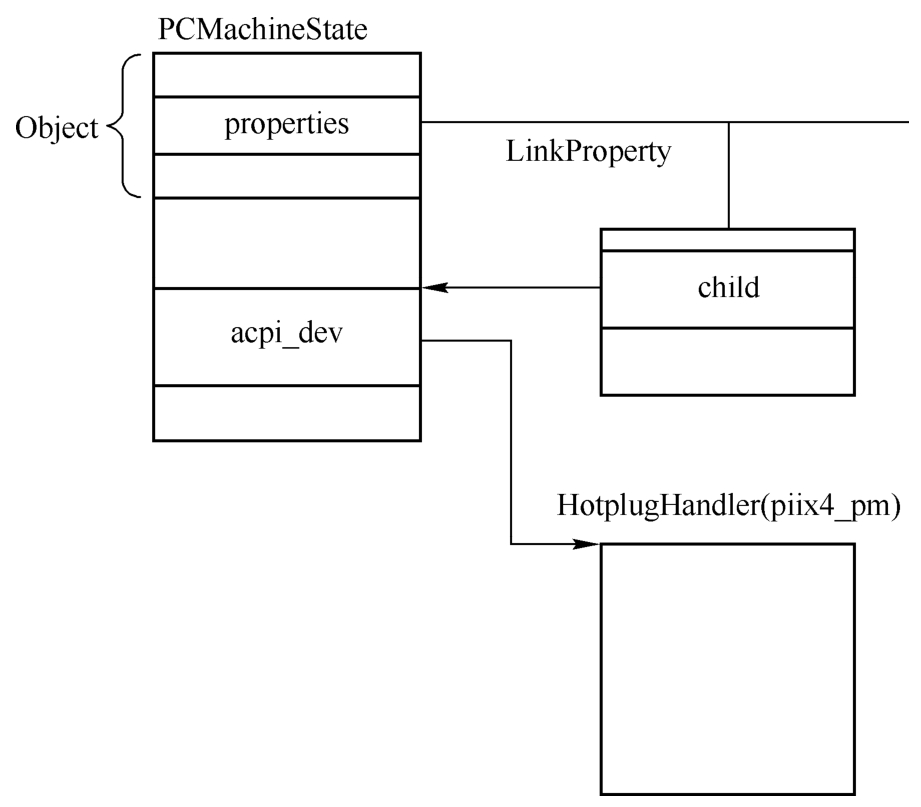

QOM实现了类似于C++的基于类的多态, 一个对象按照继承体系可以是Object、DeviceState、PCIDevice等. 在QOM中为了便于对对象进行管理, 还给每种类型以及对象增加了属性. 类属性存在于ObjectClass的properties域中, 这个域是在类型初始化函数type_initialize中构造的. 对象属性存放在Object的properties域中, 这个域是在对象的初始化函数object_initialize_with_type中构造的. 两者皆为一个哈希表, 存着属性名字到ObjectProperty的映射.

属性由ObjectProperty表示.

```cpp

```

其中, name表示名字; type表示属性的类型, 如有的属性是字符串, 有的是bool类型, 有的是link等其他更复杂的类型; get、set、resolve等回调函数则是对属性进行操作的函数; opaque指向一个具体的属性, 如BoolProperty等.

每一种具体的属性都会有一个结构体来描述它. 比如下面的LinkProperty表示link类型的属性, StringProperty表示字符串类型的属性, BoolProperty表示bool类型的属性.

```cpp

```

图2-19展示了几个结构体的关系.

属性相关的结构体关系:



下面介绍几个属性的操作接口, 属性的添加分为类属性的添加和对象属性的添加, 以对象属性为例, 它的属性添加是通过object_property_add接口完成的.

```cpp

```

上述代码片段忽略了属性name中带有通配符*的情况.

object_property_add函数首先调用object_property_find来确认所插入的属性是否已经存在, 确保不会添加重复的属性, 接着分配一个ObjectProperty结构并使用参数进行初始化, 然后调用 g_hash_table_insert 插入到对象的 properties 域中.

属性的查找通过 object_property_find 函数实现, 代码如下.

```cpp

```

上述代码片段忽略了属性name中带有通配符*的情况.

object_property_add函数首先调用object_property_find来确认所插入的属性是否已经存在, 确保不会添加重复的属性, 接着分配一个ObjectProperty结构并使用参数进行初始化, 然后调用g_hash_table_insert插入到对象的properties域中.

属性的查找通过object_property_find函数实现, 代码如下.

```cpp

```

这个函数首先调用object_class_property_find来确认自己所属的类以及所有父类都不存在这个属性, 然后在自己的properties域中查找.

属性的设置是通过object_property_set来完成的, 其只是简单地调用ObjectProperty的set函数.

```cpp

```

每一种属性类型都有自己的set函数, 其名称为object_set_XXX_property, 其中的XXX表示属性类型, 如bool、str、link等. 以bool为例, 其set函数如下.

```cpp

```

可以看到, 其调用了具体属性(BoolProperty)的set函数, 这是在创建这个属性的时候指定的.

再回到edu设备, 在qdev_device_add函数的后面, 会调用以下代码.

```cpp

```

其中并没有给edu设备添加realized属性的过程, 那么这是在哪里实现的呢?设备的对象进行初始化的时候, 会上溯到所有的父类型, 并调用它们的instance_init函数. 可以看到device_type_info的instance_init函数device_initfn, 在后面这个函数中, 它给所有设备都添加了几个属性.

```cpp

```

其中, realized的设置函数为device_set_realized, 其调用了DeviceClass的realize函数.

```cpp

```

对PCI设备而言, 其类型初始化函数为pci_device_class_init, 在该函数中设置了其DeviceClass的realize为qdev_realize函数.

```cpp

```

在pci_qdev_realize函数中调用了PCIDeviceClass的realize函数, 在edu设备中, 其在类型的初始化函数中被设置为pci_edu_realize, 代码如下.

```cpp

```

所以在qdev_device_add中对realized属性进行了设置之后, 它会寻找到父设备DeviceState添加的realized属性, 并最终调用在edu设备中指定的pci_edu_realize函数, 这个时候会对EduState的各个设备的相关域进行初始化, 使得设备处于可用状态. 这里对edu设备具体数据的初始化不再详述.

将设置设备realized属性的过程叫作设备的具现化.

设备的realized属性属于bool属性. bool属性是比较简单的属性, 这里再对两个特殊的属性进行简单的介绍, 即child属性和link属性.

child属性表示对象之间的从属关系, 父对象的child属性指向子对象, child属性的添加函数为object_property_add_child, 其代码如下.

```cpp

```

首先根据参数中的name(一般是子对象的名字)创建一个 `child<name>`, 构造出一个新的名字, 然后用这个名字作为父对象的属性名字, 将子对象添加到父对象的属性链表中, 存放在ObjectProperty的opaque中.

link属性表示一种连接关系, 表示一种设备引用了另一种设备, 添加link属性的函数为object_property_add_link, 其代码如下.

```cpp

```

这个函数将会添加obj对象的 `link<type>` 属性, 其中type为参数child的类型, 将child存放在LinkProperty的child域中. 设置这个属性的时候, 其实也就是写这个child的时候, 在object_set_link_property中最关键一句为:

```cpp

```

这样就建立起了两个对象之间的关系.

下面以hw/i386/pc_piix.c中的pc_init1函数中为PCMachineState对象添加PC_MACHINE_ACPI_DEVICE_PROP属性为例, 介绍属性添加与设置的相关内容. PCMachineState初始化状态如图2-20所示, apci_dev是一个HotplugHandler类型的指针, properties是根对象Object存放所有属性的哈希表.

PCMachineState初始状态:



pc_init1函数中有下面一行代码.

```cpp

```

执行这行代码时, 会给类型为PCMachineState的对象machine增加一个link属性, link属性的child成员保存了apci_dev的地址, 如图2-21所示.

PCMachineState添加link属性:



执行下一行代码设置link属性时, 会设置指针acpi_dev指向一个类型为TYPE_HOTPLUG_HANDLER的对象.

```cpp

```

执行完之后如图2-22所示.

PCMachineState设置link属性:



调用object_property_add_link函数时会将pcms->acpi_dev的地址放到link属性中, 接下来设置其link属性的值为piix4_pm对象. 这里之所以能将一个设备对象设置成一个TYPE_HOTPLUG_HANDLER的link, 是因为piix4_pm所属的类型TYPE_PIIX4_PM有TYPE_HOTPLUG_HANDLER接口, 所以可以看成TYPE_HOTPLUG_HANDLER类型. 从下面的调试结果可以看出, 在设置link之后, pcms->acpi_dev指向了piix4_pm.

```

```