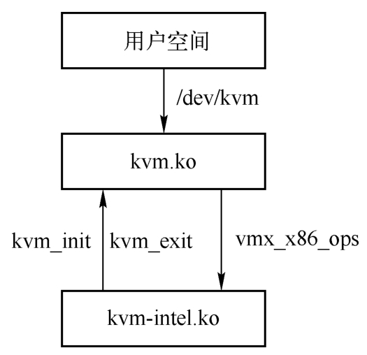
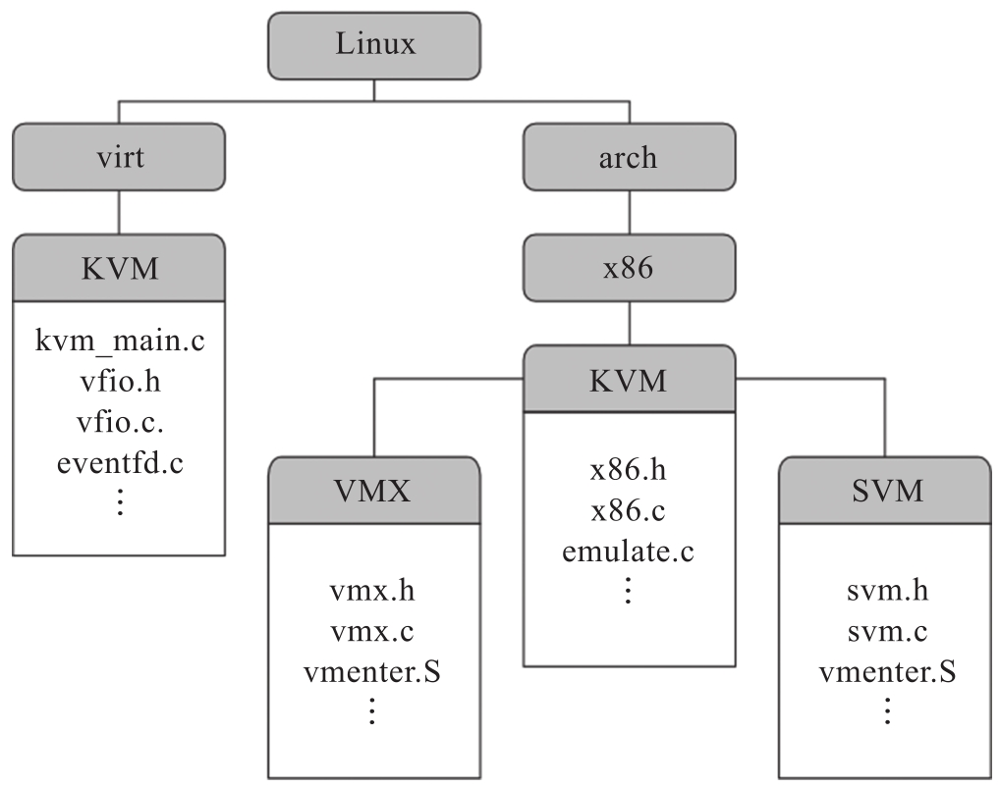

<!-- @import "[TOC]" {cmd="toc" depthFrom=1 depthTo=6 orderedList=false} -->

<!-- code_chunk_output -->

- [1. KVM 的内核模块](#1-kvm-的内核模块)
- [2. 调用关系](#2-调用关系)
- [3. 源码结构](#3-源码结构)
  - [3.1. virt/kvm 目录](#31-virtkvm-目录)
  - [3.2. arch/x86/kvm 目录](#32-archx86kvm-目录)
  - [3.3. `arch/*/include/asm/kvm*`](#33-archincludeasmkvm)
  - [3.4. include/linux 目录](#34-includelinux-目录)
  - [3.5. include/asm-x86 目录](#35-includeasm-x86-目录)
  - [3.6. include/trace/events/kvm.h](#36-includetraceeventskvmh)
  - [3.7. 文档](#37-文档)

<!-- /code_chunk_output -->

# 1. KVM 的内核模块

KVM 体现了**Linux 系统的哲学**: **只做一件事情**, 但是要**做得最好**.

在 KVM 的 **Makefile** 文件中, 可以查看到 **KVM 的代码文件组织结构**.

KVM 的 Makefile 文件:

```makefile
# arch/x86/kvm/Makefile
# SPDX-License-Identifier: GPL-2.0

ccflags-y += -Iarch/x86/kvm
ccflags-$(CONFIG_KVM_WERROR) += -Werror

KVM := ../../../virt/kvm

kvm-y                   += $(KVM)/kvm_main.o $(KVM)/coalesced_mmio.o \
                                $(KVM)/eventfd.o $(KVM)/irqchip.o $(KVM)/vfio.o
kvm-$(CONFIG_KVM_ASYNC_PF)      += $(KVM)/async_pf.o

kvm-y                   += x86.o emulate.o i8259.o irq.o lapic.o \
                           i8254.o ioapic.o irq_comm.o cpuid.o pmu.o mtrr.o \
                           hyperv.o debugfs.o mmu/mmu.o mmu/page_track.o

kvm-intel-y             += vmx/vmx.o vmx/vmenter.o vmx/pmu_intel.o vmx/vmcs12.o vmx/evmcs.o vmx/nested.o
kvm-amd-y               += svm/svm.o svm/vmenter.o svm/pmu.o svm/nested.o svm/avic.o svm/sev.o

obj-$(CONFIG_KVM)       += kvm.o
obj-$(CONFIG_KVM_INTEL) += kvm-intel.o
obj-$(CONFIG_KVM_AMD)   += kvm-amd.o
```

由此可见 host kernel 的 kvm 包含两部分代码 `virt/kvm/` 和 `arch/x86/kvm`, 不同的硬件虚拟化对应不同的 mode, 如`kvm-intel.ko` 包含`vmx/vmx.c`,`vmx/vmenter.S`, `pmu_intel.c`, `vmx/vmcs12.c`,`vmx/evmcs.c`,和 `vmx/nested.c`, 而 amd 硬件虚拟化则是 `svm/svm.c` pmu_amd.c

在最后三行, 可以看到该 Makefile 主要由**三个模块**生成: **kvm.o**,**kvm\-intel.o**和**kvm-amd.o**, 前者是 KVM 的核心模块, 后两者是 KVM 的平台架构独立模块.

查看当前系统能验证

```
# find /lib/modules/`uname -r`/kernel/ | grep kvm
/lib/modules/5.4.0-tlinux2-0050/kernel/arch/x86/kvm
/lib/modules/5.4.0-tlinux2-0050/kernel/arch/x86/kvm/kvm.ko
/lib/modules/5.4.0-tlinux2-0050/kernel/arch/x86/kvm/kvm-intel.ko
```

- `kvm.o`是 kvm 的核心模块

  - **IOMMU**,**中断控制**,**kvm arch**,**设备管理**等部分的代码, 这些代码形成了**虚拟机管理的核心功能**.

  - **KVM** 并没有尝试实现一个完整的 PC 系统虚拟化, 而将最重要的 **CPU 虚拟化**,**I/O 虚拟化**和**内存虚拟化**部分针对**硬件辅助的能力**进行了有效的抽象和对接, 并且暴露出 API 供上层应用 QEMU 使用.

- kvm-intel.o 是 intel 平台架构虚拟化模块, 平台相关

- kvm-amd.o 是 amd 架构虚拟化模块, 平台相关

# 2. 调用关系

kvm-intel.ko 与 kvm.ko 调用关系:



# 3. 源码结构



其中, Linux 的 virt/kvm 目录下是通用 KVM 内核模块的代码, 用于提供与平台无关的虚拟化框架, 对应内核模块 kvm.ko. arch/x86/kvm 目录下则是 x86 平台相关的 KVM 实现, 包括 Intel 和 AMD 公用的代码, 如对 x86 指令的解码与模拟, 型号特有寄存器 (Model-Specific Register, MSR) 及控制寄存器 (Control Register, CR) 的模拟, 中断控制器的模拟等. 此外, 由于 Intel 和 AMD 平台的硬件虚拟化技术不同, 其对应的虚拟化支持分别在 arch/x86/kvm 下的 vmx 和 svm 子目录中有各自的实现, 例如 Intel VT-x 中对 VMCS 的管理, VMX Root 和 VMX Non-Root 模式间的切换等特有的代码则位于 vmx 子目录中, 编译后为 kvm-intel.ko. kvm-intel.ko, kvm-amd.ko 等平台相关的模块依赖于通用 KVM 内核模块 (kvm.ko) 为其提供虚拟化基础设施的服务, 同时为通用 KVM 内核模块提供具体的硬件虚拟化实现.

KVM 分为三部分: KVM 框架的核心源代码, 与硬件架构相关的代码, kvm 头文件.

## 3.1. virt/kvm 目录

KVM 的核心代码

**virt/kvm 目录**如下:

```
# ls virt/kvm/
async_pf.c      coalesced_mmio.c  eventfd.c      Kconfig     Makefile.kvm  vfio.h
async_pf.h      coalesced_mmio.h  guest_memfd.c  kvm_main.c  pfncache.c
binary_stats.c  dirty_ring.c      irqchip.c      kvm_mm.h    vfio.c
```

这些文件是 KVM 的**架构无关文件**, 独立于处理器平台体系, 主要提供了一些**公用的方法**和**公用的数据结构**.

在 `kvm_main.c` 中有一个 **kvm\_init** 的函数是**KVM 初始化的入口**.

## 3.2. arch/x86/kvm 目录

硬件架构相关代码

`arch/x86/kvm` 目录如下:

```
# ls arch/x86/kvm/
cpuid.c              hyperv.h  irq_comm.c         kvm_onhyperv.h  pmu.c            tss.h
cpuid.h              i8254.c   irq.h              lapic.c         pmu.h            vmx
debugfs.c            i8254.h   Kconfig            lapic.h         reverse_cpuid.h  x86.c
emulate.c            i8259.c   kvm-asm-offsets.c  Makefile        smm.c            x86.h
fpu.h                ioapic.c  kvm_cache_regs.h   mmu             smm.h            xen.c
governed_features.h  ioapic.h  kvm_emulate.h      mmu.h           svm              xen.h
hyperv.c             irq.c     kvm_onhyperv.c     mtrr.c          trace.h
```

该目录是 KVM 的**主要文件目录**, 除了包含 **x86 架构** KVM 所需要的**头文件, 代码**之外, 还包括适用于 **Intel 的模块文件(vmx.c**)和**AMD 芯片的模块文件(svm.c**).

## 3.3. `arch/*/include/asm/kvm*`

相关头文件

```
# ls -d arch/x86/include/asm/kvm*
arch/x86/include/asm/kvm_emulate.h  arch/x86/include/asm/kvm_page_track.h  arch/x86/include/asm/kvm_vcpu_regs.h
arch/x86/include/asm/kvm_host.h     arch/x86/include/asm/kvm_para.h        arch/x86/include/asm/kvmclock.h
```

## 3.4. include/linux 目录

**include/linux 目录**如下:

- kvm.h
- kvm\_host.h
- kvm\_para.h
- kvm\_x86\_emulate.h

这几个目录主要包含了 KVM 的一些**参数定义信息**.

## 3.5. include/asm-x86 目录

include/asm\-x86/目录如下:

- kvm.h
- kvm\_host.h
- kvm\_para.h
- kvm\_x86\_emulate.h

这几个目录中, 包含了 KVM 的一些**汇编语言操作**时所需要的相关**宏定义**, **全局变量**等.

## 3.6. include/trace/events/kvm.h

事件跟踪函数的声明

## 3.7. 文档

```
Documentation/*/kvm*
```

```
# ls Documentation/virt/kvm
api.rst  devices           index.rst    ppc-pv.rst            s390               x86
arm      halt-polling.rst  locking.rst  review-checklist.rst  vcpu-requests.rst
```
