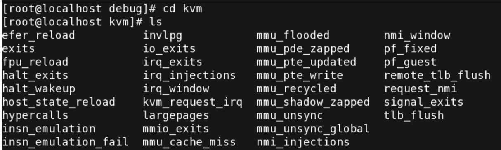

<!-- @import "[TOC]" {cmd="toc" depthFrom=1 depthTo=6 orderedList=false} -->

<!-- code_chunk_output -->

- [1. 学习方法](#1-学习方法)
- [2. 调试接口](#2-调试接口)

<!-- /code_chunk_output -->

# 1. 学习方法

1. 利用 kvm-unit-test

利用 kvm-unit-test 和 ftrace, 修改完成相应功能调试

2. 通过 ftrace 追踪某个方法, 或者以 vcpu thread 为单位整个追踪.

这里提供的代码分析偏重于整体逻辑以及软件实现, 其中硬件支持的代码主要在手册翻译部分附上.

* AMD 手册相关的见 `Learning/[Manual]AMD 虚拟化`

* Intel 手册相关的见 `Learning/处理器虚拟化技术`

# 2. 调试接口

KVM 提供了丰富的调试信息接口, 通过 Linux 内核自带的**debugfs**将调试信息导出. 要启用 KVM 的调试接口, 可以输入以下指令来挂载调试信息分区:

```
mount -t debugfs none /sys/kernel/debug
```

之后可以进入/**sys/kernel/debug/kvm** 目录中查看到相应的调试信息, 如图 5\-8 所示.

图 5-8 KVM 调试信息图



从前文分析中可以看出, KVM 并没有提供一个完整的 PC 虚拟环境, 而是提供了针对处理器、I/O 和内存等关键技术点的 API, 借助第三方环境实现整台 PC 机的模拟.

QEMU 基于模块化设计, 因此, KVM 的开发小组将 QEMU 针对 x86 模拟体系中的 CPU 模拟、I/O 模拟和内存模拟等模块针对 KVM 所导出的 API 进行了优化后, qemu\-kvm 就成了可以运行 KVM 虚拟机的宿主.