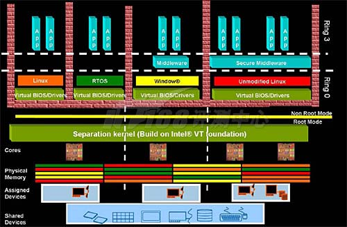
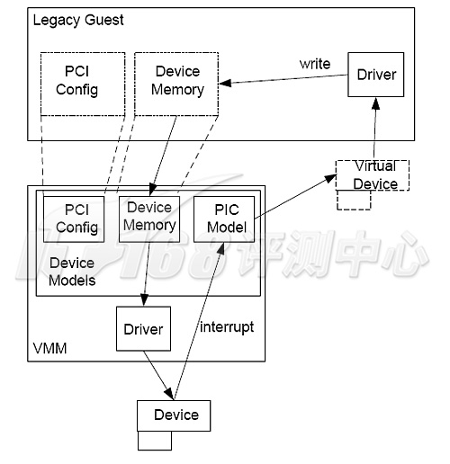
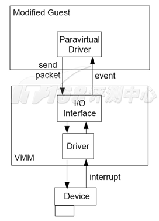
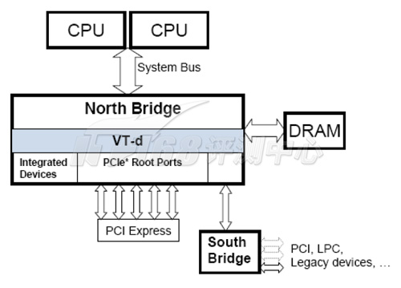
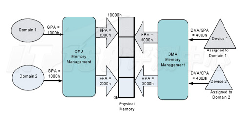
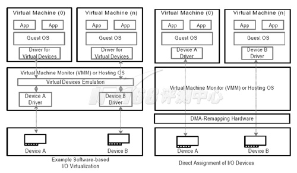
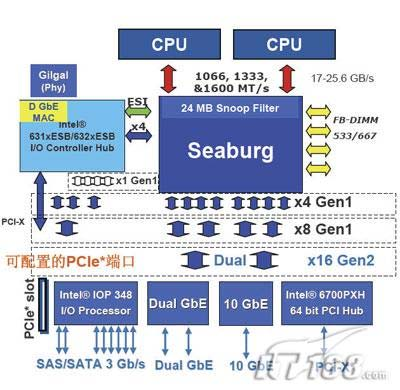
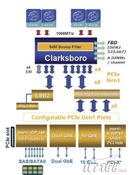

本篇文章来源于中国协议分析网| www.cnpaf.net 原文链接: http://www.cnpaf.net/Class/netepisteme/200901/23304.html

当前非常热门的 Virtualization 虚拟化技术的出现和应用其实已经有数十年的历史了, 在早期, 这个技术主要应用在服务器以及大型主机上面, 现在, 随着 PC 性能的不断增长, Virtualization 也开始逐渐在 x86 架构上流行起来.

虚拟化技术将各种资源虚拟出多台主机, 以提高这些资源的共享率和利用率虚拟化可以将 IT 环境改造成为更加强大、更具弹性、更富有活力的架构. 通过把多个操作系统整合到一台高性能服务器上, 最大化利用硬件平台的所有资源, 用更少的投入实现更多的应用, 还可以简化 IT 架构, 降低管理资源的难度, 避免 IT 架构的非必要扩张. 客户虚拟机的真正硬件无关性还可以实现虚拟机的运行时迁移, 可以实现真正的不间断运行, 从而最大化保持业务的持续性, 而不用为购买超高可用性平台而付出高昂的代价.

和 Sun 上的虚拟化技术(CPU 分区)比起来, x86 上的虚拟化要落后不少的, 然而确实在不断进步着, 在**数年前**, **x86**上还**没有什么硬件支持**, 甚至连指令集都不是为虚拟化而设计, 这时主要靠**完全的软件**来实现虚拟化, 当时的代表是 **VMware** 的产品, 以及尚未被 Microsoft 收购 Connectix 开发的 Virtual PC, 在服务器市场上应用的主要是 VMware 的产品, 包括 GSX Server 和稍后的 ESX Server, 这些软件虚拟化产品在关键指令上都采用了二进制模拟/翻译的方法, 开销显得比较大, 后期出现了 Para\-Virtualization 部分虚拟化技术, 避免了一些二进制转换, 性能得到了提升, 不过仍然具有隔离性的问题.

今天, 虚拟化技术的各方面都有了进步, **虚拟化**也从**纯软件**逐深入到**处理器级虚拟化**, 再到**平台级虚拟化**乃至**输入/输出级虚拟化**, 代表性技术就是 Intel Virtualization Technology for Directed I/O, 简写为 Intel **VT\-d**, 在介绍这个 Intel VT-d 之前, 我们先来看看**x86 硬件虚拟化**的**第一步**: **处理器辅助虚拟化技术**, 也就是 Intel Virtualization Technology, 分为对应 Itanium 平台的 VT\-i 和对应**x86**平台的**VT\-x**两个版本. AMD 公司也有对应的技术**AMD-V**. 我们介绍的是 x86 平台上的 VT-x 技术, VT-i 技术原理上略为相近.

**纯软件虚拟化**主要的问题是**性能**和**隔离性**. **Full Virtualization 完全虚拟化技术**可以提供较好的客户操作系统独立性, 不过其性能不高, 在不同的应用下, 可以消耗掉主机 10%~30%的资源. 而 OS Virtualization 可以提供良好的性能, 然而各个客户操作系统之间的独立性并不强. 无论是何种软件方法, **隔离性**都是由**Hypervisor 软件**提供的, **过多的隔离**必然会导致**性能的下降**.

这些问题主要跟 x86 设计时就没有考虑虚拟化有关. 我们先来看看 x86 处理器的 Privilege 特权等级设计.

x86 架构为了保护指令的运行, 提供了指令的**4 个不同 Privilege 特权级别**, 术语称为 Ring, 从 Ring 0~Ring 3. Ring 0 的优先级最高, Ring 3 最低. 各个级别对可以运行的指令有所限制, 例如, **GDT, IDT, LDT, TSS 等这些指令**就只能运行于**Privilege 0**, 也就是 Ring 0. 要注意 Ring/Privilege 级别和我们通常认知的进程在操作系统中的优先级并不同.

操作系统必须要运行一些 Privilege 0 的特权指令, 因此 Ring 0 是被用于运行操作系统内核, Ring 1 和 Ring 2 是用于操作系统服务, Ring 3 则是用于应用程序. 然而实际上并没有必要用完 4 个不同的等级, **一般的操作系统**实现都**仅仅使用了两个等级**, 即 Ring 0 和 Ring 3, 如图所示:

也就是说, 在一个常规的 x86 操作系统中, 系统内核必须运行于 Ring 0, 而 **VMM 软件**以及其管理下的 **Guest OS** 却**不能运行于 Ring 0**——因为那样就**无法对所有虚拟机进行有效的管理**, 就像以往的协同式多任务操作系统(如, Windows 3.1)无法保证系统的稳健运行一样. 在**没有处理器辅助的虚拟化**情况下, 挑战就是采用**Ring 0 之外**的等级来**运行 VMM**(Virtual Machine Monitor, 虚拟机监视器)或 Hypervisor, 以及 Guest OS.

现在流行的解决方法是 **Ring Deprivileging(暂时译为特权等级下降**), 并具有**两种选择**: 客户 OS 运行于 Privilege 1(**0/1/3 模型**), 或者 **Privilege 3(0/3/3 模型**).

无论是哪一种模型, 客户 OS 都**无法运行于 Privilege 0**, 这样, 如**GDT, IDT, LDT, TSS**这些**特权指令**就**必须通过模拟的方式(！！！**)来运行, 这会带来很**明显的性能问题**. 特别是在**负荷沉重**、**这些指令被大量执行**的时候.

同时, **这些特权指令**是真正的"特权", **隔离不当**可以严重威胁到其他客户 OS, 甚至主机 OS. **Ring Deprivileging 技术**使用**IA32(32 位**)架构的**Segment Limit(限制分段**)和 **Paging(分页**)来**隔离 VMM 和 Guest OS**, 不幸的是 EM64T 的**64bit 模式**并**不支持 Segment Limit**模式, 要想运行 64bit 操作系统, 就**必须使用 Paging 模式**.

对于虚拟化而言, 使用**Paging 模式**的一个致命之处是它**不区分 Privileg 0/1/2 模式(！！！只区分是否 3 级别！！！**), 因此**客户机运行于 Privileg 3 就成为了必然**(**0/3/3 模型**), 这样 Paging 模式**才可以**将**主机 OS**和**客户 OS 隔离**开来, 然而在**同一个 Privileg 模式**下的**不同应用程序**(如, **不同的虚拟机**)是**无法受到 Privileg 机制保护**的, 这就是目前**IA32**带来的**隔离性问题**, 这个问题被称为 Ring Compression.

**IA32 不支持 VT**, 就**无法虚拟 64\-bit 客户操作系统**这个问题的实际表现是: **VMware**在**不支持 Intel VT**的**IA32 架构 CPU**上**无法虚拟 64\-bit 客户操作系统**, 因为**无法在客户 OS 之间安全地隔离**.

作为一个**芯片辅助(Chip\-Assisted**)的虚拟化技术, VT 可以同时提升虚拟化效率和虚拟机的安全性, 下面我们就来看看 Intel VT 带来了什么架构上的变迁. 我们谈论的主要是**IA32 上的 VT 技术**, 一般称之为**VT\-x**, 而在 Itanium 平台上的 VT 技术, 被称之为 VT-i.

VT\-x 将**IA32 的 CU 操作**扩展为**两个 forms 窗体**:

- VMX root operation(**根虚拟化操作**): 设计来供给**VMM/Hypervisor**使用, 其行为**跟传统的 IA32**并**无特别不同**
- VMX non\-root operation(**非根虚拟化操作**): 则是另一个**处在 VMM 控制之下的 IA32 环境**.

所有的 forms 都能支持所有的**四个 Privileges levels**, 这样在 VMX non\-root operation 环境下运行的虚拟机就能完全地利用 Privilege 0 等级.

两个世界: VMX non-root 和 VMX root

和一些文章认为的很不相同, VT 同时为 VMM 和 Guest OS 提供了所有的 Privilege 运行等级, 而不是只让它们分别占据一个等级: 因为 VMM 和 Guest OS 运行于不同的两个 forms.

由此, GDT、IDT、LDT、TSS 等这些指令就能正常地运行于虚拟机内部了, 而在以往, 这些特权指令需要模拟运行. 而 VMM 也能从模拟运行特权指令当中解放出来, 这样既能解决 Ring Aliasing 问题(软件运行的实际 Ring 与设计运行的 Ring 不相同带来的问题), 又能解决 Ring Compression 问题, 从而大大地提升运行效率. Ring Compression 问题的解决, 也就解决了 64bit 客户操作系统的运行问题.

为了建立这种两个虚拟化窗体的架构, VT\-x 设计了一个 Virtual\-Machine Control Structure(VMCS, 虚拟机控制结构)的数据结构, 包括了 Guest\-State Area(客户状态区)和 Host-State Area(主机状态区), 用来保存虚拟机以及主机的各种状态参数, 并提供了 VMentry 和 VM exit 两种操作在虚拟机与 VMM 之间切换, 用户可以通过在 VMCS 的 VM-execution control fields 里面指定在执行何种指令/发生何种事件的时候, VMX non-root operation 环境下的虚拟机就执行 VM exit, 从而让 VMM 获得控制权, 因此 VT-x 解决了虚拟机的隔离问题, 又解决了性能问题.

我们可以看到, Intel VT 的出现, 可以解决了重要的虚拟处理器架构问题, 让纯软件虚拟化解决方案的性能问题得以大大缓解. 然而要做的事情还有很多.

我们知道对于服务器而言, 很重要的一个组成部分就 I/O, CPU 的计算能力提升虽然可以更快地处理数据, 但是前提是数据能够顺畅的到达 CPU, 因此, 无论是存储, 还是网络, 以及图形卡、内存等, I/O 能力都是企业级架构的一个重要部分. 为此, 人们不但在传输带宽上投资(比如从百兆以太网到千兆以太网再到万兆以太网), 还在各种系统和架构上进行了大量的投入(比如吞吐量更高的 RAID 系列、多层数据中心).

在虚拟化技术中, 随着整体处理器资源的利用效率的提升, 对数据 I/O 也提出了更高的要求.

VMM 虚拟机管理器必须提供 I/O 虚拟化来支持处理来自多个客户机的 I/O 请求, 当前的虚拟化技术采用下列的方式来处理 I/O 虚拟化.

模拟 I/O 设备: VMM 对客户机摸拟一个 I/O 设备, 通过完全模拟设备的功能, 客户机可以使用对应真实的驱动程序, 这个方式可以提供完美的兼容性(而不管这个设备事实上存不存在), 但是显然这种模拟会影响到性能. 作为例子, 各种虚拟机在使用软盘映像提供虚拟软驱的时候, 就运行在这样的方式, 以及 Virtual PC 的模拟的真实的 S3 Virge 3D 显卡, VMware 系列模拟的 Sound Blaster 16 声卡, 都属于这种方式.

额外软件界面: 这个模型比较像 I/O 模拟模型, VMM 软件将提供一系列直通的设备接口给虚拟机, 从而提升了虚拟化效率, 这有点像 Windows 操作系统的 DirectX 技术, 从而提供比 I/O 模拟模型更好的性能, 当然兼容性有所降低, 例如 VMware 模拟的 VMware 显卡就能提供不错的显示速度, 不过不能完全支持 DirectDraw 技术, Direct3D 技术就更不用想了. 相似的还有 VMware 模拟的千兆网卡, 等等, 这些品牌完全虚拟的设备(例如, VMware 牌显卡, VMware 牌网卡)需要使用特制的驱动程序部分直接地和主机、硬件通信, 比起以前完全模拟的通过虚拟机内的驱动程序访问虚拟机的十兆百兆网卡, 可以提供更高的吞吐量.

现在的 I/O 设备虚拟化主要是采用模拟方式或者软件接口方式, 因此性能上很容易成为瓶颈——毕竟传统的机器上, I/O 设备都很容易成为瓶颈, 因此 Intel 就适时提出了 Intel Virtualization Technology for Directed I/O, 简称为 Intel VT-d.

I/O 虚拟化的关键在于解决 I/O 设备与虚拟机数据交换的问题, 而这部分主要相关的是 DMA 直接内存存取, 以及 IRQ 中断请求, 只要解决好这两个方面的隔离、保护以及性能问题, 就是成功的 I/O 虚拟化.

和处理器上的 Intel VT-i 和 VT-x 一样, Intel VT-d 技术是一种基于 North Bridge 北桥芯片(或者按照较新的说法: MCH)的硬件辅助虚拟化技术, 通过在北桥中内置提供 DMA 虚拟化和 IRQ 虚拟化硬件, 实现了新型的 I/O 虚拟化方式, Intel VT-d 能够在虚拟环境中大大地提升 I/O 的可靠性、灵活性与性能.

传统的 IOMMUs(I/O memory management units, I/O 内存管理单元)提供了一种集中的方式管理所有的 DMA——除了传统的内部 DMA, 还包括如 AGP GART、TPT、RDMA over TCP/IP 等这些特别的 DMA, 它通过在内存地址范围来区别设备, 因此容易实现, 却不容易实现 DMA 隔离, 因此 VT-d 通过更新设计的 IOMMU 架构, 实现了多个 DMA 保护区域的存在, 最终实现了 DMA 虚拟化. 这个技术也叫做 DMA Remapping.

I/O 设备会产生非常多的中断请求, I/O 虚拟化必须正确地分离这些请求, 并路由到不同的虚拟机上. 传统设备的中断请求可以具有两种方式: 一种将通过 I/O 中断控制器路由, 一种是通过 DMA 写请求直接发送出去的 MSI(message signaled interrupts, 消息中断), 由于需要在 DMA 请求内嵌入目标内存地址, 因此这个架构须要完全访问所有的内存地址, 并不能实现中断隔离.

VT-d 实现的中断重映射(interrupt-remapping)架构通过重新定义 MSI 的格式来解决这个问题, 新的 MSI 仍然是一个 DMA 写请求的形式, 不过并不嵌入目标内存地址, 取而代之的是一个消息 ID, 通过维护一个表结构, 硬件可以通过不同的消息 ID 辨认不同的虚拟机区域. VT-d 实现的中断重映射可以支持所有的 I/O 源, 包括 IOAPICs, 以及所有的中断类型, 如通常的 MSI 以及扩展的 MSI-X.

VT-d 进行的改动还有很多, 如硬件缓冲、地址翻译等, 通过这些种种措施, VT-d 实现了北桥芯片级别的 I/O 设备虚拟化. VT-d 最终体现到虚拟化模型上的就是新增加了两种设备虚拟化方式:

左边是传统的 I/O 模拟虚拟化, 右边是直接 I/O 设备分配

直接 I/O 设备分配: 虚拟机直接分配物理 I/O 设备给虚拟机, 这个模型下, 虚拟机内部的驱动程序直接和硬件设备直接通信, 只需要经过少量, 或者不经过 VMM 的管理. 为了系统的健壮性, 需要硬件的虚拟化支持, 以隔离和保护硬件资源只给指定的虚拟机使用, 硬件同时还需要具备多个 I/O 容器分区来同时为多个虚拟机服务, 这个模型几乎完全消除了在 VMM 中运行驱动程序的需求. 例如 CPU, 虽然 CPU 不算是通常意义的 I/O 设备——不过它确实就是通过这种方式分配给虚拟机, 当然 CPU 的资源还处在 VMM 的管理之下.

I/O 设备共享: 这个模型是 I/O 分配模型的一个扩展, 对硬件具有很高的要求, 需要设备支持多个功能接口, 每个接口可以单独分配给一个虚拟机, 这个模型无疑可以提供非常高的虚拟化性能表现.

运用 VT-d 技术, 虚拟机得以使用直接 I/O 设备分配方式或者 I/O 设备共享方式来代替传统的设备模拟/额外设备接口方式, 从而大大提升了虚拟化的 I/O 性能.

主流双路 Xeon Stoakley 平台将支持 Intel VT-d 技术:

高端四路 Caneland 平台也会支持 VT-d 功能:

根据资料表明, 不日发布的 Stoakley 平台和 Caneland 平台上将包含 VT-d 功能, Stoakley 平台是现在的 Bensley 的下一代产品, 用于双路 Xeon 处理器, 而 Caneland 则是 Truland 的继任者, 用于四路 Xeon 处理器, 这些芯片组都能支持最新的 45nm Penryn 处理器.

从 Intel 虚拟化技术发展路线图来看, 虚拟化无疑是从处理器逐渐扩展到其他设备的, 从 VT-i/VT-x 到 VT-d 就非常体现了这个过程, 对于关注 I/O 性能的企业级应用而言, 完成了处理器的虚拟化和 I/O 的虚拟化, 整个平台的虚拟化就接近完成了, 因此在未来, Intel 将会持续地开发 VT-d 技术, 将各种 I/O 设备中加入虚拟化特性, 从而提供一个强大的虚拟化基础架构.