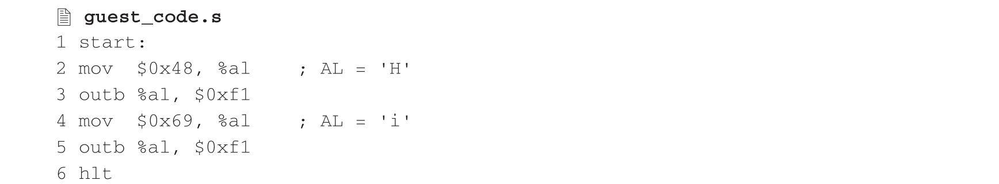
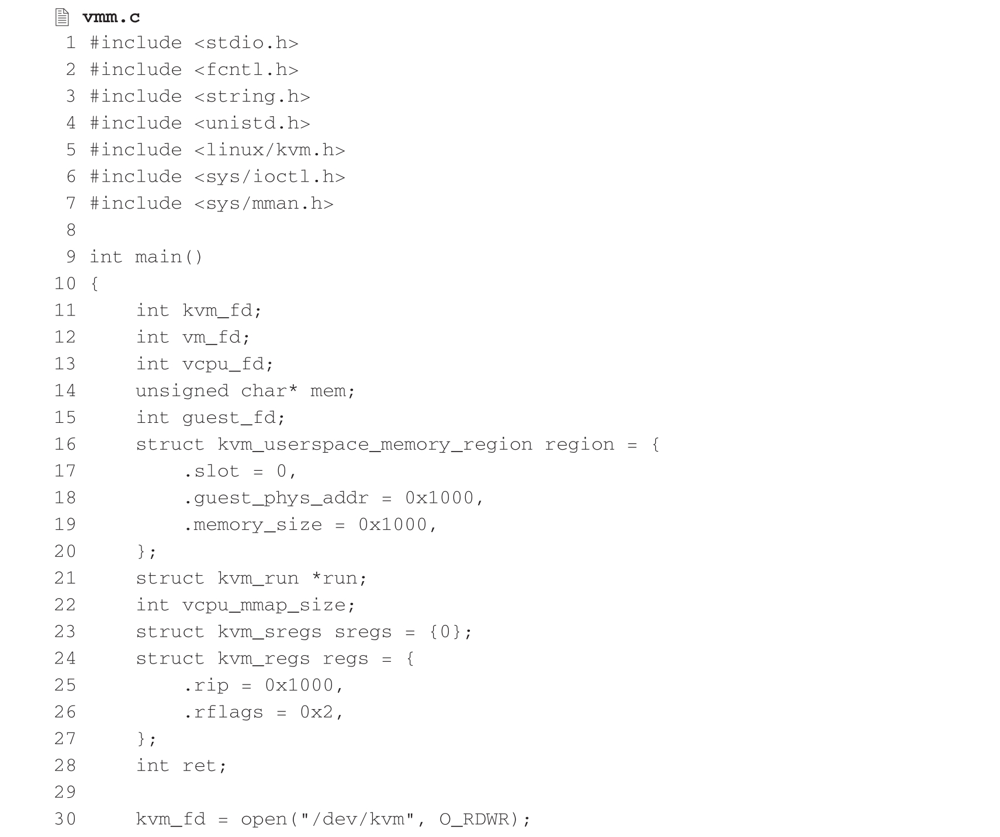
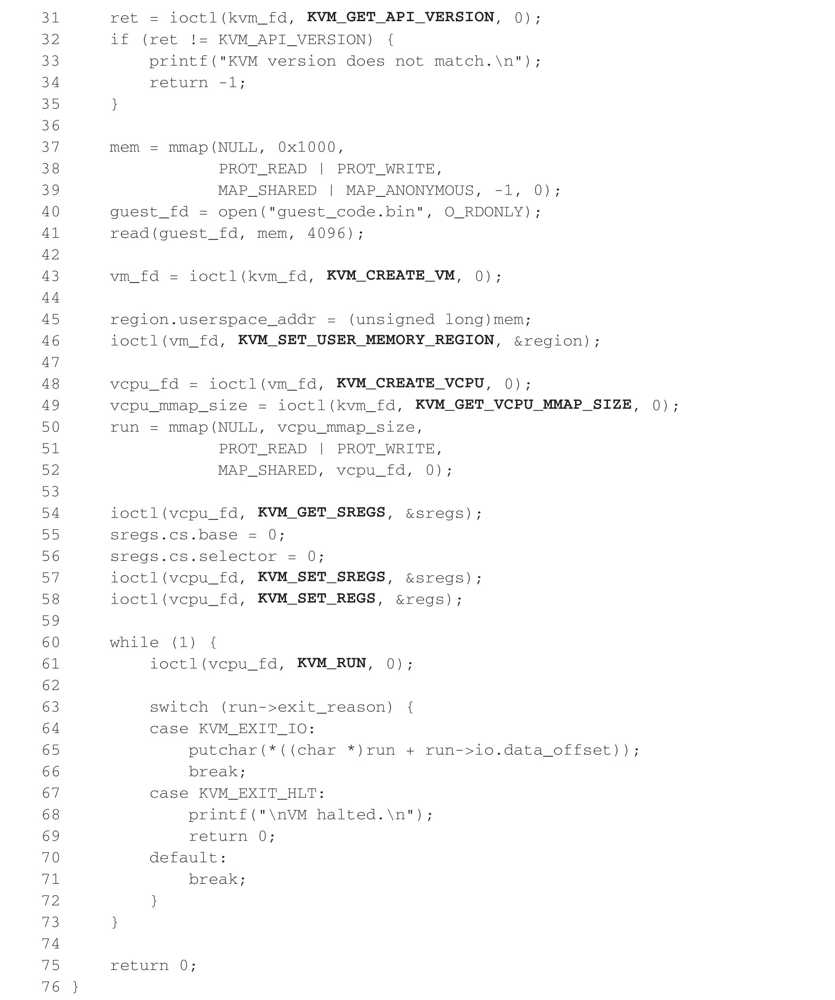
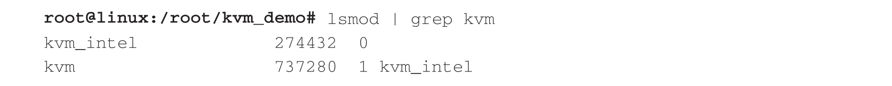
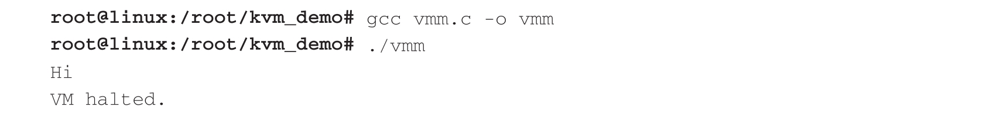

前面提到, 目前最典型的用户态 VMM 就是 QEMU, 这是因为其原本就有着丰富的设备模拟代码实现. KVM 在诞生之初即复用了这些代码, 并通过增加 KVM API 的调用使其能够与 KVM 进行交互. 但是 KVM 作为虚拟化的核心模块并不依赖于 QEMU. 这里给出一个示例来实现一个极简版的用户态 VMM, 使读者对 KVM API 有一个较为直观的认识. 在该示例中, 我们首先提供一段精简的代码在虚拟机中运行:

这段代码所做的事情非常简单, 即向端口 0xf1 两次写入字符, 然后执行 hlt 指令. 通过以下命令将其编译成二进制文件:

用户态 VMM 可以通过 KVM API 创建一台虚拟机, 并加载 guest_code.bin 作为一个极简的内核, 仅运行于虚拟机的实模式 (Real Mode) 下. 简化版的用户态 VMM 实现如下.

在运行以上代码之前, 首先执行下面的一条命令, 该命令的结果需要显示出此时 kvm.ko 和 kvm_intel.ko 已被加载:

然后编译 vmm.c, 运行结果如下:

那么, 这个 vmm.c 文件都做了哪些事情呢? 下面来看一下.

1) 首先, KVM 暴露给用户态 VMM 一个字符设备 "/dev/kvm"​.vmm.c 中第 30 行代码通过打开该设备获得一个文件描述符 kvm_fd. 对 kvm_fd 的 IOCTL 操作即是系统全局接口调用. 第 31～35 行通过 KVM_GET_API_VERSION 来检查 KVM API 的版本信息(该版本号固定为 12)​.

2) 确认 KVM API 版本信息无误后, vmm.c 的第 37～41 行代码创建了一个大小为 4KB 的进程地址空间, 然后打开 guest_code.bin 文件, 并将其内容加载到该 4KB 页面中. 在 3.2.1 节中, 我们提到虚拟机的内存同时也是用户态 VMM 进程的内存, 即客户机物理地址 (GPA) 空间同时也是用户态 VMM 的进程地址空间, 即宿主机虚拟地址 (Host Virtual Address,HVA) 空间. 这一点将在 KVM 内存虚拟化的章节中详细展开说明.

3) 有了 kvm_fd, 第 43 行通过 KVM_CREATE_VM 来创建虚拟机. 该接口也是 KVM 系统全局接口, 其返回值是一个虚拟机的文件描述符, 即 vm_fd. 对 vm_fd 的 IOCTL 操作即是虚拟机相关接口调用.

4) 获得 vm_fd 之后, 第 45,46 行通过 KVM_SET_USER_MEMORY_REGION 来为虚拟机设置一块内存区域(Memory Region). 内存区域是 KVM 内存虚拟化中的一个重要概念, 用于描述一段 GPA 与 HVA 之间的映射关系以及相关的属性. 本例中, 我们将 GPA 首地址为 0x1000 的一个页面与 VMM 的虚拟地址 mem 关联起来.

5) 除了为虚拟机设置内存布局以外, 还有一个不可或缺的虚拟机相关接口 KVM_CREATE_VCPU. 如第 48 行所示, VMM 使用该接口为虚拟机创建 vCPU, 返回值为一个 vCPU 的文件描述符, 即 vcpu_fd. 对 vcpu_fd 的 IOCTL 操作即是 vCPU 相关接口调用. 在第 49～52 行中, 我们通过 vCPU 的接口 KVM_GET_VCPU_MMAP_SIZE 和后面的 mmap()系统调用, 为该 vCPU 分配一段 HVA, 用于保存 VMM 和 KVM 之间的共享信息, 在后面处理 VM Exit 时使用, 从该共享内存 run 中识别 VM Exit 的原因, 对应的地址等.

6) 第 54～58 行通过 KVM_GET_SREGS,KVM_SET_SREGS 和 KVM_SET_REGS 这几个 vCPU 相关接口, 来设置 vCPU 的 CS 段寄存器以及 RIP 寄存器, 也就是客户机下的 CPU 寄存器, 从而保证 vCPU 的第一条指令地址为 0x1000, 且其模式为实模式.

7) 设置好 vCPU 的初始状态后, 就可以通过 KVM_RUN 来运行了, 如第 61 行所示. 此时 KVM vCPU 的模块就会进入客户机中执行对应的指令. 在 vCPU 的运行过程中, 会发生多次 VM Exit, 比如发生外部中断, 执行特权指令等. 对于某些 VM Exit,KVM 还要交由用户态 VMM 来进行模拟, 比如这里的第 63～72 行. 当 vCPU 执行了对 I/O 端口的操作后, vmm 会将该端口的数据输出到终端; 当 vCPU 执行了 hlt 指令后, vmm 会输出 "VM halted." 并最终退出.

当然, 本例中的代码是极简版的, 对于 IOCTL 的返回值都未作检查, 没有对文件的关闭操作, 也没有将 vCPU 放在单独的线程中管理. 但是至少可以看出, 只要遵循 KVM API, 就可以快速地实现一个用户态 VMM. 对于没有大量模拟需求的场景, 一个轻量级的用户态 VMM 可以带来诸多便捷, 一个典型的例子便是 AWS Serverless 环境中使用的 Firecracker. 限于篇幅, 在接下来的章节中, 我们将注意力更多地集中在 KVM 内核的实现上.
