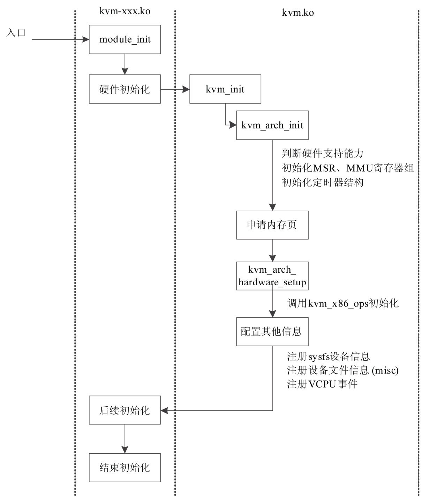
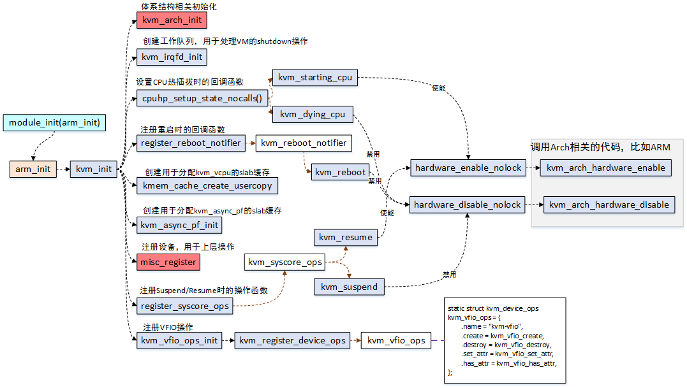
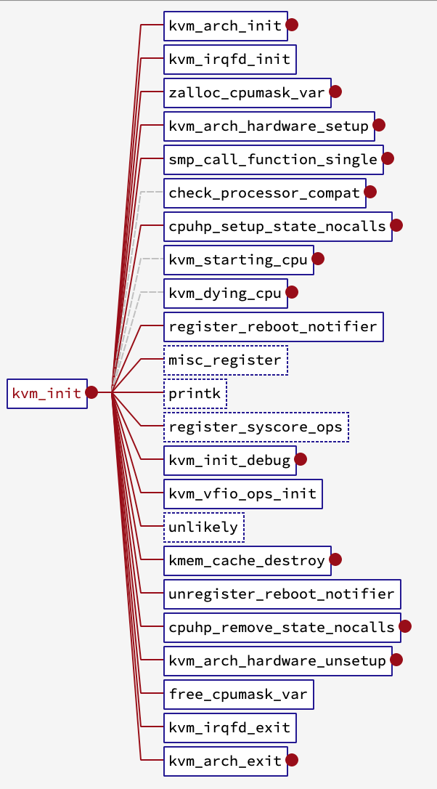

<!-- @import "[TOC]" {cmd="toc" depthFrom=1 depthTo=6 orderedList=false} -->

<!-- code_chunk_output -->

- [1. 整体介绍](#1-整体介绍)
- [3. trace 方法](#3-trace-方法)
  - [3.1. ftrace](#31-ftrace)
  - [3.2. trace -cmd (推荐)](#32-trace--cmd-推荐)
- [4. trace 数据](#4-trace-数据)
  - [4.1. intel](#41-intel)
  - [4.2. amd](#42-amd)
- [5. XXX_init: 模块初始化入口](#5-xxx_init-模块初始化入口)
  - [5.1. intel: vmx_init](#51-intel-vmx_init)
  - [5.2. amd: svm_init](#52-amd-svm_init)
- [6. kvm_init: 初始化 kvm 框架](#6-kvm_init-初始化-kvm-框架)
  - [6.1. 架构初始化: kvm_arch_init](#61-架构初始化-kvm_arch_init)
    - [6.1.1. CPU 特性支持检查](#611-cpu-特性支持检查)
    - [6.1.2. kmem_cache 分配 (x86_fpu)](#612-kmem_cache-分配-x86_fpu)
    - [6.1.3. percpu kvm_shared_msrs](#613-percpu-kvm_shared_msrs)
    - [6.1.4. mmu 模块相关处理](#614-mmu-模块相关处理)
    - [6.1.5. 设置 MMU 的 shadow PTE masks](#615-设置-mmu-的-shadow-pte-masks)
    - [6.1.6. timer 初始化](#616-timer-初始化)
  - [6.2. workqueue?](#62-workqueue)
  - [6.3. 架构相关的硬件设置](#63-架构相关的硬件设置)
    - [6.3.1. 硬件配置 hardware_setup()](#631-硬件配置-hardware_setup)
      - [6.3.1.1. intel](#6311-intel)
        - [6.3.1.1.1. 设置全局 vmcs_config 和 vmx_capability](#63111-设置全局-vmcs_config-和-vmx_capability)
        - [6.3.1.1.2. 一堆功能检查和设置](#63112-一堆功能检查和设置)
        - [6.3.1.1.3. posted 中断的 wakeup 处理函数设置](#63113-posted-中断的-wakeup-处理函数设置)
        - [6.3.1.1.4. CPU 相关功能的检查和设置](#63114-cpu-相关功能的检查和设置)
        - [6.3.1.1.5. percpu 的 VMXON region](#63115-percpu-的-vmxon-region)
      - [6.3.1.2. amd](#6312-amd)
        - [6.3.1.2.1.](#63121)
        - [6.3.1.2.2.](#63122)
    - [6.3.2. 设置全局的 kvm_x86_ops](#632-设置全局的-kvm_x86_ops)
    - [6.3.3. 更新为新的宏定义](#633-更新为新的宏定义)
    - [6.3.4. msr 保存到全局变量 msrs_to_save[] 数组](#634-msr-保存到全局变量-msrs_to_save-数组)
  - [6.4. 检查每个处理器对 vmx 的兼容性](#64-检查每个处理器对-vmx-的兼容性)
    - [6.4.1. VMX](#641-vmx)
    - [6.4.2. SVM](#642-svm)
  - [6.5. 注册 CPU 状态变化的通知函数](#65-注册-cpu-状态变化的通知函数)
  - [6.6. 注册 reboot 时候的通知函数](#66-注册-reboot-时候的通知函数)
  - [6.7. 给 kvm_vcpu 分配 cache](#67-给-kvm_vcpu-分配-cache)
  - [6.8. 赋值 file_operations 的模块名](#68-赋值-file_operations-的模块名)
  - [6.9. 注册设备文件 /dev/kvm](#69-注册设备文件-devkvm)
  - [6.10. 系统 suspend/resume 动作注册](#610-系统-suspendresume-动作注册)
  - [6.11. debugfs 初始化](#611-debugfs-初始化)
  - [6.12. vfio 操作初始化](#612-vfio-操作初始化)
- [7. 参考](#7-参考)

<!-- /code_chunk_output -->

# 1. 整体介绍

内核的功能模块, 基本上的套路就是:

1) 完成模块初始化, 向系统注册;

2) 响应各类请求, 这种请求可能来自用户态, 也可能来自异常响应等;

Linux 的**子模块入口**通常通过 `module_init` 宏进行定义, 由**内核进行调用**.

KVM 模块分为两类模块:

* 通用功能模块: `kvm.ko`

* 架构模块: `kvm-intel.ko`或`kvm-amd.ko`

以 intel 平台为例, KVM 的初始化流程如下图所示.





KVM 的初始化步骤分为以下三步:

1. 在**平台相关的 KVM_XXX 模块**中通过`module_init`宏正式进入 KVM 的初始化阶段, 并且执行相关的**硬件初始化准备**.

* (`arch/x86/kvm/vmx/vmx.c`, `arch/x86/kvm/svm/svm.c`, `arch/arm64/kvm/arm.c`)

2. 进入`kvm_main.c`中的 **kvm\_init** 函数进行正式的初始化工作, 期间进行了一系列子操作.

* (`virt/kvm/kvm_main.c`)

3. 进行后续的硬件初始化准备操作.

而核心逻辑在`kvm_init`中完成, 既包含了体系结构相关的初始化设置, 也包含了各类回调函数的设置, 资源分配, 以及设备注册等, 只有当初始化完成后, 才能响应各类请求, 比如创建虚拟机等

1. 回调函数设置:

* `cpuhp_setup_state_nocall` 与 CPU 的热插拔相关,
* `register_reboot_notifer` 与系统的重启相关,
* `register_syscore_ops` 与系统的休眠唤醒 suspend/resume 相关,

而这几个模块的回调函数, 最终都会去调用体系结构相关的函数去打开或关闭 Hypervisor;

2. `资源分配: kmem_cache_create_usercopy` 与 `kvm_async_pf_init` 都是创建 slab 缓存, 用于内核对象的分配;

3. `kvm_vfio_ops_init`: VFIO 是一个可以安全将**设备 I/O**、**中断**、**DMA**导出到**用户空间**的框架, 后续在将 IO 虚拟化时再深入分析;

```cpp
vmx_init()/svm_init()         // 初始化入口
 ├─ kvm_init(KVM_GET_API_VERSION)        // 初始化 KVM 框架
 |   ├─ kvm_arch_init()                  // 架构相关初始化
 |   |   ├─ if (kvm_x86_ops.hardware_enable)    // 已经开启
 |   |   ├─ !ops->cpu_has_kvm_support()         // CPU 是否支持 vmx/svm 架构
 |   |   ├─ ops->disabled_by_bios()        // bios 是否禁用 vt
 |   |   ├─ boot_cpu_has()                // CPU 是否支持一些特性
 |   |   ├─ kmem_cache_create("x86_fpu")  // x86_fpu kmem_cache
 |   |   ├─ kmem_alloc_emulator_cache()  // x86_emulator kmem_cache
 |   |   ├─ alloc_percpu()                // user_return_msrs
 |   |   ├─ kvm_mmu_module_init()         // mmu 模块初始化
 |   |   |   ├─ kvm_mmu_set_mmio_spte_mask()         //
 |   |   |   ├─ kmem_cache_create("pte_list_desc")         // pte_list_desc kmem_cache
 |   |   |   ├─ kmem_cache_create("kvm_mmu_page_header")   // kvm_mmu_page_header kmem_cache
 |   |   |   ├─ percpu_counter_init()            //
 |   |   |   └─ register_shrinker($mmu_shrinker) // 给每个 cpu 分配一个 struct vmcs
 |   |   ├─ kvm_mmu_set_mask_ptes()       // shadow pte mask 设置
 |   |   ├─ kvm_timer_init()              // 时钟初始化
 |   ├─ kvm_irqfd_init()                  // 创建工作队列, 用于处理 vm 的 shutdown 操作
 |   ├─ kvm_arch_hardware_setup()         // 硬件相关的构建
 |   |   ├─ ops->hardware_setup() // 具体的硬件体系结构的初始化
 |   |   ├─ memcpy(&kvm_x86_ops, ops->runtime_ops, sizeof(kvm_x86_ops));  // 初始化全局的静态变量, 用于运行时的相关架构操作
 |   |   ├─ kvm_ops_static_call_update(); // 更新为新的宏定义
 |   |   └─ kvm_init_msr_list()           // 将 msr 保存到全局变量 msrs_to_save[]数组
 |   ├─ smp_call_function_single(cpu, check_processor_compat, &c, 1)       // 对每个 online cpu 进行兼容性检查
 |   |   ├─ check_processor_compat()
 |   |   |   ├─ kvm_arch_check_processor_compat()	// 处理器兼容性检查, 架构相关
 |   ├─ cpuhp_setup_state_nocalls(CPUHP_AP_KVM_STARTING, "kvm/cpu:starting",kvm_starting_cpu, kvm_dying_cpu);      // 注册 host 上物理 cpu 状态变化(热插拔)的回调函数
 |   ├─ register_reboot_notifier()       // 注册 host 系统 reboot 时候的回调函数
 |   ├─ kvm_cache_create_usercopy()      // 创建 vcpu 的 kmem cache, 对象大小是 sizeof(struct vcpu_vmx)
 |   ├─ kvm_async_pf_init()              // 异步
 |   ├─ misc_register(&kvm_dev)          // 注册字符设备文件/dev/kvm
 |   ├─ register_syscore_ops(&kvm_syscore_ops) // 注册系统核心函数, 这里是 host 上操作系统发生 suspend 和 resume 时候的回调
 |   ├─ kvm_init_debug()                 // 初始化 debugfs
 |   └─ kvm_vfio_ops_init()              // vfio 的操作初始化
```

# 3. trace 方法

## 3.1. ftrace

1. kvm 准备

```
rmmod kvm_intel; rmmod kvm
modprobe kvm
```

2. ftrace 准备

```
cd /sys/kernel/debug/tracing
echo nop > current_tracer
echo 0 > tracing_on
echo kvm_init > set_graph_function
echo function_graph > current_tracer
echo 1 > tracing_on
```

3. 加载 kvm_intel 或 kvm_amd 模块

```
modprobe kvm_intel
```

4. 关闭 ftrace 并查看

```
cd /sys/kernel/debug/tracing
echo 0 > tracing_on
```

缺点: 有时候显示不全

## 3.2. trace -cmd (推荐)

```
rmmod kvm_intel; rmmod kvm
modprobe kvm
/usr/local/bin/trace-cmd record -p function_graph -g kvm_init modprobe kvm_intel
/usr/local/bin/trace-cmd report > trace_cmd_intel.trace
```

缺点: 不显示属于哪个模块

注: trace-cmd 也是受 tracing 目录下配置影响的, 所以使用之前确保清除本身所有配置项

然后最好用脚本过滤下, 比如过滤只得到以"modprobe-14924"开头的

# 4. trace 数据

## 4.1. intel

ftrace: ftrace_intel.trace

trace_cmd: trace_cmd_intel.trace.modprobe-1492

## 4.2. amd

ftrace:

trace_cmd: trace_cmd_amd.trace.modprobe-10259


# 5. XXX_init: 模块初始化入口

(`arch/x86/kvm/vmx/vmx.c`, `arch/x86/kvm/svm/svm.c`)

## 5.1. intel: vmx_init

```cpp
static int __init vmx_init(void)
{
        int r, cpu;

#if IS_ENABLED(CONFIG_HYPERV)
	// 忽略 hyperv
#endif

        r = kvm_init(&vmx_init_ops, sizeof(struct vcpu_vmx),
                     __alignof__(struct vcpu_vmx), THIS_MODULE);
        if (r)
                return r;

        /*
         * Must be called after kvm_init() so enable_ept is properly set
         * up. Hand the parameter mitigation value in which was stored in
         * the pre module init parser. If no parameter was given, it will
         * contain 'auto' which will be turned into the default 'cond'
         * mitigation mode.
         */
        r = vmx_setup_l1d_flush(vmentry_l1d_flush_param);
        if (r) {
                vmx_exit();
                return r;
        }

        for_each_possible_cpu(cpu) {
                INIT_LIST_HEAD(&per_cpu(loaded_vmcss_on_cpu, cpu));
                INIT_LIST_HEAD(&per_cpu(blocked_vcpu_on_cpu, cpu));
                spin_lock_init(&per_cpu(blocked_vcpu_on_cpu_lock, cpu));
        }

#ifdef CONFIG_KEXEC_CORE
        rcu_assign_pointer(crash_vmclear_loaded_vmcss,
                           crash_vmclear_local_loaded_vmcss);
#endif
        vmx_check_vmcs12_offsets();

        /*
         * Intel processors don't have problems with
         * GUEST_MAXPHYADDR < HOST_MAXPHYADDR so enable
         * it for VMX by default
         */
        allow_smaller_maxphyaddr = true;

        return 0;
}
module_init(vmx_init);
```

vmx.c 定义了**vmx 的架构下的操作函数**`vmx_init_ops`, 其他架构也有自己的定义

`vmx_init()`将自己的`vmx_init_ops`作为参数传了进去

## 5.2. amd: svm_init

```cpp
// arch/x86/kvm/svm/svm.c
static int __init svm_init(void)
{
        return kvm_init(&svm_init_ops, sizeof(struct vcpu_svm),
                        __alignof__(struct vcpu_svm), THIS_MODULE);
}
```

可以看到只是调用了`kvm_init`而已

# 6. kvm_init: 初始化 kvm 框架



正式进行 KVM 框架初始化

对于 intel 平台, 调用是:

```cpp
r = kvm_init(&vmx_init_ops, sizeof(struct vcpu_vmx),
             __alignof__(struct vcpu_vmx), THIS_MODULE);
```

对于 amd 平台, 调用是:

```cpp
return kvm_init(&svm_init_ops, sizeof(struct vcpu_svm),
                __alignof__(struct vcpu_svm), THIS_MODULE);
```

## 6.1. 架构初始化: kvm_arch_init

主要是架构相关的检查和初始化

通过`kvm_arch_init`函数初始化 KVM 内部的一些数据结构: **注册全局变量 kvm\_x86\_ops**、**初始化 MMU**等数据结构、**初始化 Timer 定时器**架构. (`arch/x86/kvm/x86.c`)

使用传入的`opaque`参数, 注意这是`void *`类型的

```cpp
r = kvm_arch_init(opaque);
```

对于 intel 而言, 是 `vmx_init_ops`

```cpp
static struct kvm_x86_init_ops vmx_init_ops __initdata = {
        .cpu_has_kvm_support = cpu_has_kvm_support,
        .disabled_by_bios = vmx_disabled_by_bios,
        .check_processor_compatibility = vmx_check_processor_compat,
        .hardware_setup = hardware_setup,
        .runtime_ops = &vmx_x86_ops,
};
```

对于 amd 而言, 是 `svm_init_ops`

```cpp
static struct kvm_x86_init_ops svm_init_ops __initdata = {
        .cpu_has_kvm_support = has_svm,
        .disabled_by_bios = is_disabled,
        .hardware_setup = svm_hardware_setup,
        .check_processor_compatibility = svm_check_processor_compat,
        .runtime_ops = &svm_x86_ops,
};
```

### 6.1.1. CPU 特性支持检查

```cpp
// CPUID.1:ECX.VMX[bit 5] -> VT 必须支持
ops->cpu_has_kvm_support();
// bios 必须支持
ops->disable_by_bios();
// FPU 和 FXSR 必须支持
!boot_cpu_has(x86_FEATURE_FPU) || !boot_cpu_has(X86_FEATURE_FXSR);
```

### 6.1.2. kmem_cache 分配 (x86_fpu)

```cpp
// arch/x86/kvm/x86.c
struct kmem_cache *x86_fpu_cache;
EXPORT_SYMBOL_GPL(x86_fpu_cache);

x86_fpu_cache = kmem_cache_create("x86_fpu", ...)
```

### 6.1.3. percpu kvm_shared_msrs

```cpp
static struct kvm_shared_msrs __percpu *shared_msrs;
shared_msrs = alloc_percpu(struct kvm_shared_msrs);
```

### 6.1.4. mmu 模块相关处理

```cpp
// arch/x86/kvm/x86.c
kvm_mmu_module_init();

// arch/x86/kvm/mmu.c
static struct kmem_cache *pte_list_desc_cache;
static struct kmem_cache *mmu_page_header_cache;
static struct percpu_counter kvm_total_used_mmu_pages;

int kvm_mmu_module_init(void)
{
	kvm_mmu_reset_all_pte_masks();
	// cache 初始化
	pte_list_desc_cache = kmem_cache_create("pte_list_desc", ...)
	// cache 初始化
	mmu_page_header_cache = kmem_cache_create("kvm_mmu_page_header", ...)
	// percpu 的 mmu pages 使用计数
	percpu_counter_init(&kvm_total_used_mmu_pages, 0, GFP_KERNEL);
	// 预分配
	register_shrinker(&mmu_shrinker);
}
```

### 6.1.5. 设置 MMU 的 shadow PTE masks

```cpp
// 设置 MMU 的 shadow PTE masks
kvm_mmu_set_mask_ptes(PT_USER_MASK, PT_ACCESSED_MASK,
                PT_DIRTY_MASK, PT64_NX_MASK, 0,
                PT_PRESENT_MASK, 0, sme_me_mask);
```

### 6.1.6. timer 初始化

```cpp
kvm_timer_init();
```

## 6.2. workqueue?

```cpp
kvm_irqfd_init();
```

## 6.3. 架构相关的硬件设置

```cpp
kvm_arch_hardware_setup(opaque);
```

### 6.3.1. 硬件配置 hardware_setup()

```cpp
ops->hardware_setup();
```

#### 6.3.1.1. intel

```cpp
hardware_setup() // arch/x86/kvm/vmx/vmx.c
├─ store_idt()                // 保存 idt
├─ setup_vmcs_config(&vmcs_config, &vmx_capability)        // 建立全局变量 vmcs_config 和 vmx_capability
├─ boot_cpu_has()             // CPU 特性支持
├─ cpu_has_vmx_vpid()         // cpu 是否支持 vpid
├─ cpu_has_vmx_invvpid()      // cpu 是否支持 invvpid
├─ cpu_has_vmx_ept()          // cpu 是否支持 ept
├─ kvm_configure_mmu()        // mmu 相关硬件判断和全局变量
├─ cpu_has_vmx_XXX()          // cpu 是否有 XXX
├─ vmx_enable_tdp()           // ept 支持时开启 tdp
├─ kvm_disable_tdp()          // 关闭 tdp
├─ kvm_set_posted_intr_wakeup_handler()     // posted intr wakeup handler
└─ alloc_kvm_area()           // 给每个 cpu 分配一个 struct vmcs
```

##### 6.3.1.1.1. 设置全局 vmcs_config 和 vmx_capability

```cpp
// arch/x86/kvm/vmx/vmx.c
struct vmcs_config vmcs_config;
struct vmx_capability vmx_capability;

if (setup_vmcs_config(&vmcs_config, &vmx_capability) < 0)
    return -EIO;
```

这里的这两个全局变量不是指针, 而是真正值, 所以就直接分配了内存

##### 6.3.1.1.2. 一堆功能检查和设置

```cpp

```

##### 6.3.1.1.3. posted 中断的 wakeup 处理函数设置

```cpp
kvm_set_posted_intr_wakeup_handler(wakeup_handler);
```

##### 6.3.1.1.4. CPU 相关功能的检查和设置

```cpp
vmx_set_cpu_caps();
```

设置 cpu 相关功能

##### 6.3.1.1.5. percpu 的 VMXON region

```cpp
alloc_kvm_area();
```

给每个 cpu 分配 struct vmcs, 用于 VMXON region

```cpp
struct vmcs_hdr {
        u32 revision_id:31;
        u32 shadow_vmcs:1;
};

struct vmcs {
        struct vmcs_hdr hdr;
        u32 abort;
        char data[0];
};

DECLARE_PER_CPU(struct vmcs *, current_vmcs);
```

#### 6.3.1.2. amd

```cpp
svm_hardware_setup()          // arch/x86/kvm/svm/svm.c
 ├─ iopm_pages = alloc_pages(GFP_KERNEL, IOPM_ALLOC_ORDER);             // 保存 idt
 ├─ init_msrpm_offsets();      //
 ├─ boot_cpu_has()             // CPU 特性支持
 ├─ svm_adjust_mmio_mask();    // CPU 特性支持
 ├─ svm_cpu_init(cpu);         // 对于所有的物理 cpu, 进行 svm 相关初始化
 ├─ kvm_configure_mmu(npt_enabled, get_max_npt_level(), PG_LEVEL_1G);         // mmu 配置
 ├─ svm_set_cpu_caps();        // cpu 功能设置
```

##### 6.3.1.2.1.


##### 6.3.1.2.2.


### 6.3.2. 设置全局的 kvm_x86_ops

`struct kvm_x86_ops` 是 x86 的架构相关函数

```cpp
// arch/x86/include/asm/kvm_host.h
struct kvm_x86_ops {
		int (*cpu_has_kvm_support)(void);	/* __init */
		int (*disabled_by_bios)(void);		/* __init */
		......

}

// arch/x86/kvm/x86.c
struct kvm_x86_ops *kvm_x86_ops __read_mostly;
EXPORT_SYMBOL_GPL(kvm_x86_ops);
```

在 `arch/x86/kvm/x86.c` 中, 定义了名为 `kvm_x86_ops` 的**静态变量**, 这是运行时的相关架构操作. 通过 **export_symbol 宏**在 **全局范围！！！** 内导出, 从而可被其它模块使用.

初始化全局 `kvm_x86_ops` 静态变量

```cpp
struct kvm_x86_init_ops *ops = opaque;

memcpy(&kvm_x86_ops, ops->runtime_ops, sizeof(kvm_x86_ops));
```

对于 intel 而言, `opaque` 是 `vmx_init_ops`

```cpp
static struct kvm_x86_init_ops vmx_init_ops __initdata = {
        .runtime_ops = &vmx_x86_ops,
};

static struct kvm_x86_ops vmx_x86_ops __initdata = {
        .hardware_unsetup = hardware_unsetup,
        .hardware_enable = hardware_enable,
        ......
```

对于 amd 而言, `opaque` 是 `svm_init_ops`

```cpp
static struct kvm_x86_init_ops svm_init_ops __initdata = {
        .runtime_ops = &svm_x86_ops,
};

static struct kvm_x86_ops svm_x86_ops __initdata = {
        .hardware_unsetup = svm_hardware_teardown,
        .hardware_enable = svm_hardware_enable,
        ......
};
```

所以, 最终全局 `kvm_x86_ops` 静态变量, 是

* 对 intel 而言, 是 `vmx_x86_ops`

* 对 amd 而言, 是 `svm_x86_ops`

### 6.3.3. 更新为新的宏定义

```cpp
kvm_ops_static_call_update();
```

```cpp
static inline void kvm_ops_static_call_update(void)
{
#define KVM_X86_OP(func) \
    static_call_update(kvm_x86_##func, kvm_x86_ops.func);
#define KVM_X86_OP_NULL KVM_X86_OP
#include <asm/kvm-x86-ops.h>
}
```

### 6.3.4. msr 保存到全局变量 msrs_to_save[] 数组

```cpp
kvm_init_msr_list();
```

通过`rdmr_safe()`把 msr 保存到**全局**变量`msrs_to_save[]`数组.

```cpp
// arch/x86/kvm/x86.c
// 基础功能 msr, 可以被 hypervisor 用来验证请求的 cpu 特性
static const u32 msr_based_features_all[] = {
        // Intel VT MSRs
        // 480H
        MSR_IA32_VMX_BASIC,
        // 48DH
        MSR_IA32_VMX_TRUE_PINBASED_CTLS,
        // 481H
        MSR_IA32_VMX_PINBASED_CTLS,
        // 48EH
        MSR_IA32_VMX_TRUE_PROCBASED_CTLS,
        // 482H
        MSR_IA32_VMX_PROCBASED_CTLS,
        // 48FH
        MSR_IA32_VMX_TRUE_EXIT_CTLS,
        // 483H
        MSR_IA32_VMX_EXIT_CTLS,
        // 490H
        MSR_IA32_VMX_TRUE_ENTRY_CTLS,
        // 484H
        MSR_IA32_VMX_ENTRY_CTLS,
        // 485H
        MSR_IA32_VMX_MISC,
        // 486H
        MSR_IA32_VMX_CR0_FIXED0,
        // 487H
        MSR_IA32_VMX_CR0_FIXED1,
        // 488H
        MSR_IA32_VMX_CR4_FIXED0,
        // 489H
        MSR_IA32_VMX_CR4_FIXED1,
        // 48AH
        MSR_IA32_VMX_VMCS_ENUM,
        // 482H
        MSR_IA32_VMX_PROCBASED_CTLS2,
        // 48CH
        MSR_IA32_VMX_EPT_VPID_CAP,
        // 491H
        MSR_IA32_VMX_VMFUNC,
        // 上面的全是 Intel VT MSRs

        // c0011029H
        MSR_F10H_DECFG,
        // 8BH
        MSR_IA32_UCODE_REV,
        // 10AH
        MSR_IA32_ARCH_CAPABILITIES,
        // 345H
        MSR_IA32_PERF_CAPABILITIES,
};
// 基础功能 msr 数组
static u32 msr_based_features[ARRAY_SIZE(msr_based_features_all)];
// 基础功能 msr 的支持计数
static unsigned int num_msr_based_features;

static void kvm_init_msr_list(void)
{
        for (i = 0; i < ARRAY_SIZE(msrs_to_save_all); i++) {
                ......
        }
        for (i = 0; i < ARRAY_SIZE(emulated_msrs_all); i++) {
                ......
        }
        for (i = 0; i < ARRAY_SIZE(msr_based_features_all); i++) {
                struct kvm_msr_entry msr;

                msr.index = msr_based_features_all[i];
                // 判断这个 MSR 是否支持
                if (kvm_get_msr_feature(&msr))
                        continue;
                // 初始化支持的基础功能 msr 数组
                msr_based_features[num_msr_based_features++] = msr_based_features_all[i];
        }
}

static int kvm_get_msr_feature(struct kvm_msr_entry *msr)
{
        switch (msr->index) {
        case MSR_IA32_ARCH_CAPABILITIES:
                msr->data = kvm_get_arch_capabilities();
                break;
        case MSR_IA32_UCODE_REV:
                rdmsrl_safe(msr->index, &msr->data);
                break;
        default:
                return static_call(kvm_x86_get_msr_feature)(msr);
        }
        return 0;
}

static int vmx_get_msr_feature(struct kvm_msr_entry *msr)
{
        switch (msr->index) {
        // Intel VT MSRs
        case MSR_IA32_VMX_BASIC ... MSR_IA32_VMX_VMFUNC:
                // 非嵌套场景, 均返回 1, 即支持
                if (!nested)
                        return 1;
                return vmx_get_vmx_msr(&vmcs_config.nested, msr->index, &msr->data);
        case MSR_IA32_PERF_CAPABILITIES:
                msr->data = vmx_get_perf_capabilities();
                return 0;
        default:
                return KVM_MSR_RET_INVALID;
        }
}
```

而用户态打开 `/dev/kvm` 文件并且获得文件描述符 fd 后, 通过 `kvm_dev_ioctl` 指令写入 `KVM_GET_MSR_FEATURE_INDEX_LIST ioctl` 获取支持的

```cpp
long kvm_arch_dev_ioctl(struct file *filp,
                        unsigned int ioctl, unsigned long arg)
{
        switch (ioctl) {
        ......
        case KVM_GET_MSR_FEATURE_INDEX_LIST: {
            struct kvm_msr_list __user *user_msr_list = argp;
            struct kvm_msr_list msr_list;
            unsigned int n;

            r = -EFAULT;
            if (copy_from_user(&msr_list, user_msr_list, sizeof(msr_list)))
                    goto out;
            n = msr_list.nmsrs;
            msr_list.nmsrs = num_msr_based_features;
            if (copy_to_user(user_msr_list, &msr_list, sizeof(msr_list)))
                    goto out;
            r = -E2BIG;
            if (n < msr_list.nmsrs)
                    goto out;
            r = -EFAULT;
            if (copy_to_user(user_msr_list->indices, &msr_based_features,
                                num_msr_based_features * sizeof(u32)))
                    goto out;
            r = 0;
            break;
        }
        ......
out:
        return r;
}
```

## 6.4. 检查每个处理器对 vmx 的兼容性

```cpp
int kvm_init(void *opaque, unsigned vcpu_size, unsigned vcpu_align,
                  struct module *module)
{
		......
        c.ret = &r;
        c.opaque = opaque;
		for_each_online_cpu(cpu) {
				smp_call_function_single(cpu, check_processor_compat, &r, 1);
		}
		......
}

static void check_processor_compat(void *data)
{
        struct kvm_cpu_compat_check *c = data;

        *c->ret = kvm_arch_check_processor_compat(c->opaque);
}

int kvm_arch_check_processor_compat(void *opaque)
{
		// per-cpu 的 cpu_info_x86 信息
        struct cpuinfo_x86 *c = &cpu_data(smp_processor_id());
        struct kvm_x86_init_ops *ops = opaque;

        WARN_ON(!irqs_disabled());

        if (__cr4_reserved_bits(cpu_has, c) !=
            __cr4_reserved_bits(cpu_has, &boot_cpu_data))
                return -EIO;

        return ops->check_processor_compatibility();
}
```

对每一个 online 的 cpu 调用`smp_call_function_single`, 这个函数是让第一个参数(cpu)运行第二个参数(`check_processor_compat`), 最终调用`kvm_x86_ops`的`check_processor_compatibility`

在前面的`kvm_arch_init`中已经初始化了`kvm_x86_ops`, 最终调用到架构相关的`check_processor_compatibility()`函数

### 6.4.1. VMX

```cpp
vmx_check_processor_compat()     // 兼容性检查入口
 ├─ setup_vmcs_config(&vmcs_conf, &vmx_cap)        //
 ├─ nested_vmx_setup_ctls_msrs(&vmcs_conf.nested, vmx_cap.ept)        // 如果嵌套
```

```cpp
// arch/x86/kvm/vmx/vmx.c
static int __init vmx_check_processor_compat(void)
{
        struct vmcs_config vmcs_conf;
        struct vmx_capability vmx_cap;

        if (!this_cpu_has(X86_FEATURE_MSR_IA32_FEAT_CTL) ||
            !this_cpu_has(X86_FEATURE_VMX)) {
                pr_err("kvm: VMX is disabled on CPU %d\n", smp_processor_id());
                return -EIO;
        }

        if (setup_vmcs_config(&vmcs_conf, &vmx_cap) < 0)
                return -EIO;
        if (nested)
                nested_vmx_setup_ctls_msrs(&vmcs_conf.nested, vmx_cap.ept);
        if (memcmp(&vmcs_config, &vmcs_conf, sizeof(struct vmcs_config)) != 0) {
                printk(KERN_ERR "kvm: CPU %d feature inconsistency!\n",
                                smp_processor_id());
                return -EIO;
        }
        return 0;
}
```

### 6.4.2. SVM


## 6.5. 注册 CPU 状态变化的通知函数

> host 上物理 CPU 热插拔

```cpp
r = cpuhp_setup_state_nocalls(CPUHP_AP_KVM_STARTING, "kvm/cpu:starting",
                    kvm_starting_cpu, kvm_dying_cpu);
```

当**host 上物理 cpu 状态**变成 `starting` 会调用回调函数 `kvm_starting_cpu` 和 `kvm_dying_cpu`, 这里面会**使能**或**禁止 cpu 虚拟化特性**

> 设置了 CPU 热插拔时候的回调函数, `kvm_starting_cpu`, `kvm_dying_cpu`

```cpp
* hardware_enable
    * hardware_enable_nolock()
        * kvm_arch_hardware_enable() // 使能虚拟化特性
* hardware_disable
```

```cpp
static int kvm_usage_count;

static int kvm_starting_cpu(unsigned int cpu)
{
	raw_spin_lock(&kvm_count_lock);
	if (kvm_usage_count)
		hardware_enable_nolock(NULL);
	raw_spin_unlock(&kvm_count_lock);
	return 0;
}

static void hardware_enable_nolock(void *junk)
{
	int cpu = raw_smp_processor_id();
	int r;

	if (cpumask_test_cpu(cpu, cpus_hardware_enabled))
		return;

	cpumask_set_cpu(cpu, cpus_hardware_enabled);

	r = kvm_arch_hardware_enable();

	if (r) {
		cpumask_clear_cpu(cpu, cpus_hardware_enabled);
		atomic_inc(&hardware_enable_failed);
		pr_info("kvm: enabling virtualization on CPU%d failed\n", cpu);
	}
}

static int kvm_dying_cpu(unsigned int cpu)
{
	raw_spin_lock(&kvm_count_lock);
	if (kvm_usage_count)
		hardware_disable_nolock(NULL);
	raw_spin_unlock(&kvm_count_lock);
	return 0;
}

static void hardware_disable_nolock(void *junk)
{
	int cpu = raw_smp_processor_id();

	if (!cpumask_test_cpu(cpu, cpus_hardware_enabled))
		return;
	cpumask_clear_cpu(cpu, cpus_hardware_enabled);
	kvm_arch_hardware_disable();
}
```

## 6.6. 注册 reboot 时候的通知函数

原理同上, **host 操作系统**发生重启的时候会调用这个函数

```cpp
register_reboot_notifier(&kvm_reboot_notifier);
```

## 6.7. 给 kvm_vcpu 分配 cache

根据注释, 主要为了满足`fx_save`的对齐要求

```cpp
/* A kmem cache lets us meet the alignment requirements of fx_save. */
if (!vcpu_align)
    vcpu_align = __alignof__(struct kvm_vcpu);
kvm_vcpu_cache =
    kmem_cache_create_usercopy("kvm_vcpu", vcpu_size, vcpu_align,
                    SLAB_ACCOUNT,
                    offsetof(struct kvm_vcpu, arch),
                    sizeof_field(struct kvm_vcpu, arch),
                    NULL);
```

后面会给创建 vcpu 时候使用, 该 cache 的 arch 部分可被拷贝到用户态使用. 这里的`vcpu_size`是`sizeof(struct vcpu_vmx)`

## 6.8. 赋值 file_operations 的模块名

把早先传给`kvm_init()`的参数 THIS_MODULE, 也就是**vmx 的模块名**分别赋值给三个 file operation 结构体变量:

```cpp
kvm_chardev_ops.owner = module;
kvm_vm_fops.owner = module;
kvm_vcpu_fops.owner = module;
```

这三个变量都是`file_operation`结构体被**部分初始化**的**全局变量**, 分别用于处理**对不同介质的设备读写**(一切皆是文件).

被部分初始化的**函数入口地址**分别指向`kvm_dev_ioctl`, `kvm_vm_release`,`noop_llseek`等函数(`kvm_main.c`)

```cpp
// virt/kvm/kvm_main.c
static struct file_operations kvm_vcpu_fops = {
	.release        = kvm_vcpu_release,
	.unlocked_ioctl = kvm_vcpu_ioctl,
#ifdef CONFIG_COMPAT
	.compat_ioctl   = kvm_vcpu_compat_ioctl,
#endif
	.mmap           = kvm_vcpu_mmap,
	.llseek		= noop_llseek,
};

static struct file_operations kvm_vm_fops = {
	.release        = kvm_vm_release,
	.unlocked_ioctl = kvm_vm_ioctl,
#ifdef CONFIG_COMPAT
	.compat_ioctl   = kvm_vm_compat_ioctl,
#endif
	.llseek		= noop_llseek,
};

static struct file_operations kvm_chardev_ops = {
	.unlocked_ioctl = kvm_dev_ioctl,
	.compat_ioctl   = kvm_dev_ioctl,
	.llseek		= noop_llseek,
};
```

## 6.9. 注册设备文件 /dev/kvm

```cpp
misc_register(&kvm_dev);
```

`misc_register`函数是 linux 内核的一个通用接口, 主要作用是为了**注册设备文件**, kvm 模块借用该接口创建了`/dev/kvm`设备文件, 具体查看参看的文章(`KVM 实战: 原理、进阶与性能调优`的)

下面是设备文件的结构体

```cpp
// virt/kvm/kvm_main.c
static struct file_operations kvm_chardev_ops = {
    .unlocked_ioctl = kvm_dev_ioctl,
    .llseek         = noop_llseek,
    KVM_COMPAT(kvm_dev_ioctl),
};
static struct miscdevice kvm_dev = {
    KVM_MINOR,
    "kvm",
    &kvm_chardev_ops,
};
```

## 6.10. 系统 suspend/resume 动作注册

> host 操作系统的休眠唤醒

```cpp
register_syscore_ops(&kvm_syscore_ops);

kvm_preempt_ops.sched_in = kvm_sched_in;
kvm_preempt_ops.sched_out = kvm_sched_out;
```

从命名看, `kvm_syscore_ops`是系统核心函数, 包含`suspend`和`resume`:

```cpp
// virt/kvm/kvm_main.c
static struct syscore_ops kvm_syscore_ops = {
	.suspend = kvm_suspend,
	.resume = kvm_resume,
};

// drivers/base/syscore.c
static LIST_HEAD(syscore_ops_list);

void register_syscore_ops(struct syscore_ops *ops)
{
	mutex_lock(&syscore_ops_lock);
	list_add_tail(&ops->node, &syscore_ops_list);
	mutex_unlock(&syscore_ops_lock);
}
EXPORT_SYMBOL_GPL(register_syscore_ops);
```

`kvm_preempt_ops`是结构体`preempt_ops`:

```cpp
static __read_mostly struct preempt_ops kvm_preempt_ops;
```

从命名看, `sched_in`和`sched_out`可以申请调度器对任务的换入换出.

## 6.11. debugfs 初始化

```cpp
kvm_init_debug();
```

kvm 模块的加载依赖 debugfs,所以在加载之前要手动挂载.

这个函数建立了 debugfs 目录下的 kvm 目录,然后建立了一系列复杂的 tracepoint

```cpp
// virt/kvm/kvm_main.c
static int kvm_init_debug(void)
{
	int r = -EEXIST;
	struct kvm_stats_debugfs_item *p;

	kvm_debugfs_dir = debugfs_create_dir("kvm", NULL);

	kvm_debugfs_num_entries = 0;
	for (p = debugfs_entries; p->name; ++p, kvm_debugfs_num_entries++) {
		if (!debugfs_create_file(p->name, 0444, kvm_debugfs_dir,
					 (void *)(long)p->offset,
					 stat_fops[p->kind]))
			goto out_dir;
	}
}
```

目前支持的 tracepoint 有:

```cpp
// arch/x86/kvm/x86.c
struct kvm_stats_debugfs_item debugfs_entries[] = {
```

## 6.12. vfio 操作初始化

VFIO 是一个可以安全将设备 I/O、中断、DMA 导出到用户空间的框架, 后续在将 IO 虚拟化时再深入分析;

```cpp
kvm_vfio_ops_init();
```

其实就是调用了

```cpp
kvm_register_device_ops(&kvm_vfio_ops, KVM_DEV_TYPE_VFIO);
```

# 7. 参考

https://www.haodong.org/kvm%E6%BA%90%E4%BB%A3%E7%A0%81%E9%98%85%E8%AF%BB%E7%AC%94%E8%AE%B0/


Linux 虚拟化 KVM-Qemu 分析(三)之 KVM 源码(1): https://blog.csdn.net/LoyenWang/article/details/108557810 (none)