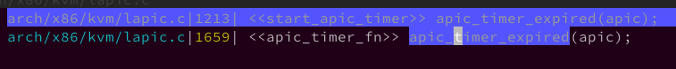

guest 的 lapic 是通过 host 上的 hrtimer 模拟的, guest 的 timer 到期后, vCPU 收到 host 上 hrtimer interrupt(`apic_timer_fn`), 导致 vCPU vmexit, KVM 把这个 timer interrupt inject 给 guest, guest 里最终感受到了 timer fire 的 interrupt, 这个过程比较长, 等 guest 里感受到 timer fire 的时候, 实际已经格外经历了上述虚拟化 tax.  社区的 advance lapic timer 让 guest 的 timer 提前到期, 这样加上虚拟化层的 tax, 期望 guest 感受到 timer fire 的时间与 guest 期望的 timer 到期时间接近.

# timer advance

第一版代码是整个思想, 所以
1. git show 7c6a98df/d0659d94/6c19b753 查看第一次的代码修改(也可以看 mail list), 如果有疑问, 可以查看修改的各个版本
2. reset 回第一版三个 patch 都有的版本的代码, 查看当时系统情况

当时系统是通过 hrtimer 来模拟 guest 中 tscdeadline timer, 通过添加一个选项来提前到期, 并在 VM-entry 时自旋忙等它一直到实际的到期时间.

注意: 这个选项需要**动态调整**来为特定的硬件/guest 组合找到**合适的值**.
* 一种方法是衡量`apic_timer_fn`和`VM-entry`之间的**平均延迟**.
* 另一种方法是从 1000ns 开始, 然后以 500ns 的增量**增加该值**, 直到 cyclictest 的平均测试数停止减少. (until avg cyclictest numbers stop decreasing.)

定义了模块参数`lapic_timer_advance_ns`, 这就是 advanced 值, 即引入的那个选项.

```diff
--- a/arch/x86/kvm/x86.c
+++ b/arch/x86/kvm/x86.c
@@ -108,6 +108,10 @@ EXPORT_SYMBOL_GPL(kvm_max_guest_tsc_khz);
 static u32 tsc_tolerance_ppm = 250;
 module_param(tsc_tolerance_ppm, uint, S_IRUGO | S_IWUSR);

+/* lapic timer advance (tscdeadline mode only) in nanoseconds */
+unsigned int lapic_timer_advance_ns = 0;
+module_param(lapic_timer_advance_ns, uint, S_IRUGO | S_IWUSR);
+
 static bool backwards_tsc_observed = false;

--- a/arch/x86/kvm/x86.h
+++ b/arch/x86/kvm/x86.h
@@ -170,5 +170,7 @@ extern u64 kvm_supported_xcr0(void);

 extern unsigned int min_timer_period_us;

+extern unsigned int lapic_timer_advance_ns;
+
```

在设置定时器时候(`start_apic_timer`), 之前的代码设置 hrtimer 的超时时间是`now + (tscdeadline 值 - 当前虚拟机 tsc 值)`, 模式是绝对时间(`HRTIMER_MODE_ABS`).

而在新方案下, 有了 advanced, 让其提前到期, 即将原有的 hrtimer 到期时间减去提前值(`lapic_timer_advance_ns`), 如下.

```diff
--- a/arch/x86/kvm/lapic.c
+++ b/arch/x86/kvm/lapic.c
@@ -1137,6 +1189,7 @@ static void start_apic_timer(struct kvm_lapic *apic)
               	/* lapic timer in tsc deadline mode */
               	u64 guest_tsc, tscdeadline = apic->lapic_timer.tscdeadline;
               	u64 ns = 0;
+               ktime_t expire;
               	struct kvm_vcpu *vcpu = apic->vcpu;
               	unsigned long this_tsc_khz = vcpu->arch.virtual_tsc_khz;
               	unsigned long flags;
@@ -1151,8 +1204,10 @@ static void start_apic_timer(struct kvm_lapic *apic)
               	if (likely(tscdeadline > guest_tsc)) {
                       	ns = (tscdeadline - guest_tsc) * 1000000ULL;
                       	do_div(ns, this_tsc_khz);
+                       expire = ktime_add_ns(now, ns);
+                       expire = ktime_sub_ns(expire, lapic_timer_advance_ns);
                       	hrtimer_start(&apic->lapic_timer.timer,
-                               ktime_add_ns(now, ns), HRTIMER_MODE_ABS);
+                                     expire, HRTIMER_MODE_ABS);
               	} else
                       	apic_timer_expired(apic);
```

在 kvm_timer 引入了一个`expired_tscdeadline`变量

```diff
--- a/arch/x86/kvm/lapic.h
+++ b/arch/x86/kvm/lapic.h
@@ -14,6 +14,7 @@ struct kvm_timer {
        u32 timer_mode;
        u32 timer_mode_mask;
        u64 tscdeadline;
+       u64 expired_tscdeadline;
        atomic_t pending;                       /* accumulated triggered timers */
 };
```

在 apic timer 过期函数`apic_timer_expired`中设置了该变量, 等于设置 tscdeadline 的值, 表明这是 tscdeadline 模式下的**实际要过期的目标 tscdeadline 值**(没有包含提前值).

```diff
--- a/arch/x86/kvm/lapic.c
+++ b/arch/x86/kvm/lapic.c
@@ -1073,6 +1074,7 @@ static void apic_timer_expired(struct kvm_lapic *apic)
 {
        struct kvm_vcpu *vcpu = apic->vcpu;
        wait_queue_head_t *q = &vcpu->wq;
+       struct kvm_timer *ktimer = &apic->lapic_timer;

        /*
         * Note: KVM_REQ_PENDING_TIMER is implicitly checked in
@@ -1087,11 +1089,61 @@ static void apic_timer_expired(struct kvm_lapic *apic)

        if (waitqueue_active(q))
                wake_up_interruptible(q);
+       // 如果是 lvtt 的 tscdeadline 模式
+       if (apic_lvtt_tscdeadline(apic))
+               ktimer->expired_tscdeadline = ktimer->tscdeadline;
+}
```

而根据查找, 发现对`apic_timer_expired`的调用只有两个.



第一个是`start_apic_timer`, 设置 apic timer 定时器时候, 当定时器是 tscdeadline 模式时候, 并且虚拟机 tsc 值已经大于等于设置的 tscdeadline 值(即表明设置定时器期间已经到期了)

```cpp
// arch/x86/kvm/lapic.c
static void start_apic_timer(struct kvm_lapic *apic)
{
        ......
        } else if (apic_lvtt_tscdeadline(apic)) {
                ......
                if (likely(tscdeadline > guest_tsc)) {
                        ......
                } else
                        apic_timer_expired(apic);
        }
}
```

第二个就是 hrtimer 到期的中断回调函数`apic_timer_fn`, 而因为在启用 hrtimer 时减去了 advanced 值, 所以 hrtimer 会提前到期.

无论是**设置定时器**, 还是**hrtimer 到期回调**, 都是 vm-exit 后的动作, 然后在`vm-entry`之前, 会调用`wait_lapic_expire()`, 延迟等待到期(这是因为 timer 提前到期, 所以可能还没到到期时间).

原有方案, 设置 timer, vmexit 后设置 hrtimer, 然后 hrtimer 到期, 发生 vmexit 后进行注入, 这必然有 exit 后以及处理延迟.

新的方案, 设置 timer, vmexit 后设置 hrtimer(但是让提前到期), 然后 hrtimer 到期, 发生 vmexit 后进行注入, 但是因为是提前到期, 所以多等直到真正到期.

```diff
--- a/arch/x86/kvm/x86.c
+++ b/arch/x86/kvm/x86.c
@@ -6312,6 +6316,7 @@ static int vcpu_enter_guest(struct kvm_vcpu *vcpu)
        }

        trace_kvm_entry(vcpu->vcpu_id);
        // 延迟等待 timer 到期再 vm-entry
+       wait_lapic_expire(vcpu);
        kvm_x86_ops->run(vcpu);

        /*
```

`wait_lapic_expire()`如下

```diff
--- a/arch/x86/kvm/lapic.c
+++ b/arch/x86/kvm/lapic.c
+void wait_lapic_expire(struct kvm_vcpu *vcpu)
+{
+       struct kvm_lapic *apic = vcpu->arch.apic;
+       u64 guest_tsc, tsc_deadline;
+       // vcpu 没有 lapic
+       if (!kvm_vcpu_has_lapic(vcpu))
+               return;
+       // 如果 expired_tscdeadline 为 0
+       if (apic->lapic_timer.expired_tscdeadline == 0)
+               return;
+       // 如果没有 timer 中断请求被注入, 直接返回
+       if (!lapic_timer_int_injected(vcpu))
+               return;
+       // 获取 要过期的目标 tscdeadline 值
+       tsc_deadline = apic->lapic_timer.expired_tscdeadline;
+       // 清空
+       apic->lapic_timer.expired_tscdeadline = 0;
+       // 获取虚拟机 tsc
+       guest_tsc = kvm_x86_ops->read_l1_tsc(vcpu, native_read_tsc());
+
+       /* __delay is delay_tsc whenever the hardware has TSC, thus always.  */
+       // 如果要过期的目标 tscdeadline 值 大于 虚拟机 tsc
+       // 延迟等待到期
+       if (guest_tsc < tsc_deadline)
+               __delay(tsc_deadline - guest_tsc);
 }
```

从这里也可以看到, 判断是否已经有中断请求被注入, 有两种
* posted interrupt, 看 posted-interrupt 描述符的 pir 对应位是否置位
* 正常中断, 看 apic 的 ISR 是否置位

```diff
--- a/arch/x86/kvm/vmx.c
+++ b/arch/x86/kvm/vmx.c
@@ -435,6 +435,11 @@ static int pi_test_and_set_pir(int vector, struct pi_desc *pi_desc)
        return test_and_set_bit(vector, (unsigned long *)pi_desc->pir);
 }

+static int pi_test_pir(int vector, struct pi_desc *pi_desc)
+{
+       return test_bit(vector, (unsigned long *)pi_desc->pir);
+}
+
@@ -6968,6 +6974,13 @@ static int handle_invvpid(struct kvm_vcpu *vcpu)
        return 1;
 }

+static bool vmx_test_pir(struct kvm_vcpu *vcpu, int vector)
+{
+       struct vcpu_vmx *vmx = to_vmx(vcpu);
+
+       return pi_test_pir(vector, &vmx->pi_desc);
+}
+

--- a/arch/x86/kvm/lapic.c
+++ b/arch/x86/kvm/lapic.c
+/*
+ * On APICv, this test will cause a busy wait
+ * during a higher-priority task.
+ */
+// 判断是否已经有 LVTT 请求, 即 timer 中断请求
+static bool lapic_timer_int_injected(struct kvm_vcpu *vcpu)
+{
+       struct kvm_lapic *apic = vcpu->arch.apic;
+       u32 reg = kvm_apic_get_reg(apic, APIC_LVTT);
+
+       if (kvm_apic_hw_enabled(apic)) {
+               int vec = reg & APIC_VECTOR_MASK;
+               // 测试是否已经存在 LVTT 的 posted-interrupt 请求
+               if (kvm_x86_ops->test_posted_interrupt)
+                       return kvm_x86_ops->test_posted_interrupt(vcpu, vec);
+               else {
+                       // 是否已经有 LVTT 请求
+                       if (apic_test_vector(vec, apic->regs + APIC_ISR))
+                               return true;
+               }
+       }
+       return false;
+}
```

## 社区相关 patch

1. 最初代码: 对 tscdeadline hrtimer 过期动态调整

KVM: x86: add option to advance tscdeadline hrtimer expiration, 涉及三个 patch:
* 7c6a98dfa1ba9dc64a62e73624ecea9995736bbd, `KVM: x86: add method to test PIR bitmap vector`
* d0659d946be05e098883b6955d2764595997f6a4, `KVM: x86: add option to advance tscdeadline hrtimer expiration`
* 6c19b7538f5ae2b6cdf91ab29f7fddf7320ece5b, `KVM: x86: add tracepoint to wait_lapic_expire`

相关的 maillist 如下

* v1:
* v2:
* v3: https://www.spinics.net/lists/kvm/msg111674.html
* v4: https://www.spinics.net/lists/kvm/msg111880.html
* v5: https://www.spinics.net/lists/kvm/msg111895.html
* v6(最终合入版本): https://lore.kernel.org/kvm/20141223205841.410988818@redhat.com/


* KVM: x86: fix lapic_timer_int_injected with APIC-v, f9339860384aaa104d85f59b75921941b39a45fc
* KVM: x86: revert "add method to test PIR bitmap vector", 2e6d015799d523dcce11c7d1465e6feb7b69fab1


# 自动动态调节 lapic_timer_advance_ns

## 社区相关 patch

KVM: LAPIC: Tune lapic_timer_advance_ns automatically

3b8a5df6c4dc6df2ab17d099fb157032f80bdca2

相关 mail list 如下

* v1: https://patchwork.kernel.org/project/kvm/patch/1538115136-20092-1-git-send-email-wanpengli@tencent.com/
* v2: https://lkml.org/lkml/2018/10/9/162


KVM: LAPIC: Tune lapic_timer_advance_ns smoothly

d0f5a86a34072c46b7fe1b8f8768e666d9d6f87f


cat /sys/module/kvm/parameters/lapic_timer_advance_ns

cat /sys/kernel/debug/kvm/108312-12/vcpu0/lapic_timer_advance_ns