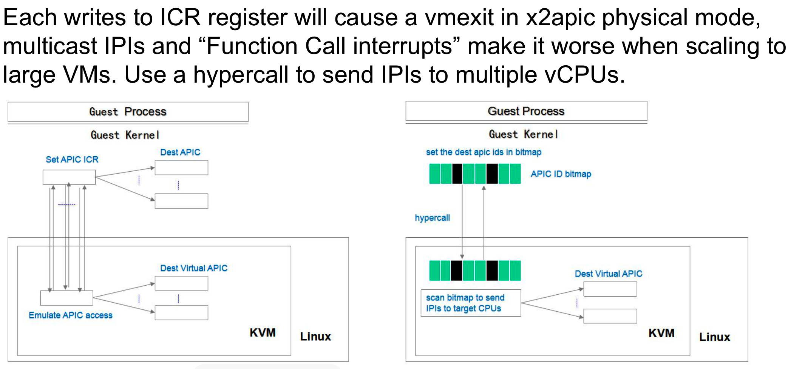

qemu 未模拟 interrupt remapping, linux 虚机强行使用 phys mode 的 x2apic, 导致在 flush tlb 这样的群发 ipi 时触发多次 vmexit.

阿里的解决方法: 修改 guest 的 ipi 发送函数, 把 phys mode 下逐个发送 ipi 转成批量发送 ipi(从而成为一种比 cluster mode 更好的 ipi 发送方式)从而降低 vmexit 次数.

我在 2016 年 12 月确实也注意到了这个 phys mode x2apic 的问题, 也想了一个解决方案, 不过没有对外推.

对他们的这个方案我一方面表示"呵呵", 另一方面还得要承认: 虽然我的方案在代码改动量上占优 (只改 2 行 linux 代码), 他们的方案实现了最大程度的 ipi 聚合(但实际差距有多大?)

Using hypercall to send IPIs by one vmexit insead of one by one for xAPIC/x2APIC physical mode and one vmexit per-cluster for x2APIC cluster mode. Intel guest can enter x2apic cluster mode when interrupt remmaping is enabled in qemu, however, latest AMD EPYC still just supports xapic mode which can get great improvement by PV IPIs. This patchset supports PV IPIs for maximal 128 vCPUs VM, it is big enough for cloud environment currently, supporting more vCPUs needs to introduce more complex logic, in the future this might be extended if needed.

在 xAPIC/x2APIC physical 模式下, ipi 是通过写 ICR 寄存器实现, 而且每写一次造成一次 vm-exit, 所以在大规格子机中广播 ipi 会有很大开销.

在 x2APIC cluster 模式下, 一个 cluster 发送一个 ipi, 也就是会产生一次 vm-exit.

IPI(核间中断)是通过写 ICR 寄存器实现, 而每写一次 ICR 就会产生一次 vmexit, 所以大规格子机中广播 IPI 会带来很大的开销, 会有很明显的性能下降, 而现有机制已基本没有优化空间.

我们提出了一个 PV 机制, 把 IPI 目标 vCPU 信息记录在 bitmap 中, 通过 hypercall 发送这个 bitmap 给 KVM, 只会一次 vmexit, 从而减少了巨量的 vmexit 开销, 显著提升性能.

使用 ipi benchmark 测试, SW3 机型(1VM)性能提升 61%.

https://lwn.net/Articles/758906/

ipi benchmark: https://lkml.org/lkml/2017/12/19/141