- [1. 历史](#1-历史)
- [2. 开源协议](#2-开源协议)
- [3. 架构设计思路](#3-架构设计思路)
- [4. 逻辑架构](#4-逻辑架构)
  - [4.1. Hypervisor](#41-hypervisor)
  - [4.2. Domain 0](#42-domain-0)
  - [4.3. Domain U](#43-domain-u)
- [5. 虚拟化类型](#5-虚拟化类型)
  - [5.1. 半虚拟化(PV)](#51-半虚拟化pv)
  - [5.2. 完全虚拟化(HVM)](#52-完全虚拟化hvm)
  - [5.3. CPU 完全虚拟化, IO 半虚拟化(PVHVM)](#53-cpu-完全虚拟化-io-半虚拟化pvhvm)
- [6. Xen 基本体系架构及运行原理](#6-xen-基本体系架构及运行原理)
  - [6.1. Xen 体系架构](#61-xen-体系架构)
  - [6.2. 不同虚拟技术的运行机制](#62-不同虚拟技术的运行机制)
    - [6.2.1. 半虚拟化技术实现原理](#621-半虚拟化技术实现原理)
    - [6.2.2. 完全虚拟化技术实现原理](#622-完全虚拟化技术实现原理)
  - [6.3. Domain 管理和控制](#63-domain-管理和控制)
    - [6.3.1. Xend](#631-xend)
    - [6.3.2. Xm](#632-xm)
    - [6.3.3. Xenstored](#633-xenstored)
    - [6.3.4. Libxenctrl](#634-libxenctrl)
    - [6.3.5. Qemu-DM](#635-qemu-dm)
    - [6.3.6. Xen Virtual Firmware](#636-xen-virtual-firmware)
  - [6.4. 半虚拟化环境下 Domain 0 与 Domain U 通信](#64-半虚拟化环境下-domain-0-与-domain-u-通信)
- [7. Xen 对 CPU / 内存 / IO 虚拟化的实现思路](#7-xen-对-cpu--内存--io-虚拟化的实现思路)
  - [7.1. Xen 对 CPU 和内存的虚拟化过程](#71-xen-对-cpu-和内存的虚拟化过程)
  - [7.2. Xen 对 IO 设备的虚拟化过程](#72-xen-对-io-设备的虚拟化过程)
- [8. Xen 的网络架构](#8-xen-的网络架构)
  - [8.1. Xen 支持三种网络工作模式](#81-xen-支持三种网络工作模式)
  - [8.2. Xen Domain U Guests 发送数据包处理流程](#82-xen-domain-u-guests-发送数据包处理流程)
  - [8.3. Xen 中虚拟网卡与物理网卡之间的关系](#83-xen-中虚拟网卡与物理网卡之间的关系)
- [9. Xen 的工具栈](#9-xen-的工具栈)
- [10. Xen 发展历程](#10-xen-发展历程)
  - [10.1. Xen 版本发布简史](#101-xen-版本发布简史)
  - [10.2. Linux Kernel 对 Xen 的支持](#102-linux-kernel-对-xen-的支持)
- [11. Xen 前景](#11-xen-前景)

# 1. 历史

早在 20 世纪 90 年代, 伦敦剑桥大学的 Ian Pratt 和 Keir Fraser 在一个叫做 Xenoserver 的研究项目中, 开发了 Xen 虚拟机. 作为 Xenoserver 的核心, Xen 虚拟机负责管理和分配系统资源, 并提供必要的统计功能. 在那个年代, X86 的处理器还不具备对虚拟化技术的硬件支持, 所以 Xen 从一开始是作为一个准虚拟化的解决方案出现的. 因此, 为了支持多个虚拟机, **内核必须针对 Xen 做出特殊的修改才可以运行**.

为了吸引更多开发人员参与, 2002 年 Xen 正式被开源. 在先后推出了 1.0 和 2.0 版本之后, Xen 开始被诸如 Redhat, Novell 和 Sun 的 Linux 发行版集成, 作为其中的虚拟化解决方案.

2004 年, Intel 的工程师开始为 Xen 添加硬件虚拟化的支持, 从而为即将上市的新款处理器做必需的软件准备.

在他们的努力下, 2005 年发布的 Xen 3.0, 开始正式支持 Intel 的 VT 技术和 IA64 架构, 从而 Xen 虚拟机可以运行完全没有修改的操作系统.

2007 年 10 月, 思杰公司出资 5 亿美金收购了 XenSource, 变成了 Xen 虚拟机项目的东家.

与 Xen 在功能开发上的快速进展形成对比的是, Xen 在将它对内核的修改集成进入内核社区方面进展不大. 有部分重要的内核开发人员不喜欢 Xen 的架构和实现, 多位内核维护人员公开声明不欢迎 Xen. 这样的形势一直持续到 2010 年, 在基于内核的 PVOPS 对 Xen 做了大量重写之后, 内核社区才勉强接纳了 Xen. 当然, 目前从 Linux 3.0 版本开始的内核主干对 Xen 的支持还是越来越好了.

# 2. 开源协议

Xen 主要采用 GNU General Public License v2(GPLv2)开源协议, 同时部分代码使用了 BSD 许可证.

* GPLv2 协议: 这是一种具有传染性的开源许可证. 它赋予用户运行, 修改和重新分发软件的自由, 但要求基于该软件的衍生作品也必须以 GPLv2 许可发布其源代码. 也就是说, 如果对采用 GPLv2 许可的 Xen 代码进行修改并分发修改后的版本, 那么 **修改后的版本也需要开源**.

* BSD 许可证: 相对较为宽松, 允许在保留版权声明和许可声明的前提下, 自由地使用, 修改和重新分发软件, 包括将其用于商业产品, 且 **不必公开衍生作品的源代码**. 不过 Xen 中使用 BSD 许可的部分占比相对较小.

Linux 和 QEMU 也都是 GPLv2 协议

# 3. 架构设计思路

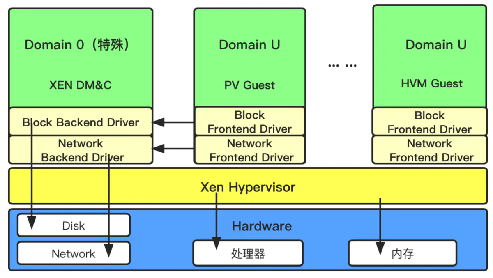

Xen 仅对 **CPU** 和 **Memory** 直接接管, 而其它 **IO 硬件驱动**则由其上运行的**第一个虚拟机**来提供支持, 它能够在计算机硬件上并发的运行多个客户操作系统(Guest OS). 支持 x86,x86-64, 安腾( Itanium),Power PC 和 ARM 多种处理器, 因此 Xen 可以在大量的计算设备上运行, 目前 Xen 支持 Linux,NetBSD,FreeBSD,Solaris, Windows 和其他常用的操作系统作为客户操作系统在其管理程序上运行.

Xen 默认认为自己是直接运行于硬件层之上的虚拟化软件(即 Xen Hypervisor 层), 并且可以直接驱动 CPU 和内存, 需注意 CPU 和内存是所有想要运行的操作系统必须能直接支持的, 但 Xen 为保证自身的小巧, 它并没有提供虚拟机的管理接口, 因此它采用了一种独特的方式, 先运行一台特权虚拟机(即 Domain 0), 且这台 VM 必须支持 Kernel 的修改, 因此选择开源的 Linux 做为特权 VM 是最合适的, 这样也可方便采用 Linux 所支持的方式来开发虚拟机管理接口, 实现与 Xen Hypervisor 层直接交互来完成为 VM 分配 CPU 和内存资源及创建, 删除, 停止, 启动 VM 的管理接口. 通常这台特权虚拟机一定会采用当前比较流行的 Linux 发行版, 因为它能支持更多 IO 硬件设备, 如: 网卡, 磁盘, 显卡, 声卡等; 到目前为止, NetBSD,GNU/Linux,FreeBSD 和 Plan 9,OpenSolaris 等系统已经支持已半虚拟化方式运行在 Xen 的 DomU 中. 目前 Xen 已经支持 x86,x86_64 和 ARM 等平台, 并正在向 IA64,PPC 移植. 移植到其他平台从技术上是可行的, 未来有可能会实现.

Xen 虚拟机支持在不停止的情况下在多个物理主机之间实时迁移. 在操作过程中, 虚拟机在没有停止工作的情况下内存被反复地复制到目标机器. 虚拟机在最终目的地开始执行之前, 会有一次 60-300 毫秒的非常短暂的暂停以执行最终的同步化, 给人无缝迁移的感觉. 类似的技术被用来暂停一台正在运行的虚拟机到磁盘, 并切换到另外一台, 第一台虚拟机在以后可以恢复.

# 4. 逻辑架构

Xen 虚拟环境由三部分组件组成: Xen Hypervisor, Domain 0, Domain U.

## 4.1. Hypervisor

Xen Hypervisor 是介于操作系统和硬件之间的一个软件抽象层. 它负责在各个虚拟机之间进行 CPU 调度和内存分配. Xen Hypervisor 不仅抽象出虚拟机的硬件, 同时还控制着各个虚拟机的执行. Xen Hypervisor 不会处理网络, 存储设备, 视频以及其他 I/O.

## 4.2. Domain 0

Domain 0 是特权域, 是一个修改过的 Linux kernel, 是唯一运行在 Xen Hypervisor 之上的虚拟机, 它拥有访问物理 I/O 资源的权限, 同时和系统上运行的其他虚拟机 (Domain U: PV and HVM Guest) 进行交互. Domain 0 需要在其它 Domain 启动之前启动.

Domain 0 是经过修改的 Linux 内核, 是运行在 Xen Hypervisor 之上独一无二的虚拟机, 拥有访问物理 I/O 资源的特权, 并且可以与其他运行在 Xen Hypervisor 之上的其他虚拟机进行交互. 所有的 Xen 虚拟环境都需要先运行 Domain 0, 然后才能运行其他的虚拟虚拟机.

Domain 0 在 Xen 中担任管理员的角色, 它负责管理其他虚拟虚拟机.

在 Domain 0 中包含两个驱动程序, 用于支持其他客户虚拟机对于网络和硬盘的访问请求. 这两个驱动分别是 Network Backend Driver 和 Block Backend Driver.

* Network Backend Driver 与本地网络硬件直接通信, 以此来处理来自于 Domain U 所有虚拟机访问网络设备的请求;

* Block Backend Drive 与本地存储设备进行通信, 以此来处理来自于 Domain U 的磁盘数据读写的请求.

## 4.3. Domain U

Domain U 没有直接访问物理硬件的权限(Domain U 的 "U" 是来自于英文单词 unprivileged, 是指没有权限的), 但 Domain 0 有.

* 运行在 Xen Hypervisor 上的所有半虚拟化 (paravirtualized) 虚拟机被称为 "Domain U PV Guests", 其上运行着被修改过内核的操作系统, 如 Linux,Solaris,FreeBSD 等其它 UNIX 操作系统.

* 所有的全虚拟化虚拟机被称为 "Domain U HVM Guests", 其上运行着不用修改内核的操作系统, 如 Windows 等.

无论是半虚拟化 Domain U 还是完全虚拟化 Domain U, 作为客户虚拟机系统, Domain U 在 Xen Hypervisor 上运行并行的存在多个, 他们之间相互独立, 每个 Domain U 都拥有自己所能操作的虚拟资源(如: 内存, 磁盘等). 而且允许单独一个 Domain U 进行重启和关机操作而不影响其他 Domain U.

# 5. 虚拟化类型

Xen 对虚拟机的虚拟化分为两大类, 半虚拟化 (Para virtualization) 和完全虚拟化(Hardware VirtualMachine).

## 5.1. 半虚拟化(PV)

半虚拟化 (Paravirtualization) 有些资料称为 "超虚拟化", 简称为 PV, 是 Xen 主导的虚拟化技术. 这种技术允许虚拟机操作系统感知到 自己运行在 Xen Hypervisor 上而不是直接运行在硬件上, 同时也可以识别出其他运行在相同环境中的客户虚拟机.

在 Xen Hypervisor 上运行的半虚拟化的操作系统, 为了调用系统管理程序(Xen Hypervisor), 要有选择地修改操作系统, 然而却不需要修改操作系统上运行的应用程序. 由于 Xen 需要修改操作系统内核, 所以您不能直接让当前的 Linux 内核在 Xen 系统管理程序中运行, 除非它已经移植到了 Xen 架构. 不过, 如果当前系统可以使用新的已经移植到 Xen 架构的 Linux 内核, 那么您就可以不加修改地运行现有的系统.

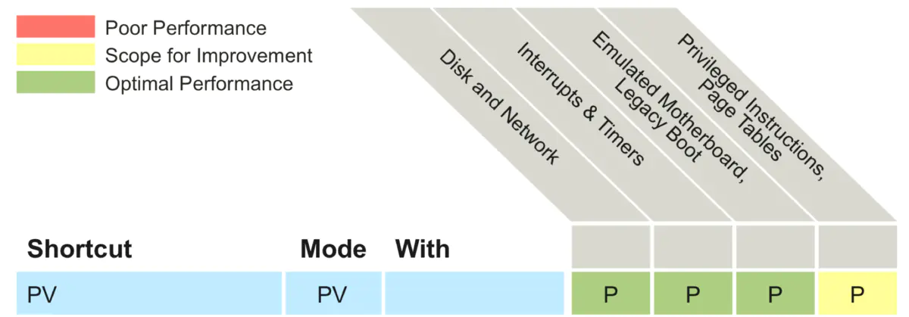

## 5.2. 完全虚拟化(HVM)

完全虚拟化 (Hardware Virtual Machine) 又称 "硬件虚拟化", 简称 HVM, 是指运行在虚拟环境上的虚拟机在运行过程中始终感觉自己是直接运行在硬件之上的, 并且感知不到在相同硬件环境下运行着其他虚拟机的虚拟技术.

在 Xen Hypervisor 运行的完全虚拟化虚拟机, 所运行的操作系统都是标准的操作系统, 即: 无需任何修改的操作系统版本. 同时也需要提供特殊的硬件设备. 值的注意的是, 在 Xen 上虚拟的 Windows 虚拟机必须采用完全虚拟化技术.

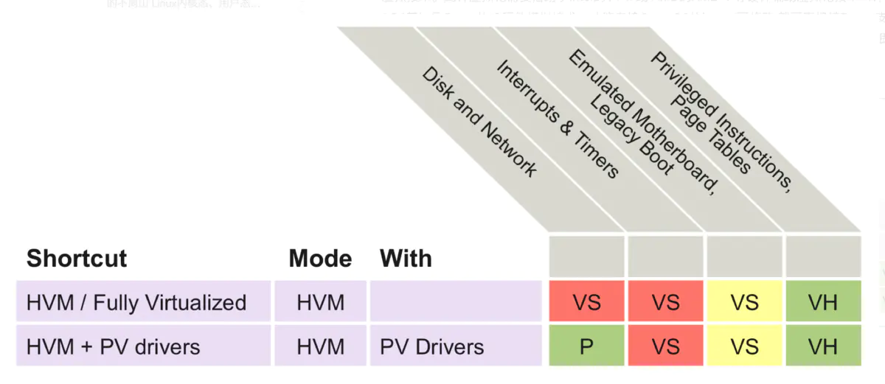

## 5.3. CPU 完全虚拟化, IO 半虚拟化(PVHVM)

为了提高性能, 完全虚拟化的 Guests 可以使用特殊的半虚拟设备驱动程序(PVHVM 或 PV-on-HVM 驱动). 这些驱动程序在 HVM 环境下优化你的 PV 驱动, 模拟的磁盘和网络 IO 旁路运行, 从而让你的 PV 在 HVM 中有更好的性能. 这意味着你在用户窗口操作方面可以得到最佳的性能.

注意, Xen 项目 PV(半虚拟化)的 Guest 自动使用 PV 驱动, 因此不需要这些驱动程序, 因为你已经自动使用优化的驱动程序. PVHVM 只会在 HVM(全虚拟化)guest 虚拟机中需要.

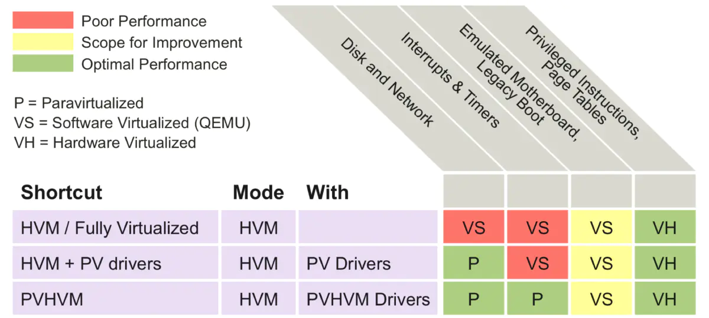

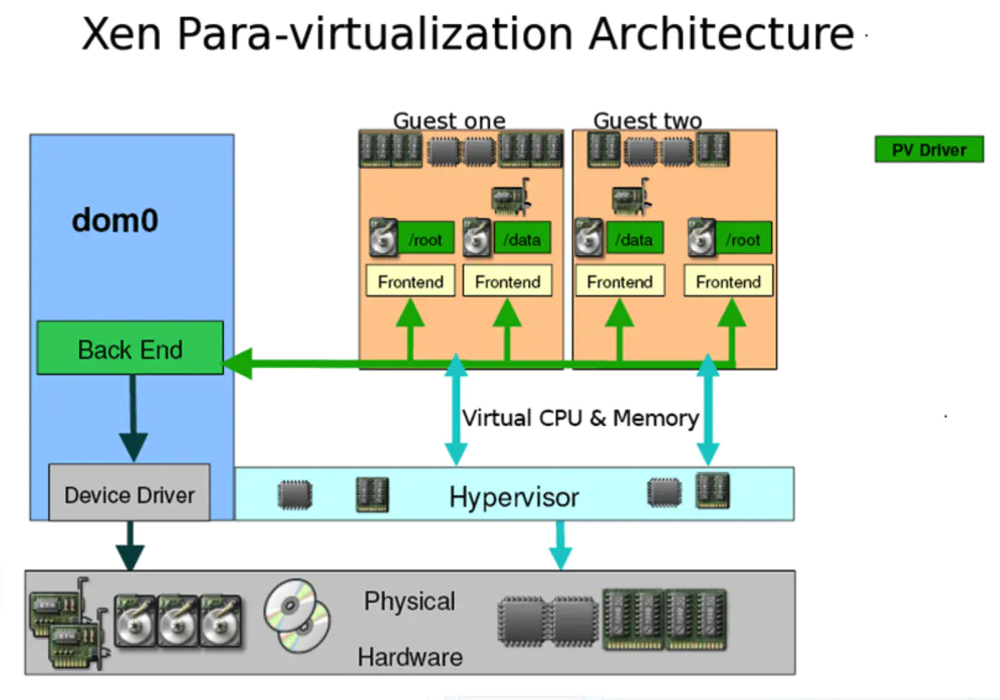

# 6. Xen 基本体系架构及运行原理

## 6.1. Xen 体系架构

Xen 的 VMM ( Xen Hypervisor ) 位于操作系统和硬件之间, 负责为上层运行的操作系统内核提供虚拟化的硬件资源, 负责管理和分配这些资源, 并确保上层虚拟机 (称为域 Domain) 之间的相互隔离. Xen 采用混合模式, 因而设定了一个特权域用以辅助 Xen 管理其他的域, 并提供虚拟的资源服务, 该特权域称为 Domain 0, 而其余的域则称为 Domain U.

Xen 向 Domain 提供了一个抽象层, 其中包含了管理和虚拟硬件的 API.Domain 0 内部包含了真实的设备驱动(原生设备驱动), 可直接访问物理硬件, 负责与 Xen 提供的管理 API 交互, 并通过用户模式下的管理工具来管理 Xen 的虚拟机环境.

Xen2.0 之后, 引入了分离设备驱动模式. 该模式在每个用户域中建立前端 (front end) 设备, 在特权域 (Dom0) 中建立后端 (back end) 设备. 所有的用户域操作系统像使用普通设备一样向前端设备发送请求, 而前端设备通过 IO 请求描述符 (IO descripror ring) 和设备通道 (device channel) 将这些请求以及用户域的身份信息发送到处于特权域中的后端设备. 这种体系将控制信息传递和数据传递分开处理.

在 Xen 体系结构设计中, 后端设备运行的特权域被赋予一个特有的名字 --- 隔离设备域 (Isolation Device Domain, IDD), 而在实际设计中, IDD 就处在 Dom0 中. 所有的真实硬件访问都由特权域的后端设备调用本地设备驱动 (native device driver) 发起. 前端设备的设计十分简单, 只需要完成数据的转发操作, 由于它们不是真实的设备驱动程序, 所以也不用进行请求调度操作. 而运行在 IDD 中的后端设备, 可以利用 Linux 的现有设备驱动来完成硬件访问, 需要增加的只是 IO 请求的桥接功能 --- 能完成任务的分发和回送.

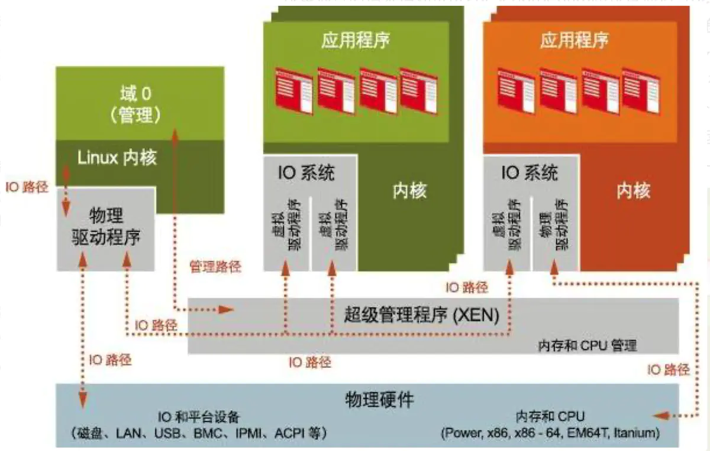

## 6.2. 不同虚拟技术的运行机制

### 6.2.1. 半虚拟化技术实现原理

采用半虚拟化技术的虚拟机操作系统能够识别到自己是运行在 Xen Hypervisor 而非直接运行于硬件之上, 并且也可以识别到在相同的机器上运行的其他虚拟机系统. 而且运行的操作系统都需要进行相应的修改.

半虚拟化客户机 (Domain U PV Guests) 包含两个用于操作网络和磁盘的驱动程序, PV Network Driver 和 PV Block Driver.
PV Network Driver 负责为 Domain U 提供网络访问功能. PV Block Driver 负责为 Domain U 提供磁盘操作功能.

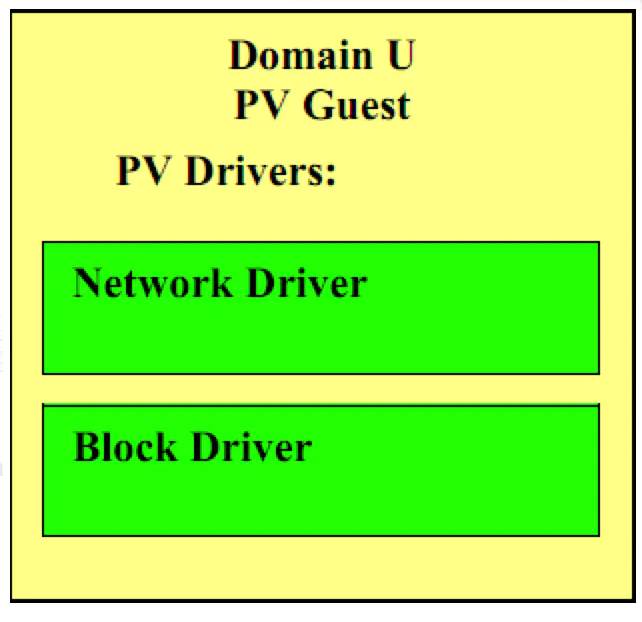

### 6.2.2. 完全虚拟化技术实现原理

完全虚拟化客户机 (Domain U HVM Guests) 运行的是标准版本的操作系统, 因此其操作系统中不存在半虚拟化驱动程序 (PV Driver), 但是在每个完全虚拟化客户机都会在 Domain 0 中存在一个特殊的精灵程序, 称作: Qemu-DM,Qemu-DM 帮助完全虚拟化客户机(Domain U HVM Guest) 获取网络和磁盘的访问操作.

完全虚拟化客户机必须和在普通硬件环境下一样进行初始化, 所以需要在其中加入一个特殊的软件 Xen virtual firmware, 来模拟操作系统启动时所需要的 BIOS.

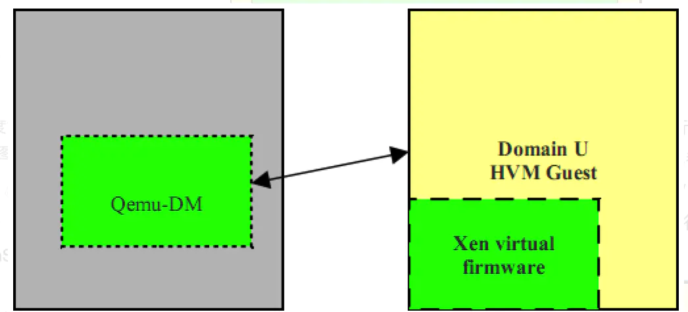

## 6.3. Domain 管理和控制

开源社区中将一系列的 Linux 精灵程序分类为 "管理" 和 "控制" 两大类. 这些服务支撑着整个虚拟环境的管理和控制操作, 并且存在于 Domain 0 虚拟机中.

下面将对直接服务进行详细的描述.

注: 为了清晰的描述 Xen 的运行流程, 画图时将精灵程序放在 Domain 0 外部来描述, 但事实上所有精灵程序都存在于 Domain 0 之中.

### 6.3.1. Xend

Xend 精灵线程是一个 Python 应用程序, 它作为 Xen 环境的系统管理员. 它利用 Libxenctrl 类库向 Xen Hypervisor 发出请求.

所有 Xend 处理的请求都是由 XM 工具使用 XML RPC 接口发送过来的.

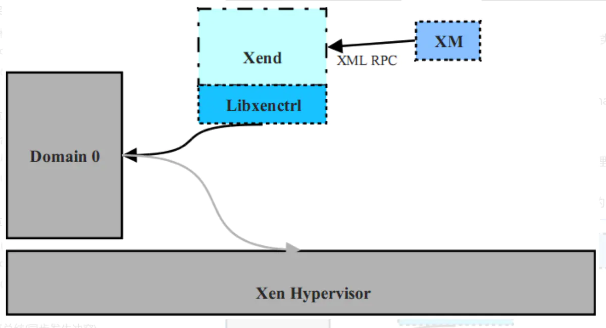

### 6.3.2. Xm

用于将用户输入通过 XML RPC 接口传递到 Xend 中的命令行工具.

### 6.3.3. Xenstored

Xenstored 精灵程序用于维护注册信息, 这些信息包括内存和在连接 Domain 0 和所有其他 Domain U 之间的事件通道. Domain 0 虚拟机利用这些注册信息来与系统中其他虚拟机建立设备通道, 即帮助 Domain U 虚拟机访问硬件资源.

### 6.3.4. Libxenctrl

Libxenctrl 是 C 程序类库, 用于让 Xend 具有通过 Domain 0 与 Xen Hypervisor 进行交互的能力. 在 Domain 0 中存在一个特殊的驱动程序称作 privcmd, 它将请求发送给 Hypervisor.

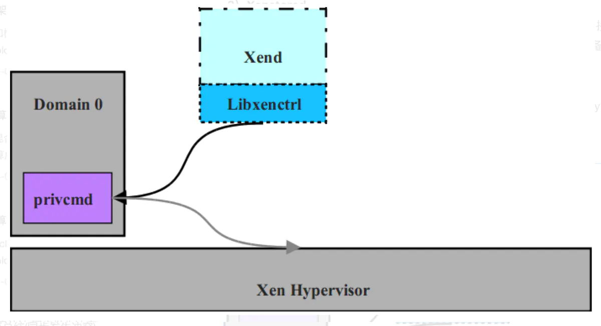

### 6.3.5. Qemu-DM

在 Xen 环境下, 每个完全虚拟化虚拟机都需要拥有自己的 Qemu 精灵程序. Qemu-DM 处理在 Xen 环境下完全虚拟化客户机所能允许执行的所有关于网络 和磁盘请求和操作. Qemu 程序必须存在于 Hypervisor 之外同时又需要访问网络和 I/O, 所以 Qemu-DM 必须存在于 Domain 0 中(参见前面章节对 Domain 0 的描述).

未来版本的 Xen 中, 一种新的工具 Stub-DM 将会提供一系列对所有完全虚拟化客户机都可用的服务, 以此来替代需要在每个虚拟机上都生成一个 Qemu 的逻辑.

### 6.3.6. Xen Virtual Firmware

Xen Virtual Firmware 是被嵌入到所有完全虚拟化客户机中的虚拟 BIOS 系统, 来确保所有客户操作系统在正常启动操作中接收到标准的启动指令集并提供标准的软件兼容环境.

## 6.4. 半虚拟化环境下 Domain 0 与 Domain U 通信

根据前几章节所述, Xen Hypervisor 不负责处理网络和磁盘请求, 因此半虚拟化客户机 (Domain U PV) 必须通过 Domain 0 与 Xen Hypervisor 进行通信, 从而完成网络和磁盘的操作请求. 下面以半虚拟化客户机 (Domain U PV) 执行向本地磁盘写入数据为例描述 Domain 0 与 Domain U PV 的交互过程.

半虚拟化客户机 (Domain U PV) 的 PV Block Driver 接收到要向本地磁盘写入数据的请求, 然后通过 Xen Hypervisor 将与 Domain 0 共享的本地内存中的数据写入到本地磁盘中. 在 Domain 0 和半虚拟化 Domain U 之间存在事件通道, 这个通道允许它们之间通过存在于 Xen Hypervisor 内的异步中断来进行通信. Domain 0 将会接收到一个来自于 Xen Hypervisor 的系统中断, 并触发 Domain 0 中的 Block Backend 驱动程序去访问本地系统内容, 并从与半虚拟化客户机的共享内存中读取适合的数据块. 从共享内存中读取的数据随后被写入到本地磁盘的指定位置中.

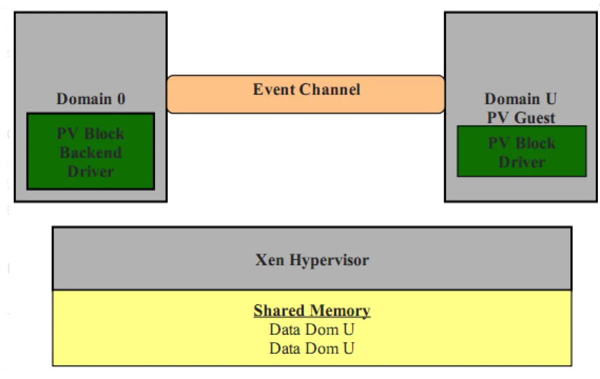

上图中所显示的事件通道是直接连接 Domain 0 和 Domain U PV 是为了清晰和简单的描述系统是如何运行的. 但事实上, 事件通道 (Event Channel) 运行于 Xen Hypervisor 中, 并在 Xenstored 中注册特定的系统中断, 以此来让 Domain 0 和 Domain U PV 能够通过本地内存快速的共享信息.

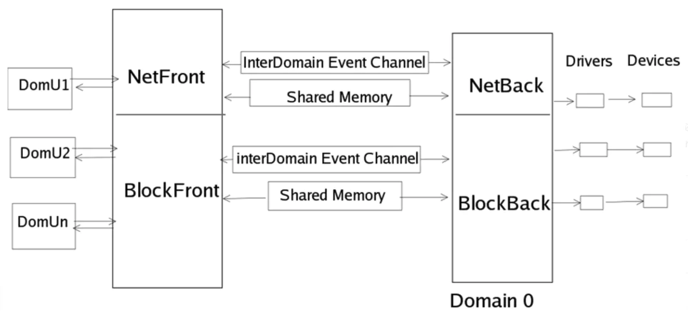

# 7. Xen 对 CPU / 内存 / IO 虚拟化的实现思路

## 7.1. Xen 对 CPU 和内存的虚拟化过程

Xen 在给 VM 提供 CPU 的虚拟化时, 它采用的也是在 Xen hypervisor 层启动一个线程, 并将这些线程映射到某个物理核心上, 当然通过 DomU 的配置文件中的 cpus 可以指定将这些模拟 CPU 的线程绑定到某几个物理核心上; 而内存的虚拟化则是内存页的映射, 将物理内存上多个连续或不连续的内存页映射给 VM, 让 VM 看来这就是一个完整的连续的内存空间.

## 7.2. Xen 对 IO 设备的虚拟化过程

当启动一个用户 VM(DomU)时, 该 VM 所需的 CPU 和内存都由 Xen Hypervisor 提供, 而它若需要使用 IO 设备时, 则向特权 VM(即 Dom0)发起请求, 特权 VM 会为该用户 VM 创建一个模拟的硬件设备线程, 并运行于特权 VM 的用户空间, 当用户 VM 向该 IO 硬件发起调用时, 特权 VM 上相应的模拟设备接收请求并将其转化为特权 VM 对 IO 硬件的操作, 交给特权 VM 的内核来代为完成其操作. 这里需注意这些虚拟 IO 硬件需要由 Qemu 来模拟, Xen 本身并没有提供相应的模拟功能.(注: 特权 VM 的 CPU 和内存也是有 Xen Hypervisor 提供)

1)Qemu 模拟 IO 设备(完全虚拟化方式)

Qemu 模拟 IO 设备(完全虚拟化方式): 假如用户 VM 向特权 VM 请求磁盘, 特权 VM 可以将一个分区, 文件等, 通过 Qemu 将其模拟成一个磁盘设备, 就拿文件来说, 特权 VM 先创建一个映像文件, 再通过 Qemu 为该文件模拟一个磁盘控制器芯片; 然后, 将其映射到用户 VM 上, 当然模拟的这个磁盘控制器芯片一定是一个最常见的, 用户 VM 的 Kernel 一定支持的, 但需注意: 模拟的磁盘可能会与实际的物理磁盘不同, 因为要尽可能兼容. 这样一来用户 VM 假如要写数据到磁盘的过程如下:

用户 VM-APP--->用户 VM-Kernel 调用虚拟磁盘的驱动进行写数据前的准备(如: 数据写入到磁盘中的扇区位置 / 数据编码等)--->

用户 VM-Kernel 将编码后的信息发给特权 VM 的模拟磁盘进程 --->

特权 VM 的模拟磁盘进程再将编号信息还原后发给特权 VM-kernel--->

特权 VM-kernel 调用真实物理磁盘的驱动对数据进行写前准备 --->最后磁盘驱动调度磁盘完成写入

摘录补充:( http://my.oschina.net/davehe/blog/94039?fromerr=mOuCyx6W )

Xen 向 Domain 提供了一个抽象层, 其中包含了管理和虚拟硬件的 API.Domain 0 内部包含了真实的设备驱动 (原生设备驱动), 可直接访问物理硬件, Xen 提供的管理 API 可与其交互, 并通过用户模式下的管理工具(如: xm/xend,xl 等) 来管理 Xen 的虚拟机环境.

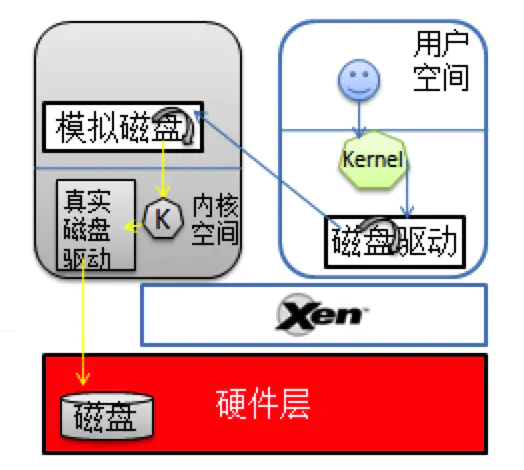

2)半虚拟化 IO 设备

半虚拟化的 IO 设备: 它与模拟最大不同是 DomU 知道自己是运行在虚拟化环境中的, 并且知道这个磁盘不是真正的磁盘, 它只是 Xen 模拟的一个磁盘前端驱动(Disk Frontend), 它要写数据时, 直接将数据交给 Disk Frontend, 而不再去调用磁盘驱动进行数据编码, 当特权 VM 端的 Disk backend 收到来自 DomU 的数据时, 也是直接转给特权 VM-Kernel, 由其直接调用物理磁盘驱动来对这些原始数据进行处理并写入磁盘.

摘录补充:( http://my.oschina.net/davehe/blog/94039?fromerr=mOuCyx6W )

Xen2.0 之后, 引入了分离设备驱动模式. 该模式在每个用户域中建立前端 (front end) 设备, 在特权域 (Dom0) 中建立后端 (back end) 设备. 所有的用户域操作系统像使用普通设备一样向前端设备发送请求, 而前端设备通过 IO 请求描述符 (IO descripror ring) 和设备通道 (device channel) 将这些请求以及用户域的身份信息发送到处于特权域中的后端设备. 这种体系将控制信息传递和数据传递分开处理(类似云计算中常说的控制面与数据面分离设计).

半虚拟化客户机 (Domain U PV) 的 PV Block Driver 接收到要向本地磁盘写入数据的请求, 然后通过 Xen Hypervisor 将自己与 Domain 0 共享的本地内存中的数据写入到本地磁盘中. 在 Domain 0 和半虚拟化 Domain U 之间存在事件通道, 这个通道允许它们之间通过存在于 Xen Hypervisor 内的异步中断来进行通信. Domain 0 将会接收到一个来自于 Xen Hypervisor 的系统中断, 并触发 Domain 0 中的 Block Backend 驱动程序去访问本地系统内容, 并从自己与半虚拟化客户机的共享内存中读取适合的数据块后, 随即被写入到本地磁盘的指定位置中.

但无论采用模拟或半虚拟化最终都是对物理磁盘的操作, 假如当前只有一个物理磁盘, 众多用户 VM 都在进行大量的读写请求, 此时, 为了避免用户 VM 无限制的向特权 VM 发起请求, 特权 VM 中采用一个环状缓存区, 每到一个 IO 请求, 就先将其塞入这个环状缓冲区的槽位中, 若缓冲区满了, 就会告诉用户 VM IO 设备繁忙. 当然其它各种 IO 设备大致都采用这种机制来控制.

# 8. Xen 的网络架构

## 8.1. Xen 支持三种网络工作模式

在虚拟化环境中虚拟网络是十分重要但又比较难, 需要特别注意;

在 Linux 中实现虚拟网络的方法中比较常用的工具有两个: bridge-utils 和 openvswitch, 它们创建的虚拟网络设备是不能相互使用的, 比如: bridge-utils 创建的桥设备, openvswitch 是无法识别的.

用下图来做简单说明:

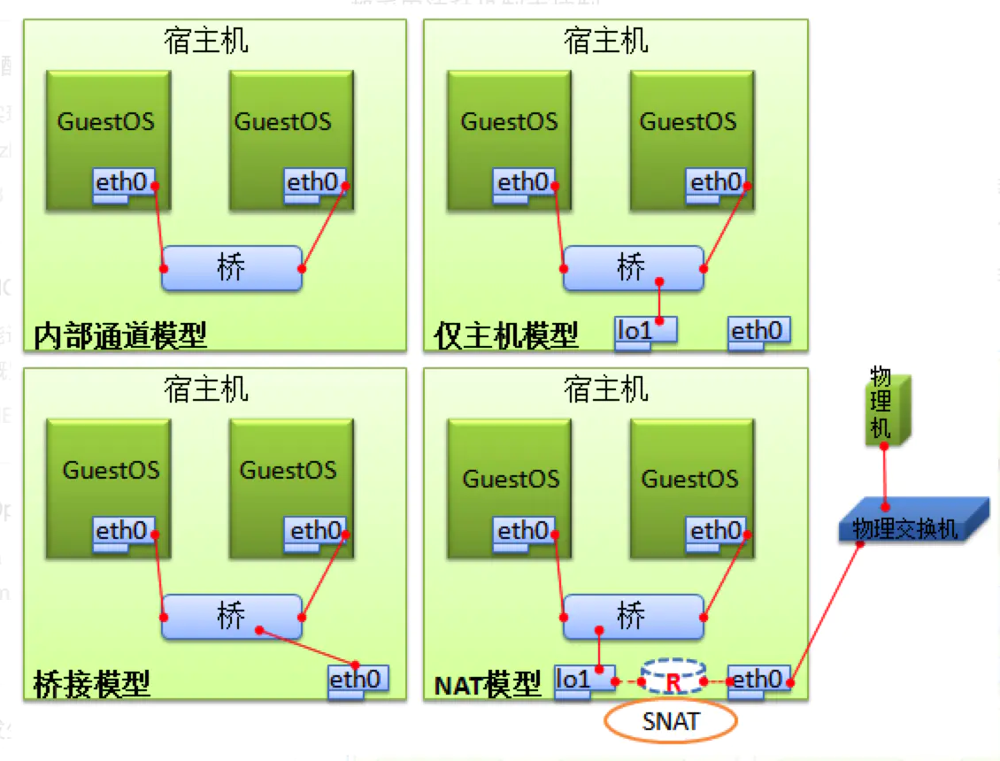

1)Bridge 模式

Xend 启动时流程:

1, 创建虚拟网桥 xenbr0;

2, 停止物理网卡 eth0;

3, 物理网卡 eth0 的 MAC 地址和 IP 地址被复制到虚拟网卡 veth0;

4, 物理网卡 eth0 重命名为 peth0;

5,Veth0 重命名为 eth0;

6,Peth0 的 MAC 地址更改( FE:FF:FF:FF:FF:FF ),ARP 功能关闭;

7, 连接 peth0,vif0.0 到网桥 xenbr0

8, 启动 peth0,vif0.0,xenbr0

Domain U 启动时的流程:

1,vif<domainID>.0 连接到 xenbr0

2, 启动 vif<domainID>.0

2)Route 模式

Xend 启动时的流程:

1, 开启 Domain 0 的 IP Forward.

Domain U 启动时的流程:

1, 创建 vif<domainID>.0 ,dom U eth0 的 IP 地址被拷贝到 vif<domainID>.

2, 启动 vif<domainID>.0.

3, 为 domU 的配置文件中指向虚拟接口 vif.0 分配的 IP 地址增加静态路由.

3)NAT 模式

NAT 模式会使用虚拟局域网 virbr0

## 8.2. Xen Domain U Guests 发送数据包处理流程

## 8.3. Xen 中虚拟网卡与物理网卡之间的关系

安装了 Xen 的 Linux 机器, 在 Dom 0 中能看到以下几类网卡(网络接口设备 ):

(X ,Y 都为数字)

pethY

ethY

xenbrY

virbrY

vifX.Y(X 为 DomaiID,Y 表示该虚拟网卡是该 Domain 的第几块虚拟网卡)

vethY (一般在 Xend 启动完成以后就不存在了)

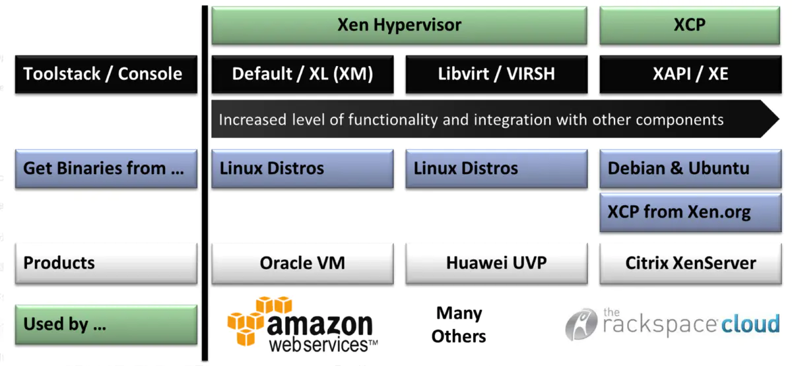

# 9. Xen 的工具栈

xend: 这是 Xen Hypervisor 的 Dom0 上运行的服务, 此服务用来监控 xm 命令发来的指令, 并完成相应的动作.

xm: Xen Management, 用来管理 VM 的创建, 删除, 启动, 快照, 删除, 停止等的管理工具.

xl: 这是一个基于 libxenlight 库的一个轻量级 VM 管理工具, 它从 Xen4.1 开始出现, 从 4.3 以后, 它被作为主要的 VM 管理工具, 而 xm 这个重量级管理工具开始被提示废弃. 以下为 xm,xl 的对比图:

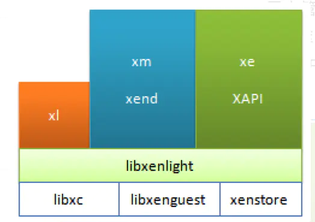

xl 和 xm 都需要调用 libxenlight, 但 xl 不需要运行任何服务, 它可直接调用 libxenlight 完成相关操作.

xe/XAPI, 是 xend 的一个 API 管理接口, 通常用于 Xen Cloud 环境中: Xen Server, XCP

virsh/ libvirt : 这是 Redhat 发起开发的一套用于管理众多不同类别的 VM 的管理工具.

virsh : 这是一个命令行工具

libvirt: 则是一个 lib 库, libvirtd 守护进程用于监听 virsh 命令操作, 并调用 lbvirt 完成相关操作.

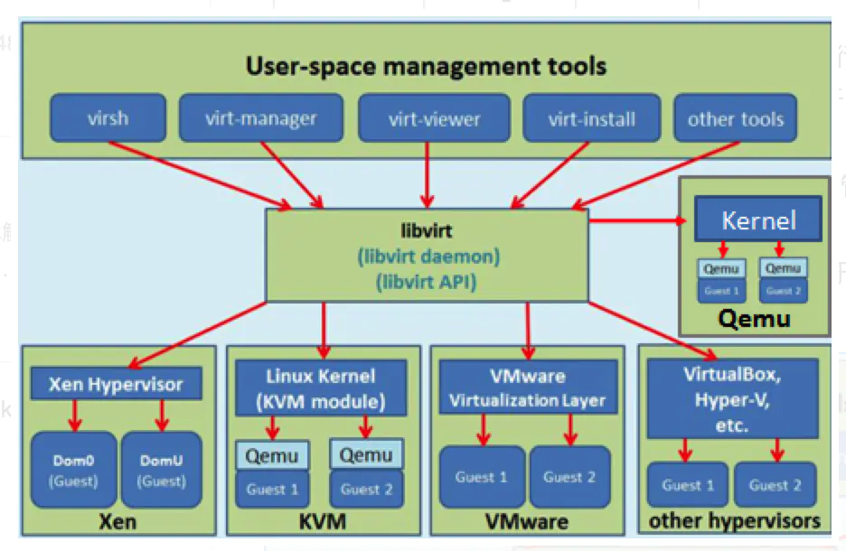

# 10. Xen 发展历程

## 10.1. Xen 版本发布简史

10 年 4 月 Xen4.0.0 发布, 改进后 Xen 的 DomU 最大可支持虚拟 CPU 64 颗, Xen 主机可支持 1TB 内存和 128 颗物理 CPU, 磁盘可支持快照和克隆; HVM 客户机支持虚拟内存页共享;

11 年 4 月发布的 Xen4.1 版后, xm/xend 开始被提示废弃, xl 这个更轻量级的 Xen VM 管理工具逐渐成为主流.

15 年为止已经发布 Xen4.5 版本, 目前 yum 源可用的最新版 Xen 是 4.6.1 版的(http://mirrors.skyshe.cn/centos/6.7/virt/x86_64/xen-46/).

## 10.2. Linux Kernel 对 Xen 的支持

Linux2.6.37:kernel 开始对 Xen 进行支持, 并加其加入到 Kernel 中.

Linux3.0:Kernel 开始对 Xen 的关键部分进行优化.

RHEL 对 Xen 的支持概况:

Redhat 系列对 Xen 的支持情况:

RHEL5.7 ~ 及以前版本: 默认的企业虚拟化技术为 Xen.

但 Redhat 提供了两种内核:

kernel-... : 这是仅允许 RHEL 系统的内核, 不能运行在 DomU 中.

kernel-xen.. : 这是需要部署 XenServer 时, 使用的 Kernel 版本.

RHEL6 ~ 及以后版本: 默认支持 KVM(收购自以色列的一款虚拟化工具), 并且不在对 Xen 做任何支持, 但允许自己运行在 DomU 中.

# 11. Xen 前景

Xen hypervisor 是一个专门为虚拟机开发的微内核, 所有其资源管理和调度策略完全是针对虚拟机的特性而开发的.

Xen 微内核直接运行于真实物理硬件只上, 开发和调试都比基于操作系统的虚拟化困难.

微内核架构和 Linux 宏内核架构本身冲突, 所以内核社区对 Xen 比较抵制. 与 KVM 形成对比.
